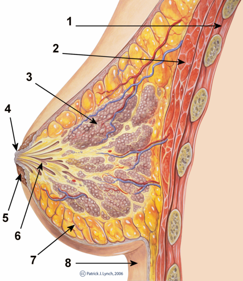
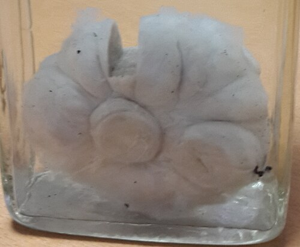

# DOENÇAS BENIGNAS DA MAMA

Para entender a mastologia benigna, você precisa primeiro desconstruir o medo da paciente. Na prática clínica e nas provas de residência, o grande desafio não é apenas dar o nome à patologia, mas sim saber diferenciar o que é fisiológico, o que é benigno mas exige acompanhamento, e o que é benigno mas sinaliza um risco aumentado para câncer.

## Embriologia e Desenvolvimento Mamário

*Figura 1 - Corte transversal da mama feminina normal demonstrando ductos lactíferos, lóbulos glandulares, tecido adiposo e muscular. Compreender essa anatomia é fundamental para localizar e classificar lesões mamárias. Fonte: Patrick J. Lynch, CC BY 3.0 | Wikimedia Commons*

Tudo começa na 5ª semana de vida fetal. O ectoderma se espessa e forma a chamada linha láctea ou crista mamária, que se estende da axila até a região inguinal. Por que isso cai em prova? Porque qualquer falha na regressão dessa linha resulta em anomalias comuns.

Se a linha não regredir totalmente, teremos a polimastia (presença de tecido mamário acessório) ou a politelia (mamilos acessórios). A localização mais comum para essas alterações é a região axilar. Lembre-se: a polimastia responde a estímulos hormonais, podendo inclusive lactar ou desenvolver tumores.

### Anomalias de Parede Torácica

Um quadro clássico que as bancas adoram é a Síndrome de Poland. Imagine um paciente com ausência da porção esternal do músculo peitoral maior associada a hipoplasia mamária ipsilateral e, por vezes, sindactilia. Isso é uma falha de desenvolvimento mesodérmico. Não confunda com simples agenesia mamária isolada.

### A Mama na Gestação e no Recém-Nascido

Durante a gestação, a mama se transforma. A partir da 3ª semana, os ductos proliferam intensamente. Clinicamente, observamos o sinal de Hunter (a rede vascular venosa visível), a hiperpigmentação da aréola e o surgimento dos tubérculos de Montgomery (glândulas sebáceas hipertrofiadas).

No recém-nascido, pode ocorrer o "leite de bruxa". É uma galactorreia fisiológica que atinge ambos os sexos entre o 3º e 5º dia de vida. Ocorre pela queda dos hormônios placentários e persistência da prolactina materna. A conduta é apenas observação e orientação; nunca esprema, pois pode causar mastite.

## Mastalgia: O Dilema do Consultório

*Figura 2 - Aspecto macroscópico de fibroadenoma mamário excisado, mostrando nódulo bem delimitado, firme e elástico - o tumor benigno mais comum da mama em mulheres jovens. Caracteristicamente móvel ao exame físico. Fonte: Alaa, CC BY-SA 4.0 | Wikimedia Commons*

A dor mamária é a queixa mais frequente na mastologia. O seu papel como médico é, primeiro, excluir o câncer (embora dor raramente seja sinal de malignidade) e, segundo, classificar a dor.

### Mastalgia Cíclica

É a dor relacionada ao ciclo menstrual, geralmente na fase lútea (pré-menstrual). Ela é bilateral, mais intensa nos quadrantes superiores externos e melhora após a menstruação. O "porquê" fisiológico reside na ação do estrogênio (que promove proliferação ductal) e da progesterona (que causa edema estromal).

### Mastalgia Não Cíclica

Não tem relação com o ciclo. Pode ser constante ou intermitente. Aqui, o diagnóstico diferencial é fundamental. Muitas vezes a dor não é na mama, mas na parede torácica (Síndrome de Tietze ou costocondrite), nevralgia intercostal ou até problemas de postura.

### Manejo da Mastalgia

Aqui está o ponto onde muitos alunos erram em questões de conduta. Segundo a FEBRASGO e a Sociedade Brasileira de Mastologia (SBM), o tratamento segue uma escada:

- Tranquilização e Orientação (AFBM): Explicar que não é câncer resolve 70 a 80 por cento dos casos.

- Suporte Mamário: Uso de sutiã esportivo adequado, inclusive para dormir, reduz a movimentação dos ligamentos de Cooper.

- Medidas Dietéticas: Embora controversas, a redução de metilxantinas (café, chá preto, chocolate) é orientada por muitos, apesar de evidência fraca.

- Farmacoterapia: Reservada para casos de dor intensa que interfere na qualidade de vida (menos de 10 por cento das pacientes).

**Tabela 1: Opções Farmacológicas na Mastalgia**

| Medicamento | Dose Sugerida | Observação Importante |
| --- | --- | --- |
| AINEs Tópicos | Gel de Diclofenaco 2 a 3x/dia | Primeira linha para dor localizada. |
| Tamoxifeno | 10 mg/dia | Muito eficaz, mas com efeitos colaterais (fogachos). |
| Danazol | 100 a 200 mg/dia | Único aprovado pelo FDA, mas causa virilização (acne, voz grossa). |
| Vitamina E | 400 a 800 UI/dia | **NÃO** tem eficácia comprovada (pegadinha de prova). |

Cuidado: A alternativa que sugere Vitamina E como conduta padrão está quase sempre errada. No MedEvo, sempre reforçamos que a primeira linha é o suporte mecânico e a tranquilização.

## Descarga Papilar: Quando se Preocupar?

Este é o tema que mais gera questões de "próximo passo diagnóstico". Você deve dividir a descarga em dois grandes grupos: Fisiológica/Benigna e Patológica (Suspeita).

### Características da Descarga Patológica

Para ser considerada suspeita, a descarga deve ser:

- Espontânea (sai sem apertar).

- Uniductal (sai por apenas um buraquinho).

- Unilateral.

- Aspecto: Sanguinolento (água de rocha), Seroso (amarelado transparente) ou Aquoso (cristalino).

Se a paciente tem uma descarga esverdeada, marrom ou leitosa, bilateral e multiductal após expressão, isso é funcional. Geralmente associado a Ectasia Ductal ou Alterações Fibrocísticas. A conduta é apenas observação e rotina de rastreamento habitual.

### Investigação da Descarga Suspeita

Se você identificou uma descarga patológica, o próximo passo é a imagem (Mamografia e Ultrassonografia).

- Se a imagem mostrar um nódulo ou lesão: Biópsia da lesão.

- Se a imagem for normal: A conduta padrão-ouro é a microductectomia (exérese do ducto comprometido). Por que? Porque a citologia da descarga tem baixa sensibilidade e um resultado negativo não exclui câncer (Carcinoma Intraductal).

O Papiloma Intraductal é a causa mais comum de descarga sanguinolenta unilateral. É uma lesão benigna, mas que muitas vezes precisa ser retirada para diagnóstico diferencial definitivo com malignidade.

## Nódulos Mamários Benignos

### Fibroadenoma

É o tumor benigno mais comum em mulheres jovens (20 a 35 anos). É um nódulo de consistência fibroelástica, móvel, bem delimitado e indolor.

- Na ultrassonografia: Nódulo hipoecoico, ovalado, com o maior eixo paralelo à pele e margens circunscritas.

- Evolução: Pode calcificar com o tempo, gerando a clássica imagem em "pipoca" na mamografia.

- Conduta: Se for pequeno (< 2 a 3 cm) e tiver características típicas em paciente jovem, pode-se apenas acompanhar. Se crescer rápido ou causar ansiedade, a exérese está indicada.

### Tumor Filoides

Cuidado aqui! Ele se parece muito com o fibroadenoma no exame físico, mas tem um crescimento muito rápido e atinge dimensões maiores. O tumor filoides tem um estroma muito celular e pode ser benigno, borderline ou maligno.
A conduta no Filoides é sempre cirúrgica com margens amplas (pelo menos 1 cm), pois ele tem uma alta taxa de recidiva local se apenas "descascado" como um fibroadenoma.

### Cistos Mamários

São extremamente comuns nas Alterações Funcionais Benignas da Mama (AFBM).

- Cisto Simples: Conteúdo anecoico, reforço acústico posterior, paredes finas. Conduta: Nada a fazer, a menos que doa. Se doer, fazemos a PAAF (Punção Aspirativa por Agulha Fina).

- Critérios de PAAF para Cisto: Se o líquido for hemorrágico ou se o cisto não sumir completamente após a aspiração, ou ainda se recidivar em curto prazo, o líquido deve ser enviado para citologia e a parede do cisto deve ser avaliada por biópsia. Se o líquido for citrino/esverdeado e o cisto sumir, o caso está resolvido.

### Esteatonecrose (Citoesteatonecrose)

É o famoso "granuloma lipofágico". Ocorre após trauma, cirurgias (como mamoplastia redutora) ou radioterapia. O grande problema é que, clinicamente e na mamografia, ele pode simular um câncer (nódulo endurecido, calcificações grosseiras ou irregulares). A história clínica de trauma é a chave para o diagnóstico.

## Processos Inflamatórios e Infecciosos

### Mastite Periareolar Recidivante (Abscesso Subareolar)

Esta é a "pedra no sapato" do mastologista. Ocorre tipicamente em mulheres jovens e tem uma associação fortíssima com o tabagismo.
O mecanismo: O fumo causa uma deficiência relativa de Vitamina A, levando a uma metaplasia escamosa dos ductos lactíferos. O ducto entope com queratina, inflama, infecta e forma um abscesso que drena na borda da aréola.
Tratamento: Antibióticos e drenagem na fase aguda. Para cura definitiva, é necessária a exérese de todos os ductos retroareolares comprometidos e, fundamentalmente, parar de fumar.

### Ectasia Ductal

Comum na perimenopausa. Os ductos se dilatam e acumulam secreção espessa. Pode causar descarga papilar multicolorida (verde, marrom) e bilateral. É uma condição benigna que não aumenta o risco de câncer.

**Tabela 2: Diagnóstico Diferencial de Lesões de Mamilo**

| Característica | Eczema Areolar | Doença de Paget |
| --- | --- | --- |
| Localização | Geralmente bilateral | Geralmente unilateral |
| Prurido | Muito frequente | Menos comum (mais dor/queimação) |
| Margens | Mal delimitadas | Bem delimitadas |
| Resposta a Corticoide | Melhora rapidamente | Não responde |
| Destruição do mamilo | Rara | Comum (erosão) |

Como ensina o Dr. Will, se você tratou um "eczema" com corticoide por 2 semanas e não melhorou, a biópsia é obrigatória para excluir Paget.

## Lesões Benignas com Risco Aumentado para Câncer

Nem toda doença benigna é "totalmente inocente". Algumas alterações histológicas conferem um Risco Relativo (RR) maior de a paciente desenvolver câncer de mama no futuro.

- Sem Proliferação (RR 1.0): Cistos, ectasia ductal, fibroadenoma simples, mastite.

- Proliferativas sem Atipia (RR 1.5 a 2.0): Hiperplasia ductal usual, papiloma intraductal, adenose esclerosante, cicatriz radial.

- Proliferativas com Atipia (RR 4.0 a 5.0): Hiperplasia Ductal Atípica (HDA) e Hiperplasia Lobular Atípica (HLA).

A Hiperplasia Ductal Atípica é a lesão benigna com maior risco de progressão. Se uma biópsia por agulha (Core Biopsy) vier com HDA, a conduta é a biópsia cirúrgica excisional, pois em até 20 a 30 por cento dos casos pode haver um carcinoma associado na peça cirúrgica que a agulha não pegou.

## Propedêutica Mamária: Ferramentas de Trabalho

### Mamografia (MMG)

O rastreamento oficial do Ministério da Saúde no Brasil é para mulheres de 50 a 74 anos, a cada 2 anos (Nota Técnica nº 626/2025). Mulheres de 40-49 podem realizar por demanda com decisão compartilhada. Já a SBM, CBR e FEBRASGO recomendam anualmente dos 40 aos 74 anos.
O achado benigno clássico é a calcificação grosseira em "pipoca" (fibroadenoma antigo) ou calcificações vasculares (em "trilho de trem").

### Ultrassonografia (USG)

É o exame de escolha para mulheres jovens (< 35 anos), gestantes ou para diferenciar massas sólidas de císticas. Não serve para rastreamento isolado em mulheres acima de 40 anos, mas é um excelente complemento para mamas densas.

### Punção Aspirativa por Agulha Fina (PAAF) vs. Core Biopsy

- PAAF: Usa agulha fina. Serve para citologia. Ótima para esvaziar cistos e avaliar linfonodos axilares. Não diferencia carcinoma in situ de invasor.

- Core Biopsy (Biópsia por agulha grossa): Retira fragmentos de tecido (histologia). É o padrão para nódulos suspeitos. Permite o diagnóstico de invasão e imuno-histoquímica.

## Situações Especiais e Pegadinhas

### Ginecomastia Puberal

Ocorre em cerca de 50 a 60 por cento dos meninos durante a puberdade (estágios de Tanner G2 ou G3). É causada por um desequilíbrio transitório entre estrogênio e testosterona.
Conduta: Tranquilização e observação. A regressão espontânea ocorre em 90 por cento dos casos em até 2 anos. Não se opera ginecomastia em adolescente antes de esperar esse período de observação, a menos que o impacto psicológico seja devastador.

### Galactocele

É um cisto de leite que ocorre em mulheres que estão amamentando ou pararam recentemente. Apresenta-se como um nódulo flutuante e indolor. A PAAF é diagnóstica (sai leite) e curativa. Se o leite estiver retido há muito tempo, pode ter aspecto de "queijo" ou massa espessa.

### Alteração Funcional Benigna da Mama (AFBM)

Antigamente chamada de "displasia mamária". É um conjunto de alterações (fibrose, cistos, metaplasia apócrina) que reflete a resposta da mama às variações hormonais. É considerada uma variação da normalidade. O quadro clínico é de mastalgia cíclica e adensamentos mamários (mamas "granuladas"). Não aumenta o risco de câncer.

**Tabela 3: Resumo de Condutas em Nódulos e Descargas**

| Achado Clínico | Conduta Inicial | Diagnóstico Provável |
| --- | --- | --- |
| Nódulo móvel, jovem | USG + Observação/Exérese | Fibroadenoma |
| Nódulo crescimento rápido | Biópsia Excisional | Tumor Filoides |
| Descarga Sanguinolenta Uniductal | Imagem + Microductectomia | Papiloma Intraductal |
| Descarga Leitosa Bilateral | Dosar Prolactina / TSH | Galactorreia (Hiperprolactinemia) |
| Nódulo após trauma | Observação | Esteatonecrose |

## Pontos-Chave para Prova

- Descarga papilar patológica: Espontânea, unilateral, uniductal, serosa ou sanguinolenta.

- Causa mais comum de descarga sanguinolenta: Papiloma intraductal.

- Tumor benigno mais comum: Fibroadenoma.

- Tumor Filoides: Exige margem cirúrgica de 1 cm devido ao risco de recidiva.

- Mastalgia: Primeira linha é tranquilização e suporte mecânico (sutiã). Vitamina E não funciona.

- Síndrome de Poland: Agenesia do peitoral maior + hipoplasia mamária.

- Mastite periareolar recidivante: Fortemente associada ao tabagismo; exige parar de fumar para curar.

- Eczema vs. Paget: Eczema é bilateral e responde a corticoide; Paget é unilateral, destrói mamilo e não responde a corticoide.

- Rastreamento MS: 50 a 74 anos, bienal, com mamografia (Nota Técnica nº 626/2025-MS).

- Lesão de maior risco para câncer: Hiperplasia Ductal Atípica (HDA).

- PAAF de cisto: Só enviar para citologia se o líquido for sanguinolento ou se houver massa residual.

- Ginecomastia puberal: Conduta é expectante (regressão espontânea na maioria).

- "Leite de bruxa": Fisiológico no RN, não espremer.

- Linha láctea: Se forma na 5ª semana a partir do ectoderma.

- Adenose esclerosante: Lesão benigna proliferativa que confere risco levemente aumentado (RR 1.5 a 2.0).

- Biópsia de descarga: Citologia de descarga papilar negativa NÃO exclui malignidade; se suspeita, operar. 🩺

 Cópia offline para consulta pessoal.
 Fonte original:
 [https://www.medevo.com.br/material-apoio/ler/4750cfaa-5b6d-4a46-a258-7141c6b1b2ef](https://www.medevo.com.br/material-apoio/ler/4750cfaa-5b6d-4a46-a258-7141c6b1b2ef)
