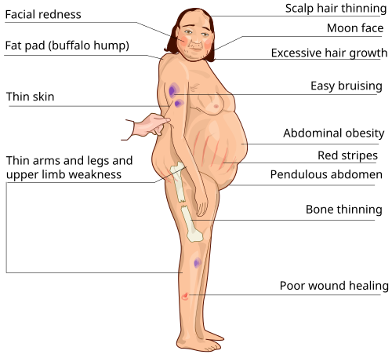

# DOENÇAS DA ADRENAL

Para entender as doenças da adrenal, você não pode decorar listas. Você precisa visualizar a glândula dividida em "camadas" e entender quem manda em quem. A adrenal é como uma fábrica com dois setores distintos: o córtex (externo) e a medula (interna).

O córtex tem três zonas, e eu uso o macete **GFR** (de Glomerular, Fasciculada e Reticular) correlacionando com **"Sal, Açúcar e Sexo"**:

- **Zona Glomerular:** Produz Mineralocorticoides (Aldosterona). Controle: Sistema Renina-Angiotensina-Aldosterona (SRAA).

- **Zona Fasciculada:** Produz Glicocorticoides (Cortisol). Controle: Eixo Hipotálamo-Hipófise-Adrenal (ACTH).

- **Zona Reticular:** Produz Androgênios (DHEA/Androstenediona). Controle: ACTH.

A **Medula** é outra história: produz Catecolaminas (Adrenalina e Noradrenalina) em resposta ao sistema nervoso simpático.

Se você entender que o ACTH controla o Cortisol e os Androgênios, mas **não** controla a Aldosterona, você já mata metade das questões de insuficiência adrenal e hiperplasia congênita.

*Figura 1 - Anatomia das glândulas adrenais: cada adrenal é composta por córtex externo (zona glomerular, fasciculada e reticular) e medula interna. O córtex produz aldosterona, cortisol e androgênios; a medula produz catecolaminas. Fonte: OpenStax College, CC BY 3.0 | Wikimedia Commons*

## Síndrome de Cushing (Hipercortisolismo)

*Figura 2 - Diagrama demonstrando os principais sinais e sintomas da Síndrome de Cushing: fácies em lua cheia, giba dorsal, obesidade centrípeta, estrias violáceas abdominais, fraqueza muscular proximal e hirsutismo. Fonte: Hariadhi, CC BY-SA 4.0 | Wikimedia Commons*

Aqui o problema é o excesso de cortisol. O primeiro passo em qualquer prova não é pedir tomografia, é confirmar que o paciente tem, de fato, hipercortisolismo.

### Fisiopatologia e Etiologia

O cortisol elevado causa um estado catabólico sistêmico. Ele quebra proteína no músculo (fraqueza proximal), na pele (estrias violáceas > 1cm) e no osso (osteoporose). Além disso, o cortisol em altas doses tem efeito mineralocorticoide, ligando-se ao receptor de aldosterona, o que explica a **hipocalemia** e a hipertensão que vemos em casos graves (especialmente no Cushing ectópico).

As causas são divididas em:

- **ACTH-Dependentes (80%):** O problema está "fora" da adrenal.

- **Doença de Cushing:** Adenoma hipofisário produtor de ACTH (Causa endógena mais comum).

- **ACTH Ectópico:** Geralmente tumores neuroendócrinos ou carcinoma de pequenas células de pulmão (Oat-cells).

- **ACTH-Independentes (20%):** O problema está na própria adrenal (Adenoma, Carcinoma ou Hiperplasia).

**Dica do Dr. Will:** A causa MAIS comum de Síndrome de Cushing no mundo real é a **iatrogênica** (uso de corticoide exógeno). Sempre exclua isso antes de iniciar a investigação laboratorial.

### Roteiro Diagnóstico (O "Pulo do Gato")

A investigação segue dois passos obrigatórios:

- **Confirmar Hipercortisolismo:** Use dois testes diferentes.

- Cortisol livre urinário de 24h (pelo menos 2 coletas).

- Teste de supressão com 1mg de Dexametasona às 23h (dosar cortisol às 8h do dia seguinte). Se > 1,8 µg/dL, o teste é positivo (não suprimiu).

- Cortisol salivar à meia-noite: Avalia a perda do ritmo circadiano (o sinal mais precoce da doença).

- **Localizar a Causa (Dosar ACTH):**

- **ACTH Baixo (< 5-10 pg/mL):** Causa adrenal. Próximo passo: TC de Adrenais.

- **ACTH Alto (> 20 pg/mL):** Causa ACTH-dependente. Próximo passo: RM de Sela Túrcica.

**Atenção:** Se o ACTH estiver alto, mas a RM de hipófise for normal ou o tumor for < 6mm, precisamos diferenciar Doença de Cushing de ACTH Ectópico. O padrão-ouro aqui é o **Cateterismo de Seio Petroso Inferior (CSPI)**. Se houver gradiente de ACTH entre o seio petroso e a periferia, o problema é na hipófise.

### Tabela 1: Diferenciação da Síndrome de Cushing Endógena

| Característica | Doença de Cushing | Cushing Ectópico | Adenoma Adrenal |
| --- | --- | --- | --- |
| **ACTH** | Elevado | Muito Elevado | Suprimido |
| **Teste de Supressão (8mg Dexa)** | Geralmente Suprime | Não Suprime | Não Suprime |
| **Hiperpigmentação** | Leve | Intensa | Ausente |
| **Hipocalemia** | Rara | Frequente/Grave | Rara |

## Insuficiência Adrenal (IA)

Se no Cushing sobra hormônio, aqui falta. A IA pode ser **Primária** (Doença de Addison - o problema é na glândula) ou **Secundária** (o problema é na hipófise/ACTH).

### Diagnóstico Diferencial e Clínica

Na **IA Primária**, você perde todas as camadas do córtex. Falta cortisol, falta aldosterona e faltam androgênios.

- **Falta de Aldosterona:** Causa hiponatremia, **hipercalemia**, acidose metabólica e hipotensão.

- **Falta de Cortisol:** Causa hipoglicemia, perda de peso e fadiga.

- **Aumento de ACTH:** Como a hipófise tenta estimular a adrenal morta, ela produz muito ACTH. O precursor do ACTH (POMC) também gera MSH (hormônio estimulador de melanócitos), causando a clássica **hiperpigmentação de pele e mucosas**.

Na **IA Secundária**, o SRAA está intacto (lembra que ele não depende do ACTH?). Logo, o paciente **não tem hipercalemia** nem hiperpigmentação.

**Causas importantes:**

- **Mundo:** Adrenalite Autoimune.

- **Brasil:** Tuberculose (causa comum de calcificação das adrenais na TC).

- **HIV/AIDS:** CMV, Kaposi ou fungos podem infiltrar a glândula.

### Crise Adrenal (Emergência!)

Paciente com IA conhecida que sofre um estresse (cirurgia, infecção) e evolui com choque refratário a volume e aminas, dor abdominal e febre.
**Conduta:** Não espere exames! Hidratação vigorosa + **Hidrocortisona 100mg IV** de ataque. A hidrocortisona é preferível porque tem efeito glicocorticoide e mineralocorticoide simultâneos.

## Hiperplasia Adrenal Congênita (HAC)

Tema recorrente no MedEvo e em provas de pediatria. É uma doença autossômica recessiva onde há deficiência de uma enzima na síntese de esteroides.

A forma mais comum (> 90%) é a **deficiência de 21-hidroxilase**.

- **O que acontece?** O corpo não consegue produzir Cortisol nem Aldosterona.

- **A consequência:** O excesso de substrato é desviado para a via dos androgênios. O ACTH sobe (tentando compensar a falta de cortisol) e estimula ainda mais a produção de androgênios.

**Apresentações:**

- **Forma Perdedora de Sal:** Deficiência grave. Recém-nascido com crise adrenal (hiponatremia + hipercalemia) e genitália ambígua em meninas.

- **Forma Virilizante Simples:** Há cortisol suficiente para não chocar, mas o excesso de androgênio causa virilização.

- **Forma Não Clássica:** Manifesta-se na puberdade ou vida adulta como hirsutismo e irregularidade menstrual (diagnóstico diferencial de SOP).

**Diagnóstico:** Elevação da **17-alfa-hidroxiprogesterona**.
**Tratamento:** Reposição de glicocorticoide (para suprimir o ACTH e parar a virilização) e mineralocorticoide (se perdedora de sal).

## Hiperaldosteronismo Primário (HAP)

Pense em HAP sempre que vir: **Hipertensão + Hipocalemia**.
Embora a hipocalemia só apareça em 30-40% dos casos, ela é a "deixa" da questão. Outras pistas: HAS resistente (3 drogas), HAS em jovens ou incidentaloma adrenal.

### Etiologia

- **Adenoma produtor de aldosterona (Síndrome de Conn):** Unilateral.

- **Hiperplasia Adrenal Bilateral:** Causa mais frequente em algumas séries.

### Fluxo Diagnóstico

- **Rastreio:** Razão Aldosterona/Atividade de Renina Plasmática (ARR).

- No HAP, a Aldosterona está alta e a Renina está **suprimida** (pelo feedback negativo do volume e da pressão).

- Um valor de ARR > 30 (com aldosterona > 15 ng/dL) sugere fortemente o diagnóstico.

- **Confirmação:** Teste de sobrecarga salina (infusão de 2L de SF 0,9% em 4h). Se a aldosterona não cair para < 5-10 ng/dL, o diagnóstico está confirmado.

- **Localização:** TC de Adrenais. Se o paciente for candidato à cirurgia e a TC for duvidosa, fazemos o **Cateterismo de Veia Adrenal**.

**Erro Comum:** Tentar diagnosticar HAP em paciente usando Espironolactona. Você deve suspender antagonistas do receptor mineralocorticoide por pelo menos 4 semanas antes dos exames, pois eles elevam a renina e falseiam a razão.

## Feocromocitoma

Este é o tumor da medula adrenal, produtor de catecolaminas. É a "regra dos 10": 10% são bilaterais, 10% são malignos, 10% são extra-adrenais (paragangliomas).

### Quadro Clínico

A tríade clássica é: **Cefaleia, Sudorese e Palpitações**, associada a hipertensão (paroxística ou sustentada).

### Diagnóstico Laboratorial

O melhor exame inicial é a dosagem de **Metanefrinas plasmáticas ou urinárias**. As metanefrinas são metabólitos das catecolaminas produzidos continuamente pelo tumor, sendo mais sensíveis que a dosagem da própria adrenalina/noradrenalina.

### Preparo Pré-operatório (Obrigatório para Prova)

Você NUNCA opera um feocromocitoma sem preparo. E a regra de ouro é: **Alfa-bloqueio ANTES do Beta-bloqueio**.

- **Por quê?** Se você der um beta-bloqueador primeiro, vai bloquear a vasodilatação periférica (via receptores B2), deixando a vasoconstrição (via receptores Alfa) sem oposição. Resultado: Crise hipertensiva gravíssima.

- **Como fazer:** Usamos Fenoxibenzamina ou Doxazosina por 10-14 dias. Só iniciamos o beta-bloqueador se o paciente persistir com taquicardia após o alfa-bloqueio efetivo.

- **Dieta:** Orientar dieta rica em sódio e hidratação para expandir o volume plasmático, que costuma ser reduzido pela vasoconstrição crônica.

## Incidentaloma Adrenal

É a massa adrenal > 1cm descoberta em exame de imagem feito por outro motivo.
A conduta baseia-se em duas perguntas:

- **É funcionante?** (Todo incidentaloma deve ser testado para Cushing e Feocromocitoma. Se houver HAS, testar HAP).

- **É maligno?**

**Critérios de Malignidade na TC:**

- Tamanho > 4cm.

- Densidade elevada (> 10-20 HU na fase pré-contraste).

- *Washout* (lavagem do contraste) lento: Se o *washout* absoluto for < 60% após 10-15 min, suspeite de carcinoma ou metástase. Adenomas "lavam" rápido.

**Tratamento:** Cirurgia se for funcionante ou se tiver critérios de malignidade. Se < 4cm e não funcionante, acompanhamento com imagem em 6-12 meses.

### Tabela 2: Diagnóstico Diferencial de Massas Adrenais

| Característica | Adenoma (Benigno) | Carcinoma Adrenal | Feocromocitoma |
| --- | --- | --- | --- |
| **Tamanho** | Geralmente < 4cm | Geralmente > 6cm | Variável |
| **Densidade (HU)** | < 10 HU | > 20 HU | Elevada |
| **Washout** | Rápido (> 60%) | Lento (< 60%) | Variável |
| **Clínica** | Assintomático | Cushing + Virilização rápida | Tríade adrenérgica |

## Neoplasias Endócrinas Múltiplas (NEM)

O feocromocitoma faz parte de síndromes genéticas que caem muito.

- **NEM 2A:** Carcinoma Medular de Tireoide (CMT) + Feocromocitoma + Hiperplasia de Paratireoide.

- **NEM 2B:** CMT + Feocromocitoma + Neuromas de mucosa/Hábito Marfanoide.

**Dica de Prova:** Se um paciente tem NEM 2 e precisa operar o CMT, você deve SEMPRE investigar e tratar o feocromocitoma primeiro para evitar uma crise hipertensiva fatal durante a indução anestésica da tireoidectomia.

## Resposta Metabólica ao Trauma (REMIT)

A adrenal é peça central na REMIT. O trauma (cirurgia, queimadura, colisão) ativa o sistema nervoso simpático e o eixo hipotálamo-hipófise.

- **Aumento de:** Cortisol, Catecolaminas, Glucagon, ADH e Aldosterona.

- **Redução de:** Insulina (ou melhor, resistência periférica à insulina).

- **Objetivo:** Manter volemia (via ADH/Aldosterona) e garantir oferta de glicose para o cérebro e ferida (via Cortisol/Glucagon).

Isso explica por que o paciente cirúrgico faz hiperglicemia mesmo sem ser diabético e retém sódio/água nos primeiros dias.

## Pontos-Chave para Prova 🚀

- **Causa mais comum de Cushing endógeno:** Doença de Cushing (adenoma de hipófise).

- **Causa mais comum de Cushing ACTH-independente:** Adenoma adrenal.

- **Triagem inicial para Cushing:** Cortisol livre 24h, 1mg Dexa noturno ou Cortisol salivar à meia-noite.

- **Insuficiência Adrenal Primária (Addison):** Tem hiperpigmentação e hipercalemia. A secundária NÃO tem.

- **Crise Adrenal:** Tratamento imediato com Hidrocortisona IV + SF 0,9%. Não espere exames.

- **Hiperplasia Adrenal Congênita (21-OH):** 17-OH-Progesterona elevada. Forma perdedora de sal cursa com hiponatremia e hipercalemia no RN.

- **Hiperaldosteronismo Primário:** HAS + Hipocalemia + Renina Suprimida.

- **Feocromocitoma:** Metanefrinas urinárias/plasmáticas para diagnóstico.

- **Preparo Feocromocitoma:** Alfa-bloqueio (ex: Doxazosina) por 2 semanas ANTES do beta-bloqueio.

- **Incidentaloma Adrenal:** Se > 4cm ou densidade > 10 HU, o risco de malignidade aumenta.

- **Anatomia Cirúrgica:** A veia adrenal direita drena direto para a Veia Cava Inferior; a esquerda drena para a Veia Renal Esquerda.

- **Cushing Ectópico:** Frequentemente associado ao Carcinoma de Pequenas Células de Pulmão; cursa com hipocalemia grave e ACTH muito alto.

- **Contraindicação Absoluta:** Nunca realizar biópsia de uma massa adrenal sem antes excluir Feocromocitoma (risco de crise adrenérgica fatal).

- **Síndrome de Nelson:** Crescimento de adenoma hipofisário após adrenalectomia bilateral por Doença de Cushing (perda do feedback negativo).

- **Vipoma (Verner-Morrison):** Diarreia aquosa, hipocalemia e acloridria (WDHA). Não confunda com causas adrenais, é um tumor pancreático.

 Cópia offline para consulta pessoal.
 Fonte original:
 [https://www.medevo.com.br/material-apoio/ler/00f7a852-4409-4a6b-9eea-704e47b8c472](https://www.medevo.com.br/material-apoio/ler/00f7a852-4409-4a6b-9eea-704e47b8c472)
