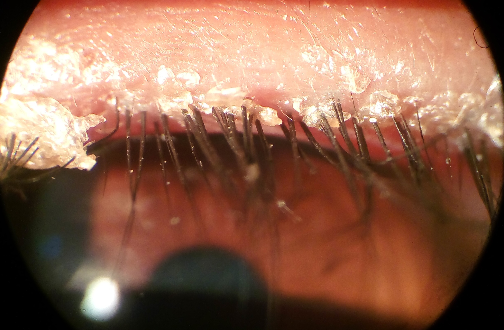
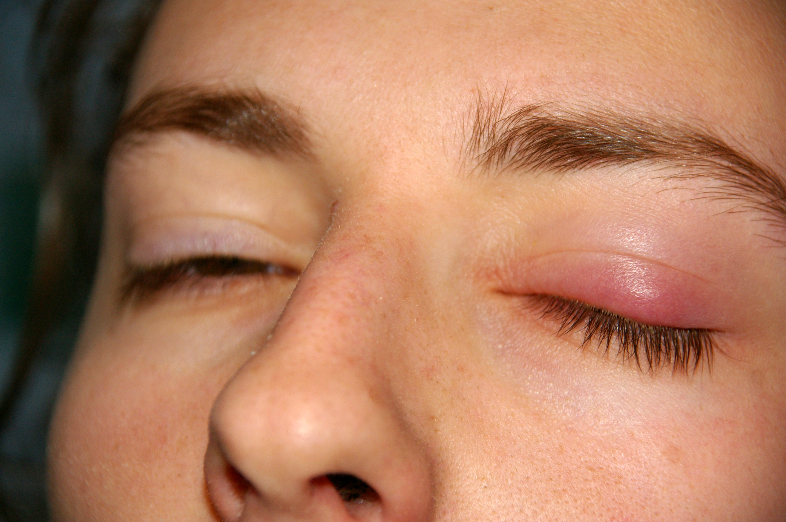
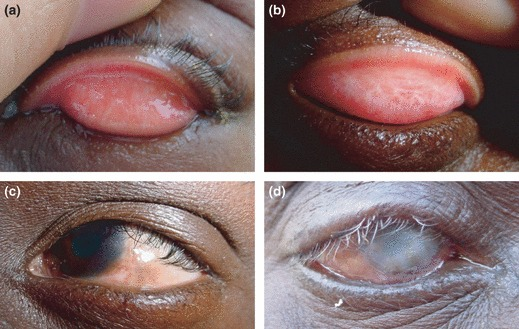
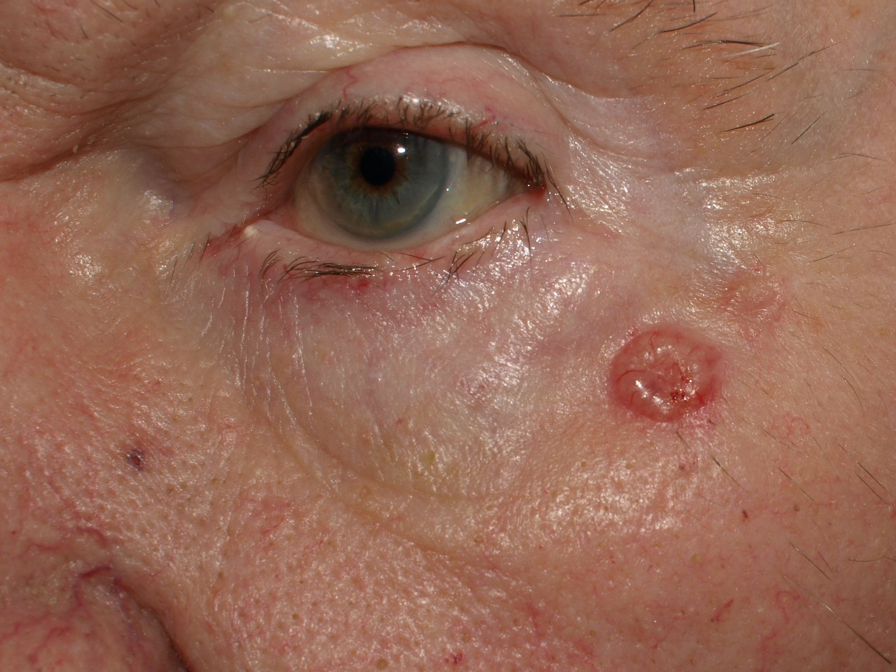
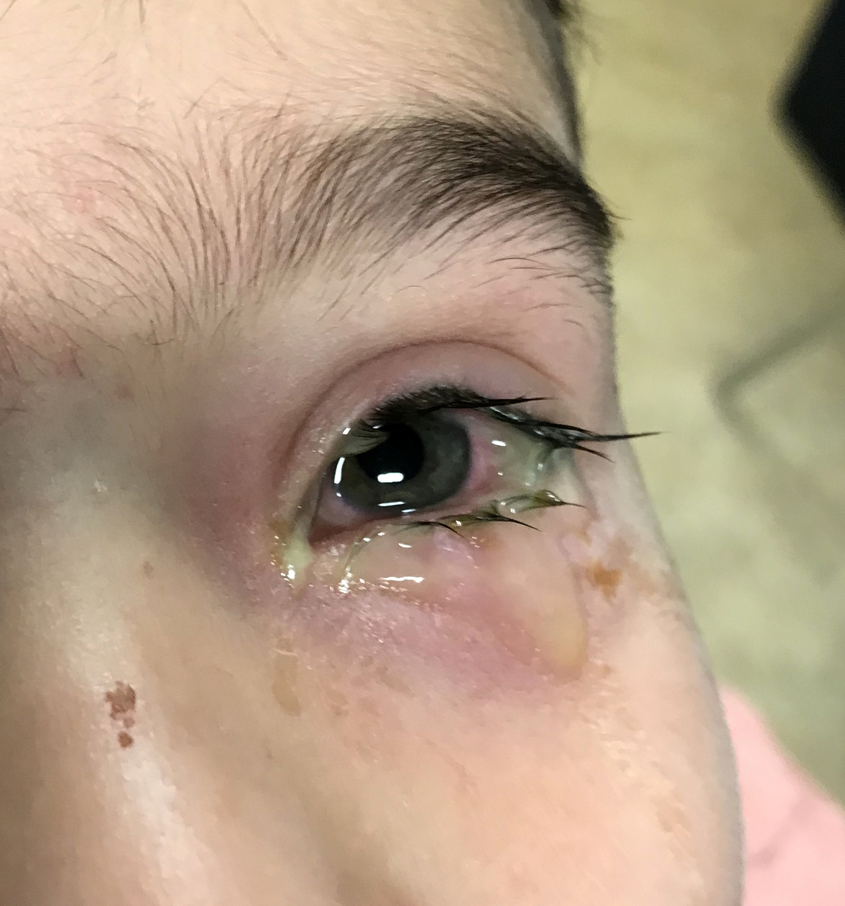
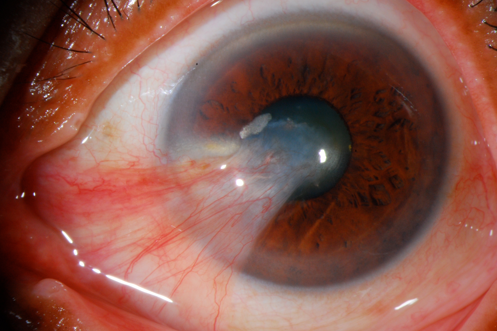

# DOENÇAS DA CONJUNTIVA E PÁLPEBRA

Para entender as doenças da superfície ocular, você precisa primeiro visualizar a pálpebra e a conjuntiva não como estruturas isoladas, mas como um sistema de defesa integrado. A pálpebra é o escudo e o limpador de para-brisa, enquanto a conjuntiva é a mucosa que garante a lubrificação e a vigilância imunológica. Se um falha, o outro sofre, e quem paga a conta, invariavelmente, é a córnea.

Neste material, vamos dissecar as patologias que mais caem nas provas de residência, focando no porquê de cada sinal clínico e na racionalidade por trás das condutas.

## Doenças das Pálpebras: A Moldura do Olho

As pálpebras possuem uma anatomia complexa. Para a prova, lembre-se da divisão em lamela anterior (pele e músculo orbicular) e lamela posterior (tarso e conjuntiva tarsal). Essa divisão é fundamental para entender as cirurgias e as retrações cicatriciais.

### Blefarite e Disfunção das Glândulas de Meibomius (DGM)

A blefarite é, talvez, a condição mais comum no consultório do oftalmologista e uma das mais negligenciadas pelos alunos. Ela não é apenas "uma inflamação". Nós a dividimos em anterior e posterior.

A blefarite anterior atinge a base dos cílios.

*Figura 1: Blefarite anterior — observe as crostas (colaretes) na base dos cílios, sinal clássico de blefarite estafilocócica.*

Pode ser estafilocócica (com colaretes, que são crostas duras ao redor do cílio) ou seborreica (com escamas gordurosas e amolecidas). Por que isso importa? Porque a estafilocócica é mais inflamatória e pode levar à perda de cílios (madarose) ou ao crescimento de cílios para dentro (triquíase).

Já a blefarite posterior é a famosa Disfunção das Glândulas de Meibomius (DGM). As glândulas de Meibomius estão dentro do tarso e produzem a camada lipídica da lágrima. Se essa gordura não sai ou sai com qualidade ruim, a lágrima evapora rápido demais. O resultado é o olho seco evaporativo.

**Dica de Prova:** Se a questão mencionar um paciente com rosácea e irritação ocular crônica, pense imediatamente em DGM. A rosácea e a blefarite posterior andam de mãos dadas.

O tratamento baseia-se na higiene palpebral. Por que usamos compressas mornas? Porque o calor fluidifica a gordura represada nas glândulas de Meibomius, facilitando sua expressão. Em casos graves, usamos tetraciclinas sistêmicas (como a Doxiciclina 100mg/dia), não pelo efeito antibiótico, mas pelo efeito anti-inflamatório e por melhorar a viscosidade do meibum.

### Hordéolo e Calázio: O Embate entre Agudo e Crônico

Aqui está um dos erros mais comuns em provas e no pronto-socorro. Muitos alunos chamam tudo de "terçol". Vamos separar o joio do trigo.

O hordéolo é uma infecção bacteriana aguda, geralmente por *Staphylococcus aureus*. Ele é um abscesso. Dói, está quente, vermelho e edemaciado. Pode ser externo (glândulas de Zeis ou Moll) ou interno (glândulas de Meibomius).

O calázio, por outro lado, é uma inflamação granulomatosa crônica e estéril. Ele ocorre porque o ducto de uma glândula de Meibomius entupiu e o lipídio extravasou para o tecido adjacente, gerando uma reação de corpo estranho. O calázio NÃO dói ao toque e é um nódulo endurecido.

**Tabela 1: Diferenciação Clínica entre Hordéolo e Calázio**

| Característica | Hordéolo | Calázio |
| --- | --- | --- |
| Natureza | Infecciosa (Abscesso) | Inflamatória (Granuloma) |
| Dor | Presente (Aguda) | Ausente (Crônica) |
| Sinais Inflamatórios | Calor, rubor e edema intensos | Nódulo localizado, sem calor |
| Tratamento Inicial | Compressas mornas + Antibiótico tópico | Compressas mornas + Massagem |
| Evolução | Drenagem espontânea ou resolução | Pode exigir incisão e curetagem |

*Figura 2: Calázio — nódulo firme e localizado na pálpebra superior. Diferente do hordéolo, é indolor e crônico (granuloma lipogranulomatoso).*

Por que fazemos compressa morna para os dois? No hordéolo, o calor ajuda a "amadurecer" o abscesso e drenar. No calázio, ajuda a tentar desentupir o ducto. Se um calázio for recorrente no mesmo local em um idoso, cuidado: a diretriz brasileira alerta para a necessidade de biópsia para excluir Carcinoma de Glândulas Sebáceas.

### Alterações do Posicionamento Palpebral

As pálpebras precisam estar em contato perfeito com o globo ocular. Se elas viram para fora, temos o Ectrópio. Se viram para dentro, o Entrópio.

O ectrópio causa exposição da conjuntiva, que fica hipertrofiada e seca. O principal sintoma, curiosamente, é a epífora (lacrimejamento excessivo). Por que o olho lacrimeja se a pálpebra está para fora? Porque o ponto lacrimal perde o contato com o filme lacrimal e não consegue drenar a lágrima, além da resposta reflexa ao ressecamento.

O entrópio é mais perigoso para a visão. Quando a pálpebra vira para dentro, os cílios raspam na córnea (triquíase secundária). Isso causa dor intensa e pode levar a úlceras de córnea e perda visual permanente.

*Figura 3: Entrópio — a pálpebra vira para dentro, causando triquíase (cílios raspando na córnea). Pode levar a úlceras corneanas e perda visual.*

A causa mais comum de ambos em idosos é a frouxidão involucional dos tecidos. O tratamento é cirúrgico, visando o encurtamento horizontal da pálpebra (técnica de *lateral tarsal strip*).

### Ptose Palpebral

A ptose é a queda da pálpebra superior. O Dr. Will sempre lembra nas discussões de caso que o segredo da ptose está na função do músculo elevador da pálpebra superior (MEPS).

- **Ptose Aponeurótica:** É a mais comum no idoso. O músculo funciona bem, mas o "tendão" (aponeurose) se soltou do tarso. O sinal clássico é o sulco palpebral alto.

- **Ptose Neurogênica:** Pense em Paralisia do III par (ptose completa, olho "para fora e para baixo", com ou sem midríase) ou Síndrome de Horner (ptose leve, miose e anidrose).

- **Ptose Miogênica:** O exemplo clássico é a Miastenia Gravis. A ptose piora ao longo do dia (fadiga) e pode haver o sinal de Cogan (um "twitch" da pálpebra ao olhar para cima).

**Pegadinha de Prova:** A alternativa vai dizer que toda ptose com midríase é urgência. Correto! Isso sugere compressão do III par por um aneurisma de artéria comunicante posterior. É uma emergência neurocirúrgica.

## Tumores Palpebrais: O que não podemos deixar passar

A pálpebra é um local frequente de neoplasias devido à exposição solar.

- **Carcinoma Basocelular (CBC):** É o tumor maligno mais comum (cerca de 90% dos casos). Prefere a pálpebra inferior. Tem aquele aspecto clássico: nódulo perolado, com telangiectasias e centro ulcerado (úlcera de rodens). Raramente dá metástase, mas é localmente invasivo.

*Figura 6: Carcinoma basocelular (CBC) — nódulo perolado com vasos telangiectásicos na superfície. É o tumor maligno palpebral mais comum (~90%).*
2. **Carcinoma Espinocelular (CEC):** Menos comum, mas mais agressivo que o CBC. Pode surgir de uma ceratose actínica. Tem crescimento mais rápido e pode dar metástase linfonodal.
3. **Carcinoma de Glândulas Sebáceas:** Este é o grande mimetizador. Ele se parece com um calázio recorrente ou uma blefarite unilateral crônica. É altamente maligno.

**Regra de Ouro:** Qualquer lesão palpebral que destrua a arquitetura das glândulas de Meibomius ou cause perda de cílios localizados deve ser considerada maligna até que se prove o contrário via biópsia.

## Doenças da Conjuntiva: O Olho Vermelho

A conjuntiva é uma membrana mucosa transparente. Quando ela inflama, os vasos se dilatam, gerando a hiperemia conjuntival. Mas cuidado: nem todo olho vermelho é conjuntivite. Se houver dor intensa e baixa de visão, pense em ceratite, uveíte ou glaucoma agudo.

### Conjuntivites Virais

O Adenovírus é o rei aqui. É extremamente contagioso. O paciente chega com história de que alguém na família ou no trabalho também estava assim.

O quadro clínico típico inclui:

- Hiperemia conjuntival.

- Secreção serosa (aquosa).

- Quemose (edema da conjuntiva).

- **Folículos** no fórnice inferior.

- Linfonodo pré-auricular palpável e doloroso.

Por que folículos? O folículo é uma resposta linfoide. Imagine-o como um pequeno grão de arroz transparente sob a conjuntiva. É a marca registrada das infecções virais e por clamídia.

O tratamento é suporte. Compressas geladas (para vasoconstrição e conforto) e lubrificantes sem conservantes. O uso de corticoides tópicos é controverso e deve ser reservado para casos com pseudomembranas ou infiltrados subepiteliais que afetam a visão, sempre com acompanhamento do especialista.

**Dica MedEvo:** A transmissão ocorre até 14 dias após o início dos sintomas. O afastamento das atividades escolares ou laborais é fundamental para conter o surto.

### Conjuntivites Bacterianas

Aqui o cenário muda. A secreção é mucopurulenta (amarela/esverdeada). O paciente acorda com os olhos "colados".

- **Bacteriana Simples:** Geralmente por *S. aureus*, *S. pneumoniae* ou *H. influenzae*. É autolimitada em 60% dos casos, mas usamos antibióticos tópicos para acelerar a cura e reduzir a transmissão.

- Opções: Tobramicina 0,3% ou Ciprofloxacino 0,3%, 1 gota de 6/6h por 7 a 10 dias.

*Figura 4: Conjuntivite bacteriana — observe a secreção purulenta (amarelada) e a hiperemia conjuntival difusa. Paciente acorda com os olhos "colados".*
2. **Bacteriana Hiperaguda (Gonocócica):** Esta é a emergência. Causada pela *Neisseria gonorrhoeae*. O quadro é explosivo: secreção purulenta maciça, quemose severa e risco real de perfuração da córnea em 24-48 horas, pois a Neisseria consegue penetrar o epitélio corneano íntegro.
 - Tratamento: Ceftriaxona 1g IM (dose única) associada a lavagem profusa com soro fisiológico e antibiótico tópico (ex: Gatifloxacino ou Moxifloxacino).

### Conjuntivites Alérgicas

O sintoma que define a alergia é o **prurido** (coceira). Se o paciente não coça o olho, questione o diagnóstico de alergia.

Diferente da viral, aqui encontramos **papilas**. A papila tem um centro vascular (um ponto vermelho no meio). É uma resposta inflamatória inespecífica, mas muito proeminente na alergia.

**Tabela 2: Tipos de Conjuntivite Alérgica**

| Tipo | Características Principais | Tratamento |
| --- | --- | --- |
| Sazonal / Perene | Leve, associada a rinite e asma. | Anti-histamínicos tópicos / Estabilizadores de mastócitos. |
| Vernal (Cercerosa) | Meninos, clima quente. Papilas em "pedra de calçamento" na conjuntiva tarsal superior. | Corticoides tópicos (curto prazo) + Ciclosporina/Tacrolimus. |
| Atópica | Adultos com dermatite atópica. Risco de ceratocone e catarata. | Controle da doença sistêmica + Imunomoduladores tópicos. |
| Papilar Gigante | Associada ao uso de lentes de contato ou suturas expostas. | Suspender lente de contato + Higiene rigorosa. |

No tratamento da alergia, a primeira escolha são os agentes de dupla ação (estabilizadores de mastócitos e anti-histamínicos), como a Olopatadina 0,1% ou 0,2%. O uso de corticoides deve ser muito cauteloso pelo risco de glaucoma e catarata iatrogênicos.

### Conjuntivite Neonatal (Oftalmia Neonatorum)

Qualquer conjuntivite nos primeiros 28 dias de vida é uma emergência. O tempo de aparecimento nos ajuda a guiar a etiologia, embora não seja uma regra absoluta:

- **Química (Nitrato de Prata):** Primeiras 24 horas.

- **Gonocócica:** 2 a 5 dias. Muito agressiva.

- **Clamídia:** 5 a 14 dias. É a causa bacteriana mais comum. Pode vir acompanhada de pneumonia.

**Importante:** Segundo as diretrizes brasileiras, o tratamento da conjuntivite por Clamídia no recém-nascido DEVE ser sistêmico (Eritromicina 50mg/kg/dia dividida em 4 doses por 14 dias) para tratar o reservatório nasofaríngeo e prevenir pneumonia. O tratamento tópico isolado é insuficiente.

## Degenerações Conjuntivais: Pterígio e Pinguecula

O pterígio é um crescimento fibrovascular da conjuntiva bulbar em direção à córnea, sempre no sentido horizontal (nasal ou temporal). Está diretamente relacionado à exposição à radiação ultravioleta (UV) e ao ressecamento crônico.

A pinguecula é semelhante, mas não invade a córnea. É apenas um "calinho" amarelado na conjuntiva.

*Figura 5: Pterígio na lâmpada de fenda — tecido fibrovascular avançando do lado nasal sobre a córnea. Quando se aproxima do eixo visual, a cirurgia é indicada.*

Por que operamos o pterígio?

- Ameaça ao eixo visual (está chegando perto da pupila).

- Indução de astigmatismo irregular significativo.

- Irritação crônica que não melhora com colírios.

- Estética (motivo frequente, mas deve ser bem discutido).

A técnica cirúrgica de escolha hoje é a exérese com transplante autólogo de conjuntiva. Por que não apenas retirar? Porque a taxa de recidiva sem o transplante chega a 80%, enquanto com o transplante cai para menos de 5%.

## Tumores da Conjuntiva

Assim como na pálpebra, a conjuntiva pode apresentar lesões malignas.

- **Neoplasia Intraepitelial Conjuntival (NIC):** É o precursor do CEC. Apresenta-se como uma lesão esbranquiçada (leucoplasia) ou gelatinosa no limbo. O tratamento pode envolver cirurgia com margens ou quimioterapia tópica (Mitomicina C ou 5-Fluorouracil).

- **Melanoma de Conjuntiva:** Uma lesão pigmentada, elevada e com vasos nutridores. Pode surgir de um nevo pré-existente ou de uma Melanose Adquirida Primária (PAM) com atipia. É uma lesão grave com potencial de metástase.

**Diferencial Clínico:** Como diferenciar um nevo de conjuntiva de um melanoma? O nevo geralmente aparece na infância, é plano ou levemente elevado e possui pequenos cistos internos na lâmpada de fenda. O melanoma surge em adultos, cresce rápido e é muito vascularizado.

## Exame Físico Detalhado: O que buscar na Lâmpada de Fenda

Ao examinar um paciente com queixa de conjuntiva ou pálpebra, siga este roteiro mental:

- **Inspeção Dinâmica:** Observe o piscar. É completo? Se o paciente tem lagoftalmo (não fecha o olho totalmente), a córnea inferior vai sofrer.

- **Margem Palpebral:** Procure por orifícios de glândulas de Meibomius obstruídos (parecem gotas de óleo) e colaretes nos cílios.

- **Eversão da Pálpebra Superior:** Obrigatória em casos de suspeita de corpo estranho ou conjuntivite crônica. Você pode encontrar papilas gigantes ou o corpo estranho que está causando a úlcera linear na córnea.

- **Coloração com Fluoresceína:** Sempre avalie a integridade do epitélio da córnea. Uma conjuntivite que evolui com ceratite pontilhada difusa sugere toxicidade ou infecção viral grave.

## Diagnóstico Diferencial do Olho Vermelho

Este é o ponto onde as bancas mais tentam derrubar o candidato. Você precisa saber diferenciar a conjuntivite de outras causas de olho vermelho que são ameaçadoras à visão.

**Tabela 3: Diagnóstico Diferencial do Olho Vermelho**

| Sinal/Sintoma | Conjuntivite | Ceratite | Uveíte Anterior | Glaucoma Agudo |
| --- | --- | --- | --- | --- |
| Dor | Desconforto/Areia | Moderada a Forte | Moderada (Fotofobia) | Intensa (Náuseas) |
| Visão | Normal | Diminuída | Levemente Diminuída | Muito Diminuída |
| Injeção Vascular | Conjuntival (Periférica) | Ciliar (Periquerática) | Ciliar (Periquerática) | Mista / Difusa |
| Pupila | Normal | Normal | Miose (geralmente) | Midríase Médio-fixa |
| Secreção | Presente | Aquosa/Mucopurulenta | Ausente | Ausente |
| Córnea | Transparente | Opacidade/Úlcera | Transparente (com PKs) | Edema (Fosca) |

*Nota: PKs = Precipitados Ceráticos (células inflamatórias no endotélio da córnea).*

## Tratamento Farmacológico: Doses e Escolhas

Vamos consolidar as condutas terapêuticas baseadas nas diretrizes do Conselho Brasileiro de Oftalmologia (CBO).

### Antibióticos Tópicos

- **Primeira escolha (Bacteriana Simples):** Tobramicina 0,3% ou Ciprofloxacino 0,3%.

- **Posologia:** 1 gota de 6/6h ou 4/4h por 7 a 10 dias.

- **Casos Graves (ex: Úlcera de córnea associada):** Quinolonas de 4ª geração (Moxifloxacino 0,5% ou Gatifloxacino 0,5%).

### Anti-histamínicos e Estabilizadores de Mastócitos

- **Olopatadina 0,1%:** 1 gota de 12/12h.

- **Olopatadina 0,2% ou 0,7%:** 1 gota 1x ao dia.

- **Alcaftadina 0,25%:** 1 gota 1x ao dia.

### Corticoides Tópicos

- **Indicação:** Conjuntivite viral com pseudomembranas, conjuntivite vernal grave, episclerite.

- **Exemplos:** Fluorometolona 0,1% (baixo potencial de aumentar a PIO) ou Prednisolona 1% (alto potencial).

- **Cuidado:** Nunca prescreva corticoide sem ter certeza de que não há infecção por Herpes Simples (ceratite dendrítica), pois o corticoide pode causar uma úlcera geográfica e perfuração.

## Situações Especiais e Complicações

### O Idoso e a Pálpebra

No idoso, a frouxidão tecidual é a regra. Além do ectrópio e entrópio, temos a **Dermatocalase** (excesso de pele na pálpebra superior). Isso não é apenas estético; em casos avançados, a pele pesa sobre os cílios e reduz o campo visual superior. O tratamento é a blefaroplastia.

### Gestantes

Muitos colírios são classe C. Em conjuntivites alérgicas, prefira medidas não farmacológicas (compressas frias, evitar alérgenos). Se necessário, a Olopatadina pode ser usada com cautela, mas sempre discutindo o risco-benefício.

### Complicações da Conjuntivite Viral

A complicação mais temida, além da transmissão, são os **infiltrados subepiteliais**. Eles são uma resposta imune aos antígenos virais e aparecem cerca de 2 semanas após o início do quadro. Causam baixa de visão e halos ao redor da luz. Aqui, o corticoide tópico é necessário, mas com desmame muito lento para evitar a recorrência.

## Estratificação de Risco e Metas

O objetivo no tratamento das doenças das pálpebras e conjuntiva é triplo:

- Preservar a transparência da córnea.

- Garantir o conforto do paciente.

- Prevenir a cronificação (especialmente em casos de DGM e alergia).

Um paciente com olho vermelho e dor deve ser sempre avaliado com urgência. Se houver suspeita de celulite orbitária (edema palpebral + proptose + limitação da motilidade ocular), a internação para antibioticoterapia venosa é mandatória. Não confunda celulite pré-septal (apenas pálpebra, motilidade normal) com celulite orbitária (emergência médica).

## Pontos-Chave para Prova

- **Hordéolo vs. Calázio:** Hordéolo é agudo, doloroso e infeccioso. Calázio é crônico, indolor e granulomatoso.

- **Conjuntivite Viral:** Presença de folículos e linfonodo pré-auricular. Altamente contagiosa por até 14 dias.

- **Conjuntivite Alérgica:** O sintoma cardeal é o prurido. Presença de papilas.

- **Conjuntivite Gonocócica:** Emergência oftalmológica. Secreção purulenta hiperaguda. Risco de perfuração de córnea. Tratamento com Ceftriaxona 1g IM.

- **Conjuntivite Neonatal por Clamídia:** Causa bacteriana mais comum. Exige tratamento sistêmico (Eritromicina) para evitar pneumonia.

- **Triquíase:** Cílios virados para dentro tocando a córnea. Causa dor e risco de úlcera.

- **Ectrópio Involucional:** Causa epífora (lacrimejamento) por mau posicionamento do ponto lacrimal.

- **Ptose e Midríase:** Suspeita de aneurisma de comunicante posterior (Paralisia do III par). Emergência!

- **Carcinoma Basocelular:** Tumor maligno palpebral mais comum. Nódulo perolado com telangiectasias.

- **Carcinoma de Glândulas Sebáceas:** Suspeitar em casos de "calázio recorrente" ou blefarite unilateral persistente no idoso.

- **Pterígio:** Crescimento fibrovascular que invade a córnea. Técnica de escolha: exérese com transplante de conjuntiva.

- **Folículo vs. Papila:** Folículo (linfoide, viral/clamídia, aspecto de grão de arroz). Papila (vascular, alérgica/bacteriana, ponto vermelho central).

- **Higiene Palpebral:** Base do tratamento da blefarite. Compressas mornas ajudam a fluidificar o meibum na DGM.

- **Uso de Corticoides:** Contraindicação absoluta se houver suspeita de Ceratite por Herpes Simples (aspecto dendrítico).

- **Celulite Orbitária:** Diferencia-se da pré-septal pela presença de proptose, dor à movimentação ocular e baixa de visão. Exige TC de órbitas e internação. 👁️

Este guia cobre os pilares fundamentais para o seu sucesso nas questões de patologia externa ocular. Lembre-se sempre: na oftalmologia, a anatomia dita a patologia. Entenda onde a lesão está e você entenderá o que ela causa.

 Cópia offline para consulta pessoal.
 Fonte original:
 [https://www.medevo.com.br/material-apoio/ler/fa64f065-fd71-41c6-892f-505f17171255](https://www.medevo.com.br/material-apoio/ler/fa64f065-fd71-41c6-892f-505f17171255)
