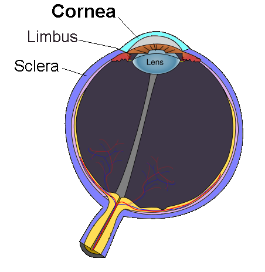
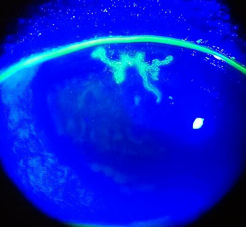

# DOENÇAS DA CÓRNEA

Para entender as doenças da córnea, você precisa primeiro visualizar esse tecido como a "janela" do olho. Para que essa janela funcione, ela precisa ser transparente, ter uma curvatura regular e ser lisa. Qualquer processo que altere esses três pilares vai resultar em baixa acuidade visual.

A córnea é um tecido avascular. Isso é fundamental para a transparência, mas é um desafio para a imunidade. Como os anticorpos e as células de defesa chegam lá se não há vasos? Eles dependem da difusão a partir do limbo e do filme lacrimal. Por isso, quando uma inflamação é grave, o corpo "apela" e cria vasos (neovascularização), o que resolve a infecção, mas estraga a transparência.

*Figura 1 - Diagrama do olho humano destacando a córnea (estrutura transparente mais anterior), demarcada da esclera pelo limbo corneano. A córnea é avascular e responsável por ~70% do poder refrativo total do olho. Fonte: Mikael Häggström, CC0 | Wikimedia Commons*

## Ceratites Infecciosas: O Campo de Batalha das Provas

*Figura 2 - Aspecto característico de úlcera dendrítica corneana corada com fluoresceína, sinal patognomônico de ceratite herpética por HSV. Observe o padrão ramificado típico com bulbos terminais. Fonte: Imrankabirhossain, CC BY-SA 4.0 | Wikimedia Commons*

As ceratites são as inflamações da córnea. Quando falamos de provas de residência, o foco quase sempre recai sobre as causas infecciosas. O raciocínio clínico aqui deve ser rápido, pois uma ceratite bacteriana pode perfurar um olho em 24 a 48 horas.

### Ceratite Bacteriana

É a causa mais comum de ceratite infecciosa grave. O principal fator de risco que você encontrará nos enunciados é o uso de lentes de contato.

Por que a lente de contato é tão perigosa? Porque ela causa microtraumas no epitélio e cria um ambiente de hipóxia, facilitando a adesão bacteriana. O agente clássico associado às lentes de contato é a *Pseudomonas aeruginosa*.

**Quadro Clínico e Diagnóstico**
O paciente chega com dor intensa, fotofobia, lacrimejamento e, o sinal patognomônico, o infiltrado estromal esbranquiçado. Se houver hipópio (coleção de pus na câmara anterior), a gravidade é maior.

Cuidado: muitos alunos confundem o infiltrado com um simples defeito epitelial. O infiltrado é uma mancha branca "dentro" da carne da córnea, composta por leucócitos e restos celulares. O defeito epitelial (úlcera) é apenas a perda da "pele" da córnea, que cora com fluoresceína.

**Manejo Terapêutico**
Segundo as diretrizes do Conselho Brasileiro de Oftalmologia (CBO), o tratamento deve ser agressivo.

- Colírios de antibióticos de largo espectro: Frequentemente iniciamos com uma fluoroquinolona de 4ª geração (Gatifloxacino 0,3% ou Moxifloxacino 0,5%) de 1/1 hora, inclusive de madrugada.

- Em casos graves (ameaça à visão ou infiltrados maiores que 2mm), usamos antibióticos fortificados, como Vancomicina (50mg/ml) e Ceftazidima (50mg/ml).

**Dica de Prova:** A banca pode perguntar sobre a coleta de material. Fazemos raspado da úlcera para Gram e cultura antes de iniciar o antibiótico se a lesão for central, grande ou se não responder ao tratamento inicial.

### Ceratite Viral (Herpes Simples)

Aqui está o maior "pegadinha" das provas. O vírus do Herpes Simples (HSV) é a causa mais comum de cegueira corneana por infecção em países desenvolvidos.

Existem duas formas principais que você deve diferenciar:

- **Ceratite Epitelial (Dendrítica):** O vírus está se replicando no epitélio. Você verá a famosa úlcera dendrítica (em formato de galho de árvore com bulbos terminais).

- **Ceratite Estromal (Imunológica):** O problema não é o vírus "comendo" a córnea, mas a resposta imune do corpo contra os antígenos virais que ficaram lá.

**Por que essa distinção é vital?**
Porque o tratamento é oposto. Na dendrítica, usamos antiviral (Aciclovir pomada 5x ao dia). O corticoide é CONTRAINDICADO na fase epitelial ativa, pois ele "abre a porteira" para o vírus se replicar ainda mais, transformando a dendrita em uma úlcera geográfica (muito maior).

Já na ceratite estromal disciforme, o objetivo é frear a inflamação, então usamos corticoide tópico associado a um antiviral profilático. Como diz o Dr. Will, "no herpes, o corticoide é o seu melhor amigo ou o seu pior inimigo, tudo depende do timing".

### Ceratite Fúngica

Pense em ceratite fúngica sempre que o enunciado trouxer um trabalhador rural ou trauma com material vegetal (galho de árvore, folha de cana).

Os fungos filamentosos (*Fusarium* e *Aspergillus*) são os mais comuns. O quadro clínico é mais "arrastado" que o bacteriano, mas a aparência é característica:

- Infiltrado com bordas plumosas (parece um algodão doce sujo).

- Lesões satélites (pequenos focos de infecção ao redor da lesão principal).

O tratamento é difícil porque os antifúngicos penetram mal na córnea. A Natamicina 5% colírio é a primeira escolha para fungos filamentosos. Para leveduras (*Candida*), usamos Anfotericina B 0,15%.

### Ceratite por Acanthamoeba

Este é o pesadelo do usuário de lente de contato que admite nadar em piscinas, lagos ou usar água de torneira para lavar o estojo das lentes.

A característica marcante é a **dor desproporcional aos achados do exame**. O paciente grita de dor, mas você olha na lâmpada de fenda e vê apenas um pequeno infiltrado. Isso acontece porque a ameba tem tropismo pelos nervos corneanos, causando uma ceratoneurite radial (infiltrados seguindo o trajeto dos nervos).

O diagnóstico é difícil e o tratamento longo (meses), usando biguanidas (PHMB 0,02%) ou clorexidina.

| Tipo de Ceratite | Fator de Risco Clássico | Sinal Clínico Típico | Tratamento Inicial |
| --- | --- | --- | --- |
| Bacteriana | Lente de contato | Infiltrado branco denso | Fluoroquinolona 4ª ger |
| Herpética | Estresse / Imunossupressão | Úlcera dendrítica | Aciclovir tópico |
| Fúngica | Trauma vegetal | Bordas plumosas / Satélites | Natamicina 5% |
| Acanthamoeba | Água contaminada / Lente | Dor intensa / Ceratoneurite | PHMB / Clorexidina |

## Ectasias Corneanas: O Ceratocone em Foco

O ceratocone é uma doença não inflamatória, progressiva, que causa o afinamento e o encurvamento da córnea. Ela assume um formato de cone, gerando astigmatismo irregular e miopia.

**Fisiopatologia e Epidemiologia**
Geralmente começa na puberdade. O fator de risco mais importante e modificável é o hábito de **coçar os olhos**. A fricção mecânica libera citocinas inflamatórias e degrada as fibras de colágeno do estroma.

**Sinais Clínicos de Prova:**

- **Sinal de Munson:** A pálpebra inferior faz um "V" quando o paciente olha para baixo.

- **Anel de Fleischer:** Depósito de ferro na base do cone.

- **Estrias de Vogt:** Linhas verticais finas no estroma profundo que desaparecem ao pressionar o globo.

- **Hidropisia Corneana:** Uma complicação aguda onde a membrana de Descemet se rompe, o humor aquoso entra na córnea e causa um edema súbito e doloroso.

**Diagnóstico**
O padrão-ouro é a Topografia ou Tomografia de Córnea (Pentacam). Buscamos o encurvamento central ou paracentral inferior. Valores de ceratometria (K) acima de 47.00 D são suspeitos.

**Tratamento Escalonado**

- **Óculos:** No início, quando o astigmatismo ainda é regular.

- **Lentes de Contato Rígidas:** Quando os óculos não dão mais visão. A lente cria uma nova superfície refrativa regular. Importante: a lente NÃO para a progressão da doença, ela apenas melhora a visão.

- **Cross-linking (CXL):** Este é o único tratamento que interrompe a progressão. Usamos Riboflavina (Vitamina B2) e luz Ultravioleta A para criar novas ligações entre as fibras de colágeno. Indicado apenas se houver progressão documentada.

- **Anel Intraestromal (Anel de Ferrara):** Serve para "aplanar" o cone e regularizar a córnea, facilitando o uso de lentes ou óculos.

- **Transplante de Córnea:** Último recurso, quando há cicatrizes centrais ou o cone é avançado demais para outras técnicas.

## Distrofias Corneanas: O Determinismo Genético

As distrofias são doenças bilaterais, simétricas, de herança genética e, por definição, não estão associadas a inflamação ou doenças sistêmicas.

### Distrofia de Fuchs (Endotelial)

Esta é a que mais cai em provas de residência. Ela afeta o endotélio, que é a camada interna da córnea responsável por "bombear" a água para fora e manter a transparência.

Na Distrofia de Fuchs, as células endoteliais morrem prematuramente e surgem as "guttae" (gotas), que parecem metal batido na lâmpada de fenda.

- **Sintoma clássico:** Visão embaçada pela manhã que melhora ao longo do dia.

- **Por que melhora?** Durante a noite, com as pálpebras fechadas, não há evaporação da lágrima, o que aumenta o edema. Ao acordar, a evaporação ajuda a desidratar a córnea.

O tratamento inicial envolve colírios e pomadas hipertônicas (Cloreto de Sódio 5%) para "puxar" a água para fora. Em casos avançados, o tratamento é o transplante de endotélio (DMEK ou DSAEK).

### Distrofias Estromais

As bancas adoram as três clássicas. Existe um mnemônico em inglês muito famoso, mas vamos focar na descrição clínica:

- **Distrofia Granular:** Depósitos esbranquiçados que parecem "migalhas de pão". Feitos de material hialino.

- **Distrofia Macular:** A mais grave. Opacidades difusas que atingem o limbo. Feita de excesso de glicosaminoglicanos. É a única de herança autossômica recessiva (as outras são dominantes).

- **Distrofia Lattice (Lactea):** Linhas que parecem teias de aranha ou "vidro moído". Feita de depósitos de amiloide.

**Dica MedEvo:** Se a questão mencionar coloração especial em patologia:

- Granular = Vermelho de Masson.

- Macular = Alcian Blue.

- Lattice = Vermelho Congo (birrefringência verde sob luz polarizada - clássico de amiloide).

## Degenerações e Alterações de Superfície

Diferente das distrofias, as degenerações costumam ser assimétricas, periféricas e associadas a fatores ambientais.

### Pterígio

É o crescimento fibrovascular da conjuntiva em direção à córnea, geralmente do lado nasal. Está diretamente ligado à exposição solar (radiação UV).

O tratamento é cirúrgico se:

- Ameaçar o eixo visual.

- Causar astigmatismo induzido importante.

- Irritação crônica que não melhora com lubrificantes.

A técnica de escolha é a exérese com transplante de conjuntiva autólogo. Usar apenas a técnica de "esclera nua" (retirar e deixar cicatrizar) tem taxas de recorrência altíssimas (até 80%).

### Queimaduras Químicas

Esta é uma emergência oftalmológica verdadeira. O tratamento deve começar ANTES mesmo de testar a visão.

**Álcalis (Soda cáustica, cal, cimento):** São muito piores que os ácidos. Por quê? Porque os álcalis causam necrose por liquefação, saponificando os lipídios das membranas celulares e penetrando profundamente no olho em minutos.
**Ácidos:** Causam necrose por coagulação, o que cria uma barreira de proteínas coaguladas que limita a penetração profunda.

**Conduta Imediata:**
Irrigação copiosa com soro fisiológico ou água por pelo menos 30 minutos ou até que o pH da superfície ocular se neutralize (pH entre 7.0 e 7.2).

## Transplante de Córnea: O que o Generalista deve saber

O Brasil tem um dos maiores sistemas públicos de transplante de córnea do mundo. A córnea é um "sítio privilegiado" imunologicamente porque não tem vasos, o que diminui o risco de rejeição em comparação com um rim ou coração.

Existem dois tipos principais:

- **Penetrante (PK):** Troca-se toda a espessura da córnea.

- **Lamelar:** Troca-se apenas a camada doente (ex: apenas o endotélio na Distrofia de Fuchs, ou apenas o estroma no Ceratocone).

**Sinais de Rejeição (Os 4 "R"s):**

- Redness (Olho vermelho).

- Reduced vision (Baixa de visão).

- Rain (Lacrimejamento).

- "R"dor (Dor).

Ao exame, o sinal mais específico de rejeição endotelial é a **Linha de Khodadoust**, que é uma linha de precipitados ceráticos (glóbulos brancos) caminhando pelo endotélio do doador.

## Diagnóstico Diferencial do Olho Vermelho com Acometimento Corneano

Muitas vezes, a prova vai te dar um caso de "olho vermelho" e você precisará decidir se é uma conjuntivite simples ou algo que ameaça a visão (como uma doença da córnea).

| Sinal | Conjuntivite | Ceratite / Úlcera | Glaucoma Agudo |
| --- | --- | --- | --- |
| Dor | Sensação de areia | Dor moderada a forte | Dor excruciante |
| Visão | Normal | Diminuída | Muito diminuída (halos) |
| Secreção | Mucopurulenta | Aquosa / Purulenta | Aquosa |
| Córnea | Transparente | Opaca / Infiltrado | Edema (fosca) |
| Pupila | Reativa | Miose (frequente) | Médio-midríase fixa |

## Situações Especiais e Erros Comuns

### O Perigo do Anestésico Tópico

Nunca, sob hipótese alguma, prescreva colírio anestésico para o paciente levar para casa. O anestésico é tóxico para o epitélio corneano (ceratopatia neurotrófica) e inibe o reflexo de piscar, o que pode levar a úlceras graves e perfuração. O anestésico é apenas para uso em consultório.

### Uso de Corticoides

O uso inadvertido de corticoides em uma ceratite por Herpes Simples epitelial ou em uma ceratite fúngica pode levar à perda do globo ocular. Além disso, o uso crônico causa catarata e glaucoma secundário.

### Lentes de Contato e Dormir

Dormir com lentes de contato aumenta o risco de ceratite bacteriana em cerca de 10 a 15 vezes. Se o paciente chegar com dor e usar lente, a conduta é: suspender a lente imediatamente, não ocluir o olho e iniciar antibiótico de largo espectro.

## Pontos-Chave para Prova 💡

- **Ceratite Bacteriana:** Principal fator de risco é lente de contato; principal agente é *Pseudomonas*.

- **Ceratite Herpética:** Úlcera dendrítica é o sinal clássico. Corticoide é contraindicado na fase epitelial.

- **Ceratite Fúngica:** Suspeitar em traumas vegetais; infiltrados plumosos e lesões satélites.

- **Acanthamoeba:** Dor desproporcional ao exame; associada a uso de lentes em piscinas/água de torneira.

- **Ceratocone:** Doença progressiva, afinamento central, sinal de Munson e anel de Fleischer.

- **Cross-linking:** Único procedimento que barra a progressão do ceratocone (não melhora a visão per se).

- **Distrofia de Fuchs:** Perda de células endoteliais, edema matinal que melhora ao longo do dia.

- **Queimadura Química:** Álcalis são mais graves (necrose por liquefação). Conduta imediata: lavagem copiosa.

- **Anestésico Tópico:** Uso domiciliar é proibido devido à toxicidade epitelial grave.

- **Rejeição de Transplante:** Linha de Khodadoust é o sinal patognomônico de rejeição endotelial.

- **Mnemônico Distrofias Estromais:** Granular (Hialino), Macular (Glicosaminoglicanos), Lattice (Amiloide).

- **Tratamento Bacteriana Grave:** Antibióticos fortificados (Vancomicina + Ceftazidima) de 1/1 hora.

- **Hidropisia Corneana:** Ruptura da membrana de Descemet no ceratocone; tratamento é expectante (não é cirúrgico de urgência).

- **Pterígio:** Tratamento padrão-ouro é exérese com transplante autólogo de conjuntiva.

- **Fluoresceína:** Cora áreas sem epitélio (úlcera); Rosa Bengala/Verde Lisamina coram células desvitalizadas.

- **Contraindicação de Oclusão:** Nunca ocluir olho com suspeita de infecção bacteriana (cria estufa para bactérias).

 Cópia offline para consulta pessoal.
 Fonte original:
 [https://www.medevo.com.br/material-apoio/ler/19a8707e-b72b-471d-b8c1-4ef2a4aba0d3](https://www.medevo.com.br/material-apoio/ler/19a8707e-b72b-471d-b8c1-4ef2a4aba0d3)
