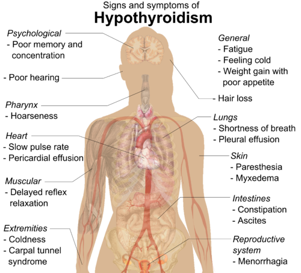
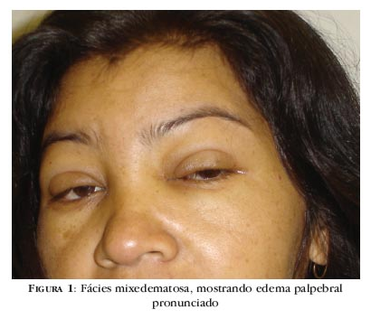

# DOENÇAS DA TIREOIDE

Para entender a tireoide, você precisa parar de decorar tabelas e começar a pensar na glândula como o termostato do corpo. Se o termostato está alto, tudo acelera; se está baixo, tudo desacelera. Nas provas de residência, o examinador não quer apenas que você saiba o valor do TSH, ele quer que você saiba o que fazer quando o exame não bate com a clínica ou quando a gestante entra no consultório.

## Avaliação Laboratorial: O Ponto de Partida

*Figura 1 - Eixo hipotálamo-hipófise-tireoide: TRH estimula liberação de TSH, que regula a produção de T3/T4 com feedback negativo. Fonte: Mikael Häggström, Domínio Público | Wikimedia Commons*

O erro mais comum que vejo alunos cometerem é pedir "perfil tireoidiano completo" para todo mundo. Na prática e na prova, o rastreio começa com o **TSH**. Por que? Porque a relação entre o T4 livre e o TSH é log-linear. Pequenas mudanças no T4 geram mudanças gigantescas no TSH. Ele é o sensor mais sensível que temos.

### TSH e T4 Livre

O TSH (Hormônio Estimulante da Tireoide) é produzido pela hipófise. Se a tireoide falha (hipotireoidismo primário), a hipófise "grita" aumentando o TSH. Se a tireoide produz demais (hipertireoidismo primário), a hipófise se cala, suprimindo o TSH.

Cuidado com a **TBG (Globulina Ligadora de Tiroxina)**. Situações que aumentam a TBG, como o uso de estrogênios (anticoncepcionais) ou gravidez, aumentam o T4 Total, mas o T4 Livre (a fração ativa) permanece normal. Por isso, sempre valorize o T4 Livre em detrimento do T4 Total.

### Anticorpos e Tireoglobulina

- **Anti-TPO (Antiperoxidase):** É o marcador de autoimunidade. Presente em >95% dos casos de Hashimoto. Se o TSH está limítrofe e o Anti-TPO é positivo, o risco de progressão para hipotireoidismo franco é muito maior.

- **TRAb (Anticorpo Antirreceptor de TSH):** Este é o "crachá" da Doença de Graves. Ele estimula o receptor, causando hipertireoidismo.

- **Tireoglobulina:** **Atenção aqui!** Nunca peça tireoglobulina para diagnosticar câncer de tireoide. Ela é um marcador de seguimento pós-operatório. Se o paciente ainda tem tireoide, a tireoglobulina estará presente, seja o nódulo benigno ou maligno.

*Figura 2 - Manifestações clínicas do hipotireoidismo: fadiga, bradicardia, constipação, intolerância ao frio, ganho de peso, entre outros. Fonte: Mikael Häggström, CC0 | Wikimedia Commons*

## Hipotireoidismo: Quando o Corpo Desacelera

O hipotireoidismo primário é a causa em 99% das questões. A principal etiologia em áreas iodo-suficientes (como o Brasil) é a **Tireoidite de Hashimoto**.

### Quadro Clínico e Diagnóstico

O paciente chega com queixas inespecíficas: fadiga, ganho de peso (geralmente por edema, não gordura excessiva), constipação, pele seca e intolerância ao frio. No exame físico, procure por bradicardia e lentificação do relaxamento do reflexo aquileu.

Um achado clássico de prova: **Hipotireoidismo e Dislipidemia**. O T3 é necessário para a expressão dos receptores de LDL no fígado. Sem ele, o LDL sobe. Se você tratar a dislipidemia sem corrigir a tireoide, está cometendo um erro de conduta.

### Manejo Terapêutico

A droga de escolha é a **Levotiroxina (L-T4)**. A dose plena é de aproximadamente **1,6 mcg/kg/dia**. Dose inicial de 50 mcg/dia aumentando 25mcg a cada 2-3 semanas.

**Pérola do Dr. Will:** No idoso ou no coronariopata, você NUNCA começa com dose plena. O excesso de hormônio pode desencadear uma arritmia ou infarto. Começamos com 12,5 a 25 mcg/dia e subimos devagar ("Start low, go slow").

**Interações Medicamentosas:** A levotiroxina deve ser tomada em jejum, 30 a 60 minutos antes do café. Carbonato de cálcio, sulfato ferroso e inibidores de bomba de prótons (como o omeprazol, que altera o pH gástrico) reduzem drasticamente a absorção. Se o TSH não normaliza mesmo com doses altas, verifique a adesão e o uso dessas medicações.

### Hipotireoidismo Subclínico

Este é o tema favorito das bancas. Definimos como **TSH elevado com T4 Livre normal**. Quando tratar?

- TSH ≥ 10 mUI/L (consenso de tratamento).

- Gestantes ou mulheres planejando engravidar.

- Presença de sintomas exuberantes (individualizar).

- Anti-TPO positivo com TSH subindo em exames seriados.

- Doença cardiovascular ou alto risco (discutível, mas comum em provas).

Se o paciente for idoso (> 65-70 anos) e o TSH estiver entre 4,5 e 9, a conduta costuma ser observação, pois o TSH tende a subir fisiologicamente com a idade.

### Situações Especiais: Gravidez e Coma Mixedematoso

Na gravidez, a demanda por T4 aumenta logo nas primeiras semanas. Se a paciente já é hipotireoidiana, a orientação da SBEM é **aumentar a dose em 25-50%** (geralmente adicionando 2 comprimidos extras por semana) assim que a gravidez for confirmada. O hipotireoidismo fetal no primeiro trimestre pode causar danos irreversíveis ao desenvolvimento neurocognitivo.

O **Coma Mixedematoso** é a emergência máxima. É o hipotireoidismo grave descompensado por um fator externo (infecção, IAM, frio). O paciente apresenta bradicardia, hipotermia, hiponatremia (por SIADH associada) e rebaixamento do nível de consciência. O tratamento é suporte, levotiroxina venosa (se disponível) e, crucialmente, **hidrocortisona** antes do T4 para evitar uma crise adrenal precipitada.

## Hipertireoidismo e Tireotoxicose

Primeiro, entenda a diferença: Tireotoxicose é o estado clínico de excesso de hormônio, independente da causa. Hipertireoidismo é quando a tireoide está produzindo demais.

### Doença de Graves

É a causa mais comum (80%). É uma doença autoimune onde o TRAb estimula o receptor de TSH.

- **Tríade Clássica:** Bócio difuso, exoftalmia (oftalmopatia) e mixedema pré-tibial (raro, mas cai em prova).

- **Diagnóstico:** TSH suprimido, T4L e T3 elevados. O TRAb confirma a etiologia. Na dúvida, a cintilografia mostra captação difusa e aumentada.

### Tireoidites: O Grande Diagnóstico Diferencial

Imagine um paciente com TSH suprimido e T4L alto, mas com **dor na região da tireoide** e VHS muito elevado. Isso é **Tireoidite Subaguda de De Quervain** (pós-viral).
**Erro clássico:** Prescrever metimazol para tireoidite. Não faça isso! Na tireoidite, o hormônio está alto porque "vazou" da glândula inflamada, não porque está sendo produzido em excesso. O tratamento é com AINEs ou corticoides e betabloqueadores para os sintomas. A captação de iodo na cintilografia será **baixa**.

### Tratamento do Hipertireoidismo

- **Betabloqueadores (Propranolol/Atenolol):** Primeira medida para controlar sintomas adrenérgicos (taquicardia, tremor).

- **Drogas Antitireoidianas (Metimazol e Propiltiouracil - PTU):** O Metimazol é a primeira escolha para quase todos. O PTU é reservado para o **1º trimestre da gestação** (o metimazol é teratogênico - aplasia cutis) e para a **tempestade tireoidiana** (pois o PTU também inibe a conversão periférica de T4 em T3).

- **Iodo Radioativo (I-131):** Excelente para Graves e bócio multinodular. Contraindicado na gravidez (exige teste de gravidez antes) e em pacientes com oftalmopatia grave (pode piorar a exoftalmia).

- **Cirurgia:** Indicada para bócios muito grandes, com sintomas compressivos ou suspeita de malignidade.

| Condição | TSH | T4 Livre | Captação I-131 (RAIU) | Dor Cervical |
| --- | --- | --- | --- | --- |
| Doença de Graves | Baixo | Alto | Aumentada (Difusa) | Não |
| Bócio Multinodular Tóxico | Baixo | Alto | Aumentada (Nodular) | Não |
| Tireoidite Subaguda | Baixo | Alto | **Baixa** | **Sim** |
| Tireotoxicose Factícia | Baixo | Alto | Baixa | Não |

## Nódulos Tireoidianos: A Arte da Estratificação

Nódulos de tireoide são extremamente comuns, especialmente em mulheres e idosos. O desafio é: quem puncionar?

### Fluxograma de Investigação

- **TSH:** Se o TSH estiver **suprimido**, o próximo passo não é a PAAF, é a **Cintilografia**. Se o nódulo for "quente" (hiperfuncionante), o risco de câncer é quase zero. Tratamos o hipertireoidismo.

- **Ultrassonografia (USG):** Se o TSH for normal ou alto, o USG é o soberano. Aqui usamos a classificação **ACR TI-RADS**.

**Sinais de Malignidade no USG (TI-RADS 5):**

- Hipoecogenicidade acentuada.

- Microcalcificações (corpos psamomatosos).

- Margens irregulares ou infiltrativas.

- Nódulo "mais alto do que largo" (crescimento antiparalelo).

- Extensão extratireoidiana.

### Punção Aspirativa por Agulha Fina (PAAF) e Bethesda

A PAAF é indicada baseada no tamanho e nas características do TI-RADS. Geralmente, nódulos > 1 cm com características suspeitas ou > 1,5 cm se moderadamente suspeitos. O resultado vem pela **Classificação de Bethesda**:

- **Bethesda I:** Insatisfatório. Conduta: Repetir em 3 meses.

- **Bethesda II:** Benigno. Conduta: Seguimento clínico/USG.

- **Bethesda III e IV:** Atipia de significado indeterminado / Neoplasia Folicular. Aqui mora a dúvida. O risco de malignidade é de 10-30%. Pode-se considerar testes moleculares ou cirurgia (tireoidectomia parcial).

- **Bethesda V e VI:** Suspeito ou Maligno. Conduta: Cirurgia.

## Câncer de Tireoide

O câncer de tireoide tem aumentado de incidência, mas a mortalidade continua baixa.

### Carcinomas Bem Diferenciados

- **Carcinoma Papilífero (80-85%):** O mais comum. Tem excelente prognóstico. Disseminação é principalmente **linfática** (linfonodos cervicais). Fatores de risco incluem exposição à radiação na infância.

- **Carcinoma Folicular (10-15%):** Disseminação **hematogênica** (ossos e pulmão). **Atenção:** A PAAF não consegue diferenciar um Adenoma Folicular (benigno) de um Carcinoma Folicular. O diagnóstico de câncer folicular exige a visualização de invasão capsular ou vascular na peça cirúrgica (histopatológico).

### Outros Tipos

- **Carcinoma Medular (CMT):** Deriva das células C (parafoliculares), produtoras de **Calcitonina**. Pode ser esporádico ou associado à neoplasia endócrina múltipla (NEM 2A ou 2B). Se diagnosticar CMT, você é obrigado a pesquisar mutação no proto-oncogene RET e excluir feocromocitoma antes da cirurgia.

- **Carcinoma Anaplásico:** O pesadelo. Idosos, crescimento rapidíssimo, invasivo e quase sempre fatal. Felizmente raro.

### Seguimento Pós-Câncer

Após a tireoidectomia total (com ou sem iodo radioativo), o seguimento é feito com:

- **Tireoglobulina (Tg):** Deve estar indetectável ou muito baixa. Se subir, suspeite de recidiva.

- **Anti-Tireoglobulina (Anti-Tg):** Sempre dosar junto. Se o anticorpo estiver alto, ele invalida o valor da Tg (pode dar falso negativo).

- **USG Cervical:** Para buscar linfonodos suspeitos.

## Efeitos da Amiodarona na Tireoide

A amiodarona é rica em iodo (cerca de 37% do peso da molécula) e pode causar tanto hipotireoidismo quanto hipertireoidismo. Quando ela provoca tireotoxicose, a pergunta central é: há aumento de síntese hormonal ou destruição da glândula?

- **Efeito Wolff-Chaikoff:** o excesso de iodo inibe a síntese hormonal e pode levar a hipotireoidismo.

- **Tireotoxicose induzida por amiodarona tipo 1:** ocorre em pacientes com doença tireoidiana prévia, como bócio multinodular tóxico, autonomia nodular ou doença de Graves. O mecanismo é o **fenômeno de Jod-Basedow**, isto é, o iodo da amiodarona serve de substrato para maior síntese hormonal.

- **Tireotoxicose induzida por amiodarona tipo 2:** costuma ocorrer em glândula previamente normal e representa uma **tireoidite destrutiva**, com liberação de hormônio já formado.

- **Forma mista:** em muitos casos a diferenciação não é perfeita, e o paciente pode apresentar elementos de ambos os mecanismos.

### Como diferenciar tipo 1 de tipo 2

- **Tipo 1:** costuma ter doença tireoidiana de base, início mais precoce após a exposição, bócio ou nódulos ao ultrassom e aumento da vascularização ao Doppler.

- **Tipo 2:** costuma surgir em glândula normal ou pequena, com pouca ou nenhuma vascularização ao Doppler, e se comporta mais como processo inflamatório destrutivo.

- Em alguns pacientes, o contexto clínico e a resposta inicial ao tratamento ajudam tanto quanto os exames complementares.

### Tratamento da tireotoxicose por amiodarona

- **Controlar sintomas:** betabloqueadores são úteis para palpitações, tremor e taquicardia.

- **Tipo 1:** o tratamento principal é **metimazol em doses mais altas** (em geral 20-60 mg/dia), porque a grande carga de iodo reduz a resposta às tionamidas. Em casos selecionados e com seguimento especializado, pode-se associar perclorato de potássio quando disponível.

- **Tipo 2:** o tratamento principal é **corticosteroide**, geralmente **prednisona 0,5-0,7 mg/kg/dia**, por se tratar de tireoidite destrutiva.

- **Forma mista ou dúvida diagnóstica relevante:** muitas vezes é necessário iniciar **metimazol + corticoide**.

- **Suspender ou não a amiodarona:** a decisão deve ser individualizada com a cardiologia. Como a droga tem meia-vida longa, a suspensão não traz benefício imediato garantido e pode não ser viável em pacientes dependentes dela para controle da arritmia.

- **Casos refratários ou graves:** se não houver resposta adequada, a **tireoidectomia** pode ser necessária.

### O que costuma cair em prova

- **Tipo 1 = hiperprodução hormonal -> metimazol**

- **Tipo 2 = tireoidite destrutiva -> corticoide**

- Se não der para separar bem, pensar em **forma mista** e em tratamento combinado.

## Pontos-Chave para Prova

- **Hipotireoidismo Primário:** TSH alto e T4 Livre baixo. A causa nº 1 é Hashimoto (Anti-TPO positivo).

- **Dose de Levotiroxina:** 1,6 mcg/kg/dia em adultos jovens; 25-50 mcg/dia em idosos ou cardiopatas.

- **Hipotireoidismo na Gestação:** Aumentar a dose de L-T4 em 30-50% imediatamente após o diagnóstico da gravidez.

- **Hipotireoidismo Subclínico:** Tratar sempre se TSH > 10 ou se gestante.

- **Doença de Graves:** Hipertireoidismo com TRAb positivo e captação de iodo aumentada e difusa.

- **Tireoidite de De Quervain:** Dor cervical, TSH baixo, VHS alto e captação de iodo **baixa**. Tratamento é sintomático (AINE).

- **Drogas Antitireoidianas:** Metimazol é a regra. PTU é a exceção (1º trimestre de gravidez e tempestade tireoidiana).

- **Agranulocitose:** O efeito colateral mais temido das tionamidas (metimazol/PTU). Se o paciente tiver febre e dor de garganta, suspenda a droga e peça hemograma.

- **Nódulo com TSH Baixo:** Primeiro exame é a Cintilografia (não é PAAF!).

- **Critérios de Malignidade USG:** Microcalcificações, mais alto que largo, hipoecoico, margens irregulares.

- **Bethesda IV (Neoplasia Folicular):** A PAAF não diferencia benigno de maligno; a conduta geralmente é cirúrgica.

- **Câncer Papilífero:** Mais comum, disseminação linfática, excelente prognóstico.

- **Câncer Medular:** Dosar Calcitonina e pesquisar mutação do gene RET (NEM 2).

- **Marcador de Recidiva:** Tireoglobulina (após tireoidectomia total).

- **Interação com Cálcio/Ferro:** Devem ser tomados com pelo menos 4 horas de intervalo da levotiroxina.

- **Amiodarona:** Pode causar hipo ou hipertireoidismo (Tipo 1 - excesso de iodo; Tipo 2 - inflamação).

- **Contraindicação Absoluta ao Iodo Radioativo:** Gravidez e amamentação.

- **Linfonodomegalia Cervical:** Em paciente com nódulo de tireoide, aumenta muito a suspeita de Carcinoma Papilífero.

 Cópia offline para consulta pessoal.
 Fonte original:
 [https://www.medevo.com.br/material-apoio/ler/1bf730ac-81dc-4bc0-9437-c92b816946e2](https://www.medevo.com.br/material-apoio/ler/1bf730ac-81dc-4bc0-9437-c92b816946e2)
