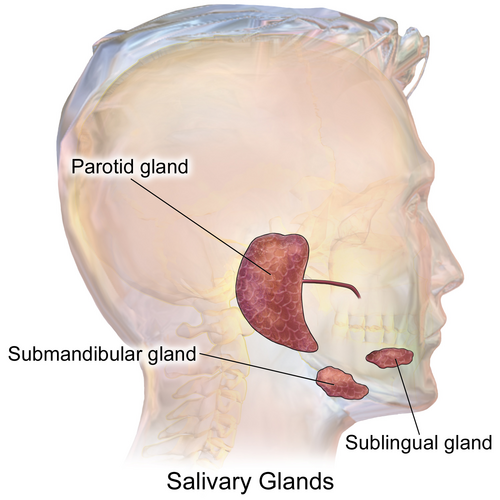
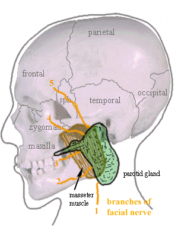

# DOENÇAS DAS GLÂNDULAS SALIVARES

Para entender as doenças das glândulas salivares, você precisa primeiro visualizar a anatomia como um mapa de riscos. Na cirurgia de cabeça e pescoço, não operamos apenas "glândulas"; operamos estruturas que protegem nervos vitais. Quando falamos de parótida, sua mente deve desenhar imediatamente o **Nervo Facial (VII par)**. Quando falamos de submandibular, o foco é o **Nervo Lingual** e o **Hipoglosso**.

As bancas de residência adoram este tema porque ele mistura raciocínio clínico (dor ao comer), microbiologia (infecções pós-operatórias) e oncologia. Vamos dissecar cada ponto conforme o que realmente cai nas provas.

## Anatomia Clínica e Fisiologia

*Figura 1 - Anatomia das glândulas salivares maiores: parótida, submandibular e sublingual, evidenciando sua localização e ductos. Fonte: Blausen Medical, CC BY 3.0 | Wikimedia Commons*: O que importa para o cirurgião

As glândulas salivares são divididas em maiores (Parótidas, Submandibulares e Sublinguais) e menores (espalhadas pela mucosa oral).

A **Glândula Parótida** é a maior delas. O ponto crucial aqui é que o nervo facial a atravessa, dividindo-a anatomicamente em lobo superficial e lobo profundo. Guarde isso: a maioria dos tumores (cerca de 80%) ocorre no lobo superficial. Por isso, a cirurgia mais realizada é a **parotidectomia superficial** (ou lobectomia lateral), visando preservar o nervo.

A **Glândula Submandibular** drena pelo **Ducto de Wharton**. Este ducto tem um trajeto ascendente e a saliva ali é mais espessa, rica em cálcio e fosfato. Por que isso é importante? Porque é o local onde mais ocorrem cálculos (sialolitíase). Se a prova citar cálculo salivar, 80-90% das vezes ele estará na submandibular.

*Figura 2 - Anatomia detalhada da glândula parótida e sua relação com o músculo masseter. Fonte: med.mun.ca, CC BY-SA 3.0 | Wikimedia Commons*

## Sialolitíase: A Obstrução Mecânica

O quadro clássico que você encontrará na prova é o paciente que apresenta **dor e aumento de volume glandular pós-prandial** (logo após comer).

### Fisiopatologia: O "Porquê" da Dor

Quando o paciente vê ou cheira comida, há um estímulo parassimpático para a produção de saliva. Se existe um cálculo obstruindo o ducto, a saliva é produzida, mas não consegue sair. A glândula distende abruptamente, causando dor em cólica e edema. Após algum tempo, a pressão diminui e o inchaço regride, até a próxima refeição.

### Diagnóstico e Conduta

O exame físico pode revelar um cálculo palpável no assoalho da boca (se for no ducto de Wharton).

- **Exame de escolha:** Atualmente, a **Tomografia Computadorizada (TC)** de cortes finos sem contraste é considerada superior à radiografia simples, pois muitos cálculos são pouco radiopacos. A ultrassonografia (USG) é boa para triagem, mas operador-dependente.

- **Tratamento:** Inicialmente clínico (hidratação, sialogogos como limão para "forçar" a saída, massagem). Se houver infecção associada, antibióticos. Se o cálculo for grande ou proximal, a remoção cirúrgica ou por sialoendoscopia é necessária.

## Sialadenite Bacteriana Aguda: O Perigo no Pós-Operatório

Aqui está uma das pegadinhas preferidas das bancas. Imagine um paciente idoso, que acabou de passar por uma cirurgia abdominal de grande porte, está em jejum e levemente desidratado. De repente, ele evolui com dor, febre e um inchaço endurecido na região da parótida.

### O Agente e o Fator de Risco

O agente etiológico mais comum é o **Staphylococcus aureus**.
**Por que acontece?** A desidratação reduz o fluxo salivar (estase). Sem o fluxo constante de saliva, que tem propriedades bacteriostáticas, as bactérias da própria flora oral ascendem pelo ducto (via retrógrada) e colonizam a glândula.

### Diagnóstico Diferencial: Caxumba vs. Bacteriana

- **Caxumba (Parotidite Epidêmica):** Geralmente bilateral, em crianças/jovens, viral (Paramyxovírus). Um marcador clássico de prova é a **amilasemia elevada** (a amilase salivar sobe, não confunda com pancreatite se não houver dor abdominal). A complicação mais comum da caxumba é a **meningite asséptica**, e não a orquite (embora a orquite seja muito famosa).

- **Bacteriana:** Geralmente unilateral, com saída de pus pelo ducto à expressão glandular, febre alta e leucocitose.

| Característica | Sialadenite Bacteriana | Parotidite Viral (Caxumba) |
| --- | --- | --- |
| **Lateralidade** | Geralmente Unilateral | Geralmente Bilateral |
| **Aspecto da Saliva** | Purulenta (pus no ducto) | Clara ou reduzida |
| **Agente** | *S. aureus* | Paramyxovírus |
| **Público-alvo** | Idosos, desidratados, pós-op | Crianças e jovens não vacinados |
| **Tratamento** | Antibiótico + Hidratação | Suporte / Sintomáticos |

## Neoplasias das Glândulas Salivares: A Regra de Ouro

Para as neoplasias, existe uma regra prática que o Dr. Will sempre reforça: **Quanto menor a glândula, maior a chance de o tumor ser maligno.**

- **Parótida:** 80% dos tumores de glândulas salivares estão aqui. Destes, 80% são benignos.

- **Submandibular:** Cerca de 50% são benignos e 50% malignos.

- **Glândulas Menores:** Cerca de 80% são **malignos**.

### Sinais de Alerta para Malignidade

Se a questão descreve um nódulo parotídeo, como saber se ele é "do mal"?

- **Paralisia Facial (VII par):** É o sinal mais fidedigno de malignidade. Um tumor benigno pode ser enorme, mas ele empurra o nervo, não o invade. Se o nervo parou de funcionar, o tumor o infiltrou.

- **Crescimento rápido e fixação** a planos profundos.

- **Presença de linfonodomegalias** cervicais suspeitas.

- **Dor severa** (embora alguns tumores benignos possam doer levemente, a dor intensa sugere invasão perineural).

### Tumores Benignos

#### 1. Adenoma Pleomórfico (Tumor Misto Benigno)

É o campeão das provas. É o tumor salivar mais comum em adultos e crianças.

- **Clínica:** Nódulo de crescimento lento, indolor, móvel, geralmente na cauda da parótida.

- **Por que operar?** Embora benigno, ele tem dois problemas: 1) Pode sofrer transformação maligna após anos (Carcinoma ex-adenoma pleomórfico); 2) Tem alta taxa de recidiva se for apenas "enucleado". Por isso, o tratamento é a **parotidectomia superficial com preservação do nervo facial**.

#### 2. Tumor de Warthin (Cistoadenoma Papilífero Linfomatoso)

O segundo mais comum da parótida.

- **Perfil do paciente:** Homem, idoso, **tabagista**.

- **Pérola de prova:** É o tumor que mais frequentemente se apresenta de forma **bilateral** (em tempos diferentes ou simultâneos) e multicêntrico.

### Tumores Malignos

#### 1. Carcinoma Mucoepidermoide

É o tumor maligno mais comum das glândulas salivares (tanto em adultos quanto em crianças).

- Ele é classificado em baixo, intermediário e alto grau.

- O de baixo grau tem comportamento indolente, enquanto o de alto grau é agressivo, com metástases linfonodais frequentes.

#### 2. Carcinoma Adenoide Cístico (Cilindroma)

Famoso pelo seu **neurotropismo** (gosta de "correr" por dentro dos nervos).

- Tem um crescimento lento, mas é implacável. Pode dar metástases a distância (pulmão é o sítio principal) muitos anos após o tratamento inicial.

- A sobrevida em 5 anos é boa, mas em 20 anos é baixa.

#### 3. Metástases para a Parótida

Não esqueça: a parótida contém linfonodos em seu parênquima. Portanto, um nódulo na parótida pode ser uma metástase de um câncer de pele (melanoma ou CEC de face/couro cabeludo) ou até de pulmão.

## Diagnóstico e Estadiamento

Diante de um nódulo de glândula salivar, o fluxograma mental deve ser:

- **História e Exame Físico:** Avaliar função do nervo facial e linfonodos.

- **PAAF (Punção Aspirativa por Agulha Fina):** Muito útil para diferenciar lesão inflamatória de neoplásica e sugerir se é benigno ou maligno. Ajuda no planejamento cirúrgico.

- **Imagem:**

- **USG:** Bom para ver se é sólido ou cístico.

- **TC ou RM:** Essenciais para tumores volumosos, suspeita de malignidade ou invasão de lobo profundo. A RM é superior para avaliar invasão perineural (especialmente no Adenoide Cístico).

**Erro comum de prova:** Achar que biópsia incisional (cortar um pedaço do tumor) é a primeira escolha. **Nunca faça biópsia incisional em nódulo de parótida!** Isso rompe a cápsula do tumor, aumenta o risco de disseminação e de recidiva local (especialmente no adenoma pleomórfico). O diagnóstico é PAAF + Histopatológico da peça cirúrgica.

## Cirurgia e Complicações: O Pós-Operatório

A parotidectomia é a cirurgia padrão. Como professor, vejo muitos alunos confundirem as complicações. Vamos organizar isso.

### 1. Lesão do Nervo Facial

É a complicação mais temida e comum (em sua forma transitória).

- Pode ocorrer por tração do nervo durante a cirurgia (praxia) ou por secção acidental/deliberada (se o tumor estiver invadindo o nervo).

- Se o paciente acorda com paralisia total após uma cirurgia onde o cirurgião disse que o nervo estava íntegro, a conduta inicial é expectante (fisioterapia e corticoides), pois pode ser apenas edema.

### 2. Síndrome de Frey (Síndrome do Nervo Auriculotemporal)

Esta cai muito! Ocorre meses após a parotidectomia.

- **Fisiopatologia:** Durante a regeneração nervosa, as fibras parassimpáticas (que antes faziam a glândula produzir saliva) se "confundem" e reinervam as glândulas sudoríparas da pele sobrejacente.

- **Clínica:** O paciente apresenta **suor e vermelhidão na face enquanto come** (estímulo gustatório).

- **Diagnóstico:** Teste de Minor (passa-se iodo na face, depois amido; o suor faz a mistura ficar azul/preta).

### 3. Fístula Salivar

Acúmulo de saliva sob o retalho cutâneo ou drenagem persistente pela ferida. O tratamento geralmente é conservador com curativos compressivos e dieta com restrição de sialogogos.

### 4. Síndrome de Horner - A Pegadinha

Muitas questões colocam a Síndrome de Horner (miose, ptose, anidrose) como complicação da parotidectomia. **Isso está errado.** A Síndrome de Horner ocorre por lesão da cadeia simpática cervical, que fica profunda ao músculo esternocleidomastoideo, longe do campo habitual da parótida superficial. Ela pode ocorrer em esvaziamentos cervicais radicais, mas não é complicação típica de parotidectomia.

## Diagnóstico Diferencial de Massas Cervicais

Nem tudo que incha perto da orelha é parótida. No MedEvo, sempre ensinamos a olhar a idade do paciente:

- **Criança/Jovem:** Pensar em causas inflamatórias (linfadenites) ou congênitas (**Cisto Branquial** - tipicamente na borda anterior do esternocleidomastoideo).

- **Adulto/Idoso:** Pensar em neoplasia até que se prove o contrário.

A **Síndrome de Gradenigo** é outra pérola que aparece em questões de otorrino/cabeça e pescoço: é a tríade de otite média + dor retro-orbital (nervo trigêmeo) + paralisia do VI par (diplopia). Ocorre por petrosite apical. Embora não seja primariamente da glândula salivar, as bancas misturam com parotidites por proximidade anatômica.

## Tabelas Comparativas para Revisão Rápida

### Tabela 1: Tumores Benignos vs. Malignos

| Característica | Benigno (Ex: Adenoma Pleomórfico) | Maligno (Ex: Carcinoma Mucoepidermoide) |
| --- | --- | --- |
| **Velocidade de Crescimento** | Lento (anos) | Rápido (meses) |
| **Consistência** | Fibroelástica | Endurecida / Pétrea |
| **Mobilidade** | Móvel | Fixo / Aderido |
| **Nervo Facial** | Preservado | Pode haver paralisia |
| **Dor** | Ausente ou leve | Pode ser intensa (invasão nervosa) |
| **Linfonodos** | Normais | Podem estar aumentados/suspeitos |

### Tabela 2: Principais Neoplasias e suas "Marcas Registradas"

| Neoplasia | Marca Registrada para a Prova |
| --- | --- |
| **Adenoma Pleomórfico** | Mais comum de todos; risco de malignização; requer margem. |
| **Tumor de Warthin** | Homem, idoso, fumante; bilateralidade; "quente" no mapeamento. |
| **Carcinoma Mucoepidermoide** | Maligno mais comum; ocorre também em crianças. |
| **Carcinoma Adenoide Cístico** | Invasão perineural; metástase pulmonar tardia. |
| **Carcinoma ex-adenoma** | Surgimento de dor/paralisia em nódulo antigo e estável. |

## Tratamento Farmacológico e Condutas Específicas

### Sialadenite Bacteriana Aguda

- **Antibioticoterapia:** Deve cobrir *S. aureus*. A primeira escolha costuma ser **Amoxicilina + Clavulanato** ou Cefalosporinas de 1ª geração (Cefalexina). Se o paciente estiver grave ou internado, considerar Oxacilina ou Clindamicina.

- **Dose:** Amoxicilina/Clavulanato 875/125mg de 12/12h por 7 a 10 dias.

- **Medidas Adjuvantes:** Hidratação vigorosa (fundamental!), sialogogos (balas de limão), massagem glandular (ordenha) e higiene oral rigorosa.

*Figura 2 - Anatomia detalhada da glândula parótida e sua relação com o músculo masseter. Fonte: med.mun.ca, CC BY-SA 3.0 | Wikimedia Commons*

## Sialolitíase

- **Sintomáticos:** AINEs para dor e edema.

- **Intervenção:** Se o cálculo tiver < 5mm no ducto, pode sair espontaneamente com sialogogos. Se > 7mm ou proximal, a intervenção (cirúrgica ou endoscópica) é a regra.

## Pontos-Chave para Prova 💡

- **O tumor mais comum** das glândulas salivares (geral e benigno) é o Adenoma Pleomórfico.

- **O tumor maligno mais comum** é o Carcinoma Mucoepidermoide.

- **Localização mais frequente** de tumores: Glândula Parótida (70-80%).

- **Localização mais frequente de cálculos (sialolitíase):** Glândula Submandibular (Ducto de Wharton).

- **Sinal de malignidade absoluta** em tumor de parótida: Paralisia Facial (lesão do VII par).

- **Agente da parotidite pós-operatória:** *Staphylococcus aureus*. O fator de risco principal é a desidratação.

- **Tumor de Warthin:** Associar imediatamente com tabagismo e bilateralidade.

- **Síndrome de Frey:** Suor gustatório após parotidectomia; causada por reinervação aberrante do nervo auriculotemporal.

- **Síndrome de Horner:** NÃO é complicação de parotidectomia (pegadinha clássica).

- **Caxumba:** A complicação mais comum é a meningite asséptica. A amilase sérica sobe devido à inflamação salivar.

- **Biópsia Incisional:** Contraindicada em nódulos de parótida pelo risco de disseminação e fístula. Usa-se PAAF.

- **Tratamento do Adenoma Pleomórfico:** Parotidectomia superficial com preservação do nervo facial (nunca apenas enucleação).

- **Carcinoma Adenoide Cístico:** Tem como característica principal o neurotropismo (disseminação perineural).

- **Metástases para parótida:** Os sítios primários mais comuns são pele da face (CEC e Melanoma) e pulmão.

- **Dor pós-prandial + edema submandibular:** Diagnóstico clínico de sialolitíase até que se prove o contrário.

- **Exame de imagem padrão-ouro para cálculos:** Tomografia Computadorizada (TC) sem contraste.

- **Cisto Branquial:** Principal diagnóstico diferencial de massa cervical lateral em jovens, situado na borda anterior do esternocleidomastoideo.

- **Lobectomia lateral da parótida:** É o mesmo que parotidectomia superficial; o limite é o plano do nervo facial.

 Cópia offline para consulta pessoal.
 Fonte original:
 [https://www.medevo.com.br/material-apoio/ler/609e9a3b-65c0-45e5-ab7e-f2d1ecad133a](https://www.medevo.com.br/material-apoio/ler/609e9a3b-65c0-45e5-ab7e-f2d1ecad133a)
