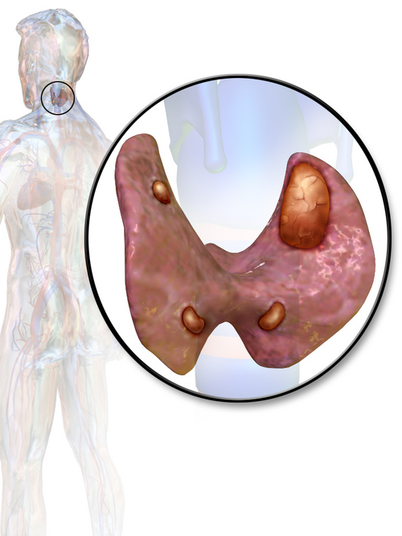

# DOENÇAS DAS PARATIREOIDES

Para entender as doenças das paratireoides, você precisa primeiro esquecer a tireoide. Embora compartilhem o "aluguel" no pescoço, as funções são mundos distintos. Como professor, vejo muitos alunos patinando em questões de prova porque tentam decorar valores de cálcio sem entender a lógica do Paratormônio (PTH).

As paratireoides são os "sensores de cálcio" do corpo. Se o cálcio iônico cai, elas disparam PTH. O PTH vai ao osso (tira cálcio de lá), ao rim (reabsorve cálcio e joga fora fósforo) e, indiretamente via Vitamina D, ao intestino (absorve mais cálcio). Se você entender esse triângulo — Osso, Rim, Intestino — você mata 80% das questões.

## Fisiologia Aplicada: O Porquê do Equilíbrio

*Figura 1 - Localização anatômica das quatro glândulas paratireoides na face posterior da tireoide. Fonte: CFCF, Domínio Público | Wikimedia Commons*

O cálcio não circula sozinho. Cerca de 40-45% está ligado à albumina. Isso é um "pega" clássico de prova. Se o seu paciente tem albumina baixa (desnutrido, cirrótico), o cálcio total virá baixo, mas o cálcio iônico (a fração ativa) pode estar normal.

Sempre que vir uma questão com cálcio baixo e albumina baixa, use a fórmula de correção:
**Cálcio Corrigido = Cálcio Medido + [0,8 x (4,0 - Albumina)]**.

O PTH tem uma relação de "amor e ódio" com o fósforo. No rim, o PTH é fosfatúrico. Ele diz ao rim: "Segure o cálcio, mas jogue o fósforo fora". Por isso, no Hiperparatireoidismo Primário, o cenário clássico é Cálcio ALTO e Fósforo BAIXO. Se o fósforo estiver alto junto com o cálcio, desconfie de outra coisa (como metástases ósseas ou intoxicação por Vitamina D).

*Figura 2 - Adenoma de paratireoide: representação de uma glândula aumentada produzindo PTH de forma autônoma (responsável por 85-90% dos casos de HPTP). Fonte: Blausen Medical, CC BY 3.0 | Wikimedia Commons*

## Hiperparatireoidismo Primário (HPTP)

Esta é a vedete das provas de residência. O HPTP ocorre quando uma ou mais glândulas perdem o "sensor" e passam a produzir PTH de forma autônoma, ignorando que o cálcio já está alto.

### Etiologia e Patologia

Em 85% a 90% dos casos, a culpa é de um **Adenoma Único**. É uma glândula só que resolveu trabalhar demais. Em cerca de 10-15%, temos a hiperplasia das quatro glândulas (comum em síndromes genéticas). O carcinoma de paratireoide é raríssimo (<1%), mas as bancas adoram porque ele causa hipercalcemias severas (>14 mg/dL) e massas palpáveis no pescoço.

### Quadro Clínico: Do "Bones, Stones, Groans and Moans" ao Assintomático

Antigamente, o diagnóstico era feito pela "tétrade clássica":

- **Bones (Ossos):** Osteíte fibrosa cística, reabsorção subperiosteal (clássica nas falanges distais) e tumor marrom.

- **Stones (Cálculos):** Nefrolitíase recorrente (oxalato de cálcio).

- **Groans (Gemidos abdominais):** Constipação, pancreatite e úlcera péptica (o cálcio alto estimula a gastrina).

- **Moans (Lamentos psiquiátricos):** Depressão, confusão mental e fadiga.

Hoje, no entanto, a maioria dos pacientes é **assintomática**. Eles descobrem a doença em um check-up de rotina com cálcio total de 10,8 ou 11,2 mg/dL. Aqui entra o Dr. Will para te dar um aviso: não ignore um cálcio "levemente" aumentado. Se o PTH estiver alto ou "inadequadamente normal" (dentro do valor de referência, mas deveria estar suprimido pelo cálcio alto), o diagnóstico está feito.

### Critérios Cirúrgicos no Paciente Assintomático

Se o paciente tem sintomas (pedra no rim, fratura), a cirurgia é obrigatória. Mas e se ele não sente nada? Segundo o Consenso Internacional (e adotado pela SBEM), operamos o assintomático se ele preencher **UM** dos seguintes critérios:

| Critério | Valor/Definição |
| --- | --- |
| **Cálcio Sérico** | > 1,0 mg/dL acima do limite superior do normal |
| **Idade** | < 50 anos (pelo risco de complicações futuras) |
| **Função Renal** | Clearance de Creatinina < 60 ml/min |
| **Densitometria Óssea** | T-score ≤ -2,5 em rádio distal, coluna ou fêmur |
| **Fratura Vertebral** | Identificada por RX, TC, RM ou VFA |
| **Calciúria de 24h** | > 400 mg/dia E perfil de risco litogênico aumentado |
| **Presença de Litíase** | Nefrolitíase ou nefrocalcinose oculta em exames de imagem |

**Dica de Prova:** A banca vai colocar um paciente de 65 anos, com cálcio de 10,6 (limite 10,2) e densitometria normal. Conduta? Observação. Se ele tivesse 45 anos? Cirurgia. A idade é um divisor de águas.

### Diagnóstico por Imagem: Localização, não Diagnóstico

Um erro comum que vejo alunos cometerem em provas práticas e teóricas: pedir Cintilografia com Sestamibi para "diagnosticar" hiperparatireoidismo.
**O diagnóstico é BIOQUÍMICO (Cálcio + PTH).**
Os exames de imagem (Ultrassom e Sestamibi) servem apenas para o cirurgião saber onde está o adenoma e planejar uma cirurgia minimamente invasiva. Se os exames de imagem forem negativos, mas o bioquímico for positivo, o paciente **ainda assim** tem indicação de cirurgia (exploração cervical bilateral).

## Hiperparatireoidismo Secundário e Terciário

Aqui o cenário muda. O problema não é a paratireoide, mas sim o Rim que parou de funcionar.

-

**Secundário:** O paciente renal crônico não consegue excretar fósforo e não ativa a Vitamina D. O fósforo alto "sequestra" o cálcio. O cálcio baixo estimula as paratireoides a trabalharem freneticamente.

- *Laboratório:* Cálcio baixo/normal, Fósforo alto, PTH muito alto.

- *Tratamento:* Dieta, quelantes de fósforo, calcitriol e calcimiméticos (cinacalcete).

-

**Terciário:** Após anos de estímulo no hiperparatireoidismo secundário, as glândulas sofrem uma mutação e tornam-se autônomas. Elas não param de produzir PTH mesmo se o cálcio subir (comum após transplante renal).

- *Laboratório:* Cálcio ALTO, PTH MUITO ALTO.

- *Tratamento:* Cirurgia (Paratireoidectomia subtotal ou total com autotransplante).

## Neoplasia Endócrina Múltipla (NEM)

Se a questão mencionar hiperparatireoidismo associado a outros tumores, você deve pensar em NEM. No MedEvo, sempre reforçamos a regra dos "Ps".

-

**NEM Tipo 1 (Síndrome de Wermer):** Os 3 Ps.

- **P**aratireoide (Hiperplasia das 4 glândulas - é a manifestação mais comum e precoce).

- **P**âncreas (Tumores neuroendócrinos, como Gastrinoma/Síndrome de Zollinger-Ellison ou Insulinoma).

- **P**ituitária (Prolactinoma é o mais comum).

-

**NEM Tipo 2A (Síndrome de Sipple):**

- Carcinoma Medular de Tireoide (100% dos casos).

- Feocromocitoma.

- Hiperparatireoidismo.

**Pegadinha de Prova:** No NEM 1, o hiperparatireoidismo é por **hiperplasia** (as 4 glândulas estão doentes). Portanto, a cirurgia não pode ser apenas a retirada de uma glândula, mas sim a paratireoidectomia subtotal (tira 3 e meia) ou total com autotransplante no antebraço.

## Hipoparatireoidismo e Hipocalcemia

A causa número 1 de hipoparatireoidismo no mundo é a **cirurgia cervical** (tireoidectomia total ou paratireoidectomia). O cirurgião pode remover acidentalmente as glândulas ou, mais comumente, lesar o suprimento sanguíneo delas (artéria tireóidea inferior).

### Quadro Clínico da Hipocalcemia Aguda

O cálcio baixo deixa os nervos "irritáveis". O paciente começa com parestesia perioral (formigamento em volta da boca) e nas extremidades dos dedos. Se evoluir, teremos:

- **Sinal de Chvostek:** Percussão do nervo facial à frente do trago resulta em contração da musculatura facial ipsilateral.

- **Sinal de Trousseau:** Insuflação do manguito de pressão 20 mmHg acima da PAS por 3 minutos causa carpopedismo (mão em garra). Este sinal é mais específico que o Chvostek.

- **Tetania e Convulsões:** Em casos graves.

- **Prolongamento do intervalo QT** no ECG (risco de arritmias).

### Manejo da Hipocalcemia Pós-Operatória

Nem toda hipocalcemia pós-tireoidectomia é definitiva. Muitas vezes é apenas um "atordoamento" transitório das glândulas.

- **Sintomático ou Cálcio < 7,5 mg/dL:** Emergência. Gluconato de Cálcio 10% IV (1 a 2 ampolas em 10-20 min). Cuidado com a infusão rápida (risco de parada cardíaca).

- **Assintomático e Cálcio > 8,0 mg/dL:** Reposição oral com Carbonato de Cálcio (1-3g de cálcio elementar/dia) + Vitamina D ativa (Calcitriol).

**O que é o Autotransplante?** Se durante a cirurgia o cirurgião percebe que uma paratireoide ficou isquêmica ou foi retirada acidentalmente, ele a fragmenta e a "planta" dentro do músculo esternocleidomastoideo ou na musculatura do antebraço. Isso previne o hipoparatireoidismo definitivo.

## Complicações da Cirurgia de Paratireoide

Além da hipocalcemia, o estudante de cirurgia precisa conhecer as complicações específicas da região cervical:

- **Hematoma Cervical Sufocante:** É a complicação mais temida nas primeiras horas. O sangue se acumula sob a fáscia cervical e comprime a traqueia.

- *Conduta:* Abertura imediata da ferida no leito (mesmo antes de ir para o CC) para descompressão.

- **Lesão do Nervo Laríngeo Recorrente:** Causa paralisia da corda vocal.

- *Unilateral:* Rouquidão.

- *Bilateral:* Insuficiência respiratória aguda (estridor), exigindo traqueostomia de urgência.

- **Lesão do Nervo Laríngeo Superior:** O paciente perde a capacidade de atingir tons agudos (fadiga vocal). Crucial para profissionais da voz.

- **Síndrome da Fome Óssea (Hungry Bone Syndrome):** Ocorre no pós-operatório de pacientes com hiperparatireoidismo grave e doença óssea prévia. Quando o PTH cai bruscamente após a retirada do adenoma, o osso "ávido" por cálcio retira tudo da circulação. Causa hipocalcemia severa e prolongada, mas com PTH normal ou alto (tentando compensar).

## Diagnóstico Diferencial das Hipercalcemias

Nem tudo que brilha é ouro, e nem todo cálcio alto é paratireoide.

| Causa | PTH | Fósforo | Dica Clínica |
| --- | --- | --- | --- |
| **HPTP** | Alto | Baixo | Adenoma, assintomático, PTH alto. |
| **Malignidade** | Baixo | Variável | PTH-rp alto (carcinomas epidermoides) ou metástases ósseas. |
| **Intox. Vit. D** | Baixo | Alto | Uso de suplementos, sarcoidose (produção ectópica). |
| **HHF** | Alto/Normal | Normal | Hipercalcemia Hipocalciúrica Familiar. Cálcio na urina é BAIXO (<100mg/24h). |

**Atenção com a HHF:** É uma doença genética onde o "sensor" de cálcio do corpo está desregulado. O paciente tem cálcio alto a vida toda e o corpo acha que está tudo bem. **NÃO OPERAR.** Se a questão der um cálcio alto com cálcio urinário muito baixo, pense em HHF.

## Tratamento Cirúrgico: A Técnica

A cirurgia padrão-ouro para o HPTP clássico era a exploração cervical bilateral. Hoje, com exames de imagem melhores, fazemos a **Paratireoidectomia Minimamente Invasiva**.

Para garantir que o adenoma retirado era o único culpado, usamos o **Critério de Miami (PTH Intraoperatório)**:

- Coleta-se o PTH antes da indução e logo após a retirada da glândula suspeita.

- A queda deve ser **maior que 50%** em relação ao maior valor pré-retirada (após 10 minutos).

- Se não cair 50%, o cirurgião deve procurar outras glândulas doentes (adenoma duplo ou hiperplasia).

## Resumo de Condutas Farmacológicas

Para o tratamento clínico (quando a cirurgia é contraindicada ou recusada):

- **Cinacalcete:** Um calcimimético que "engana" a paratireoide, fazendo-a pensar que o cálcio está alto, reduzindo o PTH. Dose inicial de 30mg 2x/dia.

- **Bisfosfonatos (Alendronato):** Não resolvem o PTH, mas protegem o osso da reabsorção.

- **Hidratação Venosa:** No caso de crise hipercalcêmica (Cálcio > 14 mg/dL), a primeira medida é sempre hidratação vigorosa com Soro Fisiológico 0,9% para aumentar a excreção renal de cálcio.

## Pontos-Chave para Prova

- **Diagnóstico de HPTP:** Cálcio aumentado + PTH aumentado (ou normal-alto). O fósforo geralmente está baixo.

- **Indicação Cirúrgica (Assintomático):** Idade < 50 anos, Cálcio > 1mg/dL acima do limite, ClCr < 60, T-score < -2,5 ou evidência de litíase renal.

- **Localização:** Ultrassom e Cintilografia com Sestamibi são para planejamento cirúrgico, não para diagnóstico.

- **NEM 1:** Paratireoide (Hiperplasia), Pâncreas e Pituitária.

- **NEM 2A:** CMT, Feocromocitoma e Paratireoide.

- **Sinal de Trousseau:** Mais sensível e específico que o Chvostek para hipocalcemia.

- **Tratamento da Crise Hipercalcêmica:** 1º Hidratação venosa; 2º Furosemida (após hidratar); 3º Bisfosfonatos IV (Zoledronato).

- **Cálcio Urinário:** Se < 100 mg/24h em paciente com hipercalcemia e PTH alto, suspeite de Hipercalcemia Hipocalciúrica Familiar (HHF). Não opere!

- **Critério de Miami:** Queda > 50% do PTH intraoperatório após 10 min da retirada da glândula.

- **Complicação Pós-Op Imediata:** Hematoma cervical sufocante (abrir a ferida no leito!).

- **Rouquidão Pós-Tireoidectomia:** Lesão do nervo laríngeo recorrente.

- **Fome Óssea:** Hipocalcemia com PTH normal/alto após cirurgia de hiperparatireoidismo grave.

- **Autotransplante:** Feito no músculo (braço ou pescoço) para evitar hipoparatireoidismo definitivo se a glândula for lesada.

- **Fórmula de Correção do Cálcio:** Essencial se a albumina estiver < 4,0 g/dL.

- **Contraindicação Absoluta à Cirurgia:** Não há, exceto se o paciente não tiver condições clínicas mínimas para anestesia.

- **Primeira Escolha no HPTP:** Paratireoidectomia (cura > 95% dos casos).

- **O que NÃO fazer:** Não pedir Sestamibi se o cálcio e o PTH estiverem normais. 💡

 Cópia offline para consulta pessoal.
 Fonte original:
 [https://www.medevo.com.br/material-apoio/ler/4f21a62b-9a91-4849-85f9-874740211bf1](https://www.medevo.com.br/material-apoio/ler/4f21a62b-9a91-4849-85f9-874740211bf1)
