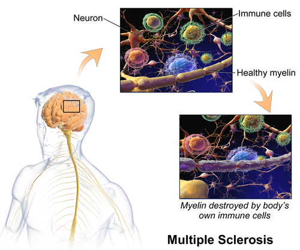
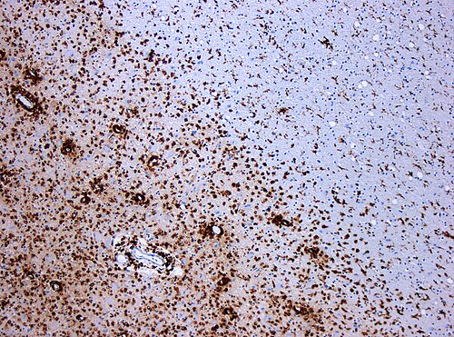

# DOENÇAS DESMIELINIZANTES

Para entender as doenças desmielinizantes, você precisa primeiro visualizar o neurônio como um fio elétrico. A mielina é a fita isolante. Se a fita estraga, a condução do impulso "vaza" ou fica lenta. É exatamente isso que as bancas cobram: a falha na condução nervosa.

Mas aqui está o primeiro segredo que separa o aluno que decora do aluno que entende: a mielina do Sistema Nervoso Central (SNC) é produzida pelos **oligodendrócitos**, enquanto a do Sistema Nervoso Periférico (SNP) é feita pelas **Células de Schwann**.

Por que isso importa? Porque se a doença ataca o oligodendrócito (como na Esclerose Múltipla), o problema é no cérebro ou na medula. Se ataca a célula de Schwann (como no Guillain-Barré), o problema é no nervo. Guarde isso, pois é a base da topografia neurológica.

## Esclerose Múltipla (EM)

*Figura 1 - Representação da desmielinização na esclerose múltipla: os linfócitos T e B atacam a bainha de mielina dos neurônios do SNC, comprometendo a condução nervosa. Fonte: BruceBlaus, CC BY-SA 4.0 | Wikimedia Commons*

A Esclerose Múltipla é a "doença das mil faces" e a rainha das provas de residência. Ela é uma doença autoimune, inflamatória e crônica, onde o próprio corpo ataca a mielina do SNC.

### Epidemiologia e Fisiopatologia

O perfil clássico é a mulher jovem (20 a 40 anos), de etnia branca, que vive em latitudes elevadas (longe do equador). A patogênese envolve uma interação complexa entre genética e ambiente (baixa vitamina D, tabagismo, infecção pelo vírus Epstein-Barr).

O que acontece lá dentro? Linfócitos T e B atravessam a barreira hematoencefálica e promovem um ataque à bainha de mielina. O resultado clínico imediato é a redução da velocidade de condução do impulso nervoso. Com o tempo, o dano deixa de ser apenas na mielina e passa a ser axonal (neurodegeneração), o que explica a incapacidade permanente.

### Formas Clínicas

Não trate toda EM como igual. A diretriz brasileira e o consenso internacional dividem a doença em:

- **Esclerose Múltipla Remitente-Recorrente (EMRR):** É a forma mais comum (85%). O paciente tem um "surto" (déficit neurológico que dura mais de 24h), melhora quase totalmente, e fica bem até o próximo surto.

- **Esclerose Múltipla Primariamente Progressiva (EMPP):** O paciente piora desde o primeiro dia, sem surtos claros. É mais comum em homens e tem pior prognóstico.

- **Esclerose Múltipla Secundariamente Progressiva (EMSP):** O paciente começou como EMRR, mas depois de anos, parou de ter surtos e começou a piorar de forma constante.

### O Quadro Clínico e o Exame Físico

A banca vai te dar "pistas" espalhadas pelo corpo. Se os sintomas não podem ser explicados por uma única lesão anatômica, pense em EM.

- **Neurite Óptica:** É a manifestação inicial em 25% dos casos. O paciente relata dor à movimentação ocular, perda visual aguda (geralmente unilateral) e discromatopsia (perda da percepção de cores, especialmente o vermelho). No exame, você encontrará o Defeito Pupilar Aferente Relativo (Pupila de Marcus-Gunn).

- **Sinais de Tronco e Cerebelo:** Diplopia (por oftalmoplegia internuclear - lesão do fascículo longitudinal medial), ataxia e disartria.

- **Sintomas Sensitivos:** Parestesias (formigamentos) e o famoso **Sinal de Lhermitte** (sensação de choque que desce pelas costas ao flexionar o pescoço).

- **Fenômeno de Uhthoff:** Piora dos sintomas neurológicos com o aumento da temperatura corporal (banho quente, febre ou exercício). Isso não é um surto novo, é uma "pseudocrise".

*Figura 2 - Lesão desmielinizante da EM: imunohistoquímica para CD68 evidenciando numerosos macrófagos (marrom) na placa ativa. Fonte: Marvin 101, CC BY-SA 3.0 | Wikimedia Commons*

### Diagnóstico: Os Critérios de McDonald (2017)

Para diagnosticar EM, precisamos provar duas coisas: **Disseminação no Espaço (DIS)** e **Disseminação no Tempo (DIT)**.

A Ressonância Magnética (RM) de crânio e medula é o padrão-ouro. Procuramos lesões hiperintensas em T2/FLAIR em áreas típicas: periventriculares, justacorticais, infratentoriais ou medulares.

- **DIS:** Lesões em 2 ou mais áreas típicas do SNC.

- **DIT:** Presença simultânea de lesões que captam gadolínio (agudas) e lesões que não captam (antigas) OU uma nova lesão em RM subsequente OU a presença de **Bandas Oligoclonais (BOC)** no líquor.

Cuidado: As bandas oligoclonais no líquor não são patognomônicas, mas sugerem fortemente a produção intrathecal de anticorpos, ajudando a fechar o critério de tempo no primeiro surto (Síndrome Clínica Isolada - CIS).

### Tratamento da Esclerose Múltipla

Dividimos em dois momentos: o tratamento do surto e o tratamento modificador da doença (DMT).

**1. Tratamento do Surto:**
O objetivo é reduzir a inflamação rápido. Usamos **Pulsoterapia com Metilprednisolona** (1g/dia por 3 a 5 dias, via intravenosa).
*Dica do Dr. Will:* O corticoide não muda o prognóstico a longo prazo, ele apenas encurta a duração do surto. Se o surto for grave e não responder ao corticoide, a segunda linha é a Plasmaférese.

**2. Tratamento de Manutenção (DMT):**
Aqui o objetivo é evitar novos surtos e a progressão da deficiência.

- **Primeira linha (casos leves/moderados):** Interferon-beta, Glatâmer, Teriflunomida.

- **Alta eficácia (casos agressivos):** Natalizumabe, Fingolimode, Ocrelizumabe (único aprovado para a forma Primariamente Progressiva), Alemtuzumabe.

Antes de iniciar imunossupressores potentes, a diretriz exige a prevenção de infecções, como triagem para tuberculose e hepatites.

## Neuromielite Óptica (Doença de Devic)

Muitas vezes confundida com a EM, a NMO é uma entidade distinta e mais grave. Aqui, o alvo é a **Aquaporina-4 (AQP4)**, um canal de água nos astrócitos.

### Como diferenciar da EM na prova?

- **Clínica:** A NMO costuma ter neurites ópticas bilaterais e simultâneas, além de mielites transversas extensas (que ocupam 3 ou mais segmentos vertebrais na RM).

- **Anticorpo:** Presença do **Anti-AQP4 (IgG-NMO)** no sangue. É altamente específico.

- **RM de Crânio:** Frequentemente normal no início (diferente da EM).

- **Associação:** Muito comum em pacientes com outras doenças autoimunes, como Lúpus (LES) ou Síndrome de Sjögren.

*Atenção:* Se você tratar um paciente com NMO usando Interferon (droga de EM), ele pode piorar gravemente. Por isso o diagnóstico diferencial é vital.

## Síndrome de Guillain-Barré (SGB)

Saímos do SNC e entramos no Sistema Nervoso Periférico. A SGB é uma polirradiculoneuropatia desmielinizante inflamatória aguda. É a causa mais comum de paralisia flácida aguda no mundo.

### O Gatilho Infeccioso

Em 70% dos casos, há uma infecção precedente (1 a 3 semanas antes). O vilão clássico das provas é o ***Campylobacter jejuni*** (causador de diarreia). Outros agentes incluem Influenza, Zika Vírus, Citomegalovírus e, mais recentemente, COVID-19.

O mecanismo é o **mimetismo molecular**: o sistema imune cria anticorpos contra o açúcar da bactéria, mas esse açúcar é idêntico aos gangliosídeos dos nossos nervos. O corpo ataca o invasor e, por "engano", destrói a própria mielina.

### Quadro Clínico: A Tríade Clássica

As bancas amam descrever este cenário:

- **Fraqueza Muscular Ascendente:** Começa nas pernas e sobe para braços e face. É simétrica.

- **Arreflexia ou Hiporreflexia:** Como o problema é no Nervo Periférico (2º neurônio motor), o reflexo some.

- **Parestesias:** Alterações de sensibilidade em "bota e luva".

*O perigo real:* A fraqueza pode atingir os músculos intercostais e o diafragma, levando à insuficiência respiratória. Além disso, a **disautonomia** (arritmias, oscilações de pressão arterial, retenção urinária) é uma causa importante de morte súbita nesses pacientes.

### Diagnóstico Laboratorial e Eletrofisiológico

O diagnóstico é clínico, mas dois exames confirmam:

- **Líquido Cefalorraquidiano (LCR):** Revela a famosa **Dissociação Albuminocitológica**. Isso significa Proteína Elevada (>45 mg/dL) com Celularidade Normal (<5-10 células/mm³).
*Cuidado:* Na primeira semana de sintomas, o líquor pode estar normal. Não exclua o diagnóstico se a punção for precoce.

- **Eletroneuromiografia (ENMG):** Mostra sinais de desmielinização (redução da velocidade de condução, aumento das latências distais e da onda F). Existe uma variante axonal chamada AMAN (Neuropatia Axonal Motora Aguda), comum pós-Campylobacter, onde a mielina está intacta, mas o axônio é destruído.

### Manejo Terapêutico

Paciente com suspeita de SGB deve ser **internado imediatamente**. O monitoramento da capacidade vital respiratória e da função autonômica é obrigatório.

- **Tratamento Específico:** Imunoglobulina Intravenosa (IgIV) ou Plasmaférese. Ambas têm eficácia equivalente. A escolha depende da disponibilidade do serviço.

- **O que NÃO fazer:** Corticosteroides. Diversos estudos mostram que corticoides isolados não têm benefício na SGB e podem até retardar a recuperação.

- **Suporte:** Prevenção de Tromboembolismo Venoso (TEV) com heparina profilática e fisioterapia motora precoce.

*Dica MedEvo:* Se a fraqueza continuar progredindo por mais de 8 semanas, mude o diagnóstico para **CIDP** (Polirradiculoneuropatia Inflamatória Desmielinizante Crônica). A SGB é aguda e autolimitada.

## Mielite Transversa Aguda (MTA)

A MTA é uma inflamação que "corta" a comunicação da medula espinhal. Pode ser idiopática ou secundária (EM, NMO, infecções).

### Clínica e Topografia

O paciente apresenta um **Nível Sensitivo** (ex: não sente nada abaixo da linha do mamilo - T4).

- **Fase Aguda:** Choque medular (paralisia flácida e arreflexia abaixo da lesão).

- **Fase Crônica:** Síndrome do Pequeno Neurônio Motor evolui para Síndrome do Grande Neurônio Motor (espasticidade, hiperreflexia e sinal de Babinski).

- **Disfunção Esfincteriana:** É precoce e comum (diferente da SGB, onde é rara e tardia).

O diagnóstico exige RM da medula para ver a lesão e excluir causas compressivas (como tumores ou hérnias). O tratamento de escolha é a pulsoterapia com metilprednisolona.

## Diagnósticos Diferenciais Importantes

Nas provas de residência, as doenças desmielinizantes são frequentemente colocadas ao lado de "mimics". Você precisa saber diferenciar:

### 1. Deficiência de Vitamina B12 (Degeneração Combinada Subaguda)

Causa mielopatia póstero-lateral. O paciente tem perda da sensibilidade vibratória e propriocepção (cordão posterior) + sinais piramidais (trato corticoespinhal). Frequentemente associada a anemia megaloblástica.

### 2. Mielopatia por HTLV-1 (HAM/TSP)

Uma paraparesia espástica tropical. É uma progressão lenta (anos), com fraqueza nos membros inferiores e bexiga neurogênica. Comum em áreas endêmicas do Brasil. O diagnóstico é feito pela sorologia/PCR para HTLV-1.

### 3. Miastenia Gravis

Aqui o problema não é a mielina, mas o receptor de acetilcolina na placa motora.

- **Diferença chave:** A fraqueza na Miastenia é **flutuante** (piora com o esforço e ao final do dia) e tem predileção por músculos oculares (ptose e diplopia). Não há alteração de sensibilidade ou reflexos. Frequentemente associada a timoma (massa em mediastino anterior).

### 4. Botulismo

Paralisia flácida, mas ao contrário da SGB, ela é **descendente** e começa pelos nervos cranianos (visão turva, midríase, disfagia).

| Característica | Esclerose Múltipla | Guillain-Barré | Miastenia Gravis |
| --- | --- | --- | --- |
| **Localização** | SNC (Oligodendrócito) | SNP (Célula Schwann) | Placa Motora |
| **Padrão de Fraqueza** | Focal / Assimétrica | Ascendente / Simétrica | Flutuante / Ocular |
| **Reflexos** | Hiperreflexia (Tardio) | Arreflexia / Hiporreflexia | Normais |
| **Líquor** | Bandas Oligoclonais | Dissoc. Albuminocitológica | Normal |
| **Tratamento Agudo** | Pulsoterapia | IgIV ou Plasmaférese | Piridostigmina / Corticoide |

## Encefalite Disseminada Aguda (ADEM)

A ADEM é uma doença desmielinizante inflamatória multifocal, geralmente monofásica, que ocorre após uma infecção ou vacinação. É muito mais comum em crianças.

Diferente da EM, o paciente com ADEM apresenta **alteração do nível de consciência** (encefalopatia), confusão mental ou coma, além dos déficits focais. A RM mostra lesões grandes, mal definidas e que captam gadolínio simultaneamente (indicando que todas as lesões têm a mesma "idade"). O tratamento é pulsoterapia com corticoide.

## Encefalites Autoimunes

Um tema que ganhou força nas provas recentes é a **Encefalite Anti-NMDA**.

- **Perfil:** Mulheres jovens, muitas vezes com teratoma de ovário.

- **Quadro:** Inicia com sintomas psiquiátricos agudos (psicose, mania), evolui para crises convulsivas, discinesias orofaciais e instabilidade autonômica.

- **Diagnóstico:** Pesquisa do anticorpo Anti-NMDR no líquor.

- **Tratamento:** Imunoterapia e retirada do tumor, se presente.

## Mielopatia por Deficiência de Cobre

Pode mimetizar a deficiência de B12. Ocorre em pacientes pós-cirurgia bariátrica, uso excessivo de zinco ou doença celíaca. Apresenta-se com ataxia e perda de sensibilidade profunda.

## Intoxicação por Chumbo (Plumbismo)

Causa uma neuropatia motora que poupa a sensibilidade. O sinal clássico é a "queda do punho" (fraqueza dos extensores do carpo). Procure na história exposição ocupacional (fábricas de baterias, tintas antigas).

## Pontos-Chave para Prova

- **SGB:** Fraqueza ascendente + arreflexia + dissociação albuminocitológica no líquor (proteína alta, células baixas).

- **SGB e Esfíncteres:** O acometimento esfincteriano na SGB é raro e tardio. Se o paciente tem nível sensitivo e perda de controle de urina precoce, pense em Mielite Transversa.

- **Tratamento SGB:** IgIV ou Plasmaférese. **Corticoides são contraindicados** (não funcionam).

- **Campylobacter jejuni:** É o principal agente associado à SGB (diarreia prévia).

- **Esclerose Múltipla:** Doença do SNC (oligodendrócitos). Disseminação no Espaço e no Tempo.

- **Neurite Óptica:** Dor ocular + perda visual + Defeito Pupilar Aferente Relativo. Conduta: Pulsoterapia e RM de crânio.

- **Sinal de Lhermitte:** Choque ao flexionar o pescoço, indica lesão na medula cervical (comum na EM).

- **Bandas Oligoclonais:** Sugerem EM, mas não são exclusivas. Indicam síntese de IgG no SNC.

- **NMO (Devic):** Anti-Aquaporina 4 positivo. Mielite extensa (>3 corpos vertebrais).

- **Fenômeno de Uhthoff:** Piora dos sintomas da EM com o calor. Não é surto!

- **Tratamento do Surto de EM:** Pulsoterapia com Metilprednisolona 1g/dia por 3-5 dias.

- **Mielina:** SNC = Oligodendrócitos; SNP = Células de Schwann.

- **ADEM:** Desmielinização pós-infecciosa em crianças com encefalopatia (alteração de consciência).

- **Miastenia Gravis:** Fraqueza flutuante, ptose, diplopia, associada a Timoma.

- **HTLV-1:** Causa paraparesia espástica tropical de progressão lenta.

- **Zika Vírus:** Importante causa de SGB no contexto epidemiológico brasileiro recente.

- **Monitorização na SGB:** O maior risco é a insuficiência respiratória e a disautonomia (arritmias). Internação em UTI/semi-intensiva é a regra.

- **Diferencial de SGB:** Se a fraqueza durar mais de 8 semanas, o diagnóstico provável é CIDP.

Lembre-se do que sempre digo nas aulas do MedEvo: a neurologia em prova é topográfica. Se você localizou a lesão (SNC vs SNP), você já eliminou metade das alternativas. Se o quadro é agudo e pós-infeccioso, pense em Guillain-Barré ou ADEM. Se é crônico e em surtos, pense em Esclerose Múltipla.

 Cópia offline para consulta pessoal.
 Fonte original:
 [https://www.medevo.com.br/material-apoio/ler/1b9728f3-139b-4ccc-802b-5182aff1b3df](https://www.medevo.com.br/material-apoio/ler/1b9728f3-139b-4ccc-802b-5182aff1b3df)
