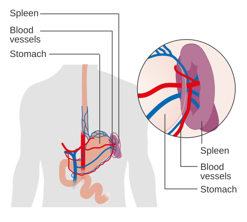
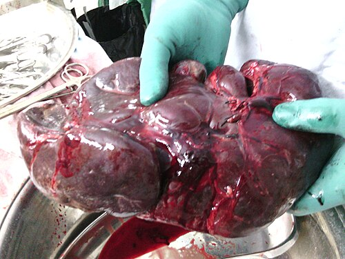

# DOENÇAS DO BAÇO

Para entender as doenças do baço, você precisa primeiro tirar da cabeça a ideia de que o baço é um órgão "esquecido" ou secundário. Na prova de residência, ele é o protagonista de questões complexas que misturam anatomia vascular, hematologia e infectologia.

Como professor, vejo muitos alunos errando questões de baço porque tentam decorar condutas sem entender a lógica vascular por trás delas. Vamos mudar isso agora.

*Figura 1 - Diagrama mostrando a posição do baço no hipocôndrio esquerdo e suas relações anatômicas. Fonte: Cancer Research UK, CC BY-SA 4.0 | Wikimedia Commons*

## Anatomia Cirúrgica e Funcional: Onde a Prova Começa

O baço é um órgão intraperitoneal, localizado no hipocôndrio esquerdo, protegido pela 9ª, 10ª e 11ª costelas. Mas o que cai na prova não é apenas a localização, é a vizinhança e a irrigação.

### Vascularização: O Caminho do Sangue

A **artéria esplênica** é o maior ramo do tronco celíaco. Ela tem um trajeto tortuoso ao longo da borda superior do pâncreas. Guarde isso: a proximidade com o pâncreas é o que torna a cirurgia esplênica perigosa para o pâncreas e a pancreatite perigosa para o baço.

A **veia esplênica** corre posterior ao pâncreas. Ela recebe a veia mesentérica inferior (VMI) e depois se une à veia mesentérica superior (VMS) para formar a **veia porta**.

**Dica de Prova:** Se um examinador perguntar sobre a "Hipertensão Porta Esquerda" (ou Sinistra), ele está falando de uma trombose isolada da veia esplênica, geralmente causada por uma pancreatite crônica. O fígado está normal, mas o baço está congestionado e o paciente tem varizes gástricas isoladas. A cura? Esplenectomia.

### Divisão Funcional do Fígado (Correlação Necessária)

Muitas questões de baço vêm acompanhadas de anatomia hepática. Você precisa conhecer a **Linha de Cantlie** (cisura portal principal), que divide o fígado em lobos funcionais direito e esquerdo, indo da veia cava inferior até a fossa da vesícula biliar.

A divisão de Couinaud (8 segmentos) baseia-se na vascularização: as veias hepáticas são intersegmentares (definem as divisões), enquanto os ramos da veia porta são intrasegmentares.

**Tabela 1: Anatomia Vascular de Relevância Cirúrgica**

| Vaso | Origem/Destino | Relevância Clínica |
| --- | --- | --- |
| Artéria Esplênica | Tronco Celíaco | Maior ramo; irriga baço, fundo gástrico e pâncreas. |
| Veia Esplênica | Hilo Esplênico | Une-se à VMS para formar a Veia Porta. |
| Veia Ovariana Direita | Veia Cava Inferior | Drenagem direta (diferente da esquerda, que vai para a renal). |
| Veia Ovariana Esquerda | Veia Renal Esquerda | Risco de varicocele/congestão em trombose renal. |
| Veia Hepática Média | Drena Segm. IV, V e VIII | Crucial em hepatectomias regradas. |

## Funções do Baço: Por que ele faz falta?

O baço funciona como um "filtro" e um "quartel-general" imunológico.

- **Filtração (Culling):** Remove hemácias velhas ou deformadas.

- **Pitting:** Remove inclusões de dentro das hemácias (como os corpúsculos de Howell-Jolly) sem destruir a célula.

- **Imunidade:** Produz opsoninas (tuftsina e properdina) e anticorpos (IgM).

É por isso que o paciente sem baço (asplênico) fica vulnerável a **bactérias encapsuladas**. O baço é o único lugar capaz de opsonizar e remover esses agentes eficientemente. Os principais vilões são: *Streptococcus pneumoniae* (Pneumococo), *Neisseria meningitidis* (Meningococo) e *Haemophilus influenzae* tipo B.

## Doenças Hematológicas e Indicações de Esplenectomia

Aqui é onde o cirurgião e o hematologista trabalham juntos. O Dr. Will sempre reforça nas discussões do MedEvo: "Não operamos a doença, operamos a falha do tratamento clínico ou a complicação".

### Púrpura Trombocitopênica Imune (PTI)

Na PTI, anticorpos IgG marcam as plaquetas, e os macrófagos do baço as destroem.

- **Quando operar?** Quando o tratamento com corticoides ou imunoglobulina falha, ou quando a dose de manutenção do corticoide é inaceitavelmente alta.

- **Resultado esperado:** Aumento plaquetário rápido, geralmente em até 10 dias após a cirurgia.

- **Cuidado:** Antes de retirar o baço, você DEVE procurar por **baços acessórios** (presentes em até 15-20% da população). Se você esquecer um baço acessório, a PTI vai recidivar.

### Esferocitose Hereditária

As hemácias são esféricas e rígidas, ficando presas nos sinusoides esplênicos.

- **Indicação:** Esplenectomia está indicada em casos moderados a graves, geralmente após os 5-6 anos de idade para evitar o risco de sepse fulminante em crianças muito pequenas.

- **Pérola de Prova:** Sempre procure cálculos biliares (colelitíase por bilirrubinato de cálcio) nesses pacientes. Se houver, fazemos a colecistectomia no mesmo tempo cirúrgico.

### Anemia Falciforme

Diferente da esferocitose, o paciente falciforme faz **autoesplenectomia** devido a sucessivos infartos esplênicos na infância. A esplenectomia cirúrgica só é indicada em casos raros de sequestro esplênico agudo ou abscessos.

**Tabela 2: Indicações de Esplenectomia em Hematologia**

| Doença | Mecanismo | Papel da Esplenectomia |
| --- | --- | --- |
| PTI | Destruição de plaquetas | Segunda linha (após falha de corticoide). |
| Esferocitose | Retenção de hemácias rígidas | Curativa para a hemólise (não para o defeito da membrana). |
| Anemia Falciforme | Infartos repetidos | Raramente indicada (autoesplenectomia é a regra). |
| Doença de Gaucher | Acúmulo de cerebrosídeos | NÃO é indicação primária (tratamento é enzimático). |

## Hipertensão Portal e o Baço

Na cirrose, o baço cresce (esplenomegalia) e começa a "sequestrar" elementos figurados do sangue (hiperesplenismo), causando leucopenia e, principalmente, trombocitopenia.

**Erro Comum:** Achar que toda plaquetopenia no cirrótico precisa de esplenectomia. Falso! A esplenectomia na hipertensão portal só é feita em situações muito específicas, como na **Esquistossomose**.

Na Esquistossomose, a função hepática está preservada (o problema é pré-sinusoidal). A cirurgia de escolha é a **DAPE (Desconexão Ázigo-Portal + Esplenectomia)**. Por que não fazemos um Shunt (derivação)? Porque o Shunt desvia o sangue do fígado e causa encefalopatia. A DAPE trata as varizes sem causar encefalopatia.

## Lesões Ocupantes de Espaço: Cistos e Abscessos

### Abscesso Esplênico

É uma condição rara, mas com mortalidade alta se não tratada.

- **Etiologia:** A causa mais comum é a disseminação hematogênica. O agente mais prevalente é o ***Staphylococcus aureus*** (pense em endocardite!). Raramente é pós-traumático.

- **Clínica:** Tríade clássica (febre, dor no hipocôndrio esquerdo e esplenomegalia).

- **Tratamento:** Antibioticoterapia + Drenagem percutânea (se o abscesso for único e acessível) ou Esplenectomia (se multiloculado ou falha da drenagem).

### Cistos Esplênicos

- **Cisto Verdadeiro (Epidermoide):** Tem revestimento epitelial. Geralmente congênito.

- **Pseudocisto:** Sem revestimento epitelial. Geralmente sequela de trauma ou infarto esplênico.

- **Cisto Hidático:** Causado pelo *Echinococcus granulosus*. Cuidado: se romper, pode causar peritonite hidática e **choque anafilático**.

## Nódulos Hepáticos: O Diagnóstico Diferencial que Cai com Baço

As bancas adoram misturar doenças do baço com nódulos hepáticos benignos. Você precisa saber diferenciar esses três:

- **Hemangioma:** O mais comum. Na TC/RM, apresenta **realce periférico nodular centrípeto** (o contraste entra pelas bordas e preenche o centro devagar). Conduta: Observação.

- **Hiperplasia Nodular Focal (HNF):** Mulher jovem, sem relação obrigatória com ACO. Característica: **Cicatriz central** que capta contraste tardiamente. Conduta: Observação.

- **Adenoma Hepático:** Mulher jovem, **FORTE relação com ACO**. Risco de ruptura e malignização.

- **Conduta:** Se > 5 cm ou sintomático, ou se o paciente for homem -> Ressecção.

- **Pérola:** Se houver sangramento/instabilidade, a conduta é hepatectomia (ou embolização se disponível), mesmo que o paciente estabilize inicialmente.

**Tabela 3: Diferencial de Nódulos Hepáticos Benignos**

| Lesão | Perfil Típico | Imagem Característica | Conduta |
| --- | --- | --- | --- |
| Hemangioma | Mulher, assintomática | Realce centrípeto globuliforme | Observação |
| HNF | Mulher jovem | Cicatriz central | Observação |
| Adenoma | Mulher, uso de ACO | Hipovascular/Variável; risco de hemorragia | Ressecção (se > 5cm) |

*Figura 2 - Peça cirúrgica de esplenectomia mostrando baço significativamente aumentado (esplenomegalia maciça). Fonte: Almazi, CC BY-SA 4.0 | Wikimedia Commons*

## Esplenectomia: Técnica e Complicações

A esplenectomia pode ser eletiva (doenças hematológicas) ou de urgência (trauma). Atualmente, a via **laparoscópica** é o padrão-ouro para casos eletivos devido ao melhor custo-benefício, menor dor e recuperação rápida.

### Complicações Precoces

A complicação pulmonar mais comum no pós-operatório de esplenectomia é a **atelectasia do lobo inferior esquerdo**.

- **Por que ocorre?** A manipulação perto do diafragma causa dor e inibição da inspiração profunda, levando ao colapso alveolar.

- **Prevenção:** Fisioterapia respiratória e analgesia adequada.

Outra complicação importante é a **trombocitose**. É normal as plaquetas subirem após a retirada do baço (afinal, tiramos o local de destruição). Não se assuste com 1 milhão de plaquetas, a menos que haja sintomas trombóticos.

### Complicações Tardias: O Fantasma da OPSI

A **Síndrome da Sepse Fulminante Pós-Esplenectomia (OPSI)** é o maior medo. O risco é maior nos primeiros 2 anos, mas persiste por TODA A VIDA. É mais comum em pacientes que operaram por doenças hematológicas do que por trauma.

**Vacinação (Obrigatório decorar):**
Devemos vacinar contra Pneumococo, Meningococo e Haemophilus influenzae tipo B.

- **Eletiva:** Vacinar 15 dias ANTES da cirurgia.

- **Urgência (Trauma):** Vacinar 15 dias DEPOIS da cirurgia (antes disso, o sistema imune está "atordoado" pelo trauma e não responde bem à vacina).

## Manejo do Trauma Esplênico

Embora o foco aqui sejam as "doenças", o manejo conservador do trauma cai muito.

- **Grau I e II:** Quase sempre conservador se o paciente estiver estável.

- **Embolização da artéria esplênica:** Pode ser usada para tentar salvar o baço em traumas com "blush" de contraste na TC.

- **Cuidado:** A embolização reduz o sangramento, mas causa infarto esplênico, o que gera uma dor intensa no pós-procedimento.

## Complicações Abdominais Gerais no Pós-Operatório

Como cirurgião, você deve monitorar a **Pressão Intra-Abdominal (PIA)**.

- **Hipertensão Intra-Abdominal:** PIA > 12 mmHg.

- **Síndrome Compartimental Abdominal:** PIA > 20-25 mmHg + Disfunção de órgãos (oligúria, hipoxemia, queda de débito cardíaco).

- **Tratamento:** Laparotomia descompressiva imediata. Não espere o paciente chocar completamente.

Sobre a motilidade intestinal: após uma laparotomia, o **íleo adinâmico** é comum. A motilidade retorna primeiro no intestino delgado (horas), depois no estômago (24h) e, por último, no cólon (48-72h).

## Pontos-Chave para Prova 🧠

- **Vacinação:** Pneumococo, Meningococo e Haemophilus tipo B. *Klebsiella pneumoniae* NÃO faz parte do protocolo de rotina pós-esplenectomia.

- **Tempo de Vacina:** 2 semanas antes (eletiva) ou 2 semanas depois (urgência).

- **Hematologia Pós-Esplenectomia:** Espere trombocitose, linfocitose e monocitose. Corpúsculos de Howell-Jolly no esfregaço de sangue periférico confirmam asplenia.

- **Atelectasia:** É a complicação precoce mais frequente, especificamente no lobo inferior esquerdo.

- **Trombose de Veia Esplênica:** Causa hipertensão porta esquerda/sinistra e varizes gástricas isoladas. Tratamento é esplenectomia.

- **Abscesso Esplênico:** *Staphylococcus aureus* é o principal agente. Pense em endocardite infecciosa.

- **Adenoma Hepático:** Relação direta com ACO. Se > 5 cm ou sangramento, a conduta é cirúrgica (hepatectomia).

- **Hiperplasia Nodular Focal (HNF):** Cicatriz central na imagem. Conduta é observação.

- **Hemangioma:** Realce centrípeto e globuliforme. É a lesão benigna mais comum.

- **DAPE:** Cirurgia para hipertensão portal na esquistossomose (Esplenectomia + Desconexão Ázigo-Portal).

- **Cisto Hidático:** Risco de anafilaxia se romper. Nunca biópsias cistos hepáticos/esplênicos suspeitos sem antes excluir hidatidose.

- **Veia Ovariana Direita:** Drena para a Cava; a Esquerda drena para a Renal.

- **Linha de Cantlie:** Divide o fígado em lobos funcionais direito e esquerdo (da Cava à Vesícula).

- **OPSI:** Risco de sepse por encapsulados é maior em quem operou por doença hematológica do que por trauma.

- **Doença de Gaucher:** NÃO é indicação de esplenectomia; o tratamento é reposição enzimática.

- **Plaquetopenia na PTI:** A esplenectomia resolve a maioria dos casos em até 10 dias, mas sempre procure baços acessórios.

- **Contraindicação de Biópsia Hepática Percutânea:** Distúrbios de coagulação graves, ascite volumosa ou suspeita de hemangioma/cisto hidático. Nesses casos, prefira a via transjugular.

 Cópia offline para consulta pessoal.
 Fonte original:
 [https://www.medevo.com.br/material-apoio/ler/77482e69-405c-4054-bde3-ae959eae28a5](https://www.medevo.com.br/material-apoio/ler/77482e69-405c-4054-bde3-ae959eae28a5)
