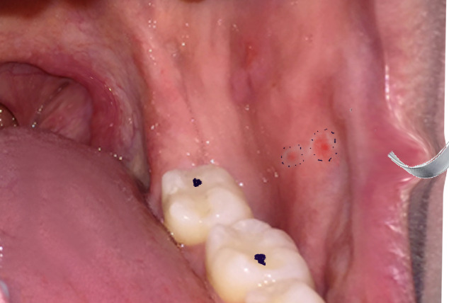
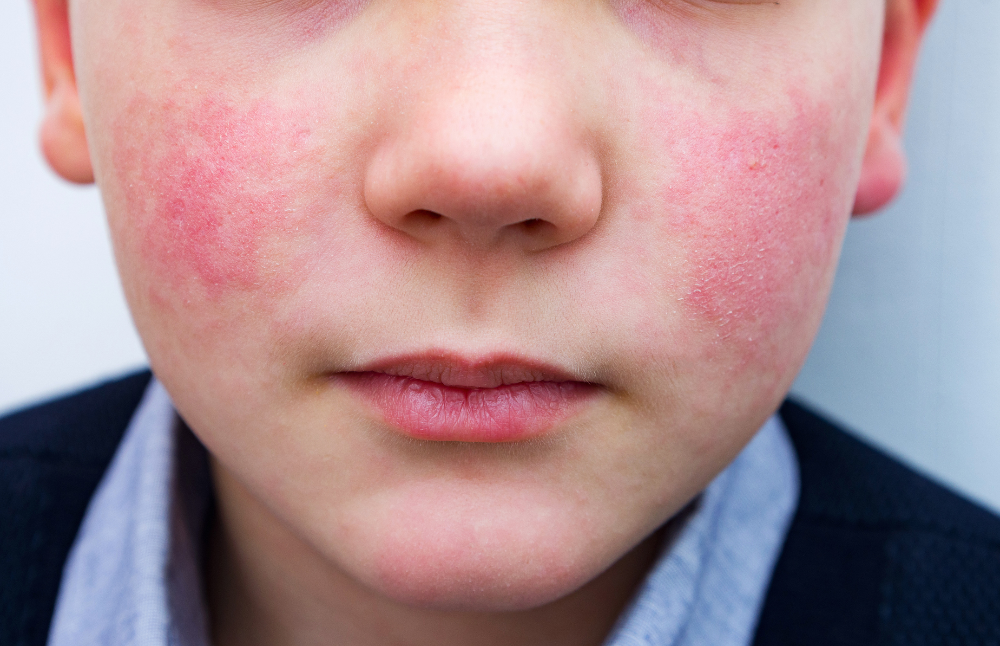
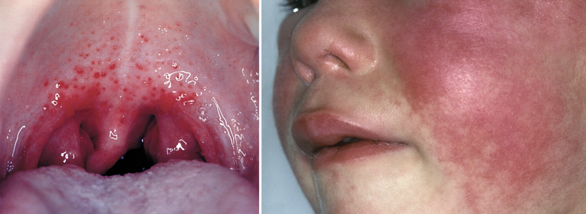
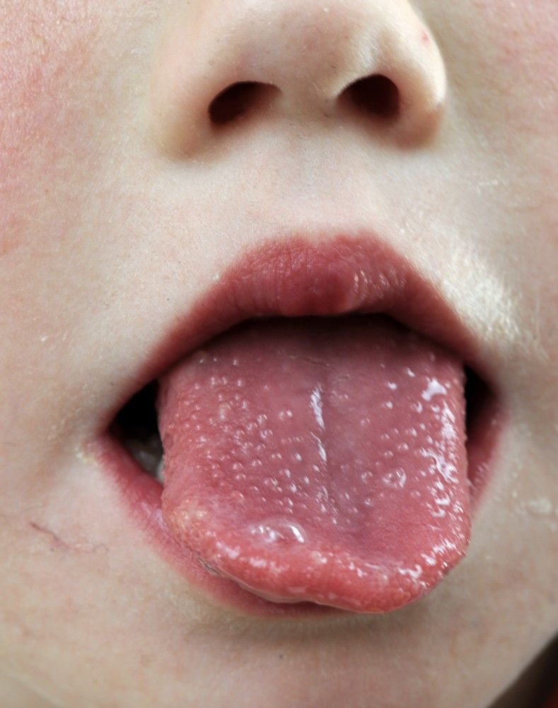

# DOENÇAS EXANTEMÁTICAS

As doenças exantemáticas são o "arroz com feijão" da pediatria em provas de residência. Se você entender a lógica por trás de cada rash, não precisará decorar listas infinitas. O segredo aqui é o **binômio: Pródromo + Morfologia do Exantema**.

Nas próximas linhas, vamos dissecar as patologias que realmente caem, focando no porquê das condutas e nas pegadinhas que o Dr. Will sempre alerta para não deixar você perder pontos bobos.

## Sarampo (A Doença dos 3 Cs)

O sarampo não é apenas uma "manchinha vermelha". É uma doença sistêmica grave, causada por um *Morbillivirus* (família Paramyxoviridae), com alta taxa de transmissibilidade. **Transmissão:** gotículas e aerossol (pode ficar no ar por até 2 horas!). **Transmissibilidade:** 6 dias antes até 4 dias após o exantema.

### Quadro Clínico e Diagnóstico

A prova vai te dar uma criança com febre alta, tosse, coriza e conjuntivite com fotofobia (os **3 Cs**: *Cough, Coryza, Conjunctivitis*).

- **Patognomônico:** Manchas de Koplik (pequenos pontos brancos na mucosa oral, altura do 2º molar). Elas surgem 1-2 dias ANTES do exantema e somem logo depois. Se a questão mencionar Koplik, marque Sarampo sem medo.

- **Exantema:** Maculopapular morbiliforme, de progressão **craniocaudal lenta** (leva uns 3 dias para chegar aos pés) e que se inicia geralmente na região retroauricular, além de descamar de forma furfurácea (fina, como farinha).

- **Panencefalite esclerosante subaguda:** É o maior perigo da infecção por sarampo, sendo uma complicação neurológica progressiva e severa que pode ocorrer meses ou anos após a infecção sintomática. É mais comum em infecções antes dos 2 anos de vida e é causada por uma infecção latente do vírus no sistema nervoso central.

- **Amnésia Imunológica:** O morbillivirus provoca uma "amnésia" no sistema imune adaptativo do paciente, o que justifica a alta taxa de infecções secundárias graves (como OMA e pneumonia) após o quadro agudo

*Figura 1 - Manchas de Koplik: achado patognomônico do sarampo, surgem 1-2 dias antes do exantema. Fonte: NCBI.*

### Por que usamos Vitamina A?

O vírus do sarampo consome as reservas de vitamina A do corpo, o que destrói a integridade do epitélio respiratório e intestinal. Segundo a OMS e o Ministério da Saúde (2024), a suplementação reduz a mortalidade e complicações como cegueira e pneumonia.

- **Dose:** 2 doses (no dia do diagnóstico e no dia seguinte).

- Menos de 6 meses: 50.000 UI/dose.

- 6 a 11 meses: 100.000 UI/dose.

- Mais de 12 meses: 200.000 UI/dose.

### Profilaxia Pós-Exposição (Ouro da Prova)

Se houve contato, o que fazer?

- **Vacina Bloqueio:** Até **72 horas** após o contato (para maiores de 6 meses).

- **Imunoglobulina Padrão:** Até o **6º dia** para grupos de risco (gestantes suscetíveis, imunodeprimidos e menores de 6 meses).

## Varicela (Catapora)

Causada pelo vírus **Varicela-Zóster (VZV / HHV-3)**. Transmissão por gotículas respiratórias e contato direto com as vesículas. **Transmissibilidade:** 1-2 dias antes do exantema até todas as lesões estarem em fase de crosta (geralmente 5-7 dias).

O foco para prova é o **polimorfismo regional**. Você verá pápula, vesícula, pústula e crosta ao mesmo tempo na mesma região do corpo. Além disso, a progressão das lesões é tipicamente centrípeta (foca no centro do corpo e progride para as extremidades) e um sinal clássico é o acometimento intenso do couro cabeludo, além do surgimento de vesículas dolorosas em mucosas (oral e genital).

### Complicações e Manejo

A complicação mais comum é a **infecção bacteriana secundária** (*Staphylococcus* ou *Streptococcus*). Se a febre persistir após o 3º ou 4º dia de exantema, suspeite de infecção de pele.

- **Síndrome de Reye:** Ocorre se você usar Aspirina (AAS) na vigência de varicela ou influenza. Causa degeneração gordurosa do fígado e encefalopatia. **Nunca use AAS em exantemas virais.**

### Tratamento

- **Casos não complicados:** Suporte (anti-histamínicos para prurido, cuidados locais). **Não usar AAS.**

- **Aciclovir via oral:** Indicado para adolescentes (> 13 anos), adultos, segundo caso no domicílio (costuma ser mais grave) e pacientes com doença cutânea/pulmonar crônica.

- **Aciclovir IV:** Para imunodeprimidos, neonatos, varicela complicada (pneumonite, encefalite, hepatite).

- **Dose oral:** 20 mg/kg/dose (máx. 800 mg), 4x/dia por 5 dias. Iniciar nas primeiras 24h do exantema.

### Profilaxia Pós-Exposição

- **Vacina:** Até o **5º dia** (120 horas) para contatos suscetíveis > 9 meses.

- **Imunoglobulina Específica (VZIG):** Até **96 horas** para:

- Imunodeprimidos e gestantes suscetíveis.

- Recém-nascidos de mães que tiveram varicela 5 dias antes até 2 dias após o parto.

- Prematuros (regras específicas de idade gestacional e história materna).

## Exantema Súbito (Roséola)

Causado pelo **Herpesvírus Humano 6 (HHV-6)** e mais raramente pelo **HHV-7**. **Transmissão:** gotículas respiratórias e contato com saliva. **Transmissibilidade:** durante a fase febril. **Tratamento:** suporte (antipiréticos). Não requer antiviral. Atenção para o risco de convulsão febril pela febre alta.

**O cenário clássico:** lactente com **febre muito alta (39-40°C)** por 3 dias, sem outros sintomas. A febre some bruscamente ("em crise") e, logo em seguida, surge o exantema maculopapular rosado que começa no **tronco**.Além do exantema que surge no tronco logo após a febre sumir, atente-se para o **Sinal de Nagayama:** a presença de um enantema caracterizado por **pápulas eritematosas no palato mole.** O rash também pode se estender para o pescoço e membros.

- **Dica MedEvo:** Se a febre ainda está presente, não é Roséola. O exantema só aparece quando a febre vai embora.

## Rubéola

Causada pelo *Rubivírus* (família Matonaviridae). **Transmissão:** gotículas respiratórias. **Transmissibilidade:** 7 dias antes até 7 dias depois do exantema.

### Quadro Clínico

- **Pródromo:** Febre baixa, mal-estar e **linfadenopatia retroauricular, occipital e cervical posterior** (achado mais importante — aparece antes do rash!).

- **Exantema:** Maculopapular rosado, de progressão **craniocaudal RÁPIDA** (alcança os pés em 24h). Diferença fundamental com o sarampo: no sarampo a progressão é lenta (3 dias).

- **Sinal de Forchheimer:** Petéquias no palato mole (sugestivo, mas não patognomônico).

- **Artralgia/artrite:** Frequente em mulheres adultas (pode confundir com LES).

### Síndrome da Rubéola Congênita (SRC)

O maior perigo da rubéola. Se uma gestante suscetível é infectada no **primeiro trimestre**, o risco de SRC é altíssimo (até 90%).

- **Tríade clássica:** Surdez neurossensorial + Catarata + Cardiopatia congênita (PCA e estenose de artéria pulmonar).

- **Outros achados:** Microcefalia, retardo mental, púrpura trombocitopênica, hepatoesplenomegalia.

### Tratamento e Profilaxia

- **Tratamento:** Suporte. Não há antiviral específico.

- **Profilaxia:** Vacina tríplice viral (SCR). **Gestantes NÃO podem ser vacinadas** (vacina de vírus vivo atenuado). A vacinação deve ser feita pelo menos 30 dias antes de engravidar.

- **Pós-exposição em gestante suscetível:** Não há conduta comprovadamente eficaz. Não se recomenda IG de rotina.

- **Notificação:** Compulsória imediata (tanto rubéola quanto SRC).

## Eritema Infeccioso (Quinta Doença)

Causado pelo **Parvovírus B19**. **Transmissão:** gotículas respiratórias. **Transmissibilidade:** durante a fase virêmica (período prodrômico). Quando o exantema aparece, o paciente **NÃO é mais transmissor** (pode frequentar escola). **Tratamento:** suporte. Não há antiviral específico. Em crise aplástica: transfusão, se necessário.

Apresenta três fases:

- **Face esbofeteada:** Eritema malar bilateral súbito que **poupa a região perioral (nasolabial) e o nariz.**

- **Exantema rendilhado:** Rash em tronco e membros com clareamento central, sofrendo **recidivas e flutuações** de intensidade com mudanças **climáticas/ambientais e exposição solar.**

- **Recidiva:** O rash pode voltar com sol, calor ou exercício por semanas.

- **Atenção:** O Parvovírus B19 tem tropismo por precursores eritroides. Em pacientes com anemia falciforme, ele causa a **Crise Aplásica Transitória**.

*Figura 2 - Eritema malar (face esbofeteada): sinal característico da fase inicial do eritema infeccioso. Fonte: CDC.*

**Grupos de Risco:** Em **gestantes**, há alto risco de infecção fetal levando à **anemia grave**, **hidropsia fetal não imune** e **óbito**. Em **adultos**, há alto risco de desenvolvimento de **artropatia aguda simétrica (Artrite Reumatoide-like).**

## Escarlatina

Diferente das anteriores, esta é **bacteriana** (***Streptococcus pyogenes*** — Estreptococo beta-hemolítico do grupo A). **Transmissão:** gotículas respiratórias. **Transmissibilidade:** até 24h após início do antibiótico adequado. Sem tratamento, transmite por 10-21 dias.

- **Sinais clássicos:** Faringite estreptocócica + Exantema em "lixa" (micropapular) + Sinal de Pastia (acentuação nas dobras) + Sinal de Filatov (palidez perioral) + Língua em morango (com papilas hipertrofiadas).

- **Tratamento:** Penicilina Benzatina (dose única) ou Amoxicilina por 10 dias para prevenir Febre Reumática.

*Figura 3 - Escarlatina: à esquerda, faringite estreptocócica; à direita, sinal de Filatov (palidez perioral).*

## Herpangina e Doença Mão-Pé-Boca

Causadas pelo vírus **Coxsackie A** (principalmente A16 para Mão-Pé-Boca e vários sorotipos para herpangina), família Enterovírus. **Transmissão:** fecal-oral e gotículas. **Transmissibilidade:** durante a fase aguda e por semanas nas fezes. **Tratamento:** Suporte (analgesia, hidratação oral). Casos graves por Enterovírus 71 podem necessitar internação.

- **Herpangina:** doença febril acompanhada de **bolhas/aftas dolorasas** localizadas principalmente no palato mole, amígdalas e garganta. Por conta da dor, é comum que as crianças recusem comida.

- **Doença Mão-Pé-Boca:** herpangina associada a bolhas ou pápulas dolorosas nas **palmas das mãos, solas dos pés** e, mais raramente, nas nádegas ou região genital.

## Doença de Kawasaki

Não é infecciosa, é uma vasculite de médios vasos. O medo aqui é o **aneurisma de artérias coronárias**.

-

**Critérios (Febre > 5 dias + 4 de 5):**

- Conjuntivite bilateral não exsudativa.

- Alterações orais (língua em morango, fissura labial).

- Exantema polimorfo (nunca vesicular!).

- Alterações de extremidades (edema/eritema ou descamação periungueal tardia).

- Linfonodomegalia cervical (> 1,5 cm, geralmente unilateral).

-

**Fase Aguda:** Febre alta associada a eritema e edema indurado de palmas e plantas, além de exantema polimorfo que costuma descamar precocemente na região perineal.

-

**Fase Subaguda:** Resolução da febre e surgimento da clássica descamação periungueal (ao redor das unhas de mãos e pés).

-

**Tratamento:** Imunoglobulina Venosa (IVIG) 2g/kg em dose única + AAS em dose anti-inflamatória inicial.

*Figura 4 - Língua em morango: achado característico da Doença de Kawasaki e da escarlatina.*

## Dengue na Pediatria

A dengue em crianças é traiçoeira porque os sintomas iniciais são inespecíficos. A classificação de risco do Ministério da Saúde (2024) é o que cai.

### Sinais de Alarme (O que define o Grupo C)

Estes sinais aparecem geralmente na fase de defervescência (quando a febre baixa):

- Dor abdominal intensa e contínua.

- Vômitos persistentes.

- Hepatomegalia dolorosa (> 2cm abaixo do rebordo costal).

- Sangramento de mucosa.

- Letargia ou irritabilidade.

- Aumento repentino do hematócrito (hemoconcentração).

**Manejo do Grupo C:** Hidratação venosa imediata (10 ml/kg na primeira hora) e reavaliação constante. Não espere exames para começar o soro se houver sinal de alarme.

## Mononucleose Infecciosa (EBV)

O erro clássico aqui é confundir com faringite bacteriana.

- **Tríade:** Febre + Faringite + Adenomegalia generalizada (frequentemente posterior).

- **O "Pulo do Gato":** Se você prescrever Amoxicilina achando que é bactéria, o paciente desenvolverá um **rash maculopapular** após o uso do antibiótico. Isso não é alergia à penicilina, é uma **reação imunomediada (não mediada por IgE) pelo vírus EBV**, surge de 7 a 10 dias após o início do fármaco, é altamente pruriginoso e se distribui inicialmente no tronco, cabeça, mãos e pés. Não precisa contraindicar penicilinas no futuro.

- **Laboratório:** Linfocitose com atipia linfocitária (> 10%). **CUIDADO:** as células infectadas pelo EBV são os linfócitos B, mas as células reativas vistas no esfregaço sanguíneo são os linfócitos T.

- **Achados Adicionais:** Sinal de Hoagland (edema palpebral bilateral precoce), petéquias na transição entre o palato duro e mole, e lembre-se do risco de ruptura esplênica devido à esplenomegalia

## Tabelas Comparativas para Revisão Rápida

### Tabela 1: Diagnóstico Diferencial por Pródromo e Exantema

| Doença | Pródromo Típico | Características do Exantema | Evolução / Particularidades |
| --- | --- | --- | --- |
| **Sarampo** | Tosse, coriza, conjuntivite, Koplik (nos pré-molares). | Maculopapular morbiliforme. | Craniocaudal lenta (início retroauricular), descamação furfurácea. |
| **Rubéola** | Linfadenopatia retroauricular/occipital. | Maculopapular rosado. | Craniocaudal rápida (24h), some na ordem de surgimento. |
| **Exantema Súbito** | Febre alta que some subitamente. | Maculopapular rosado, Sinal de Nagayama (palato mole). | Inicia no tronco após fim da febre, progride para pescoço/membros. |
| **Eritema Infeccioso** | Geralmente ausente ou leve. | Face esbofeteada (poupa região perioral/nariz) e rendilhado. | Recidiva com calor/sol e mudanças climáticas. Risco de crise aplástica. |
| **Varicela** | Febre baixa, mal-estar. | Polimorfismo regional (couro cabeludo e mucosas). | Progressão centrípeta, muito pruriginoso. |
| **Escarlatina** | Faringite estreptocócica, febre alta. | Micropapular "em lixa", Pastia (não some à pressão), Filatov. | Poupa palmas e plantas, descamação lamelar. Isolamento por 24h pós-ATB. |
| **Mononucleose** | Febre, faringite, adenomegalia generalizada. | Maculopapular induzido por Amoxicilina (imunomediado, pruriginoso). | Sinal de Hoagland (edema palpebral), petéquias no palato, risco de ruptura esplênica. |
| **Doença Mão-Pé-Boca** | Febre, odinofagia (recusa alimentar importante). | Herpangina (bolhas/aftas dolorosas em palato mole/amígdalas) e vesículas em mãos, pés e nádegas. | Resolução em 7-10 dias. Transmissão fecal-oral e respiratória; vírus Coxsackie A16. |
| **Doença de Kawasaki** | Febre ALTA por no mínimo 5 dias (obrigatório) + conjuntivite bilateral não exsudativa e alterações orais (lábios fissurados e língua em morango). | Exantema polimorfo (nunca vesicular!), com edema indurado e eritema palmo-plantar. | Na fase aguda, poupa palmas/plantas mas descama precocemente a região perineal; na fase subaguda, apresenta a clássica descamação periungueal tardia. Maior complicação: aneurisma de artérias coronárias. |

### Tabela 2: Profilaxia Pós-Exposição (Contatos)

| Doença | Vacina (Bloqueio) | Imunoglobulina / Soro |
| --- | --- | --- |
| **Sarampo** | Até 72 horas (> 6 meses) | Até 6 dias (IG padrão para grupos de risco) |
| **Varicela** | Até 5 dias (> 9 meses) | Até 96 horas (VZIG para grupos de risco) |
| **Rubéola** | Vacina (SCR) se suscetível, pré-gestação | Não recomendada IG de rotina. Gestantes: acompanhamento |
| **Dengue** | Não indicada para bloqueio | Não indicada |

## Pontos-Chave para Prova

- **Sarampo:** Vitamina A é obrigatória para todos os casos confirmados.

- **Koplik:** Patognomônico de sarampo, aparece antes do exantema.

- **Varicela:** O polimorfismo regional é a marca registrada (lesões em vários estágios na mesma área).

- **AAS:** Contraindicação absoluta em varicela e influenza pelo risco de Síndrome de Reye.

- **Eritema Infeccioso:** Não transmite mais quando o exantema aparece. A criança pode ir à escola.

- **Escarlatina:** Exantema em lixa e sinal de Pastia (dobras). Tratamento é Penicilina.

- **Kawasaki:** Febre por 5 dias é o critério inicial obrigatório. O maior risco é o aneurisma de coronária.

- **Dengue:** Queda de plaquetas isolada NÃO é sinal de alarme. Sinais de alarme indicam extravasamento plasmático.

- **Rubéola:** O maior perigo é a Síndrome da Rubéola Congênita (tríade: surdez, catarata, cardiopatia).

- **Gianotti-Crosti:** Exantema papulovesicular acral (membros e face), poupa o tronco. Frequentemente pós-viral.

- **Mão-Pé-Boca:** Coxsackie A16. Vesículas em mãos, pés e úlceras orais (herpangina).

- **Notificação:** Sarampo e Rubéola são doenças de notificação compulsória imediata.

- **Vacinação:** Corticoides em doses habituais (inalatórios ou baixas doses orais) NÃO contraindicam vacinas de vírus vivos.

- **Febre Maculosa:** Pensar em contato com carrapato. Tratar com Doxiciclina, mesmo em crianças (o benefício supera o risco de manchar dentes neste caso específico).

 Cópia offline para consulta pessoal.
 Fonte original:
 [https://www.medevo.com.br/material-apoio/ler/625847d5-d9b6-4638-845b-3b659a9baffc](https://www.medevo.com.br/material-apoio/ler/625847d5-d9b6-4638-845b-3b659a9baffc)
