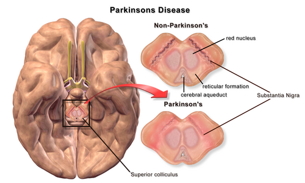
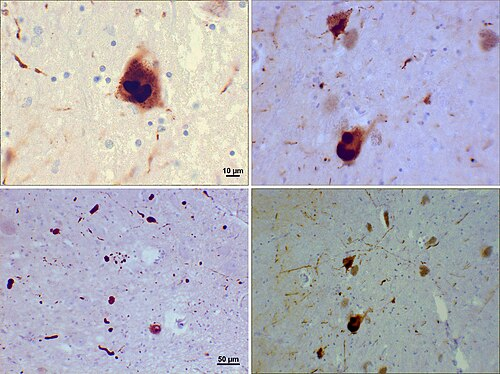

# DOENÇAS NEURODEGENERATIVAS

As doenças neurodegenerativas devem ser entendidas pela topografia da lesão e pelo tipo de população neuronal acometida. Em neurologia, a pergunta central é: "onde está o problema?". Nesses quadros, há perda progressiva de populações específicas de neurônios.

Quando o acometimento predomina na substância nigra, surge parkinsonismo; quando envolve neurônio motor superior e inferior, pensa-se em ELA; quando a falha é na junção neuromuscular, o diagnóstico diferencial inclui miastenia. O raciocínio clínico deve partir da síndrome neurológica predominante.

## Doença de Parkinson (DP) e Parkinsonismo

A Doença de Parkinson é a segunda doença neurodegenerativa mais comum, atrás apenas do Alzheimer. Mas cuidado: nem todo parkinsonismo é Doença de Parkinson. O termo "Parkinsonismo" é uma síndrome, um conjunto de sinais. A Doença de Parkinson (Idiopática) é apenas uma das causas dessa síndrome.

### Fisiopatologia: O Porquê dos Sintomas

*Figura 1 - Doença de Parkinson: degeneração dos neurônios dopaminérgicos da substância nigra pars compacta resulta em redução da dopamina nos gânglios da base. Fonte: Blausen Medical, CC BY 3.0 | Wikimedia Commons*
O cerne da DP é a perda de neurônios dopaminérgicos na substância nigra pars compacta. Quando o paciente manifesta o primeiro sintoma motor, ele já perdeu cerca de 60 a 80% desses neurônios. A dopamina é o lubrificante dos gânglios da base, ela facilita o movimento. Sem ela, o sistema entra em "atrito".

Por que o tremor é de repouso? Porque o circuito de feedback dos núcleos da base está desregulado. Por que a rigidez é em "roda dentada"? É a sobreposição da rigidez plástica com o tremor subjacente.

*Figura 2 - Corpos de Lewy: inclusões citoplasmáticas eosinofílicas compostas por alfa-sinucleína, achado histopatológico característico da DP. Fonte: Suraj Rajan, CC BY-SA 3.0 | Wikimedia Commons*

### O Diagnóstico Clínico

O diagnóstico é essencialmente clínico. Segundo a Movement Disorder Society (MDS), o pilar é a Bradicinesia. Sem bradicinesia, não se fecha síndrome parkinsoniana.

Critério clínico para síndrome parkinsoniana:
Bradicinesia (lentidão e redução da amplitude dos movimentos) + pelo menos um dos seguintes:

- Tremor de repouso (4 a 6 Hz, clássico "contar moedas").

- Rigidez muscular (em roda dentada).

- Instabilidade postural (não causada por falha visual ou vestibular).

**Ponto de prova:** instabilidade postural na DP idiopática costuma ser sintoma tardio. Quedas no primeiro ano sugerem parkinsonismo atípico, como paralisia supranuclear progressiva (PSP).

### Sintomas Pré-Motores: A Janela de Oportunidade

Os sintomas não motores podem preceder o tremor por anos. Anos antes da marcha festinante, o paciente apresenta:

- Hiposmia ou Anosmia (perda do olfato).

- Constipação intestinal crônica.

- Distúrbio do sono REM (o paciente "atua" os sonhos, grita, chuta).

- Depressão e ansiedade.

### Tratamento Farmacológico

Aqui é onde o aluno mais erra. A escolha do fármaco depende da idade e da funcionalidade.

-

**Levodopa + Carbidopa:** É o padrão-ouro. A Levodopa cruza a barreira hematoencefálica e vira dopamina. A Carbidopa serve para impedir que a Levodopa vire dopamina no sangue (o que causaria náuseas terríveis), garantindo que ela chegue ao cérebro.

- **Indicação:** Pacientes > 65 anos ou com sintomas motores impactantes.

- **Cuidado:** O uso crônico leva a flutuações motoras (fenômeno *wearing-off*) e discinesias.

-

**Agonistas Dopaminérgicos (Pramipexol, Rotigotina):** Estimulam direto o receptor.

- **Indicação:** Pacientes < 65 anos, para postergar o início da Levodopa e evitar complicações motoras precoces.

- **Efeito colateral clássico:** Transtorno do controle de impulsos (jogo patológico, hipersexualidade, compras compulsivas).

-

**Anticolinérgicos (Biperideno, Triexifenidil):**

- **Indicação:** Apenas para controle de tremor em pacientes JOVENS.

- **Por que evitar no idoso?** Porque causa confusão mental, boca seca, retenção urinária e piora cognitiva.

-

**Amantadina:** Útil para reduzir discinesias induzidas pela Levodopa.

### Tabela 1: Diferencial entre Doença de Parkinson e Tremor Essencial

| Característica | Doença de Parkinson | Tremor Essencial |
| --- | --- | --- |
| Tipo de Tremor | Repouso (assimétrico) | Ação / Postural (simétrico) |
| Bradicinesia | Presente (obrigatória) | Ausente |
| Escrita | Micrografia (letra pequena) | Macrografia (letra trêmula e grande) |
| História Familiar | Menos comum | Muito comum (autossômica dominante) |
| Resposta ao Álcool | Nenhuma | Melhora dramática |
| Marcha | Festinante, passos curtos | Normal |

## Parkinsonismo Secundário e Atípico

Muitas vezes, o paciente chega com parkinsonismo, mas a causa não é a degeneração da substância nigra.

### Parkinsonismo Induzido por Drogas

É a causa mais comum de parkinsonismo secundário. Ocorre pelo bloqueio dos receptores D2 de dopamina.

- **Culpados:** Haloperidol, Clorpromazina (antipsicóticos típicos), mas também drogas comuns na clínica como Metoclopramida (Plasil), Cinarizina e Flunarizina (usadas para vertigem).

- **Ponto de prova:** o parkinsonismo medicamentoso costuma ser simétrico e de início mais abrupto que a DP.

### Parkinsonismos Atípicos (Parkinson-Plus)

São doenças que "imitam" o Parkinson, mas têm sinais adicionais e pior prognóstico.

- **Paralisia Supranuclear Progressiva (PSP):** Instabilidade postural precoce (cai para trás), paralisia do olhar vertical (dificuldade de olhar para baixo) e sinal da "procerus" (expressão de espanto). Na RM, vemos a atrofia do mesencéfalo (Sinal do Beija-flor).

- **Atrofia de Múltiplos Sistemas (AMS):** Disautonomia grave (hipotensão ortostática, incontinência urinária) e sinais cerebelares.

- **Demência por Corpos de Lewy:** Parkinsonismo + Alucinações visuais precoces + Flutuações cognitivas. Se a demência ocorre antes ou junto com o motor, é Lewy. Se o motor vem anos antes da demência, é Parkinson com Demência.

## Esclerose Lateral Amiotrófica (ELA)

A ELA é a doença do neurônio motor por excelência. O que define a ELA na sua prova é a coexistência de sinais de Neurônio Motor Superior (NMS) e Neurônio Motor Inferior (NMI) no mesmo segmento corporal, de forma progressiva.

### O Quadro Clínico: A Mistura de Sinais

Exemplo clínico: paciente de 60 anos com fraqueza na mão direita apresenta:

- **Sinais de NMI:** Atrofia muscular e fasciculações (o músculo "pula" sozinho).

- **Sinais de NMS:** Hiperreflexia e sinal de Babinski.

Essa combinação é patognomônica. O NMI morreu (atrofia), mas o NMS que sobrou está "solto" e hiperativo (hiperreflexia).

**O que a ELA geralmente NÃO causa:**

- Não altera sensibilidade.

- Não altera motilidade ocular.

- Não altera esfíncteres (inicialmente).

- Não costuma cursar com dor (a dor é secundária à imobilidade).

### Diagnóstico e Manejo

O diagnóstico é clínico e eletrofisiológico (Eletroneuromiografia mostrando denervação ativa e crônica em múltiplos segmentos).

- **Tratamento:** Riluzol (única droga que aumenta a sobrevida, embora por apenas alguns meses). O foco é multidisciplinar: suporte ventilatório (VNI) e nutricional (gastrostomia precoce se houver disfagia grave).

## Miastenia Gravis (MG)

Saímos da degeneração do neurônio e entramos na falha da Junção Neuromuscular. A Miastenia é uma doença autoimune onde anticorpos (geralmente anti-AChR) atacam os receptores de acetilcolina na placa motora.

### A Palavra-Chave: Flutuação

A queixa clássica é a fraqueza que piora ao longo do dia ou após esforço físico e melhora com o repouso.

- **Ptose palpebral e diplopia:** Frequentemente os primeiros sintomas (forma ocular).

- **Vespertino:** O paciente acorda bem e termina o dia sem conseguir subir escadas ou mastigar.

### Diagnóstico

- **Anticorpos:** Anti-AChR (mais comum) e Anti-MuSK.

- **Eletroneuromiografia:** Estimulação repetitiva mostrando decremento da resposta motora.

- **Teste do Gelo:** Colocar gelo sobre a pálpebra melhora a ptose (o frio inibe a acetilcolinesterase natural).

### Crise Miastênica

É a emergência médica da MG. Ocorre fraqueza da musculatura respiratória, levando à insuficiência respiratória aguda.

- **Gatilhos:** Infecções, cirurgias ou drogas (Aminoglicosídeos, Betabloqueadores, Quinino).

- **Tratamento da Crise:** Imunoglobulina IV ou Plasmaférese. **Cuidado:** Nunca use corticoides em doses altas de início na crise, pois podem causar piora transitória da fraqueza.

### Tabela 2: Miastenia Gravis vs. Síndrome de Lambert-Eaton

| Característica | Miastenia Gravis | Síndrome de Lambert-Eaton |
| --- | --- | --- |
| Fisiopatologia | Pós-sináptica (Anti-AChR) | Pré-sináptica (Canais de Cálcio) |
| Relação com Esforço | Piora com esforço | Melhora com esforço (incremento) |
| Reflexos Tendíneos | Normais | Hiporreflexia / Arreflexia |
| Associação | Timoma / Hiperplasia de Timo | Câncer de Pulmão (Oat Cells) |
| Disautonomia | Ausente | Presente (Xerostomia, impotência) |

## Esclerose Múltipla (EM)

Embora seja inflamatória, a EM tem um componente neurodegenerativo progressivo. É a principal causa de incapacidade neurológica em adultos jovens.

### Disseminação no Tempo e no Espaço

Para diagnosticar EM, é necessário demonstrar lesões em locais diferentes do sistema nervoso central (disseminação no espaço) e em momentos diferentes (disseminação no tempo).

- **Fenômeno de Uhthoff:** Piora dos sintomas com o aumento da temperatura corporal (banho quente, febre).

- **Sinal de Lhermitte:** Sensação de choque que desce pelas costas ao fletir o pescoço (indica lesão na coluna cervical).

### Formas Clínicas

- **Remitente-Recorrente (EMRR):** A mais comum (85%). Surto -> Recuperação -> Estabilidade -> Novo Surto.

- **Primariamente Progressiva (EMPP):** Piora lenta e gradual desde o início.

### Tratamento

- **Surto:** Metilprednisolona 1g/dia por 3 a 5 dias (pulsoterapia). Acelera a recuperação do surto, mas não muda o prognóstico a longo prazo.

- **Manutenção (Drogas Modificadoras da Doença):** Interferon, Glatirámer, Natalizumabe, Fingolimode. A escolha depende da agressividade da doença.

## Doença de Huntington

A Doença de Huntington é uma doença neurodegenerativa hereditária, autossômica dominante, causada por expansão de repetições CAG no gene **HTT**. O padrão clássico combina três grupos de manifestações: movimentos involuntários coreicos, alterações psiquiátricas/comportamentais e declínio cognitivo progressivo.

O achado motor típico é a **coreia**, com movimentos breves, irregulares e imprevisíveis. Com a progressão, podem surgir distonia, disfagia, disartria e perda funcional. Alterações psiquiátricas, como depressão, irritabilidade, impulsividade e risco de suicídio, podem preceder os sinais motores.

Pontos de prova importantes:

- herança autossômica dominante;

- expansão CAG no gene HTT;

- fenômeno de antecipação, especialmente por transmissão paterna;

- acometimento dos núcleos da base, com atrofia do caudado;

- tratamento sintomático da coreia, por exemplo com tetrabenazina/deutetrabenazina quando disponível, além de manejo psiquiátrico e suporte multiprofissional.

## Ataxias e Doenças da Medula

A ataxia é a perda da coordenação motora. A distinção principal é entre ataxia cerebelar e ataxia sensorial.

### Ataxia Sensorial vs. Cerebelar

- **Ataxia Sensorial:** Lesão nos cordões posteriores da medula (propriocepção). O paciente não sabe onde os pés estão.

- **Sinal de Romberg:** Positivo (o paciente oscila e cai ao fechar os olhos).

- **Causas:** Deficiência de Vitamina B12, Neuropatia Diabética, Tabes Dorsalis (Sífilis Terciária).

- **Ataxia Cerebelar:** Lesão no cerebelo. O erro é no "processador" do movimento.

- **Sinal de Romberg:** Negativo (ele já oscila de olhos abertos, fechar os olhos não muda drasticamente).

- **Causas:** Alcoolismo crônico, Ataxia de Friedreich, AVC cerebelar.

### Esclerose Combinada Subaguda

Causada pela deficiência de Vitamina B12. Afeta os cordões posteriores (perda de sensibilidade vibratória e propriocepção) e o trato corticoespinhal (sinais de NMS). É uma das poucas causas de ataxia sensorial que são reversíveis se tratadas precocemente.

### HTLV-1 e a Paraparesia Espástica Tropical

No Brasil, o HTLV-1 é uma causa importante de mielopatia crônica. O paciente apresenta uma paraparesia espástica (pernas rígidas e fracas) de progressão lenta, associada a distúrbios urinários (bexiga hiperativa). O tratamento da disfunção miccional aqui envolve anticolinérgicos ou cateterismo intermitente se houver resíduo elevado.

## Neuropatias Periféricas e Doenças Musculares

### Hanseníase: A Grande Mimética

No Brasil, hanseníase é diagnóstico diferencial importante em neurologia periférica, pois pode causar mononeuropatia múltipla.

- **Ponto de prova:** espessamento neural, como nervo ulnar ou tibial posterior, associado a manchas anestésicas sugere hanseníase. A eletroneuromiografia ajuda a caracterizar o padrão de comprometimento.

### Doença de Charcot-Marie-Tooth (CMT)

É a neuropatia hereditária mais comum.

- **Quadro:** Atrofia muscular distal (pernas em "garrafa de champanhe invertida"), pés cavos e marcha escarvante (elevação exagerada da coxa para compensar pé caído).

### Distrofias e Miosites

- **Polimiosite:** Fraqueza proximal simétrica (dificuldade de pentear o cabelo, levantar da cadeira). Diferente da Miastenia, a fraqueza é constante, não flutua, e os reflexos costumam estar preservados até fases tardias.

## Diagnósticos Diferenciais Importantes

### Tremor de Ação vs. Tremor de Repouso

O tremor de ação ocorre quando o paciente mantém uma postura (estender os braços) ou realiza um movimento (levar o dedo ao nariz). É típico do Tremor Essencial e de doenças cerebelares. O tremor de repouso desaparece ou diminui durante o movimento voluntário, sendo a marca do Parkinson.

### Síndrome de Pancoast

Um tumor no ápice do pulmão (geralmente em tabagistas) pode invadir o plexo braquial e a cadeia simpática cervical.

- **Tríade:** Dor no ombro + Atrofia das pequenas musculaturas da mão + Síndrome de Horner (Ptose, Miose e Anidrose ipsilateral). Isso cai muito como "pegadinha" de diagnóstico diferencial neurológico.

### Tabela 3: Diferenciação das Síndromes Motoras

| Local da Lesão | Fraqueza | Reflexos | Tônus | Outros Achados |
| --- | --- | --- | --- | --- |
| 1º Neurônio (NMS) | Piramidal | Hiperreflexia | Espástico | Babinski, Clônus |
| 2º Neurônio (NMI) | Distal/Segmentar | Hiporreflexia | Flácido | Fasciculações, Atrofia |
| Junção Neuromuscular | Flutuante | Normal | Normal | Ptose, Diplopia |
| Músculo (Miopatia) | Proximal | Normal/Baixo | Normal | Atrofia, mialgia |

## Manejo de Complicações e Situações Especiais

### Disfunção Miccional nas Neurodegenerativas

Muitas dessas doenças afetam a bexiga.

- **Bexiga Hiperativa (Urgeincontinência):** Comum no Parkinson e na Esclerose Múltipla. Tratamos com anticolinérgicos (Oxibutinina, Solifenacina) ou Mirabegrona (um agonista beta-3, melhor para idosos por não ter efeito anticolinérgico central).

- **Retenção Urinária:** Comum em lesões medulares agudas (choque medular) ou fases avançadas de AMS. O tratamento é o cateterismo intermitente limpo.

### O Uso de Antipsicóticos no Parkinson

Em psicose no paciente com Parkinson, seja pela própria doença ou por excesso de medicação, deve-se evitar haloperidol e risperidona. Esses fármacos bloqueiam receptor D2 e podem piorar intensamente o parkinsonismo.

- **Opções seguras:** Quetiapina ou Clozapina (esta última exige controle de hemograma pelo risco de agranulocitose).

## Pontos-Chave para Prova

- **Bradicinesia:** É o sintoma obrigatório para o diagnóstico de qualquer síndrome parkinsoniana.

- **Tratamento Inicial DP:** Se < 65 anos e sintomas leves, Agonista Dopaminérgico. Se > 65 anos ou sintomas graves, Levodopa.

- **Sintomas Pré-motores:** Anosmia, Constipação e Distúrbio do Sono REM precedem o motor no Parkinson em anos.

- **Parkinsonismo Medicamentoso:** Flunarizina e Cinarizina (usadas para "labirintite") são causas clássicas em idosos.

- **ELA:** Presença de sinais de 1º e 2º neurônio motor no mesmo membro. NÃO tem alteração sensitiva.

- **Huntington:** Coreia + alterações psiquiátricas + declínio cognitivo, herança autossômica dominante por expansão CAG no gene HTT.

- **Miastenia Gravis:** Fraqueza flutuante e fatigabilidade. O principal risco de morte é a insuficiência respiratória (crise miastênica).

- **Sinal de Romberg:** Positivo indica perda de propriocepção (ataxia sensorial), NÃO é sinal de lesão cerebelar.

- **Esclerose Múltipla:** Doença de adultos jovens, disseminação no tempo e no espaço, bandas oligoclonais no líquor.

- **Síndrome de Horner:** Ptose + Miose + Anidrose. Se associada a dor no ombro em tabagista, pense em Tumor de Pancoast.

- **Doença de Wilson:** Parkinsonismo em pacientes jovens (< 40 anos). Procure por anéis de Kayser-Fleischer na córnea e queda de ceruloplasmina.

- **Marcha Festinante:** Passos curtos e rápidos, com o tronco inclinado para frente, típica do Parkinson.

- **Marcha Escarvante:** Pé caído, o paciente levanta muito a coxa para não tropeçar, típica de neuropatias como CMT.

- **Contraindicação Absoluta:** Haloperidol na Doença de Parkinson.

- **Primeira Escolha na Crise Miastênica:** Imunoglobulina ou Plasmaférese (NÃO iniciar corticoide em dose alta imediatamente).

- **Diferencial de Tremor:** O tremor essencial melhora com álcool; o tremor do Parkinson não.

- **Bexiga Neurogênica no HTLV-1:** Padrão de bexiga hiperativa, tratar com anticolinérgicos.

 Cópia offline para consulta pessoal.
 Fonte original:
 [https://www.medevo.com.br/material-apoio/ler/2d016593-d25d-4577-a5f2-dd96813b536e](https://www.medevo.com.br/material-apoio/ler/2d016593-d25d-4577-a5f2-dd96813b536e)
