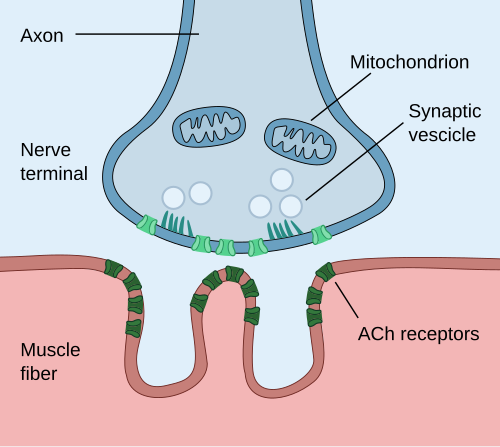
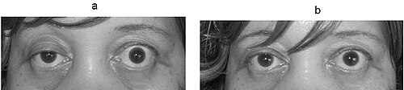

# DOENÇAS NEUROMUSCULARES

Para dominar as doenças neuromusculares em provas de residência, você precisa parar de tentar decorar nomes de doenças isoladas e começar a enxergar a **Unidade Motora**. Imagine um circuito elétrico: se a lâmpada não acende, o problema pode estar no interruptor, no fio, no bocal ou na própria lâmpada. Na neurologia, o raciocínio é idêntico.

A unidade motora é composta por quatro compartimentos:

- **Corpo do neurônio motor inferior** (no corno anterior da medula).

- **Nervo periférico** (o "fio").

- **Junção neuromuscular** (o "bocal").

- **Músculo** (a "lâmpada").

Se você identificar em qual desses pontos a lesão está, o diagnóstico diferencial cai no seu colo. Ao longo deste material, vamos dissecar cada um desses níveis usando as diretrizes brasileiras mais recentes, incluindo as atualizações de 2024 e 2025 do Ministério da Saúde e da Academia Brasileira de Neurologia (ABN).

## O Mapa da Unidade Motora: Como diferenciar no exame físico

*Figura 1 - Anatomia da junção neuromuscular: botão sináptico com vesículas de acetilcolina, fenda sináptica e receptores nicotínicos na membrana muscular. Fonte: Paul Hege, CC BY-SA 4.0 | Wikimedia Commons*

Antes de falarmos de doenças específicas, você precisa saber o que procurar no beira-leito. As bancas adoram colocar um quadro clínico e perguntar "qual o sítio da lesão?".

### Neurônio Motor Inferior (NMI)

Quando o problema é no corpo do neurônio (como na ELA) ou no nervo, você verá sinais de "desconexão":

- **Fraqueza:** Frequentemente distal ou assimétrica.

- **Atrofia:** Precoce e grave.

- **Reflexos:** Hipo ou arreflexia (o arco reflexo foi cortado).

- **Fasciculações:** O sinal patognomônico. O músculo "chora" porque perdeu seu nervo.

### Junção Neuromuscular

Aqui o segredo é a **fatigabilidade**. O paciente acorda bem e piora ao longo do dia ou após esforço repetitivo. Não há alteração de sensibilidade nem de reflexos (geralmente).

### Músculo (Miopatias)

O padrão clássico é a fraqueza **proximal e simétrica**. O paciente tem dificuldade para levantar da cadeira ou pentear o cabelo.

- **Reflexos:** Preservados até fases muito tardias.

- **Sensibilidade:** Intacta.

| Sítio da Lesão | Padrão de Fraqueza | Reflexos | Sensibilidade | Achado Chave |
| --- | --- | --- | --- | --- |
| **Neurônio Motor** | Distal/Segmentar | Abolidos | Normal | Fasciculações |
| **Nervo Periférico** | Distal (Bota/Luva) | Abolidos | Alterada | Déficit sensitivo |
| **Junção** | Flutuante/Bulbar | Normais | Normal | Fatigabilidade |
| **Músculo** | Proximal/Simétrica | Normais | Normal | CK elevada |

## Esclerose Lateral Amiotrófica (ELA): O Combo de Neurônios

A ELA é a doença neuromuscular favorita das bancas porque ela mistura tudo. De acordo com o Protocolo Clínico e Diretrizes Terapêuticas (PCDT) do Ministério da Saúde (atualizado tecnicamente em 2024/2025), a ELA é definida pela degeneração progressiva tanto do **Neurônio Motor Superior (NMS)** quanto do **Neurônio Motor Inferior (NMI)**.

### Por que o paciente tem espasticidade e atrofia ao mesmo tempo?

Porque a doença ataca o "chefe" (NMS no córtex) e o "operário" (NMI na medula).

- **Sinais de NMS:** Hiperreflexia, sinal de Babinski, espasticidade.

- **Sinais de NMI:** Atrofia, fasciculações, fraqueza.

**Cuidado:** Se a prova descrever um paciente com fraqueza e atrofia nas mãos (NMI), mas com reflexos vivos ou Babinski presente (NMS) no mesmo membro, marque ELA sem medo. Essa coexistência é o "pulo do gato".

### Diagnóstico e Critérios

O diagnóstico é essencialmente clínico, mas a Eletroneuromiografia (ENMG) é obrigatória para confirmar denervação ativa e crônica em múltiplos segmentos (bulbar, cervical, torácico e lombossacral).

**Dica de Prova:** A ELA **NÃO** afeta:

- Movimentos oculares (os nervos III, IV e VI são poupados até o fim).

- Controle de esfíncteres.

- Sensibilidade (se houver dormência, pense em outra coisa).

### Tratamento (Conforme PCDT vigente)

O objetivo não é a cura, mas o prolongamento da sobrevida e qualidade de vida.

- **Riluzol (50mg, 1 comprimido 12/12h):** É a única droga com evidência sólida no Brasil para aumentar a sobrevida em cerca de 3 a 6 meses. Deve ser iniciado assim que o diagnóstico for firmado.

- **Suporte Ventilatório:** O uso de VNI (Ventilação Não Invasiva) é indicado quando a Capacidade Vital Forçada (CVF) cai abaixo de 80% ou se houver sinais de hipoventilação noturna.

- **Manejo de Secreções:** O "empilhamento de ar" (air stacking) com AMBU é uma recomendação forte nas diretrizes brasileiras de 2024 para manter a complacência pulmonar.

## Síndrome de Guillain-Barré (SGB): A Emergência Neuromuscular

Se a ELA é a doença da cronicidade, a SGB é a da pressa. É uma polirradiculoneuropatia inflamatória aguda, geralmente pós-infecciosa (Campylobacter jejuni é o agente clássico, mas Zika e COVID-19 também aparecem em provas recentes).

### O Quadro Clínico "Clássico"

A descrição típica é a **paralisia ascendente, simétrica e arreflexa**. O paciente começa com formigamento nos pés e, em dias, não consegue mais andar.

**O erro comum:** Achar que SGB é só motor. Cerca de 80% dos pacientes têm dor lombar ou neuropática importante no início do quadro. Além disso, a **disautonomia** é a principal causa de morte (arritmias, oscilações pressóricas).

### O Líquor e a Dissociação

O achado clássico no LCR é a **Dissociação Proteína-Citológica**:

- Proteína aumentada (> 45 mg/dL).

- Células normais (< 5-10 células/mm³).

**Pegadinha de Prova:** Se você colher o líquor no primeiro ou segundo dia de sintomas, ele pode vir **normal**. A dissociação costuma aparecer após a primeira semana. Não descarte SGB por um líquor normal nas primeiras 48 horas!

### Tratamento e Conduta (PCDT 2022/2024)

Aqui o Dr. Will sempre reforça: **CORTICOIDE NÃO FUNCIONA NA SGB**. Se a alternativa disser "Prednisona", ela está errada. O tratamento de escolha é:

- **Imunoglobulina Humana Intravenosa (IgIV):** 0,4 g/kg/dia por 5 dias. É a preferida pela facilidade de administração.

- **Plasmaférese:** 5 sessões em dias alternados. Tão eficaz quanto a IgIV, mas exige acesso venoso central e equipe especializada.

**Critérios de Intubação:** Monitore a "regra dos 20-30-40":

- CVF < 20 mL/kg.

- Pressão Inspiratória Máxima < 30 cmH2O.

- Pressão Expiratória Máxima < 40 cmH2O.

## Miastenia Gravis (MG): A Falha na Transmissão

Saímos do nervo e chegamos na fenda sináptica. Na Miastenia, o corpo produz anticorpos contra o **Receptor de Acetilcolina (anti-AChR)** na placa motora.

### A Fisiopatologia da Fatigabilidade

Por que o paciente piora com o uso? Porque a cada estímulo, a quantidade de acetilcolina liberada diminui naturalmente (depleção pré-sináptica). Em uma pessoa normal, há receptores de sobra. No miastênico, os poucos receptores funcionais ficam saturados rapidamente. O repouso permite que a acetilcolina se acumule novamente, melhorando a força.

*Figura 2 - Miastenia gravis: ptose palpebral direita (A) e melhora após teste da edrofônio/gelo (B), demonstrando fatigabilidade reversível. Fonte: Kurukumbi et al., CC BY 2.0 | Wikimedia Commons*

### Quadro Clínico

- **Ptose palpebral e diplopia:** Frequentemente os primeiros sinais (forma ocular).

- **Fraqueza bulbar:** Voz anasalada, dificuldade para mastigar (o paciente "apoia o queixo" com a mão).

- **Fraqueza generalizada:** Piora ao final do dia.

### Diagnóstico (PCDT 2022)

- **Anticorpos:** Anti-AChR (presente em 85% das formas generalizadas) e Anti-MuSK (em cerca de 5-10% dos soronegativos para AChR).

- **ENMG com Estimulação Repetitiva:** Procura-se um **decremento** maior que 10% na amplitude do potencial de ação.

- **Teste do Gelo:** Colocar gelo sobre a pálpebra por 2 minutos melhora a ptose (o frio inibe a acetilcolinesterase natural).

### Tratamento Farmacológico

- **Sintomático:** Piridostigmina (Mestinon) 60mg. A dose é individualizada, geralmente começando com 60mg 3 a 4 vezes ao dia.

- **Imunossupressão:** Prednisona (dose inicial de 0,5-1 mg/kg/dia) e poupadores de corticoide como Azatioprina (primeira escolha no SUS).

- **Timectomia:** Indicada para todos os pacientes com Timoma e para pacientes com MG generalizada (anti-AChR positivo) entre 18 e 50-60 anos para melhorar o controle a longo prazo.

**Crise Miastênica:** É a fraqueza respiratória grave. Tratamento: IgIV ou Plasmaférese. **Cuidado:** Nunca inicie corticoide em dose alta durante uma crise sem suporte ventilatório, pois ele pode causar uma piora transitória da fraqueza nos primeiros dias.

## Distrofia Muscular de Duchenne (DMD): A Nova Era Terapêutica

A DMD é uma doença recessiva ligada ao X (afeta meninos) causada pela ausência da proteína **distrofina**. Sem ela, a membrana do músculo rompe a cada contração.

### Sinais Clínicos Precoces

- Atraso para andar (após os 18 meses).

- **Sinal de Gowers:** O menino "escala a si mesmo" para levantar do chão.

- **Pseudohipertrofia de panturrilhas:** O músculo é substituído por gordura e tecido fibroso.

- **CK absurdamente alta:** Geralmente > 10.000 U/L.

### Atualização Crítica 2024/2025: Elevidys

Até pouco tempo, o tratamento era apenas suporte e corticoide. No entanto, em **dezembro de 2024**, a ANVISA aprovou o **Elevidys (delandistrogeno moxeparvoveque)**, a primeira terapia gênica para DMD no Brasil.

- **Indicação:** Crianças deambuladores de 4 a 7 anos com mutação confirmada.

- **Mecanismo:** Usa um vetor viral para inserir um gene que produz uma "microdistrofina".

- **Status no SUS:** Em janeiro de 2025, o Ministério da Saúde iniciou as primeiras aquisições por via judicial/administrativa, mas a incorporação plena pela CONITEC ainda passa por monitoramento de evidências de longo prazo.

### Tratamento Padrão (Consenso Brasileiro 2023)

- **Corticosteroides:** Prednisona (0,75 mg/kg/dia) ou Deflazacort (0,9 mg/kg/dia). Eles retardam a perda da marcha em até 2-3 anos e protegem a função cardíaca/respiratória.

- **Fisioterapia:** Motora e respiratória são mandatórias. Evitar exercícios excêntricos intensos que "quebram" o músculo.

## Miopatias Inflamatórias: Dermatomiosite e Polimiosite

Aqui o problema é o sistema imune atacando o músculo (Polimiosite) ou o músculo e a pele (Dermatomiosite).

### Diferenciando as duas

- **Dermatomiosite:** Mais comum em crianças e idosos. Tem achados cutâneos: **Heliótropo** (mancha roxa nas pálpebras) e **Pápulas de Gottron** (lesões descamativas sobre as articulações dos dedos). É uma síndrome paraneoplásica clássica no idoso!

- **Polimiosite:** Diagnóstico de exclusão. Fraqueza proximal pura sem envolvimento cutâneo.

### Diagnóstico e Conduta

- **Laboratório:** CK elevada (10-50x o normal). Anticorpo **Anti-Jo1** (associado à doença pulmonar intersticial e "mãos de mecânico").

- **Biópsia Muscular:** É o padrão-ouro. Na Dermatomiosite vemos atrofia perifascicular; na Polimiosite, infiltrado endomisial.

- **Tratamento:** Corticoide em dose alta (Prednisona 1mg/kg/dia) é a primeira linha.

## Tabelas Comparativas para Revisão Rápida

### Tabela 1: Diagnóstico Diferencial das Polineuropatias

| Característica | Guillain-Barré (SGB) | PDIC (Crônica) | Neuropatia Diabética |
| --- | --- | --- | --- |
| **Tempo** | Agudo (< 4 semanas) | Crônico (> 8 semanas) | Crônico/Insidioso |
| **Padrão** | Ascendente simétrico | Simétrico proximal/distal | Comprimento-dependente |
| **Líquor** | Dissociação P-C | Dissociação P-C | Normal ou leve aumento prot. |
| **Tratamento** | IgIV / Plasmaférese | Corticoide / IgIV | Controle glicêmico / Dor |

### Tabela 2: Miastenia Gravis vs. Síndrome de Lambert-Eaton

| Característica | Miastenia Gravis | Lambert-Eaton (LEMS) |
| --- | --- | --- |
| **Fisiopatologia** | Pós-sináptica (Anti-AChR) | Pré-sináptica (Canais de Ca++) |
| **Esforço** | **Piora** a força | **Melhora** a força (facilitação) |
| **Reflexos** | Normais | Abolidos/Hipo (melhoram após esforço) |
| **Associação** | Timoma / Hiperplasia Timo | Câncer de Pulmão (Small Cell) |

### Tabela 3: Doses e Drogas de Primeira Escolha (PCDTs 2024/2025)

| Doença | Droga de Escolha | Dose Típica |
| --- | --- | --- |
| **ELA** | Riluzol | 50mg VO 12/12h |
| **SGB** | Imunoglobulina | 0,4 g/kg/dia por 5 dias |
| **Miastenia** | Piridostigmina | 60mg VO 3-6x ao dia |
| **Duchenne** | Prednisona | 0,75 mg/kg/dia |
| **Dermatomiosite** | Prednisona | 1,0 mg/kg/dia |

## Situações Especiais e Pegadinhas

### O Idoso com Fraqueza Proximal

Se um paciente de 70 anos chega com Dermatomiosite, sua primeira conduta após iniciar o corticoide é **rastrear câncer**. Mama, pulmão, ovário e próstata adoram se manifestar assim. Na MedEvo, sempre lembramos: Dermatomiosite no idoso = Check-up oncológico completo.

### A Gestante com Miastenia

A Piridostigmina é segura. O perigo é o **Sulfato de Magnésio** (usado na pré-eclâmpsia), que é **contraindicado absoluto** pois bloqueia a junção neuromuscular e pode causar parada respiratória imediata na paciente miastênica.

### O Erro na ENMG

Muitos alunos acham que a ENMG faz o diagnóstico sozinha. Lembre-se: a ENMG é uma extensão do exame físico. Se o paciente tem uma miopatia inflamatória muito precoce, a ENMG pode vir normal. Se a suspeita clínica é alta, peça RM de coxas para procurar edema muscular ou parta para a biópsia.

## Pontos-Chave para Prova 💡

- **ELA:** Coexistência de sinais de NMS (Babinski/reflexos vivos) e NMI (atrofia/fasciculações) no mesmo segmento. Riluzol é a droga de escolha.

- **Guillain-Barré:** Paralisia ascendente arreflexa. Dissociação proteína-citológica no líquor (após 7 dias). **Nunca** usar corticoide.

- **Miastenia Gravis:** Fatigabilidade é a palavra-chave. Ptose e diplopia flutuantes. Timectomia é opção terapêutica na forma generalizada AChR+.

- **Duchenne:** Sinal de Gowers e CK > 10.000. Terapia gênica (Elevidys) aprovada em 2024 para 4-7 anos.

- **Lambert-Eaton:** Fraqueza que melhora com exercício. Fortemente associada ao câncer de pulmão de pequenas células.

- **Miopatias:** Fraqueza proximal e simétrica com reflexos preservados.

- **Contraindicação Absoluta na Miastenia:** Aminoglicosídeos, Magnésio, Betabloqueadores e Quinino (podem desencadear crise).

- **Valor de Referência Líquor SGB:** Proteína > 45 mg/dL com < 10 células/mm³. Se houver pleocitose (> 50 células), pense em HIV ou Linfoma.

- **Dose IgIV na SGB:** 2g/kg no total, divididos em 5 dias (0,4g/kg/dia).

- **Sinal de Gottron e Heliótropo:** Patognomônicos de Dermatomiosite.

- **Mãos de Mecânico + Doença Pulmonar:** Pense em Síndrome Antissintetase (Anti-Jo1).

- **Tratamento de Crise Miastênica:** IgIV ou Plasmaférese. Estabilizar respiração antes de qualquer mudança drástica em imunossupressores.

- **Diferença ENMG:** Decremento > 10% = Miastenia; Incremento (após exercício ou alta frequência) = Lambert-Eaton ou Botulismo.

- **O que NÃO fazer na SGB:** Não esperar o líquor alterar para tratar se a clínica for soberana e houver risco respiratório.

- **Monitorização na SGB:** Capacidade Vital Forçada é o melhor parâmetro para prever necessidade de UTI, não a oximetria (que cai tardiamente).

 Cópia offline para consulta pessoal.
 Fonte original:
 [https://www.medevo.com.br/material-apoio/ler/1d197547-87c3-4128-91f4-273db523e8b8](https://www.medevo.com.br/material-apoio/ler/1d197547-87c3-4128-91f4-273db523e8b8)
