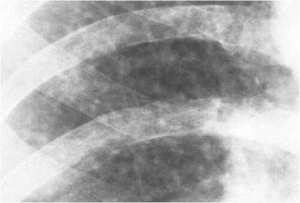

# DOENÇAS OCUPACIONAIS

Para entender as doenças ocupacionais, precisamos primeiro organizar a bagunça terminológica que as bancas de residência adoram usar para confundir você. O ponto de partida fundamental é a Lei 8.213 de 1991, que divide as doenças relacionadas ao trabalho em duas grandes categorias.

A primeira é a **Doença Profissional**. Pense nela como algo intrínseco àquela profissão específica. Se o indivíduo trabalha com mineração de quartzo, a silicose é uma doença profissional. Ela está na lista oficial, o nexo causal é presumido pela exposição ao agente.

A segunda é a **Doença do Trabalho**. Aqui o buraco é mais embaixo. A doença não é exclusiva da profissão, mas foi adquirida ou desencadeada em função de condições especiais em que o trabalho é realizado. Um exemplo clássico é a Perda Auditiva Induzida por Ruído (PAIR) em um operário de fábrica têxtil. O ruído não é "da profissão de tecelão", mas do ambiente onde ele trabalha.

Cuidado: a banca vai tentar te dizer que qualquer doença pode ser ocupacional. Não é verdade. Doenças degenerativas, doenças inerentes a grupo etário e doenças que não produzam incapacidade laborativa não são consideradas doenças do trabalho para fins legais.

## A Classificação de Schilling: O Coração da Prova

*Figura 1 - Silicose simples: radiografia mostrando opacidades nodulares bilaterais em campos superiores, típicas da exposição à sílica (Schilling I). Fonte: Gumersindorego, CC BY-SA 3.0 | Wikimedia Commons*

Se você quer passar na residência, precisa tatuar a Classificação de Schilling no braço. Ela divide as doenças de acordo com o papel que o trabalho desempenha no seu surgimento. Por que isso cai tanto? Porque define a responsabilidade do empregador e o nexo causal.

| Categoria | Papel do Trabalho | Exemplos Clássicos |
| --- | --- | --- |
| **Schilling I** | Trabalho como causa necessária | Silicose, Saturnismo (Chumbo), Benzenismo |
| **Schilling II** | Trabalho como fator contributivo (mas não necessário) | Hipertensão, Doenças Coronarianas, Varizes, LER/DORT |
| **Schilling III** | Trabalho como provocador ou agravante de algo pré-existente | Asma ocupacional, Dermatite de contato, Transtornos mentais |

Muitos alunos erram ao achar que o Grupo II é "menos importante". Na verdade, é onde mora a maior parte das ações judiciais. Imagine um paciente com varizes de membros inferiores. Ele já tem uma predisposição genética, mas trabalha 10 horas por dia em pé como segurança. O trabalho não criou as varizes do nada (não é Schilling I), mas contribuiu decisivamente para que elas aparecessem ou piorassem (Schilling II).

## O Legado de Ramazzini e a Anamnese Ocupacional

Bernardino Ramazzini, o "Pai da Medicina do Trabalho", escreveu em 1700 a obra *De Morbis Artificum Diatriba*. A grande lição que ele nos deixou, e que o MedEvo sempre reforça, é a pergunta de ouro: "Qual é a sua ocupação?".

Em uma prova de residência, se o enunciado descreve um quadro clínico vago e menciona a profissão do paciente, pare tudo. A resposta está ali. Se o paciente é frentista, pense em benzeno. Se trabalha com baterias, pense em chumbo. Se é jateador de areia, pense em sílica.

## Toxicologia Ocupacional: Os Vilões Químicos

Aqui é onde as questões de "decoreba" se concentram, mas vamos entender a lógica para você não precisar decorar tudo.

### Chumbo (Saturnismo)

O chumbo é onipresente em fábricas de baterias, radiadores, sucatas e tintas antigas. Cuidado com a pegadinha: lâmpadas modernas não costumam ser fonte de chumbo (elas têm mercúrio).

Por que o chumbo faz mal? Ele interfere na síntese do heme, inibindo enzimas como a desidratase do ácido delta-aminolevulínico (ALA-D) e a ferroquelatase. Isso gera anemia microcítica e hipocrômica, mas com uma característica especial: o pontilhado basófilo nas hemácias.

No exame físico, procure pela Linha de Burton (uma linha azulada na gengiva). Clinicamente, o paciente apresenta a "cólica saturnina" (dor abdominal intensa) e neuropatia periférica (clássica queda do punho por fraqueza dos extensores). O indicador mais sensível de exposição, segundo as diretrizes atuais, são as alterações neurocomportamentais, mesmo com níveis sanguíneos que antes considerávamos "baixos".

### Benzeno

O benzeno é o terror da hematologia ocupacional. Ele é um solvente orgânico encontrado na fumaça do cigarro, na gasolina (frentistas!) e na indústria petroquímica.

-

**Indicadores de Exposição**: ácido trans-trans-mucônico; ácido fenil mercaptúrico.

-

**Efeitos Gerais e Danos Específicos**:
*Efeitos gerais (inespecífico)*: dores de cabeça, mialgia,
taquicardia, náuseas, vômitos, astenia e sonolência;
*Olhos*: danos ao córtex visual → alteração na
discriminação de cores;
*Ouvidos*: alteração na percepção de altas
frequências;
*Pele e mucosas*: efeitos irritativos e porta de entrada
*Medula*: Diminuição de leucócitos e relação com
neoplasias hematológicas (Grupo 1 IARC –
carcinogênico).

-

**Achado Laboratorial**: neutropenia, leucopenia,
plaquetopenia e eosinofilia;

-

**Diagnóstico**: Clínico e Epidemiológico, apenas.

-

**Não existe Tratamento Medicamentoso**: Ação Principal é o afastamento do posto de trabalho para eliminar risco de exposição adicional.

O mecanismo é a toxicidade direta à medula óssea. O benzeno não causa apenas uma "anemiazinha". Ele causa Síndrome Mielodisplásica (SMD) e Leucemia Mieloide Aguda (LMA). Não existe nível seguro de exposição ao benzeno. Se a questão mencionar leucemia e exposição a solventes, marque benzeno sem medo.

### Mercúrio

O mercúrio inorgânico é clássico do garimpo de ouro (usado para separar o ouro da terra). Ele é altamente volátil. O quadro clínico envolve o "erismo mercurial": irritabilidade, tremores extremidades (tremor de intenção) e gengivite. Lembra do Chapeleiro Maluco de Alice no País das Maravilhas? Ele era "louco" porque os chapeleiros usavam mercúrio para tratar o feltro dos chapéus.

### Agrotóxicos: Organofosforados e Carbamatos

Esses agentes inibem a enzima acetilcolinesterase. Se a enzima que limpa a acetilcolina da fenda sináptica para de funcionar, o que acontece? Sobra acetilcolina. O paciente entra em Síndrome Colinérgica.

Imagine o cenário: agricultor chega ao pronto-socorro com miose (pupila em ponta de alfinete), bradicardia, sialorreia (muita saliva), sudorese e diarreia.

- **Organofosforados:** A inibição é irreversível (após o processo de "envelhecimento" da ligação enzimática).

- **Carbamatos:** A inibição é reversível.

O tratamento de escolha é a Atropina (antagonista muscarínico). Em casos de organofosforados, podemos usar as oximas (Pralidoxima) para tentar reativar a enzima, mas apenas se feito precocemente.

## Doenças Respiratórias Ocupacionais

As pneumoconioses são doenças causadas pela inalação de poeiras minerais. Elas são o exemplo perfeito de Schilling I.

*Figura 2 - Radiografia de tórax com silicose classificada segundo a OIT (2-2 r-r): micronódulos difusos e adenopatia hilar com calcificação em casca de ovo. Fonte: DrSHaber, CC0 | Wikimedia Commons*

### Silicose

Causada pela inalação de sílica livre cristalina (quartzo). É a pneumoconiose mais comum no Brasil. Ocorre em mineradores, cavadores de poços e trabalhadores da indústria de cerâmica.
Fisiopatologia: A sílica é citotóxica para os macrófagos alveolares. Quando o macrófago morre, ele libera citocinas que estimulam fibroblastos. O resultado é uma fibrose nodular.
Dica de prova: A silicose aumenta absurdamente o risco de Tuberculose. O macrófago está "ocupado" ou morto pela sílica e não consegue combater o *M. tuberculosis*. No RX, vemos nódulos em campos superiores e o clássico padrão de "casca de ovo" (calcificação de linfonodos hilares).

### Asbestose e Mesotelioma

O asbesto (amianto) era muito usado em telhas e caixas d'água. Ao contrário da sílica, o asbesto causa uma fibrose intersticial difusa, mais em bases pulmonares.
Mas o "pulo do gato" nas provas é o Mesotelioma de Pleura. É um tumor raro, mas se o paciente tem história de exposição ao asbesto, a associação é quase de 100%. Cuidado: o tabagismo NÃO aumenta o risco de mesotelioma, mas o tabagismo + asbesto multiplica por 50 o risco de carcinoma broncogênico comum.

### Asma Ocupacional

É a doença respiratória ocupacional mais prevalente nos países desenvolvidos. Pode ser por sensibilização (com período de latência) ou por irritantes (sem latência).
Um exemplo específico que as bancas amam: a Síndrome da Disfunção Reativa das Vias Aéreas (RADS). Ela ocorre após uma única exposição maciça a um gás irritante (como o iodo ou cloro). O paciente nunca teve asma e, após o acidente, passa a ter hiperreatividade brônquica persistente.

## Perda Auditiva Induzida por Ruído (PAIR)

A PAIR é uma das campeãs de questões. Você precisa saber as características diagnósticas para não cair em pegadinha:

- **Neurossensorial:** O dano é nas células ciliadas externas do Órgão de Corti (orelha interna).

- **Bilateral e Simétrica:** Se for unilateral, desconfie de outra causa (como um neuroma do acústico).

- **Irreversível:** Uma vez morta, a célula ciliada não regenera.

- **Não progressiva após cessar a exposição:** Se o trabalhador se aposenta e a audição continua piorando, não é só PAIR.

- **Entalhe Audiométrico:** A perda começa nas frequências de 3.000, 4.000 ou 6.000 Hz, com recuperação em 8.000 Hz.

Se a audiometria mostrar uma queda em 4.000 Hz e o paciente trabalha em ambiente ruidoso, o diagnóstico é PAIR. Ponto.

## LER/DORT e a Síndrome do Túnel do Carpo

As Lesões por Esforços Repetitivos (LER) ou Distúrbios Osteomusculares Relacionados ao Trabalho (DORT) são fenômenos complexos. Não são apenas "inflamação". Envolvem sobrecarga física, fatores organizacionais (pressão por metas) e psicossociais.

A Síndrome do Túnel do Carpo é a compressão do nervo mediano no punho. Em provas, ela é associada a movimentos repetitivos de flexoextensão. O paciente queixa-se de parestesia (formigamento) nos primeiros três dedos e metade do quarto dedo, que piora à noite.
Testes de exame físico:

- **Phalen:** Flexão máxima dos punhos por 60 segundos (positivo se houver parestesia).

- **Tinel:** Percussão sobre o nervo mediano no carpo.

## Saúde Mental e Burnout

O Burnout (Síndrome do Esgotamento Profissional) entrou definitivamente no radar das bancas. Ele é caracterizado por uma tríade:

- **Exaustão emocional:** Sensação de que não se tem mais nada para oferecer.

- **Despersonalização:** Atitude cínica ou fria com os receptores do serviço (pacientes, alunos, clientes).

- **Baixa realização profissional:** Sentimento de ineficácia.

É classificado como Schilling II ou III, dependendo do contexto, mas a tendência moderna é vê-lo como uma resposta direta ao ambiente de trabalho tóxico.

## Aspectos Legais e a CAT

A Comunicação de Acidente de Trabalho (CAT) deve ser emitida mesmo em casos de suspeita de doença ocupacional. Não precisa de confirmação absoluta para notificar.
Quem emite? Preferencialmente a empresa. Se a empresa se recusar, o próprio médico, o sindicato ou o trabalhador podem emitir.

Lembre-se do **Acidente de Trabalho Equiparado**:

- Acidente de trajeto (casa-trabalho e vice-versa).

- Ofensa física intencional por disputa de trabalho no local/horário de serviço.

- Doença proveniente de contaminação acidental no exercício da atividade (ex: furar o dedo com agulha contaminada).

No caso de acidente com material biológico, a conduta é imediata. Avalia-se o risco para HIV, Hepatite B e C. Se o risco for significativo, a Profilaxia Pós-Exposição (PPE) deve ser iniciada preferencialmente nas primeiras 2 horas, mesmo que a sorologia da fonte ainda não tenha saído ou seja desconhecida.

## Dermatoses Ocupacionais

O pedreiro é o personagem principal aqui. Ele lida com cimento e cal.
O cimento contém Cromo Hexavalente, que é um potente sensibilizante. O trabalhador pode desenvolver:

- **Dermatite de Contato Irritativa:** Por causa do pH alcalino e da abrasão do cimento. Melhora rápido com o afastamento.

- **Dermatite de Contato Alérgica:** Uma reação de hipersensibilidade tipo IV. É mais grave, demora a aparecer (precisa de sensibilização prévia) e demora a sumir.

Dica do Dr. Will: O cromo hexavalente também está associado a perfuração do septo nasal em trabalhadores de galvanoplastia.

## Câncer Ocupacional

As bancas adoram associar o agente ao órgão-alvo:

- **Benzeno:** Leucemias e Linfomas.

- **Asbesto:** Mesotelioma e Pulmão.

- **Aminas Aromáticas (corantes têxteis):** Câncer de Bexiga.

- **Cloreto de Vinila (plásticos):** Angiossarcoma Hepático.

- **Radiação Solar:** Neoplasia cutânea (comum em pescadores e trabalhadores da carcinicultura).

- **HPA (Hidrocarbonetos Policíclicos Aromáticos):** Câncer de Escroto (clássico dos limpadores de chaminé, mas ainda cobrado como conceito histórico).

## Pontos-Chave para Prova 💡

- **Schilling I:** O trabalho é causa necessária (ex: Silicose, Saturnismo). Sem o trabalho, a doença não existiria.

- **Schilling II:** O trabalho é fator contributivo (ex: Hipertensão, LER/DORT). A doença existe sem o trabalho, mas ele a favorece.

- **Schilling III:** O trabalho é agravante de doença pré-existente (ex: Asma, Dermatite).

- **PAIR:** Neurossensorial, bilateral, simétrica, irreversível, com entalhe em 4.000 Hz. NÃO progride após o fim da exposição.

- **Saturnismo:** Chumbo. Anemia com pontilhado basófilo, Linha de Burton, cólica abdominal e queda do punho.

- **Benzeno:** Causa Leucemia Mieloide Aguda e Mielodisplasia. Não existe limite seguro de exposição.

- **Silicose:** Aumenta o risco de Tuberculose (macrófago "nocauteado"). Padrão de calcificação em "casca de ovo".

- **Mesotelioma:** Fortemente associado ao asbesto (amianto). Tabagismo não é fator de risco para mesotelioma, mas é para câncer de pulmão.

- **CAT:** Deve ser emitida na suspeita. Prazo de 24h para acidentes típicos ou imediatamente em caso de morte.

- **Organofosforados:** Inibem a acetilcolinesterase irreversivelmente. Tratamento com Atropina e Pralidoxima.

- **Dermatite de Contato:** O cimento (cromo) causa tanto irritação quanto alergia.

- **RADS:** Asma aguda após exposição única e intensa a gases irritantes (como iodo).

- **Erros comuns:** Achar que PAIR é unilateral ou que silicose é reversível. Ambas são irreversíveis.

- **Contraindicação Absoluta:** Reutilizar embalagens de agrotóxicos, mesmo após "lavagem tripla". É proibido e perigoso.

- **Primeira escolha no Saturnismo:** Afastamento da exposição e, se níveis muito altos ou sintomas graves, quelantes (como o EDTA ou Succimer).

- **Valores memorizáveis:** Perda auditiva na PAIR geralmente começa entre 3.000 e 6.000 Hz. O nexo causal exige história de exposição a ruído > 85 dB por 8h/dia.

 Cópia offline para consulta pessoal.
 Fonte original:
 [https://www.medevo.com.br/material-apoio/ler/de7d4a9b-dc99-403a-b2ac-3ba7e1b579c4](https://www.medevo.com.br/material-apoio/ler/de7d4a9b-dc99-403a-b2ac-3ba7e1b579c4)
