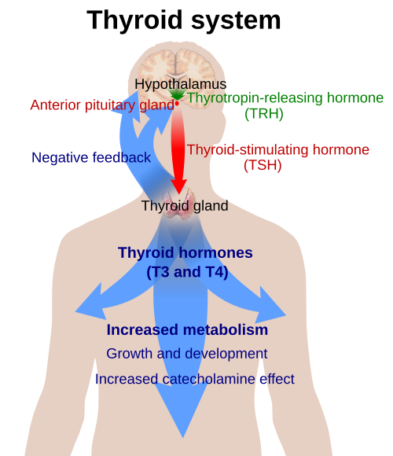
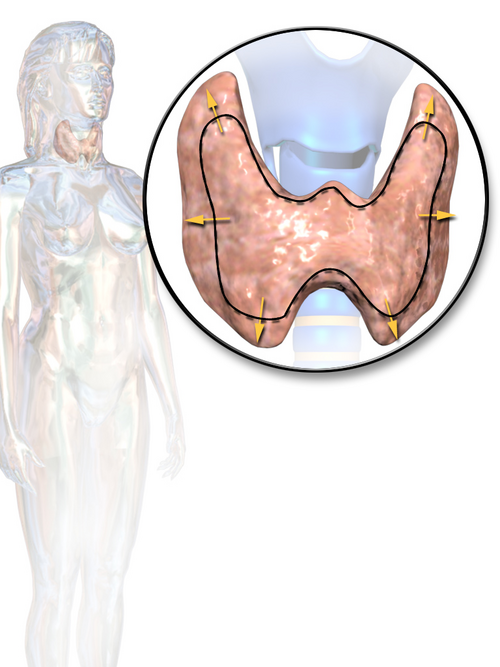

# DOENÇAS TIREOIDIANAS NA GESTAÇÃO

Entender a tireoide na gestação é, antes de tudo, entender uma dança hormonal perfeitamente orquestrada, mas que pode sair do ritmo com facilidade. Se você tentar decorar apenas os valores de TSH, vai errar questões de prova que cobram o raciocínio clínico. Como seu professor, meu papel aqui é mostrar que as mudanças na tireoide da gestante não são "erros" da natureza, mas adaptações necessárias para o desenvolvimento do bebê.

## Fisiologia Tireoidiana na Gravidez: O "Porquê" das Mudanças

*Figura 1 - Eixo hipotálamo-hipófise-tireoide: na gestação, o hCG mimetiza o TSH estimulando diretamente a tireoide, causando queda fisiológica do TSH no 1º trimestre. Fonte: Mikael Häggström, Domínio Público | Wikimedia Commons*

Para entender por que os valores de referência mudam, precisamos olhar para dois protagonistas: o estrogênio e o hCG.

### O Papel do Estrogênio e a TBG

Logo no início da gestação, o aumento do estrogênio estimula o fígado a produzir mais TBG (Globulina Ligadora de Tiroxina). Pense na TBG como o "ônibus" que transporta os hormônios tireoidianos no sangue. Se temos mais ônibus circulando, a quantidade total de passageiros (T4 total e T3 total) aumenta.

No entanto, o que realmente importa para o corpo é o hormônio livre, aquele que está fora do ônibus e pronto para agir. Por isso, em uma gestante saudável, o T4 livre permanece normal, enquanto o T4 total sobe cerca de 1,5 vez.

**Dica de Prova:** Se a questão trouxer um T4 total elevado com TSH normal em uma gestante, isso é fisiológico. Não trate!

### O hCG e o Mimetismo Molecular

Aqui está a maior pegadinha das bancas. O hCG (gonadotrofina coriônica humana) tem uma estrutura molecular muito parecida com a do TSH. Tão parecida que ele consegue "enganar" o receptor de TSH na glândula tireoide e estimulá-la diretamente.

Como o hCG atinge seu pico entre a 10ª e 12ª semana de gestação, a tireoide acaba produzindo mais hormônio nesse período. O corpo, percebendo esse excesso de T4, faz um feedback negativo na hipófise, o que resulta em uma queda fisiológica do TSH.

Portanto, é absolutamente normal encontrar um TSH mais baixo (às vezes até suprimido) no primeiro trimestre. É por isso que não usamos os mesmos valores de referência de uma mulher não grávida.

### A Demanda de Iodo

A gestante é uma "espoliadora" de iodo. Ela precisa de mais iodo por três motivos:

- Aumento da produção materna de T4 (cerca de 50% a mais).

- Aumento da depuração renal de iodo (a gestante urina mais iodo).

- Transferência de iodo para o feto para que ele comece a produzir seus próprios hormônios a partir da 12ª a 20ª semana.

## Hipotireoidismo na Gestação

O hipotireoidismo é a desordem tireoidiana mais comum na prática obstétrica. O grande perigo aqui é o desenvolvimento neurológico do feto. Lembre-se: até a metade da gestação, o bebê depende exclusivamente do T4 da mãe que atravessa a placenta. Se a mãe não tem T4 suficiente, o cérebro do bebê pode sofrer danos irreversíveis, levando ao cretinismo (hipotireoidismo congênito grave).

### Rastreamento Universal vs. Grupos de Risco

Existe uma discussão clássica entre as diretrizes. A ATA (American Thyroid Association) tradicionalmente sugeria rastrear apenas grupos de risco. No entanto, o posicionamento conjunto da SBEM e FEBRASGO (2022/2024) é claro: em locais com condições técnicas e financeiras, o rastreio universal com TSH deve ser realizado o mais precocemente possível, idealmente na primeira consulta de pré-natal ou no planejamento pré-gravídico.

Se você estiver em um local com poucos recursos, deve focar obrigatoriamente em mulheres com:

- História de disfunção tireoidiana ou cirurgia cervical.

- Idade > 30 anos.

- Presença de bócio.

- Diabetes Mellitus tipo 1 ou outras doenças autoimunes.

- História de abortamento, parto prematuro ou infertilidade.

- Anticorpo Anti-TPO positivo conhecido.

### Critérios Diagnósticos (Valores de Ouro)

Esqueça o valor de TSH de 0,4 a 4,5 da população geral. Na gestação, se o laboratório não fornecer valores específicos para cada trimestre da população local, seguimos a recomendação da FEBRASGO:

| Categoria | Valor de TSH (mUI/L) | Conduta |
| --- | --- | --- |
| **Eutireoidismo** | TSH ≤ 4,0 | Acompanhamento de rotina |
| **Hipotireoidismo Subclínico** | TSH > 4,0 e ≤ 10,0 (com T4L normal) | Iniciar Levotiroxina (1 mcg/kg/dia) |
| **Hipotireoidismo Clínico** | TSH > 10,0 (independente do T4L) OU TSH > 4,0 com T4L baixo | Iniciar Levotiroxina (2 mcg/kg/dia) |

**Atenção:** Algumas bancas ainda citam o valor de 2,5 mUI/L como limite para o primeiro trimestre. Segundo a FEBRASGO (2024), se o TSH estiver entre 2,5 e 4,0, você deve avaliar o Anti-TPO. Se o Anti-TPO for positivo, o tratamento com levotiroxina pode ser considerado para reduzir riscos de perda fetal. Se o Anti-TPO for negativo, apenas acompanhamos.

### Tratamento e Metas

O tratamento é feito exclusivamente com Levotiroxina sódica (T4). Não se usa T3 ou fórmulas manipuladas.

**Ajuste de dose em pacientes que já eram hipotireóideas:**
Assim que a paciente descobre a gravidez, a necessidade de levotiroxina aumenta em cerca de 25% a 50%. Uma dica prática que o Dr. Will sempre reforça: oriente a paciente a aumentar a dose em dois comprimidos extras por semana (um na segunda e outro na quinta, por exemplo) assim que o teste de gravidez der positivo, antes mesmo de chegar ao consultório.

**Metas Terapêuticas:**
O objetivo é manter o TSH na metade inferior da faixa de referência ou, de forma simplificada, **TSH < 2,5 mUI/L**. O controle deve ser feito com dosagem de TSH a cada 4 semanas até a metade da gestação, e depois pelo menos uma vez no terceiro trimestre.

### Manejo no Puerpério

Após o parto, a demanda hormonal cai bruscamente.

- **Se a paciente já tinha hipotireoidismo antes:** Volte para a dose pré-gestacional imediatamente.

- **Se o diagnóstico foi na gestação:**

- Se a dose era < 50 mcg/dia: Pode suspender e reavaliar TSH em 6 semanas.

- Se a dose era > 50 mcg/dia: Reduzir a dose em 25-50% e reavaliar em 6 semanas.

*Figura 2 - Anatomia da tireoide com bócio: aumento difuso da glândula pode ocorrer na Doença de Graves, principal causa de hipertireoidismo na gestação. Fonte: Blausen Medical, CC BY 3.0 | Wikimedia Commons*

## Hipertireoidismo na Gestação

Aqui o desafio é o diagnóstico diferencial. Nem todo TSH baixo na gestante significa Doença de Graves. Na verdade, a causa mais comum de tireotoxicose na gravidez é a Tireotoxicose Gestacional Transitória (TGT).

### Tireotoxicose Gestacional Transitória (TGT) vs. Doença de Graves

A TGT ocorre pelo estímulo excessivo do receptor de TSH pelo hCG. É muito comum em gestações gemelares ou em casos de Hiperêmese Gravídica (muito vômito = muito hCG = muita estimulação da tireoide).

| Característica | TGT (Transitória) | Doença de Graves |
| --- | --- | --- |
| **Época** | 1º Trimestre (pico do hCG) | Qualquer momento (geralmente prévia) |
| **Quadro Clínico** | Náuseas/Vômitos, sem bócio | Bócio, oftalmopatia, mixedema |
| **TRAb (Anticorpo)** | Negativo | Positivo |
| **Tratamento** | Suporte (hidratação, antieméticos) | Drogas Antitireoidianas (DAT) |

**Erro Clássico:** Tratar TGT com propiltiouracil ou metimazol. Isso é um erro grave! A TGT é autolimitada e melhora conforme os níveis de hCG caem após a 14ª-16ª semana. Se a paciente estiver muito taquicárdica, usamos betabloqueadores (Propranolol) por curto período.

### Tratamento da Doença de Graves

Se o diagnóstico for realmente Graves (confirmado por TRAb positivo ou sinais clínicos claros como exoftalmia), precisamos tratar para evitar crise tireotóxica materna e insuficiência cardíaca fetal.

As Drogas Antitireoidianas (DAT) atravessam a placenta, então usamos a menor dose possível para manter o T4 livre no limite superior da normalidade (não queremos deixar a mãe e o feto hipotireóideos).

**A Escolha da Droga (Crucial para Provas):**

- **1º Trimestre:** Propiltiouracil (PTU). Por que? Porque o Metimazol (MMZ) está associado à embriopatia (aplasia cútis e atresia de coanas/esôfago).

- **2º e 3º Trimestres:** Metimazol (MMZ). Por que? Porque o PTU tem maior risco de hepatotoxicidade materna grave. Fazemos a troca (switch) após a 16ª semana.

**Contraindicação Absoluta:** Iodo Radioativo (I-131). Ele atravessa a placenta e destrói a tireoide do feto, causando hipotireoidismo congênito definitivo. Se uma paciente recebeu iodo radioativo acidentalmente, ela deve ser informada dos riscos e o acompanhamento fetal deve ser rigoroso. Recomenda-se esperar pelo menos 6 meses após o tratamento com iodo para engravidar.

## Situações Especiais e Complicações

### Nódulos de Tireoide

Se você palpar um nódulo em uma gestante, a investigação é quase igual à de uma mulher não grávida.

- Ultrassonografia: Sempre indicada.

- PAAF (Punção Aspirativa por Agulha Fina): Pode ser feita com segurança em qualquer trimestre se o nódulo tiver critérios de suspeição.

- Cirurgia: Se for câncer de crescimento rápido, preferimos operar no **segundo trimestre**. Se for um câncer papilífero indolente, podemos esperar o pós-parto.

### Crise Tireotóxica

É uma emergência médica rara, mas devastadora. Ocorre geralmente em pacientes com Graves não tratada expostas a um estressor (infecção, parto, cesárea). O tratamento envolve doses altas de PTU, betabloqueadores, corticoides (para inibir a conversão periférica de T4 em T3) e suporte em UTI.

### Tireoidite Pós-Parto

Ocorre em até 10% das mulheres no primeiro ano após o parto. É uma inflamação autoimune destrutiva.

- **Fase 1 (Tireotoxicose):** O hormônio estocado "vaza" para o sangue. Dura 1-2 meses. Não se usa DAT (não há excesso de produção, apenas vazamento). Usa-se propranolol se houver sintomas.

- **Fase 2 (Hipotireoidismo):** A glândula fica exausta. Pode durar de 4 a 6 meses. Tratamos com levotiroxina se for sintomático ou TSH > 10.

- **Fase 3 (Recuperação):** A maioria volta ao normal, mas quem tem Anti-TPO positivo tem alto risco de hipotireoidismo permanente no futuro.

## Exemplo Clínico para Fixação

Imagine uma paciente, 28 anos, primigesta, 10 semanas de idade gestacional. Ela chega ao seu consultório com exames de rotina: TSH de 0,05 mUI/L e T4 livre de 1,9 ng/dL (referência até 1,8). Ela queixa-se de muitos vômitos e perda de 2kg desde o início da gravidez. Ao exame físico: FC 105 bpm, sem bócio, sem exoftalmia.

**Qual o diagnóstico e conduta?**
Este é um caso clássico de Tireotoxicose Gestacional Transitória (TGT). O TSH está suprimido pelo hCG alto (provavelmente associado à hiperêmese). O T4L está discretamente elevado. Como não há bócio nem sinais de Graves, a conduta é **suporte**. Hidratação, antieméticos e, se a taquicardia incomodar muito, Propranolol 10-20mg. Não inicie PTU! Reavalie em 4 semanas e você verá o TSH subindo e o T4L normalizando.

Agora, mude o cenário: a mesma paciente tem um bócio volumoso e o TRAb veio positivo. Aí sim, o diagnóstico é Doença de Graves e você deve iniciar Propiltiouracil (PTU), pois ela ainda está no primeiro trimestre.

## Conectando os Pontos: O Impacto Fetal

Você deve estar se perguntando: "Professor, e o cálcio? E o PTH?".
Lembre-se que o metabolismo do cálcio no feto é independente do da mãe para certas coisas. O PTH materno não atravessa a placenta. O feto mantém níveis de cálcio mais altos que os da mãe para garantir a mineralização óssea. Se a mãe tem hipoparatireoidismo, precisamos repor Cálcio e Vitamina D rigorosamente para evitar que o feto sofra com o baixo aporte.

No MedEvo, sempre enfatizamos que a tireoide não é um órgão isolado. O hipotireoidismo materno não tratado está ligado a:

- Descolamento Prematuro de Placenta (DPP).

- Pré-eclâmpsia.

- Baixo peso ao nascer.

- Hemorragia pós-parto.

Por isso, o controle rigoroso do TSH não é "capricho" de endocrinologista, é cuidado obstétrico fundamental.

## Pontos-Chave para Prova 🚀

- **Rastreio Universal:** Recomendado pela FEBRASGO/SBEM com TSH na primeira consulta.

- **Valor de Corte TSH:** > 4,0 mUI/L define hipotireoidismo (clínico ou subclínico) na ausência de valores locais.

- **Hipotireoidismo Clínico:** TSH > 10,0 mUI/L (independente do T4L) ou TSH > 4,0 com T4L baixo. Dose inicial: 2 mcg/kg/dia.

- **Hipotireoidismo Subclínico:** TSH entre 4,0 e 10,0 com T4L normal. Dose inicial: 1 mcg/kg/dia.

- **Meta de TSH:** Manter < 2,5 mUI/L durante toda a gestação.

- **Ajuste Imediato:** Pacientes já em tratamento devem aumentar a dose de levotiroxina em 30% assim que confirmarem a gravidez.

- **HCG e TSH:** O hCG estimula a tireoide; por isso, um TSH baixo no 1º trimestre pode ser fisiológico.

- **Tireotoxicose Gestacional Transitória (TGT):** Associada à hiperêmese, autolimitada, NÃO usar drogas antitireoidianas (DAT).

- **Doença de Graves:** Diagnóstico por bócio, oftalmopatia e TRAb positivo.

- **Propiltiouracil (PTU):** Droga de escolha no 1º trimestre (menor risco de malformações).

- **Metimazol (MMZ):** Droga de escolha no 2º e 3º trimestres (menor risco de hepatotoxicidade).

- **Iodo Radioativo (I-131):** Contraindicação ABSOLUTA na gestação (ablação da tireoide fetal).

- **Aplasia Cútis:** Malformação clássica associada ao uso de Metimazol no primeiro trimestre.

- **Cretinismo:** Consequência grave da deficiência de iodo e hormônio tireoidiano para o feto.

- **Anti-TPO Positivo:** Mesmo com TSH normal (eutireoidismo), aumenta o risco de abortamento e tireoidite pós-parto.

- **Betabloqueadores:** Propranolol é seguro para controle de sintomas adrenérgicos, mas o uso prolongado pode causar restrição de crescimento fetal (RCIU) e hipoglicemia neonatal.

- **Puerpério:** Reduzir a dose de levotiroxina para os níveis pré-gravídicos imediatamente após o parto.

- **Amamentação:** PTU e Metimazol são seguros em doses moderadas (PTU < 450mg/dia; MMZ < 20mg/dia).

 Cópia offline para consulta pessoal.
 Fonte original:
 [https://www.medevo.com.br/material-apoio/ler/e4aba3d1-8202-4264-ac04-9e145c744532](https://www.medevo.com.br/material-apoio/ler/e4aba3d1-8202-4264-ac04-9e145c744532)
