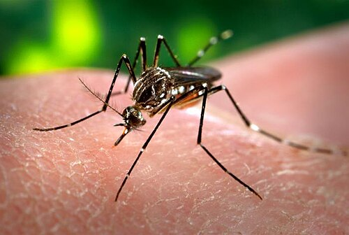

# DOENÇAS TROPICAIS, ARBOVIROSES E VIROSES EPIDÊMICAS

## Arboviroses: O Trio do Dia a Dia (Dengue, Chikungunya e Zika)

*Figura 1 - Aedes aegypti: vetor comum das arboviroses (dengue, chikungunya e Zika). Note o padrão em forma de lira no tórax. Fonte: James Gathany/CDC, Domínio Público | Wikimedia Commons*

Para começar, você precisa entender que, embora essas três doenças compartilhem o mesmo vetor (*Aedes aegypti*), a fisiopatologia e a "assinatura" clínica de cada uma são distintas. As bancas amam explorar essas diferenças.

### Dengue: O Foco é o Extravasamento Plasmático

A dengue não é uma doença de "sangramento" primário, mas sim de aumento da permeabilidade vascular. O que mata na dengue é o choque por hipovolemia relativa, não a hemorragia (embora ela ocorra).

**Fases clínicas:**

- **Febril:** Dura 2 a 7 dias. Aqui temos a mialgia, cefaleia retro-orbitária e exantema.

- **Crítica:** Começa com a defervescência (a febre vai embora). É aqui que o perigo mora. O hematócrito sobe porque o plasma sai do vaso. Se o aluno vê "febre baixou e paciente piorou", marque "fase crítica".

- **Recuperação:** Reabsorção de líquidos. Cuidado com a hipervolemia iatrogênica se você pesou a mão no soro antes.

**Sinais de Alarme (Memorize, isso cai em 90% das provas):**
Dor abdominal intensa e contínua, vômitos persistentes, acúmulo de líquidos (ascite, derrame pleural), hipotensão postural, hepatomegalia (> 2cm), sangramento de mucosa, letargia/irritabilidade e aumento súbito do hematócrito.

**Classificação e Manejo (Ministério da Saúde):**

- **Grupo A:** Sem sinais de alarme, sem condições especiais. Conduta: Hidratação oral (60ml/kg/dia) e sintomáticos.

- **Grupo B:** Sem sinais de alarme, mas com condições especiais (gestantes, idosos, comorbidades) ou prova do laço positiva. Conduta: Pedir Hemograma e observar até o resultado.

- **Grupo C:** Presença de QUALQUER sinal de alarme. Conduta: Internação e hidratação venosa imediata (10ml/kg na primeira hora).

- **Grupo D:** Dengue grave (choque, disfunção de órgãos). Conduta: UTI e ressuscitação volêmica vigorosa.

**Dica do professor:** A prova do laço positiva indica fragilidade capilar, mas não é sinal de alarme. Ela apenas coloca o paciente no Grupo B. Se o paciente já tem sangramento ativo (petéquias, gengivorragia), você não faz a prova do laço.

### Chikungunya: A Doença das Articulações

Diferente da dengue, a Chikungunya tem um tropismo absurdo por sinóvias. A febre é súbita e alta, mas a marca registrada é a poliartrite simétrica distal (mãos e pés).

- **Fase Aguda:** Até 14 dias. Tratamento é apenas sintomático. **Cuidado:** AINEs são evitados enquanto houver dúvida com dengue.

- **Fase Pós-Aguda:** 15 dias a 3 meses. A artralgia pode persistir.

- **Fase Crônica:** > 3 meses. Aqui mora a pegadinha. O paciente pode evoluir com artrite inflamatória crônica, parecida com artrite reumatoide.

**Tratamento:**

- Analgésicos e sintomáticos na fase inicial.

- Corticoide pode ser considerado em fases pós-aguda/crônica selecionadas, conforme intensidade e exclusão de dengue ativa.

- Casos crônicos podem exigir seguimento reumatológico.

### Zika: A Doença do Exantema e da Gestação

A Zika costuma ser a mais "leve" do ponto de vista sistêmico, mas é a mais temida pelo impacto fetal.

**Clínica:**

- Febre baixa ou ausente.

- Exantema pruriginoso precoce.

- Conjuntivite não purulenta.

- Artralgia leve.

**Ponto crucial de prova:** gestante com quadro compatível de Zika exige atenção pelo risco de síndrome congênita associada ao vírus Zika, incluindo microcefalia e outras alterações neurológicas.

### Como Diferenciar Dengue, Chikungunya e Zika

| Achado | Dengue | Chikungunya | Zika |
| --- | --- | --- | --- |
| **Febre** | Alta | Alta | Baixa ou ausente |
| **Dor muscular** | Muito marcante | Moderada | Leve |
| **Dor articular** | Leve/Moderada | Muito intensa | Leve |
| **Exantema** | Mais tardio | Variável | Precoce e pruriginoso |
| **Conjuntivite** | Rara | Rara | Frequente |
| **Complicação-chave** | Choque por extravasamento | Artralgia crônica | Síndrome congênita |

## Pontos-Chave para Prova

- Dengue grave é, principalmente, doença de extravasamento plasmático e choque.

- Chikungunya cobra pela artralgia intensa e pela possibilidade de cronificação.

- Zika costuma ter febre baixa, exantema pruriginoso e conjuntivite, com destaque para risco gestacional.

- Em paciente com suspeita de arbovirose, evite decisões precipitadas com AINEs enquanto dengue não estiver afastada.

## Como Abordar Síndrome Febril Aguda nas Provas

Antes de decorar cada doença, pense em **síndrome febril + epidemiologia + sinal dominante**:

| Cenário | Diagnóstico que deve acender alerta | Achado-chave de prova |
| --- | --- | --- |
| Febre alta + mialgia intensa + dor retro-orbitária + plaquetopenia | Dengue | Perigo na defervescência; sinais de alarme indicam extravasamento plasmático |
| Febre alta + poliartralgia incapacitante distal | Chikungunya | Dor articular intensa e possibilidade de cronificação |
| Exantema pruriginoso precoce + conjuntivite + gestante | Zika | Risco de síndrome congênita associada ao vírus Zika |
| Febre + tosse seca + mialgia + início abrupto no inverno/surto | Influenza | Antiviral precoce se grave ou grupo de risco; vacinação anual |
| Febre/sintomas respiratórios + contato/ambiente fechado + risco de gravidade | COVID-19 | SARS-CoV-2, risco de pneumonia/hipoxemia e condição pós-COVID |
| Febre periódica + calafrios/sudorese + exposição na Amazônia | Malária | Gota espessa/teste parasitológico; tratar conforme espécie e gravidade |
| Febre prolongada + perda ponderal + hepatoesplenomegalia + pancitopenia | Leishmaniose visceral | Zoonose por flebotomíneo; pode ser fatal sem tratamento |
| Mancha/placa cutânea com perda de sensibilidade + nervo espessado | Hanseníase | Diagnóstico clínico dermatoneurológico; tratamento gratuito com PQT-U |

> **Atalho de prova:** em doenças tropicais, a banca costuma misturar quadros de febre. Sempre procure: vetor/exposição, tempo de evolução, padrão de pele, articulação, sangramento, acometimento respiratório e sinais de gravidade.

## Viroses Epidêmicas Respiratórias: Influenza e COVID-19

O foco cadastrado inclui explicitamente **Influenza** e **COVID-19**, então elas precisam estar no mesmo mapa mental das arboviroses: todas podem aparecer como febre aguda, mas o eixo respiratório muda a conduta.

### Influenza: início abrupto e síndrome gripal clássica

A influenza sazonal é uma infecção respiratória aguda por vírus influenza, principalmente tipos A e B. A transmissão ocorre por gotículas/aerossóis respiratórios e contato com secreções.

**Quadro típico:**

- Início súbito de febre, calafrios e mal-estar importante.

- Tosse geralmente seca, dor de garganta, coriza.

- Mialgia e cefaleia importantes.

- Em geral melhora em cerca de uma semana, mas tosse e fadiga podem persistir.

**Grupos com maior risco de complicação:** gestantes, crianças pequenas, idosos, pessoas com cardiopatia/pneumopatia/doença renal/hepática/metabólica, imunossuprimidos e profissionais de saúde.

**Conduta de prova:**

- Caso leve sem risco: suporte, hidratação, repouso e isolamento respiratório conforme orientação local.

- Caso grave, SRAG ou grupo de risco: considerar antiviral precoce conforme protocolo vigente, idealmente nas primeiras 48 horas, sem atrasar em caso grave.

- Prevenção principal: **vacinação anual**, porque a imunidade cai e as cepas circulantes mudam.

**Pegadinha:** influenza e COVID podem ser indistinguíveis clinicamente. Se a questão exige confirmação etiológica, use teste laboratorial apropriado, especialmente em pacientes graves, surtos ou grupos vulneráveis.

### COVID-19: SARS-CoV-2, gravidade respiratória e pós-COVID

COVID-19 é causada pelo SARS-CoV-2. A transmissão ocorre por partículas respiratórias, sobretudo em contato próximo e ambientes fechados/pouco ventilados.

**Sintomas frequentes:** febre ou calafrios, dor de garganta, tosse, coriza, cefaleia, mialgia, fadiga; perda de olfato/paladar pode ocorrer, mas não é obrigatória nas variantes atuais.

**Sinais de gravidade:** dispneia em repouso, incapacidade de falar frases completas, confusão, sonolência/rebaixamento, dor torácica persistente, cianose ou sinais de má perfusão.

**Risco aumentado:** idosos, gestantes, não vacinados, imunossuprimidos, pessoas com diabetes, obesidade, doença pulmonar, cardíaca, renal, hepática, câncer ou múltiplas comorbidades.

**Conduta de prova:**

- Leve: suporte, orientação de isolamento/uso de máscara conforme norma local e atenção a sinais de piora.

- Alto risco ou doença moderada/grave: avaliação precoce para terapias específicas conforme disponibilidade/protocolo e estratificação de risco.

- Prevenção: vacinação reduz muito o risco de hospitalização e morte; ventilação, higiene das mãos e máscara em sintomáticos/ambientes de risco.

**Pós-COVID:** sintomas persistentes como fadiga, dispneia, dor, cefaleia e dificuldade cognitiva podem comprometer atividades diárias mesmo após a fase aguda.

## Febre Amarela: Arbovirose que a Banca Não Perdoa

Embora não estivesse no título antigo, febre amarela aparece com frequência em blocos de arboviroses/doenças tropicais.

**Agente e transmissão:** flavivírus. No Brasil, o ciclo relevante é principalmente silvestre, com primatas não humanos como sentinelas e mosquitos vetores em áreas de mata. O ser humano se infecta ao entrar em área de risco sem vacinação adequada.

**Quadro:** febre, cefaleia, mialgia, náuseas/vômitos. A forma grave pode evoluir com icterícia, hemorragias, insuficiência hepática/renal e choque.

**Prevenção:** vacina contra febre amarela é a medida-chave para pessoas em áreas com recomendação vacinal, respeitando contraindicações e precauções por ser vacina de vírus vivo atenuado.

**Pegadinha:** epizootia em primatas não significa “culpar macacos”; eles funcionam como alerta epidemiológico. A prevenção é vacinar humanos e controlar exposição ao vetor.

## Malária: Febre + Amazônia + Diagnóstico Parasitológico

A malária é causada por protozoários do gênero **Plasmodium** e transmitida pela picada da fêmea do mosquito **Anopheles**. No Brasil, a maioria dos casos ocorre na região amazônica. Não há transmissão direta pessoa-pessoa no convívio comum.

**Clínica típica:**

- Febre, calafrios, tremores, sudorese e cefaleia, por vezes em padrão cíclico.

- Náuseas, vômitos, cansaço e anorexia podem preceder o quadro clássico.

- Gravidade maior em gestantes, crianças, pessoas sem imunidade prévia e infecção por *P. falciparum*.

**Sinais de malária grave:** alteração de consciência, convulsões, prostração intensa, dispneia/hiperventilação, choque, hemorragia, icterícia importante, anemia grave, hipoglicemia, insuficiência renal ou parasitemia elevada.

**Diagnóstico:** deve demonstrar o parasito ou antígeno no sangue. Em prova brasileira, lembre de **gota espessa/microscopia** e teste rápido quando indicado. Sorologia não é exame para suspeita clínica aguda, pois reflete exposição prévia e atrasa o diagnóstico.

**Tratamento:** depende da espécie, gravidade, idade/peso, gestação e comorbidades. Casos graves devem ser hospitalizados. Em *P. vivax* e *P. ovale*, há preocupação com formas hepáticas latentes (hipnozoítos) e recaídas, exigindo esquema específico conforme protocolo.

**Prevenção:** mosquiteiro, repelente, roupas compridas, telas, controle vetorial e orientação de viajantes. Segundo o Ministério da Saúde, não há vacina contra malária disponível no Brasil; vacinas existentes têm uso específico em alguns países africanos para crianças pequenas.

## Leishmanioses: Visceral vs Tegumentar

Leishmaniose é causada por protozoários do gênero **Leishmania** e transmitida por flebotomíneos (“mosquito-palha”, birigui). O termo engloba formas diferentes, e isso é onde a banca costuma confundir.

### Leishmaniose visceral (LV): febre prolongada e baço grande

Também chamada de calazar, é sistêmica e potencialmente fatal se não tratada.

**Clássico de prova:**

- Febre de longa duração.

- Perda de peso, fraqueza, astenia.

- Hepatoesplenomegalia, especialmente esplenomegalia.

- Anemia/pancitopenia e infecções ou sangramentos por citopenias.

**Transmissão e reservatório:** nas áreas urbanas brasileiras, o cão é o principal reservatório; o humano não é o principal reservatório urbano.

**Diagnóstico:** associação de quadro clínico/epidemiologia com testes imunológicos (ex.: teste rápido, RIFI conforme disponibilidade) e/ou parasitológico. O encontro de amastigotas em material biológico é diagnóstico de certeza.

**Tratamento:** é gratuito no SUS e deve ser iniciado o quanto antes. A escolha do medicamento depende de idade, gravidade, gestação, imunossupressão e risco de toxicidade; anfotericina B lipossomal é importante em grupos selecionados conforme protocolo.

### Leishmaniose tegumentar: úlcera de pele e risco mucoso

A forma cutânea costuma causar úlcera crônica em área exposta, geralmente com bordas elevadas e pouca dor. A forma mucosa pode acometer nariz, boca e faringe e causar destruição tecidual.

**Pegadinha:** lesão cutânea crônica em trabalhador rural/área de mata não é “ferida comum” até prova em contrário. Pense em leishmaniose tegumentar e confirme com investigação específica.

## Hanseníase: Pele + Nervo + Sensibilidade

Hanseníase é doença infecciosa crônica por **Mycobacterium leprae**, com tropismo por pele e nervos periféricos. Tem cura e tratamento gratuito pelo SUS.

**Transmissão:** vias aéreas superiores, em contato próximo e prolongado com caso infectante sem tratamento. Não se transmite por abraço, talheres, roupas de cama ou contato casual. Após início do tratamento adequado, a transmissão cai de forma importante.

### Sinais cardinais

Pense em hanseníase quando houver:

- Mancha ou placa hipocrômica/eritematosa/acastanhada com **perda de sensibilidade** térmica, dolorosa ou tátil.

- Espessamento de nervo periférico com alteração sensitiva, motora ou autonômica.

- Baciloscopia positiva quando realizada.

**Manifestações comuns:** áreas com menos pelos/sudorese, formigamento, fisgadas, dormência, fraqueza em mãos/pés/face e nódulos em alguns casos.

### Classificação operacional

- **Paucibacilar (PB):** até 5 lesões cutâneas e baixa carga bacilar.

- **Multibacilar (MB):** mais de 5 lesões, acometimento neural importante ou baciloscopia positiva, independentemente do número de lesões.

### Tratamento e reações

O tratamento é com **poliquimioterapia única (PQT-U)**, combinando rifampicina, dapsona e clofazimina, em geral por 6 meses na PB e 12 meses na MB, conforme diretriz vigente. Contatos devem ser examinados.

**Reações hansênicas:** podem ocorrer antes, durante ou após o tratamento. A reação tipo 1 costuma piorar lesões e neurite; a tipo 2 é o eritema nodoso hansênico, com nódulos dolorosos e manifestações sistêmicas. Neurite é urgência funcional: trate cedo para prevenir incapacidade.

## Malária e Leishmanioses: tratamento que muda alternativa

O ponto que mais cai não é só reconhecer o agente: é perceber que **o tratamento muda conforme espécie, gravidade, gestação, idade, função orgânica e imunossupressão**. Em prova, quando a alternativa parece “antiparasitário genérico”, desconfie. Essas doenças têm protocolos bem específicos.

### Malária: primeiro defina espécie e gravidade

O raciocínio correto começa com três perguntas:

- O exame confirmou malária e identificou a espécie?

- Há sinais de gravidade?

- O paciente é gestante, criança pequena, tem contraindicação a primaquina/tafenoquina ou risco de deficiência de G6PD?

**Diagnóstico que guia tratamento:** gota espessa é o exame clássico e permite ver parasitemia; teste rápido ajuda quando a microscopia não está disponível; PCR fica para situações específicas. Depois disso, a conduta é por espécie.

| Situação de prova | Conduta que a banca espera |
| --- | --- |
| *Plasmodium vivax* ou *P. ovale*, sem gravidade | Tratar fase sanguínea e fazer cura radical dos hipnozoítos com 8-aminoquinolina quando elegível. No Brasil, cloroquina costuma entrar para a fase sanguínea; primaquina ou tafenoquina depende de elegibilidade, G6PD e protocolo vigente. |
| *P. falciparum*, sem gravidade | Usar terapia combinada baseada em artemisinina. O guia brasileiro traz artesunato + mefloquina como opção preferencial e arteméter + lumefantrina como alternativa conforme disponibilidade local; primaquina em dose única pode ser usada para reduzir transmissão, conforme protocolo. |
| Malária mista | Tratar como *falciparum* para cobrir risco de gravidade e acrescentar estratégia de cura radical contra hipnozoítos quando houver componente *vivax/ovale* e o paciente puder receber. |
| Malária grave/complicada | Emergência. Internação, suporte, avaliação de hipoglicemia, anemia, insuficiência renal, alteração neurológica e tratamento parenteral com artesunato injetável conforme protocolo. Não espere “ciclo febril clássico” para tratar. |
| Gestante | Sempre exige cuidado próprio. Evite primaquina/tafenoquina durante a gestação; esquemas e profilaxia pós-tratamento seguem protocolo específico e devem considerar trimestre, espécie e gravidade. |

**Pegadinha clássica:** febre terça/quartã ajuda a lembrar malária, mas não deve atrasar diagnóstico. Em área endêmica ou após viagem, febre aguda com calafrios e sudorese precisa de teste. A prova pode tentar trocar tratamento de *vivax* por esquema de *falciparum*, ou esquecer a cura radical dos hipnozoítos.

### Leishmaniose visceral: febre prolongada, baço grande e medula “sofrendo”

A leishmaniose visceral é a forma sistêmica. O eixo de prova é: **febre prolongada + perda de peso + hepatoesplenomegalia + pancitopenia**. Pode simular doença hematológica, tuberculose disseminada, malária crônica, esquistossomose hepatoesplênica e HIV avançado.

**Tratamento:** no SUS, o antimonial pentavalente é opção clássica em muitos pacientes, mas a **anfotericina B lipossomal** ganha importância quando há maior risco de toxicidade, gravidade, gestação, idade extrema, insuficiência renal/hepática/cardiopatia, coinfecção HIV ou imunossupressão. A escolha não é decorada no vazio: depende do risco do paciente.

**O que não errar:**

- Esplenomegalia importante com pancitopenia não é “virologia comum”; pense em LV.

- Todo caso suspeito precisa avaliação e notificação, porque é doença potencialmente fatal.

- Coinfecção HIV aumenta risco de recidiva e exige acompanhamento mais estreito.

- Cão infectado é tema de vigilância e controle, mas a conduta humana é tratamento do paciente, não “tratar o cachorro e pronto”.

### Leishmaniose tegumentar: pele, mucosa e escolha do fármaco

Na forma tegumentar, a pista é **úlcera de bordas elevadas, fundo granuloso e evolução arrastada** após exposição em área de transmissão. A forma mucosa pode aparecer meses ou anos depois, com lesão nasal/orofaríngea destrutiva, muito cobrada em prova.

**Tratamento:** antimonial pentavalente é uma referência histórica importante; anfotericina B e pentamidina entram em situações específicas, falha, contraindicação ou espécies/contextos particulares. A miltefosina tem papel em cenários selecionados de leishmaniose tegumentar, mas não deve ser tratada como solução universal.

**Resumo mental:**

- Visceral mata por doença sistêmica: febre, baço, pancitopenia.

- Tegumentar marca pele e mucosa: úlcera crônica e lesão mucosa destrutiva.

- Tratamento muda por forma clínica e risco do paciente; alternativa “um remédio para todos” costuma estar errada.

## Quadro Final de Diferenciação Rápida

| Doença | Vetor/transmissão | Pista clínica dominante | Diagnóstico lembrado em prova | Conduta/prevenção-chave |
| --- | --- | --- | --- | --- |
| Dengue | *Aedes* | Mialgia, dor retro-orbitária, alarme na defervescência | Clínico + NS1/RT-PCR no início; sorologia depois | Hidratação; evitar AINE/AAS; reconhecer grupos C/D |
| Chikungunya | *Aedes* | Poliartralgia intensa e crônica | Clínico/epidemiológico ± laboratório | Analgesia; cuidado com AINE se dengue não excluída |
| Zika | *Aedes* | Exantema pruriginoso + conjuntivite; gestante | Clínico/epidemiológico ± RT-PCR/sorologia conforme fase | Atenção gestacional e prevenção vetorial |
| Influenza | Respiratória | Início abrupto: febre, tosse, mialgia | Clínico; teste se grave/surto/diferencial | Vacina anual; antiviral precoce em grave/risco |
| COVID-19 | Respiratória | Sintomas respiratórios variados, hipoxemia em grave | Antígeno/RT-PCR conforme contexto | Vacina; ventilação/máscara; tratar alto risco/grave |
| Malária | *Anopheles* | Febre + calafrios + Amazônia/viagem | Gota espessa ou teste rápido | Tratamento por espécie/gravidade; prevenção de picada |
| Leishmaniose visceral | Flebotomíneo | Febre prolongada + esplenomegalia + pancitopenia | Testes imunológicos/parasitológico | Tratamento precoce; controle vetorial/reservatório |
| Hanseníase | Respiratória prolongada | Lesão anestésica + nervo espessado | Exame dermatoneurológico | PQT-U; examinar contatos; prevenir incapacidade |

## Fontes verificadas para esta atualização

- Ministério da Saúde — Dengue: sinais de alarme, diagnóstico, prevenção e tratamento.

- Ministério da Saúde — Malária: transmissão por *Anopheles*, quadro clínico, diagnóstico parasitológico e tratamento conforme espécie/gravidade.

- Ministério da Saúde — Leishmaniose visceral: transmissão por flebotomíneos, sintomas, diagnóstico e tratamento no SUS.

- Ministério da Saúde — Hanseníase: transmissão, sinais e sintomas, diagnóstico dermatoneurológico e PQT-U.

- OMS/WHO — Influenza sazonal: sintomas, grupos de risco, vacinação e tratamento em risco/grave.

- OMS/WHO — COVID-19: sintomas, transmissão, grupos de risco, vacinação e sinais de gravidade.

- OMS/WHO — Malária, Leishmaniose e Hanseníase: fichas técnicas para revisão epidemiológica e clínica.

 Cópia offline para consulta pessoal.
 Fonte original:
 [https://www.medevo.com.br/material-apoio/ler/32b8d891-43b7-420f-b229-ac686189e3e2](https://www.medevo.com.br/material-apoio/ler/32b8d891-43b7-420f-b229-ac686189e3e2)
