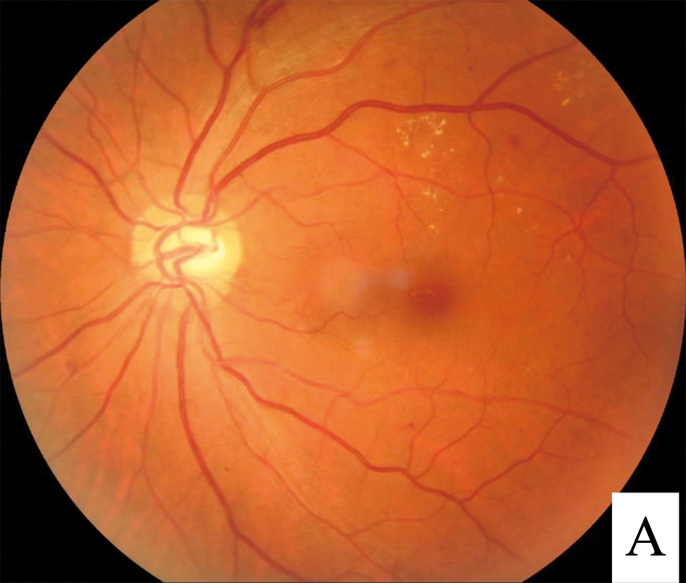
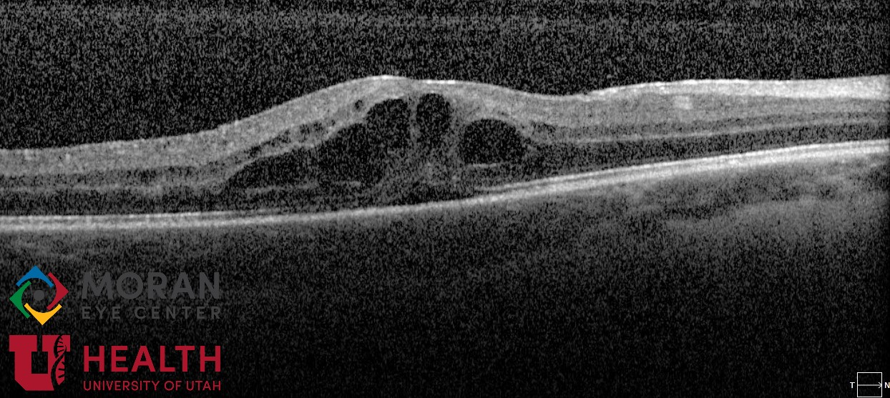
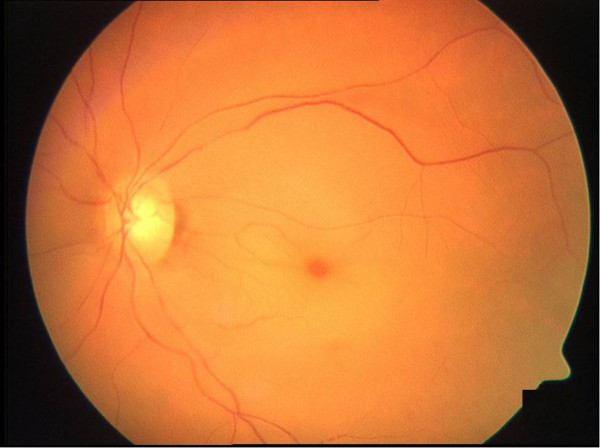
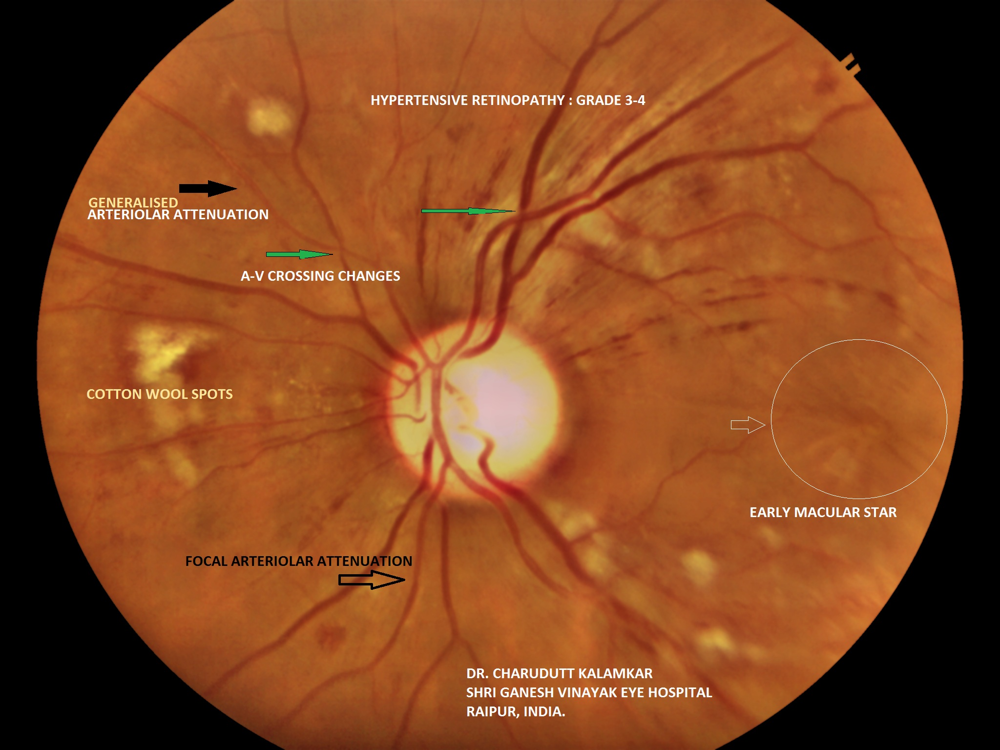

# DOENÇAS VASCULARES DA RETINA

Para entender as doenças vasculares da retina, você precisa primeiro visualizar a retina não apenas como um tecido nervoso, mas como um dos tecidos mais metabolicamente ativos do corpo humano. Ela consome oxigênio em uma taxa altíssima. Por isso, qualquer interrupção no fluxo sanguíneo, seja por "entupimento" (oclusão) ou por "vazamento" (diabetes e hipertensão), gera consequências catastróficas e rápidas.

Neste material, vamos focar nos quatro pilares que caem em qualquer prova de residência ou título de especialista: Retinopatia Diabética, Oclusões Venosas, Oclusões Arteriais e Retinopatia Hipertensiva.

## Retinopatia Diabética (RD)

A Retinopatia Diabética é a principal causa de cegueira irreversível em idade laboral em países desenvolvidos e no Brasil. O que você deve entender de imediato: a RD é uma microangiopatia. Ela afeta os pequenos vasos, os capilares retinianos.

### Fisiopatologia: O porquê do dano

Por que o excesso de glicose destrói o vaso? Existem quatro vias metabólicas principais, mas a que você não pode esquecer é a via do sorbitol e a formação de produtos finais de glicação avançada (AGEs).

O evento histopatológico mais precoce, e que as bancas amam cobrar, é a perda dos pericitos. Os pericitos são células que "abraçam" os capilares e controlam o fluxo e a estabilidade do vaso. Sem pericitos, a parede do vaso enfraquece, gerando as famosas dilatações saculares chamadas microaneurismas.

A partir daí, temos dois problemas simultâneos:

- Quebra da barreira hematorretiniana: O vaso vaza líquido, proteínas e lipídeos (causando edema e exsudatos duros).

- Isquemia: O vaso fecha (obstrução capilar), a retina sofre por falta de oxigênio e, em desespero, libera fatores de crescimento, principalmente o VEGF (Fator de Crescimento Endotelial Vascular).

### Classificação e Quadro Clínico

A classificação da RD é dividida em Não Proliferativa (RDNP) e Proliferativa (RDP). O divisor de águas aqui é a presença de neovasos. Se tem neovaso, é proliferativa. Se não tem, é não proliferativa.

*Figura 1: RDNP. Note os exsudatos duros amarelados (depósitos lipídicos), microaneurismas (pontos vermelhos pequenos) e hemorragias intraretinianas.*

#### Retinopatia Diabética Não Proliferativa (RDNP)

A RDNP é graduada conforme a gravidade dos achados. Aqui, usamos a regra "4-2-1" do estudo ETDRS para identificar o risco de progressão para a forma proliferativa:

- RDNP Leve: Apenas microaneurismas.

- RDNP Moderada: Mais do que apenas microaneurismas, mas menos que a grave.

- RDNP Grave (Regra 4-2-1):

- Hemorragias intraretinianas em 4 quadrantes.

- Rosário venoso (venous beading) em 2 quadrantes.

- Anormalidades Microvasculares Intraretinianas (IRMA) em 1 quadrante.

Cuidado: Se o paciente preencher UM desses critérios, ele já é classificado como RDNP Grave. Se preencher dois ou mais, é RDNP Muito Grave. Por que isso importa? Porque o risco de ele evoluir para neovascularização em um ano é altíssimo.

#### Retinopatia Diabética Proliferativa (RDP)

Aqui o VEGF está em níveis críticos. A retina isquêmica tenta criar novos vasos para se salvar, mas esses vasos são "vagabundos", frágeis e crescem no lugar errado (para dentro do vítreo). Eles sangram facilmente, causando hemorragia vítrea, e podem sofrer fibrose, puxando a retina e causando descolamento de retina tracional.

### Edema Macular Diabético (EMD)

Este é um conceito fundamental que o MedEvo sempre reforça: o Edema Macular Diabético pode ocorrer em QUALQUER estágio da retinopatia. Um paciente com RDNP leve pode ter um edema macular grave e perder a visão central, enquanto um paciente com RDP pode ter a mácula seca e manter visão 20/20 (até que o neovaso sangre).

O diagnóstico padrão-ouro para detectar o edema é o exame clínico (biomicroscopia de fundo), mas a quantificação e o seguimento são feitos pelo OCT (Tomografia de Coerência Óptica).

*Figura 6: OCT — Edema Macular Cistoide. Os espaços negros são cistos cheios de fluido dentro da retina. Não se trata edema macular sem OCT!*

### Diagnóstico e Rastreio

Segundo a Diretriz da Sociedade Brasileira de Diabetes (SBD, 2023/2024):

- Diabetes Tipo 1: Iniciar rastreio 5 anos após o diagnóstico (pois o dano demora a se manifestar).

- Diabetes Tipo 2: Iniciar rastreio NO MOMENTO do diagnóstico (pois o paciente pode estar hiperglicêmico há anos sem saber).

- Gestantes diabéticas: Devem ser avaliadas no primeiro trimestre e acompanhadas de perto, pois a gestação pode acelerar a RD de forma brutal.

### Tratamento

O tratamento mudou drasticamente nos últimos anos. Antigamente, fazíamos laser em todo mundo. Hoje, a estrela é o Anti-VEGF.

- Controle Sistêmico: Não adianta tratar o olho se a HbA1c estiver 12%. A meta é HbA1c < 7%, pressão arterial < 130/80 mmHg e controle lipídico.

- Anti-VEGF (Ranibizumabe, Aflibercepte, Bevacizumabe): Primeira escolha para Edema Macular Diabético que envolva o centro da fóvea. São injeções intravítreas mensais ou bimestrais.

- Panfotocoagulação a Laser (PRP): Indicada para a Retinopatia Diabética Proliferativa.

*Figura 5: PRP (Panfotocoagulação). As marcas periféricas de laser destroem retina isquêmica, diminuindo a produção de VEGF e regredindo neovasos.* O objetivo não é melhorar a visão, mas sim "sacrificar" a retina periférica isquêmica para diminuir a produção de VEGF e salvar a visão central.
4. Vitrectomia: Reservada para complicações como hemorragia vítrea persistente ou descolamento de retina tracional.

| Achado Clínico | Significado Fisiopatológico |
| --- | --- |
| Microaneurismas | Perda de pericitos e fraqueza capilar |
| Exsudatos Duros | Vazamento de lipídeos (quebra da barreira) |
| Exsudatos Algodonosos | Infarto da camada de fibras nervosas (isquemia) |
| IRMA | Shunts vasculares em áreas de isquemia |
| Neovasos | Resposta proliferativa ao excesso de VEGF |

## Oclusões Venosas da Retina

As oclusões venosas são a segunda doença vascular mais comum da retina, perdendo apenas para a diabetes. Imagine uma pia entupida: a água (sangue) não consegue sair, a pressão aumenta e o cano (veia) estoura, espalhando sangue e líquido por todo lado.

### Etiologia e Fatores de Risco

O principal fator de risco é a Hipertensão Arterial Sistêmica. Outros incluem idade avançada, glaucoma (pela pressão mecânica no nervo óptico) e trombofilias (especialmente em pacientes jovens).

O mecanismo clássico é a compressão da veia pela artéria. Como elas compartilham uma bainha adventícia comum nos cruzamentos arteriovenosos, a artéria endurecida pela aterosclerose "esmaga" a veia, gerando turbulência e formação de trombo.

### Classificação

Dividimos em dois grandes grupos baseados na localização:

- Oclusão de Veia Central da Retina (OVCR): O trombo está na lâmina crivosa. O fundo de olho é uma "explosão" de hemorragias nos quatro quadrantes.

- Oclusão de Ramo Venoso da Retina (OVRR): O trombo está em um cruzamento periférico. As alterações ficam restritas ao setor drenado por aquela veia.

#### O ponto crucial: Isquêmica vs Não-Isquêmica

Isso define o prognóstico. A oclusão isquêmica (definida por mais de 10 áreas de não-perfusão capilar na angiografia) tem um risco altíssimo de desenvolver neovascularização de segmento anterior.

Dica de prova: O "Glaucoma dos 100 dias". É o glaucoma neovascular que ocorre cerca de 3 meses após uma OVCR isquêmica. O VEGF produzido na retina viaja para a frente do olho, cria vasos na íris (rubeosis iridis) que entopem o ângulo e fazem a pressão ocular subir para níveis de 50-60 mmHg.

### Quadro Clínico

O paciente chega com perda súbita de visão, indolor e unilateral. No exame de fundo de olho, você verá:

*Figura 3: OVCR — "Blood and Thunder". Hemorragias em chama de vela em todos os quadrantes, veias tortuosas e dilatadas. Compare com a OACR (retina pálida sem sangue).*

- Hemorragias em "chama de vela".

- Veias tortuosas e dilatadas.

- Edema de papila (na OVCR).

- Edema macular (causa mais comum de perda visual crônica nessas doenças).

### Tratamento das Oclusões Venosas

Aqui, o Dr. Will sempre lembra: tratamos a consequência, não a causa do entupimento.

- Edema Macular: Injeções de Anti-VEGF ou implantes de corticoide (Dexametasona intravítrea). O corticoide funciona muito bem aqui porque a oclusão venosa tem um componente inflamatório muito forte.

- Isquemia/Neovasos: Se houver neovascularização de íris ou de retina, fazemos panfotocoagulação a laser.

- Cuidado: Não se faz laser "preventivo" em oclusão venosa sem neovaso, exceto em casos selecionados de OVRR.

## Oclusões Arteriais da Retina

Se a oclusão venosa é uma pia entupida, a oclusão arterial é um cano fechado. É o "infarto" da retina. É uma emergência oftalmológica e médica.

### Fisiopatologia e Etiologia

A causa mais comum é embolia. O êmbolo geralmente vem da carótida (placa de ateroma) ou do coração (fibrilação atrial, doença valvar).

- Êmbolos de Hollenhorst: São cristais de colesterol, pequenos e brilhantes.

- Êmbolos de Cálcio: Maiores, brancos e opacos (geralmente cardíacos).

### Quadro Clínico: A Mancha Vermelho-Cereja

*Figura 2: OACR — "Cherry Red Spot". A retina edemaciada fica branca, mas na fóvea (que é fina) a coroide vermelha brilha por baixo, criando o contraste clássico.*

O paciente apresenta perda súbita, profunda e indolor da visão.
No fundo de olho, a retina fica branca/pálida. Por quê? Porque as camadas internas da retina sofrem edema citotóxico e perdem a transparência.

A pegadinha de prova: "Por que aparece a mancha vermelho-cereja na fóvea?".
A resposta é anatômica: na fóvea, a retina é muito fina e não possui as camadas internas que ficam edemaciadas. Assim, conseguimos ver a coróide (que é vascularizada pela artéria ciliorretiniana ou pelo sistema ciliar, que não foi afetado) brilhando por baixo. O contraste da retina branca ao redor com o centro vermelho dá o aspecto de cereja.

### Variantes Importantes

- Oclusão de Artéria Central da Retina (OACR): Visão de vultos ou percepção luminosa.

- Oclusão de Ramo Arterial (OARR): Perda de campo visual correspondente ao ramo.

- Presença de Artéria Ciliorretiniana: Cerca de 15 a 30% da população tem essa artéria extra que nasce da circulação ciliar. Se o paciente tem uma OACR mas tem essa artéria, uma pequena ilha de visão central pode ser poupada.

### Conduta de Emergência

O tempo é retina. Após 90 a 120 minutos de oclusão total, o dano é irreversível.
As tentativas de tratamento (com pouca evidência de sucesso, mas feitas pelo desespero) visam deslocar o êmbolo para a periferia:

- Massagem ocular digital (para flutuar a pressão e tentar mover o êmbolo).

- Paracentese da câmara anterior (retirar um pouco de humor aquoso para baixar a pressão subitamente).

- Hipipotensores oculares tópicos e sistêmicos (Acetazolamida 500mg VO).

O mais importante para a prova e para a vida: Este paciente tem um risco altíssimo de AVC e Infarto do Miocárdio nos dias seguintes. Ele DEVE ser encaminhado para avaliação cardiovascular urgente, Doppler de carótidas e ecocardiograma.

| Característica | Oclusão Venosa (OVCR) | Oclusão Arterial (OACR) |
| --- | --- | --- |
| Início | Súbito | Súbito |
| Dor | Ausente | Ausente |
| Fundo de Olho | Hemorragias, "sangue e trovão" | Retina pálida, mancha vermelho-cereja |
| Principal Causa | HAS, Glaucoma | Embolia (Carótida/Coração) |
| Complicação Temida | Glaucoma Neovascular | AVC / Infarto Sistêmico |

## Retinopatia Hipertensiva

Diferente da diabetes, a hipertensão causa alterações que muitas vezes são reversíveis se a pressão for controlada. O dano aqui é decorrente da autorregulação do fluxo sanguíneo retiniano.

*Figura 4: Retinopatia Hipertensiva. Note os cruzamentos AV patológicos (onde a artéria "comprime" a veia) e o estreitamento arteriolar generalizado.*

### Fases da Retinopatia Hipertensiva

- Fase Vasoconstritiva: O aumento da PA causa vasoespasmo. Vemos o estreitamento arteriolar generalizado.

- Fase Esclerótica: A parede do vaso engrossa. Surgem os cruzamentos arteriovenosos patológicos (Sinal de Gunn e Sinal de Salus) e a alteração do reflexo dorsal da arteríola (fio de cobre e fio de prata).

- Fase Exsudativa: A barreira hematorretiniana quebra. Surgem hemorragias, exsudatos duros e algodonosos.

- Fase de Edema de Papila: Indica hipertensão maligna.

### Classificação de Keith-Wagener-Barker

Esta classificação é a mais cobrada em provas para graduar a gravidade:

- Grupo I: Estreitamento arteriolar leve e generalizado.

- Grupo II: Estreitamento mais severo, focal (espasmos) e cruzamentos AV patológicos.

- Grupo III: Tudo do grupo II + Hemorragias e/ou Exsudatos.

- Grupo IV: Tudo do grupo III + Edema de Papila (Sinal de gravidade extrema).

### O que o clínico precisa saber?

A presença de retinopatia hipertensiva é um marcador de lesão de órgão-alvo. Se o paciente tem alterações de Grupo III ou IV, o risco de ele ter nefropatia ou hipertrofia ventricular esquerda é altíssimo.

O tratamento é o controle rigoroso da PA. No Grupo IV (emergência hipertensiva), a redução da PA deve ser gradual (20-25% nas primeiras horas) para evitar isquemia óptica iatrogênica por queda brusca da perfusão.

## Diagnóstico Diferencial e Exames Complementares

Ao se deparar com um quadro de doença vascular, você deve saber qual exame pedir e o que procurar.

### Angiofluoresceínografia (AFG)

É o exame onde injetamos o contraste (fluoresceína sódica) na veia do braço e fotografamos o fundo de olho.

- Hipofluorescência: Pode ser por bloqueio (sangue na frente do vaso) ou por isquemia (o contraste não chega porque o vaso está fechado).

- Hiperfluorescência: Pode ser por vazamento (edema, neovasos) ou por impregnação.

Dica MedEvo: Na Retinopatia Diabética, a AFG é excelente para ver áreas de isquemia periférica que o exame clínico come bola.

### Tomografia de Coerência Óptica (OCT)

É um "corte histológico" vivo da retina. É essencial para o Edema Macular. Ele nos diz se o edema é cistóide, se há tração vítrea ou se há líquido sub-retiniano. Hoje, não se trata edema macular sem OCT.

### Ultrassonografia (Eco B)

Fundamental quando os meios estão opacos. Se o paciente tem uma hemorragia vítrea maciça por diabetes, você não consegue ver a retina. O USG vai te dizer se a retina está colada ou se há um descolamento tracional que exige cirurgia imediata.

## Tratamento Farmacológico: Doses e Classes

Para a prova de residência, você precisa conhecer os nomes e as indicações.

-

Anti-VEGF:

- Ranibizumabe (Lucentis): 0,5 mg.

- Aflibercepte (Eylea): 2,0 mg.

- Bevacizumabe (Avastin): 1,25 mg (uso off-label, mas amplamente aceito e utilizado no SUS e no mundo todo).

- Indicação: Edema macular (DM e Oclusão Venosa) e RDP (como adjuvante).

-

Corticoides Intravítreos:

- Implante de Dexametasona (Ozurdex): 0,7 mg. Liberação lenta por até 6 meses.

- Triancinolona: 4 mg (mais associada a efeitos colaterais).

- Efeitos Colaterais: Aumento da pressão intraocular (glaucoma secundário) e formação de catarata.

-

Tratamento Não-Farmacológico (MEV):

- Sódio: < 2g por dia (aprox. 5g de sal de cozinha).

- Exercício: 150 min/semana de atividade moderada.

- Cessação do tabagismo: O fumo potencializa a isquemia retiniana.

## Situações Especiais

### O Paciente Jovem com Oclusão Vascular

Sempre que vir uma oclusão venosa ou arterial em um paciente com menos de 45-50 anos sem fatores de risco claros, você DEVE investigar trombofilias:

- Fator V de Leiden.

- Proteína C e S.

- Antitrombina III.

- Síndrome do Anticorpo Antifosfolípide (SAAF).

- Homocisteína.

### A Gestante Diabética

A retinopatia pode progredir muito rápido. O tratamento com laser é seguro na gestação. Já o uso de Anti-VEGF é controverso e deve ser evitado, pois o VEGF é necessário para o desenvolvimento vascular placentário e fetal. Se for estritamente necessário, deve-se discutir os riscos.

## Metas Terapêuticas e Seguimento

- RDNP Leve/Moderada: Acompanhamento a cada 6-12 meses.

- RDNP Grave: Acompanhamento a cada 3-4 meses.

- RDP ou Edema Macular: Acompanhamento mensal ou conforme regime de injeções (Treat and Extend).

- Meta de PA na Retinopatia Hipertensiva Crônica: < 130/80 mmHg.

## Pontos-Chave para Prova

- O evento histopatológico mais precoce da RD é a perda de pericitos.

- Microaneurismas são a primeira alteração clínica visível na RD.

- A regra 4-2-1 define a Retinopatia Diabética Não Proliferativa Grave.

- Neovasos definem a Retinopatia Diabética Proliferativa.

- O tratamento de primeira escolha para Edema Macular Diabético com acometimento central é o Anti-VEGF.

- O rastreio no DM tipo 2 começa no diagnóstico; no DM tipo 1, após 5 anos.

- Oclusão de Veia Central da Retina isquêmica tem alto risco de Glaucoma Neovascular (Glaucoma dos 100 dias).

- A mancha vermelho-cereja é típica da Oclusão de Artéria Central da Retina.

- Oclusão Arterial é uma emergência: risco iminente de AVC e Infarto.

- Êmbolos de Hollenhorst (colesterol) sugerem patologia de carótida.

- A classificação de Keith-Wagener-Barker gradua a retinopatia hipertensiva; o Grupo IV apresenta edema de papila.

- Cruzamentos arteriovenosos patológicos (Sinal de Gunn) são típicos da fase esclerótica da hipertensão.

- Exsudatos algodonosos representam isquemia (infarto da camada de fibras nervosas), não vazamento de gordura.

- Exsudatos duros são depósitos de lipídeos e proteínas por quebra da barreira hematorretiniana.

- Contraindicação relativa ao corticoide intravítreo: Glaucoma pré-existente descontrolado.

- Primeira conduta na OACR: Tentar baixar a PIO e massagem ocular, mas focar na investigação sistêmica urgente.

- O laser (panfotocoagulação) na RDP serve para reduzir a demanda de oxigênio e regredir neovasos, não para melhorar visão.

- Não confunda: Edema macular causa perda visual súbita ou subaguda central; Hemorragia vítrea causa perda súbita com "nuvens" ou "teias de aranha" no campo visual. 👁️

 Cópia offline para consulta pessoal.
 Fonte original:
 [https://www.medevo.com.br/material-apoio/ler/650afcd4-3264-4bd6-8acd-34041b658604](https://www.medevo.com.br/material-apoio/ler/650afcd4-3264-4bd6-8acd-34041b658604)
