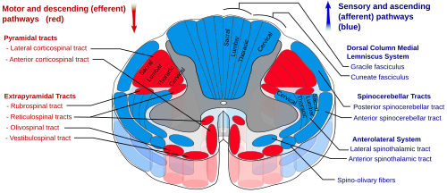
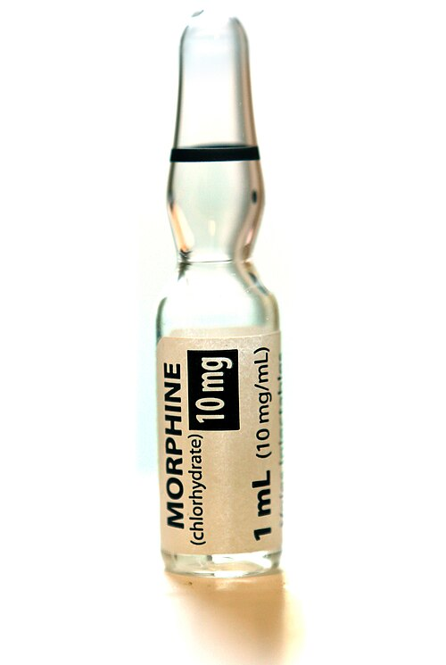

# DOR E CUIDADOS DE SUPORTE

Para entender dor e cuidados de suporte em oncologia, você precisa tirar da cabeça a ideia de que o tratamento paliativo é "o que sobra quando não há mais nada a fazer". Na verdade, o manejo da dor e dos sintomas é o que permite que o paciente oncológico continue o tratamento curativo ou prolongue a vida com dignidade. Nas provas de residência, esse tema não é cobrado de forma abstrata; ele cai através de condutas práticas, doses de opioides e reconhecimento de emergências.

## Avaliação da Dor Oncológica: O Ponto de Partida

A dor no câncer raramente é pura. Ela costuma ser **mista**. O paciente tem uma metástase óssea (dor nociceptiva somática) que comprime uma raiz nervosa (dor neuropática). Se você tratar apenas um componente, o paciente continuará sofrendo.

### Classificação Fisiopatológica

*Figura 1 - Esquema dos tratos da medula espinhal mostrando as vias ascendentes de condução da dor (trato espinotalâmico) e outras vias sensoriais. Fonte: Polarlys e Mikael Häggström, CC BY-SA 3.0 | Wikimedia Commons*

- **Dor Nociceptiva:**

- **Somática:** Bem localizada, descrita como "pontada" ou "latejante". Exemplo: metástase em ossos longos.

- **Visceral:** Mal localizada, profunda, em "cólica" ou "pressão". Exemplo: distensão da cápsula hepática por metástases.

- **Dor Neuropática:**

- Descrita como choque, queimação, formigamento ou parestesia.

- **Dica de prova:** Se a questão descreve uma dor lombar que irradia para o membro inferior com sensação de choque, ela está gritando "radiculopatia compressiva". Aqui, o opioide sozinho vai falhar. Você precisará de adjuvantes.

### A Escala de Karnofsky (KPS) e o ECOG

Antes de prescrever, você precisa saber quem é o seu paciente. As bancas adoram o **Performance Status**. O Dr. Will sempre lembra: "Não tratamos o exame, tratamos o paciente". Se o KPS é baixo, sua agressividade terapêutica muda.

| KPS (%) | Descrição | ECOG |
| --- | --- | --- |
| 100 | Normal, sem queixas | 0 |
| 80-90 | Atividade normal com esforço | 1 |
| 60-70 | Cuida de si, mas não trabalha | 2 |
| 40-50 | Requer assistência médica frequente | 3 |
| 20-30 | Muito doente, hospitalização necessária | 4 |
| 0 | Morto | 5 |

**Pegadinha clássica:** A escala de Karnofsky vai de 0 a 100 (quanto maior, melhor o status), enquanto o ECOG vai de 0 a 5 (quanto menor, melhor). Não inverta isso na hora da prova.

## Escada Analgésica da OMS

*Figura 2 - Frasco de morfina 10mg/mL, opioide forte utilizado no terceiro degrau da escada analgésica da OMS para dor oncológica moderada a intensa. Fonte: DanielTahar, CC BY-SA 4.0 | Wikimedia Commons*
: A Regra de Ouro

A Escada Analgésica da OMS é o protocolo mais cobrado. Mas cuidado: a diretriz moderna permite "pular degraus". Se o paciente chega com dor nota 9/10, você não vai começar com Dipirona. Você pula direto para o Degrau 3.

### Degrau 1: Dor Leve (1-3)

- Analgésicos simples (Dipirona, Paracetamol) e AINEs.

- **Cuidado com AINEs:** Em oncologia, usamos com muita cautela devido ao risco de toxicidade renal e sangramento (pacientes muitas vezes já estão em quimioterapia nefrotóxica ou plaquetopênicos).

### Degrau 2: Dor Moderada (4-6)

- Opioides fracos: **Tramadol** ou Codeína.

- O Tramadol tem um teto terapêutico e pode baixar o limiar convulsivo.

- Associação obrigatória: Analgésico simples + Opioide fraco +/- Adjuvante.

### Degrau 3: Dor Grave (7-10)

- Opioides fortes: **Morfina**, Fentanil, Oxicodona, Metadona.

- **Morfina IV:** É a droga de escolha para dor intensa aguda no pronto-socorro. Deve ser feita em doses regulares (ex: a cada 4 horas) e com doses de resgate (geralmente 1/6 da dose total diária) se houver dor incidental.

### Degrau 4: Dor Refratária

- Procedimentos invasivos (bloqueios de plexo, analgesia peridural).

**Pérola Clínica:** Dor oncológica mista (nociceptiva + neuropática) exige a combinação de um opioide (como o Tramadol) com um adjuvante neuropático (como a **Pregabalina** ou Gabapentina). Isso cai todo ano.

## Manejo de Opioides e Seus Efeitos Colaterais

Muitos alunos erram questões de manejo de opioides por medo da dose. Lembre-se: para dor oncológica, não existe "dose máxima" para opioides puros (como a morfina), a dose certa é a que controla a dor com efeitos colaterais toleráveis.

### Constipação Induzida por Opioides (CIO)

Este é o efeito colateral mais comum e, ao contrário da náusea, o paciente **não desenvolve tolerância**.

- **A regra é clara:** Prescreveu opioide? Prescreva um laxante profilático (ex: Óleo de rícino, Lactulose ou Bisacodil).

- **Diarreia Paradoxal:** Imagine um paciente usando morfina, com dor abdominal e distensão. Ele relata "fezes líquidas em pequena quantidade". O examinador quer saber se você reconhece a **impactação fecal (fecaloma)**. O líquido passa em volta da massa fecal endurecida. Conduta: Toque retal e desimpactação, não antidiarreicos!

### Conversão de Opioides e Metadona

A metadona é excelente para dor neuropática (age no receptor NMDA), mas sua meia-vida é longa e imprevisível. A conversão de outros opioides para metadona não é linear; exige tabelas específicas e cautela extrema. Se a prova perguntar sobre a troca, a resposta correta geralmente envolve "ajuste individualizado e monitoramento rigoroso".

## Metástases Ósseas: O Terror da Dor Lombar

A coluna vertebral é o sítio mais comum de metástases ósseas. Quando um paciente com histórico de câncer (mama, próstata, pulmão) chega com dor lombar, você deve ligar o sinal de alerta.

### Lesões Líticas vs. Blásticas

- **Líticas (Destruição):** Comuns no câncer de mama e pulmão. Aparecem como "buracos" no raio-X. Risco altíssimo de fratura patológica.

- **Blásticas (Escleróticas/Cicatriciais):** Clássicas do **Câncer de Próstata**. Na cintilografia óssea, aparecem como áreas de hipercaptação ("lesão blastomatosa").

### Tratamento da Dor Óssea

- **Radioterapia Paliativa:** É o padrão-ouro para dor localizada por metástase óssea. Reduz a massa tumoral e a inflamação local.

- **Bifosfonatos (Ácido Zoledrônico):** Não são analgésicos primários, mas reduzem "eventos relacionados ao esqueleto" (fraturas, necessidade de rádio) e ajudam no controle da dor a longo prazo.

- **Corticosteroides (Dexametasona):** Reduzem o edema peritumoral. Essenciais se houver suspeita de compressão nervosa.

## Emergência Oncológica: Compressão Medular Metastática (CMM)

Esta é a questão que você não pode errar, pois o diagnóstico tardio significa paraplegia permanente.

**Cenário de Prova:** Paciente com câncer de próstata ou mama, dor dorsal progressiva que piora ao deitar (dor noturna), fraqueza em membros inferiores e alteração de sensibilidade.

- **O que fazer primeiro?** Imobilização da coluna e **Dexametasona** em dose alta (para reduzir o edema e salvar a medula).

- **Exame padrão-ouro:** **Ressonância Magnética (RM) de coluna total**. Não peça apenas da região lombar; o paciente pode ter múltiplos focos de compressão.

- **Tratamento definitivo:** Radioterapia ou Cirurgia de descompressão (dependendo da estabilidade da coluna e prognóstico).

## Hipercalcemia da Malignidade

Ocorre em cerca de 30% dos pacientes com câncer avançado. Pode ser por secreção de PTH-rp (carcinomas epidermoides) ou por lise óssea direta.

### Diagnóstico

O cálcio iônico é preferível, mas se a prova der o cálcio total, você **precisa corrigir pela albumina**:

- Ca_{corrigido} = Ca_{total} + 0,8 × (4 - Albumina)

### Manejo da Hipercalcemia Grave (> 14 mg/dL)

- **Hidratação Venosa Agressiva:** Soro Fisiológico 0,9% (200-500 ml/h). O objetivo é aumentar a filtração glomerular e a excreção de cálcio. É a primeira medida.

- **Bifosfonatos IV:** Ácido Zoledrônico é o mais potente. Demora 48-72h para agir, por isso a hidratação vem antes.

- **Calcitonina:** Age rápido, mas tem efeito curto (taquifilaxia).

- **Evitar:** Diuréticos de alça (Furosemida) só devem ser usados **após** a volemia estar restaurada, se houver risco de sobrecarga hídrica. Nunca use diuréticos tiazídicos (eles aumentam a reabsorção de cálcio).

## Fadiga Relacionada ao Câncer (FRC)

A FRC é o sintoma mais prevalente e o que mais impacta a qualidade de vida. Diferente da fadiga comum, ela não melhora com o repouso.

**Tratamento de Primeira Linha:**
Muitos alunos marcam "estimulantes" ou "vitaminas". Errado! Segundo as diretrizes da SBOC e ASCO, o tratamento padrão-ouro é **Não Farmacológico**:

- **Atividade Física:** Exercícios aeróbicos moderados (150 min/semana) e resistência. É a intervenção com maior nível de evidência.

- **Terapia Cognitivo-Comportamental (TCC):** Ajuda no manejo do sono e do estresse.

O tratamento farmacológico (como o Metilfenidato) só é considerado em casos selecionados de fadiga grave em pacientes em cuidados de fim de vida, após excluir outras causas (anemia, hipotireoidismo, depressão).

## Uso de Corticosteroides na Oncologia

A Dexametasona é a "queridinha" da oncologia, mas é uma faca de dois gumes.

- **Indicações:** Antiemético (em quimioterapia), redução de edema (metástase cerebral, compressão medular), alívio de dor óssea e melhora do apetite (curto prazo).

- **Efeitos Adversos (O que cai na prova):**

- **Gastrite/Úlcera:** Sempre considere proteção gástrica se uso prolongado.

- **Confusão Mental/Psicose:** Especialmente em idosos.

- **Hiperglicemia:** Descompensa diabéticos.

- **Candidíase oral.**

## Comparativo de Condutas em Emergências

| Emergência | Suspeita Clínica | Conduta Imediata | Exame de Escolha |
| --- | --- | --- | --- |
| **Compressão Medular** | Dor dorsal + Déficit motor | Dexametasona + Imobilização | RM de Coluna Total |
| **Hipercalcemia** | Confusão + Constipação + Poliúria | Hidratação com SF 0,9% | Cálcio Corrigido |
| **Hipertensão Intracraniana** | Cefaleia matinal + Vômitos em jato | Dexametasona | TC ou RM de Crânio |
| **Impactação Fecal** | Uso de opioide + Diarreia paradoxal | Toque Retal | Raio-X de abdome (se dúvida) |

## Neuropatia Induzida por Quimioterapia (NIQ)

Alguns quimioterápicos (Platinas, Taxanos, Alcaloides da Vinca) causam lesão direta aos nervos periféricos. O paciente queixa-se de parestesia em "luva e bota".

- **Tratamento:** A **Duloxetina** é o único fármaco com evidência robusta para o tratamento da dor na NIQ. Gabapentina e Pregabalina são usadas, mas a Duloxetina costuma ser a resposta correta em provas específicas de oncologia.

## Performance Status e Prognóstico

O MedEvo enfatiza: o prognóstico dita a intensidade do suporte. Um paciente com ECOG 4 (restrito ao leito) e câncer em progressão não se beneficia de medidas invasivas.

- **Avaliação Funcional:** É o melhor preditor de sobrevida em oncologia, superando muitas vezes o estadiamento TNM isolado.

- **Sinais de Alerta para Dor Lombar em Idosos:** Se a dor é noturna, não melhora com repouso e há perda ponderal, a chance de ser metástase é altíssima. O diagnóstico diferencial com dor mecânica (artrose) é fundamental.

## Pontos-Chave para Prova

- **Cálculo do Cálcio Corrigido:** Ca_{total} + 0,8 × (4 - Albumina). Use sempre que a albumina for < 4,0 g/dL.

- **Hipercalcemia Grave (> 14 mg/dL):** Primeira conduta é Hidratação Venosa com SF 0,9% (2-4 litros/dia).

- **Compressão Medular:** Tríade de dor dorsal, fraqueza e alteração esfincteriana. Conduta: Corticoide + RM urgente.

- **Escada da OMS:** Não é obrigatório passar pelo degrau 1 se a dor for intensa (nota 7-10). Vá direto para o degrau 3 (Morfina).

- **Dose de Resgate de Opioide:** Geralmente 10% a 15% (ou 1/6) da dose total diária.

- **Constipação por Opioide:** Não melhora com o tempo. Exige laxantes estimulantes profiláticos.

- **Diarreia Paradoxal:** É sinal de fecaloma (impactação fecal). O tratamento é desimpactação, não loperamida.

- **Fadiga Oncológica:** O tratamento padrão-ouro é Atividade Física e TCC.

- **Metástase Óssea de Próstata:** Tipicamente blástica (esclerótica) e brilha na cintilografia.

- **Metástase Óssea de Mama/Pulmão:** Tipicamente lítica (destrutiva) e aumenta risco de fratura.

- **Radioterapia Paliativa:** Melhor intervenção para dor óssea localizada e refratária.

- **Dor Neuropática:** Primeira linha são os gabapentinoides (Gabapentina/Pregabalina) ou antidepressivos tricíclicos/duais.

- **Contraindicação Absoluta de AINEs:** Insuficiência renal grave, sangramento ativo ou plaquetopenia severa (< 50.000).

- **Pegadinha de Prova:** A alternativa dirá para usar Furosemida na hipercalcemia logo de cara. Errado! Primeiro hidrata, depois (se necessário) faz o diurético.

- **Karnofsky 100:** Paciente normal. **Karnofsky 0:** Morto. Memorize os extremos e o KPS 70 (limite para cuidar de si). 🧠

 Cópia offline para consulta pessoal.
 Fonte original:
 [https://www.medevo.com.br/material-apoio/ler/b197faea-ea9a-47e7-be85-e9abab64e9e1](https://www.medevo.com.br/material-apoio/ler/b197faea-ea9a-47e7-be85-e9abab64e9e1)
