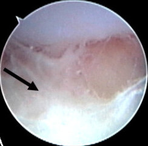
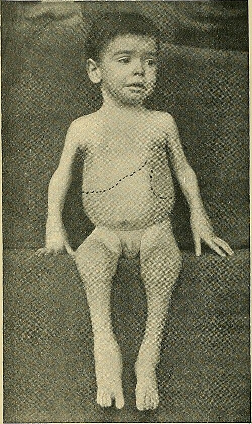

# DOR MUSCULOESQUELÉTICA NA CRIANÇA

Quando um pai ou mãe entra no seu consultório dizendo que o filho está com "dor nas pernas", o seu cérebro de médico precisa funcionar como um filtro de alta precisão. Na pediatria, a dor musculoesquelética é um dos motivos de consulta mais frequentes, mas o desafio é separar o joio do trigo. De um lado, temos condições benignas que resolvemos com orientação e carinho, como a dor do crescimento. Do outro, temos emergências que podem custar a vida ou a função de um membro, como a leucemia ou a artrite séptica.

Aqui no MedEvo, sempre batemos na tecla de que o diagnóstico em reumatologia pediátrica é 90% anamnese e exame físico. Se você pedir exames para toda criança com dor, vai acabar tratando exames e não pacientes, ou pior, vai atrasar diagnósticos críticos. Vamos entender como diferenciar esses quadros de forma lógica.

## A Lógica da Avaliação Inicial: Inflamatório vs. Mecânico

O primeiro passo é definir se a dor é inflamatória ou não inflamatória (mecânica). Isso muda completamente o seu raciocínio clínico.

A dor inflamatória é aquela que piora com o repouso e melhora com o movimento. A criança acorda "travada" (rigidez matinal) e vai melhorando ao longo do dia conforme brinca. Já a dor mecânica é o oposto: dói quando a criança corre, pula ou joga bola, e melhora quando ela descansa.

Por que isso importa? Porque processos inflamatórios sugerem doenças autoimunes (como a Artrite Idiopática Juvenil) ou infecções. Processos mecânicos sugerem problemas estruturais, ortopédicos ou as famosas dores de crescimento.

### O Exame Físico: O Pulo do Gato

Muitos alunos erram questões de prova por não saberem o que procurar no exame físico. Na criança, a artrite nem sempre é óbvia. Elas raramente reclamam de "dor na articulação", elas simplesmente param de usar o membro ou começam a mancar (claudicação).

Ao examinar, procure por:

- Aumento de volume (derrame articular).

- Calor local.

- Limitação da amplitude de movimento (o sinal mais sensível de artrite).

- Eritema (cuidado: o eritema é comum na artrite séptica e na gota, mas é RARO na Artrite Idiopática Juvenil).

Se você encontrar uma articulação edemaciada, quente e com movimento limitado, você tem uma artrite. Se a criança reclama de dor, mas você mexe a articulação em todos os eixos e não há edema, você tem uma artralgia. Essa distinção é cobrada exaustivamente em provas de residência.

## Dores Benignas: A Dor do Crescimento

Este é um termo que gera muita confusão. O nome "dor do crescimento" é tecnicamente impreciso, pois o crescimento em si não dói. No entanto, é o termo consagrado pela SBP e pelas bancas.

A dor do crescimento atinge cerca de 10 a 30% das crianças, geralmente entre 3 e 12 anos. O quadro clássico que você vai encontrar na prova é: criança que teve um dia ativo, vai dormir bem, mas acorda no meio da noite chorando com dor em ambos os membros inferiores (geralmente coxas, panturrilhas ou atrás dos joelhos).

### Por que é benigna?

A fisiopatologia exata é desconhecida, mas acredita-se que esteja ligada ao cansaço muscular e ao baixo limiar de dor. O ponto crucial para o seu diagnóstico é que a dor é sempre bilateral e o exame físico é absolutamente normal.

**Dica de Prova:** Se a questão descrever uma dor unilateral, persistente durante o dia, ou se a criança tiver claudicação (mancar) pela manhã, ESQUEÇA a dor do crescimento. Procure por outra patologia. A dor do crescimento melhora com massagem e calor local, e a criança acorda no dia seguinte sem sintoma nenhum, pronta para correr.

| Característica | Dor do Crescimento | Dor Orgânica (Alerta) |
| --- | --- | --- |
| Localização | Bilateral (coxas, panturrilhas) | Frequentemente unilateral |
| Horário | Noturna / Fim do dia | Qualquer horário, inclusive matinal |
| Exame Físico | Normal | Edema, calor, limitação de movimento |
| Impacto | Não interfere nas atividades diárias | Criança manca ou evita brincar |
| Resposta | Melhora com massagem e carinho | Necessita de analgesia potente ou não melhora |

## O Diagnóstico que Não Pode Passar: Malignidade

Como professor, este é o ponto onde eu mais vejo alunos e residentes falharem. A Leucemia Linfoide Aguda (LLA) é o câncer mais comum na infância e, em 20 a 30% dos casos, ela se manifesta inicialmente com dores musculoesqueléticas.

Imagine o cenário: uma criança de 4 anos com dor óssea intensa, que a acorda à noite, associada a uma palidez discreta. Você pede um hemograma e vê uma anemia leve e plaquetas no limite inferior. O que muitos fazem? Prescrevem um corticoide (como a prednisolona) achando que é uma doença reumatológica.

**ERRO FATAL:** O corticoide é linfolítico. Ele vai "limpar" temporariamente as células neoplásicas da periferia, dando uma falsa sensação de melhora clínica, mas vai dificultar o diagnóstico definitivo pelo mielograma e, pior, pode induzir resistência quimioterápica. Segundo as diretrizes de oncologia pediátrica, NUNCA use corticoide em uma criança com dor articular sem antes excluir malignidade.

### Sinais de Alerta para Leucemia

- Dor óssea metafisária (dor no osso mesmo, não só na junta).

- Dor que não responde bem a analgésicos comuns.

- Presença de citopenias (anemia, plaquetopenia, leucopenia) ou linfocitose relativa.

- Febre prolongada, hepatomegalia, esplenomegalia ou adenomegalia.

- DHL (Desidrogenase Láctica) elevada.

Se você suspeitar de malignidade, o exame padrão-ouro é o aspirado de medula óssea (mielograma). Lembre-se da pérola clínica: dor óssea noturna persistente + palidez + citopenias = Investigar Leucemia IMEDIATAMENTE.

## Febre Reumática: O Clássico das Provas

A Febre Reumática (FR) continua sendo uma causa importante de dor articular no Brasil devido às condições socioeconômicas. Ela é uma resposta autoimune tardia a uma faringoamigdalite pelo Estreptococo do grupo A (Streptococcus pyogenes).

O Dr. Will sempre lembra: para diagnosticar FR, você precisa dos Critérios de Jones revisados (2015). Para populações de médio/alto risco (como a brasileira), os critérios são mais sensíveis.

### Critérios Maiores

- **Artrite:** Na FR clássica, ela é uma poliartrite migratória de grandes articulações (joelho, tornozelo, cotovelo). Mas atenção: na revisão de 2015, em populações de risco, a **monoartrite** ou a **poliartralgia** também podem ser consideradas critérios maiores.

- **Cardite:** Pode ser subclínica (detectada apenas no ECO). É a única manifestação que deixa sequelas graves (valvulopatia).

- **Coreia de Sydenham:** Movimentos involuntários, labilidade emocional. Pode ocorrer meses após a infecção.

- **Eritema Marginado:** Manchas avermelhadas com bordas nítidas e centro claro, raras mas patognomônicas.

- **Nódulos Subcutâneos:** Firmes e indolores, também raros.

### Critérios Menores

- Febre (≥ 38°C).

- Artralgia (se a artrite não foi usada como critério maior).

- VHS elevado (≥ 30 mm/h) ou PCR elevada (≥ 3 mg/dL).

- Intervalo PR prolongado no ECG.

Para o diagnóstico, você precisa de: 2 critérios maiores OU 1 maior + 2 menores, SEMPRE acompanhados de evidência de infecção estreptocócica prévia (ASLO elevada ou cultura de orofaringe positiva).

**Tratamento e Profilaxia:**
O tratamento da artrite na FR é feito com AAS (ácido acetilsalicílico) em doses anti-inflamatórias (80-100 mg/kg/dia). Mas o mais importante para a prova é a **Profilaxia Secundária**. Uma vez diagnosticada a FR, a criança deve receber Penicilina Benzatina a cada 21 dias para evitar novos surtos que destruiriam o coração.

## Emergências: Artrite Séptica vs. Sinovite Transitória

Este é o diferencial mais comum no pronto-socorro quando a queixa é dor no quadril.

### Artrite Séptica

*Figura 1 - Artrite séptica do tornozelo em lactente de 3 meses mostrando edema e eritema articular. Fonte: Hagino T, Wako M, Ochiai S, CC BY 2.5 | Wikimedia Commons*

É uma emergência ortopédica. Ocorre invasão bacteriana do espaço articular, geralmente por via hematogênica. O agente mais comum em qualquer idade é o *Staphylococcus aureus*.

- **Quadro:** Febre alta, toxemia, dor intensa que impede qualquer movimento da articulação, recusa em deambular.

- **Diagnóstico:** Leucocitose importante, VHS e PCR muito elevados. O ultrassom mostra derrame articular. A confirmação é feita pela punção articular (artrocentese) com análise do líquido (aspecto purulento, > 50.000 leucócitos com predomínio de polimorfonucleares).

- **Conduta:** Internação, drenagem cirúrgica (lavagem articular) e antibioticoterapia venosa.

### Sinovite Transitória do Quadril

É a causa mais comum de dor no quadril em crianças de 3 a 8 anos. É um processo inflamatório benigno e autolimitado que frequentemente ocorre 1 a 2 semanas após uma infecção viral de vias aéreas superiores.

- **Quadro:** A criança acorda mancando, mas o estado geral é bom. Pode haver uma febre baixa ou ausente.

- **Diagnóstico:** Exames laboratoriais (hemograma, VHS) costumam estar normais ou levemente alterados. O USG pode mostrar um pequeno líquido articular.

- **Conduta:** Repouso e anti-inflamatórios (AINEs) por 5 a 7 dias. O prognóstico é excelente.

**Dica de Ouro (Critérios de Kocher):** Para diferenciar as duas no quadril, usamos os critérios de Kocher. Se o paciente tiver 3 ou 4 dos seguintes, a chance de Artrite Séptica é > 90%:

- Febre > 38,5°C.

- Incapacidade de suportar peso no membro.

- VHS > 40 mm/h.

- Leucócitos > 12.000/mm³.

## Patologias do Quadril por Faixa Etária

As bancas adoram testar se você sabe qual doença é mais provável dependendo da idade da criança.

### 1. Doença de Legg-Calvé-Perthes (2 a 12 anos)

Trata-se de uma necrose avascular idiopática da cabeça do fêmur.

- **Perfil:** Meninos, 4 a 8 anos.

- **Clínica:** Claudicação insidiosa (manca há semanas), dor leve na virilha ou no joelho. A dor piora com a atividade.

- **Raio-X:** No início pode ser normal, mas depois mostra achatamento e fragmentação da cabeça femoral.

### 2. Epifisiólise da Cabeça Femoral (Adolescentes)

É o deslizamento da epífise femoral sobre a metáfise.

- **Perfil:** Adolescente obeso, em estirão de crescimento (10 a 14 anos).

- **Clínica:** Dor no quadril que muitas vezes é referida no joelho (cuidado com essa pegadinha!). O paciente mantém o membro em rotação externa.

- **Conduta:** É uma urgência ortopédica cirúrgica (fixação in situ) para evitar a necrose total da cabeça do fêmur.

| Doença | Faixa Etária Típica | Características Principais | Conduta Inicial |
| --- | --- | --- | --- |
| Sinovite Transitória | 3 - 8 anos | Pós-viral, benigna, bom estado geral | Repouso + AINE |
| Artrite Séptica | Qualquer idade | Febre alta, dor intensa, toxemia | Drenagem + ATB venoso |
| Legg-Calvé-Perthes | 4 - 9 anos | Claudicação crônica, necrose avascular | Encaminhar Ortopedia |
| Epifisiólise | 10 - 15 anos | Adolescente obeso, dor no joelho/quadril | Cirurgia (Fixação) |

## Artrite Idiopática Juvenil (AIJ)

*Figura 2 - Ilustração histórica (1900) de artrite crônica juvenil com aumento glandular descrita por G. F. Still, mostrando hepatoesplenomegalia e artrite em criança de 3 anos. Fonte: Internet Archive Book Images, domínio público | Wikimedia Commons*

A AIJ não é uma doença única, mas um grupo de doenças que causam artrite crônica (duração > 6 semanas) em menores de 16 anos, sem outra causa identificável.

O subtipo mais comum é a **AIJ Oligoarticular** (acomete até 4 articulações). O perfil clássico é uma menina de 2 a 4 anos com aumento de volume no joelho, sem muita dor, que manca ao acordar.

- **Risco Ocular:** Esses pacientes têm alto risco de uveíte anterior crônica assintomática. Por isso, todo paciente com AIJ precisa de exames periódicos com lâmpada de fenda pelo oftalmologista. Se o FAN (Fator Antinuclear) for positivo, o risco de uveíte é ainda maior.

Já a **AIJ Sistêmica** (antiga Doença de Still) é a que mais cai em provas de pediatria geral. Ela se caracteriza por:

- Febre alta diária (em picos) por pelo menos 2 semanas.

- Rash cutâneo cor-de-rosa (salmão), evanescente (aparece com a febre e some depois).

- Artrite.

- Hepatoesplenomegalia e linfonodomegalia.

- Laboratório com muita inflamação (leucocitose, trombocitose, VHS e Ferritina muito altos).

## Exames Complementares: Quando e o Quê Pedir?

Não seja o médico que pede "reumatograma". Esse termo não existe na medicina moderna. Peça exames baseados na sua suspeita clínica.

- **Hemograma:** Fundamental para ver citopenias (malignidade) ou leucocitose com desvio (infecção).

- **VHS e PCR:** Marcadores de atividade inflamatória. VHS alto com hemograma normal pode sugerir Febre Reumática ou AIJ. VHS muito alto (> 100) deve sempre acender o alerta para malignidade ou infecção grave.

- **ASLO:** Serve apenas para documentar infecção estreptocócica prévia. Não serve para acompanhar atividade da Febre Reumática.

- **Fator Reumatoide (FR):** Na criança, ele é NEGATIVO na maioria dos casos. Só é positivo em uma minoria de adolescentes com AIJ poliarticular. Não use para triagem.

- **FAN:** Útil na AIJ para estratificar o risco de uveíte, mas pode ser positivo em crianças saudáveis após infecções virais.

- **Líquido Sinovial:** Essencial se houver suspeita de Artrite Séptica.

## Tratamento Farmacológico: Doses e Cuidados

Para a maioria das dores inflamatórias agudas e sinovites, os AINEs são a primeira escolha.

- **Ibuprofeno:** 30 a 40 mg/kg/dia, divididos em 3 ou 4 doses. É muito utilizado pela segurança e eficácia.

- **Naproxeno:** 10 a 20 mg/kg/dia, dividido em 2 doses. Excelente para AIJ pela comodidade posológica.

- **Penicilina Benzatina (Profilaxia FR):** 600.000 UI (se < 27 kg) ou 1.200.000 UI (se > 27 kg), via intramuscular, a cada 21 dias.

**Atenção ao AAS:** Na Febre Reumática, usamos doses altas (80-100 mg/kg/dia). Monitore a toxicidade hepática e o risco de Síndrome de Reye se a criança contrair Influenza ou Varicela durante o uso.

## Pontos-Chave para Prova

- **Dor do Crescimento:** Sempre bilateral, noturna, exame físico normal, melhora com massagem. Nunca causa claudicação matinal.

- **Artrite Séptica:** Emergência! Agente principal é o *Staphylococcus aureus*. Exige drenagem e antibiótico venoso.

- **Sinovite Transitória:** Causa mais comum de dor no quadril (3-8 anos), pós-viral, autolimitada, exames laboratoriais normais.

- **Leucemia (LLA):** Dor óssea intensa + citopenias + DHL alto. **CONTRAINDICAÇÃO ABSOLUTA:** Corticoide antes de excluir malignidade com mielograma.

- **Febre Reumática:** Poliartrite migratória de grandes articulações. Diagnóstico pelos Critérios de Jones + evidência de estreptococcia (ASLO ou cultura).

- **Profilaxia FR:** Penicilina Benzatina a cada 21 dias é o padrão-ouro para evitar sequela valvar.

- **Epifisiólise:** Adolescente obeso com dor no joelho ou quadril. O tratamento é cirúrgico imediato (fixação).

- **Doença de Perthes:** Menino escolar com claudicação indolor ou leve que dura semanas. Necrose da cabeça do fêmur.

- **AIJ Oligoarticular:** Meninas pequenas, risco de uveíte anterior assintomática. Exame de lâmpada de fenda é obrigatório.

- **AIJ Sistêmica:** Febre diária em picos + rash salmão + artrite + ferritina muito alta.

- **Sinal de Alerta:** Dor musculoesquelética que acorda a criança à noite e é unilateral deve SEMPRE ser investigada para malignidade ou infecção.

- **Exame Físico:** A limitação da amplitude de movimento é o sinal mais precoce e sensível de uma artrite verdadeira.

- **Critérios de Kocher:** Usados para diferenciar Artrite Séptica de Sinovite Transitória no quadril (Febre, incapacidade de deambular, VHS e Leucograma).

- **Pérola de Prova:** A alternativa que diz que "toda dor de crescimento precisa de Raio-X" está ERRADA. O diagnóstico é clínico.

- **Diferencial de Quadril:** Se a criança tem < 3 anos, pense em Artrite Séptica. Se tem 3-8 anos, Sinovite Transitória ou Perthes. Se é adolescente, Epifisiólise. 🩺

 Cópia offline para consulta pessoal.
 Fonte original:
 [https://www.medevo.com.br/material-apoio/ler/af25f044-8e8d-4023-8942-30165b8a63a0](https://www.medevo.com.br/material-apoio/ler/af25f044-8e8d-4023-8942-30165b8a63a0)
