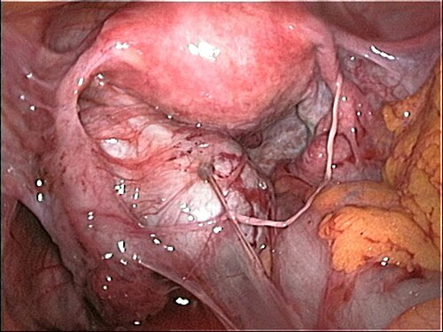

# DOR PÉLVICA CRÔNICA: ABORDAGEM SINDRÔMICA

A Dor Pélvica Crônica (DPC) não é apenas um sintoma, mas uma condição clínica complexa que desafia até os ginecologistas mais experientes. Se você encarar a DPC apenas como "uma dor que demora a passar", vai errar questões de prova e, pior, vai frustrar suas pacientes no consultório. Para a residência, o segredo é entender que estamos diante de uma **abordagem sindrômica**. Isso significa que a dor pode vir do útero, mas também pode vir do intestino, da bexiga, dos nervos ou da mente.

## Definição e Critérios Diagnósticos

Para as bancas de prova, a definição clássica segue o critério temporal: dor localizada na pelve, na parede abdominal anterior (abaixo do umbigo), na região lombar ou nas nádegas, com duração mínima de **6 meses**.

Segundo a FEBRASGO e a ACOG, essa dor deve ser suficientemente intensa para causar incapacidade funcional ou levar a paciente a buscar atendimento médico. Um ponto importante que gera confusão: a dor não precisa ser necessariamente acíclica. Embora a definição tradicional focasse em dor não relacionada ao ciclo menstrual, as diretrizes atuais reconhecem que a dismenorreia severa e a dispareunia de profundidade, quando persistentes por mais de 6 meses e com impacto na qualidade de vida, fazem parte do espectro da DPC.

## Epidemiologia e Impacto

A DPC é extremamente prevalente, afetando entre 15% e 26% das mulheres em idade reprodutiva. Para você ter uma ideia da magnitude, ela é responsável por:

- 10% de todas as consultas ginecológicas.

- 40% das laparoscopias ginecológicas realizadas no Brasil.

- 12% das histerectomias.

O perfil típico em provas é a mulher jovem, em idade fértil, muitas vezes com histórico de múltiplas consultas sem diagnóstico definitivo. Lembre-se: cerca de 60% dessas mulheres nunca recebem um diagnóstico etiológico específico na primeira avaliação.

## Fisiopatologia: Por que a dor se torna crônica?

*Figura 1 - Visão laparoscópica de endometriose com aderências pélvicas extensas, uma das principais causas de dor pélvica crônica. Fonte: domínio público | Wikimedia Commons*

Aqui está o "pulo do gato" que eu sempre explico aos meus alunos: a dor crônica é diferente da dor aguda. Na dor aguda (como uma apendicite), a dor é um sinal de alerta de lesão tecidual. Na DPC, o sistema nervoso sofre um processo de **sensibilização central**.

Imagine que os nervos da pelve são como um alarme de carro. No início, o alarme só toca se alguém tentar arrombar a porta (estímulo nociceptivo real). Com o tempo e a inflamação persistente, o alarme fica tão sensível que o simples vento passando faz ele disparar. Isso explica por que muitas pacientes sentem dor intensa mesmo quando a laparoscopia está "limpa".

As fibras aferentes viscerais (que levam a dor dos órgãos) e somáticas (que levam a dor da pele e músculos) convergem para os mesmos neurônios na medula espinhal. É por isso que uma inflamação no útero (visceral) pode fazer a paciente sentir dor na parede abdominal (somática). Esse fenômeno é chamado de **convergência viscero-somática**.

## Abordagem Sindrômica: O Mapa do Diagnóstico Diferencial

Não tente adivinhar a causa. Use a abordagem por sistemas. Em provas, a banca vai te dar pistas para cada um desses sistemas.

### 1. Causas Ginecológicas

- **Endometriose:** A campeã das provas. Suspeite quando houver a tríade: dismenorreia progressiva, dispareunia de profundidade e dor pélvica acíclica. No exame físico, procure por nódulos em fundo de saco vaginal ou ligamentos uterossacros dolorosos.

- **Adenomiose:** Útero aumentado de volume, amolecido e doloroso (útero "globoso"). Comum em multíparas acima dos 35 anos.

- **Doença Inflamatória Pélvica (DIP) Crônica:** Geralmente é uma sequela. A dor vem das aderências pélvicas ou da inflamação residual. Cuidado: se a paciente tem dor à mobilização do colo, corrimento cervical e febre, o quadro é AGUDO. A DPC é o que sobra depois que a infecção passa.

- **Síndrome da Congestão Pélvica:** Varizes pélvicas. A dor piora após longos períodos em pé (ortostatismo) e após o coito.

- **Síndrome de Allen-Masters:** Menos comum em provas, mas pode aparecer. É a dor causada por laceração dos ligamentos largos ou uterossacros, geralmente após traumas de parto.

### 2. Causas Gastrointestinais

- **Síndrome do Intestino Irritável (SII):** Presente em até 35% das mulheres com DPC. A dor melhora após a evacuação e está associada a alterações no hábito intestinal (diarreia ou constipação).

- **Constipação Funcional:** O acúmulo de fezes e gases distende as alças e gera dor visceral crônica.

### 3. Causas Urológicas

- **Cistite Intersticial (Síndrome da Bexiga Dolorosa):** A paciente tem dor que piora com o enchimento vesical e melhora imediatamente após urinar. Frequentemente associada a polaciúria e noctúria.

- **Divertículo Uretral:** Causa dor pélvica e dispareunia, mas a pista é a presença de uma massa palpável na parede vaginal anterior que, ao ser espremida, pode drenar pus ou urina pelo meato uretral.

### 4. Causas Musculoesqueléticas e Neurológicas

- **Síndrome Miofascial (Pontos de Gatilho):** Pontos de contração muscular dolorosos na parede abdominal ou assoalho pélvico.

- **Neuralgia do Pudendo (Canal de Alcock):** Dor que piora ao sentar e melhora ao ficar em pé ou sentar no vaso sanitário (onde não há pressão direta no nervo).

- **Dor Pós-Cesárea:** Pode ocorrer por aprisionamento de nervos (ilio-hipogástrico ou ilioinguinal) na cicatriz cirúrgica.

| Sistema | Principal Patologia | Pista Clínica de Prova |
| --- | --- | --- |
| Ginecológico | Endometriose | Dispareunia de profundidade + Nódulos retrovaginais |
| Gastrointestinal | SII | Dor que melhora ao evacuar + Distensão abdominal |
| Urológico | Cistite Intersticial | Dor que melhora ao urinar + Polaciúria |
| Musculoesquelético | Ponto de Gatilho | Dor localizada que reproduz o sintoma ao apertar |
| Neurológico | Neuralgia do Pudendo | Dor que piora ao sentar (Canal de Alcock) |

## O Exame Físico Detalhado

Como professor, eu vejo muitos alunos indo direto para o toque bimanual. Erro grave! O exame físico da DPC deve ser sistemático:

- **Inspeção Estática e Dinâmica:** Avalie a postura. A hiperlordose lombar pode sobrecarregar a musculatura pélvica.

- **Palpação da Parede Abdominal:** Procure por cicatrizes de cesárea ou laparoscopia. Use a **Manobra de Carnett**: peça para a paciente elevar as pernas ou o tronco enquanto você pressiona o ponto doloroso. Se a dor aumentar, a origem é na parede abdominal (somática). Se a dor diminuir ou sumir, a origem é visceral (dentro da pelve).

- **Exame Especular:** Avalie o conteúdo vaginal e o colo uterino.

- **Toque Vaginal Unimanual e Bimanual:** Avalie a mobilidade uterina. Útero fixo sugere endometriose ou aderências. Toque os músculos elevadores do ânus lateralmente para procurar pontos de gatilho miofasciais.

- **Toque Retal:** Essencial para avaliar o septo retovaginal e os ligamentos uterossacros. É aqui que você diagnostica a endometriose profunda que o USG comum deixou passar.

## Diagnóstico Complementar

*Figura 2 - Ilustração de laparoscopia diagnóstica, método padrão-ouro para investigação de dor pélvica crônica e confirmação de endometriose. Fonte: BruceBlaus/Blausen Medical, CC BY 3.0 | Wikimedia Commons*

Não peça exames "por pedir". No MedEvo, sempre batemos na tecla da racionalidade.

- **Ultrassonografia Transvaginal (USGTV):** É o exame inicial. Ótimo para ver miomas, adenomiose e cistos ovarianos. Para endometriose, o ideal é o **USGTV com preparo intestinal**, feito por radiologista especializado.

- **Ressonância Magnética (RM):** Excelente para mapeamento de endometriose profunda e para diferenciar miomas de adenomiose.

- **Laparoscopia:** Já foi considerada o "padrão-ouro" absoluto. Hoje, sua indicação principal é quando há suspeita de patologia tratável cirurgicamente (como endometriose) ou quando o tratamento clínico falhou e a dúvida diagnóstica persiste. Cuidado: 60-80% das laparoscopias em mulheres com DPC podem não revelar nenhuma patologia macroscópica.

- **Cistoscopia e Colonoscopia:** Indicadas apenas se houver sintomas específicos (hematúria, sangramento retal, alteração importante do hábito intestinal).

## Tratamento: A Abordagem Multimodal

Esqueça a ideia de uma "pílula mágica". O tratamento da DPC deve ser como uma orquestra. Segundo a Diretriz Brasileira de Dor Pélvica Crônica (FEBRASGO, 2021), a conduta deve ser individualizada.

### 1. Tratamento Não-Farmacológico

- **Educação da Paciente:** Explicar o mecanismo da dor (sensibilização central) reduz a ansiedade.

- **Fisioterapia Pélvica:** Fundamental para tratar disfunções do assoalho pélvico e pontos de gatilho.

- **Terapia Cognitivo-Comportamental (TCC):** Essencial, pois a DPC está intimamente ligada a quadros de depressão, ansiedade e histórico de abuso sexual/trauma.

- **Atividade Física:** Exercícios aeróbicos (pelo menos 150 minutos por semana) ajudam na liberação de endorfinas.

### 2. Tratamento Farmacológico

Aqui as bancas cobram doses e classes.

- **Analgésicos e AINEs:** Úteis para crises agudas ou dismenorreia, mas têm eficácia limitada na dor neuropática crônica.

- **Antidepressivos Tricíclicos:** A **Amitriptilina** é a droga de escolha para modular a dor crônica.

- Dose: Iniciar com 10 a 25 mg à noite (para aproveitar o efeito sedativo). Pode-se aumentar gradualmente até 75-150 mg/dia.

- Por que usamos? Ela aumenta a oferta de serotonina e noradrenalina nas vias descendentes inibitórias da dor.

- **Anticonvulsivantes:** A **Gabapentina** é excelente para dor com componente neuropático.

- Dose: Iniciar com 300 mg à noite, podendo chegar a 1.800-2.400 mg/dia em doses divididas.

- **Tratamento Hormonal:** Se houver suspeita de causa ginecológica dependente de estrogênio (endometriose/adenomiose).

- Opções: Anticoncepcionais combinados (preferencialmente de uso contínuo), progestágenos isolados (Desogestrel 75 mcg, Acetato de Medroxiprogesterona), ou o SIU-Levonorgestrel.

- O bloqueio da menstruação é o objetivo principal aqui.

### 3. Tratamento Cirúrgico

A cirurgia deve ser bem indicada. A lise de aderências, por exemplo, é controversa e muitas vezes a dor volta após alguns meses. A histerectomia pode ser considerada em casos de adenomiose ou miomatose sintomática refratária, mas a paciente deve ser alertada de que, se houver sensibilização central, a dor pode persistir mesmo sem o útero.

## Situações Especiais e Pegadinhas de Prova

- **Ponto de Gatilho Pós-Cesárea:** Se a paciente tem uma dor localizada na cicatriz que piora ao esforço, o diagnóstico é clínico. O tratamento pode ser feito com **bloqueio anestésico local** (Lidocaína 1-2%) no ponto de gatilho. Isso serve tanto para diagnóstico quanto para tratamento.

- **DIP e DIU:** Se uma paciente com DIU de cobre desenvolve DIP, a recomendação da OMS e do Ministério da Saúde é **não retirar o DIU** inicialmente. Inicie o tratamento antibiótico e reavalie em 48-72 horas. Só retire se não houver melhora clínica.

- **Fissura Anal:** Se a questão descreve dor ao evacuar e sangue no papel, pense em fissura anal. A localização mais comum é a linha média posterior (6 horas). O tratamento inicial é conservador: dieta rica em fibras, banhos de assento e pomadas de dinitrato de isossorbida ou bloqueadores de canais de cálcio para relaxar o esfíncter.

- **Rotura de Cisto Folicular:** Dor súbita no meio do ciclo (dor da ovulação ou *Mittelschmerz*). É uma causa de dor aguda, não crônica, mas aparece como diagnóstico diferencial.

## Diagnóstico Diferencial de Dor em Fossa Ilíaca Direita (FID)

Este é um clássico das emergências que cai em provas de DPC para testar se você sabe diferenciar o crônico do agudo.

| Patologia | Características |
| --- | --- |
| Apendicite Aguda | Dor periumbilical que migra para FID, febre, sinal de Blumberg positivo. |
| Gravidez Ectópica | Atraso menstrual, dor aguda, sangramento vaginal, beta-hCG positivo. |
| Torção Ovariana | Dor súbita, intensa, associada a náuseas e vômitos. Frequentemente há uma massa anexial prévia. |
| Cisto Roto | Dor súbita após relação sexual ou esforço físico. Se for cisto folicular, ocorre no meio do ciclo. |

## Pontos-Chave para Prova

- **Definição de DPC:** Dor pélvica por pelo menos 6 meses que interfere na rotina.

- **Fisiopatologia:** Sensibilização central é o mecanismo de perpetuação da dor (o "alarme desregulado").

- **Manobra de Carnett:** Positiva (dor aumenta) = dor da parede abdominal (somática); Negativa = dor visceral.

- **Endometriose:** Principal causa ginecológica. Diagnóstico definitivo é visual (laparoscopia), mas o tratamento pode ser empírico com progestágenos.

- **Cistite Intersticial:** Dor que melhora ao esvaziar a bexiga.

- **SII:** Dor que melhora ao evacuar.

- **Tratamento de Escolha para Dor Neuropática:** Amitriptilina (10-25mg inicial) ou Gabapentina (300mg inicial).

- **Fatores Psicossociais:** Sempre investigar histórico de depressão ou abuso sexual; a abordagem deve ser multidisciplinar.

- **Laparoscopia:** Não é obrigatória para iniciar o tratamento; 60-80% podem ter exames normais.

- **DIU e DIP:** Não retirar o DIU de rotina no tratamento da DIP aguda/subaguda.

- **Canal de Alcock:** Local de compressão do nervo pudendo; dor que piora ao sentar.

- **O que NÃO fazer:** Não usar sedativos ou opioides como primeira linha para DPC; não realizar histerectomia sem antes tentar controle da dor e avaliação multidisciplinar. 🩺

 Cópia offline para consulta pessoal.
 Fonte original:
 [https://www.medevo.com.br/material-apoio/ler/abd3879a-cd06-4b63-9103-dd68538cd8c4](https://www.medevo.com.br/material-apoio/ler/abd3879a-cd06-4b63-9103-dd68538cd8c4)
