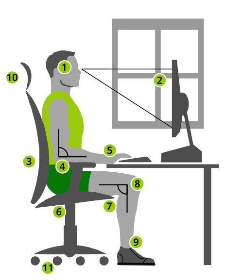
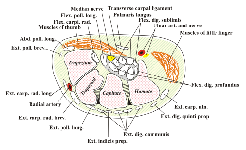

# DORT/LER: LESÕES POR ESFORÇOS REPETITIVOS

Para começar nosso estudo, precisamos alinhar os termos. Embora o senso comum e muitas questões de prova ainda utilizem a sigla LER (Lesões por Esforços Repetitivos), o termo técnico adotado pelo Ministério da Saúde e mais adequado cientificamente é DORT (Distúrbios Osteomusculares Relacionados ao Trabalho).

Por que essa mudança ocorreu? Porque a palavra "Lesão" implica um dano estrutural visível, como uma ruptura de tendão. No entanto, muitos trabalhadores apresentam dor incapacitante sem que haja uma lesão anatômica clássica nos exames de imagem. O termo "Distúrbio" é mais abrangente, englobando quadros de dor crônica, fadiga e perda de função, mesmo na ausência de uma alteração estrutural óbvia.

## Definição e a Natureza Multifatorial

*Figura 1 - Representação de estação de trabalho ergonômica ideal com ajustes de postura, altura da tela e apoio lombar para prevenção de DORT/LER. Fonte: Marcel Kollmar e Partynia, CC BY-SA 3.0 | Wikimedia Commons*

DORT não é uma doença única. É um conjunto de síndromes que atingem o sistema musculoesquelético, especificamente tendões, sinóvias, músculos, nervos, fáscias e ligamentos. O ponto central para sua prova de residência é o nexo causal: esses distúrbios são causados, mantidos ou agravados pelo trabalho.

Muitos alunos cometem o erro de achar que DORT é causada apenas por "repetir o mesmo movimento". Cuidado. A etiologia é multifatorial. Se a questão disser que a causa é puramente biomecânica, ela está errada. Precisamos olhar para:

- Fatores Biomecânicos: Repetitividade, força excessiva, posturas viciosas e vibração.

- Fatores Organizacionais: Sobrecarga de trabalho, ausência de pausas, pressão por produtividade e controle rígido de tempos.

- Fatores Psicossociais: Falta de suporte social, insatisfação no trabalho e assédio moral.

Um conceito que o Dr. Will sempre reforça nas discussões do MedEvo é que a variabilidade da tarefa é um fator protetor. Se o trabalhador alterna entre diferentes atividades ao longo do dia, o risco de DORT diminui. Portanto, se a banca afirmar que "o excesso de variabilidade da tarefa é fator de risco", marque como falso. O risco está na monotonia e na repetição exaustiva do mesmo padrão motor.

## Classificação de Schilling e o Nexo Causal

Este é, sem dúvida, um dos temas mais cobrados em Medicina do Trabalho. A Classificação de Schilling divide as doenças de acordo com sua relação com o trabalho. Para as DORTs, focamos principalmente nos grupos II e III.

| Categoria | Relação com o Trabalho | Exemplo em DORT |
| --- | --- | --- |
| Schilling I | Trabalho é causa necessária (doença profissional clássica). | Silicose, Benzenismo. |
| Schilling II | Trabalho é fator contributivo, mas não necessário (fator de risco). | Tenossinovite, Epicondilite, Varizes. |
| Schilling III | Trabalho provoca o distúrbio ou agrava doença preexistente. | Lombalgia, Dermatite de contato, Asma. |

A maioria das DORTs, como a tenossinovite ocupacional, é classificada como Schilling II. O trabalho não é a única forma de se ter uma tenossinovite, mas as condições laborais foram decisivas para que ela surgisse naquele indivíduo.

## Epidemiologia e Fatores de Risco

As DORTs representam a maior causa de afastamento do trabalho no Brasil e no mundo ocidental. Existe uma prevalência significativamente maior em mulheres. Por que? Não é apenas uma questão biológica, mas social. As mulheres frequentemente estão em postos de trabalho com maior repetitividade e menor autonomia (como linhas de montagem e telemarketing), além de enfrentarem a dupla jornada doméstica, que impede a recuperação plena do sistema musculoesquelético.

Fatores de risco que você deve memorizar para a prova:

- Posturas estáticas ou extremas (ex: trabalhar com o braço acima da linha do ombro).

- Força excessiva para executar tarefas.

- Compressão mecânica direta sobre estruturas nervosas ou tendinosas.

- Exposição à vibração (ferramentas pneumáticas).

- Frio excessivo no ambiente de trabalho.

Um erro clássico de prova é incluir a Fibromialgia como uma DORT típica. Atenção: a fibromialgia é uma síndrome de dor generalizada com forte componente central. Embora o trabalho possa agravar os sintomas, raramente se estabelece um nexo causal direto como "doença do trabalho" para a fibromialgia, diferentemente de uma síndrome do túnel do carpo.

## Principais Síndromes Clínicas em DORT

Vamos detalhar as patologias que mais aparecem nos enunciados das questões.

### Síndrome do Túnel do Carpo

*Figura 2 - Corte transversal do punho mostrando a anatomia do túnel do carpo com o nervo mediano comprimido entre os tendões flexores e o retináculo dos flexores. Fonte: DoPhotoShop, CC BY-SA 3.0 | Wikimedia Commons*
 (STC) Ocupacional
É a neuropatia compressiva mais comum. Ocorre pela compressão do nervo mediano ao passar pelo túnel do carpo no punho.

- Quadro Clínico: Parestesia (formigamento) e dor nos três primeiros dedos e na metade radial do quarto dedo. Os sintomas costumam piorar à noite.

- Exame Físico:

- Sinal de Tinel: Percussão do nervo mediano no punho gera choque/parestesia.

- Sinal de Phalen: Flexão forçada dos punhos por 60 segundos desencadeia os sintomas.

- Nexo Ocupacional: Comum em digitadores, cozinheiros (movimento de picar) e trabalhadores que usam ferramentas vibratórias.

### Síndrome de Colisão do Ombro (Manguito Rotador)

Envolve a compressão das estruturas que passam sob o arco acromial, especialmente o tendão do supraespinal e a bursa subacromial.

- Quadro Clínico: Dor no ombro ao elevar o braço, fraqueza e limitação de movimentos.

- Nexo Ocupacional: Atividades que exigem elevação do braço acima de 90 graus de forma repetida ou sustentada (ex: pintores, eletricistas, repositores de prateleiras altas).

### Epicondilites

- Lateral (Cotovelo de Tenista): Inflamação dos extensores do punho. Relacionada a movimentos de extensão do punho com força.

- Medial (Cotovelo de Golfista): Inflamação dos flexores do punho. Relacionada a movimentos de flexão e pronação.

### Tenossinovite de De Quervain

Inflamação dos tendões do abdutor longo e extensor curto do polegar.

- Teste de Finkelstein: O paciente fecha a mão com o polegar dentro dos dedos e o examinador faz um desvio ulnar passivo do punho. Se houver dor intensa na estilóide radial, o teste é positivo.

### Disfonia Ocupacional (Calo Vocal)

Muitas vezes esquecida, mas muito cobrada em provas de Medicina Preventiva. Professores e operadores de telemarketing são os grupos de risco.

- Característica: Nódulos vocais decorrentes do uso excessivo e inadequado da voz.

- Conduta: É considerada doença relacionada ao trabalho. Exige emissão de CAT, fonoterapia e, crucialmente, adaptação do ambiente de trabalho (melhoria da acústica, redução de ruído ambiente para que o trabalhador não precise gritar).

## O Diagnóstico e a Abordagem na APS

Na Atenção Primária à Saúde (APS), o diagnóstico de DORT é eminentemente clínico e ocupacional. Você não precisa de uma ressonância magnética para cada paciente com dor no punho.

O foco deve ser a anamnese ocupacional. Pergunte:

- O que você faz no trabalho? (Descrição detalhada da tarefa).

- Como é o seu ambiente? (Mobiliário, ferramentas).

- Como é a organização? (Pausas, metas, chefia).

- Os sintomas melhoram no final de semana ou nas férias? (Este é um forte indício de nexo causal).

Dica de ouro para a prova: Para fins de prevenção e vigilância, o foco na modificação das atividades laborais ofensivas é mais importante do que o diagnóstico anatômico definitivo. Se o paciente tem dor por digitação, não importa se é uma tendinite X ou Y no primeiro momento; o que importa é que o posto de trabalho precisa de ajuste e ele precisa de pausas.

## Notificação e Aspectos Legais

Aqui é onde muitos alunos perdem pontos por confundir os sistemas.

- SINAN (Sistema de Informação de Agravos de Notificação): A notificação de LER/DORT é compulsória para todos os casos suspeitos ou confirmados, independentemente de o trabalhador ser formal (CLT) ou informal. O objetivo aqui é vigilância epidemiológica.

- CAT (Comunicação de Acidente de Trabalho): É um documento previdenciário. Deve ser emitido para trabalhadores segurados pelo INSS (celetistas) em caso de doença profissional ou do trabalho.

Quem emite a CAT? Preferencialmente a empresa. Se a empresa se recusar, o médico assistente, o sindicato ou o próprio trabalhador podem emitir. O médico não precisa ter "certeza absoluta" do nexo para emitir a CAT; a suspeita fundamentada já autoriza a emissão para que a perícia do INSS avalie.

## Ergonomia e Prevenção

A ergonomia é a ciência que busca adaptar o trabalho ao homem, e não o contrário. Ela atua em três frentes:

- Ergonomia Física: Postura, manuseio de materiais, repetitividade.

- Ergonomia Cognitiva: Carga mental, tomada de decisão, estresse.

- Ergonomia Organizacional: Horários, pausas, trabalho em equipe.

Para digitadores, existe uma regra de ouro que cai constantemente em provas: Pausas de 10 minutos a cada 50 minutos de trabalho. Essas pausas não devem ser computadas na jornada de trabalho (ou seja, o trabalhador não deve "pagar" por elas depois).

Outro ponto preventivo é a adequação do mobiliário:

- Monitor na altura dos olhos.

- Punhos em posição neutra (sem flexão ou extensão excessiva).

- Pés apoiados (no chão ou em suporte).

- Cadeira com apoio lombar e regulagem de altura.

## Tratamento e Reabilitação

O tratamento da DORT não é apenas passar anti-inflamatório e repouso. O repouso absoluto prolongado é contraindicado, pois leva à atrofia muscular e cronificação da dor.

A estratégia correta envolve:

- Controle da dor (analgésicos, AINEs em fases agudas, fisioterapia).

- Modificação das condições de trabalho (ajuste ergonômico).

- Reabilitação física (fortalecimento e alongamento).

- Abordagem psicossocial (manejo do estresse).

O Programa de Retorno ao Trabalho é um conceito moderno que as bancas adoram. O sucesso desse programa é medido pela redução do absenteísmo e pela readaptação progressiva. O trabalhador não deve voltar direto para a mesma carga horária e tarefa que o adoeceu. Ele precisa de uma readaptação profissional, muitas vezes mudando de função temporária ou permanentemente.

| Situação Clínica | Conduta Imediata | Conduta de Longo Prazo |
| --- | --- | --- |
| Fase Aguda (Dor intensa) | Afastamento temporário, AINEs, Gelo. | Análise Ergonômica do Posto de Trabalho. |
| Fase Crônica | Reabilitação física, antidepressivos (se dor neuropática). | Readaptação profissional, pausas programadas. |
| Suspeita de Nexo Causal | Emissão de CAT e Notificação SINAN. | Vigilância em Saúde do Trabalhador na empresa. |

## Diagnóstico Diferencial

Nem toda dor no braço de um trabalhador é DORT. O médico deve estar atento a:

- Artrite Reumatóide: Envolvimento de pequenas articulações, rigidez matinal prolongada, fator reumatoide positivo.

- Osteoartrose: Dor mecânica, relacionada à idade, alterações radiológicas de degeneração.

- Fibromialgia: Pontos dolorosos disseminados (tender points), distúrbios do sono, sem nexo claro com uma tarefa específica.

- Neuropatias compressivas não ocupacionais: Diabetes mellitus, hipotireoidismo e gravidez são causas frequentes de Síndrome do Túnel do Carpo que não têm relação com o trabalho.

Cuidado com a pegadinha: Se um paciente tem diabetes e trabalha com digitação, ele desenvolve STC. O trabalho pode ser um concausa (Schilling III). O fato de ele ter diabetes não exclui a responsabilidade das condições de trabalho no agravamento do quadro.

## O Papel da Equipe de Saúde da Família (ESF)

A saúde do trabalhador deve estar inserida na rotina da ESF. O médico de família deve:

- Identificar a ocupação de todos os seus pacientes (o que você faz?).

- Discutir estratégias de proteção à saúde diretamente com o paciente.

- Realizar a notificação no SINAN.

- Articular com o NASF (fisioterapeutas, terapeutas ocupacionais) para grupos de reabilitação.

A autonomia do paciente deve ser respeitada. Muitas vezes, o trabalhador tem medo de denunciar a empresa ou de se afastar por receio de demissão. O papel do médico é informar os direitos e os riscos de continuar na atividade sem modificações.

## Tabelas Comparativas para Revisão Rápida

### Tabela de Manobras de Exame Físico

| Manobra | Como realizar | O que sugere se positivo |
| --- | --- | --- |
| Phalen | Flexão máxima dos punhos por 1 min. | Síndrome do Túnel do Carpo (N. Mediano). |
| Tinel | Percussão sobre o trajeto do nervo. | Compressão nervosa (Mediano no punho, Ulnar no cotovelo). |
| Finkelstein | Desvio ulnar do punho com polegar fletido. | Tenossinovite de De Quervain. |
| Neer / Hawkins | Manobras de elevação e rotação do ombro. | Síndrome do Impacto / Manguito Rotador. |
| Cozen | Extensão do punho contra resistência. | Epicondilite Lateral. |

### Tabela de Prevenção Ergonômica (NR-17)

| Item | Recomendação | Objetivo |
| --- | --- | --- |
| Pausas | 10 min a cada 50 min trabalhados. | Recuperação tecidual e redução de fadiga. |
| Postura | Ângulos neutros de articulações. | Reduzir tensão em tendões e ligamentos. |
| Variabilidade | Alternância de tarefas. | Evitar sobrecarga em grupos musculares específicos. |
| Iluminação | Adequada à tarefa (evitar reflexos). | Reduzir fadiga visual e posturas compensatórias. |

## Fisiopatologia: O "Porquê" da Lesão

Por que o esforço repetitivo causa dor? Imagine o tendão deslizando dentro de sua bainha sinovial. Quando o movimento é excessivo e não há tempo para recuperação, ocorre um processo de microtraumatismo.

Isso gera um edema local. O edema aumenta a pressão dentro de compartimentos estreitos (como o túnel do carpo). Essa pressão aumentada gera isquemia (falta de sangue) para os pequenos vasos que nutrem os nervos e tendões (vasa nervorum). A isquemia causa dor e, se persistente, leva à fibrose.

A fibrose torna a estrutura menos elástica e mais propensa a novas lesões. É um ciclo vicioso. Por isso, o tratamento precoce e a interrupção do fator agressor (a má condição de trabalho) são fundamentais. Se apenas tratarmos a inflamação com remédios e o trabalhador voltar para a mesma bancada desregulada, a doença irá cronificar.

## Pontos-Chave para Prova 💡

- DORT é multifatorial: Envolve biomecânica, organização do trabalho e fatores psicossociais.

- Classificação de Schilling: DORTs são predominantemente Schilling II (trabalho como fator contributivo).

- Pausas para digitadores: 10 minutos a cada 50 minutos de trabalho (NR-17).

- Síndrome do Túnel do Carpo: Compressão do nervo mediano; Phalen e Tinel positivos; parestesia nos 3 primeiros dedos.

- Tenossinovite de De Quervain: Teste de Finkelstein positivo (dor na estilóide radial).

- Notificação SINAN: Obrigatória para todos os trabalhadores (formais e informais) em caso de suspeita de DORT.

- CAT (Comunicação de Acidente de Trabalho): Documento para fins previdenciários (trabalhadores CLT).

- Variabilidade da tarefa: É um fator de proteção, não de risco.

- Prevalência: Maior em mulheres devido a fatores ocupacionais e dupla jornada.

- Fibromialgia: Raramente possui nexo causal direto com o trabalho (não é considerada DORT clássica).

- Disfonia Ocupacional: É doença do trabalho; comum em professores; exige CAT e adaptação ambiental.

- Repouso Absoluto: Deve ser evitado no tratamento de longo prazo para não gerar atrofia e cronificação.

- Readaptação Profissional: Essencial no programa de retorno ao trabalho para evitar recidivas.

- Erro Comum: Achar que precisa de exames de imagem sofisticados para diagnosticar DORT na prova. O diagnóstico é clínico-ocupacional.

- Primeira Escolha na Prevenção: Modificação das condições de trabalho e ergonomia, antes de intervenções farmacológicas.

- Contraindicação Absoluta: Manter o trabalhador na mesma atividade que gerou a lesão aguda sem nenhuma modificação ergonômica.

- Valores de Referência: Pausas de 10 min/50 min; braços acima de 90 graus como risco para ombro; flexão de punho > 45 graus como risco para STC.

 Cópia offline para consulta pessoal.
 Fonte original:
 [https://www.medevo.com.br/material-apoio/ler/67bc67f9-8f76-4d15-b830-37bc51eb8297](https://www.medevo.com.br/material-apoio/ler/67bc67f9-8f76-4d15-b830-37bc51eb8297)
