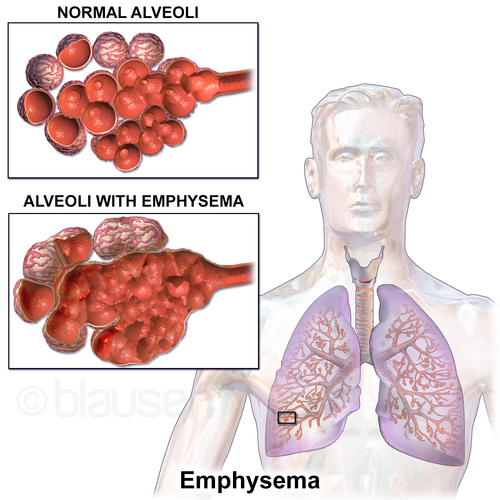
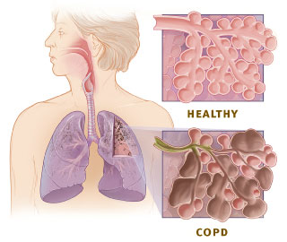

# DPOC: MANEJO E EXACERBAÇÃO

## Conceito e diagnóstico

A Doença Pulmonar Obstrutiva Crônica (DPOC) é uma doença comum, prevenível e tratável, caracterizada por sintomas respiratórios persistentes e limitação crônica ao fluxo aéreo.

O diagnóstico é funcional e exige espirometria:

**VEF1/CVF < 0,70 após broncodilatador.**

Esse ponto é essencial: história de tabagismo, tosse e dispneia sugerem DPOC, mas não fecham o diagnóstico sem obstrução persistente na espirometria.

Na DPOC, a limitação ao fluxo aéreo decorre de alterações estruturais das vias aéreas e do parênquima pulmonar, com obstrução não totalmente reversível, perda de recolhimento elástico e aprisionamento aéreo.

## Fatores de risco

A DPOC resulta da interação entre exposições ambientais, fatores individuais e desenvolvimento pulmonar ao longo da vida.

| Fator | Comentário |
| --- | --- |
| **Tabagismo** | Principal fator de risco. Avalie carga tabágica em anos-maço. |
| **Exposição à biomassa** | Fogão a lenha e fumaça domiciliar são causas importantes no Brasil, especialmente em áreas rurais. |
| **Exposição ocupacional** | Poeiras minerais, carvão, sílica, gases industriais, fumaça de soldagem e vapores químicos. |
| **Poluição ambiental** | Contribui para sintomas, exacerbações e risco de doença. |
| **Deficiência de alfa-1 antitripsina** | Principal causa genética. Suspeite em enfisema precoce, panlobular, predominante em bases, sem exposição proporcional. |
| **Infecções respiratórias na infância** | Podem prejudicar o desenvolvimento pulmonar e favorecer limitação crônica ao fluxo aéreo. |
| **Prematuridade e baixo peso ao nascer** | Associados a menor reserva funcional pulmonar na vida adulta. |

**Dica de prova:** paciente jovem, geralmente < 45 anos, com enfisema importante, pouca ou nenhuma exposição ao tabaco, história familiar ou enfisema de predomínio basal deve levantar suspeita de deficiência de alfa-1 antitripsina. A investigação inicial é com dosagem sérica.

## Fisiopatologia: por que ocorre obstrução?

*Figura 1 - Ilustração do enfisema pulmonar mostrando destruição dos septos alveolares com formação de grandes espaços aéreos e perda da elasticidade pulmonar. Fonte: Blausen Medical, CC BY 3.0 | Wikimedia Commons*

A DPOC envolve dois processos principais, que frequentemente coexistem:

-

**Enfisema pulmonar:** destruição dos septos alveolares, perda do recolhimento elástico e aumento dos espaços aéreos distais. O ar entra, mas sai com dificuldade, gerando hiperinsuflação e aprisionamento aéreo. Na prova, pense em enfisema diante de hiperinsuflação, diafragma retificado, aumento do espaço retroesternal e “coração em gota”.

-

**Bronquite crônica:** inflamação das vias aéreas, hipersecreção de muco e obstrução de pequenas vias aéreas. O critério clínico clássico é tosse produtiva na maioria dos dias por pelo menos 3 meses, em 2 anos consecutivos, após exclusão de outras causas.

Na DPOC, predominam **neutrófilos, macrófagos e linfócitos T CD8+**. Em asma, a banca costuma explorar eosinófilos, mastócitos, atopia e reversibilidade importante.

## Quadro clínico

Os sintomas costumam ser progressivos e insidiosos.

### Sintomas cardinais

- **Dispneia:** geralmente progressiva, inicialmente aos esforços e depois em atividades leves ou repouso.

- **Tosse crônica:** pode preceder a dispneia por anos, frequentemente pior pela manhã.

- **Expectoração:** em geral mucosa; mudança para escarro purulento sugere exacerbação infecciosa.

### Sintomas e achados associados

- Sibilância e aperto torácico, especialmente em exacerbações.

- Fadiga e perda ponderal, mais comuns em doença avançada.

- Edema de membros inferiores, sugerindo cor pulmonale.

- Ansiedade e depressão, frequentes e associadas a pior qualidade de vida.

### Fenótipos clássicos de prova

| Fenótipo | Características |
| --- | --- |
| **Pink puffer, ou soprador rosado** | Predomínio enfisematoso, magreza, dispneia intensa, pouca tosse, uso de musculatura acessória e respiração com lábios semicerrados. |
| **Blue bloater, ou cianótico pletórico** | Predomínio bronquítico, obesidade, tosse produtiva abundante, cianose, retenção de CO2, edema e cor pulmonale. |

Esses fenótipos são didáticos. Na prática, a maioria dos pacientes tem sobreposição.

## Exame físico

O exame físico pode ser normal nas fases iniciais. Em doença avançada, os achados refletem hiperinsuflação, obstrução e repercussão cardiovascular.

### Inspeção

- Tórax em barril, com aumento do diâmetro anteroposterior.

- Uso de musculatura acessória.

- Respiração com lábios semicerrados, que aumenta a pressão expiratória e reduz colapso de vias aéreas.

- Tiragem intercostal e supraclavicular em casos graves.

- Cianose central em doença avançada.

- Caquexia, mais associada ao fenótipo enfisematoso.

### Palpação

- Expansibilidade torácica reduzida.

- Frêmito toracovocal diminuído, por aumento de ar interposto.

### Percussão

- Hipersonoridade ou timpanismo.

- Rebaixamento das bases pulmonares.

- Redução da excursão diafragmática.

### Ausculta

- Murmúrio vesicular diminuído.

- Tempo expiratório prolongado.

- Sibilos expiratórios, especialmente na exacerbação.

- Roncos, quando há secreção em vias aéreas.

### Sinais de cor pulmonale

- Turgência jugular patológica.

- Refluxo hepatojugular.

- Hepatomegalia dolorosa.

- Edema de membros inferiores.

- B2 pulmonar hiperfonética.

- Sopro de insuficiência tricúspide.

**Ponto de prova:** baqueteamento digital não é típico da DPOC isolada. Se aparecer, investigue câncer de pulmão, bronquiectasias, fibrose pulmonar ou outras causas.

## Diagnóstico diferencial

| Característica | DPOC | Asma | Insuficiência cardíaca |
| --- | --- | --- | --- |
| **Início típico** | Meia-idade ou idoso | Infância, juventude ou adulto jovem | Idoso, cardiopata ou hipertenso |
| **Tabagismo/exposição** | Frequente | Pode estar ausente | Pode estar ausente |
| **Sintomas** | Persistentes e progressivos | Variáveis, em crises | Ortopneia, DPN, edema, congestão |
| **Espirometria** | VEF1/CVF < 0,70 pós-BD | Obstrução variável e reversível | Pode haver padrão restritivo ou misto |
| **Radiografia** | Hiperinsuflação, diafragma retificado | Normal fora da crise | Cardiomegalia, congestão, derrame pleural |

DPOC e asma podem coexistir. Nesses casos, a presença de características asmáticas importantes reforça o papel do corticoide inalatório, sempre associado a broncodilatadores de longa ação.

## Classificação da DPOC

A avaliação atual combina dois eixos: gravidade da obstrução e avaliação clínica por sintomas/exacerbações.

### 1. Gravidade da obstrução: GOLD 1 a 4

Baseia-se no VEF1 pós-broncodilatador, após confirmação de VEF1/CVF < 0,70.

- **GOLD 1, leve:** VEF1 ≥ 80% do previsto.

- **GOLD 2, moderado:** 50% ≤ VEF1 < 80%.

- **GOLD 3, grave:** 30% ≤ VEF1 < 50%.

- **GOLD 4, muito grave:** VEF1 < 30%.

### 2. Avaliação clínica: grupos A, B e E

A classificação clínica considera sintomas e exacerbações no último ano.

| Grupo | Exacerbações no último ano | Sintomas |
| --- | --- | --- |
| **A** | Nenhuma exacerbação moderada ou grave | mMRC 0-1 ou CAT < 10 |
| **B** | Nenhuma exacerbação moderada ou grave | mMRC ≥ 2 ou CAT ≥ 10 |
| **E** | **≥ 1 exacerbação moderada ou grave** | Qualquer valor de mMRC ou CAT |

**Exacerbação moderada** é aquela que exige tratamento adicional com corticosteroide sistêmico e/ou antibiótico.
**Exacerbação grave** é aquela que exige atendimento em emergência prolongado, hospitalização ou ventilação.

**Exemplo de prova:** paciente com VEF1 45%, mMRC 3 e uma exacerbação tratada com prednisona e antibiótico no último ano. Classificação: **GOLD 3, grupo E**.

## Manejo do paciente estável

O tratamento busca reduzir sintomas, melhorar qualidade de vida, reduzir exacerbações, preservar capacidade funcional e tratar comorbidades.

### Medidas não farmacológicas

- **Cessação do tabagismo:** intervenção central no manejo. Reduz a velocidade de perda funcional e deve ser abordada em toda consulta.

- **Vacinação:** influenza anual, COVID-19, pneumocócica conforme calendário, além de vacinas indicadas por idade e risco, como dTpa, herpes-zóster e VSR quando disponíveis e indicadas.

- **Reabilitação pulmonar:** indicada especialmente para pacientes sintomáticos, após exacerbações e nos grupos B e E. Melhora dispneia, tolerância ao exercício e reduz reinternações.

- **Atividade física:** deve ser estimulada. Sedentarismo piora prognóstico.

- **Educação em saúde:** técnica inalatória, adesão, reconhecimento precoce de exacerbação e plano de ação.

- **Nutrição:** avaliar perda de peso, sarcopenia e obesidade, pois ambas pioram dispneia e funcionalidade.

## Tratamento farmacológico da DPOC estável

Na DPOC, a base do tratamento são os **broncodilatadores de longa ação**.

- **LAMA:** antimuscarínico de longa ação, como tiotrópio, umeclidínio e glicopirrônio. Tem bom efeito na redução de exacerbações.

- **LABA:** beta-2 agonista de longa ação, como formoterol, salmeterol, indacaterol, vilanterol e olodaterol.

- **CI:** corticoide inalatório, como budesonida, beclometasona e fluticasona. Não deve ser usado isoladamente na DPOC.

### Tratamento inicial

| Grupo | Perfil | Conduta inicial |
| --- | --- | --- |
| **A** | Poucos sintomas e sem exacerbação moderada/grave | Um broncodilatador, preferencialmente de longa ação |
| **B** | Sintomático e sem exacerbação moderada/grave | **LABA + LAMA** |
| **E** | Pelo menos 1 exacerbação moderada ou grave | **LABA + LAMA**; considerar terapia tripla se eosinófilos elevados |

### Quando usar corticoide inalatório?

O corticoide inalatório deve ser pensado como terapia anti-inflamatória para reduzir exacerbações em pacientes selecionados, e não como tratamento isolado da DPOC.

Maior benefício esperado:

- Eosinófilos sanguíneos **≥ 300 células/µL**.

- Exacerbações apesar de broncodilatação otimizada.

- Sobreposição com asma ou forte componente eosinofílico.

Menor benefício e maior cautela:

- Eosinófilos **< 100 células/µL**.

- História de pneumonia recorrente.

- Bronquiectasias, micobacteriose, baixo IMC ou alto risco infeccioso.

**Regra de prova:** corticoide inalatório nunca deve ser monoterapia na DPOC. Quando indicado, entra associado a LABA, geralmente em terapia tripla com LABA + LAMA + CI.

### Outras opções em casos selecionados

- **Roflumilaste:** pode ser considerado em DPOC grave, fenótipo bronquítico crônico, VEF1 < 50% e exacerbações frequentes, especialmente se houve hospitalização.

- **Azitromicina em longo prazo:** pode reduzir exacerbações em pacientes selecionados, principalmente ex-tabagistas, mas exige cautela por resistência bacteriana, QT longo e perda auditiva.

- **Mucolíticos/antioxidantes:** podem ter papel em alguns pacientes com secreção crônica e exacerbações, quando não estão em corticoide inalatório.

- **Biológicos:** podem ser considerados por especialista em DPOC eosinofílica exacerbadora apesar de terapia otimizada, conforme disponibilidade, indicação regulatória e perfil do paciente.

- **Cirurgia redutora de volume, válvulas endobrônquicas ou transplante:** opções para doença avançada muito selecionada.

## Oxigenioterapia domiciliar prolongada

A oxigenioterapia domiciliar prolongada melhora sobrevida quando indicada corretamente. Deve ser usada por pelo menos **15 horas por dia**, idealmente mais.

Indicar em paciente estável, em repouso e em ar ambiente quando houver:

- **PaO2 ≤ 55 mmHg** ou **SatO2 ≤ 88%**.

- **PaO2 entre 56 e 59 mmHg** ou SatO2 em torno de 89% se houver:

- Cor pulmonale.

- Hipertensão pulmonar.

- Policitemia, geralmente hematócrito > 55%.

**Pegadinha:** VEF1 muito baixo não indica automaticamente oxigenoterapia domiciliar. O critério é hipoxemia crônica documentada em estabilidade clínica.

## Exacerbação da DPOC

*Figura 2 - Comparação entre tecido pulmonar saudável (esquerda) e tecido com DPOC (direita), mostrando destruição alveolar e hiperinsuflação característica do enfisema. Fonte: NIH/NHLBI, domínio público | Wikimedia Commons*

Exacerbação é uma piora aguda de sintomas respiratórios que exige terapia adicional. É evento de alto impacto, pois aumenta risco de internação, perda funcional, novas exacerbações, eventos cardiovasculares e mortalidade.

### Critérios clínicos de Anthonisen

Usados principalmente para decisão sobre antibiótico:

- Aumento da dispneia.

- Aumento do volume do escarro.

- Aumento da purulência do escarro.

Classicamente:

- **Tipo I:** 3 critérios.

- **Tipo II:** 2 critérios.

- **Tipo III:** 1 critério associado a sintomas inespecíficos, como febre, taquicardia ou piora clínica.

Na prática, a purulência do escarro pesa muito na decisão de antibiótico.

## Manejo da exacerbação

### 1. Broncodilatadores de curta ação

Usar SABA e/ou SAMA, com aumento da frequência nas primeiras horas:

- Salbutamol ou fenoterol.

- Ipratrópio.

A associação SABA + SAMA é comum em exacerbações moderadas a graves.

### 2. Corticosteroide sistêmico

Esquema usual:

**Prednisona 40 mg/dia por 5 dias.**

A via oral é preferível se o paciente consegue ingerir e absorver. Via venosa fica reservada para impossibilidade de uso oral, vômitos, rebaixamento ou gravidade.

Não há benefício em cursos prolongados de rotina, e o uso crônico de corticoide sistêmico na DPOC estável deve ser evitado por risco de miopatia, osteoporose, hiperglicemia, infecção e outros eventos adversos.

### 3. Antibiótico

Indicar quando houver:

- Escarro purulento, especialmente se associado a aumento da dispneia ou do volume do escarro.

- Exacerbação grave.

- Necessidade de ventilação não invasiva ou invasiva.

Germes mais comuns:

- *Haemophilus influenzae*.

- *Streptococcus pneumoniae*.

- *Moraxella catarrhalis*.

Duração habitual: **5 a 7 dias**, ajustando à gravidade, resposta clínica e risco de patógenos resistentes.

A escolha do antibiótico depende de gravidade, comorbidades, risco de *Pseudomonas*, uso recente de antibiótico e epidemiologia local.

### 4. Oxigenioterapia controlada

O alvo de saturação na exacerbação da DPOC é:

**SatO2 88 a 92%.**

Evite hiperóxia. Oxigênio em excesso pode piorar hipercapnia principalmente por piora da relação ventilação/perfusão, efeito Haldane e, em menor grau, redução do estímulo ventilatório hipóxico.

Monitorize gasometria arterial em pacientes graves, sonolentos, hipercápnicos, acidóticos ou com piora apesar de oxigênio.

## Ventilação não invasiva

A ventilação não invasiva reduz intubação, mortalidade e tempo de internação em exacerbação com insuficiência respiratória hipercápnica.

Indicações principais:

- Acidose respiratória: **pH < 7,35** com PaCO2 elevada.

- Dispneia intensa com sinais de fadiga muscular.

- Uso importante de musculatura acessória.

- Hipoxemia persistente apesar de oxigênio controlado.

- Trabalho respiratório aumentado.

Contraindicações ou sinais de falha:

- Rebaixamento importante do nível de consciência.

- Instabilidade hemodinâmica grave.

- Vômitos incoercíveis ou alto risco de aspiração.

- Incapacidade de proteger via aérea.

- Secreção abundante sem capacidade de eliminação.

- Trauma facial ou impossibilidade de adaptação da interface.

- Piora de acidose, hipoxemia ou fadiga apesar de VNI adequada.

Se houver falha da VNI, considerar intubação orotraqueal e ventilação invasiva.

## Manejo por local de atendimento

| Local | Conduta |
| --- | --- |
| **Ambulatório** | SABA/SAMA conforme necessidade, prednisona 40 mg por 5 dias, antibiótico se escarro purulento ou critérios clínicos. Reavaliar técnica inalatória e tratamento de manutenção. |
| **Enfermaria** | Oxigênio alvo 88-92%, SABA/SAMA, corticosteroide sistêmico, antibiótico quando indicado, gasometria se gravidade, investigação de diagnósticos diferenciais e gatilhos. |
| **UTI** | VNI se acidose respiratória ou fadiga; IOT se falha de VNI, rebaixamento, instabilidade ou incapacidade de proteger via aérea. |

## Gatilhos e diagnósticos diferenciais na exacerbação

Nem toda piora da dispneia em paciente com DPOC é exacerbação infecciosa.

Investigue conforme o caso:

- Pneumonia.

- Insuficiência cardíaca.

- Tromboembolismo pulmonar.

- Pneumotórax.

- Síndrome coronariana aguda.

- Arritmias.

- Derrame pleural.

- Má adesão ou técnica inalatória inadequada.

- Exposição a fumaça, poluição ou irritantes.

- Uso de sedativos ou opioides.

## Situações especiais e comorbidades

### SAOS e síndrome de overlap

DPOC associada à síndrome da apneia obstrutiva do sono é chamada de síndrome de overlap. Esses pacientes podem ter hipoxemia noturna mais intensa, maior risco de hipertensão pulmonar e pior prognóstico.

O tratamento da apneia é feito com CPAP quando indicado. Oxigênio isolado não trata obstrução de via aérea superior.

### Complicações cardiovasculares

DPOC aumenta risco de infarto, AVC, insuficiência cardíaca, fibrilação atrial e outras arritmias. Exacerbações também aumentam risco cardiovascular no curto prazo.

Betabloqueadores cardiosseletivos, como bisoprolol e metoprolol, não são contraindicação absoluta na DPOC estável quando há indicação cardiovascular clara.

### Bronquiectasias

Bronquiectasias podem coexistir com DPOC e sugerem maior risco de infecção crônica, exacerbações e colonização por germes como *Pseudomonas*. Nesses casos, o manejo deve ser individualizado.

## Tabelas de revisão rápida

### Classificação clínica e tratamento inicial

| Grupo | Perfil | Conduta inicial |
| --- | --- | --- |
| **A** | Poucos sintomas, sem exacerbação moderada/grave | Broncodilatador, preferencialmente de longa ação |
| **B** | Sintomático, sem exacerbação moderada/grave | LABA + LAMA |
| **E** | ≥ 1 exacerbação moderada ou grave | LABA + LAMA; considerar LABA + LAMA + CI se eosinófilos elevados |

### Exacerbação: condutas essenciais

| Medida | Ponto-chave |
| --- | --- |
| **SABA/SAMA** | Base inicial do alívio sintomático. |
| **Corticoide sistêmico** | Prednisona 40 mg/dia por 5 dias. |
| **Antibiótico** | Se escarro purulento, exacerbação grave ou necessidade de ventilação. |
| **Oxigênio** | Alvo de SatO2 88-92%. |
| **VNI** | Indicada em acidose respiratória hipercápnica, fadiga ou hipoxemia persistente. |

## Pontos-chave para prova

- DPOC exige **VEF1/CVF < 0,70 pós-broncodilatador**.

- Obstrução fixa sem espirometria não fecha diagnóstico.

- Tabagismo é o principal fator de risco, mas biomassa e exposição ocupacional são muito importantes no Brasil.

- Deficiência de alfa-1 antitripsina deve ser lembrada em enfisema precoce, basal, panlobular, familiar ou desproporcional à exposição.

- Enfisema cursa com perda de recolhimento elástico, hiperinsuflação e aprisionamento aéreo.

- Bronquite crônica é tosse produtiva por pelo menos 3 meses em 2 anos consecutivos.

- Na DPOC predominam neutrófilos, macrófagos e linfócitos T CD8+.

- Pink puffer: enfisematoso, magro, dispneico.

- Blue bloater: bronquítico, cianótico, pletórico, com tendência a cor pulmonale.

- Tórax em barril sugere hiperinsuflação.

- Baqueteamento digital não é típico da DPOC isolada.

- Classificação espirométrica: GOLD 1 a 4 pelo VEF1.

- Classificação clínica atual: A, B e E.

- Grupo E: pelo menos **1 exacerbação moderada ou grave** no último ano.

- Tratamento inicial do grupo B: LABA + LAMA.

- Tratamento inicial do grupo E: LABA + LAMA; considerar terapia tripla se eosinófilos elevados.

- Corticoide inalatório nunca deve ser usado isoladamente na DPOC.

- Eosinófilos ≥ 300 células/µL favorecem benefício com corticoide inalatório.

- Eosinófilos < 100 células/µL sugerem pouco benefício com corticoide inalatório e maior cautela.

- Cessação tabágica é intervenção central e deve ser sempre abordada.

- Reabilitação pulmonar melhora dispneia, funcionalidade e reduz reinternações.

- Oxigenioterapia domiciliar prolongada melhora sobrevida apenas quando há hipoxemia crônica em estabilidade.

- Critérios clássicos de ODP: PaO2 ≤ 55 mmHg ou SatO2 ≤ 88%; ou PaO2 56-59 mmHg com cor pulmonale, hipertensão pulmonar ou policitemia.

- VEF1 < 30% não indica oxigênio automaticamente.

- Exacerbação é piora aguda que exige terapia adicional.

- Critérios de Anthonisen: aumento da dispneia, aumento do volume do escarro e aumento da purulência.

- Antibiótico é indicado especialmente se houver purulência do escarro ou necessidade de ventilação.

- Corticoide sistêmico na exacerbação: prednisona 40 mg/dia por 5 dias.

- Alvo de oxigênio na exacerbação: SatO2 88-92%.

- Oxigênio em excesso pode piorar hipercapnia.

- VNI é indicada em acidose respiratória hipercápnica e reduz intubação e mortalidade.

- Beta-2 agonistas podem causar taquicardia, tremor e hipocalemia.

- Corticoide sistêmico crônico não deve ser usado na DPOC estável.

- Vareniclina é opção eficaz para cessação tabágica, devendo-se avaliar contraindicações, efeitos adversos e contexto clínico.

 Cópia offline para consulta pessoal.
 Fonte original:
 [https://www.medevo.com.br/material-apoio/ler/b02534e4-451d-495b-b1aa-075c65b8b7b8](https://www.medevo.com.br/material-apoio/ler/b02534e4-451d-495b-b1aa-075c65b8b7b8)
