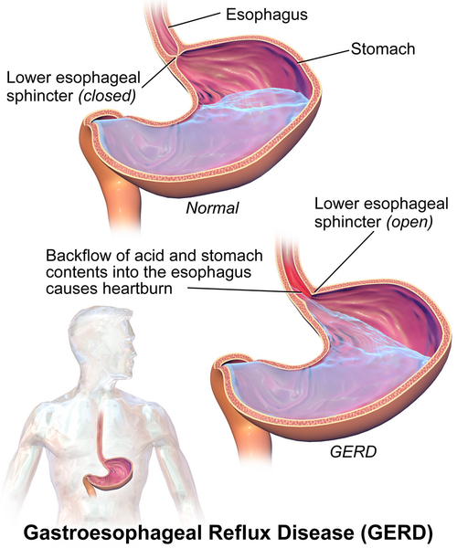
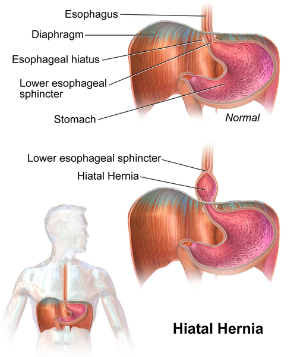

# DRGE

A Doença do Refluxo Gastroesofágico (DRGE) é, sem dúvida, um dos temas mais frequentes na prática clínica e, consequentemente, um dos "queridinhos" das bancas de residência médica. Mas cuidado: por ser um tema comum, as questões costumam cobrar detalhes sobre a fisiopatologia e as condutas em casos que fogem do arroz com feijão.

Para entender a DRGE, você precisa primeiro diferenciar o Refluxo Gastroesofágico (RGE) fisiológico da Doença (DRGE). O RGE acontece com todos nós, principalmente após refeições volumosas, de forma breve e assintomática. A DRGE surge quando esse refluxo do conteúdo gástrico causa sintomas incômodos ou complicações.

## Fisiopatologia: O Porquê do Refluxo

*Figura 1 - Diagrama ilustrando o mecanismo do refluxo gastroesofágico, mostrando o ácido gástrico refluindo para o esôfago devido à incompetência do EEI. Fonte: BruceBlaus, CC BY-SA 4.0 | Wikimedia Commons*

Muitos alunos acreditam que a DRGE é causada apenas por "ácido demais" ou por uma "hérnia de hiato". Isso é um erro clássico. A maioria dos pacientes com DRGE produz uma quantidade normal de ácido. O problema não é a produção, mas sim a falha nos mecanismos de barreira que deveriam manter esse ácido no estômago.

O principal mecanismo fisiopatológico da DRGE, disparado o mais cobrado em provas, são os Relaxamentos Transitórios do Esfíncter Esofágico Inferior (TLESRs). Diferente do relaxamento que ocorre durante a deglutição, o TLESR acontece sem que o paciente engula nada, permitindo que o conteúdo gástrico suba. Na maioria dos pacientes, a pressão basal do esfíncter esofágico inferior (EEI) é normal, mas ele relaxa quando não deveria.

Outros fatores contribuem para essa falha de barreira:

*Figura 2 - Anatomia da hérnia de hiato, demonstrando a protrusão do estômago através do hiato esofágico do diafragma. A hérnia altera o ângulo de His e prejudica os mecanismos de barreira antirrefluxo. Fonte: BruceBlaus, CC BY-SA 4.0 | Wikimedia Commons*

- Hérnia de Hiato: Ela altera a anatomia do ângulo de His (o ângulo agudo entre o esôfago e o fundo gástrico) e prejudica o pinçamento diafragmático, que funciona como um esfíncter externo. Lembre-se: a hérnia de hiato é um fator de risco importante, mas não é sinônimo de DRGE. Muitos pacientes têm hérnia e são assintomáticos.

- Clareamento Esofágico Deficiente: O esôfago tem movimentos peristálticos que "empurram" o refluxo de volta. Se a motilidade está prejudicada, o ácido fica mais tempo em contato com a mucosa.

- Esvaziamento Gástrico Retardado: Se o estômago demora a esvaziar, a pressão intragástrica aumenta, facilitando o refluxo.

## Quadro Clínico: O Típico, o Atípico e os Sinais de Alarme

O diagnóstico da DRGE é eminentemente clínico. Se o paciente chega com a "dupla dinâmica" pirose (queimação retroesternal) e regurgitação ácida, você já tem uma alta probabilidade diagnóstica.

### Sintomas Típicos

A pirose costuma ser pós-prandial e piora com o decúbito (ao deitar). A regurgitação é a percepção do conteúdo gástrico na cavidade oral. Quando esses dois estão presentes, a especificidade para DRGE chega a 90%.

### Sintomas Atípicos (Manifestações Extraesofágicas)

Aqui é onde as bancas tentam te pegar. O refluxo pode se manifestar longe do esôfago. Os principais sintomas atípicos são:

- Tosse crônica (frequentemente noturna).

- Disfonia e rouquidão.

- Laringite posterior (visualizada na laringoscopia).

- Asma de início tardio ou difícil controle.

- Erosões dentárias.

- Dor torácica não cardíaca (que pode simular perfeitamente uma angina).

Cuidado: Antes de atribuir uma dor torácica à DRGE, você DEVE excluir causas cardíacas. A vida do paciente vem antes do refluxo.

### Sinais de Alarme

Estes sinais indicam que algo mais grave pode estar acontecendo, como uma neoplasia ou uma estenose cicatricial. Na presença de qualquer um deles, a Endoscopia Digestiva Alta (EDA) é obrigatória e imediata:

- Disfagia (dificuldade para engolir) ou Odinofagia (dor ao engolir).

- Anemia ferropriva ou evidência de sangramento digestivo.

- Perda de peso não intencional.

- Vômitos persistentes.

- História familiar de câncer de esôfago ou estômago.

- Idade superior a 40-45 anos (o ponto de corte varia levemente entre diretrizes, mas 40 é o padrão mais seguro para provas).

## Diagnóstico: Quando Pedir Exames?

Como o Dr. Will sempre enfatiza em suas discussões no MedEvo, a gestão inteligente de exames é o que diferencia o bom médico. Na DRGE, não pedimos EDA para todo mundo.

### Teste Terapêutico

Em pacientes jovens (abaixo de 40 anos), sem sinais de alarme e com sintomas típicos, a conduta inicial é o teste terapêutico com Inibidor de Bomba de Prótons (IBP) em dose plena por 4 a 8 semanas. Se o paciente melhorar, o diagnóstico de DRGE está sugerido.

### Endoscopia Digestiva Alta (EDA)

A EDA não é o padrão-ouro para o diagnóstico de DRGE, pois cerca de 50% dos pacientes com refluxo patológico têm uma endoscopia normal (DRGE Não Erosiva). Ela serve para identificar complicações e classificar a gravidade das esofagites.

A classificação mais utilizada em provas é a de Los Angeles:

| Grau | Descrição Endoscópica |
| --- | --- |
| A | Uma ou mais erosões de até 5 mm, limitadas às pregas mucosas. |
| B | Pelo menos uma erosão com mais de 5 mm, limitada às pregas mucosas. |
| C | Erosões que se estendem entre os ápices de duas ou mais pregas, mas ocupam menos de 75% da circunferência. |
| D | Erosões circunferenciais que ocupam 75% ou mais da circunferência do esôfago. |

### pHmetria Esofágica de 24 horas

Este é o padrão-ouro para o diagnóstico. Ela mede o tempo em que o pH esofágico fica abaixo de 4.
Indicações principais:

- Sintomas atípicos com EDA normal (para confirmar se o sintoma tem relação com o refluxo).

- DRGE refratária ao tratamento com IBP.

- Avaliação pré-operatória de cirurgia antirrefluxo (para confirmar o diagnóstico).

### Esofagomanometria

A manometria NÃO diagnostica refluxo. Ela serve para avaliar a motilidade do esôfago. Sua principal função é o planejamento cirúrgico (para escolher a técnica da fundoplicatura) e para excluir diagnósticos diferenciais como Acalásia ou Espasmo Esofagiano Difuso.

## Diagnóstico Diferencial: Não é só Refluxo

Se o paciente tem disfagia ou dor torácica, você precisa pensar em outras possibilidades:

- Acalásia: Disfagia para sólidos e líquidos desde o início, regurgitação de alimentos não digeridos e perda de peso. No esofagograma, vemos o sinal do "bico de pássaro".

- Esofagite Eosinofílica (EoE): Comum em jovens com história de atopia (asma, rinite). A EDA mostra anéis esofágicos ("esôfago em traqueia"). O diagnóstico exige biópsia com >15 eosinófilos por campo de grande aumento.

- Esofagite Medicamentosa: Causada por doxiciclina, alendronato ou AINEs. Causa dor retroesternal súbita e odinofagia.

- Espasmo Esofagiano Difuso: Dor torácica que melhora com nitrato (cuidado para não confundir com IAM!). Na manometria, ondas simultâneas e no esofagograma, o aspecto em "saca-rolhas".

## Tratamento Farmacológico: O Império dos IBPs

O objetivo do tratamento é o alívio dos sintomas e a cicatrização da mucosa.

### Inibidores de Bomba de Prótons (IBP)

São a primeira escolha. Eles agem bloqueando a enzima H+/K+ ATPase na célula parietal gástrica, que é estimulada por três receptores: Histamina (H2), Acetilcolina (M3) e Gastrina (CCK-B).

Doses padrão (Dose Plena):

- Omeprazol: 20 mg/dia.

- Esomeprazol: 40 mg/dia.

- Lansoprazol: 30 mg/dia.

- Pantoprazol: 40 mg/dia.

Regra de ouro: O IBP deve ser tomado 30 a 60 minutos antes do café da manhã. Por quê? Porque é o momento em que há o maior número de bombas de prótons ativas prontas para serem bloqueadas. Se o paciente toma e vai dormir, o remédio não funciona direito.

Se o paciente não responde à dose única, podemos dobrar a dose (tomar antes do café e antes do jantar). Se mesmo assim não houver resposta, chamamos de DRGE Refratária e precisamos investigar com pHmetria ou impedâncio-pHmetria.

### Efeitos Colaterais dos IBPs

Embora seguros, o uso crônico está associado a:

- Cefaleia e diarreia (comuns).

- Deficiência de B12 e magnésio.

- Aumento do risco de fraturas (osteoporose) e infecções (como por *Clostridioides difficile* e pneumonia).

## Tratamento Não Farmacológico: Medidas Comportamentais

Não ignore as Medidas Educativas (MEV). Elas caem em prova e são fundamentais na vida real.

- Perda de peso: A obesidade aumenta a pressão intra-abdominal, sendo um dos principais fatores de risco.

- Elevação da cabeceira da cama (15 cm): Ajuda a gravidade a manter o ácido no estômago.

- Evitar deitar-se nas 2 a 3 horas após as refeições.

- Cessação do tabagismo.

- Restrição de alimentos gatilhos: Café, chocolate, álcool, gorduras e pimenta. Mas atenção: a diretriz recomenda retirar apenas o que o paciente identifica como gatilho, não precisa proibir tudo para todos.

## Tratamento Cirúrgico

A cirurgia de escolha é a Fundoplicatura de Nissen (360º) por videolaparoscopia.

Indicações:

- Pacientes que respondem bem ao IBP, mas não querem tomar medicação a vida toda (geralmente jovens).

- Intolerância aos efeitos colaterais do IBP.

- DRGE confirmada com complicações graves (estenoses recorrentes).

- Hérnias de hiato volumosas.

Cuidado: A cirurgia não é a primeira opção para quem NÃO responde ao IBP. Se o IBP não funciona, primeiro você deve ter certeza absoluta do diagnóstico com pHmetria, pois o paciente pode ter pirose funcional ou outra doença motora.

## Complicações: O Temido Esôfago de Barrett

O refluxo crônico pode levar à substituição do epitélio escamoso estratificado (normal do esôfago) por epitélio colunar com metaplasia intestinal especializada. Isso é o Esôfago de Barrett (EB).

Por que nos preocupamos? Porque o EB é o principal fator de risco para o Adenocarcinoma de Esôfago.

### Diagnóstico de Barrett

Exige dois critérios:

- Endoscópico: Visualização de mucosa cor "salmão" acima da linha Z. Usamos a Classificação de Praga (extensão circunferencial e máxima) para descrever.

- Histológico: Biópsia confirmando metaplasia intestinal (presença de células caliciformes ou *goblet cells*).

### Conduta no Esôfago de Barrett

A conduta depende do grau de displasia encontrado na biópsia:

| Achado Histológico | Conduta Recomendada |
| --- | --- |
| Sem Displasia | EDA de vigilância a cada 3 a 5 anos. |
| Displasia Indeterminada | Otimizar IBP (2x/dia) por 6 meses e repetir EDA. |
| Displasia de Baixo Grau | Ablação por radiofrequência (RFA) OU EDA a cada 12 meses. |
| Displasia de Alto Grau | Ablação por radiofrequência (preferencial) ou Esofagectomia. |

Pérola de prova: Se o Barrett tiver displasia de alto grau extensa ou multifocal, o risco de adenocarcinoma oculto é altíssimo, e a esofagectomia deve ser considerada. A fundoplicatura trata o refluxo, mas NÃO elimina o risco de câncer em quem já tem Barrett.

## Situações Especiais

### DRGE em Lactentes

O refluxo é muito comum em bebês devido à imaturidade do EEI.

- RGE Fisiológico ("Golfador feliz"): O bebê vomita, mas ganha peso e está bem. Conduta: orientações e tranquilizar os pais.

- DRGE (Doença): O bebê tem irritabilidade, choro pós-mamada, recusa alimentar, baixo ganho de peso ou pneumonias de repetição.

- Cuidado: Nunca coloque o bebê em decúbito ventral (prona) para dormir devido ao risco de Síndrome da Morte Súbita do Lactente (SIDS). O decúbito deve ser dorsal (supino).

### Gestantes

A DRGE é comum devido ao aumento da pressão abdominal e ao efeito da progesterona (que relaxa o EEI). O tratamento inicial é MEV. Se necessário, antiácidos ou sucralfato. Se persistir, IBPs (a maioria é categoria B).

### Estenose Esofágica

É uma complicação da esofagite grave. O paciente apresenta disfagia progressiva para sólidos. O tratamento é a dilatação endoscópica associada ao uso agressivo de IBP.

## Pontos-Chave para Prova

- Principal mecanismo da DRGE: Relaxamentos Transitórios do Esfíncter Esofágico Inferior (TLESRs).

- Padrão-ouro para diagnóstico: pHmetria esofágica de 24 horas.

- Indicação de EDA imediata: Sinais de alarme (disfagia, perda de peso, anemia) ou idade > 40 anos.

- Tratamento inicial padrão: IBP em dose plena 30-60 min antes do café da manhã por 8 semanas.

- Esôfago de Barrett: Metaplasia intestinal especializada; fator de risco para adenocarcinoma.

- Classificação de Los Angeles: Grau A e B são leves; C e D são graves.

- Disfagia em paciente com DRGE: Sinal de alarme que exige EDA para excluir câncer ou estenose.

- Acalásia vs. DRGE: Na acalásia, a pressão do EEI é alta e ele não relaxa; na DRGE, a pressão costuma ser normal, mas há relaxamentos indevidos.

- Diferencial importante: Dor torácica por refluxo pode simular angina; sempre excluir causa cardíaca primeiro.

- Lactentes: Evitar decúbito ventral pelo risco de morte súbita, mesmo que ajude no refluxo.

- Cirurgia antirrefluxo: Fundoplicatura de Nissen (360º) é a técnica padrão.

- Barrett com Displasia de Alto Grau: Exige intervenção (ablação ou cirurgia), não apenas observação.

- IBP e H. pylori: Se o paciente tem DRGE e vai usar IBP por longo prazo, a diretriz recomenda pesquisar e erradicar o H. pylori para evitar progressão para gastrite atrófica.

- Esofagite Medicamentosa: Suspeitar em pacientes usando doxiciclina ou alendronato com dor retroesternal súbita.

- Tilose: Condição rara (hiperqueratose palmo-plantar) com altíssimo risco de carcinoma espinocelular de esôfago. 💡

 Cópia offline para consulta pessoal.
 Fonte original:
 [https://www.medevo.com.br/material-apoio/ler/ba37ffde-f698-4e4e-9847-095859a6fa8f](https://www.medevo.com.br/material-apoio/ler/ba37ffde-f698-4e4e-9847-095859a6fa8f)
