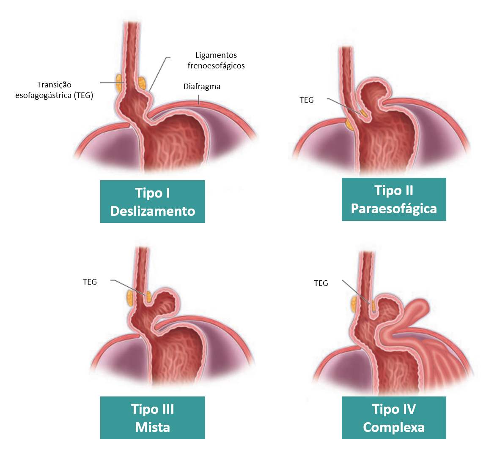

# DRGE CIRÚRGICA

A Doença do Refluxo Gastroesofágico (DRGE) é, talvez, o tema mais onipresente na cirurgia digestiva em provas de residência. Mas não se engane: o examinador não quer saber apenas que o IBP (Inibidor de Bomba de Prótons) falhou. Ele quer saber se você entende a mecânica da junção esofagogástrica (JEG) e se sabe evitar uma disfagia iatrogênica.

Como professor, vejo muitos alunos decorarem nomes de técnicas (Nissen, Toupet, Lind) sem entender o porquê de escolher cada uma. Vamos quebrar essa lógica aqui.

## A Barreira Antirrefluxo: O que estamos tentando consertar?

Para entender a cirurgia, você precisa entender o que falhou. A barreira antirrefluxo não é apenas um músculo; é um complexo funcional anatômico. Ela depende de quatro pilares:

- **Esfíncter Esofágico Inferior (EEI):** Uma zona de alta pressão (normalmente entre 10-30 mmHg).

- **Diafragma Crural:** Funciona como um "esfíncter externo", especialmente durante a inspiração.

- **Ângulo de His:** Aquele ângulo agudo entre o esôfago abdominal e o fundo gástrico que cria um mecanismo de válvula de pressão.

- **Ligamento Frenoesofágico:** É o que ancora o esôfago ao diafragma.

**Dica de Prova:** O principal mecanismo fisiopatológico da DRGE em pacientes sem hérnia de hiato são os **Relaxamentos Transitórios do Esfíncter Esofágico Inferior (RTEEI)**. A cirurgia atua aumentando a pressão basal e restaurando a anatomia, mas o gatilho fisiológico costuma ser esse relaxamento mediado pelo nervo vago.

Por falar em vago, aqui vai uma revisão anatômica que as bancas amam: no nível do esôfago distal, o **Nervo Vago Esquerdo é Anterior** e o **Nervo Vago Direito é Posterior**. Na cirurgia de Nissen, preservar esses nervos é fundamental para evitar complicações como a gastroparesia pós-operatória.

## Hérnia Hiatal: A Vilã da Anatomia

A hérnia de hiato (HH) é o deslocamento de estruturas abdominais para o tórax através do hiato diafragmático. Nem toda HH causa refluxo, e nem todo refluxo tem HH, mas elas andam juntas com frequência.

### Classificação das Hérnias de Hiato

| Tipo | Nome | Descrição | Importância Clínica |
| --- | --- | --- | --- |
| **Tipo I** | Deslizamento | A JEG migra para o tórax. É a mais comum (90-95%). | Associada à DRGE. Tratamento cirúrgico apenas se DRGE refratária. |
| **Tipo II** | Rolamento (Paraesofágica) | A JEG está no lugar, mas o fundo gástrico "rola" para o tórax. | Risco de estrangulamento e volvo gástrico. Indicação cirúrgica é mais agressiva. |
| **Tipo III** | Mista | Combinação do Tipo I e II (JEG e fundo no tórax). | Comum em idosos. Sintomas mecânicos e de refluxo. |
| **Tipo IV** | Complexa | Outros órgãos (cólon, baço, intestino) no tórax. | Risco cirúrgico elevado, indicação por sintomas obstrutivos. |

*Figura 1 - Tipos de hérnia hiatal: a hérnia por deslizamento (Tipo I) é a mais comum e se associa à DRGE.*

**Cuidado:** Muitos alunos acham que a Hérnia Tipo I (deslizamento) é indicação cirúrgica por si só. **Erro clássico!** A indicação cirúrgica na Tipo I é a DRGE refratária ou complicada, não a presença da hérnia. Já na Tipo II (paraesofágica), operamos pelos sintomas mecânicos (dor torácica, saciedade precoce, disfagia) e pelo risco de complicações agudas.

## Quando indicar a cirurgia? (Onde a prova mora)

Segundo as diretrizes brasileiras e o consenso de Lyon, não operamos todo mundo. A cirurgia é uma alternativa ao tratamento clínico prolongado.

### Indicações Formais:

- **Refratariedade ao tratamento clínico:** Paciente que mantém sintomas ou esofagite erosiva mesmo com dose otimizada de IBP.

- **Intolerância ao IBP ou desejo do paciente:** Pacientes jovens que não querem usar medicação por 40-50 anos.

- **Complicações da DRGE:** Estenose péptica (após dilatação e controle) ou úlceras esofágicas.

- **Sintomas Atípicos com Refluxo Confirmado:** Pneumonia aspirativa de repetição, asma induzida por refluxo ou tosse crônica (desde que a pHmetria confirme a correlação).

- **Hérnias Paraesofágicas (Tipo II e III) Sintomáticas:** Devido ao risco de volvo e encarceramento.

**Exemplo Clínico:** Paciente de 35 anos, com pirose diária há 5 anos, controlada com IBP. Ele não quer mais tomar remédio. Pode operar? Sim, é uma indicação relativa baseada na preferência do paciente, desde que o diagnóstico esteja firmado.

## O Roteiro Diagnóstico Pré-Operatório (Obrigatório!)

Você não pode levar um paciente para a mesa de cirurgia de DRGE apenas com a queixa clínica. Como diz o **Dr. Will**, "Cirurgia sem diagnóstico preciso é o primeiro passo para o insucesso".

### 1. Endoscopia Digestiva Alta (EDA)

Avalia a presença de esofagite (Classificação de Los Angeles), Barrett e hérnia de hiato. Se o paciente tem esofagite graus C ou D, o diagnóstico de DRGE está selado. Se a EDA for normal (DRGE Não-Erosiva), precisamos de mais exames.

### 2. pHmetria de 24 horas (Padrão-Ouro)

É o exame que confirma o refluxo patológico. Essencial em pacientes com EDA normal que são candidatos à cirurgia. O **Escore de DeMeester** (normal < 14,7) é o valor que você deve memorizar.

### 3. Eletromanometria Esofágica (O Exame que Define a Técnica)

**Atenção aqui:** A manometria NÃO serve para diagnosticar DRGE. Ela serve para avaliar a motilidade do corpo esofágico.

- Se a peristalse é normal -> Podemos fazer uma válvula total (Nissen - 360°).

- Se há hipomotilidade esofágica (peristalse ineficaz) -> Devemos considerar uma válvula parcial (Toupet ou Lind) para evitar disfagia pós-operatória.

### 4. Esofagograma (REED)

Ótimo para avaliar a anatomia de grandes hérnias de hiato e o comprimento do esôfago (suspeita de esôfago curto).

## A Técnica Cirúrgica: O Passo a Passo do Sucesso

A cirurgia padrão-ouro é a **Fundoplicatura Videolaparoscópica**. Os princípios técnicos que você deve levar para a prova são:

- **Redução da Hérnia:** Trazer o esôfago abdominal de volta (pelo menos 2-3 cm de esôfago intra-abdominal).

- **Fechamento da Crura Diafragmática (Hiatoplastia):** Aproximação dos pilares do diafragma com pontos inabsorvíveis.

- **Confecção da Válvula (Fundoplicatura):** Uso do fundo gástrico para envolver o esôfago.

- **Preservação dos Nervos Vagos.**

### Tipos de Válvulas

| Técnica | Extensão | Posição | Indicação Principal |
| --- | --- | --- | --- |
| **Nissen** | 360° (Total) | Circular | Padrão-ouro; exige boa motilidade esofágica. |
| **Toupet** | 270° (Parcial) | Posterior | Hipomotilidade esofágica. |
| **Lind** | 270° (Parcial) | Posterior | Semelhante à Toupet, muito usada em protocolos de MedEvo. |
| **Dor** | 180° (Parcial) | Anterior | Geralmente associada à Miotomia de Heller (Acalasia). |
| **Thal** | 180° (Parcial) | Anterior | Menos comum, usada em estenoses ou perfurações. |

**Pegadinha de Prova:** A manobra de **Kocher** (mobilização do duodeno) é citada em questões de cirurgia gástrica. Na DRGE, a manobra importante é a liberação dos **vasos gástricos breves** (ramos da artéria esplênica) para garantir que o fundo gástrico esteja solto o suficiente para uma fundoplicatura "sem tensão". Se a válvula ficar tensa, o paciente terá disfagia.

## Complicações: O que pode dar errado?

### Intraoperatórias

- **Pneumotórax:** É a complicação intraoperatória mais comum na fundoplicatura laparoscópica. Ocorre pela abertura acidental da pleura durante a dissecção do hiato. O anestesista percebe pelo aumento da pressão de via aérea e queda da saturação.

- **Lesão Esplênica:** Devido à tração dos vasos breves ou proximidade com o baço.

### Pós-operatórias Imediatas

- **Disfagia Precoce:** Muito comum (até 20% dos casos) devido ao edema na zona da válvula. Conduta: Dieta líquida/pastosa e observação. Se persistir após 4-6 semanas, investigar.

### Pós-operatórias Tardias

- **Síndrome de Distensão Gasosa (Gas-Bloat Syndrome):** O paciente não consegue arrotar ou vomitar. Sente-se empachado e com muita flatulência.

- **Recorrência da Hérnia/Refluxo:** Geralmente por falha técnica ou hiatoplastia que rompeu.

- **Diarreia:** Pode ocorrer por lesão inadvertida do nervo vago.

## Casos Especiais: Barrett, Acalasia e Obesidade

### Esôfago de Barrett

O Barrett é a metaplasia intestinal (presença de células caliciformes). A cirurgia antirrefluxo controla os sintomas e pode até levar à regressão da displasia de baixo grau em alguns casos, mas **NÃO elimina o risco de adenocarcinoma** e não dispensa a vigilância endoscópica.

- **Barrett com Displasia de Alto Grau ou Adenocarcinoma:** O tratamento não é a fundoplicatura. É a ressecção endoscópica ou esofagectomia. Não confunda tratamento de doença benigna (DRGE) com tratamento oncológico.

### DRGE e Obesidade Mórbida (IMC > 35 kg/m²)

Se o paciente tem indicação de cirurgia bariátrica e tem DRGE grave, a técnica de escolha é o **Bypass Gástrico em Y de Roux**. A fundoplicatura de Nissen em obesos tem alto índice de falha e recidiva. O Bypass é uma excelente cirurgia antirrefluxo porque desvia o ácido e a bile para longe do esôfago.

### Acalasia e DRGE

Na Acalasia, o problema é a falta de relaxamento do EEI. O tratamento é a **Cardiomiotomia de Heller**. Mas, ao cortar o músculo do esfíncter, causamos refluxo iatrogênico. Por isso, toda Miotomia de Heller DEVE ser acompanhada de uma fundoplicatura parcial (geralmente técnica de Dor ou Toupet) para proteger o esôfago.

## Diagnóstico Diferencial e Outras Patologias Esofágicas

Nem tudo que queima é refluxo.

- **Acalasia:** Disfagia para sólidos e líquidos desde o início, regurgitação de alimentos não digeridos, perda de peso. No esofagograma: "Bico de pássaro".

- **Espasmo Esofágico Difuso:** Dor torácica que mimetiza infarto. No esofagograma: "Esôfago em saca-rolhas".

- **Divertículo de Zenker:** É um falso divertículo (apenas mucosa e submucosa) que ocorre no Triângulo de Killian (entre o músculo tireofaríngeo e o cricofaríngeo). Causa disfagia alta, halitose e regurgitação. O tratamento é a miotomia do cricofaríngeo.

- **Anel de Schatzki:** Estenose em anel na transição esofagogástrica, causando disfagia intermitente para sólidos ("síndrome do churrasco").

## Tabelas de Resumo para Revisão Rápida

### Comparativo de Técnicas de Fundoplicatura

| Técnica | Grau | Posição | Principal Característica |
| --- | --- | --- | --- |
| **Nissen** | 360° | Total | Mais eficaz contra o refluxo, maior risco de disfagia e gas-bloat. |
| **Toupet** | 270° | Posterior | Fixada nos pilares do diafragma; "válvula de escape" para gases. |
| **Dor** | 180° | Anterior | Menos eficaz isoladamente; usada pós-miotomia de Heller. |
| **Belsey-Mark IV** | 270° | Transtorácica | Acesso pelo tórax; usada quando o acesso abdominal é difícil. |

### Classificação de Siewert (Adenocarcinoma da JEG)

*Essencial para decidir a extensão da cirurgia oncológica.*

| Tipo | Localização do Centro do Tumor | Conduta Cirúrgica |
| --- | --- | --- |
| **I** | 1 a 5 cm acima da linha Z | Esofagectomia subtotal + Linfadenectomia. |
| **II** | 1 cm acima a 2 cm abaixo da linha Z | Esofagectomia distal + Gastrectomia total (ou proximal). |
| **III** | 2 a 5 cm abaixo da linha Z (Cárdia) | Gastrectomia total + Linfadenectomia D2. |

## Pontos-Chave para Prova 🎯

- **Padrão-Ouro Diagnóstico:** pHmetria de 24 horas (Escore de DeMeester > 14,7).

- **Exame Obrigatório Pré-Op:** Manometria esofágica (para descartar acalasia e definir o tipo de válvula).

- **Indicação Cirúrgica Absoluta:** Estenose péptica recorrente ou pneumonia aspirativa documentada por refluxo.

- **Hérnia de Hiato Tipo II (Paraesofágica):** Deve ser operada mesmo se os sintomas de refluxo forem leves, devido ao risco de complicações mecânicas (volvo).

- **Complicação Intraop mais comum:** Pneumotórax (suspeitar se houver alteração ventilatória súbita).

- **Disfagia precoce (até 4 semanas):** Conduta é dieta e observação (edema).

- **Nissen (360°):** Só pode ser feita se a manometria mostrar corpo esofágico com boa contratilidade.

- **Esôfago de Barrett:** A cirurgia antirrefluxo NÃO garante a regressão da metaplasia e NÃO interrompe a vigilância endoscópica.

- **Válvula de Toupet (270°):** É a escolha se houver hipomotilidade esofágica.

- **Nervos Vagos:** Esquerdo é Anterior, Direito é Posterior (E-A, D-P).

- **Artéria Esplênica:** Origem dos vasos gástricos breves que devem ser ligados para soltar o fundo gástrico.

- **O que NÃO fazer:** Nunca operar um paciente com "pirose funcional" (pHmetria normal e sem correlação de sintomas). A cirurgia vai falhar e o paciente ganhará uma disfagia.

- **Diferencial de Acalasia:** Se a manometria mostrar ausência de relaxamento do EEI e aperistalse, o diagnóstico é Acalasia, e a cirurgia é Heller + Válvula parcial, não Nissen isolado.

- **Anatomia Vascular:** Lembre-se que a artéria gástrica esquerda (ramo do tronco celíaco) irriga a pequena curvatura e deve ser preservada na cirurgia de refluxo simples, mas é ligada em gastrectomias oncológicas.

 Cópia offline para consulta pessoal.
 Fonte original:
 [https://www.medevo.com.br/material-apoio/ler/e05edcec-b7e1-4d14-ad71-c27c39f613b3](https://www.medevo.com.br/material-apoio/ler/e05edcec-b7e1-4d14-ad71-c27c39f613b3)
