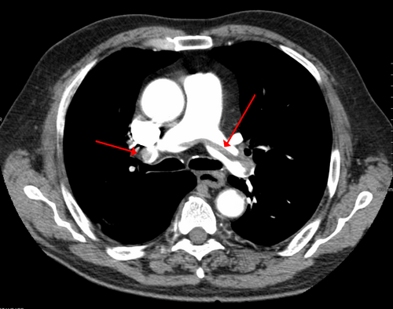
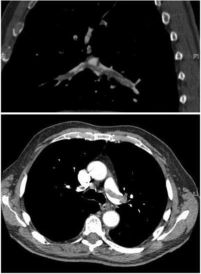

# EMBOLIA PULMONAR: DIAGNÓSTICO E TRATAMENTO

A embolia pulmonar (EP) não é uma doença isolada, mas sim a manifestação mais grave e potencialmente fatal do espectro do tromboembolismo venoso (TEV). Para entender a EP, você precisa visualizar o sistema circulatório como uma estrada de mão única onde um obstáculo súbito pode causar um engarrafamento catastrófico. Na maioria das vezes, esse obstáculo é um coágulo que se desprendeu das veias profundas dos membros inferiores, viajou pela veia cava, passou pelo átrio e ventrículo direitos e se alojou na circulação arterial pulmonar.

## Fisiopatologia: O Coração Direito sob Pressão

*Figura 1 - Angiotomografia computadorizada (CTPA) mostrando grande êmbolo em sela na bifurcação da artéria pulmonar. Fonte: James Heilman, MD, CC BY-SA 3.0 | Wikimedia Commons*

Por que o paciente com embolia pulmonar morre? Se você responder "porque ele não consegue respirar", você está apenas parcialmente correto. A principal causa de morte na EP aguda é a falência aguda do ventrículo direito (VD).

O ventrículo direito é uma câmara de baixa pressão, projetada para empurrar o sangue contra uma resistência vascular pulmonar muito baixa. Quando um trombo obstrui as artérias pulmonares, a resistência aumenta subitamente. O VD não tem tempo de se hipertrofiar para lidar com essa carga, ele simplesmente dilata. Essa dilatação desloca o septo interventricular para a esquerda, comprimindo o ventrículo esquerdo (VE).

O resultado é uma queda drástica no enchimento do VE (pré-carga), o que reduz o débito cardíaco sistêmico, levando à hipotensão e ao choque obstrutivo. Além disso, a distensão das fibras miocárdicas do VD aumenta o consumo de oxigênio e comprime as artérias coronárias que irrigam o próprio VD, gerando isquemia. É um ciclo vicioso: a isquemia piora a contratilidade, que piora a falência, que leva ao óbito.

No pulmão, o problema é o desequilíbrio ventilação, perfusão (V/Q). Temos áreas que são ventiladas, mas não são perfundidas pelo sangue (espaço morto alveolar). Isso gera hipoxemia, que é agravada pelo shunt intrapulmonar e pela redução do débito cardíaco. Entender essa mecânica é fundamental para compreender por que a estratificação de risco foca tanto na função do ventrículo direito.

## Quadro Clínico: O Camaleão da Emergência

A EP é conhecida como "a grande simuladora" porque seus sintomas são inespecíficos. O erro clássico de prova é esperar que todo paciente apresente a tríade clássica de dispneia, dor torácica pleurítica e hemoptise. Na vida real, essa tríade ocorre em menos de 20% dos casos.

### Sinais e Sintomas Típicos

A dispneia súbita é o sintoma mais comum. Muitas vezes, é a única queixa. A dor torácica pleurítica sugere uma embolia mais distal, próxima à pleura, podendo causar um pequeno infarto pulmonar. A taquicardia e a taquipneia são os sinais físicos mais frequentes.

### Sinais Atípicos e Pegadinhas

Cuidado com a síncope. Em provas de residência, um paciente idoso que apresenta síncope súbita sem pródromos deve sempre levantar a suspeita de EP de alto risco. A síncope aqui é um sinal de falência hemodinâmica transitória. Outro ponto importante é a febre, geralmente baixa (abaixo de 38,5°C), que pode confundir o diagnóstico com pneumonia.

**Exemplo Clínico:** Imagine uma paciente de 32 anos, usuária de anticoncepcional oral, que chega à emergência com dor súbita em pontada no hemitórax direito e taquipneia. O pulmão está limpo à ausculta. O diagnóstico diferencial imediato deve ser EP, não pneumonia ou ansiedade. Como diria o Dr. Will nas discussões de caso da MedEvo, "pulmão limpo em paciente com dispneia súbita e hipoxemia é EP até que se prove o contrário".

## A Jornada Diagnóstica: Probabilidade Pré-Teste

Você nunca deve pedir um exame de imagem para EP sem antes calcular a probabilidade clínica. Pedir angiotomografia para todo mundo gera diagnósticos falso-positivos, exposição desnecessária à radiação e custos elevados.

As diretrizes brasileiras (SBC, 2022) recomendam o uso de escores validados, sendo o Escore de Wells e o Escore de Genebra os mais utilizados.

### Tabela 1: Escore de Wells para Embolia Pulmonar

| Variável Clínica | Pontuação |
| --- | --- |
| Sinais clínicos de TVP (edema, dor à palpação) | 3,0 |
| Diagnóstico alternativo menos provável que EP | 3,0 |
| Frequência cardíaca > 100 bpm | 1,5 |
| Imobilização (> 3 dias) ou cirurgia nas últimas 4 semanas | 1,5 |
| Episódio prévio de TVP ou EP | 1,5 |
| Hemoptise | 1,0 |
| Câncer (em tratamento ou paliativo) | 1,0 |

**Interpretação (Versão Simplificada):**

- 0 a 1 ponto: EP improvável.

- 2 ou mais pontos: EP provável.

**Dica de Prova:** Se a banca fornecer o escore e ele for "improvável", o próximo passo é o D-dímero. Se for "provável", você pula o D-dímero e vai direto para a imagem (Angiotomografia). Nunca use o D-dímero para descartar EP em um paciente com alta probabilidade clínica, pois o valor preditivo negativo cai nessas situações.

## Exames Complementares: Quando e Por Que Pedir?

### D-dímero

O D-dímero é um produto da degradação da fibrina. Ele tem um altíssimo valor preditivo negativo. Ou seja, se ele vier baixo, você pode dizer com quase 100% de certeza que o paciente NÃO tem EP. No entanto, ele é pouco específico: trauma, cirurgia, câncer, gravidez e até a idade avançada podem aumentá-lo.

**Ajuste pela Idade:** Para pacientes acima de 50 anos, usamos o limite de (Idade x 10) µg/L. Um paciente de 80 anos com D-dímero de 700 µg/L tem um resultado normal, evitando exames de imagem desnecessários.

### Angiotomografia de Tórax (Angio-TC)

É o padrão-ouro atual. Ela permite visualizar o trombo diretamente como uma falha de enchimento nas artérias pulmonares.

- **Vantagem:** Diagnostica doenças alternativas (pneumonia, pneumotórax).

- **Limitação:** Requer contraste iodado (cuidado com insuficiência renal) e radiação.

### Ecocardiograma

Na EP, o eco não serve para ver o trombo (embora às vezes seja possível), mas para ver o impacto do trombo no coração. O sinal de McConnell (hipocinesia da parede livre do VD com preservação do ápice) é muito sugestivo.
**Importante:** Em pacientes instáveis (choque), o eco à beira do leito é o exame de escolha inicial. Se houver disfunção de VD em um paciente chocado sem outra causa óbvia, o tratamento de reperfusão pode ser iniciado imediatamente.

### Eletrocardiograma (ECG)

O achado mais comum é a taquicardia sinusal. O famoso padrão S1Q3T3 (onda S em D1, onda Q em D3 e T invertida em D3) é clássico de livros e provas, mas é pouco frequente na prática, indicando sobrecarga aguda de VD.

## Estratificação

*Figura 2 - Angiotomografia (CTPA) demonstrando êmbolo em sela e trombos em ambas as artérias pulmonares lobares. Fonte: Aung Myat e Arif Ahsan, CC BY 2.0 | Wikimedia Commons*
 de Risco: A Chave do Tratamento

Este é o ponto onde a maioria dos alunos se confunde. O tratamento não depende apenas do diagnóstico, mas do risco de morte do paciente.

### 1. Alto Risco (Instabilidade Hemodinâmica)

Definido pela presença de:

- Parada cardiorrespiratória.

- Choque obstrutivo (PAS < 90 mmHg ou necessidade de vasopressores).

- Hipotensão persistente (queda da PAS > 40 mmHg por mais de 15 minutos).

### 2. Risco Intermediário

Paciente estável hemodinamicamente, mas com sinais de sofrimento do VD.

- **Intermediário-Alto:** Disfunção de VD (no Eco ou TC) + Biomarcadores positivos (Troponina ou BNP).

- **Intermediário-Baixo:** Apenas um dos dois alterado (ou nenhum, mas com escore PESI elevado).

### 3. Baixo Risco

Paciente estável, sem disfunção de VD e sem elevação de biomarcadores. O escore PESI (ou sPESI) é usado aqui para identificar quem pode até ser tratado em casa.

### Tabela 2: Estratificação de Risco (SBC 2022)

| Risco | Instabilidade Hemodinâmica | Marcadores de Disfunção VD (Eco/TC) | Biomarcadores (Troponina/BNP) |
| --- | --- | --- | --- |
| **Alto** | Presente | Frequentemente presente | Frequentemente positivo |
| **Intermediário-Alto** | Ausente | Presente | Positivo |
| **Intermediário-Baixo** | Ausente | Presente OU Positivo | Presente OU Positivo |
| **Baixo** | Ausente | Ausente | Ausente |

## Tratamento da Embolia de Alto Risco

Pacientes de alto risco precisam de **REPERFUSÃO IMEDIATA**. O tempo é músculo cardíaco. Se o paciente está chocado, a prioridade é desobstruir a artéria pulmonar para aliviar o ventrículo direito.

### Terapia Trombolítica (Fibrinólise)

A primeira escolha é a trombólise sistêmica.

- **Alteplase (rtPA):** 100 mg em infusão contínua por 2 horas. Em situações de extrema urgência (PCR), pode-se fazer um bolus de 0,6 mg/kg (máximo 50 mg) em 15 minutos.

- **Estreptoquinase:** 1,5 milhão de UI em 2 horas. Menos usada hoje devido ao risco de reações alérgicas.

### Contraindicações à Trombólise

As bancas adoram cobrar isso. Você precisa decorar as absolutas. As relativas exigem julgamento clínico.

**Contraindicações Absolutas:**

- História de AVC hemorrágico ou AVC de origem desconhecida a qualquer tempo.

- AVC isquêmico nos últimos 6 meses.

- Neoplasia do Sistema Nervoso Central.

- Trauma de grande porte, cirurgia ou lesão craniana nas últimas 3 semanas.

- Sangramento interno ativo.

**Contraindicações Relativas:**

- Ataque isquêmico transitório (AIT) nos últimos 6 meses.

- Uso de anticoagulantes orais.

- Gravidez ou primeira semana pós-parto.

- Punções em locais não compressíveis.

- Ressuscitação traumática.

- Hipertensão refratária (PAS > 180 mmHg).

- Doença hepática avançada.

- Endocardite infecciosa.

- **Úlcera péptica ativa.**

**Pegadinha de Prova:** A alternativa dirá que a úlcera péptica é contraindicação absoluta. Errado. É relativa. Se o paciente está morrendo por EP maciça, você pode fazer o trombolítico e tratar o sangramento gástrico depois. A vida do paciente depende do alívio do VD.

## Tratamento da Embolia de Risco Não-Alto

Para pacientes estáveis (risco intermediário ou baixo), o pilar é a **ANTICOAGULAÇÃO**. O objetivo aqui não é dissolver o trombo (o próprio corpo fará isso com o tempo), mas evitar que o trombo cresça ou que novos trombos se formem.

### Fase Inicial (Primeiros 5 a 10 dias)

Podemos usar Heparina de Baixo Peso Molecular (Enoxaparina) ou Anticoagulantes Orais Diretos (DOACs).

- **Enoxaparina:** 1 mg/kg de 12/12h (subcutâneo). É a preferida em gestantes e pacientes com câncer (embora os DOACs estejam ganhando espaço no câncer).

- **Heparina Não Fracionada (HNF):** Reservada para pacientes com insuficiência renal grave (ClCr < 30 ml/min) ou aqueles que podem precisar de cirurgia em breve, devido à sua meia-vida curta e reversibilidade fácil.

### Anticoagulantes Orais Diretos (DOACs)

São a primeira escolha para a maioria dos pacientes hoje, segundo a SBC 2022.

- **Rivaroxabana:** 15 mg de 12/12h por 21 dias, seguido de 20 mg 1x ao dia. Não precisa de "ponte" com heparina.

- **Apixabana:** 10 mg de 12/12h por 7 dias, seguido de 5 mg 2x ao dia. Também não precisa de ponte.

- **Dabigatrana:** 150 mg de 12/12h, mas **exige** 5 dias de heparina parenteral antes de iniciar.

### Antagonistas da Vitamina K (Varfarina)

Ainda muito usada no Brasil pelo custo. Exige ponte com heparina por pelo menos 5 dias e até que o INR esteja entre 2,0 e 3,0 por dois dias consecutivos.

### Tabela 3: Doses dos Anticoagulantes na EP

| Droga | Dose Inicial | Dose de Manutenção |
| --- | --- | --- |
| Enoxaparina | 1 mg/kg SC 12/12h | - |
| Rivaroxabana | 15 mg VO 12/12h (21 dias) | 20 mg VO 1x/dia |
| Apixabana | 10 mg VO 12/12h (7 dias) | 5 mg VO 2x/dia |
| Varfarina | Iniciar com 5 mg (ajuste pelo INR) | Manter INR 2,0 - 3,0 |

## Situações Especiais

### Gestantes

A EP é uma das principais causas de morte materna. O diagnóstico é desafiador porque a dispneia e o edema de membros inferiores são comuns na gravidez.

- **Diagnóstico:** O D-dímero sobe naturalmente na gravidez, então sua utilidade é limitada. Se houver suspeita, o primeiro exame costuma ser o Doppler de MMII. Se positivo, trata-se como EP. Se negativo, procede-se para Cintilografia ou Angio-TC (a radiação para o feto é aceitável diante do risco de morte materna).

- **Tratamento:** DOACs e Varfarina são **proibidos** (teratogênicos ou risco de sangramento fetal). O tratamento é feito exclusivamente com Heparina (HBPM ou HNF) durante toda a gestação e por pelo menos 6 semanas após o parto.

### Pacientes com Câncer

O câncer gera um estado de hipercoagulabilidade. A recomendação clássica era HBPM por tempo prolongado, mas diretrizes recentes já aceitam o uso de Edoxabana ou Rivaroxabana, exceto em tumores gastrointestinais ou geniturinários pelo alto risco de sangramento local.

### Insuficiência Renal

Pacientes com ClCr < 30 ml/min não devem usar DOACs ou Enoxaparina em doses plenas sem monitorização rigorosa (nível de anti-Xa). A Heparina Não Fracionada com ajuste pelo TTPa é a estratégia mais segura.

## Duração do Tratamento

Quanto tempo manter a anticoagulação?

- **Fator de risco provocado e reversível (ex: cirurgia recente):** 3 meses.

- **Primeiro episódio idiopático (sem causa óbvia):** Pelo menos 3 a 6 meses, com reavaliação para decidir se mantém indefinidamente.

- **EP recorrente ou fator de risco persistente (ex: câncer ativo, SAF):** Tempo indeterminado (anticoagulação "para sempre").

## Filtro de Veia Cava Inferior (FVCI)

Muitos alunos acham que o filtro é uma alternativa à anticoagulação. Errado. O filtro de veia cava tem indicações muito precisas:

- **Contraindicação absoluta à anticoagulação** em paciente com EP aguda ou TVP proximal.

- **Recorrência de EP** mesmo com anticoagulação adequada (falha terapêutica).

O filtro não dissolve o trombo, ele apenas impede que trombos grandes cheguem ao pulmão. Ele aumenta o risco de TVP a longo prazo, por isso deve ser retirado assim que a anticoagulação puder ser iniciada.

## Complicações e Prognóstico

A complicação crônica mais temida é a Hipertensão Pulmonar Tromboembólica Crônica (HPTEC). Ocorre em cerca de 2 a 4% dos pacientes após uma EP. Se o paciente mantém dispneia após 3 meses de tratamento adequado, você deve investigar HPTEC com ecocardiograma e, se necessário, cintilografia V/Q.

## Pontos-Chave para Prova

- A principal causa de morte na EP aguda é a **falência ventricular direita aguda** (choque obstrutivo).

- O **Escore de Wells** deve ser aplicado antes de qualquer exame. Se "EP improvável", peça D-dímero. Se "EP provável", peça Angio-TC.

- O **D-dímero** tem alto valor preditivo negativo. Use o ajuste de idade: (Idade x 10) para maiores de 50 anos.

- O **Ecocardiograma** é o exame inicial no paciente instável (choque). O sinal de McConnell é o achado clássico.

- **EP de Alto Risco** = Instabilidade Hemodinâmica. Conduta: Trombólise sistêmica (Alteplase 100 mg em 2h).

- **Contraindicações Absolutas à Trombólise:** AVC hemorrágico prévio, AVC isquêmico < 6 meses, neoplasia de SNC, trauma/cirurgia recente < 3 semanas, sangramento ativo.

- **Úlcera péptica ativa** e **anticoagulação oral** são contraindicações RELATIVAS à trombólise.

- **DOACs** (Rivaroxabana, Apixabana) são a primeira escolha no paciente estável. Rivaroxabana e Apixabana dispensam ponte com heparina.

- **Dabigatrana** e **Varfarina** EXIGEM ponte com heparina parenteral por pelo menos 5 dias.

- Em **gestantes**, o tratamento é feito exclusivamente com **Heparina** (HBPM ou HNF). DOACs e Varfarina são contraindicados.

- O **Filtro de Veia Cava** só é indicado se houver contraindicação absoluta à anticoagulação ou falha terapêutica comprovada.

- A duração padrão do tratamento para um fator de risco reversível é de **3 meses**.

- **Erro clássico:** Achar que S1Q3T3 é o achado mais comum no ECG. O mais comum é a taquicardia sinusal.

- **Pegadinha:** A banca pode dizer que o paciente tem EP de "risco intermediário-alto" e perguntar se faz trombólise. A resposta é NÃO. Trombólise de rotina para risco intermediário não é indicada (estudo PEITHO), apenas se houver deterioração clínica.

- Lembre-se da MedEvo: a estratificação de risco define a conduta. Estável = Anticoagulação. Instável = Reperfusão.

 Cópia offline para consulta pessoal.
 Fonte original:
 [https://www.medevo.com.br/material-apoio/ler/4c8f326f-b3e6-4189-92a1-401062e7cca2](https://www.medevo.com.br/material-apoio/ler/4c8f326f-b3e6-4189-92a1-401062e7cca2)
