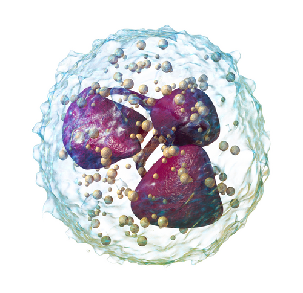
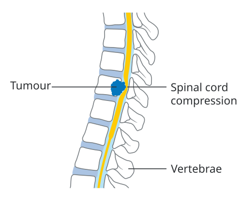

# EMERGÊNCIAS ONCOLÓGICAS: NEUTROPENIA FEBRIL, HIPERCALCEMIA E COMPRESSÃO MEDULAR

## Neutropenia Febril: prioridade terapêutica

*Figura 1 - Ilustração de neutrófilo, célula de defesa cuja queda abaixo de 500/mm³ define a neutropenia e aumenta o risco de infecções graves. Fonte: BruceBlaus/Blausen Medical, CC BY-SA 4.0 | Wikimedia Commons*

A neutropenia febril é uma emergência tempo-dependente. A ausência de resposta neutrofílica efetiva permite que translocação bacteriana intestinal, infecção relacionada a cateter ou foco respiratório evoluam rapidamente para sepse e choque. Por isso, a avaliação deve ser simultânea ao início do tratamento, sem aguardar todos os resultados laboratoriais.

Abordagem inicial das emergências oncológicas

Febre + neutropenia → culturas + antibiótico antipseudomonas imediato
Cálcio elevado sintomático → hidratação vigorosa + anti-reabsortivo conforme gravidade
Risco de lise tumoral → hidratação + monitorização + alopurinol ou rasburicase
Dor lombar/deficit neurológico em câncer → dexametasona + RM urgente + oncologia/neurocirurgia

### Definição e Critérios Diagnósticos

Os valores diagnósticos devem ser reconhecidos com precisão. Em geral, utiliza-se:

- **Febre:** Uma única medida oral ≥ 38,3°C OU medidas ≥ 38,0°C sustentadas por pelo menos 1 hora.

- **Neutropenia:** Contagem Absoluta de Neutrófilos (CAN) < 500 células/mm³ OU uma contagem < 1.000 células/mm³ com previsão de queda para < 500 nas próximas 48 horas.

**Ponto clínico:** CAN entre 500 e 1.000 células/mm³ deve ser interpretada no contexto. Se houver previsão de queda para < 500 células/mm³ nas próximas 48 horas, o quadro deve ser manejado como neutropenia febril.

### Fisiopatologia: O Inimigo Vem de Dentro

A maioria das infecções na NF não vem de fora, mas da própria microbiota do paciente (especialmente o trato gastrointestinal). A quimioterapia causa mucosite, destruindo a barreira física, e a neutropenia destrói a barreira celular.

Historicamente, os Gram-positivos (Staphylococcus, Streptococcus) são mais frequentes devido ao uso de cateteres, mas os **Gram-negativos (especialmente *Pseudomonas aeruginosa*) são os que matam mais rápido**. É por isso que todo esquema inicial DEVE cobrir Pseudomonas.

### Estratificação de Risco: O Escore MASCC

Nem todo paciente com neutropenia febril exige internação prolongada com antibiótico venoso. O escore do *Multinational Association for Supportive Care in Cancer* (MASCC) auxilia a identificar baixo risco, desde que a avaliação clínica confirme estabilidade e possibilidade de seguimento seguro.

| Característica Clínica | Pontuação |
| --- | --- |
| Carga da doença: sintomas leves ou ausentes | 5 |
| Sem hipotensão arterial (PAS > 90 mmHg) | 5 |
| Sem DPOC | 4 |
| Tumor sólido ou sem infecção fúngica prévia | 4 |
| Sem desidratação | 3 |
| Carga da doença: sintomas moderados | 3 |
| Paciente ambulatorial no início da febre | 2 |
| Idade < 60 anos | 2 |

**Interpretação:**

- **Baixo Risco (MASCC ≥ 21):** Risco de complicações < 5%. Pode-se considerar tratamento oral e ambulatorial.

- **Alto Risco (MASCC < 21):** Internação obrigatória e antibiótico venoso.

**Critério prático:** instabilidade hemodinâmica, dor abdominal importante, intolerância à via oral, alteração do estado geral ou comorbidades graves caracterizam alto risco, independentemente do escore MASCC. A avaliação clínica se sobrepõe ao escore quando há sinais de gravidade.

### Manejo terapêutico: antibiótico imediato

O antibiótico deve ser iniciado idealmente em até 60 minutos. Culturas devem ser coletadas quando possível, mas a coleta não deve atrasar o início do antimicrobiano.

- **Monoterapia inicial em alto risco:** cefepime é opção frequente por cobrir *Pseudomonas* e muitos Gram-negativos relevantes. Piperacilina-tazobactam ou carbapenêmicos podem ser usados conforme gravidade, colonização prévia, risco de ESBL e protocolo institucional.

- **Quando adicionar vancomicina?** Não é rotina para todos os casos. Deve ser reservada para situações específicas:

- Instabilidade hemodinâmica (choque).

- Infecção óbvia de pele ou partes moles.

- Suspeita de infecção relacionada a cateter.

- Pneumonia documentada.

- Colonização prévia por MRSA.

- **Baixo Risco (Ambulatorial):** Ciprofloxacino + Amoxicilina com Clavulanato.

**Exemplo clínico:** paciente com câncer de mama pós-quimioterapia, febre, estabilidade hemodinâmica e MASCC alto pode ser candidata a tratamento oral ambulatorial se houver baixo risco, boa adesão, suporte familiar e acesso rápido ao hospital. Hipotensão, toxemia ou comorbidades deslocam a conduta para internação e antibiótico venoso imediato.

### O Paciente que não Melhora

Febre persistente após 4 a 7 dias de antibiótico de amplo espectro deve levantar suspeita de **infecção fúngica invasiva** (aspergilose, candidíase), especialmente em neutropenia profunda ou prolongada.

- **Sinal do Halo na TC de Tórax:** Patognomônico de Aspergilose invasiva em neutropênicos. Conduta: Adicionar antifúngico (Voriconazol ou Anfotericina B).

## Hipercalcemia da Malignidade: O Cálcio que Entope e Confunde

A hipercalcemia é a emergência metabólica mais comum na oncologia. Ela aparece em cerca de 20-30% dos pacientes com câncer avançado.

### Fisiopatologia: Os Três Caminhos

A avaliação precisa entender o "porquê" para não esquecer o tratamento.

- **PTHrP (Proteína Relacionada ao PTH):** Responsável por 80% dos casos. O tumor (especialmente o Carcinoma Epidermoide de Pulmão e Rim) secreta essa proteína que imita o PTH, tirando cálcio do osso e impedindo a excreção renal. Isso é chamado de Hipercalcemia Humoral da Malignidade.

- **Osteólise Local:** Metástases ósseas (Mama, Mieloma Múltiplo) ativam osteoclastos que "derretem" o osso.

- **Produção de Vitamina D (Calcitriol):** Comum em Linfomas.

### Quadro Clínico: "Bones, Stones, Groans, and Psychic Overtones"

- **Renal:** Poliúria e polidipsia. O cálcio alto causa um Diabetes Insipidus Nefrogênico (o rim para de responder ao ADH). Isso leva a uma desidratação severa, que piora a hipercalcemia (círculo vicioso).

- **TGI:** Constipação severa, náuseas e vômitos.

- **Neurológico:** Letargia, confusão mental e, em casos graves, coma.

- **Cardíaco:** Encurtamento do intervalo QT no ECG.

### Diagnóstico e Classificação

Sempre peça o **Cálcio Iônico** ou corrija o Cálcio Total pela Albumina.

- Fórmula: Ca Corrigido = Ca medido + [0,8 x (4 - Albumina)].

- **Leve:** 10,5 - 12 mg/dL.

- **Moderada:** 12 - 14 mg/dL.

- **Grave:** > 14 mg/dL (Emergência médica!).

### Tratamento: Hidratar é a Regra de Ouro

O primeiro passo terapêutico é restaurar a volemia. A hipercalcemia causa poliúria e desidratação; por isso, hidratação adequada precede e acompanha terapias anti-reabsortivas.

- **Hidratação Vigorosa (Passo 1):** Soro Fisiológico 0,9% (200-500 ml/h). O objetivo é restaurar a volemia e aumentar a excreção urinária de cálcio.

- **Furosemida:** Só use APÓS o paciente estar euvolêmico. Serve para forçar a calciúria. Nunca use tiazídicos (eles aumentam a reabsorção de cálcio!).

- **Bisfosfonatos (Zoledronato ou Pamidronato):** Inibem os osteoclastos. Demoram 24-72h para agir. São fundamentais para manter o cálcio baixo a longo prazo.

- **Calcitonina:** Age rápido (horas), mas tem efeito curto (taquifilaxia). Usada em casos graves (>14) enquanto o bisfosfonato não faz efeito.

- **Denosumabe:** Opção para casos refratários aos bisfosfonatos ou em pacientes com insuficiência renal grave.

**Ponto clínico:** câncer de próstata raramente causa hipercalcemia. As metástases costumam ser osteoblásticas, o que pode se associar a **hipocalcemia**. Diante de câncer de próstata com cálcio elevado, outras causas devem ser consideradas.

## Síndrome de Lise Tumoral (SLT): emergência metabólica

A síndrome de lise tumoral é um diagnóstico diferencial metabólico essencial em oncologia. Ocorre quando há destruição rápida de células tumorais, espontânea ou após tratamento, especialmente em linfomas de alto grau e leucemias agudas, com liberação maciça de conteúdo intracelular.

### Alterações laboratoriais típicas

As alterações típicas são:

- **Hipercalemia:** O potássio sai da célula. Risco de arritmia.

- **Hiperfosfatemia:** O fósforo sai da célula.

- **Hipocalcemia:** O fósforo alto se liga ao cálcio e precipita nos tecidos e rins. **Cuidado:** Na SLT o cálcio BAIXA, na Hipercalcemia da Malignidade ele SOBE.

- **Hiperuricemia:** O DNA quebrado vira ácido úrico, que entope os túbulos renais (IRA).

### Prevenção e Tratamento

- **Hidratação:** Sempre o pilar.

- **Alopurinol:** Inibe a formação de novo ácido úrico (profilaxia).

- **Rasburicase:** Degrada o ácido úrico já formado (tratamento da lise instalada).

- **Alcalinização urinária:** caiu em desuso na maior parte dos protocolos porque pode favorecer precipitação de fosfato de cálcio. A estratégia central é hidratação, monitorização e hipouricemiantes conforme risco.

## Compressão Medular Neoplásica: A Urgência Neurológica

*Figura 2 - Diagrama mostrando tumor vertebral causando compressão da medula espinhal, emergência oncológica que requer diagnóstico e tratamento imediatos. Fonte: Cancer Research UK, CC BY-SA 4.0 | Wikimedia Commons*

Aqui, o objetivo é evitar a paraplegia definitiva. Uma vez que o paciente perde a força e a sensibilidade, a chance de recuperação é mínima.

### Fisiopatologia e Localização

Ocorre geralmente por metástases vertebrais que crescem para o canal medular ou por colapso da vértebra.

- **Local mais comum:** Coluna Torácica (70%), seguida da Lombar e Cervical.

- **Tumores que mais causam:** Pulmão, Mama e Próstata (os "campeões" de metástase óssea).

### Quadro Clínico: A Progressão é a Chave

- **Dor Lombar (90% dos casos):** É o primeiro sintoma. Diferente da dor mecânica, a dor neoplásica piora ao deitar (dor noturna) e com a manobra de Valsalva.

- **Fraqueza Muscular:** Evolui para dificuldade de deambular.

- **Alteração Sensorial:** Nível sensitivo bem definido.

- **Disfunção Autonômica:** Retenção urinária e incontinência fecal (sinal tardio e de mau prognóstico).

### Diagnóstico: O Padrão-Ouro

O exame de escolha é a **ressonância magnética de toda a coluna**. A avaliação de toda a coluna é importante porque 10-30% dos pacientes podem ter múltiplos focos de compressão. A tomografia pode ser alternativa quando a RM não está disponível ou é contraindicada, mas é menos sensível para avaliação medular.

### Tratamento: Descomprimir para Salvar

- **Corticoterapia (dexametasona):** deve ser iniciada diante de suspeita clínica relevante, especialmente se houver déficit neurológico agudo, para reduzir edema vasogênico ao redor da medula. Um esquema clássico é dose de ataque de 10 mg IV, seguida de 4 mg a cada 6 horas, ajustada ao protocolo local.

- **Radioterapia:** Tratamento padrão para a maioria dos tumores radiossensíveis.

- **Cirurgia (Descompressão):** Indicada se houver instabilidade da coluna, fragmento ósseo comprimindo a medula ou se o tumor for radiorresistente.

## Tabelas Comparativas para Revisão Rápida

### Tabela 1: Diagnóstico diferencial de dor lombar

| Característica | Dor Mecânica (Comum) | Dor Neoplásica (Compressão) |
| --- | --- | --- |
| **Início** | Agudo, após esforço | Insidioso, progressivo |
| **Melhora com** | Repouso | Movimentação leve (às vezes) |
| **Piora com** | Movimento | Deitar-se (dor noturna) |
| **Sintomas Associados** | Nenhum | Perda de peso, febre, déficit motor |

### Tabela 2: Distúrbios Eletrolíticos na SLT vs. Hipercalcemia

| Eletrólito | Síndrome de Lise Tumoral | Hipercalcemia da Malignidade |
| --- | --- | --- |
| **Cálcio** | Baixo (Hipocalcemia) | Alto (Hipercalcemia) |
| **Fósforo** | Alto | Normal ou Baixo |
| **Potássio** | Alto | Normal |
| **Ácido Úrico** | Muito Alto | Normal |

### Tabela 3: Antibioticoterapia na Neutropenia Febril

| Cenário | Conduta Inicial |
| --- | --- |
| **Baixo Risco (MASCC ≥ 21)** | Ciprofloxacino + Amoxicilina/Clavulanato (VO) |
| **Alto Risco (Estável)** | Cefepime (IV) |
| **Alto Risco (Choque/Cateter)** | Cefepime + Vancomicina (IV) |
| **Alergia Grave a Penicilina** | Ciprofloxacino + Clindamicina |

## Síntese Clínica

- **Neutropenia Febril:** Neutrófilos < 500 + Febre (38,3°C uma vez ou 38,0°C por 1h). É uma emergência médica.

- **Tempo porta-antibiótico:** iniciar antibiótico antipseudomonas idealmente em até 60 minutos; exames não devem atrasar a terapia.

- **Cobertura Obrigatória:** *Pseudomonas aeruginosa* deve sempre ser coberta no esquema inicial.

- **MASCC:** ≥ 21 é baixo risco (pode tratar em casa); < 21 é alto risco (interna).

- **Hipercalcemia Grave:** Cálcio > 14 mg/dL. A primeira medida é sempre Hidratação com SF 0,9% (2-4 litros/dia).

- **Mecanismo da Hipercalcemia:** Principalmente secreção de PTHrP (tumores de pulmão, rim, cabeça e pescoço).

- **O que NÃO fazer na Hipercalcemia:** Não use diuréticos tiazídicos. Não use Furosemida antes de hidratar o paciente.

- **Compressão Medular:** A dor lombar que piora ao deitar é o sinal de alerta. O exame de escolha é a RM de coluna total.

- **Dexametasona:** Iniciar imediatamente na suspeita de compressão medular para reduzir edema.

- **Síndrome de Lise Tumoral:** Causa HIPOCALCEMIA (o cálcio precipita com o fósforo alto). O tratamento inclui hidratação e Rasburicase.

- **Sinal do Halo:** Na TC de tórax de um neutropênico febril persistente, sugere Aspergilose Pulmonar Invasiva.

- **Câncer de Próstata:** Frequentemente causa metástases blásticas e pode cursar com hipocalcemia, não hipercalcemia.

- **Contraindicação na NF:** Evite toques retais ou colonoscopias pelo risco de translocação bacteriana e trauma de mucosa.

- **Vômitos Matutinos:** Em paciente oncológico, pense em Hipertensão Intracraniana (metástase cerebral) e não em causa gástrica. 🧠

 Cópia offline para consulta pessoal.
 Fonte original:
 [https://www.medevo.com.br/material-apoio/ler/2fd07d8f-f370-449b-b8b9-fe330aac1db2](https://www.medevo.com.br/material-apoio/ler/2fd07d8f-f370-449b-b8b9-fe330aac1db2)
