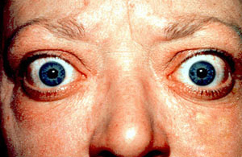

# EMERGÊNCIAS TIREOIDIANAS: CRISE TIREOTÓXICA E COMA MIXEDEMATOSO

As emergências tireoidianas representam os dois extremos de descompensação da glândula tireoide. De um lado, temos o acelerador travado no máximo (Crise Tireotóxica); do outro, o sistema parando por completo (Coma Mixedematoso). Embora raras, ambas possuem uma mortalidade assustadora se você, no plantão, não souber identificar os sinais precoces.

O segredo para as provas de residência e para a vida prática não é decorar valores isolados de TSH, mas entender que essas condições são diagnósticos **clínicos**. Se você esperar o resultado do laboratório para começar o tratamento, o paciente pode não estar mais lá quando o laudo chegar.

## Crise Tireotóxica (Tempestade Tireoidiana)

*Figura 1 - Proptose ocular e retração palpebral bilateral em paciente com Doença de Graves, causa mais comum de crise tireotóxica. Fonte: Jonathan Trobe, MD, CC BY 3.0 | Wikimedia Commons*

A crise tireotóxica não é apenas um hipertireoidismo "um pouco pior". É um estado de hipermetabolismo crítico. Imagine que o corpo perdeu a capacidade de dissipar calor e de regular a resposta às catecolaminas.

### Fisiopatologia: Por que o paciente "explode"?

Muitos alunos acham que a crise ocorre porque os níveis de T4 e T3 estão estratosféricos. Errado. Frequentemente, os níveis hormonais são semelhantes aos de um hipertireoidismo comum. O que muda na crise é a **biodisponibilidade** (aumento da fração livre) e, principalmente, um aumento abrupto da sensibilidade dos receptores às catecolaminas, geralmente gatilhado por um fator estressante.

Os principais gatilhos que as bancas adoram cobrar são:

- Infecções (o mais comum).

- Cirurgias (especialmente tireoidectomia em paciente mal preparado).

- Carga de iodo (contraste iodado ou amiodarona).

- Abandono do tratamento com tionamidas (Metimazol/PTU).

- Cetoacidose diabética ou TEP.

### Quadro Clínico e o Escore de Burch-Wartofsky

O paciente clássico de prova é aquele com diagnóstico prévio de Doença de Graves que chega agitado, febril e taquicárdico. Mas cuidado: a febre aqui não é 37,8°C; é hipertermia real, muitas vezes acima de 40°C.

Para sistematizar isso, usamos o **Escore de Burch-Wartofsky**. Você não precisa decorar cada ponto, mas precisa saber quais sistemas ele avalia. Se a pontuação for **≥ 45**, o diagnóstico de crise tireotóxica é altamente provável.

| Critério Avaliado | Sinais de Gravidade |
| --- | --- |
| **Termorregulação** | Febre (quanto maior, mais pontos). |
| **Sistema Nervoso Central** | Agitação, psicose, convulsão e coma. |
| **Disfunção Gastrointestinal** | Diarreia, náuseas/vômitos ou icterícia (sinal de mau prognóstico). |
| **Frequência Cardíaca** | Taquicardia proporcional à febre ou Fibrilação Atrial. |
| **Insuficiência Cardíaca** | Edema, estertores, choque cardiogênico. |
| **Evento Precipitante** | Presença de um gatilho (ex: infecção). |

**Dica de Prova:** Se a questão descreve um paciente com hipertireoidismo e **disfunção orgânica** (especialmente alteração de consciência ou icterícia), marque Crise Tireotóxica sem medo.

### O Manejo Farmacológico: Os 4 Pilares

Aqui é onde a maioria dos alunos erra a ordem das medicações. No MedEvo, sempre reforçamos: a ordem dos fatores altera, sim, o produto.

#### 1. Bloqueio da Ação Periférica (Betabloqueadores)

O **Propranolol** é a droga de escolha. Por quê? Além de controlar a taquicardia e a agitação (efeito beta-1 e beta-2), em doses altas ele inibe a conversão periférica de T4 em T3 (o hormônio realmente ativo).

- **Dose:** 60-80 mg via oral (ou sonda) a cada 6 horas.

- **Cuidado:** Se o paciente tiver asma grave ou insuficiência cardíaca descompensada, podemos considerar o Esmolol (curta duração) ou bloqueadores de canais de cálcio (Diltiazem), embora menos eficazes para a crise.

#### 2. Bloqueio da Síntese Hormonal (Tionamidas)

Aqui usamos o **Propiltiouracil (PTU)** preferencialmente ao Metimazol.

- **Por que PTU?** Porque, assim como o propranolol, o PTU também inibe a conversão periférica de T4 em T3. O Metimazol só bloqueia a síntese na glândula.

- **Dose:** Ataque de 600-1000 mg, seguido de 200 mg a cada 4 horas.

#### 3. Bloqueio da Liberação Hormonal (Iodo)

Aqui está a maior pegadinha das provas. Você **NUNCA** deve dar iodo antes da tionamida.

- **O Porquê:** Se você der iodo primeiro, a tireoide vai usar esse iodo como combustível para fabricar ainda mais hormônio (Efeito Jod-Basedow).

- **A Regra:** Administre o Iodo (Lugol ou Ácido Iopanoico) pelo menos **1 hora APÓS** a primeira dose de PTU. Isso garante que a fábrica (tireoide) esteja bloqueada antes de chegar a matéria-prima (iodo). O iodo agudo causa o efeito *Wolff-Chaikoff* (paralisia temporária da liberação de hormônios).

#### 4. Bloqueio da Conversão Periférica e Suporte Adrenal (Corticoides)

Usamos **Hidrocortisona** (100 mg IV 8/8h) ou Dexametasona.

- **Por que?** 1) Inibe a conversão de T4 em T3. 2) Trata uma possível insuficiência adrenal relativa (o metabolismo está tão alto que o cortisol do paciente não dá conta).

**Atenção com a Aspirina (AAS):** É contraindicação absoluta para febre na crise tireotóxica. O AAS desloca o T4 da sua proteína carregadora (TBG), aumentando os níveis de hormônio livre e piorando a crise. Use Paracetamol ou Dipirona.

## Coma Mixedematoso

*Figura 2 - Esquema do eixo hipotálamo-hipófise-tireoide mostrando a regulação hormonal (TRH, TSH, T3/T4) e mecanismo de feedback negativo cuja falência leva ao coma mixedematoso. Fonte: Mikael Häggström, domínio público | Wikimedia Commons*

Se a crise tireotóxica é o incêndio, o coma mixedematoso é o congelamento. É o estágio final do hipotireoidismo não tratado ou mal tratado, com uma mortalidade que chega a 40%.

### O Perfil do Paciente e Gatilhos

Geralmente é uma paciente idosa, no inverno, que já tinha hipotireoidismo e parou o remédio ou sofreu um insulto agudo (infarto, infecção, uso de sedativos).

**Lembre-se da Tríade Clássica:**

- **Alteração do sensório:** Não precisa ser coma profundo; torpor ou confusão mental já contam.

- **Hipotermia:** Frequentemente abaixo de 35°C. Se um paciente em coma mixedematoso tiver temperatura "normal" (36,5°C), suspeite de infecção oculta!

- **Fator Precipitante:** Exposição ao frio, AVC, pneumonia ou uso de opioides/benzodiazepínicos.

### Achados Laboratoriais Específicos

Além do TSH muito alto e T4L muito baixo (geralmente indetectável), você encontrará:

- **Hiponatremia:** É uma hiponatremia dilucional (excesso de ADH e dificuldade de excretar água livre). O sódio corporal total é normal ou alto, mas o plasmático está baixo.

- **Hipoglicemia:** Pela redução do metabolismo e possível insuficiência adrenal associada.

- **Hipercapnia:** O paciente "esquece" de respirar (depressão respiratória central e fraqueza muscular).

### Tratamento: O Tempo é Neurônio (e Miocárdio)

O tratamento deve ser iniciado na suspeita clínica, preferencialmente em UTI.

#### 1. Reposição Hormonal

O ideal seria Levotiroxina (T4) IV, mas como não temos disponível facilmente no Brasil, usamos via sonda nasogástrica.

- **Dose de ataque:** 200 a 400 mcg, seguido de dose de manutenção (1,6 mcg/kg/dia).

- **Discussão T3 vs T4:** Alguns especialistas sugerem adicionar T3 (Liotiroxina), pois a conversão de T4 em T3 está prejudicada no paciente grave. No entanto, o T3 aumenta o risco de arritmias em idosos.

#### 2. Corticoterapia Empírica (Obrigatória)

Como professor, já vi muitos alunos esquecerem disso. Você **DEVE** iniciar Hidrocortisona (100 mg IV 8/8h) **ANTES** ou junto com a Levotiroxina.

- **O Porquê:** O hipotireoidismo grave pode estar associado à insuficiência adrenal (Síndrome de Schmidt) ou a reserva adrenal pode ser insuficiente para o aumento do metabolismo provocado pela reposição de T4. Se você der T4 sozinho, pode precipitar uma crise adrenal fatal.

#### 3. Medidas de Suporte

- **Aquecimento Passivo:** Use mantas térmicas. Evite aquecimento ativo agressivo (como banhos quentes), pois a vasodilatação periférica súbita pode causar choque circulatório.

- **Restrição Hídrica:** Para tratar a hiponatremia dilucional.

- **Ventilação Mecânica:** Frequentemente necessária pela macroglossia e depressão respiratória.

## Diagnósticos Diferenciais e Situações Especiais

### Tireoidite Subaguda (De Quervain)

Muitas questões de prova tentam confundir a crise tireotóxica com a tireoidite subaguda.

- **A pista:** Paciente com dor cervical anterior importante, que irradia para a mandíbula ou ouvidos, geralmente após uma infecção viral respiratória.

- **O exame:** VHS muito elevado e **Cintilografia com captação de iodo quase zero** (tireoide "branca" ou "fria").

- **Tratamento:** Não se usa tionamida (não há excesso de produção, apenas vazamento de hormônio estocado). Usa-se AINEs ou Prednisona para a dor e Propranolol para os sintomas adrenérgicos.

### Tireotoxicose por Amiodarona

A amiodarona é rica em iodo e pode causar tireotoxicose por dois mecanismos:

- **Tipo 1:** Excesso de iodo em quem já tinha bócio (hiperprodução). Tratamento: Tionamidas.

- **Tipo 2:** Inflamação e destruição da glândula (tireoidite). Tratamento: **Corticoides**.

- **Dica MedEvo:** No Doppler, o Tipo 1 tem fluxo aumentado; o Tipo 2 tem fluxo reduzido (glândula "fria").

## Tabelas Comparativas para Revisão Rápida

### Tabela 1: Crise Tireotóxica vs. Coma Mixedematoso

| Característica | Crise Tireotóxica | Coma Mixedematoso |
| --- | --- | --- |
| **Temperatura** | Hipertermia (> 38,5°C) | Hipotermia (< 35,5°C) |
| **Estado Mental** | Agitação, Psicose, Delirium | Torpor, Coma, Lentidão |
| **Frequência Cardíaca** | Taquicardia, Fibrilação Atrial | Bradicardia Sinusal |
| **Sódio Sérico** | Geralmente normal | Hiponatremia Dilucional |
| **Glicemia** | Tendência a Hiperglicemia | Tendência a Hipoglicemia |
| **Principal Droga** | PTU + Propranolol + Iodo + Corticoide | Levotiroxina + Hidrocortisona |

### Tabela 2: Ordem das Medicações na Crise Tireotóxica

| Ordem | Medicação | Objetivo |
| --- | --- | --- |
| **1º** | Propranolol | Controle adrenérgico e bloqueio T4 -> T3. |
| **2º** | PTU (ou Metimazol) | Bloqueio da síntese de novos hormônios. |
| **3º** | Hidrocortisona | Suporte adrenal e bloqueio T4 -> T3. |
| **4º** | Lugol (1h após PTU) | Bloqueio da liberação (Efeito Wolff-Chaikoff). |

### Tabela 3: Diagnóstico Diferencial das Tireoidites

| Tipo | Clínica | Laboratório | Conduta |
| --- | --- | --- | --- |
| **Graves** | Bócio difuso, exoftalmia | TRAb (+), Captação iodo alta | Metimazol / Iodo / Cirurgia |
| **Subaguda** | Dor cervical, pós-viral | VHS alto, Captação iodo baixa | AINE / Corticoide |
| **Factícia** | Ingestão oculta de T4 | Tiroglobulina baixa, Captação baixa | Suspender medicação |

## Pontos-Chave para Prova

- **Diagnóstico Clínico:** Não espere o TSH para tratar. Se o escore de Burch-Wartofsky for ≥ 45, a conduta é imediata.

- **O Erro do Iodo:** Nunca dê iodo antes de bloquear a glândula com tionamidas (mínimo 1 hora de intervalo).

- **Aspirina é Proibida:** Na crise tireotóxica, o AAS aumenta o T4 livre. Use Paracetamol.

- **Propranolol na Crise:** É a escolha pela inibição adicional da conversão periférica de T4 em T3.

- **Hidrocortisona no Coma:** Sempre inicie antes da Levotiroxina para evitar crise adrenal precipitada.

- **Hiponatremia no Coma:** É dilucional. O tratamento é restrição hídrica, não necessariamente salina hipertônica (a menos que sódio < 120 com convulsão).

- **Tiroglobulina:** É o marcador para diferenciar tireotoxicose factícia (baixa) de tireoidites (alta).

- **Efeito Wolff-Chaikoff:** É a inibição da liberação de hormônios tireoidianos pelo excesso de iodo (base do uso do Lugol).

- **Febre no Coma Mixedematoso:** Se a temperatura estiver normal ou alta, procure infecção agressivamente. O esperado é hipotermia.

- **Bradicardia e Bradipneia:** São as marcas registradas do coma mixedematoso, junto com o rebaixamento de consciência.

- **Tireoidite de De Quervain:** Dor cervical + VHS alto + Captação de iodo baixa. Tratamento é sintomático (AINE/Corticoide), não use tionamidas.

- **Fatores Precipitantes:** Sempre procure por infecção, IAM ou uso de drogas depressoras do SNC em ambos os quadros. 💡

 Cópia offline para consulta pessoal.
 Fonte original:
 [https://www.medevo.com.br/material-apoio/ler/57b18ef5-c1a7-4b48-ad8a-fa1bc0b2d5bd](https://www.medevo.com.br/material-apoio/ler/57b18ef5-c1a7-4b48-ad8a-fa1bc0b2d5bd)
