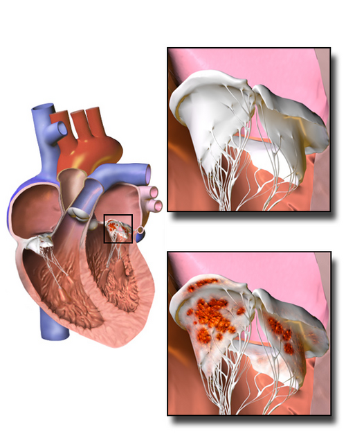
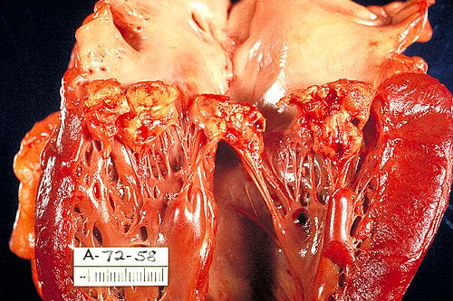

# ENDOCARDITE INFECCIOSA: CRITÉRIOS DE DUKE, ANTIBIÓTICO E INDICAÇÕES CIRÚRGICAS

A Endocardite Infecciosa (EI) é uma daquelas doenças que separa o "decorador de rodapé de livro" do médico que realmente entende a fisiopatologia. Para a sua prova de residência, não basta saber que o paciente tem febre e sopro. Você precisa entender por que o *Staphylococcus aureus* destrói a valva em dias, enquanto o *Streptococcus viridans* leva semanas, e por que a conduta muda completamente se o paciente tem uma prótese valvar.

Neste material, vamos dissecar a EI focando no que as bancas amam: os Critérios de Duke (atualizados), as escolhas de antibióticos e o timing cirúrgico.

## Fisiopatologia: O Triângulo da Vegetação

*Figura 1 - Ilustração de endocardite infecciosa mostrando vegetação bacteriana aderida à valva cardíaca com destruição valvular. Fonte: BruceBlaus, CC BY-SA 4.0 | Wikimedia Commons*

Para existir endocardite, três eventos precisam coincidir. Se você entender isso, nunca mais errará as indicações de profilaxia.

- **Lesão Endotelial:** O fluxo turbulento (por uma valvopatia, por exemplo) lesiona o endotélio.

- **Endocardite Trombótica Não Bacteriana (ETNI):** O corpo tenta "consertar" a lesão depositando plaquetas e fibrina. Forma-se um trombo estéril.

- **Bacteremia:** Um microrganismo entra na corrente sanguínea (seja por um procedimento dentário ou uso de drogas IV) e adere a esse trombo.

A vegetação é, portanto, uma "lasanha" de plaquetas, fibrina e bactérias. Como ela é avascular, o sistema imune não chega lá direito, e o antibiótico precisa de doses altas e tempo prolongado.

**Dica do Dr. Will:** É por isso que a Comunicação Interatrial (CIA) tipo *ostium secundum* isolada NÃO precisa de profilaxia. O fluxo ali é de baixa pressão, não lesiona o endotélio o suficiente para formar a ETNI. Guarde isso: CIA não é fator de risco clássico para EI em provas.

## Microbiologia: O "Quem é Quem" das Hemoculturas

*Figura 2 - Peça de autópsia mostrando ventrículo esquerdo aberto com vegetações fibrinosas na valva mitral causadas por endocardite bacteriana subaguda. Fonte: CDC/Dr. Edwin P. Ewing Jr., domínio público | Wikimedia Commons*

As bancas adoram associar o bicho ao cenário clínico. Se você ler o enunciado com atenção, o agente etológico já está lá.

### 1. Staphylococcus aureus

É o grande vilão. Causa endocardite **aguda**, destrutiva, em corações previamente **normais**.

- **Cenário de prova:** Usuário de drogas intravenosas (UDIV) ou pacientes com cateteres venosos centrais (infecção hospitalar).

- **Lado direito:** Em UDIV, o *S. aureus* ama a valva tricúspide. O paciente chega com febre e "pneumonia de repetição" (que na verdade são êmbolos sépticos pulmonares).

### 2. Streptococcus do grupo Viridans

Causa endocardite **subaguda**. Ele é menos agressivo e costuma atacar valvas que já têm alguma lesão prévia (como um prolapso mitral com regurgitação ou sequela reumática).

- **Cenário de prova:** Pós-manipulação dentária. O quadro é arrastado: febre baixa, emagrecimento, mialgia.

### 3. Streptococcus gallolyticus (antigo S. bovis)

Este aqui é um presente da banca para você.

- **Cenário de prova:** Se o bicho cresceu na cultura, a resposta da próxima pergunta é: **fazer Colonoscopia**.

- **O Porquê:** Existe uma associação fortíssima entre a presença deste bicho no sangue e a existência de pólipos ou adenocarcinoma de cólon. O bicho "foge" pela barreira intestinal lesionada pelo câncer.

### 4. Grupo HACEK

(*Haemophilus, Aggregatibacter, Cardiobacterium, Eikenella, Kingella*)
São bacilos gram-negativos de crescimento lento.

- **Cenário de prova:** Endocardite com **hemocultura negativa** (embora as técnicas modernas de cultura já consigam isolá-los melhor).

### 5. Coxiella burnetii

Causa a Febre Q. É o principal agente de endocardite com cultura negativa no mundo real.

- **Cenário de prova:** Contato com animais de fazenda (parto de gado). O tratamento é longo (Doxiciclina + Hidroxicloroquina por 18 meses).

## Quadro Clínico: Muito Além do Sopro

O quadro clássico é **Febre + Sopro Novo (ou mudança de sopro pré-existente)**. Mas as bancas cobram os fenômenos periféricos, que são divididos em vasculares e imunológicos.

### Fenômenos Vasculares (Embolia)

- **Manchas de Janeway:** Máculas eritematosas ou hemorrágicas **indolores** nas palmas e plantas. São microabscessos.

- **Hemorragias em "Splinter" (em estilhaço):** Linhas longitudinais avermelhadas sob as unhas.

- **Aneurismas Micóticos:** Êmbolos sépticos que enfraquecem a parede de artérias (comumente cerebrais). Cuidado: o nome é "micótico", mas a causa é bacteriana!

### Fenômenos Imunológicos (Deposição de Imunocomplexos)

- **Nódulos de Osler:** Nódulos subcutâneos **dolorosos** nas polpas digitais. "Osler dói".

- **Manchas de Roth:** Lesões retinianas com centro pálido.

- **Glomerulonefrite:** O paciente pode cursar com síndrome nefrítica (hematuria, hipertensão, edema) por deposição de imunocomplexos no rim.

**Exemplo Clínico MedEvo:** Paciente de 30 anos, usuário de drogas IV, chega com febre e dor pleurítica. O RX mostra múltiplos nódulos periféricos, alguns escavados. Ao exame, nota-se um sopro que aumenta na inspiração (Sinal de Carvallo).

- **Diagnóstico:** Endocardite de tricúspide (provável *S. aureus*).

- **Explicação:** O sopro de insuficiência tricúspide aumenta com a inspiração (manobra de Rivero-Carvallo). Os nódulos no RX são êmbolos sépticos que saíram da valva direita e pararam no pulmão.

## Diagnóstico: Os Critérios de Duke Modificados (2023)

Para o diagnóstico de EI, usamos os Critérios de Duke. Você precisa decorar a regra:

- **EI Definitiva:** 2 Maiores OU 1 Maior + 3 Menores OU 5 Menores.

- **EI Possível:** 1 Maior + 1 Menor OU 3 Menores.

### Critérios Maiores

-

**Hemoculturas Positivas:**

- Microrganismos típicos (*S. viridans, S. bovis*, grupo HACEK, *S. aureus*, *Enterococcus*) em 2 amostras independentes.

- Hemoculturas persistentemente positivas (coletadas com intervalo > 12h ou a maioria de 4 ou mais amostras).

- Uma única hemocultura positiva para *Coxiella burnetii* ou anticorpo IgG fase I > 1:800.

- **Novidade 2023:** *S. aureus* em uma única hemocultura agora é considerado critério maior em alguns contextos de alta suspeição.

-

**Evidência de Envolvimento Endocárdico:**

- **Ecocardiograma:** Vegetação, abscesso, nova deiscência de prótese ou nova regurgitação valvar (sopro não basta, tem que ser no eco).

- **Novidade 2023:** PET-CT com 18F-FDG mostrando captação anômala ao redor de prótese valvar (com mais de 3 meses de cirurgia) ou marcapasso.

- **Novidade 2023:** Achado intraoperatório de endocardite (o cirurgião viu a vegetação ou o abscesso).

### Critérios Menores

- **Predisposição:** Condição cardíaca de risco (prótese, valvopatia) ou uso de drogas IV.

- **Febre:** ≥ 38,0°C.

- **Fenômenos Vasculares:** Êmbolos arteriais, infartos pulmonares sépticos, aneurisma micótico, hemorragia intracraniana, manchas de Janeway.

- **Fenômenos Imunológicos:** Glomerulonefrite, Nódulos de Osler, Manchas de Roth, Fator Reumatoide positivo.

- **Evidência Microbiológica:** Hemocultura positiva que não preenche critério maior ou evidência sorológica de infecção ativa.

**Tabela 1: Resumo dos Critérios de Duke**

| Categoria | Exemplos Principais |
| --- | --- |
| **Maiores** | Hemoculturas típicas, Eco com vegetação/abscesso, PET-CT positivo, PCR para bicho típico. |
| **Menores** | Febre, Uso de drogas IV, Prótese valvar, Janeway, Osler, Roth, Glomerulonefrite. |

## Exames Complementares: O Papel do Ecocardiograma

O Ecocardiograma Transtorácico (ETT) é sempre o primeiro, mas ele tem baixa sensibilidade (cerca de 60%).
O Ecocardiograma Transesofágico (ETE) é o padrão-ouro (sensibilidade > 90%).

**Quando o ETE é obrigatório?**

- Paciente com prótese valvar ou marcapasso (o metal da prótese faz sombra no ETT).

- ETT de má janela ou negativo, mas a suspeita clínica continua alta.

- Avaliação de complicações (abscesso perivalvar).

**Erro clássico de prova:** O ETT veio negativo e o enunciado pergunta a conduta. Se a suspeita clínica é alta, a resposta é: **Solicitar ETE**. Não descarte EI apenas com um ETT normal.

## Tratamento Farmacológico: O Ataque de Longo Prazo

O tratamento da EI é sempre parenteral (EV) e prolongado (4 a 6 semanas). O objetivo é esterilizar a vegetação.

### 1. Tratamento Empírico (Enquanto a cultura não sai)

- **Valva Nativa:** Precisamos cobrir *Staphylococcus*, *Streptococcus* e *Enterococcus*.

- Esquema: **Ampicilina + Oxacilina + Gentamicina**.

- Se o paciente for grave ou houver risco de MRSA (ex: dialítico): **Vancomicina + Gentamicina**.

- **Valva Protética (Tardia > 1 ano):** Igual à nativa.

- **Valva Protética (Precoce < 1 ano):** Pensar em germes hospitalares e *Staphylococcus* epidermidis (coagulase negativo).

- Esquema: **Vancomicina + Gentamicina + Rifampicina**.

**Por que a Rifampicina?** Ela é a "chave" para abrir o biofilme que se forma no material protético (metal/plástico). Cuidado: ela só deve ser iniciada após 3-5 dias de antibioticoterapia, quando a carga bacteriana já baixou, para evitar resistência.

### 2. Tratamento Direcionado (Pós-Cultura)

- **Streptococcus viridans:** Penicilina G Cristalina ou Ceftriaxone. Se for resistente, adiciona-se Gentamicina para sinergismo.

- **Staphylococcus aureus (MSSA):** Oxacilina.

- **Staphylococcus aureus (MRSA):** Vancomicina ou Daptomicina.

- **Enterococcus:** Ampicilina + Gentamicina (ou Ceftriaxone para evitar nefrotoxicidade da genta).

**Tabela 2: Antibioticoterapia por Agente (Valva Nativa)**

| Agente | Droga de Escolha | Alternativa (Alergia/Resistência) |
| --- | --- | --- |
| *S. viridans* | Penicilina G Cristalina | Ceftriaxone ou Vancomicina |
| *S. aureus* (MSSA) | Oxacilina | Cefazolina ou Vancomicina |
| *S. aureus* (MRSA) | Vancomicina | Daptomicina |
| *Enterococcus* | Ampicilina + Gentamicina | Vancomicina + Gentamicina |

## Indicações Cirúrgicas: Quando o Antibiótico não Basta

Cerca de 50% dos pacientes com EI precisarão de cirurgia em algum momento. As indicações caem muito em prova e podem ser resumidas em três pilares:

### 1. Insuficiência Cardíaca (A mais comum)

Se a vegetação destruiu a valva e o paciente está entrando em edema agudo de pulmão ou choque cardiogênico, a cirurgia é de **emergência**. Não se espera o antibiótico fazer efeito.

### 2. Infecção Incontrolada

- Abscesso perivalvar (suspeite se o paciente com EI de valva aórtica começar a fazer **bloqueio atrioventricular/aumento do PR** no ECG).

- Fungos (quase impossível curar só com remédio).

- Bactérias multirresistentes.

- Febre persistente após 7-10 dias de ATB adequado, sem outro foco.

### 3. Prevenção de Embolia

- Vegetações grandes (> 10 mm) associadas a um episódio embólico prévio.

- Vegetações muito grandes (> 15-30 mm), mesmo sem embolia prévia (indicação mais relativa, mas muito cobrada).

**Pegadinha de Prova:** A banca vai dizer que o paciente teve um AVC isquêmico extenso e perguntar se opera o coração agora. **Cuidado!** Se o AVC for hemorrágico ou isquêmico muito grande, devemos adiar a cirurgia cardíaca por 2 a 4 semanas para evitar que a anticoagulação da bomba extracorpórea piore a lesão cerebral.

## Profilaxia: Quem, Quando e Com Quê?

Este é o tópico que mais cai. A diretriz brasileira (SBC) e a americana (AHA) restringem a profilaxia apenas para pacientes de **ALTO RISCO** que farão procedimentos **DENTÁRIOS INVASIVOS**.

### Quem é o paciente de Alto Risco?

- Portadores de prótese valvar (biológica ou mecânica).

- História prévia de Endocardite Infecciosa (quem teve uma vez, tem o endotélio "marcado").

- Cardiopatias Congênitas Cianóticas não reparadas.

- Cardiopatias Congênitas reparadas com material protético nos primeiros 6 meses pós-cirurgia.

- Valvopatia em coração transplantado.

**Quem NÃO precisa (Pegadinhas):** Prolapso de valva mitral (mesmo com sopro), febre reumática sem prótese, comunicação interatrial (CIA), marcapasso definitivo ou stent coronariano.

### Qual o procedimento?

Apenas procedimentos dentários que manipulem a **gengiva**, a região periapical dos dentes ou perfuração da mucosa oral.

- **NÃO precisa:** Limpeza simples, troca de aparelho, queda de dente de leite, anestesia local em tecido não infectado.

- **NÃO precisa:** Colonoscopia, endoscopia, biópsia de próstata ou parto (a menos que haja infecção ativa no local).

### Qual o esquema?

- **Amoxicilina 2g VO**, 30 a 60 minutos antes do procedimento.

- Se alérgico a penicilina: **Clindamicina 600mg** ou Azitromicina/Clarificitromicina 500mg.

## Diagnóstico Diferencial e Situações Especiais

### Endocardite de Libman-Sacks

Ocorre no Lúpus Eritematoso Sistêmico (LES). São vegetações estéreis, pequenas, que ocorrem em ambos os lados das valvas. O tratamento é da doença de base (Lúpus) e anticoagulação se houver embolia.

### Endocardite Marântica (Trombótica Não Bacteriana)

Ocorre em estados de hipercoagulabilidade, como câncer avançado (especialmente adenocarcinoma de pâncreas). Também são vegetações estéreis.

### O Paciente Dialítico

Ele tem o "combo" do mal: imunossupressão da uremia + acesso venoso frequente (fístula ou cateter). O agente principal é o *S. aureus*. Se ele estiver em uso de Vancomicina e mantiver febre, pense em resistência ou abscesso.

## Pontos-Chave para Prova

- **Critérios de Duke:** 2 Maiores OU 1 Maior + 3 Menores OU 5 Menores.

- **Febre + Sopro Novo:** Sempre pensar em EI até que se prove o contrário.

- **S. aureus:** Aguda, destrutiva, comum em usuários de drogas IV (lado direito/tricúspide).

- **S. viridans:** Subaguda, pós-procedimento dentário, valva previamente lesada.

- **S. gallolyticus (bovis):** Obrigatório solicitar **Colonoscopia** para rastrear câncer de cólon.

- **Abscesso de Anel Aórtico:** Suspeite se houver **novo BAV** ou aumento do intervalo PR no ECG.

- **Profilaxia Dentária:** Apenas para ALTO RISCO (Prótese, EI prévia, Congênita Cianótica).

- **Esquema Profilaxia:** Amoxicilina 2g VO, 1h antes.

- **Indicação Cirúrgica nº 1:** Insuficiência Cardíaca refratária.

- **Vegetação > 10mm + Embolia:** Indicação de cirurgia para evitar novos eventos.

- **Hemocultura Negativa:** Pensar em uso prévio de ATB, grupo HACEK, *Coxiella* ou fungos.

- **Janeway vs. Osler:** Janeway é vascular e indolor; Osler é imunológico e **doloroso**.

- **CIA Ostium Secundum:** Não requer profilaxia para endocardite.

- **Ecocardiograma:** Começa pelo Transtorácico, mas se tiver prótese ou suspeita alta, vai para o **Transesofágico**.

- **Rifampicina:** Usada APENAS em endocardite de **prótese valvar** para tratar o biofilme.

- **Tratamento:** Sempre EV e por tempo longo (4-6 semanas). Nunca tratar EI com antibiótico via oral em provas.

Este guia cobre os pontos fundamentais que aparecem nas provas de residência médica no Brasil. Ao ler uma questão, identifique primeiro o perfil do paciente (tem prótese? usa droga?), o tempo de evolução (agudo ou subagudo) e os achados periféricos. Com isso, o diagnóstico e a conduta ficarão claros.

 Cópia offline para consulta pessoal.
 Fonte original:
 [https://www.medevo.com.br/material-apoio/ler/f068303e-5ae4-46f3-a845-2588cf157471](https://www.medevo.com.br/material-apoio/ler/f068303e-5ae4-46f3-a845-2588cf157471)
