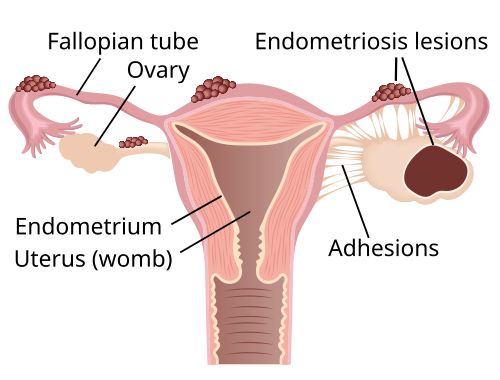
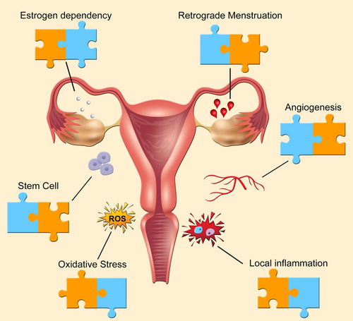

# ENDOMETRIOSE

A endometriose é definida pela presença de tecido estromal e glandular endometrial fora da cavidade uterina. Mas, para a sua prova e para a sua vida prática, esqueça a definição simplista de "endométrio no lugar errado". A endometriose é uma doença inflamatória crônica, estrogênio-dependente, que se comporta quase como uma neoplasia benigna de comportamento invasivo.

Por que o endométrio vai parar lá fora? Essa é a pergunta que as bancas amam. Não existe uma causa única, mas sim um conjunto de teorias que se complementam. A mais famosa é a Teoria de Sampson, ou Teoria da Menstruação Retrógrada. Segundo ela, o sangue menstrual reflui pelas tubas uterinas e se implanta no peritônio.

Aqui entra o primeiro "porquê" importante: se 90% das mulheres têm menstruação retrógrada, por que apenas 10% desenvolvem a doença? A resposta está na imunologia. Em mulheres com endometriose, o sistema imune (macrófagos e células NK) falha em limpar esse tecido ectópico. Além disso, esse tecido é resistente à progesterona e produz seu próprio estrogênio através da enzima aromatase. Guarde isso: a endometriose é uma "fábrica" de estrogênio e inflamação.

*Figura 1 - Diagrama anatômico da endometriose com implantes em tubas uterinas, endometrioma ovariano e aderências. Fonte: Femke, CC BY 4.0 | Wikimedia Commons*

## Fisiopatologia e Teorias de Origem

Além da Teoria de Sampson, você precisa conhecer a Teoria da Metaplasia Celômica. Ela sugere que células do epitélio germinativo do ovário ou do peritônio podem se transformar (metaplasia) em tecido endometrial sob estímulo inflamatório ou hormonal. Isso explica, por exemplo, casos raros de endometriose em mulheres que nunca menstruaram ou até em homens (sim, já caiu em prova!).

Existe também a Teoria da Disseminação Linfática ou Hematogênica (Teoria de Halban), que justifica achados de endometriose em locais distantes, como pulmão ou cérebro. E, claro, a Teoria da Indução, que é uma variação da metaplasia, onde fatores liberados pelo endométrio induzem a diferenciação de células mesenquimais.

Na prática do MedEvo, sempre reforçamos que a genética tem um papel crucial. Se uma paciente tem uma parente de primeiro grau com a doença, o risco dela é até 7 a 10 vezes maior. É um padrão de herança multifatorial/poligênica.

## Epidemiologia e Fatores de Risco

A endometriose acomete cerca de 10% das mulheres em idade reprodutiva. É a principal causa de dor pélvica crônica e uma das maiores causas de infertilidade.

As bancas adoram traçar o perfil da paciente. Pense em uma mulher que "expõe" muito o seu útero ao estrogênio e ao fluxo menstrual.

**Fatores de Risco:**

- Menarca precoce (antes dos 11-12 anos).

- Ciclos menstruais curtos (menos de 27 dias).

- Fluxo menstrual intenso e prolongado.

- Nuliparidade (a gravidez é um período de "descanso" hormonal).

- Malformações mullerianas que causam obstrução ao fluxo (ex: hímen imperfurado, útero bicorno com corno não comunicante).

- Baixo Índice de Massa Corporal (IMC). Curiosamente, a obesidade é fator de risco para câncer de endométrio, mas o baixo peso é mais associado à endometriose.

**Fatores de Proteção:**

- Multiparidade.

- Amamentação prolongada.

- Uso de anticoncepcionais orais.

- Exercício físico regular (reduz níveis de estrogênio e aumenta citocinas anti-inflamatórias).

*Figura 2 - Seis características da endometriose: dependência estrogênica, menstruação retrógrada, angiogênese, inflamação local, estresse oxidativo e células-tronco. Fonte: Helena Malvezzi et al, CC BY 4.0 | Wikimedia Commons*

## Quadro Clínico: Os 6 "Ds" da Endometriose

O diagnóstico clínico começa com uma anamnese muito bem feita. O sintoma cardinal é a dismenorreia progressiva. Aquela paciente que não tinha dor na adolescência, mas que a cada ano sente uma cólica pior, que não cede mais aos analgésicos comuns.

Os sintomas clássicos são:

- **Dismenorreia:** Dor menstrual intensa e, crucialmente, progressiva.

- **Dispareunia de profundidade:** Dor durante a relação sexual, especificamente no fundo da vagina. Se a dor for na entrada, pense em outras causas.

- **Dor pélvica crônica:** Dor não cíclica que dura mais de 6 meses.

- **Dificuldade para engravidar (Infertilidade):** Presente em 30 a 50% das pacientes.

- **Disquezia / Dor defecatória:** Sintomas intestinais cíclicos (pioram na menstruação). Pode haver puxo, tenesmo ou até hematoquezia.

- **Disúria:** Sintomas urinários cíclicos, sugerindo acometimento vesical.

Cuidado com a pegadinha: a intensidade da dor NÃO tem correlação direta com a gravidade ou extensão da doença. Uma paciente com focos mínimos de endometriose peritoneal (estágio I) pode sentir uma dor incapacitante, enquanto uma paciente com grandes endometriomas ovarianos (estágio IV) pode ser assintomática e descobrir a doença apenas na investigação de infertilidade.

## Exame Físico: O que procurar?

Muitas vezes o exame físico é normal, especialmente em casos leves. No entanto, em casos de endometriose profunda, o exame físico é riquíssimo e pode fechar a suspeita.

Ao toque vaginal bimanual, você deve buscar:

- **Retroversoflexão uterina fixa:** O útero está "preso" para trás devido a aderências no fundo de saco de Douglas.

- **Nodularidade em ligamentos uterossacros:** Ao palpar o fórnice vaginal posterior, você sente "grãos de arroz" ou nódulos endurecidos e muito dolorosos.

- **Espessamento do septo retovaginal.**

- **Dor à mobilização do colo uterino.**

- **Massas anexiais:** Sugestivas de endometriomas (cistos ovarianos).

Dica de prova: se a questão descreve "nódulo palpável em fundo de saco posterior" ou "útero fixo e doloroso", a resposta quase certamente passará por endometriose profunda.

## Diagnóstico por Imagem e Laboratório

Aqui houve uma mudança de paradigma nos últimos anos. Antigamente, dizia-se que o diagnóstico era apenas por laparoscopia. Hoje, os exames de imagem de alta resolução ganharam um papel central.

### CA-125

É um marcador tumoral que pode estar elevado na endometriose. No entanto, ele tem baixa sensibilidade e baixa especificidade (pode subir na DIP, mioma, gravidez, câncer de ovário).

- **Utilidade:** Não serve para rastreamento. É útil para controle pós-tratamento e para aumentar a suspeita em casos de massas anexiais.

- **Dica de prova:** Para maior acurácia, deve ser dosado entre o 1º e o 3º dia do ciclo menstrual.

### Ultrassonografia Transvaginal (USTV) com Preparo Intestinal

Não é qualquer ultrassom. O examinador precisa ser treinado e a paciente deve realizar um preparo com laxantes para limpar o reto e o sigmoide.

- É excelente para diagnosticar endometriomas ovarianos (imagem cística, com conteúdo hipoecoico, aspecto de "vidro fosco").

- É o exame de escolha inicial para mapeamento de endometriose profunda (nódulos retrocervicais, intestinais e de bexiga).

### Ressonância Magnética (RM) da Pelve

Considerada por muitos o melhor exame de imagem devido à sua alta sensibilidade para lesões profundas e para avaliar o comprometimento de nervos e ureteres.

- Ajuda a diferenciar o endometrioma de outros cistos hemorrágicos (sinal do *shading* em T2).

### Videolaparoscopia: O Padrão-Ouro

Apesar do avanço da imagem, a videolaparoscopia com biópsia e confirmação histopatológica continua sendo o padrão-ouro para o diagnóstico definitivo.

- **Quando indicar?** Quando os exames de imagem são negativos, mas a suspeita clínica é alta e a paciente não melhora com o tratamento clínico inicial.

- **Achados:** Lesões em "queimadura de pólvora" (negras/azuladas), lesões vermelhas (ativas/recentes) ou lesões brancas (cicatriciais).

| Exame | Indicação Principal | Limitação |
| --- | --- | --- |
| USTV com Preparo | Mapeamento de endometriose profunda e endometriomas | Dependente do operador |
| RM de Pelve | Avaliação de extensão, ureteres e nervos | Custo elevado |
| CA-125 | Seguimento e suspeita de endometrioma | Baixa especificidade |
| Laparoscopia | Diagnóstico definitivo e tratamento cirúrgico | Procedimento invasivo |

## Classificação da Endometriose

A classificação mais utilizada é a da *American Society for Reproductive Medicine* (ASRM), que divide a doença em estágios de I a IV (Mínima, Leve, Moderada e Grave).

- Essa classificação foca muito em aderências e endometriomas, mas falha em descrever a dor da paciente ou o acometimento de órgãos como intestino e bexiga.

- Para endometriose profunda, usamos a classificação de **Enzian**, que mapeia os compartimentos da pelve (A: septo retovaginal e vagina; B: ligamentos uterossacros; C: reto e sigmoide).

## Tratamento Clínico: O Alvo é o Hipoestrogenismo

O tratamento da endometriose deve ser individualizado. O Dr. Will sempre lembra: "Tratamos a paciente, não o exame de imagem". Se a paciente tem um foco de 1cm no intestino, mas é assintomática, a conduta pode ser apenas observação.

Os objetivos do tratamento são: aliviar a dor, reduzir as lesões e restaurar a fertilidade.

### 1. Analgésicos e Anti-inflamatórios (AINEs)

Servem apenas para controle sintomático da dor aguda. Não tratam a doença em si.

### 2. Anticoncepcionais Hormonais Combinados (CHC)

Podem ser usados de forma cíclica ou contínua (preferível para evitar a menstruação retrógrada).

- **Mecanismo:** Atrofia endometrial e bloqueio da ovulação.

- **Cuidado:** A estrona e outros estrogênios em doses altas podem, teoricamente, estimular a doença, mas as doses baixas dos CHCs modernos são eficazes para o controle da dor em casos leves a moderados.

### 3. Progestágenos (A base do tratamento)

São a primeira linha para o tratamento da dor. Causam decidualização seguida de atrofia do tecido endometrial.

- **Dienogeste (2mg/dia):** É o "queridinho" atual. Tem ação específica no endométrio e poucos efeitos androgênicos.

- **Desogestrel (75mcg/dia):** Opção oral contínua.

- **Acetato de Medroxiprogesterona de depósito:** Injetável trimestral.

- **DIU de Levonorgestrel (Mirena):** Excelente para dor pélvica e dismenorreia, agindo localmente.

### 4. Agonistas do GnRH (Ex: Leuprolida, Goserelina)

Criam uma "menopausa reversível". Bloqueiam o eixo hipotálamo-hipófise-gonadal, levando a um estado de hipoestrogenismo profundo.

- **Efeitos colaterais:** Fogachos, secura vaginal, perda de massa óssea.

- **Add-back therapy:** Se o uso for superior a 6 meses, devemos repor doses mínimas de estrogênio/progesterona para proteger os ossos e aliviar os sintomas climatéricos, sem perder o efeito terapêutico na endometriose.

### 5. Inibidores da Aromatase (Ex: Letrozol, Anastrozol)

Usados em casos refratários, pois bloqueiam a produção periférica e local (na própria lesão) de estrogênio.

### 6. Danazol e Gestrinona

Drogas mais antigas com efeitos androgênicos potentes. O Danazol inibe o pico de LH e cria um ambiente hiperandrogênico e hipoestrogênico. Pouco usados hoje devido aos efeitos colaterais (acne, hirsutismo, alteração da voz).

| Classe | Exemplos | Principal Vantagem |
| --- | --- | --- |
| Progestágenos | Dienogeste, DIU-LNG | Primeira linha, bom perfil de segurança |
| Agonistas GnRH | Goserelina, Leuprolida | Potente redução de lesões pré-cirúrgicas |
| CHC | Etinilestradiol + Progestágeno | Fácil acesso, controle de ciclo |
| Inibidores Aromatase | Letrozol | Casos refratários e dor persistente |

## Tratamento Cirúrgico

A cirurgia não é a primeira opção para todas. Ela deve ser considerada quando:

- Falha do tratamento clínico (dor persistente).

- Contraindicação ao tratamento hormonal.

- Endometriose profunda com obstrução intestinal ou ureteral.

- Endometriomas volumosos (> 4-6 cm) ou com suspeita de malignidade.

- Infertilidade (em casos selecionados).

A via de escolha é sempre a **Videolaparoscopia**. O objetivo deve ser a exérese (retirada) completa das lesões e não apenas a cauterização superficial.

### Manejo do Endometrioma

Aqui mora uma pegadinha clássica de prova. Se a paciente tem um endometrioma e quer engravidar, a cirurgia (cistectomia) pode reduzir a sua reserva ovariana (medida pelo Hormônio Anti-Mülleriano - AMH).

- A técnica preferencial é a **cistectomia** (retirada da cápsula do cisto). A simples drenagem tem altíssima taxa de recorrência.

- Sempre pondere o risco de dano ao tecido ovariano saudável.

## Endometriose e Infertilidade

A endometriose causa infertilidade por vários mecanismos:

- **Fator Tuboperitoneal:** Aderências que distorcem a anatomia e impedem a captação do óvulo.

- **Fator Inflamatório:** O líquido peritoneal "tóxico" prejudica a motilidade dos espermatozoides e a interação óvulo-espermatozoide.

- **Fator Ovulatório:** Endometriomas podem prejudicar a qualidade dos oócitos.

**Qual a conduta na infertilidade?**

- Endometriose leve (I/II): A laparoscopia para limpeza de focos pode aumentar as taxas de gravidez espontânea.

- Endometriose moderada/grave (III/IV): A Fertilização In Vitro (FIV) costuma ser o caminho mais rápido e eficaz, especialmente se houver fator tubário associado ou idade materna avançada.

## Situações Especiais e Complicações

### Endometriose e Câncer

Existe uma associação clara entre endometriose e dois tipos específicos de câncer de ovário: **Carcinoma de Células Claras** e **Carcinoma Endometrioide**. A transformação maligna é rara (menos de 1%), mas deve ser suspeitada se um endometrioma cresce rapidamente na pós-menopausa ou apresenta componentes sólidos ao Doppler.

### Endometriose Intestinal

O local mais comum é o reto e o sigmoide. O tratamento cirúrgico pode variar desde o *shaving* (raspagem da lesão), ressecção discoide (retirada de um "tampão" da parede) até a ressecção segmentar (retirada de um pedaço do intestino com anastomose).

### Endometriose Urinária

A bexiga é o local mais comum. O sintoma é a disúria cíclica. Já a endometriose de ureter é perigosa porque pode ser silenciosa e levar à hidronefrose e perda da função renal. Por isso, em casos de endometriose profunda, sempre avalie os ureteres na RM ou USG.

## Diagnóstico Diferencial

Nem toda dor pélvica é endometriose. Você deve considerar:

- **Adenomiose:** Frequentemente coexiste com a endometriose. A diferença é que a dor costuma vir acompanhada de aumento do volume uterino e sangramento uterino anormal (SUA).

- **Doença Inflamatória Pélvica (DIP):** História de febre, corrimento e dor aguda. Lembre-se que a DIP por clamídia pode ser assintomática e causar dano tubário.

- **Síndrome Miofascial:** Dor na parede abdominal, com pontos gatilho.

- **Síndrome do Intestino Irritável:** Dor abdominal relacionada à evacuação, mas sem o padrão cíclico menstrual tão marcado.

## Pontos-Chave para Prova

- **Padrão-Ouro Diagnóstico:** Videolaparoscopia com biópsia e histopatológico.

- **Tratamento de 1ª Linha para Dor:** Progestágenos (Dienogeste) ou Anticoncepcionais Combinados Contínuos.

- **Endometrioma na Imagem:** Cisto com conteúdo hipoecoico, aspecto de "vidro fosco" (ground-glass).

- **CA-125:** Não serve para diagnóstico isolado; útil para seguimento. Dosar entre o 1º e 3º dia do ciclo.

- **Teoria de Sampson:** Menstruação retrógrada (mais aceita, mas não explica tudo).

- **Teoria da Metaplasia Celômica:** Explica endometriose em locais atípicos e em homens.

- **Marcador de Risco:** Endometriomas ovarianos são marcadores de doença profunda e maior risco de infertilidade.

- **Indicação Cirúrgica Absoluta:** Obstrução de ureter ou de alça intestinal por focos de endometriose.

- **Add-back Therapy:** Obrigatória em tratamentos com Agonistas de GnRH por mais de 6 meses para evitar osteoporose.

- **Câncer Associado:** Carcinoma de células claras e carcinoma endometrioide de ovário.

- **Exame Físico:** Nódulos dolorosos em ligamentos uterossacros e útero retroverso fixo são sinais clássicos de doença profunda.

- **Infertilidade:** Em casos graves (Estágio III/IV), a FIV é frequentemente a melhor opção em vez de múltiplas cirurgias.

- **O que NÃO fazer:** Não use estrona ou estrogênios isolados, pois eles alimentam a doença. Não ignore sintomas intestinais cíclicos.

- **Pegadinha de Prova:** A alternativa dirá que a intensidade da dor define o estágio da doença. **Falso!** Dor e extensão da doença não têm correlação linear. 💡

 Cópia offline para consulta pessoal.
 Fonte original:
 [https://www.medevo.com.br/material-apoio/ler/d06390b2-7583-49ab-b56e-273fc637f48b](https://www.medevo.com.br/material-apoio/ler/d06390b2-7583-49ab-b56e-273fc637f48b)
