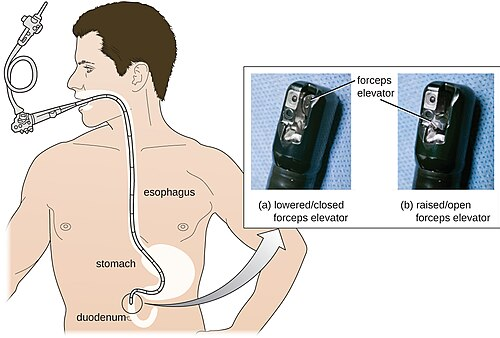

# ENDOSCOPIA DIGESTIVA ALTA

A Endoscopia Digestiva Alta (EDA) não é apenas um "exame de imagem". Para o cirurgião e para o gastroenterologista, ela é uma extensão do exame físico e uma ferramenta terapêutica de urgência. Nas provas de residência, o examinador não quer saber se você sabe segurar o aparelho, mas se você sabe **quando** indicar, **quando** contraindicar e, principalmente, o que fazer quando o laudo descreve uma classificação de Forrest ou Sakita.

*Figura 1 - Diagrama da endoscopia digestiva alta (EDA) mostrando o trajeto do endoscópio pelo trato gastrointestinal superior. Fonte: CNX OpenStax, CC BY 4.0 | Wikimedia Commons*

## Indicações e Contraindicações: Onde o Erro Começa

Muitos alunos acreditam que a EDA pode ser feita em qualquer paciente com dor abdominal. Cuidado. A indicação deve ser precisa. No cenário ambulatorial, focamos em sinais de alarme (perda de peso, anemia, disfagia, idade > 45-50 anos). No cenário de urgência, o foco é a Hemorragia Digestiva Alta (HDA).

Mas vamos ao que as bancas amam: as **contraindicações**. Elas se dividem em absolutas e relativas, e aqui mora a primeira pegadinha.

### Contraindicações Absolutas

Se o paciente apresenta um destes quadros, o endoscópio não entra:

- **Perfuração de víscera oca suspeita ou confirmada:** Se você suspeita de um pneumoperitônio, a insuflação de ar da EDA vai transformar um problema em uma catástrofe, aumentando a pressão intra-abdominal e piorando o choque.

- **Instabilidade hemodinâmica não corrigida:** Grave isso. Você não faz EDA para "salvar" um paciente em choque hipovolêmico grave. Primeiro você estabiliza (cristaloide, sangue), depois você faz a EDA. O exame é feito para tratar a causa, mas o paciente precisa estar vivo para ser tratado.

- **Insuficiência respiratória grave:** A menos que o paciente esteja intubado e protegido.

- **Infarto Agudo do Miocárdio (IAM) recente:** Geralmente aguarda-se a estabilização da fase aguda, a menos que o sangramento seja a causa da desestabilização cardíaca (o que exige discussão multidisciplinar).

### Contraindicações Relativas

Aqui o bom senso e a técnica do Dr. Will entram em jogo. O risco-benefício deve ser pesado:

- Coagulopatias graves (INR > 2.5 ou plaquetas < 50.000).

- Divertículo de Zenker (risco altíssimo de perfuração se o endoscopista for inexperiente).

- Aneurisma de aorta volumoso.

**Dica de Prova:** A ingestão de corpo estranho com sinais de perfuração (dor torácica súbita, enfisema subcutâneo) contraindica a EDA imediata. O paciente vai direto para a cirurgia ou propedêutica de imagem (TC).

## Hemorragia Digestiva Alta (HDA) Não-Variceal

Este é o tema campeão de questões. Quando falamos de HDA não-variceal, 80% das vezes estamos falando de **Úlcera Péptica**.

### A Classificação de Forrest

Você precisa decorar esta tabela. Não há como fugir. Ela define o prognóstico e a conduta imediata.

| Forrest | Descrição da Lesão | Risco de Ressangramento | Conduta Endoscópica |
| --- | --- | --- | --- |
| **Ia** | Sangramento arterial em jato (Pulsátil) | Altíssimo (90%) | Hemostasia Obrigatória |
| **Ib** | Sangramento "em babação" (Venoso/Capilar) | Alto (10-30%) | Hemostasia Obrigatória |
| **IIa** | Vaso visível não sangrante | Alto (40-50%) | Hemostasia Obrigatória |
| **IIb** | Coágulo aderido | Intermediário (20-30%) | Irrigar/Remover e tratar base |
| **IIc** | Hematina na base da úlcera (pontos escuros) | Baixo (<10%) | Apenas observação/Clínico |
| **III** | Base clara, com fibrina (sem estigmas) | Mínimo (<5%) | Apenas observação/Clínico |

**Por que tratamos o Forrest IIa?** Porque aquele vaso visível é um "sentinela". Ele não está sangrando agora, mas a qualquer oscilação de pressão, ele vai romper.

**Erro clássico:** Achar que Forrest IIc precisa de adrenalina. Não precisa. O risco de ressangramento é baixo o suficiente para que o tratamento clínico com Inibidores de Bomba de Prótons (IBP) seja suficiente.

### O Manejo da Úlcera Duodenal em Choque

Imagine um paciente de 60 anos, hematêmese volumosa, PA 80/40 mmHg.

- **Passo 1:** Estabilização hemodinâmica (Ringer Lactato, considerar concentrado de hemácias).

- **Passo 2:** IBP em dose alta (bolus + infusão contínua ou doses intermitentes).

- **Passo 3:** EDA precoce (dentro de 24 horas).

Se a úlcera for Forrest Ia ou Ib, a terapia deve ser **combinada**. Injetar apenas adrenalina não é mais o padrão-ouro isolado; você deve associar um método térmico (eletrocoagulação) ou mecânico (clipe).

*Figura 2 - Imagem endoscópica de úlcera gástrica profunda no antro gástrico, com base limpa. Fonte: Samir, CC BY-SA 3.0 | Wikimedia Commons*

## Classificação de Sakita: A Cicatrização

Enquanto Forrest foca no sangramento, Sakita foca na cicatrização da úlcera gástrica.

- **Fase A (Active):** Úlcera ativa. A1 (edema, fibrina espessa), **A2 (fibrina clara, sem restos necróticos)**. Guarde o A2: é a úlcera "limpa", mas ainda ativa.

- **Fase H (Healing):** Cicatrização. H1 (redução da lesão, início de convergência de pregas).

- **Fase S (Scar):** Cicatriz. S1 (cicatriz vermelha), S2 (cicatriz branca/definitiva).

## Hemorragia Digestiva Alta Variceal

Aqui o jogo muda. O problema não é o ácido, é a **Hipertensão Portal**.

### Varizes de Esôfago

O tratamento de escolha na urgência é a **Ligadura Elástica**. A escleroterapia (injeção de substâncias irritantes) ficou em segundo plano devido ao maior índice de complicações (perfuração, estenose).

### Varizes Gástricas: A Pegadinha do Cianoacrilato

As varizes gástricas (especialmente as fúndicas - GOV2 ou IGV1) não respondem bem à ligadura elástica porque a parede do estômago é mais espessa e o fluxo sanguíneo é muito alto.
**Conduta de escolha:** Injeção de **Cianoacrilato** (a famosa "super bonder" médica). Ao entrar em contato com o sangue, ela polimeriza instantaneamente, selando o vaso.

Se o tratamento endoscópico falhar, a próxima etapa é o **TIPS** (Shunt Portossistêmico Transjugular Intra-hepático). O balão de Sengstaken-Blakemore é apenas uma medida de ponte (salvamento) por no máximo 24 horas.

## Gastrostomia Endoscópica Percutânea (GEP)

A GEP é o método de escolha para suporte nutricional enteral prolongado (> 4 semanas). Se o paciente vai precisar de sonda por 10 dias, use a nasoenteral. Se for para o resto da vida (ex: sequela de AVC, neoplasia de orofaringe), pense em GEP.

*Figura 1 - Diagrama da endoscopia digestiva alta (EDA) mostrando o trajeto do endoscópio pelo trato gastrointestinal superior. Fonte: CNX OpenStax, CC BY 4.0 | Wikimedia Commons*

## Indicações Comuns

- Distúrbios neurológicos com disfagia persistente (AVC, ELA, Parkinson).

- Neoplasias de cabeça e pescoço ou esôfago (obstrutivas).

- Traumatismo de face grave (onde a via oral é impossível).

### Contraindicações da GEP (Cai muito!)

Aqui o MedEvo alerta: as bancas adoram confundir contraindicação de EDA com contraindicação de GEP.

- **Absolutas:**

- Incapacidade de transpor o endoscópio (ex: estenose pilórica severa ou tumor esofágico intransponível). Se o aparelho não passa, não tem como fazer a técnica "pull".

- Interposição de órgãos (fígado ou cólon na frente do estômago).

- Coagulopatia grave não corrigida.

- Peritonite ativa.

- **Relativas:**

- Ascite volumosa (dificulta a cicatrização do trajeto e predispõe à peritonite).

- Obesidade mórbida (dificuldade técnica de transiluminação).

- Cirurgia gástrica prévia (depende da anatomia remanescente).

**Pérola Clínica:** Estar internado em UTI **NÃO** é contraindicação para GEP. Se o paciente está estável do ponto de vista hemodinâmico e ventilatório, ele pode e deve receber o acesso definitivo se indicado.

## Ingestão de Substâncias Cáusticas e Corpos Estranhos

### Cáusticos

O paciente chega após ingerir soda cáustica. O que fazer?

- **NÃO** induza o vômito (lesiona o esôfago na ida e na volta).

- **NÃO** tente neutralizar com ácidos (a reação química gera calor e piora a queimadura térmica).

- **EDA obrigatória nas primeiras 12-24 horas.**

**Atenção:** A ausência de lesões na boca/orofaringe **NÃO** exclui lesão esofágica. Cerca de 20% dos pacientes com boca "limpa" têm queimaduras graves no esôfago. A EDA é quem manda na classificação de Zargar (graus de lesão) e define se o paciente vai para a UTI ou pode beber água.

### Corpos Estranhos

- **Baterias de disco:** Urgência absoluta se estiverem no esôfago (risco de necrose por liquefação em 2 horas). Se estiverem no estômago e o paciente for assintomático, pode-se aguardar 24-48h, a menos que a bateria seja grande (>2cm).

- **Objetos pontiagudos:** Devem ser retirados sempre que alcançáveis pelo endoscópio (risco de perfuração).

- **Sinais de perfuração:** Se o paciente tem ar no mediastino ou peritônio, a EDA está contraindicada e a cirurgia é o caminho.

## Lesões Específicas e "Zebas" de Prova

### Lesão de Dieulafoy

É uma causa rara, mas clássica em provas. Trata-se de uma **artéria submucosa de calibre persistente** que erode a mucosa e sangra maciçamente.

- **Localização mais comum:** Pequena curvatura gástrica, perto da cárdia.

- **Diagnóstico:** EDA mostra um sangramento arterial "jorrando" de uma mucosa que parece quase normal (sem úlcera profunda).

### Ectasia Vascular Antral (Estômago em Melancia)

Pregas avermelhadas que convergem para o piloro. Comum em pacientes com cirrose ou doenças autoimunes. Causa anemia ferropriva crônica por sangramento oculto.

### Angiodisplasias

Vasos malformados na submucosa. São a causa mais comum de sangramento do intestino delgado em idosos, frequentemente identificadas por enteroscopia ou cápsula endoscópica.

## Endoscopia no Contexto da Videocirurgia

A endoscopia e a laparoscopia são irmãs. Para que a videocirurgia ocorra com segurança, usamos o **Pneumoperitônio**, geralmente com CO2.

### Por que CO2?

- **Incombustível:** Essencial para usar o bisturi elétrico sem explodir o paciente.

- **Alta solubilidade:** É rapidamente absorvido pelo sangue e eliminado pelo pulmão. Isso reduz o risco de embolia gasosa fatal (comparado ao ar ambiente).

- **Econômico.**

### Monitorização: A Capnografia

Durante uma videocirurgia ou uma EDA com sedação profunda, a capnografia (PCO2 expirado) é vital.

- **Hipercapnia:** O CO2 do pneumoperitônio é absorvido. Se o anestesista não ajustar a ventilação, o paciente faz acidose respiratória.

- **Embolia Gasosa:** Uma queda súbita e dramática no ETCO2 (CO2 expirado) durante a cirurgia sugere embolia gasosa. O gás no vaso impede a troca gasosa, e o CO2 não chega ao sensor.

## Câncer Gástrico Precoce: O Papel da Mucosectomia

O Câncer Gástrico Precoce é definido como aquele limitado à mucosa ou submucosa (T1), independente da presença de linfonodos (embora para tratar por endoscopia, o risco de linfonodo deve ser mínimo).

### EMR vs. ESD

- **Mucosectomia (EMR):** A lesão é "laçada" e cortada. Ideal para lesões pequenas (< 1.5 - 2cm) e planas.

- **Dissecção Submucosa (ESD):** Técnica mais avançada onde se disseca a submucosa abaixo da lesão. Permite retirar lesões maiores em bloco, com margens melhores.

**Dica de Ouro:** Se a questão diz "lesão plana, menor que 2cm, tipo histológico intestinal (Lauren), sem ulceração", a resposta é **Tratamento Endoscópico**. A taxa de cura é comparável à cirurgia (Gastrectomia), com morbidade muito menor.

## Síndrome de Ogilvie (Pseudo-obstrução Colônica Aguda)

Embora seja um tema de "baixo", a descompressão é feita por colonoscopia, que é um procedimento endoscópico frequentemente cobrado junto com EDA.

**Cenário:** Paciente idoso, pós-operatório de cirurgia ortopédica, abdome muito distendido, mas sem obstrução mecânica na TC.

- **Tratamento inicial:** Medidas clínicas (jejum, sonda nasogástrica, correção de eletrólitos).

- **Farmacológico:** Neostigmina (cuidado com bradicardia!).

- **Refratário:** **Descompressão Colonoscópica**. O endoscopista entra e aspira o gás para evitar a perfuração do ceco (que ocorre geralmente quando o diâmetro ultrapassa 10-12 cm).

## Tabelas Comparativas para Revisão Rápida

### Tabela 1: Diagnóstico Diferencial de Sangramento Digestivo

| Causa | Característica Endoscópica | Manejo Principal |
| --- | --- | --- |
| **Úlcera Péptica** | Solução de continuidade com fibrina/sangue | IBP + Hemostasia (Forrest I/IIa) |
| **Varizes Esofágicas** | Cordões venosos dilatados, sinal da "cor vermelha" | Ligadura Elástica + Terlipressina |
| **Mallory-Weiss** | Laceração linear na transição esofagogástrica | Geralmente autolimitado |
| **Dieulafoy** | Vaso pulsátil em mucosa íntegra | Clipe metálico ou Termocoagulação |
| **Angiodisplasia** | Lesão avermelhada, rendilhada, plana | Argônio (APC) |

### Tabela 2: Sedação e Monitorização na EDA

| Parâmetro | Importância | O que observar |
| --- | --- | --- |
| **Oximetria** | Oxigenação arterial | Hipóxia por depressão respiratória |
| **Capnografia** | Ventilação (PCO2) | Hipercapnia ou Apneia obstrutiva |
| **Frequência Cardíaca** | Estresse autonômico | Bradicardia (reflexo vagal) ou Taquicardia |
| **Nível de Consciência** | Segurança da via aérea | Escala de Ramsay ou Richmond (RASS) |

## Pontos-Chave para Prova 💡

- **Forrest III e Sakita A2:** Não confunda. Forrest III é base clara (baixo risco de ressangramento). Sakita A2 é úlcera ativa com fibrina clara (em processo de cicatrização, mas ainda "aberta").

- **Cianoacrilato:** É a resposta correta para varizes gástricas fúndicas sangrantes. Não marque ligadura elástica para fundo gástrico.

- **GEP e Estenose:** Se o endoscópio não passa pelo esôfago ou piloro, a GEP é contraindicada. O acesso deve ser cirúrgico (gastrostomia aberta ou jejunostomia).

- **Capnografia na Videocirurgia:** Serve para monitorar a absorção de CO2 e detectar precocemente embolia gasosa (queda do ETCO2) ou hipercapnia (aumento do ETCO2).

- **Dieulafoy:** Pense nisso quando a questão descrever um sangramento em jato "do nada", sem história de gastrite ou úlcera prévia, geralmente no estômago proximal.

- **Ingestão de Cáusticos:** EDA deve ser feita entre 12 e 24 horas. Antes de 12h pode não mostrar a extensão real; após 48-72h o risco de perfuração pelo aparelho aumenta (fase de coliquação).

- **Corpo Estranho:** Bateria no esôfago é emergência. Bateria no estômago em paciente assintomático pode ser observada por 24h.

- **Ogilvie:** O ceco é o ponto de maior risco. Se > 12 cm, a intervenção (neostigmina ou colonoscopia) deve ser rápida.

- **Enterorragia Volumosa:** Se o paciente está estável, o primeiro exame após o toque retal e proctoscopia é a **EDA**. Por quê? Porque 10-15% das hemorragias que saem "por baixo" vêm de uma úlcera "lá em cima" com trânsito acelerado.

- **Contraindicação Absoluta de EDA:** Suspeita de perfuração (Pneumoperitônio).

- **Câncer Gástrico Precoce:** Mucosectomia (EMR/ESD) tem a mesma sobrevida que a cirurgia para lesões bem selecionadas (T1a, restritas à mucosa).

- **Laparoscopia e CO2:** Escolhido por ser incombustível e altamente difusível (segurança contra embolia).

- **Tratamento de Úlcera Forrest Ia:** Sempre terapia combinada (Adrenalina + método térmico ou mecânico). Nunca adrenalina isolada.

- **Síndrome de Mallory-Weiss:** Laceração por vômitos vigorosos. O sangramento costuma parar sozinho em 80-90% dos casos.

- **Fibrina:** A presença de fibrina (Sakita A2 ou Forrest III) indica que o processo de cicatrização começou e o risco de sangramento imediato é baixo.

 Cópia offline para consulta pessoal.
 Fonte original:
 [https://www.medevo.com.br/material-apoio/ler/fdc4e258-3769-4464-8179-49bcfefe5789](https://www.medevo.com.br/material-apoio/ler/fdc4e258-3769-4464-8179-49bcfefe5789)
