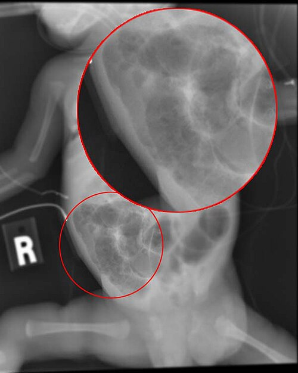
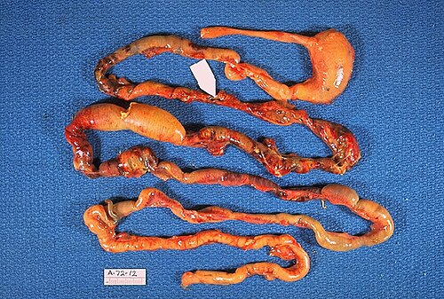

# ENTEROCOLITE NECROSANTE: RISCO E MANEJO

A Enterocolite Necrosante (ECN) é, sem dúvida, o maior pesadelo de qualquer neonatologista e a emergência gastrointestinal mais comum em Unidades de Terapia Intensiva Neonatal. Para a prova de residência, você não pode apenas saber que o abdome distende. Você precisa entender a cascata de eventos que leva um prematuro de um quadro de "resíduo gástrico aumentado" para um choque séptico com perfuração intestinal em questão de poucas horas.

## Fisiopatologia: O Porquê da Catástrofe

Para entender a ECN, esqueça a ideia de uma infecção simples. Pense nela como uma tempestade perfeita onde três fatores convergem: imaturidade intestinal, colonização bacteriana patogênica e oferta de substrato (dieta).

O recém-nascido (RN) prematuro possui uma barreira mucosa extremamente frágil. A produção de muco é reduzida, as junções intercelulares (tight junctions) são frouxas e a motilidade é errática. Quando introduzimos a dieta enteral, especialmente fórmulas artificiais, fornecemos substrato para a proliferação bacteriana. Se houver um evento isquêmico prévio, como asfixia perinatal ou policitemia (que aumenta a viscosidade sanguínea e reduz o fluxo mesentérico), a mucosa sofre lesão.

As bactérias, então, translocam para a parede do intestino. Lá, elas fermentam o substrato e produzem gás. Esse gás penetra na submucosa ou subserosa, gerando a famosa pneumatose intestinal. A partir daí, temos uma cascata inflamatória sistêmica mediada por citocinas (como o fator de necrose tumoral), que pode levar à necrose transmural, perfuração e peritonite.

Um ponto que o Dr. Will sempre reforça nas discussões do MedEvo: a ECN é rara antes do início da alimentação enteral. O leite materno é o principal fator protetor, pois contém IgA secretora, lactoferrina e oligossacarídeos que favorecem uma microbiota saudável e protegem a mucosa.

## Fatores de Risco: Quem é o Paciente Típico?

A prematuridade é, isoladamente, o fator de risco mais importante. Quanto menor a idade gestacional, maior o risco e mais tardio costuma ser o início dos sintomas. Em RNs com menos de 28 semanas, a ECN costuma aparecer após a segunda semana de vida, enquanto nos bebês mais maduros ela surge mais cedo.

Mas cuidado com a pegadinha de prova: a ECN também ocorre em RNs a termo. Nesses casos, geralmente existe um fator desencadeante de hipóxia ou baixo fluxo sanguíneo intestinal, como:

- Cardiopatias congênitas (especialmente as canal-dependentes).

- Asfixia perinatal.

- Policitemia e exsanguineotransfusão (aumentam a viscosidade e podem causar microtrombos na circulação mesentérica).

- Restrição de crescimento intrauterino (RCIU) com alteração de Doppler (centralização fetal).

Se a questão descreve um RN com policitemia ou que passou por exsanguineotransfusão e agora apresenta distensão abdominal e hipoatividade, não perca tempo: a conduta imediata é dieta zero, hidratação e suspeita de ECN.

## Quadro Clínico: Do Sutil ao Catastrófico

O diagnóstico clínico da ECN exige um alto índice de suspeição. Os sinais iniciais são inespecíficos e podem ser confundidos com sepse neonatal de outra origem.

### Sinais Sistêmicos

O bebê começa a "não ir bem". Você verá instabilidade térmica (hipotermia ou febre), apneias frequentes, bradicardia, letargia e instabilidade hemodinâmica. Se um prematuro que estava estável começa a ter episódios de apneia e bradicardia sem causa respiratória óbvia, olhe para o abdome.

### Sinais Gastrointestinais

Aqui está o coração do exame físico. Os sinais clássicos incluem:

- **Distensão abdominal:** É o sinal mais comum. O abdome fica tenso e brilhante.

- **Resíduo gástrico:** Aumento do volume ou mudança no aspecto (resíduo bilioso ou sanguinolento).

- **Vômitos biliosos:** Indicam obstrução ou íleo paralítico grave.

- **Sangue nas fezes:** Pode ser desde sangue oculto até enterorragia franca.

- **Eritema de parede abdominal:** Este é um sinal de alarme crítico. Indica que a inflamação já atingiu o peritônio parietal, sugerindo peritonite ou necrose de alça subjacente.

Muitos alunos confundem a distensão fisiológica do prematuro com a ECN. A diferença fundamental é que na ECN a distensão é progressiva, acompanhada de dor à palpação e sinais de má perfusão periférica.

*Figura 1 - Radiografia abdominal de recém-nascido com enterocolite necrosante, evidenciando pneumatose intestinal. Fonte: RadsWiki, CC BY-SA 3.0 | Wikimedia Commons*

## Diagnóstico por Imagem: A Radiografia é Soberana

O padrão-ouro para o diagnóstico e acompanhamento da ECN é a radiografia simples de abdome (frente e perfil esquerdo com raios horizontais). Você deve saber identificar três achados principais:

- **Pneumatose Intestinal:** É o achado patognomônico. Aparece como bolhas de ar ou linhas radiolucentes na parede do intestino. Representa o gás produzido por bactérias dentro da parede intestinal.

- **Gás no Sistema Porta:** O gás da parede intestinal migra para as veias mesentéricas e chega ao fígado. No RX, vemos imagens lineares radiolucentes sobre a silhueta hepática. Isso indica doença grave e maior risco de necessidade cirúrgica.

- **Pneumoperitônio:** Indica perfuração intestinal. O sinal clássico é o "sinal do ligamento falciforme" ou o ar livre abaixo do diafragma. É a indicação absoluta de cirurgia.

| Achado Radiológico | Significado Clínico | Gravidade (Bell) |
| --- | --- | --- |
| Distensão de alças / Íleo | Inespecífico, pode ser fase inicial | Estágio I |
| Pneumatose intestinal | Diagnóstico confirmado de ECN | Estágio II |
| Gás na veia porta | Progressão da doença, pior prognóstico | Estágio IIB |
| Pneumoperitônio | Perfuração intestinal (Emergência) | Estágio IIIB |

*Figura 2 - Patologia macroscópica da enterocolite necrosante: necrose intestinal, pneumatose e sítio de perfuração (seta). Fonte: CDC/Dr. Edwin P. Ewing Jr., Domínio Público | Wikimedia Commons*

## Estadiamento de Bell: A Régua da Conduta

A classificação de Bell, modificada por Walsh e Kliegman, é o que define como você vai tratar o paciente. As bancas amam cobrar o estágio para perguntar a conduta.

### Estágio I (Suspeita)

O RN apresenta sinais sistêmicos leves (apneia, letargia) e gastrointestinais (resíduo, distensão leve). O RX mostra apenas distensão de alças ou é normal.

- **Conduta:** Jejum (NPO), Sonda Orogástrica (SOG) aberta para descompressão, exames laboratoriais e antibioticoterapia por 3 dias até descartar o quadro.

### Estágio II (Doença Confirmada)

Aqui temos a pneumatose intestinal.

- **IIA (Doença leve):** Pneumatose presente, mas o bebê está clinicamente estável.

- **IIB (Doença moderada):** Bebê apresenta acidose metabólica leve e plaquetopenia. O RX pode mostrar gás na veia porta ou uma alça fixa (alça que não muda de posição em RX seriados).

- **Conduta:** Jejum rigoroso, Nutrição Parenteral Total (NPT), antibioticoterapia de amplo espectro por 7 a 14 dias.

### Estágio III (Doença Avançada)

O bebê está em choque.

- **IIIA (Sem perfuração):** Choque, acidose metabólica grave, coagulopatia (CIVD), neutropenia. O abdome está muito distendido e doloroso.

- **IIIB (Com perfuração):** Tudo do IIIA mais o pneumoperitônio no RX.

- **Conduta:** Suporte intensivo (drogas vasoativas, ventilação mecânica), correção da acidose e cirurgia (laparotomia ou dreno de Penrose).

## Manejo Clínico: O que fazer no beira-leito?

O tratamento inicial da ECN é clínico em cerca de 60-80% dos casos. O objetivo é "dar descanso" ao intestino e combater a infecção.

- **Dieta Zero (NPO):** É a medida mais imediata. Se houver suspeita, suspenda a dieta. O tempo de jejum varia de 7 a 14 dias nos casos confirmados.

- **Descompressão Gástrica:** Sonda orogástrica de grosso calibre aberta e em aspiração contínua ou intermitente. Isso alivia a pressão intra-abdominal (PIA) e melhora a ventilação.

- **Suporte Hemodinâmico:** Hidratação venosa vigorosa. A ECN causa um grande sequestro de líquidos para o terceiro espaço (parede intestinal e peritônio).

- **Antibioticoterapia:** Deve cobrir Gram-negativos, Gram-positivos e, em casos de perfuração ou suspeita de anaeróbios, adicionar cobertura específica. Esquemas comuns incluem Ampicilina + Gentamicina + Metronidazol (ou Clindamicina).

- **Monitorização Laboratorial:** Hemograma (vigiar plaquetopenia e neutropenia), eletrólitos (hiponatremia é comum pelo sequestro de líquidos) e gasometria (acidose metabólica persistente é sinal de necrose intestinal).

Lembre-se: a acidose metabólica refratária e a plaquetopenia persistente são indicadores indiretos de que o intestino está morrendo (necrose), mesmo que ainda não tenha perfurado.

## Manejo Cirúrgico: Quando a faca é necessária?

A única indicação **absoluta** de cirurgia na ECN é o pneumoperitônio (perfuração). No entanto, existem indicações relativas que você deve conhecer:

- Deterioração clínica progressiva apesar do tratamento clínico otimizado.

- Massa abdominal palpável (sugere plastrão ou alças necróticas).

- Eritema de parede abdominal.

- Alça fixa no RX.

- Paracentese abdominal com saída de fezes ou bile (raramente feita hoje em dia, mas cai em prova).

As opções cirúrgicas são:

- **Laparotomia Exploradora:** Ressecção das alças necróticas e criação de estomas (enterostomias). O objetivo é salvar o máximo de intestino possível para evitar a Síndrome do Intestino Curto.

- **Drenagem Peritoneal (Dreno de Penrose):** Feita à beira-leito sob anestesia local. É indicada para RNs de muito baixo peso (< 1000g) que estão instáveis demais para suportar uma cirurgia no centro cirúrgico. Pode ser o tratamento definitivo ou apenas uma medida de estabilização.

*Figura 1 - Radiografia abdominal de recém-nascido com enterocolite necrosante, evidenciando pneumatose intestinal. Fonte: RadsWiki, CC BY-SA 3.0 | Wikimedia Commons*

## Diagnóstico Diferencial: Não confunda na hora da prova!

As bancas adoram colocar outros quadros obstrutivos neonatais para te confundir com ECN. Vamos diferenciar os principais:

### 1. Atresia Duodenal

O bebê apresenta vômitos biliosos precoces (primeiro dia de vida) e o RX mostra o clássico **sinal da dupla bolha** (ar no estômago e no duodeno, sem ar distal). Está muito associada à Síndrome de Down. Diferente da ECN, o bebê não costuma ter sinais de sepse inicialmente.

### 2. Volvo de Intestino Médio (Má Rotação)

Esta é a maior emergência cirúrgica. O bebê estava bem e, de repente, apresenta vômitos biliosos súbitos e distensão. O RX mostra "pobreza de gás" distal. Se não operar rápido, o intestino todo morre por torção da artéria mesentérica superior. Na ECN, o quadro é mais arrastado e o paciente geralmente é um prematuro em dieta.

### 3. Íleo Meconial

Comum em pacientes com Fibrose Cística. O mecônio é espesso e obstrui o íleo terminal. O RX mostra o sinal de Neuhauser (aspecto de "vidro moído" ou "miolo de pão") devido às bolhas de ar misturadas ao mecônio denso. Pode complicar com perfuração e peritonite meconial (calcificações no RX).

### 4. Doença de Hirschsprung (Aganglionose)

Atraso na eliminação de mecônio (> 48h) seguido de distensão e vômitos. Se o bebê desenvolver febre e diarreia explosiva, suspeite de Enterocolite de Hirschsprung, que é uma complicação grave por estase bacteriana. O diagnóstico é por biópsia retal (ausência de plexos nervosos).

### 5. Estenose Hipertrófica do Piloro

Ocorre mais tarde (2 a 8 semanas de vida). Vômitos em jato, **não biliosos**. Ao exame, pode-se palpar a "oliva pilórica". O distúrbio metabólico clássico é a alcalose metabólica hipoclorêmica (pela perda de H+ e Cl- no vômito), enquanto na ECN o comum é a acidose metabólica.

| Patologia | Sinal Patognomônico / Característico | Principal Diferencial Clínico |
| --- | --- | --- |
| **ECN** | Pneumatose intestinal | Prematuro, sangue nas fezes, sepse |
| **Atresia Duodenal** | Sinal da Dupla Bolha | Vômitos biliosos precoces, Down |
| **Volvo (Má Rotação)** | Pobreza de gás / Saca-rolhas (REED) | Vômitos biliosos súbitos, abdome agudo |
| **Estenose de Piloro** | Oliva pilórica / Alcalose hipoclorêmica | Vômitos NÃO biliosos em jato |
| **Íleo Meconial** | Sinal do vidro moído (Neuhauser) | Fibrose Cística, obstrução distal |

## Complicações e Prognóstico

A sobrevivência na ECN melhorou muito, mas as sequelas a longo prazo são preocupantes.

- **Estenoses Intestinais:** Ocorrem em até 30% dos pacientes tratados clinicamente ou cirurgicamente. A área inflamada cicatriza formando uma estenose. O bebê apresenta episódios de obstrução semanas após a cura da ECN.

- **Síndrome do Intestino Curto:** Resulta de ressecções extensas. O bebê torna-se dependente de NPT prolongada, com risco de colestase associada à nutrição parenteral e falência hepática.

- **Atraso no Neurodesenvolvimento:** A cascata inflamatória da ECN e a sepse associada têm impacto direto no cérebro em desenvolvimento do prematuro.

## Prevenção: O que realmente funciona?

Se a prematuridade é o risco, evitar o parto prematuro é a prevenção primária. Mas, uma vez que o bebê nasceu:

- **Leite Materno:** É a intervenção mais eficaz. O uso de leite humano (da própria mãe ou de banco) reduz drasticamente a incidência de ECN em comparação com a fórmula.

- **Protocolos de Dieta:** Aumentos cautelosos e padronizados do volume da dieta (geralmente 20 ml/kg/dia) parecem ser mais seguros.

- **Probióticos:** Há evidências de que certas cepas de probióticos podem reduzir a incidência de ECN, mas o uso rotineiro ainda é debatido em alguns protocolos por medo de sepse por probióticos em prematuros extremos. Segundo a SBP, o uso pode ser considerado em unidades com alta incidência da doença.

## Situações Especiais e Pegadinhas

**O Teste de Apt:** Imagine um RN que apresenta hematêmese ou sangue nas fezes logo nas primeiras horas de vida, mas está clinicamente muito bem, com exame físico normal. Pode ser sangue materno deglutido durante o parto ou amamentação (fissura mamária). O Teste de Apt diferencia a hemoglobina fetal (resistente ao álcali) da hemoglobina adulta (que desnatura). Se o teste for positivo para sangue materno, você evita exames desnecessários para ECN.

**Hérnia Diafragmática:** RN com abdome escavado, desconforto respiratório grave e ruídos hidroaéreos no tórax. Lembre-se da pérola 7: **NUNCA** faça ventilação com máscara e balão (VPP). Isso vai insuflar o estômago e o intestino que estão dentro do tórax, comprimindo ainda mais o pulmão. A conduta é intubação orotraqueal (IOT) imediata e sonda gástrica para descompressão.

**Gastrosquise vs. Onfalocele:** Na gastrosquise, o defeito é paraumbilical (geralmente à direita), não tem saco membranoso e as alças estão expostas e "curtidas" pelo líquido amniótico. Na onfalocele, o defeito é central, no cordão umbilical, e as vísceras estão protegidas por um saco (peritônio e amnio). A gastrosquise tem mais risco de atresias intestinais associadas devido à exposição das alças.

## Pontos-Chave para Prova

- **Fator de Risco #1:** Prematuridade. Outros: fórmula láctea, asfixia, policitemia, exsanguineotransfusão.

- **Achado Patognomônico:** Pneumatose intestinal (ar na parede do intestino).

- **Indicação Absoluta de Cirurgia:** Pneumoperitônio (ar livre no peritônio).

- **Tríade da ECN:** Isquemia + Bactérias + Substrato (Dieta).

- **Estágio II de Bell:** É onde o diagnóstico é confirmado pela pneumatose. Exige ATB por 7-14 dias e NPO.

- **Sinal da Alça Fixa:** Alça que não muda de posição em RX seriados (intervalos de 6-8h), sugerindo necrose iminente.

- **Gás na Veia Porta:** Sinal de gravidade, mas não é indicação cirúrgica absoluta por si só.

- **Manejo Inicial:** Dieta zero, SOG aberta, hidratação venosa e antibioticoterapia.

- **Diferencial de Atresia Duodenal:** Sinal da dupla bolha e vômitos biliosos no 1º dia.

- **Diferencial de Estenose de Piloro:** Vômitos não biliosos, alcalose metabólica hipoclorêmica e oliva pilórica.

- **O que NÃO fazer:** Não manter dieta enteral se houver resíduo bilioso ou distensão importante. Não fazer VPP em suspeita de Hérnia Diafragmática.

- **Complicação Tardia Comum:** Estenose intestinal (suspeitar se houver novos episódios obstrutivos após a cura).

- **Leite Materno:** Principal fator protetor contra a ECN.

- **Plaquetopenia e Acidose Metabólica:** Marcadores laboratoriais de gravidade e necrose tecidual.

- **Drenagem Peritoneal:** Opção para prematuros extremos (< 1000g) instáveis com perfuração. 💡

 Cópia offline para consulta pessoal.
 Fonte original:
 [https://www.medevo.com.br/material-apoio/ler/418039a2-9860-49a2-afd1-b81e9f9b4780](https://www.medevo.com.br/material-apoio/ler/418039a2-9860-49a2-afd1-b81e9f9b4780)
