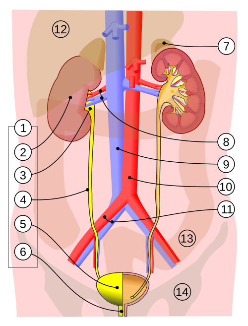
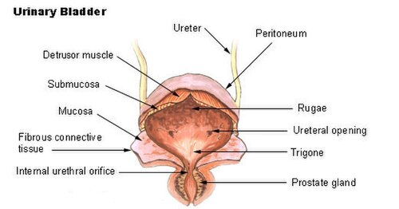

# ENURESE NOTURNA

A enurese noturna é um dos temas mais frequentes nos ambulatórios de pediatria e, consequentemente, um prato cheio para as bancas de residência médica. Para entender esse tema, você precisa primeiro desconstruir a ideia de que "fazer xixi na cama" é apenas um atraso de maturação. Embora a maturação tenha seu papel, a enurese é uma condição multifatorial que exige uma investigação sistemática.

Segundo a International Children's Continence Society (ICCS) e a Sociedade Brasileira de Pediatria (SBP), definimos enurese como a perda involuntária de urina durante o sono em crianças com 5 anos ou mais. Por que 5 anos? Porque esta é a idade em que se espera que a maturação do controle esfincteriano noturno já tenha ocorrido na grande maioria das crianças. Antes disso, consideramos o quadro como fisiológico.

## Definição e Critérios Diagnósticos

Para a prova, guarde os números exatos: a criança deve ter pelo menos 5 anos de idade cronológica (ou nível de desenvolvimento equivalente) e o evento deve ocorrer pelo menos duas vezes por semana, por um período mínimo de três meses consecutivos.

Um erro comum em provas é confundir enurese com incontinência urinária. A ICCS reserva o termo "enurese" exclusivamente para a perda urinária durante o sono. Se a criança perde urina acordada, o termo correto é incontinência urinária diurna. Se ela perde nos dois períodos, ela tem enurese e incontinência diurna.

### A Sequência do Controle Esfincteriano

Este é um conceito que o MedEvo sempre reforça porque cai muito em provas de desenvolvimento: existe uma ordem lógica para a criança adquirir o controle. Se a banca inverter essa ordem, a alternativa está errada. A sequência é:

- Controle fecal noturno (o primeiro a surgir).

- Controle fecal diurno.

- Controle urinário diurno.

- Controle urinário noturno (o último a ser estabelecido).

Se uma criança de 4 anos ainda molha a cama, mas já tem controle diurno, você não deve diagnosticar enurese. A conduta aqui, como veremos adiante, é apenas orientação e tranquilização familiar.

## Classificação: O Divisor de Águas na Conduta

A classificação da enurese é o que vai determinar se você vai apenas orientar a família ou se vai iniciar uma investigação profunda. Dividimos a enurese em dois grandes eixos.

### Quanto ao Tempo de Início

- **Enurese Primária:** É a criança que nunca conseguiu manter um período seco prolongado (pelo menos 6 meses) desde o nascimento. Representa cerca de 80% dos casos. Aqui, o componente genético é fortíssimo. Se ambos os pais foram enuréticos, o risco do filho ser é de cerca de 70%.

- **Enurese Secundária:** É a criança que já tinha controle (ficou seca por pelo menos 6 meses) e voltou a molhar a cama. Atenção aqui: a enurese secundária é um sinal de alerta. Ela geralmente está associada a eventos estressores psicossociais (separação dos pais, nascimento de irmão, bullying) ou a causas orgânicas, como Infecção do Trato Urinário (ITU), Diabetes Mellitus ou Diabetes Insipidus.

### Quanto aos Sintomas Associados

- **Enurese Monossintomática:** A criança só molha a cama à noite e não apresenta nenhum sintoma urinário durante o dia. O exame físico é normal e não há histórico de disfunção intestinal. É a forma mais comum e, geralmente, a mais "tranquila" de manejar.

- **Enurese Não Monossintomática:** A criança tem enurese noturna, mas também apresenta sintomas do trato urinário inferior (LUTS) durante o dia, como urgência miccional, polaciúria, manobras de contenção (aquela criança que cruza as pernas ou agacha sobre o calcanhar para não deixar o xixi escapar) ou incontinência diurna.

Cuidado: se a questão descreve uma criança que molha os pés em todas as micções ou tem uma perda contínua de urina (gotejamento), suspeite de causas anatômicas, como o ureter ectópico, especialmente em meninas. Nesses casos, a uretrocistografia miccional e a ultrassonografia são obrigatórias.

*Figura 1 - Diagrama do sistema urinário: rins, pelve renal, ureteres, bexiga urinária e uretra. Fonte: Jordi March i Nogué, CC BY-SA 3.0 | Wikimedia Commons*

## Fisiopatologia: Por que o xixi escapa?

Não é apenas uma causa. Imagine a enurese como um desequilíbrio entre a quantidade de urina produzida à noite e a capacidade da bexiga de segurá-la, tudo isso sob um "teto" de um sono muito profundo.

### 1. Poliúria Noturna e o Papel do ADH

Em condições normais, nosso corpo aumenta a produção de Hormônio Antidiurético (ADH) durante a noite. Isso faz com que os rins concentrem mais a urina, reduzindo seu volume para que a bexiga consiga armazená-la até o amanhecer.
Muitas crianças com enurese têm um ritmo circadiano do ADH alterado: elas não aumentam a produção de ADH à noite. O resultado? Produzem um volume de urina maior do que a capacidade funcional de suas bexigas.

### 2. Hiperatividade Detrusora e Capacidade Vesical

Algumas crianças têm o que chamamos de bexiga hiperativa infantil. O músculo detrusor contrai involuntariamente durante o enchimento. Se isso acontece à noite e a criança não acorda, o resultado é a enurese. Além disso, a constipação intestinal crônica desempenha um papel crucial aqui. O reto cheio de fezes pressiona a parede posterior da bexiga, reduzindo sua capacidade de armazenamento e gatilhando contrações do detrusor.

### 3. O Mito do Sono Profundo

Os pais quase sempre dizem: "Doutor, ele tem um sono muito pesado, não acorda por nada". Na verdade, estudos mostram que crianças com enurese não dormem necessariamente "mais pesado" que as outras, mas elas têm uma falha no mecanismo de despertar (arousal) frente ao estímulo de bexiga cheia. O cérebro não interpreta o sinal de "bexiga cheia" como um motivo para acordar.

## A Comorbidade que Você Não Pode Esquecer: Constipação

Se você sair desta aula lembrando apenas de uma coisa, que seja esta: sempre investigue o hábito intestinal. A constipação intestinal pediátrica é a comorbidade mais comum associada à enurese.
A disfunção do trato urinário inferior e a constipação estão tão interligadas que usamos o termo "Disfunção de Eliminação" ou "Síndrome de Eliminação Combinada".

Na prova, se a criança tem enurese e constipação, a regra de ouro é: trate a constipação primeiro. Muitas vezes, ao resolver o problema intestinal, a enurese desaparece sem necessidade de outras intervenções. Lembre-se da encoprese retentiva, que é a perda involuntária de fezes associada à retenção fecal crônica. Se houver encoprese e enurese, o foco inicial é o esvaziamento retal e a manutenção do hábito intestinal.

## Avaliação Clínica e Diagnóstico

O diagnóstico da enurese é essencialmente clínico. Você não precisa de uma bateria de exames de imagem para um caso de enurese monossintomática primária.

### Anamnese Direcionada

Pergunte sobre:

- Padrão de ingestão de líquidos (bebe muita água antes de dormir?).

- Sintomas diurnos (urgência, polaciúria).

- Hábito intestinal (frequência e consistência das fezes - use a Escala de Bristol).

- Histórico familiar (quem mais na família teve?).

- Fatores estressores (mudança de escola, perdas na família).

### Exame Físico

O exame físico deve buscar sinais de causas orgânicas ou neurológicas:

- **Região Lombossacra:** Procure por estigmas de disrafismo espinhal oculto, como tufos de pelos, covinhas (fossetas), manchas café-com-leite ou assimetria de pregas glúteas.

- **Avaliação Neurológica:** Teste os reflexos dos membros inferiores e o reflexo anal. Um reflexo anal diminuído pode indicar uma bexiga neurogênica.

- **Palpação Abdominal:** Procure por massas fecais (fecalomas) ou bexigoma.

- **Genitália:** Observe se há sinais de vulvovaginite em meninas ou fimose importante em meninos, que podem predispor a ITUs.

### Exames Complementares

Para um quadro de enurese monossintomática, o único exame obrigatório é o **EAS (Urina tipo I) e a Urocultura**.
Por que o EAS?

- Para excluir Infecção do Trato Urinário (presença de nitrito, leucocitúria).

- Para excluir Diabetes Mellitus (presença de glicosúria).

- Para avaliar a capacidade de concentração urinária (densidade).

- Para excluir Diabetes Insipidus (densidade persistentemente baixa).

Se a criança apresenta edema generalizado (suspeita de síndrome nefrótica), o EAS mostrará proteinúria maciça. Se houver hematúria, devemos investigar glomerulopatias ou litíase. Mas lembre-se: na enurese "pura", o EAS é normal.

O **Diário Miccional** é uma ferramenta diagnóstica e terapêutica fantástica. Pede-se aos pais que anotem, por 2 a 3 dias, o volume ingerido, o volume urinado e os episódios de perda. Isso ajuda a diferenciar se o problema é poliúria noturna ou baixa capacidade vesical.

## Diagnóstico Diferencial: Quando Suspeitar de Algo Mais?

| Suspeita Clínica | Sinais de Alerta | Exame Inicial |
| --- | --- | --- |
| **Diabetes Mellitus Tipo 1** | Poliúria, polidipsia, perda de peso, enurese secundária. | Glicemia de jejum / EAS (glicosúria). |
| **Infecção Urinária (ITU)** | Disúria, urgência, dor suprapúbica, enurese súbita. | EAS e Urocultura. |
| **Bexiga Hiperativa** | Urgência diurna, manobras de contenção, polaciúria. | Diário miccional. |
| **Disrafismo Espinhal** | Fosseta sacral, tufo de pelos, alteração de reflexos. | RM de coluna lombossacra. |
| **Apneia Obstrutiva do Sono** | Roncos, respiração bucal, hipertrofia de amígdalas. | Avaliação otorrinolaringológica. |
| **Diabetes Insipidus** | Polidipsia intensa, urina muito clara (baixa densidade). | Densidade urinária / Teste de restrição hídrica. |

*Figura 2 - Anatomia da bexiga urinária, incluindo músculo detrusor, trígono vesical e esfíncteres. Fonte: NCI/SEER Program, Domínio Público | Wikimedia Commons*

## Tratamento: O Passo a Passo da Conduta

O tratamento da enurese não deve ser iniciado antes dos 5 anos. Entre 5 e 6 anos, a conduta é predominantemente de orientação. O tratamento ativo (alarmes ou medicação) costuma ser reservado para crianças acima de 6 ou 7 anos, ou quando a enurese causa sofrimento social importante (a criança quer ir dormir na casa de um amigo ou ir a um acampamento).

### 1. Terapia Urocomportamental (Primeira Linha)

Segundo a SBP, as medidas comportamentais são o alicerce de qualquer tratamento. Sem elas, o remédio falha.

- **Restrição Hídrica Noturna:** Não é proibição, é redistribuição. A criança deve beber mais líquidos de manhã e à tarde. Após as 18h ou 19h, o consumo deve ser mínimo (apenas o necessário para matar a sede).

- **Micção Programada:** Urinar antes de deitar é obrigatório.

- **Evitar Irritantes Vesicais:** Reduzir cafeína, refrigerantes e excesso de chocolate à noite.

- **Aconselhamento Motivacional:** Jamais punir a criança. A punição aumenta o estresse e piora a enurese. O uso de calendários com reforço positivo (o famoso "solzinho" nos dias secos) funciona bem para crianças menores.

- **Tratamento da Constipação:** Dieta rica em fibras, hidratação adequada durante o dia e, se necessário, laxativos osmóticos (como o Polietilenoglicol - PEG).

Cuidado com a pegadinha: acordar a criança repetidamente durante a noite para urinar não é um tratamento eficaz a longo prazo. Isso apenas mantém a cama seca naquela noite, mas não ensina o cérebro a acordar sozinho.

### 2. Alarme de Enurese (Padrão-Ouro para Cura)

O alarme é considerado o tratamento mais eficaz para a cura definitiva da enurese. Ele consiste em um sensor colocado na cueca ou calcinha que dispara um som ou vibração assim que a primeira gota de urina é detectada.

- **Mecanismo:** Condicionamento clássico. O alarme interrompe a micção e obriga a criança a acordar. Com o tempo, o cérebro aprende a antecipar o sinal da bexiga cheia e acorda a criança antes de molhar.

- **Duração:** O tratamento é longo (2 a 3 meses). Exige alta motivação da família.

- **Eficácia:** É o método com menores taxas de recaída.

### 3. Tratamento Farmacológico

Indicado quando a terapia comportamental falha ou quando se deseja um resultado rápido (viagens, acampamentos).

#### Desmopressina (DDAVP)

É um análogo sintético do ADH. Ela reduz a produção de urina durante a noite.

- **Indicação:** Principalmente para crianças com poliúria noturna.

- **Dose:** Geralmente inicia-se com 0,2 mg (comprimido) ou 120 mcg (liofilizado oral) 30 a 60 minutos antes de deitar. Pode ser titulada até 0,4 mg ou 240 mcg.

- **Efeito Colateral Crítico:** Intoxicação hídrica e hiponatremia. A orientação fundamental é: a criança deve restringir severamente a ingestão de líquidos 1 hora antes e até 8 horas depois de tomar a desmopressina. Se ela tomar o remédio e beber dois copos de água, ela pode ter uma convulsão por hiponatremia dilucional.

- **Taxa de Recaída:** Alta após a suspensão do medicamento. Por isso, a retirada deve ser gradual ("desmame").

#### Oxibutinina

É um anticolinérgico que reduz as contrações involuntárias do detrusor.

- **Indicação:** Enurese não monossintomática (com sintomas de bexiga hiperativa diurna). Não é a primeira escolha na enurese monossintomática pura.

- **Efeitos Colaterais:** Boca seca, visão turva e, crucialmente, piora da constipação.

#### Imipramina

Um antidepressivo tricíclico que já foi muito usado. Hoje, é terceira ou quarta linha devido ao seu perfil de efeitos colaterais (arritmias cardíacas em caso de superdosagem). Quase nunca é a resposta correta em provas atuais, a menos que as outras opções estejam erradas.

## Situações Especiais e Prognóstico

A enurese tem uma taxa de resolução espontânea de cerca de 15% ao ano. Isso significa que a grande maioria das crianças estará seca ao atingir a puberdade, mesmo sem tratamento. No entanto, o impacto psicológico, o isolamento social e a baixa autoestima justificam a intervenção precoce.

Em crianças com Transtorno do Espectro Autista (TEA) ou TDAH, a enurese é mais prevalente e o tratamento comportamental pode ser mais desafiador, exigindo uma abordagem multidisciplinar. Se uma criança com TEA apresenta noctúria secundária e perda de peso, não atribua isso apenas ao comportamento; investigue causas metabólicas como o Diabetes Mellitus.

No caso do Tumor de Wilms (nefroblastoma), embora a enurese não seja o sintoma clássico (que é a massa abdominal palpável e hematúria), o tratamento com radioterapia ou cirurgia (nefrectomia) pode alterar a função renal e a capacidade vesical, levando a sintomas urinários. Mas lembre-se: Wilms é massa abdominal, enurese é disfunção miccional.

## Pontos-Chave para Prova

- **Critério de Idade:** Diagnóstico de enurese apenas após os 5 anos de idade. Antes disso, é fisiológico.

- **Sequência de Controle:** Fecal noturno -> Fecal diurno -> Urinário diurno -> Urinário noturno. Guarde isso, o Dr. Will garante que cai!

- **Constipação:** É a comorbidade número 1. Deve ser tratada antes ou junto com a enurese.

- **Enurese Secundária:** Perda de controle após 6 meses de continência. Sempre investigar causas orgânicas (ITU, DM) ou estressores psicológicos.

- **Investigação Inicial:** O exame físico deve focar na coluna lombossacra (disrafismo) e o exame complementar de escolha é o EAS/Urocultura.

- **Tratamento de 1ª Linha:** Medidas comportamentais (terapia urocomportamental) e motivação familiar.

- **Alarme de Enurese:** É o método com maior taxa de cura e menor taxa de recaída a longo prazo.

- **Desmopressina:** Ótima para resposta rápida, mas cuidado com a hiponatremia. Restrição hídrica rigorosa após a tomada é mandatória.

- **Bexiga Hiperativa:** Suspeitar se houver sintomas diurnos (urgência, manobras de contenção). O tratamento pode incluir anticolinérgicos (oxibutinina).

- **Componente Genético:** Muito forte na enurese primária. Se os dois pais tiveram, a chance é de 70-75%.

- **O que NÃO fazer:** Não punir a criança, não usar medicações como primeira linha sem medidas comportamentais, não ignorar a constipação.

- **Diabetes Mellitus:** Sempre pensar em DM1 se houver enurese secundária associada a polidipsia e perda de peso.

- **Ureter Ectópico:** Suspeitar em meninas com perda urinária contínua (gotejamento) apesar de micções normais.

- **Resolução Espontânea:** Cerca de 15% ao ano. A maioria resolve até a adolescência.

- **Pegadinha de Prova:** A banca vai dizer que a primeira conduta para uma criança de 4 anos que molha a cama é dar desmopressina. Errado! A conduta é tranquilizar a família, pois é fisiológico. 💡

 Cópia offline para consulta pessoal.
 Fonte original:
 [https://www.medevo.com.br/material-apoio/ler/e19dc8a3-157f-475b-8614-e5f0ef7d0f83](https://www.medevo.com.br/material-apoio/ler/e19dc8a3-157f-475b-8614-e5f0ef7d0f83)
