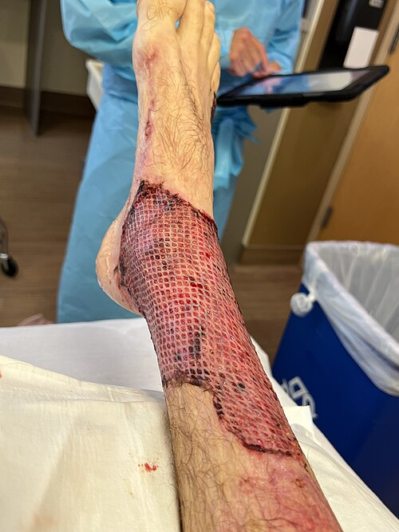
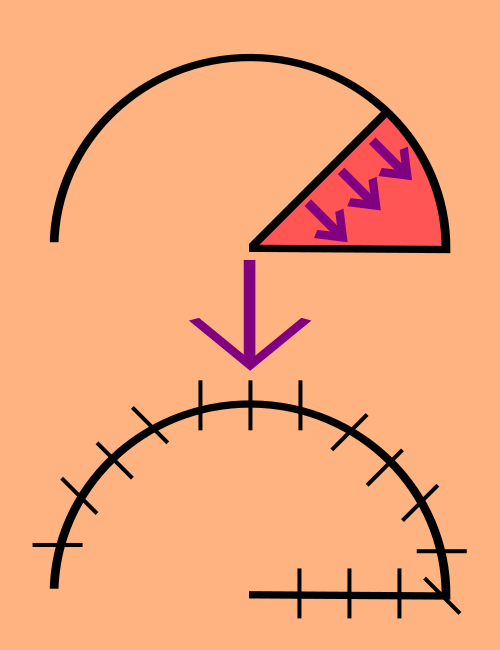
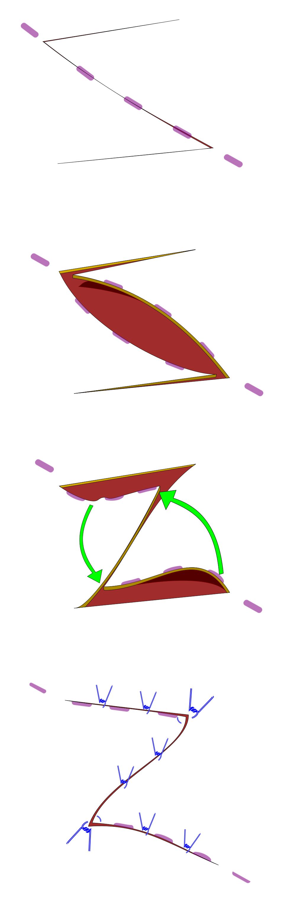

# ENXERTOS E RETALHOS CUTÂNEOS

Para entender a cirurgia reparadora, você precisa dominar a diferença fundamental entre um enxerto e um retalho. Se você confundir isso na prova — ou no centro cirúrgico — o erro é conceitual e grave.

A diferença reside em uma única palavra: **pedículo**.

Um **enxerto** é um segmento de tecido (pele, derme, gordura, osso) que é completamente destacado de sua área doadora. Ele perde toda a conexão vascular original. Para sobreviver, ele depende exclusivamente das condições do leito receptor. Ele é um "parasita" temporário que precisa ser adotado pelo novo local.

Já o **retalho** é um tecido que é transferido de um local para outro, mas mantém um pedículo vascular (uma ponte de tecido que contém artérias e veias). Ele leva o próprio suprimento sanguíneo.

Por que isso importa? Porque se você tem um osso exposto, sem periósteo, o enxerto não vai "pegar". Não há vasos no osso seco para nutrir o enxerto. Nesse cenário, você é obrigado a usar um retalho, que já traz o sangue consigo. Guarde isso: leito sem vascularização (osso, tendão, cartilagem sem pericôndrio) exige retalho.

*Figura 1 - Enxerto de pele aplicado no tornozelo após queimadura de terceiro grau, demonstrando a integração do enxerto ao leito receptor. Fonte: Giftrapped, CC BY-SA 4.0 | Wikimedia Commons*

## Enxertos Cutâneos: A Fisiologia da Integração

Quando você coloca um enxerto de pele sobre uma ferida, ele passa por um processo crítico de "pega" (integração). As bancas de residência amam cobrar as fases cronológicas desse processo. No MedEvo, sempre batemos na tecla de que entender a cronologia evita decorar tabelas inúteis.

### As Três Fases da Integração

-

**Embebição Plasmática (0 a 48 horas):**
Nas primeiras 48 horas, o enxerto não tem vasos conectados. Ele sobrevive por difusão passiva de nutrientes vindos do leito receptor. O enxerto "bebe" o plasma. Nesse estágio, o enxerto ganha peso (fica edemaciado) e a aderência inicial é feita por uma rede de fibrina.
*Dica de prova:* Se houver um hematoma entre o enxerto e o leito, o enxerto não consegue "beber" e morre. O hematoma é a causa número 1 de perda de enxerto.

-

**Inosculação Vascular (48 a 72 horas):**
Os capilares do leito receptor começam a se alinhar com os capilares do enxerto. É como se dois túneis se encontrassem no meio de uma montanha. Há o estabelecimento de uma rede de comunicação vascular rudimentar.

-

**Revascularização / Neovascularização (> 72 horas):**
Novos vasos crescem do leito para dentro do enxerto. O fluxo sanguíneo definitivo é estabelecido. É aqui que o enxerto ganha aquela cor rosada saudável.

### Classificação dos Enxertos de Pele

Os enxertos são classificados de acordo com a espessura de derme que levam consigo. Todos levam a epiderme completa, o que muda é a derme.

-

**Enxerto de Pele Parcial (EPP):** Inclui a epiderme e uma porção variável da derme.

- *Vantagem:* A área doadora cicatriza sozinha (reepitelização a partir dos anexos cutâneos, como folículos pilosos e glândulas sebáceas que ficaram no fundo). Por isso, podemos tirar grandes quantidades de pele parcial para grandes queimados.

- *Desvantagem:* Sofre muita **contração secundária** (o enxerto encolhe muito após cicatrizar) e tem um resultado estético pior (parece um "remendo").

-

**Enxerto de Pele Total (EPT):** Inclui a epiderme e toda a derme, até a gordura (mas a gordura deve ser retirada, pois ela é pouco vascularizada e impede a integração).

- *Vantagem:* Sofre pouca contração secundária, mantém melhor a cor e a textura. É o ideal para face e mãos.

- *Desvantagem:* A área doadora não cicatriza sozinha; você precisa fechar a área doadora com sutura primária. Por isso, as áreas doadoras são limitadas (atrás da orelha, região inguinal, supraclavicular).

**Tabela 1: Comparativo entre Enxertos de Pele Parcial e Total**

| Característica | Pele Parcial (EPP) | Pele Total (EPT) |
| --- | --- | --- |
| **Composição** | Epiderme + parte da derme | Epiderme + derme total |
| **Área Doadora** | Reepiteliza sozinha | Precisa de sutura |
| **Integração (Pega)** | Mais fácil (menos exigente) | Mais difícil (exige leito perfeito) |
| **Contração Primária** | Menor (pouca elastina) | Maior (muita elastina) |
| **Contração Secundária** | Maior (muito miofibroblasto) | Menor |
| **Estética Final** | Pobre (brilhante, discrômica) | Excelente (similar à pele normal) |

*Cuidado com a pegadinha:* A **contração primária** ocorre no momento em que você corta a pele (devido às fibras elásticas). Como o enxerto total tem mais derme (e mais elastina), ele encolhe mais assim que é retirado. Já a **contração secundária** ocorre durante a cicatrização (devido aos miofibroblastos). O enxerto parcial, por ser mais fino, oferece menos resistência e encolhe muito mais no leito receptor ao longo das semanas.

### Causas de Perda de Enxerto

Se o seu enxerto não integrou, a culpa geralmente é de um destes três fatores:

- **Hematoma/Seroma:** É a causa mais comum. O líquido separa o enxerto do leito, impedindo a embebição.

- **Infecção:** O *Streptococcus pyogenes* é particularmente perigoso, pois produz enzimas (fibrinolisinas) que destroem a rede de fibrina que segura o enxerto.

- **Cisalhamento (Movimentação):** Se o enxerto se move sobre o leito, os microvasos que estão tentando se conectar (inosculação) se rompem. Por isso, usamos o **Curativo de Brown** (curativo amarrado/compressivo) e imobilizamos a área.

*Pérola Clínica:* O Curativo de Brown deve ser retirado entre o 5º e o 7º dia. Retirar antes pode causar cisalhamento; retirar muito depois dificulta a higiene e aumenta risco de infecção.

*Figura 2 - Ilustração da técnica de retalho de rotação: o tecido é mobilizado em arco mantendo o pedículo vascular intacto para cobertura do defeito. Fonte: Taylornate, CC BY-SA 3.0 | Wikimedia Commons*

## Retalhos Cutâneos: A Arte da Vascularização Própria

Diferente do enxerto, o retalho não depende do leito para sobreviver inicialmente. Ele já traz seu "marmitex" de sangue. Como diz o Dr. Will, o retalho é a solução para o "deserto vascular".

### Classificação quanto à Vascularização

Esta é a classificação mais cobrada em provas de alto nível:

- **Retalhos ao Acaso (Random):** Não possuem uma artéria específica nutrindo-os. Eles dependem do **plexo vascular subdérmico**. Por isso, têm limitações de tamanho (geralmente uma relação comprimento:largura de 2:1 ou 3:1 na face). Se você fizer um retalho ao acaso muito comprido, a ponta sofrerá isquemia.

- **Retalhos Axiais:** São construídos em torno de uma artéria e veia conhecidas (pedículo definido).

- Exemplo clássico: **Retalho Inguinal** (baseado na artéria ilíaca circunflexa superficial).

- Outro exemplo: **Retalho Deltopeitoral** (ou de Bakamjian), muito usado para reconstruções de cabeça e pescoço.

### Classificação quanto ao Movimento

Como você move o tecido para cobrir o buraco?

- **Avanço:** O tecido desliza em linha reta para frente. É a primeira escolha para lesões faciais pequenas, pois mantém a cor e textura locais.

- **Rotação:** O tecido gira em arco ao redor de um ponto fixo (pivô).

- **Transposição:** O retalho é "passado por cima" de uma área de pele íntegra para chegar ao defeito. A **Zetaplastia** é um tipo especial de retalho de transposição.

- **Interpolação:** Semelhante à transposição, mas o pedículo precisa ser cortado em um segundo tempo cirúrgico (ex: retalho de testuz para reconstrução de nariz).

### Zetaplastia: O "Z" que Salva

*Figura 3 - Esquema de zetaplastia, mostrando a transposição dos retalhos triangulares para alongar a cicatriz e redirecionar a tensão. Fonte: Evan Mason, CC BY-SA 4.0 | Wikimedia Commons*

A Zetaplastia consiste na transposição de dois retalhos triangulares.

- **Objetivo:** Alongar uma cicatriz em uma direção e quebrar a tensão.

- **Regra de Ouro:** Quanto maior o ângulo dos triângulos, maior o alongamento. Um ângulo de 60° proporciona um ganho teórico de 75% no comprimento da cicatriz original.

- *Indicação:* Cicatrizes retráteis que limitam o movimento de articulações ou distorcem a anatomia (como uma brida no pescoço ou axila).

**Tabela 2: Enxerto vs. Retalho**

| Característica | Enxerto | Retalho |
| --- | --- | --- |
| **Suprimento Vascular** | Depende do leito receptor | Próprio (pedículo) |
| **Indicação Principal** | Áreas bem vascularizadas, grandes extensões | Exposição de estruturas nobres, osso, tendão |
| **Complexidade** | Baixa | Média a Alta |
| **Sobrevivência Inicial** | Embebição plasmática | Fluxo arterial/venoso imediato |
| **Causa de Insucesso** | Hematoma | Trombose venosa / Torção do pedículo |

## Feridas Complexas e Traumatismos

Na prática da emergência, você enfrentará situações onde a escolha entre enxerto e retalho define o prognóstico funcional do paciente.

### Trauma de Mão e Amputações

Imagine um paciente que chega com uma amputação traumática da falange distal.

- **Preservação do segmento:** Envolver em compressa úmida com soro fisiológico, colocar em um saco plástico vedado e, então, colocar esse saco dentro de um recipiente com gelo. **Nunca** coloque o dedo direto no gelo ou direto no soro (causa maceração e lesão térmica).

- **Mordedura de Cachorro:** O foco principal é a **função** e a prevenção de infecção. Limpeza exaustiva é mandatória.

- **Hematoma Subungueal:** Se o paciente tem um esmagamento da ponta do dedo com hematoma sob a unha e uma fratura da falange distal associada, isso é considerado, por definição, uma **fratura exposta**. Requer antibioticoterapia e cuidado redobrado.

### Ferimentos Descolantes (Degloving)

Acontece muito em atropelamentos (pneu passa sobre a perna). A pele é "descolada" da fáscia, rompendo os vasos perfurantes.

- *Conduta:* Não adianta apenas costurar a pele de volta; ela vai necrosar porque perdeu a vascularização. O correto é desbridar o tecido inviável, "emagrecer" a pele (transformá-la em um enxerto de pele total ou parcial, retirando a gordura) e re-enxertar sobre o leito, preferencialmente com curativo a vácuo.

## Oncologia Cutânea: CBC e CEC

As reconstruções com retalhos são frequentemente necessárias após a exérese de tumores. Você precisa saber o que está operando.

### Carcinoma Basocelular (CBC)

É o câncer de pele mais comum.

- **Comportamento:** Localmente invasivo e destrutivo ("ulcus rodens"), mas **raramente** metastatiza.

- **Tipos:**

- *Baixo Risco (Nodular, Superficial):* Pode ser tratado com curetagem e eletrocoagulação em áreas de baixo risco.

- *Alto Risco (Esclerodermiforme, Micronodular, Recidivante):* Exige excisão cirúrgica com margens ou Cirurgia de Mohs.

- *Localização:* Áreas fotoexpostas (nariz é o local nº 1).

### Carcinoma Espinocelular (CEC)

Diferente do CBC, o CEC tem potencial real de metástase linfonodal.

- **Doença de Bowen:** É o nome dado ao CEC *in situ*. Clinicamente parece uma placa eritematosa descamativa, muitas vezes confundida com psoríase ou CBC superficial.

- **Fatores de Risco:** Radiação UV, cicatrizes de queimadura antigas (Úlcera de Marjolin), imunossupressão e HPV.

## Complicações Sistêmicas em Cirurgia Plástica

Não caia no erro de achar que complicações de cirurgia plástica são apenas estéticas. Duas condições caem muito em provas de cirurgia e clínica médica:

- **Síndrome da Embolia Gordurosa:**
Típica do 1º ou 2º dia pós-operatório de grandes lipoaspirações ou fraturas de ossos longos.

- *Tríade Clássica:* Insuficiência respiratória súbita (dispneia, queda de saturação), alterações neurológicas e petéquias (especialmente em tórax e conjuntiva).

- **Trombose Venosa Profunda (TVP) e TEP:**
A obesidade é um fator de risco crucial. Em cirurgias longas de abdome (abdominoplastia), a profilaxia mecânica e farmacológica é essencial.

## Unha Encravada (Onicocriptose)

Um tema aparentemente simples, mas cheio de detalhes técnicos:

- **Etiologia:** Corte incorreto das unhas, calçados apertados e, curiosamente, a **obesidade** (o excesso de tecido mole periungueal "atropela" a unha).

- **Tratamento Cirúrgico:**

- **Cantoplastia:** Retirada da borda lateral da unha junto com a matriz correspondente (matricectomia) e a ressecção da hiperplasia de tecidos moles (granuloma).

- *Paroníquia:* É a infecção da dobra ungueal. Se houver abscesso, o tratamento é drenagem.

## 📊 Tabelas de Consulta Rápida

**Tabela 3: Classificação Vascular dos Retalhos**

| Tipo de Retalho | Suprimento Vascular | Exemplo Clínico |
| --- | --- | --- |
| **Ao Acaso (Random)** | Plexo subdérmico | Retalho de avanço simples na face |
| **Axial** | Artéria cutânea direta | Retalho Inguinal (Iliaca circunflexa superficial) |
| **Musculocutâneo** | Vasos perfurantes do músculo | Retalho de Grande Dorsal ou TRAM |
| **Fasciocutâneo** | Vasos do plexo suprafascial | Retalho de artéria radial (Chinês) |

**Tabela 4: Manejo de Feridas e Cobertura**

| Tipo de Ferida | Melhor Opção de Cobertura | Por que? |
| --- | --- | --- |
| Queimadura extensa, leito muscular viável | Enxerto de Pele Parcial | Permite cobrir grandes áreas; área doadora regenera. |
| Perda de substância na ponta do nariz | Retalho de Avanço ou EPT | Melhor estética e menor contração. |
| Exposição de tendão do calcâneo (Aquiles) | Retalho (Fasciocutâneo ou Muscular) | Tendão não tem vascularização para sustentar enxerto. |
| Ferida contaminada (mordedura antiga) | Fechamento por 3ª intenção | Limpeza e desbridamento primeiro; fecha após controle. |

## ## Pontos-Chave para Prova 💡

- **Hematoma:** É a causa mais comum de perda de enxerto (impede a embebição plasmática).

- **Trombose Venosa:** É a causa mais comum de perda de retalhos pediculados (gera congestão e isquemia subsequente).

- **Enxerto de Pele Total:** Tem **menor contração secundária** e melhor resultado estético, mas a "pega" é mais difícil.

- **Enxerto de Pele Parcial:** Tem **maior contração secundária**; indicado para grandes áreas (queimados).

- **Fases do Enxerto:** Embebição (até 48h) -> Inosculação (48-72h) -> Revascularização (>72h).

- **Curativo de Brown:** Serve para imobilizar o enxerto e garantir contato com o leito. Retirar entre 5-7 dias.

- **Retalho Axial:** Possui uma artéria definida. O exemplo de prova é o **Retalho Inguinal**.

- **Zetaplastia:** Usada para alongar cicatrizes. Ângulo de 60° = 75% de ganho de comprimento.

- **Osso e Tendão expostos:** Exigem **RETALHO**. Enxerto não sobrevive sobre osso sem periósteo ou tendão sem paratendão.

- **CBC:** Tumor maligno mais comum; invasivo localmente; metástase é raríssima.

- **Amputação de Dedo:** Transporte em saco plástico seco, dentro de outro recipiente com gelo (gelo seco/indireto).

- **Embolia Gordurosa:** Suspeitar em pós-operatório de lipoaspiração com dispneia e petéquias.

- **Fratura Exposta da Unha:** Hematoma subungueal + fratura de falange distal.

- **Área Doadora de Enxerto Parcial:** Cicatriza por reepitelização a partir dos anexos cutâneos (glândulas e folículos).

- **Doença de Bowen:** É o Carcinoma Espinocelular (CEC) *in situ*.

Lembre-se: em cirurgia plástica, a escada reconstrutiva começa do mais simples para o mais complexo. Primeiro tentamos fechamento primário, depois cicatrização por segunda intenção, depois enxerto e, por fim, retalhos. Se a prova te der uma ferida limpa e vascularizada, não "invente" um retalho complexo se um enxerto resolve. Mas se houver osso exposto, o enxerto é erro médico.

 Cópia offline para consulta pessoal.
 Fonte original:
 [https://www.medevo.com.br/material-apoio/ler/153ee4df-f0d2-420d-8a6a-8a28ceeccb21](https://www.medevo.com.br/material-apoio/ler/153ee4df-f0d2-420d-8a6a-8a28ceeccb21)
