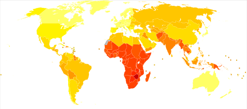

# EPIDEMIOLOGIA DE DOENÇAS TRANSMISSÍVEIS

A epidemiologia das doenças transmissíveis estuda como os agentes infecciosos circulam entre indivíduos e populações. Para provas de residência, o essencial é reconhecer a cadeia de transmissão, os mecanismos de propagação, as medidas de controle e os agravos de maior relevância em saúde pública.

## Tríade epidemiológica

A ocorrência de uma doença transmissível depende da interação entre:

- **Agente etiológico:** vírus, bactéria, fungo, protozoário ou helminto.

- **Hospedeiro suscetível:** indivíduo sem imunidade ou com fatores de risco.

- **Ambiente:** condições que favorecem ou dificultam a transmissão, como saneamento, clima, moradia, densidade populacional e acesso aos serviços de saúde.

## Cadeia de transmissão

A cadeia de transmissão descreve o percurso do agente até alcançar um novo hospedeiro.

Principais elementos:

- **Reservatório:** local onde o agente vive, se mantém e se multiplica habitualmente. Pode ser humano, animal ou ambiente.

- **Fonte de infecção:** local ou ser a partir do qual o agente passa diretamente para o hospedeiro.

- **Porta de saída:** via pela qual o agente deixa o reservatório, como secreções respiratórias, sangue, fezes, urina ou lesões.

- **Via de transmissão:** forma pela qual o agente alcança outro hospedeiro.

- **Porta de entrada:** mucosas, pele lesada, trato respiratório, trato digestivo, via parenteral ou transplacentária.

- **Hospedeiro suscetível:** indivíduo capaz de se infectar.

Exemplos importantes:

- Na **tuberculose pulmonar bacilífera**, o ser humano doente é reservatório e fonte de infecção.

- Na **malária**, o ser humano é o principal reservatório no ciclo de transmissão.

- Na **febre amarela silvestre**, primatas não humanos atuam como sentinelas epidemiológicas, mas não são os principais reservatórios mantenedores do vírus.

## Formas de transmissão

#### Transmissão direta

Ocorre sem intermediários relevantes.

Exemplos:

- Contato sexual: sífilis, HIV, gonorreia.

- Gotículas respiratórias: meningite meningocócica, influenza.

- Transmissão vertical: HIV, sífilis, hepatite B, Zika.

#### Transmissão indireta

Depende de veículo ou vetor.

Exemplos:

- Água e alimentos contaminados: hepatite A, cólera, doença de Chagas por via oral.

- Fômites: objetos contaminados.

- Vetores: Aedes, Anopheles, triatomíneos.

#### Gotículas x aerossóis

Essa diferenciação é muito cobrada.

- **Gotículas:** partículas maiores, percorrem curta distância e exigem contato próximo. Usar máscara cirúrgica. Exemplo: meningite meningocócica.

- **Aerossóis:** partículas menores, permanecem suspensas no ar por mais tempo. Usar máscara N95/PFF2. Exemplos: tuberculose pulmonar, sarampo e varicela.

## Propriedades dos agentes infecciosos

- **Infectividade:** capacidade de penetrar, alojar-se e multiplicar-se no hospedeiro.

- **Patogenicidade:** capacidade de causar doença entre os infectados.

- **Virulência:** capacidade de causar formas graves ou morte.

- **Imunogenicidade:** capacidade de induzir resposta imune protetora.

Exemplo clássico: o poliovírus tem alta infectividade, mas baixa patogenicidade, pois grande parte das infecções é assintomática. Já o sarampo tem alta infectividade e alta patogenicidade.

## R0, Rt e imunidade coletiva

O **número reprodutivo básico (R0)** é o número médio de casos secundários gerados por um caso primário em população totalmente suscetível.

- **R0 > 1:** tendência de expansão.

- **R0 = 1:** transmissão estável.

- **R0 < 1:** tendência de controle ou extinção.

O **número reprodutivo efetivo (Rt ou Re)** considera a população real, incluindo pessoas imunes por vacinação ou infecção prévia.

A **imunidade coletiva** reduz o número de suscetíveis e ajuda a manter o Rt abaixo de 1. Quanto maior o R0 de uma doença, maior a cobertura vacinal necessária para bloqueio da transmissão.

Exemplo: sarampo tem R0 muito alto, por isso exige coberturas vacinais elevadas e homogêneas.

## Endemia, epidemia, surto e pandemia

- **Endemia:** ocorrência habitual de uma doença em determinada área, dentro do padrão esperado.

- **Epidemia:** aumento acima do esperado para uma população, local e período.

- **Surto:** epidemia localizada, restrita a um grupo, instituição ou área pequena.

- **Pandemia:** epidemia com disseminação internacional sustentada.

A identificação de epidemias pode ser feita por comparação com séries históricas e canal endêmico.

## Arboviroses no Brasil

Dengue, Zika e Chikungunya são transmitidas principalmente pelo **Aedes aegypti**. No Brasil, apresentam sazonalidade, com aumento nos períodos quentes e chuvosos.

| Doença | Febre | Exantema | Dor articular | Achado característico |
| --- | --- | --- | --- | --- |
| Dengue | Alta, súbita | Pode ocorrer, geralmente mais tardio | Moderada | Mialgia intensa, dor retro-orbitária, sinais de alarme |
| Chikungunya | Alta, súbita | Frequente | Intensa, incapacitante | Artralgia persistente ou crônica |
| Zika | Baixa ou ausente | Precoce e pruriginoso | Leve a moderada | Conjuntivite não purulenta, edema de extremidades |

#### Dengue

A dengue varia de formas assintomáticas a quadros graves. O ponto central da gravidade é o **extravasamento plasmático**, que pode levar a choque. Também podem ocorrer sangramento grave e acometimento grave de órgãos.

Sinais de alarme importantes:

- Dor abdominal intensa e contínua.

- Vômitos persistentes.

- Hipotensão postural ou lipotimia.

- Sangramento de mucosas.

- Letargia ou irritabilidade.

- Hepatomegalia.

- Aumento progressivo do hematócrito.

- Derrames cavitários.

Plaquetopenia isolada não define dengue grave.

#### Zika

A Zika costuma cursar com exantema pruriginoso precoce, febre baixa ou ausente, conjuntivite não purulenta e edema de extremidades. Tem importância especial pela associação com **síndrome congênita pelo Zika vírus** e **síndrome de Guillain-Barré**.

#### Chikungunya

A Chikungunya se destaca pela artralgia intensa, geralmente poliarticular e incapacitante. Pode evoluir com dor articular persistente por meses, especialmente em idosos e pessoas com doença articular prévia.

## Tuberculose

A tuberculose é transmitida por aerossóis, principalmente a partir de pessoas com forma pulmonar ou laríngea bacilífera.

Pontos essenciais:

- Sintomático respiratório clássico: tosse por 3 semanas ou mais, com ou sem febre vespertina, sudorese noturna, emagrecimento e expectoração.

- O **teste rápido molecular para tuberculose (TRM-TB)** é recomendado como exame inicial quando disponível, pois detecta o complexo *Mycobacterium tuberculosis* e resistência à rifampicina.

- A baciloscopia segue útil para avaliar infectividade, acompanhamento e controle do tratamento.

- O tratamento básico da TB sensível é: 2 meses de rifampicina, isoniazida, pirazinamida e etambutol, seguidos de 4 meses de rifampicina e isoniazida.

#### Recém-nascido de mãe bacilífera

Se a mãe tem tuberculose pulmonar ou laríngea bacilífera no momento do parto e o RN está assintomático:

- Não aplicar BCG ao nascer.

- Iniciar quimioprofilaxia primária.

- Após 3 meses, realizar teste tuberculínico.

- Se teste negativo: suspender profilaxia e vacinar com BCG.

- Se teste positivo: manter tratamento da infecção latente e não vacinar com BCG.

## Doença de Chagas

A doença de Chagas é causada pelo *Trypanosoma cruzi*.

Formas de transmissão:

- Vetorial, por triatomíneos.

- Oral, por alimentos contaminados.

- Vertical.

- Transfusional ou por transplante, atualmente menos frequente devido à triagem.

- Acidental, em laboratório.

No Brasil, a forma oral ganhou destaque em surtos na região Norte, especialmente associados a alimentos contaminados, como açaí e caldo de cana.

Na fase aguda, a parasitemia é alta, por isso o diagnóstico deve priorizar métodos parasitológicos diretos. A doença aguda pode cursar com febre prolongada, edema, linfonodomegalia, hepatoesplenomegalia e miocardite.

## HIV e prevenção combinada

A prevenção do HIV não depende apenas do preservativo. O conceito atual é **prevenção combinada**, que inclui:

- Preservativos.

- Testagem regular.

- Tratamento das pessoas vivendo com HIV.

- Indetectável = intransmissível nas relações sexuais.

- PrEP para pessoas com maior risco de exposição.

- PEP após exposição de risco.

- Diagnóstico e tratamento de outras ISTs.

- Imunização contra hepatite B e HPV, quando indicada.

A **PEP** deve ser iniciada o mais rápido possível, preferencialmente nas primeiras horas, e no máximo até 72 horas após a exposição. A duração é de 28 dias.

A meta global atual é **95-95-95**: 95% das pessoas vivendo com HIV diagnosticadas, 95% das diagnosticadas em tratamento e 95% das tratadas com supressão viral.

## Sífilis

A sífilis é causada pelo *Treponema pallidum* e é doença de notificação compulsória.

Fases clínicas:

- **Primária:** cancro duro, geralmente úlcera única, indolor, de base limpa e bordas endurecidas.

- **Secundária:** manifestações sistêmicas, exantema, lesões palmoplantares, condiloma plano e linfonodomegalia.

- **Latente recente:** assintomática, com até 1 ano de evolução.

- **Latente tardia ou de duração ignorada:** assintomática, com mais de 1 ano ou tempo desconhecido.

- **Terciária:** acometimento cardiovascular, neurológico ou gomatosa.

O tratamento de escolha é a **benzilpenicilina benzatina**, conforme o estágio clínico.

#### Sífilis na gestação

Para prevenção da sífilis congênita, o tratamento materno adequado exige:

- Benzilpenicilina benzatina.

- Esquema correto para o estágio clínico.

- Intervalos adequados entre as doses.

- Tratamento iniciado com tempo hábil e concluído antes do parto.

- Documentação do tratamento e seguimento sorológico.

Não basta prescrever penicilina: se o esquema não foi completo, foi inadequado ao estágio, teve intervalo incorreto ou não foi concluído antes do parto, a gestante deve ser considerada inadequadamente tratada para fins de avaliação do recém-nascido.

O tratamento da parceria sexual não é critério para definir tratamento materno adequado, mas a parceria deve ser convocada, testada e tratada para evitar reinfecção.

## Malária

A malária é causada por protozoários do gênero *Plasmodium* e transmitida pela fêmea do mosquito *Anopheles*.

No Brasil:

- *P. vivax* é o mais prevalente.

- *P. falciparum* está mais associado a formas graves.

- A maior carga ocorre na região Amazônica.

A febre ocorre em paroxismos relacionados à ruptura das hemácias durante a esquizogonia sanguínea, mas o padrão clássico pode não estar presente no início.

Tratamento:

- *P. vivax*: cloroquina associada à primaquina para erradicar hipnozoítos hepáticos e prevenir recaídas.

- *P. falciparum*: esquemas com derivados de artemisinina, conforme orientação vigente do Ministério da Saúde.

A primaquina é contraindicada em algumas situações, como gestação e deficiência de G6PD, exigindo avaliação específica.

## Hepatites virais

#### Hepatite A

- Transmissão fecal-oral.

- Associada a saneamento precário e surtos por água ou alimentos contaminados.

- Causa infecção aguda e autolimitada.

- Não cronifica.

- Prevenível por vacina.

#### Hepatite B

- Transmissão sexual, parenteral e vertical.

- Pode cronificar.

- Prevenível por vacina.

- A prevenção da transmissão vertical exige triagem no pré-natal e medidas no recém-nascido, como vacina e imunoglobulina quando indicadas.

#### Hepatite C

- Transmissão principalmente parenteral.

- Pode cronificar.

- Não há vacina.

- A transmissão sexual é menos eficiente, mas pode ocorrer, especialmente em contextos de exposição a sangue, práticas traumáticas ou coinfecção por HIV.

## Sarampo

O sarampo é uma das doenças infecciosas mais contagiosas.

Características:

- Transmissão por aerossóis.

- Pródromos com febre, tosse, coriza e conjuntivite.

- Manchas de Koplik antes do exantema.

- Exantema morbiliforme com progressão cefalocaudal.

- Transmissibilidade de cerca de 6 dias antes até 4 dias após o início do exantema, com maior risco nos dias próximos ao aparecimento das lesões.

A vacina é de vírus vivo atenuado, mas o vírus vacinal não é transmitido de pessoa a pessoa. Portanto, criança vacinada não transmite sarampo vacinal para gestante ou imunossuprimido.

## Parasitoses e eosinofilia

Eosinofilia importante sugere principalmente helmintíases, especialmente quando há ciclo pulmonar.

Helmintos associados ao ciclo de Loeffler:

- *Ascaris lumbricoides*.

- *Ancylostoma duodenale*.

- *Necator americanus*.

- *Strongyloides stercoralis*.

A síndrome de Loeffler cursa com tosse seca, febre, sibilância, eosinofilia e infiltrados pulmonares migratórios.

Tratamento:

- Helmintos intestinais: geralmente albendazol ou mebendazol, conforme parasita e contexto.

- Protozoários, como giardíase e amebíase: metronidazol ou outros nitroimidazólicos, conforme indicação.

Metronidazol não trata helmintos.

*Figura 2 - Mapa mundial de DALY por doenças infecciosas e parasitárias (OMS, 2004), mostrando a concentração nos países tropicais. Fonte: Lokal_Profil, CC BY-SA 2.5 | Wikimedia Commons*

## Vigilância epidemiológica e notificação

A vigilância epidemiológica identifica, monitora e orienta medidas de controle de agravos de importância em saúde pública.

A notificação compulsória deve ser feita quando há suspeita ou confirmação de agravos listados pelo Ministério da Saúde.

Tipos de notificação:

- **Notificação semanal:** feita em até 7 dias.

- **Notificação imediata:** feita em até 24 horas, diante de agravos com maior gravidade, potencial de disseminação ou relevância internacional.

- **Notificação negativa:** informação de ausência de casos em determinado período, usada para monitorar a sensibilidade da vigilância.

Exemplos de agravos de notificação imediata incluem cólera, peste, raiva humana, febre amarela e sarampo.

### Febres exantemáticas

Principais diagnósticos diferenciais:

- **Sarampo:** febre alta, tosse, coriza, conjuntivite, manchas de Koplik e exantema morbiliforme cefalocaudal.

- **Rubéola:** febre baixa, exantema mais leve e linfonodomegalia retroauricular, occipital e cervical posterior.

- **Eritema infeccioso:** parvovírus B19, face esbofeteada e exantema rendilhado.

- **Escarlatina:** faringite estreptocócica, exantema em lixa, sinal de Pastia e palidez perioral.

- **Zika:** exantema pruriginoso precoce, conjuntivite não purulenta e pouca febre.

### Leptospirose

A leptospirose é uma zoonose causada por *Leptospira*, transmitida principalmente pelo contato com urina de roedores infectados, especialmente em enchentes e alagamentos.

A bactéria penetra por pele lesionada, mucosas ou pele íntegra quando há exposição prolongada à água contaminada.

A forma grave é a **síndrome de Weil**, caracterizada por:

- Icterícia rubínica.

- Insuficiência renal aguda, frequentemente com hipocalemia.

- Hemorragias, incluindo hemorragia pulmonar.

- Instabilidade hemodinâmica em casos graves.

O tratamento de casos graves pode ser feito com penicilina cristalina ou ceftriaxona.

### Meningite meningocócica

Na suspeita de meningite meningocócica, as prioridades são:

- Estabilização clínica.

- Isolamento por gotículas.

- Coleta de exames quando não atrasar tratamento.

- Antibioticoterapia imediata.

- Notificação e quimioprofilaxia de contatos próximos.

A quimioprofilaxia deve ser feita o mais cedo possível para contatos íntimos. Opções incluem rifampicina, ceftriaxona ou ciprofloxacino, conforme idade, gestação, contraindicações e protocolos locais.

### Manejo sindrômico de ISTs

| Síndrome | Agentes frequentes | Conduta usual |
| --- | --- | --- |
| Corrimento uretral | *Neisseria gonorrhoeae* e *Chlamydia trachomatis* | Ceftriaxona IM associada a tratamento para clamídia quando indicado |
| Úlcera genital compatível com sífilis | *Treponema pallidum* | Benzilpenicilina benzatina |
| Cancro mole | *Haemophilus ducreyi* | Azitromicina ou ceftriaxona, conforme protocolo |
| DIP leve a moderada | Polimicrobiana, incluindo gonococo, clamídia e anaeróbios | Ceftriaxona + doxiciclina + metronidazol por 14 dias |

Em ISTs, sempre considerar testagem para HIV, sífilis e hepatites, vacinação quando indicada, avaliação de parcerias sexuais e aconselhamento para prevenção.

## Doenças emergentes e reemergentes

- **Doença emergente:** nova ou recentemente identificada, ou que passa a ocorrer em área onde antes não era reconhecida.

- **Doença reemergente:** doença conhecida que volta a aumentar após período de controle.

Fatores associados:

- Urbanização desordenada.

- Baixa cobertura vacinal.

- Mudanças climáticas e ambientais.

- Desmatamento e contato com novos reservatórios.

- Globalização, viagens e comércio internacional.

- Resistência antimicrobiana.

- Falhas de vigilância e controle vetorial.

- Desinformação e hesitação vacinal.

## Pontos-chave para prova

- Reservatório é onde o agente se mantém; fonte de infecção é de onde ele sai para infectar o hospedeiro.

- Infectividade é capacidade de infectar; patogenicidade é capacidade de causar doença; virulência é capacidade de causar formas graves ou morte.

- R0 mede transmissão em população totalmente suscetível; Rt mede transmissão na população real.

- Epidemia é aumento acima do esperado; surto é epidemia localizada.

- Dengue grave se relaciona principalmente a extravasamento plasmático, choque, sangramento grave ou acometimento grave de órgãos.

- Zika se associa a síndrome congênita e Guillain-Barré.

- Chikungunya se destaca por artralgia intensa e potencialmente crônica.

- Tuberculose pulmonar é transmitida por aerossóis; usar N95/PFF2.

- Meningite meningocócica exige isolamento por gotículas e quimioprofilaxia dos contatos próximos.

- RN de mãe bacilífera não deve receber BCG ao nascer; deve fazer quimioprofilaxia e reavaliação posterior.

- Doença de Chagas aguda no Brasil atual deve lembrar transmissão oral, especialmente na região Norte.

- Sífilis na gestação só é adequadamente tratada com benzilpenicilina benzatina, esquema correto e tratamento concluído antes do parto.

- PEP para HIV deve começar o quanto antes, no máximo até 72 horas, e dura 28 dias.

- Hepatite A não cronifica; hepatites B e C podem cronificar.

- Sarampo é transmitido por aerossóis e exige alta cobertura vacinal.

- Vírus vacinal do sarampo não é transmissível.

- Eosinofilia com sintomas pulmonares sugere helmintos com ciclo de Loeffler.

- Leptospirose grave: icterícia rubínica, insuficiência renal aguda e hemorragia, especialmente pulmonar.

- Notificação compulsória imediata deve ser feita em até 24 horas.

 Cópia offline para consulta pessoal.
 Fonte original:
 [https://www.medevo.com.br/material-apoio/ler/aa2262ee-4263-4e43-bd69-0381089e9b0b](https://www.medevo.com.br/material-apoio/ler/aa2262ee-4263-4e43-bd69-0381089e9b0b)
