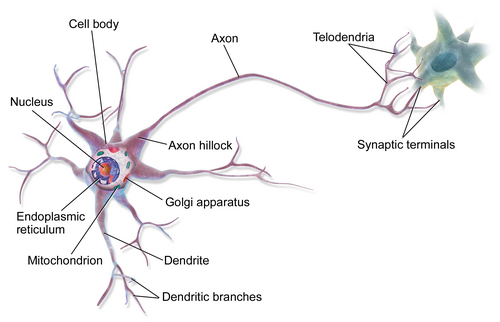
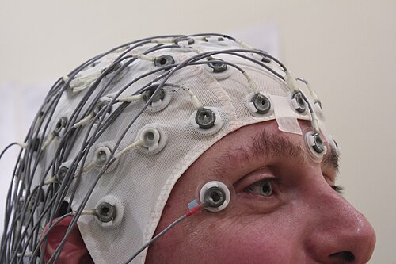

# EPILEPSIA

Para começar nossa conversa, precisamos alinhar o que é, de fato, a epilepsia. Muitos alunos chegam à prova achando que qualquer convulsão é epilepsia, e esse é o primeiro erro que as bancas exploram. A epilepsia não é um sintoma isolado, é uma doença cerebral caracterizada por uma predisposição persistente a gerar crises epilépticas.

Segundo a ILAE (International League Against Epilepsy) e a Sociedade Brasileira de Pediatria (SBP), o diagnóstico de epilepsia é definido por qualquer uma das seguintes condições:

- Pelo menos duas crises não provocadas (ou reflexas) ocorrendo com intervalo superior a 24 horas.

- Uma crise não provocada (ou reflexa) e uma probabilidade de crises futuras semelhante ao risco de recorrência geral (pelo menos 60%) após duas crises não provocadas, ocorrendo nos próximos 10 anos. Isso acontece, por exemplo, se o paciente teve uma crise e tem uma lesão estrutural óbvia na ressonância ou um EEG claramente epileptiforme.

- Diagnóstico de uma síndrome epiléptica (como a Síndrome de West).

Por que essa distinção é vital? Porque se uma criança tem uma crise no contexto de uma febre alta (crise febril) ou de uma hipoglicemia severa, ela teve uma crise provocada. Ela não tem epilepsia. O cérebro dela apenas reagiu a um insulto agudo. Na epilepsia, o problema está no "hardware" ou no "software" do próprio cérebro.

*Figura 1 - Neurônio multipolar: corpo celular, dendritos e axônio. O equilíbrio entre excitação (glutamato) e inibição (GABA) determina a atividade elétrica normal. Fonte: BruceBlaus, CC BY 3.0 | Wikimedia Commons*

## Fisiopatologia: O Equilíbrio Quebrado

Para entender o tratamento, você precisa entender o porquê da crise. O funcionamento cerebral depende de um equilíbrio fino entre excitação e inibição.

O principal neurotransmissor excitatório é o Glutamato. O principal inibitório é o GABA. A crise epiléptica ocorre quando há um disparo elétrico excessivo e hipersincrônico de um grupo de neurônios. Isso pode acontecer por excesso de excitação ou por falta de inibição.

Quando usamos medicamentos, agimos exatamente aí. Os benzodiazepínicos, por exemplo, potencializam o GABA (aumentam a inibição). Já a fenitoína bloqueia canais de sódio, impedindo que o neurônio dispare repetidamente (diminuem a excitação). Como dizemos no MedEvo, entender o mecanismo de ação poupa metade da sua decoreba de efeitos colaterais.

## Classificação das Crises e das Epilepsias

A classificação atual da ILAE divide as crises primeiro pelo seu início. Isso define toda a sua investigação diagnóstica.

### Crises de Início Focal

São aquelas que se originam em redes limitadas a um hemisfério cerebral. Elas podem ser:

- Percepção preservada: O paciente sabe exatamente o que está acontecendo.

- Percepção comprometida: O paciente parece "fora de si", pode ter automatismos (mexer na roupa, mastigar).

### Crises de Início Generalizado

Originam-se em algum ponto e engajam rapidamente redes distribuídas bilateralmente. Aqui, a percepção está sempre comprometida desde o início. Exemplos clássicos são a crise tônico-clônica generalizada e a crise de ausência.

### Crises de Início Desconhecido

É quando não conseguimos determinar se começou focal ou generalizada, como acontece frequentemente em crises que ocorrem durante o sono.

## Síndromes Epilépticas na Infância

Aqui está o "filé mignon" das provas de residência. As bancas amam síndromes porque elas têm tríades clássicas e padrões de EEG específicos.

### Síndrome de West

Esta é, sem dúvida, a síndrome mais cobrada. Ela é uma encefalopatia epiléptica da lactância. Se você vir um caso clínico de um bebê de 4 a 8 meses com espasmos, pare tudo e procure a tríade.

A tríade da Síndrome de West consiste em:

- Espasmos infantis: Contrações musculares súbitas, geralmente em flexão (o bebê "dobra" o corpo), ocorrendo em salvas (vários seguidos), especialmente ao acordar.

- Atraso ou regressão do desenvolvimento neuropsicomotor (DNPM): A criança para de sorrir, para de sustentar o pescoço.

- Hipsarritmia no EEG: Um padrão caótico, desorganizado, com pontas e ondas lentas de alta voltagem.

O tratamento de primeira escolha, segundo a SBP e protocolos internacionais, é o ACTH (hormônio adrenocorticotrófico) ou corticosteroides (prednisolona). Em casos de Esclerose Tuberosa associada, a Vigabatrina é a droga de escolha.

### Crise de Ausência da Infância

Imagine uma criança de 5 a 10 anos que, no meio de uma frase ou brincadeira, "desliga" por 5 a 10 segundos, olha para o nada, e depois volta exatamente de onde parou, sem confusão mental pós-ictal.

O diagnóstico diferencial clássico aqui é o TDAH (desatenção). Mas no TDAH, se você chamar a criança, ela volta. Na ausência, ela não responde ao estímulo.
O achado de prova obrigatório é o EEG com complexos ponta-onda generalizados de 3 Hz.
O tratamento é feito com Etossuximida (primeira linha, mas difícil de achar no Brasil) ou Ácido Valproico. Cuidado: Carbamazepina e Fenitoína podem piorar as crises de ausência!

### Epilepsia Rolândica (Epilepsia Benigna da Infância com Pontas Centrotemporais)

É a epilepsia focal mais comum da infância. O nome "benigna" vem do fato de que quase 100% dos casos remitem na adolescência.
As crises são tipicamente noturnas, com envolvimento da face, orofaringe (sialorreia, dificuldade de fala) e podem generalizar. O EEG mostra pontas na região centrotemporal (rolândica). Muitas vezes, se as crises são raras e apenas noturnas, o Dr. Will recomenda que nem precisamos iniciar medicação, apenas observar.

### Síndrome de Lennox-Gastaut

É uma síndrome grave, que geralmente evolui de uma Síndrome de West não controlada ou de lesões cerebrais prévias.
A tríade aqui é:

- Múltiplos tipos de crises (tônicas, atônicas, ausências atípicas).

- Deficiência intelectual importante.

- EEG com complexos ponta-onda lenta (< 2,5 Hz) durante a vigília.

| Síndrome | Idade Típica | Padrão EEG | Tratamento Principal |
| --- | --- | --- | --- |
| West | 4-8 meses | Hipsarritmia | ACTH / Vigabatrina |
| Ausência | 4-12 anos | Ponta-onda 3 Hz | Etossuximida / Valproato |
| Rolândica | 3-13 anos | Pontas Centrotemporais | Observação / Carbamazepina |
| Lennox-Gastaut | 1-8 anos | Ponta-onda lenta < 2,5 Hz | Politerapia / Valproato |

## Crise Febril: O Pavor dos Pais

A crise febril é a desordem convulsiva mais comum da infância, ocorrendo em 2 a 5% das crianças entre 6 meses e 5 anos de idade. É fundamental entender que ela não é epilepsia.

### Crise Febril Simples (90% dos casos)

- Generalizada.

- Curta duração (< 15 minutos).

- Não recorre em 24 horas.

- Pós-ictal curto e sem déficit focal.

### Crise Febril Complexa

- Focal.

- Prolongada (> 15 minutos).

- Recorre em menos de 24 horas.

- Pode deixar déficit (Paralisia de Todd).

A conduta na crise febril simples é apenas tratar a febre e acalmar a família. Não há necessidade de EEG ou neuroimagem de rotina. O risco de desenvolver epilepsia no futuro é apenas discretamente maior que o da população geral (cerca de 1 a 2%).

## Estado de Mal Epiléptico (Status Epilepticus)

Esta é a emergência neurológica máxima. A definição clássica falava em 30 minutos de crise, mas para fins práticos e de tratamento (definição operacional), consideramos Estado de Mal Epiléptico (EME) qualquer crise que dure mais de 5 minutos.

Por que 5 minutos? Porque após esse tempo, a chance de a crise parar sozinha é mínima e o dano neuronal começa a se tornar uma preocupação real.

### Protocolo de Manejo do EME Pediátrico

-

Estabilização Inicial (0-5 min):

- ABCDE.

- Oxigênio suplementar.

- Glicemia capilar (Sempre! Hipoglicemia é causa reversível).

- Acesso venoso.

-

Primeira Linha (Benzodiazepínicos):

- Diazepam 0,2 a 0,3 mg/kg EV (máximo 10 mg).

- Se não houver acesso venoso: Midazolam IM (0,2 mg/kg) ou Diazepam retal.

- Pode-se repetir a dose uma vez após 5 minutos se a crise persistir.

-

Segunda Linha (Drogas Antiepilépticas de Longa Duração):

- Se a crise continua após 2 doses de BZD.

- Fenitoína: 20 mg/kg EV. Atenção: Diluir apenas em Soro Fisiológico (precipita em glicose) e correr lentamente (risco de arritmia e hipotensão).

- Alternativas: Fenobarbital (especialmente em neonatos), Ácido Valproico EV ou Levetiracetam EV.

-

Terceira Linha (EME Refratário):

- Transferência para UTI.

- Coma induzido com Midazolam (infusão contínua), Propofol ou Tiopental.

- Monitorização com EEG contínuo.

*Figura 2 - Touca de EEG com eletrodos para registro da atividade cerebral. O EEG é fundamental no diagnóstico e classificação das síndromes epilépticas pediátricas. Fonte: Chris Hope, CC BY 2.0 | Wikimedia Commons*

## Diagnóstico Diferencial: Nem Tudo que Balança é Crise

Este é um ponto onde muitos alunos erram em questões de casos clínicos. Você precisa diferenciar a crise epiléptica de eventos paroxísticos não epilépticos.

- Síncope Vasovagal: Geralmente precedida por pródromos (visão turva, sudorese, palidez). A recuperação é rápida.

- Espasmo do Soluço (Breath-holding spells): A criança chora, entra em apneia, fica cianótica ou pálida e perde a consciência. Ocorre após um fator desencadeante (frustração ou dor).

- Terror Noturno: Ocorre no sono não-REM (primeiro terço da noite). A criança grita, parece apavorada, mas não acorda e não se lembra de nada no dia seguinte. Diferente do pesadelo, onde a criança acorda e lembra.

- Crise Não Epiléptica Psicogênica: Movimentos desordenados, "não rítmicos", fechar de olhos forçado, duração muito longa, sem pós-ictal clássico. Um sinal clínico clássico é a resistência à abertura ocular e a ausência de resposta a estímulos dolorosos de forma organizada.

## Investigação Diagnóstica

O diagnóstico da epilepsia é eminentemente clínico. O EEG e a imagem servem para classificar e buscar a etiologia, não para dizer se o paciente "tem ou não" epilepsia (um EEG normal não exclui o diagnóstico).

### Eletroencefalograma (EEG)

É o exame de escolha para classificar a síndrome. Deve ser feito preferencialmente em vigília e sono, com manobras de ativação (hiperpneia e fotoestimulação). Lembre-se: a hiperpneia pode desencadear uma crise de ausência clássica na sua frente!

### Neuroimagem

A Ressonância Magnética (RM) é superior à Tomografia (TC) para identificar lesões pequenas, como displasias corticais ou esclerose mesial temporal.
Quando pedir imagem de urgência (TC)?

- Crise inédita com déficit focal.

- Trauma craniano associado.

- Sinais de hipertensão intracraniana (cefaleia progressiva, vômitos em jato, papiledema).

- Suspeita de abuso infantil (Síndrome do Bebê Sacudido), onde veremos hemorragias retinianas e hematomas subdurais.

## Tratamento Farmacológico Crônico

A regra de ouro é: comece com uma droga só (monoterapia) e aumente a dose gradualmente até o controle das crises ou o surgimento de efeitos colaterais.

### Escolha da Droga por Tipo de Crise

- Crises Focais: Carbamazepina, Oxcarbazepina, Fenitoína, Levetiracetam.

- Crises Generalizadas: Ácido Valproico (o "coringa", mas evite em mulheres em idade fértil pelo risco de teratogenia), Levetiracetam, Topiramato.

- Crises de Ausência: Etossuximida ou Ácido Valproico.

### Efeitos Colaterais Importantes para Prova

- Ácido Valproico: Ganho de peso, queda de cabelo, hepatotoxicidade, trombocitopenia.

- Fenitoína: Hiperplasia gengival, hirsutismo, osteopenia.

- Carbamazepina: Hiponatremia, rash cutâneo (Síndrome de Stevens-Johnson em pacientes com alelo HLA específico).

- Fenobarbital: Sedação, irritabilidade e hiperatividade paradoxal em crianças.

- Topiramato: Perda de peso, cálculos renais, "lentificação" cognitiva.

## Situações Especiais e Comorbidades

A epilepsia raramente vem sozinha na pediatria. Há uma forte associação com TDAH, Transtorno do Espectro Autista (TEA) e Deficiência Intelectual.

No TDAH, o uso de Metilfenidato não é contraindicado se as crises estiverem controladas. É um mito comum achar que o estimulante vai "provocar crises" em todos os pacientes. O monitoramento de peso e estatura é obrigatório no uso crônico de estimulantes.

Outro ponto de prova: a relação entre epilepsia e regressão do desenvolvimento. Se uma criança vinha bem e começa a perder marcos do desenvolvimento junto com o início de crises ou descargas frequentes no EEG, pensamos em Encefalopatias Epilépticas. O tratamento precoce aqui é fundamental para tentar salvar o prognóstico cognitivo.

## Prognóstico e Retirada de Medicação

A boa notícia é que cerca de 70% das crianças com epilepsia terão suas crises controladas com a primeira ou segunda medicação.
Quando podemos pensar em parar o remédio? Geralmente após 2 anos sem nenhuma crise. A retirada deve ser sempre lenta e gradual (meses), nunca abrupta, pelo risco de estado de mal epiléptico de retirada.

| Diagnóstico Diferencial | Características Principais | Conduta |
| --- | --- | --- |
| Síncope | Palidez, sudorese, gatilho claro, melhora ao deitar | Hidratação, evitar gatilhos |
| Espasmo do Soluço | Choro -> Apneia -> Cianose -> Perda de consciência | Orientação familiar, checar ferro |
| Terror Noturno | Choro inconsolável, amnésia, sono não-REM | Higiene do sono, segurança |
| Crise Psicogênica | Movimentos assíncronos, olhos fechados, longa duração | Psicoterapia |

## Pontos-Chave para Prova 🧠

- Definição de Epilepsia: 2 crises não provocadas (>24h) OU 1 crise com alto risco de recorrência (>60%) OU síndrome epiléptica.

- Síndrome de West: Tríade de espasmos + regressão DNPM + hipsarritmia. Tratamento com ACTH ou Vigabatrina.

- Crise de Ausência: Ponta-onda 3 Hz no EEG. Tratamento com Etossuximida ou Valproato. Carbamazepina é contraindicada.

- Epilepsia Rolândica: Crises noturnas, envolvimento orofacial, benigna (remite na adolescência).

- Crise Febril Simples: 6 meses a 5 anos, < 15 min, generalizada, 1x em 24h. Não requer EEG ou TC.

- Estado de Mal Epiléptico: Crise > 5 min. 1ª linha: Benzodiazepínicos (Diazepam/Midazolam). 2ª linha: Fenitoína ou Fenobarbital.

- Fenitoína: Diluir apenas em Soro Fisiológico 0,9%. Nunca em Glicose (precipita).

- Neonatos: A droga de primeira escolha para convulsões neonatais é o Fenobarbital.

- Síndrome do Bebê Sacudido: Suspeitar se houver convulsão + hemorragia retiniana + hematoma subdural em lactente.

- Ácido Valproico: Contraindicação relativa em mulheres jovens (teratogênico) e crianças < 2 anos com suspeita de doença metabólica (risco de insuficiência hepática fatal).

- Paralisia de Todd: Déficit motor focal transitório após uma crise epiléptica focal; não significa necessariamente um AVC.

- TDAH e Epilepsia: Comorbidade frequente. O tratamento da epilepsia é prioridade, mas o TDAH também deve ser tratado para garantir qualidade de vida.

- EEG Normal: Não exclui epilepsia. O diagnóstico é clínico.

- Status Epilepticus Refratário: Crise que persiste após benzodiazepínico e uma droga de segunda linha adequadamente administrada.

- Esclerose Tuberosa: Lactente com crises + manchas hipocrômicas + rabdomioma cardíaco. Grande associação com Síndrome de West.

 Cópia offline para consulta pessoal.
 Fonte original:
 [https://www.medevo.com.br/material-apoio/ler/037e5a27-3a80-4f56-8da0-86e477d735cc](https://www.medevo.com.br/material-apoio/ler/037e5a27-3a80-4f56-8da0-86e477d735cc)
