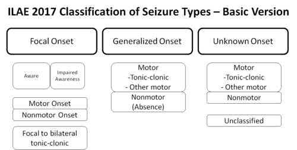

# EPILEPSIA

Para entender epilepsia, a primeira coisa que você precisa desconstruir é a ideia de que "convulsão" e "epilepsia" são sinônimos. Na prova de residência, essa confusão custa pontos preciosos. Uma convulsão é um evento isolado, um sintoma. A epilepsia é a doença, a predisposição persistente do cérebro em gerar essas crises.

Imagine o cérebro como uma rede elétrica complexa. Em condições normais, existe um equilíbrio fino entre a excitação (mediada principalmente pelo glutamato) e a inibição (mediada pelo GABA). Na epilepsia, esse "disjuntor" falha. Ou temos excesso de carga (glutamato) ou falta de isolamento (GABA).

## Definição e Critérios Diagnósticos

A definição atual da ILAE (International League Against Epilepsy), adotada pela Academia Brasileira de Neurologia, é o que cai na sua prova. Não use definições antigas. Consideramos que um paciente tem epilepsia quando ele preenche um dos três critérios abaixo:

- Pelo menos duas crises não provocadas (ou reflexas) ocorrendo com intervalo superior a 24 horas entre elas.

- Uma crise não provocada (ou reflexa) e uma probabilidade de novas crises semelhante ao risco de recorrência geral (pelo menos 60%) após duas crises não provocadas, nos próximos 10 anos.

- Diagnóstico de uma síndrome epiléptica específica (como a Síndrome de West ou a Epilepsia Mioclônica Juvenil).

**Por que o intervalo de 24 horas?**
Se o paciente tem três crises em uma tarde, isso é considerado um "agrupamento de crises" (cluster), contando como um único evento para fins de diagnóstico de epilepsia. O risco de recorrência após uma única crise aumenta drasticamente se houver uma lesão estrutural na Ressonância Magnética (RM) ou uma atividade epileptiforme no Eletroencefalograma (EEG). É por isso que, em muitos casos, iniciamos o tratamento logo após a primeira crise.

**Dica de Prova:** As bancas adoram colocar um paciente com uma crise única e um EEG com ponta-onda clara. A conduta? Diagnosticar epilepsia e tratar, pois o risco de recorrência é alto (>60%).

## Fisiopatologia: O Equilíbrio Quebrado

A crise epiléptica ocorre devido a uma descarga elétrica hipersincrônica e excessiva de um grupo de neurônios.

No nível celular, isso envolve a abertura de canais de sódio (Na+) e cálcio (Ca++), que promovem a despolarização (excitação), e a entrada de cloro (Cl-) ou saída de potássio (K+), que promovem a hiperpolarização (inibição).

**Mecanismo de Liberação de Neurotransmissores:**
Lembre-se da fisiologia básica que cai em questões de pré-clínico: a despolarização do terminal pré-sináptico abre canais de Ca++ voltagem-dependentes. A entrada de cálcio é o gatilho para que as vesículas sinápticas se fundam à membrana e liberem neurotransmissores na fenda. Se esse processo for exacerbado, temos a crise.

*Figura 1 - Classificação operacional dos tipos de crises epilépticas pela ILAE (2017): crises focais, generalizadas e de início desconhecido. Fonte: Barbora Cvičková, CC BY-SA 4.0 | Wikimedia Commons*

## Classificação das Crises e Síndromes

A classificação mudou para ser mais descritiva. Esqueça termos como "pequeno mal" ou "grande mal".

### 1. Crises de Início Focal

Começam em uma rede neuronal limitada a um hemisfério.

- **Focal Percebida (antiga parcial simples):** O paciente mantém a consciência. Pode ter sintomas motores, sensoriais (aura) ou autonômicos.

- **Focal com Percepção Comprometida (antiga parcial complexa):** O paciente perde o contato com o meio. É aqui que aparecem os **automatismos** (mastigar, mexer na roupa, estalar lábios).

- **Focal para Bilateral Tônico-Clônica:** Começa em um ponto e "espalha" para o cérebro todo.

### 2. Crises de Início Generalizado

Envolvem os dois hemisférios desde o início.

- **Ausência Típica:** Interrupção súbita da atividade, olhar fixo, sem queda da própria altura, duração de segundos. O EEG mostra o clássico padrão de **ponta-onda de 3 Hz**. É desencadeada por hiperventilação.

- **Tônico-Clônica Generalizada (CTCG):** A fase tônica (rigidez, grito epiléptico por contração da musculatura respiratória) seguida pela fase clônica (abalos rítmicos). Frequentemente acompanhada de sialorreia e liberação esfincteriana.

- **Mioclônica:** Abalos súbitos, tipo "choques", sem perda de consciência necessariamente. Comum na Epilepsia Mioclônica Juvenil (EMJ).

- **Atônica:** Perda súbita do tônus muscular ("crise de queda").

### 3. Síndromes Epilépticas Importantes

- **Síndrome de West:** Ocorre em lactentes. Tríade clássica: Espasmos infantis + Atraso no desenvolvimento + Hipsarritmia no EEG. O prognóstico costuma ser reservado.

- **Epilepsia Rolândica (Benigna da Infância):** Crises focais noturnas, envolvendo face e orofaringe, com excelente prognóstico.

- **Epilepsia Mioclônica Juvenil (EMJ):** Início na adolescência, crises mioclônicas ao acordar, muitas vezes desencadeadas por privação de sono ou álcool. Responde muito bem ao Valproato.

*Figura 2 - Registro eletroencefalográfico mostrando complexos espícula-onda generalizados a 3 Hz, padrão clássico de crises de ausência. Fonte: CC BY-SA 2.0 | Wikimedia Commons*

## Diagnóstico Diferencial: A Grande Pegadinha

Nem tudo que treme é convulsão. O Dr. Will sempre reforça: o diagnóstico de epilepsia é eminentemente clínico. O exame físico e a história colhida com testemunhas valem mais que o EEG.

| Diagnóstico Diferencial | Características Sugestivas |
| --- | --- |
| **Síncope Vasovagal** | Pródromos (palidez, sudorese, náusea), recuperação rápida da consciência, sem período pós-ictal longo. |
| **CNEP (Crises Não Epilépticas Psicogênicas)** | Movimentos dessincronizados, balançar de cabeça lateral, olhos fechados (na crise epiléptica costumam estar abertos), duração muito longa (>10 min), sem alteração de lactato. |
| **AIT (Ataque Isquêmico Transitório)** | Sintomas "negativos" (perda de força, perda de fala) em vez de "positivos" (abalos). |
| **Migrânea com Aura** | Progressão lenta dos sintomas visuais (minutos), seguida de cefaleia. |
| **Hipoglicemia** | Sudorese profusa, confusão mental, melhora imediata com glicose. Sempre cheque o HGT! |

**Paresia de Todd:** Após uma crise focal motora, o paciente pode apresentar uma fraqueza focal transitória no membro acometido. Cuidado para não confundir com um AVC agudo em prova. A recuperação ocorre em horas.

## Investigação Complementar

Todo adulto com uma primeira crise convulsiva de início recente precisa de imagem.

- **Neuroimagem:** A RM de crânio com protocolo para epilepsia (cortes finos de hipocampo) é superior à TC. Buscamos a **Esclerose Mesial Temporal (Esclerose Hipocampal)**, que é a causa mais comum de epilepsia focal refratária em adultos. A TC fica reservada para a emergência, para excluir sangramentos (como o Hematoma Epidural com seu intervalo lúcido) ou tumores volumosos.

- **EEG:** Fundamental para classificar a síndrome. Mas atenção: um EEG normal NÃO exclui epilepsia. Se a suspeita for alta, podemos lançar mão de métodos de ativação: privação de sono, fotoestimulação e hiperventilação.

- **Líquor:** Indicado se houver suspeita de infecção (meningite/encefalite) ou se for a primeira crise em paciente febril. Na **Encefalite Herpética (HSV)**, a RM mostra lesão em lobo temporal e o líquor apresenta pleocitose linfocitária com PCR positivo para o vírus.

## Tratamento Farmacológico

Aqui é onde as bancas mais cobram doses e efeitos colaterais. O objetivo é o controle total das crises com o mínimo de efeitos adversos (monoterapia sempre que possível).

### Escolha da Droga por Tipo de Crise

- **Crises Focais:** Carbamazepina (primeira linha), Lamotrigina, Levetiracetam, Fenitoína.

- **Crises Generalizadas (CTCG, Mioclônicas, Ausência):** Ácido Valproico (padrão-ouro), Lamotrigina, Topiramato.

- **Crise de Ausência Pura:** Etossuximida ou Ácido Valproico.

**Tabela de Fármacos e "Pérolas" de Prova:**

| Medicamento | Principais Indicações | Efeitos Adversos / Observações |
| --- | --- | --- |
| **Ácido Valproico** | Amplo espectro (todas) | **Altamente teratogênico** (defeitos de fechamento do tubo neural). Ganho de peso, queda de cabelo, hepatotoxicidade. |
| **Carbamazepina** | Focais | Pode piorar crises mioclônicas e de ausência. Indutor enzimático (interage com anticoncepcionais). Risco de Stevens-Johnson. |
| **Fenitoína** | Focais / Estado de Mal | Hiperplasia gengival, hirsutismo, ataxia. Cinética não linear. |
| **Lamotrigina** | Focais e Generalizadas | Seguro na gestação. Risco de Rash/Stevens-Johnson (deve-se titular a dose muito lentamente). |
| **Fenobarbital** | Neonatos / Crises refratárias | Sedação importante, depressão cognitiva. Primeira escolha em convulsão neonatal por EHI. |
| **Etossuximida** | Ausência | Atua em canais de cálcio tipo T. |

**Por que não usar Carbamazepina na Ausência?**
Porque ela pode exacerbar as crises. Em provas, se o paciente tem crises de ausência e a alternativa sugere Carbamazepina ou Gabapentina, elas estão incorretas.

### Situações Especiais

- **Gestação:** O Ácido Valproico deve ser evitado se houver alternativa. A Lamotrigina e o Levetiracetam são considerados mais seguros. **Importante:** Nunca suspenda abruptamente um anticonvulsivante de uma gestante que já está controlada, pois o estado de mal epiléptico é mais perigoso para o feto do que a droga. Inicie sempre Ácido Fólico (5mg/dia) para reduzir riscos de malformação.

- **Idosos:** A causa mais comum de epilepsia no idoso é o AVC (sequela isquêmica ou hemorrágica). Cuidado com interações medicamentosas.

- **Neurotoxicidade por Cefepima:** Em pacientes com insuficiência renal, o uso de cefepima pode causar estado de mal não convulsivo, mioclonias e confusão mental. A conduta é suspender a droga e ajustar a função renal.

## Manejo Emergencial: O Estado de Mal Epiléptico (EME)

Definição operacional: Crise com duração > 5 minutos OU crises repetidas sem recuperação da consciência entre elas. É uma emergência médica.

**Protocolo de Tratamento (MedEvo):**

- **Estabilização Inicial (0-5 min):** ABC, O2, acesso venoso, HGT (se hipoglicemia: Glicose 50% + Tiamina para evitar Wernicke).

- **Primeira Linha (Benzodiazepínicos):**

- **Diazepam:** 10 mg EV (pode repetir uma vez). Se não houver acesso, pode ser via retal.

- **Midazolam:** 10 mg IM (excelente se não houver acesso venoso imediato).

- **Segunda Linha (Anticonvulsivantes IV):** Deve ser iniciada mesmo se a crise parar com o BZD para evitar recorrência.

- **Fenitoína:** Dose de ataque 15-20 mg/kg EV. Velocidade máxima de 50 mg/min (risco de arritmia e hipotensão - monitorização obrigatória).

- **Levetiracetam ou Valproato IV:** Alternativas modernas com menos efeitos cardiovasculares.

- **Terceira Linha (EME Refratário):** Se a crise persistir após 30-40 minutos.

- Transferência para UTI, IOT e anestésicos (Midazolam em infusão contínua, Propofol ou Pentobarbital). Necessário monitorização com EEG contínuo.

## Tratamento Não Farmacológico e Cirurgia

Cerca de 30% dos pacientes são refratários (não controlam com duas ou mais drogas bem toleradas e bem indicadas). Para esses:

- **Cirurgia de Epilepsia:** Indicada principalmente na Esclerose Mesial Temporal. A lobectomia temporal anterior tem altas taxas de cura.

- **Dieta Cetogênica:** Muito utilizada em crianças com síndromes graves (como Lennox-Gastaut). Dieta rica em gordura e pobre em carboidratos.

- **Estimulador do Nervo Vago (VNS):** Dispositivo implantável para casos não cirúrgicos.

## Complicações e SUDEP

A complicação mais temida é a **SUDEP (Sudden Unexpected Death in Epilepsy)**. É a morte súbita, sem causa anatômica ou toxicológica explicável, em um paciente com epilepsia. O maior fator de risco é a presença de crises tônico-clônicas generalizadas não controladas, especialmente durante o sono. Orientar o controle rigoroso das crises é a melhor prevenção.

## Pontos-Chave para Prova

- **Diagnóstico:** 2 crises não provocadas (>24h) OU 1 crise + alto risco de recorrência (>60% em 10 anos).

- **Crise de Ausência:** EEG com ponta-onda 3 Hz. Tratamento: Valproato ou Etossuximida. Gatilho: Hiperventilação.

- **Síndrome de West:** Espasmos + Hipsarritmia + Atraso no desenvolvimento. Tratamento: ACTH ou Vigabatrina.

- **Estado de Mal Epiléptico:** Iniciar BZD aos 5 minutos. Se falhar, Fenitoína (ataque 20 mg/kg).

- **Gestante:** Ácido Valproico é o mais teratogênico (evitar). Lamotrigina é uma boa escolha. Sempre suplementar Ácido Fólico 5mg.

- **Idoso com DRC + Cefepima:** Pensar em neurotoxicidade se houver mioclonias ou confusão.

- **Causa mais comum no idoso:** AVC. No adulto jovem: Trauma ou uso/abstinência de substâncias.

- **Paresia de Todd:** Déficit motor pós-ictal transitório. Não é AVC!

- **Automatismos + Perda de contato:** Crise focal com percepção comprometida (lobo temporal).

- **Valproato:** Não induz enzimas hepáticas (seguro com anticoncepcionais), mas é hepatotóxico e teratogênico.

- **Carbamazepina:** Droga de escolha para crises focais, mas piora mioclonias.

- **Fenitoína EV:** Velocidade máxima 50 mg/min para evitar colapso cardiovascular.

- **Líquor na Encefalite Herpética:** Pleocitose linfocitária, hemácias (frequente) e PCR para HSV positivo.

- **CNEP (Psicogênica):** Olhos fechados, movimentos de lado a lado, resistência à abertura ocular, vídeo-EEG é o padrão-ouro para diferenciar. 🧠

 Cópia offline para consulta pessoal.
 Fonte original:
 [https://www.medevo.com.br/material-apoio/ler/32cea1af-5184-4d5b-b034-9e26b4e9c506](https://www.medevo.com.br/material-apoio/ler/32cea1af-5184-4d5b-b034-9e26b4e9c506)
