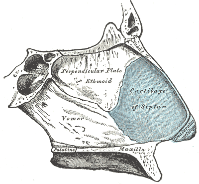
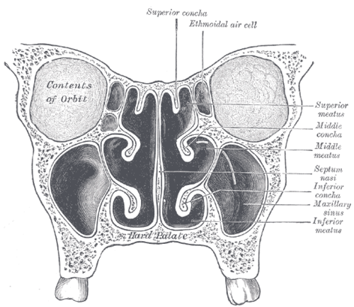

# EPISTAXE

Para entender epistaxe de verdade, você precisa parar de pensar no nariz como apenas um apêndice respiratório e começar a enxergá-lo como um dos territórios mais vascularizados do corpo humano. Por que o nariz sangra tanto? A resposta está na anatomia funcional. A cavidade nasal tem a função de aquecer e umidificar o ar inspirado. Para isso, ela precisa de um suprimento sanguíneo riquíssimo e muito superficial. É essa característica que nos permite respirar um ar a 37 graus em pleno inverno, mas é também o que torna a epistaxe a urgência otorrinolaringológica mais comum nos prontos-socorros.

Muitos alunos chegam na prova achando que epistaxe é "coisa simples", mas as bancas sabem onde o médico generalista falha: na estabilização hemodinâmica e na diferenciação entre o sangramento anterior e o posterior. Vamos construir esse raciocínio juntos.

*Figura 1 - Anatomia do septo nasal (ossos e cartilagens). A porção anterior é o local do Plexo de Kiesselbach (Área de Little), responsável por >90% das epistaxes. Fonte: Henry Vandyke Carter, Domínio Público | Wikimedia Commons*

## Anatomia Vascular: O Mapa do Sangramento

Se você não souber de onde vem o sangue, você não saberá onde colocar o tampão ou onde aplicar o nitrato de prata. O suprimento sanguíneo nasal deriva tanto da artéria carótida interna quanto da carótida externa. Isso explica por que alguns sangramentos são tão volumosos.

### O Plexo de Kiesselbach (Área de Little)

Este é o "queridinho" das provas. Localizado na porção anterior do septo nasal, é o local de anastomose de cinco artérias:

- Artéria etmoidal anterior (ramo da carótida interna).

- Artéria etmoidal posterior (ramo da carótida interna).

- Artéria esfenopalatina (ramo da carótida externa).

- Artéria palatina maior (ramo da carótida externa).

- Artéria labial superior (ramo da carótida externa).

Por que você precisa decorar isso? Porque mais de 90% das epistaxes ocorrem aqui. É uma região de mucosa fina, sujeita a trauma digital e ressecamento ambiental. Se a questão de prova descreve uma criança com sangramento autolimitado, a aposta segura é o Plexo de Kiesselbach.

### O Plexo de Woodruff

Localizado na parede lateral da cavidade nasal, posterior à concha inferior, este plexo é formado principalmente por ramos da artéria esfenopalatina. Aqui mora o perigo. Os sangramentos posteriores são menos comuns (cerca de 5 a 10%), mas são muito mais graves. Eles ocorrem geralmente em pacientes mais velhos, com comorbidades como hipertensão e aterosclerose. O vaso aqui é de maior calibre, o que torna o controle por compressão manual praticamente impossível.

*Figura 2 - Corte coronal das cavidades nasais: conchas, meatos, septo nasal e seios paranasais. A parede lateral abriga o Plexo de Woodruff (epistaxe posterior). Fonte: Henry Vandyke Carter, Domínio Público | Wikimedia Commons*

## Classificação: O Divisor de Águas na Conduta

A classificação da epistaxe não serve apenas para dar nome ao problema, ela dita o seu próximo passo no plantão. Aqui no MedEvo, sempre batemos na tecla: a localização define o prognóstico.

| Característica | Epistaxe Anterior | Epistaxe Posterior |
| --- | --- | --- |
| **Frequência** | > 90% dos casos | 5 a 10% dos casos |
| **Localização** | Plexo de Kiesselbach (Septo anterior) | Plexo de Woodruff (Parede lateral/posterior) |
| **População Comum** | Crianças e adultos jovens | Idosos |
| **Gravidade** | Geralmente leve a moderada | Frequentemente severa |
| **Controle** | Compressão simples ou cauterização | Necessita de tamponamento posterior ou cirurgia |
| **Visualização** | Fácil à rinoscopia anterior | Difícil, sangue flui pela orofaringe |

Cuidado com a pegadinha: o fato de o sangue estar saindo pela narina não garante que a epistaxe seja anterior. Em um sangramento posterior volumoso, o sangue preenche a fossa nasal e transborda para a frente. O que define a suspeita de sangramento posterior é a visualização de sangue vivo escorrendo ativamente pela parede posterior da orofaringe, mesmo com o paciente sentado e inclinado para frente.

## Abordagem Inicial: O Erro que Reprova

Imagine o cenário: paciente de 68 anos, hipertenso, chega ao PS com sangramento nasal intenso, pálido e sudoreico. O que você faz primeiro? Se você respondeu "olhar o nariz com o espéculo", você acabou de perder a questão (e talvez o paciente).

A prioridade absoluta na epistaxe severa é a estabilização hemodinâmica. Isso é um mantra. Antes de qualquer manobra local, seguimos o ABCDE do trauma adaptado:

- **A (Vias Aéreas):** Garanta que o sangue não está sendo aspirado.

- **B (Respiração):** Avalie a saturação e a necessidade de oxigênio.

- **C (Circulação):** Dois acessos venosos calibrosos, coleta de exames (hemograma, tipagem sanguínea, coagulograma) e reposição volêmica com cristaloides se necessário.

A banca vai tentar te induzir ao erro colocando "tamponamento imediato" como primeira opção. Lembre-se: não se trata o nariz de um paciente em choque hipovolêmico antes de tratar o choque. Primeiro o acesso, depois o tampão. Como diz o Dr. Will, "paciente estável é paciente que permite um exame bem feito".

## Etiologia: Por que o Nariz Sangra?

As causas podem ser divididas em locais e sistêmicas. Entender isso ajuda a evitar exames desnecessários.

### Causas Locais

O trauma é o grande vilão. Pode ser o trauma digital (o famoso "dedo no nariz"), muito comum em crianças, ou traumas faciais em acidentes. Outro fator crucial é o ressecamento da mucosa. O ar seco ou o uso crônico de ar-condicionado retira a camada protetora de muco, expondo os vasos do plexo de Kiesselbach.

Não podemos esquecer dos irritantes químicos (cocaína, sprays nasais de corticoides usados de forma errada) e dos corpos estranhos, que devem ser suspeitados em crianças com rinorreia unilateral fétida e sanguinolenta.

### Causas Sistêmicas

Aqui entra a maior polêmica das provas: a Hipertensão Arterial (HAS). Preste muita atenção: a HAS não é a causa direta da epistaxe na maioria das vezes, mas ela dificulta o controle do sangramento e está associada a vasos mais fragilizados por aterosclerose. Se a questão perguntar a causa, procure por trauma ou ressecamento. Se perguntar um fator complicador, a HAS é uma excelente resposta.

Outras causas sistêmicas importantes:

- **Coagulopatias:** Doença de Von Willebrand (a mais comum), Hemofilia.

- **Medicamentos:** AAS, clopidogrel, varfarina e os novos anticoagulantes orais (DOACs).

- **Insuficiência Hepática e Renal:** Por alteração de fatores de coagulação e função plaquetária.

- **Telangiectasia Hemorrágica Hereditária (Doença de Osler-Weber-Rendu):** Suspeite se houver história familiar e telangiectasias em lábios e língua.

## Diagnóstico e Avaliação Clínica

O diagnóstico da epistaxe é clínico, mas a investigação da causa exige técnica.

### História Clínica

Pesquise sobre:

- Duração e lateralidade (unilateral ou bilateral?).

- Episódios prévios.

- Uso de medicamentos (anticoagulantes são a chave aqui).

- Sintomas associados (hematêmese ou hemoptise podem ser confundidas com epistaxe posterior).

### Exame Físico

Para um exame adequado, você precisa de luz (fotóforo ou lanterna forte), espéculo nasal, aspirador e, se possível, um vasoconstritor local (como a oximetazolina).

O passo a passo do exame:

- Peça ao paciente para assoar o nariz para remover coágulos. O coágulo impede que o vasoconstritor chegue à mucosa e mascara o ponto de sangramento.

- Aplique um algodão embebido em vasoconstritor e anestésico local (lidocaína). Deixe agir por 5 a 10 minutos. Isso reduz o sangramento e permite que você enxergue o vaso culpado.

- Realize a rinoscopia anterior. Procure ativamente pelo plexo de Kiesselbach.

## Manejo Passo a Passo: Do Simples ao Complexo

O tratamento da epistaxe segue uma escada terapêutica. Começamos pelo menos invasivo.

### 1. Compressão Digital

É a primeira medida para epistaxe anterior. O paciente deve comprimir a porção cartilaginosa do nariz (as asas nasais) contra o septo por pelo menos 10 a 15 minutos ininterruptos. O erro comum é o paciente apertar o osso nasal (onde não há vasos superficiais) ou soltar a cada minuto para ver se parou. A orientação deve ser clara: cabeça levemente inclinada para frente (para evitar deglutição de sangue) e pressão constante.

### 2. Cauterização

Se a compressão falhou e você visualiza o ponto de sangramento, a cauterização é o próximo passo.

- **Química:** Nitrato de Prata. É a mais comum. Você deve aplicar ao redor do ponto de sangramento e depois sobre ele.

- **Cuidado de Ouro:** Nunca cauterize os dois lados do septo nasal na mesma sessão. Isso interrompe o suprimento sanguíneo da cartilagem septal e pode levar à necrose e perfuração septal. Isso cai muito em prova!

### 3. Tamponamento Anterior

Indicado quando a cauterização falha ou o ponto de sangramento não é identificado. Existem várias opções:

- **Dedo de luva ou gaze vaselinada:** O método clássico. Deve ser colocado em "sanfona", preenchendo toda a cavidade de baixo para cima.

- **Esponjas expansíveis (Merocel):** Mais fáceis de inserir. Ao entrar em contato com o sangue, elas expandem e comprimem os vasos.

O tampão anterior deve permanecer por 48 a 72 horas. O uso de antibióticos profiláticos (como Amoxicilina-Clavulanato) é controverso na literatura, mas muitas diretrizes e bancas ainda recomendam para evitar a Síndrome do Choque Tóxico, embora a evidência seja fraca.

### 4. Tamponamento Posterior

Se o sangue continua escorrendo pela orofaringe após um tamponamento anterior bem feito, você está diante de uma epistaxe posterior.

- **Sonda de Foley:** É a técnica de emergência mais utilizada. Insere-se a sonda (calibre 12 a 14 French) até a orofaringe, insufla-se o balonete com 5 a 10 ml de água destilada e traciona-se a sonda até que ela se acople à coana posterior.

- **Importante:** Sempre preencha a parte anterior da narina com gaze após fixar a sonda de Foley, para garantir a compressão completa. E cuidado para não causar necrose da asa do nariz por tração excessiva.

Todo paciente com tamponamento posterior deve ser internado. Por quê? Pelo risco de reflexo nasopulmonar (bradicardia e hipoventilação) e pela necessidade de monitorização rigorosa.

### 5. Tratamento Cirúrgico e Embolização

Se o tamponamento falhar, o paciente vai para o centro cirúrgico.

- **Ligadura da Artéria Esfenopalatina:** É o padrão-ouro atual, feita por via endoscópica.

- **Embolização Arterial:** Realizada pela radiologia intervencionista. É uma excelente opção, mas com risco de complicações neurológicas (AVC) se houver refluxo de material para a carótida interna.

| Método | Indicação Principal | Principal Complicação |
| --- | --- | --- |
| **Cauterização Química** | Sangramento anterior visível | Perfuração septal (se bilateral) |
| **Tamponamento Anterior** | Sangramento anterior difuso ou falha de cauterização | Sinusite, Síndrome do Choque Tóxico |
| **Tamponamento Posterior** | Sangramento posterior (Plexo de Woodruff) | Hipóxia, arritmias, necrose de asa nasal |
| **Ligadura Cirúrgica** | Falha do tratamento clínico | Riscos inerentes à anestesia e cirurgia |

## Diagnóstico Diferencial: Nem tudo que sangra é Epistaxe

É fundamental diferenciar a epistaxe primária de sangramentos que se manifestam pelo nariz, mas têm outra origem.

- **Tumores Nasais:** Suspeite em idosos com epistaxe unilateral recorrente associada a obstrução nasal. O Nasoangiofibroma Juvenil é um tumor benigno, mas extremamente vascularizado, que ocorre em adolescentes do sexo masculino. Nunca biopsie uma massa nasal pulsátil no consultório!

- **Varizes de Esôfago / Hemorragia Digestiva Alta:** O paciente pode vomitar sangue e este sair pelo nariz. A história de hematêmese e doença hepática ajuda na diferenciação.

- **Hemoptise:** Sangue proveniente do trato respiratório inferior, geralmente com tosse e aspecto espumoso.

## Situações Especiais e Manejo Farmacológico

### O Paciente Anticoagulado

Este é o terror do plantonista. Se o paciente usa Varfarina e o INR está na faixa terapêutica (2-3), tratamos a epistaxe localmente sem reverter a anticoagulação. Se o INR estiver muito acima da meta ou houver sangramento com instabilidade, a reversão com Vitamina K e Complexo Protrombínico (ou Plasma Fresco Congelado) é mandatória.

Para os novos anticoagulantes (Rivaroxabana, Apixabana), o manejo é mais difícil pela falta de antídotos amplamente disponíveis, focando-se no controle local agressivo e medidas de suporte.

### Hipertensão no Momento do Sangramento

É comum o paciente chegar com PA 180/100 mmHg. Não se desespere para baixar essa pressão com medicações intravenosas potentes de imediato. A dor e a ansiedade do sangramento elevam a PA. Primeiro, controle o sangramento e a dor. Na maioria das vezes, a pressão cairá sozinha. Se após o controle do sangramento a PA permanecer em níveis de crise hipertensiva, aí sim tratamos conforme as diretrizes de HAS.

## Complicações e Prognóstico

As complicações podem ser decorrentes do sangramento ou do tratamento:

- **Choque Hipovolêmico:** A complicação aguda mais grave.

- **Anemia:** Em sangramentos crônicos ou recorrentes.

- **Necrose de Septo ou Asa Nasal:** Por pressão excessiva do tampão.

- **Aspiração de Sangue:** Pode levar a pneumonite química.

O prognóstico da epistaxe anterior é excelente. Já a posterior exige acompanhamento rigoroso, pois a taxa de recorrência após a retirada do tampão é considerável, muitas vezes exigindo intervenção cirúrgica definitiva.

## Estratificação de Risco e Metas Terapêuticas

Não existe um score de risco universal para epistaxe, mas podemos estratificar pela gravidade clínica:

- **Baixo Risco:** Sangramento anterior, autolimitado, sem uso de anticoagulantes, hemodinamicamente estável. Conduta: Medidas locais e alta com orientações.

- **Médio Risco:** Sangramento recorrente, uso de antiagregantes, necessidade de tamponamento anterior. Conduta: Observação ou alta após 24h de estabilidade com tampão.

- **Alto Risco:** Sangramento posterior, instabilidade hemodinâmica, uso de anticoagulantes, comorbidades graves. Conduta: Internação, estabilização e provável intervenção cirúrgica.

A meta terapêutica é a cessação completa do sangramento e a manutenção da estabilidade hemodinâmica (PAM > 65 mmHg, débito urinário > 0,5 ml/kg/h).

## Pontos-Chave para Prova

Aqui está o que você precisa levar para a hora do exame, sem rodeios:

- **Prioridade Zero:** Estabilização hemodinâmica (ABCDE) antes de olhar o nariz em casos graves.

- **Plexo de Kiesselbach:** Local de 90% das epistaxes (anterior). Anastomose de 5 artérias.

- **Plexo de Woodruff:** Local das epistaxes posteriores, mais graves e comuns em idosos.

- **Primeira Manobra:** Compressão digital das asas nasais por 10 a 15 minutos com a cabeça inclinada para frente.

- **Cauterização com Nitrato de Prata:** Nunca fazer bilateralmente no mesmo tempo cirúrgico (risco de perfuração septal).

- **Tamponamento Posterior:** Sempre requer internação hospitalar e monitorização.

- **Sonda de Foley:** Técnica de escolha para tamponamento posterior na emergência.

- **Antibioticoterapia no Tampão:** Recomendada por muitas bancas para prevenir Síndrome do Choque Tóxico (Staphylococcus aureus).

- **Nasoangiofibroma Juvenil:** Suspeitar em adolescentes homens com epistaxe recorrente e obstrução nasal.

- **Hipertensão:** É fator complicador e não necessariamente a causa primária. Trate a dor e o sangramento antes de usar anti-hipertensivos potentes.

- **Doença de Osler-Weber-Rendu:** Tríade de epistaxe recorrente, telangiectasias e história familiar (autossômica dominante).

- **Falha do Tampão:** O próximo passo é a ligadura cirúrgica da artéria esfenopalatina (endoscópica).

- **O que NÃO fazer:** Não deixar o paciente deitado de costas (risco de aspiração); não ignorar a parede posterior da faringe no exame físico.

- **Lembre-se:** O coágulo é inimigo do médico. Peça para o paciente assoar antes de tentar cauterizar ou tamponar. 🩸

Este material foi estruturado para que você entenda a lógica por trás de cada conduta. Na prova, quando surgir aquela questão de um idoso chocado com sangue no nariz, você vai lembrar do Dr. Will e do MedEvo: primeiro o acesso venoso, depois a sonda de Foley. Sucesso nos estudos!

 Cópia offline para consulta pessoal.
 Fonte original:
 [https://www.medevo.com.br/material-apoio/ler/eb41cf6b-e653-4226-80b3-acd8c2e1b0a1](https://www.medevo.com.br/material-apoio/ler/eb41cf6b-e653-4226-80b3-acd8c2e1b0a1)
