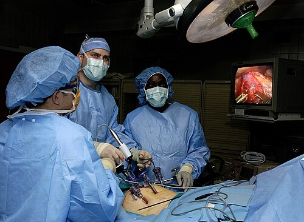
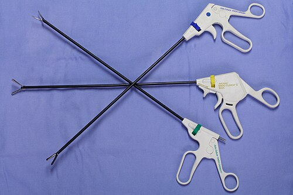

# ERAS (ENHANCED RECOVERY AFTER SURGERY)

Para entender o ERAS, ou o Projeto ACERTO aqui no Brasil, você precisa primeiro esquecer aquele dogma antigo da cirurgia de que "quanto maior o trauma, melhor o cirurgião" ou que "o repouso absoluto e o jejum prolongado protegem a anastomose".

O ERAS não é apenas uma lista de condutas, é uma mudança de paradigma baseada na fisiologia. O objetivo central é um só: reduzir a Resposta Endócrina, Metabólica e Imunológica ao Trauma (REMT). Quando operamos um paciente, o corpo entende aquilo como uma agressão e libera uma cascata de hormônios de estresse, como cortisol, catecolaminas e glucagon. Isso gera resistência insulínica, catabolismo proteico e disfunção orgânica. O protocolo ERAS entra para "blindar" o paciente contra esse estresse excessivo.

Nas provas de residência, esse tema é onipresente porque ele toca em todas as fases da cirurgia: pré, intra e pós-operatório. Vamos dissecar cada pilar, entendendo o porquê de cada conduta, pois é isso que as bancas cobram para diferenciar quem decorou de quem realmente entende de manejo perioperatório.

## Fisiopatologia: O Porquê do Protocolo

Por que paramos de deixar o paciente em jejum de 12 horas? Por que insistimos na deambulação precoce?

A resposta está na resistência insulínica pós-operatória. O estresse cirúrgico faz com que o corpo entre em um estado hiperglicêmico e catabólico. Se o paciente chega para a cirurgia em jejum prolongado, ele já está em um estado de privação que potencializa essa resistência. Ao oferecermos carboidratos (maltodextrina) até 2 horas antes da indução anestésica, mudamos o status metabólico de "jejum/catabolismo" para "alimentado/anabolismo". Isso reduz a perda de massa magra e melhora a função imunológica.

Como o Dr. Will sempre reforça nas discussões de caso do MedEvo, a cirurgia moderna é sobre "manter a homeostase", e não apenas "retirar o órgão doente". Cada intervenção do ERAS visa diminuir a inflamação sistêmica.

## Fase Pré-Operatória: Preparando o Terreno

### Informação e Aconselhamento

Pode parecer "perfumaria", mas a orientação pré-operatória detalhada reduz a ansiedade do paciente. Menos ansiedade significa menor liberação de catecolaminas e, consequentemente, uma recuperação mais suave. O paciente que sabe que vai caminhar no mesmo dia da cirurgia tem resultados melhores do que aquele que é surpreendido pela fisioterapia.

### Abreviar o Jejum Pré-Operatório

Este é o ponto que mais cai em prova. Esqueça o "nada por boca após a meia-noite".
As diretrizes atuais (ACERTO/ERAS) recomendam:

- Sólidos e líquidos não claros (leite, sucos com polpa): 6 a 8 horas de jejum.

- Líquidos claros (água, chá, suco sem resíduos e, preferencialmente, bebidas com carboidratos como a maltodextrina a 12,5%): até 2 horas antes da cirurgia.

**Cuidado com a pegadinha:** O jejum de 2 horas para líquidos claros é seguro porque o esvaziamento gástrico de líquidos é rápido. Isso não aumenta o risco de aspiração broncopulmonar; pelo contrário, ao reduzir a acidez gástrica e o volume residual, pode até ser protetor.

### Carga de Carboidratos

O uso de maltodextrina (400 ml a 12,5% na noite anterior e 200 ml 2 horas antes) é o padrão-ouro. Isso reduz a sede, a fome e, principalmente, a resistência insulínica pós-operatória. Em pacientes diabéticos, o uso deve ser cauteloso e individualizado, mas não é uma contraindicação absoluta em todos os protocolos, embora muitas bancas ainda tratem como tal.

### Preparo Mecânico de Cólon (PMC)

A medicina baseada em evidências derrubou o mito de que o cólon precisa estar "limpo" para ser suturado. O preparo mecânico (uso de laxantes e enemas) desidrata o paciente, causa distúrbios eletrolíticos e predispõe ao íleo adinâmico.
**Regra de ouro para prova:** O preparo mecânico de cólon NÃO deve ser feito de rotina, mesmo em cirurgias colorretais. Ele só é considerado em situações muito específicas (como necessidade de palpação de pequenos pólipos ou em cirurgias orificiais).

### Imunonutrição

Pacientes com risco nutricional (perda de peso > 10% em 6 meses ou > 5% em 1 mês) devem receber suporte nutricional pré-operatório por 5 a 7 dias. O uso de fórmulas imunomoduladoras (contendo arginina, ácidos graxos ômega-3 e nucleotídeos) reduz as taxas de infecção de sítio cirúrgico (ISC) e o tempo de internação.

| Item | Conduta Tradicional | Conduta ERAS/ACERTO |
| --- | --- | --- |
| Jejum Líquidos Claros | 8 horas | 2 horas |
| Preparo de Cólon | Rotineiro | Evitar (Não rotineiro) |
| Carboidratos Pré-op | Não utilizado | Maltodextrina 12,5% |
| Orientação | Genérica | Detalhada e Multimodal |

*Figura 1 - Cirurgia laparoscópica: técnica minimamente invasiva que reduz o trauma cirúrgico, pilar fundamental do protocolo ERAS. Fonte: US Air Force/Samuel Bendet, Domínio Público | Wikimedia Commons*

## Fase Intraoperatória: Otimização e Proteção

### Antibioticoprofilaxia

Deve ser feita na indução anestésica (30 a 60 minutos antes da incisão). Se a cirurgia durar mais que duas meias-vidas do antibiótico ou se houver perda sanguínea > 1500 ml, deve-se fazer o repique. O objetivo é ter níveis teciduais adequados no momento da incisão.

### Anestesia e Analgesia

O ERAS preconiza o uso de bloqueios neuroaxiais (epidural ou raquianestesia) sempre que possível, associados ou não à anestesia geral.
**Por que isso é importante?** O bloqueio neuroaxial reduz a resposta endócrina ao estresse e permite uma analgesia de excelente qualidade, o que diminui a necessidade de opioides. Lembre-se: opioide é o maior inimigo da motilidade intestinal. Menos opioide = menos íleo pós-operatório.

### Manejo de Fluidos (Terapia Alvo-Dirigida)

A hiper-hidratação é deletéria. O excesso de cristaloide causa edema de alças intestinais, o que prejudica a cicatrização das anastomoses e prolonga o íleo.
O objetivo é a euvolemia. Evite o balanço hídrico muito positivo. Em cirurgias de grande porte, utiliza-se a terapia guiada por metas (monitorização do débito cardíaco ou volume sistólico) para decidir se o paciente precisa de volume ou de inotrópicos/vasopressores.

### Prevenção de Hipotermia

O paciente deve ser mantido normotérmico (temperatura central > 36°C). A hipotermia perioperatória aumenta o risco de:

- Infecção de sítio cirúrgico (por vasoconstrição periférica e menor oferta de oxigênio aos tecidos).

- Sangramento (disfunção plaquetária e da cascata de coagulação).

- Eventos cardíacos isquêmicos.

### Acesso Cirúrgico

Sempre que possível, optar pela via minimamente invasiva (laparoscopia ou robótica). Menos trauma na parede abdominal significa menos dor, menos resposta inflamatória e retorno mais rápido às atividades.

*Figura 2 - Instrumentos de cirurgia laparoscópica: pinças, trocárteres e óptica. A cirurgia minimamente invasiva permite deambulação e realimentação precoces. Fonte: ignis, CC BY-SA 3.0 | Wikimedia Commons*

## Fase Pós-Operatória: Aceleração da Recuperação

### Realimentação Precoce

Este é talvez o pilar mais "chocante" para a velha guarda. Em quase todas as cirurgias, inclusive anastomoses intestinais, a dieta oral deve ser iniciada precocemente (nas primeiras 6 a 24 horas).
**Erro clássico de prova:** Achar que precisa esperar o paciente ter ruídos hidroaéreos (RHA) ou eliminar flatos para começar a dieta.
A alimentação precoce estimula o reflexo gastro-cólico, reduz a translocação bacteriana e acelera a resolução do íleo paralítico. Em uma colecistectomia ou hernioplastia, o paciente pode comer assim que estiver desperto e sem náuseas.

### Mobilização Precoce

O paciente deve sair do leito no dia da cirurgia. O repouso prolongado aumenta o risco de TVP/TEP, atelectasias e perda de massa muscular. A meta é que o paciente passe várias horas fora do leito já no primeiro dia de pós-operatório.

### Uso de Sondas e Drenos

"Drenos não substituem uma boa técnica cirúrgica". O ERAS recomenda evitar o uso rotineiro de sondas nasogástricas (SNG) e drenos abdominais.
A SNG de rotina aumenta o risco de complicações pulmonares (atelectasia e pneumonia) e não previne deiscência de anastomose. Se usada, deve ser retirada logo após o término da cirurgia, antes da extubação.

### Analgesia Multimodal

Para evitar os efeitos colaterais dos opioides (náuseas, vômitos, íleo, sedação), utilizamos uma combinação de drogas com diferentes mecanismos de ação:

- Dipirona e Paracetamol (base).

- Anti-inflamatórios não esteroidais (AINEs), se não houver contraindicação renal ou risco de sangramento.

- Gabapentinoides (como a gabapentina no pré-op, que reduz o consumo de opioides).

- Bloqueios de plano de parede abdominal (como o TAP block).

### Profilaxia de Náuseas e Vômitos Pós-Operatórios (NVPO)

A NVPO é uma das principais causas de atraso na alta e insatisfação do paciente. O protocolo recomenda identificar pacientes de risco (Escore de Apfel) e usar profilaxia multimodal (Dexametasona na indução + Ondansetrona ao final da cirurgia).

| Fator de Risco (Apfel) | Pontuação |
| --- | --- |
| Sexo Feminino | 1 |
| Não fumante | 1 |
| História prévia de NVPO ou cinetose | 1 |
| Uso de opioides no pós-operatório | 1 |

**Interpretação:** 0-1 fator (baixo risco), 2 fatores (médio), 3-4 fatores (alto risco). Pacientes com 2 ou mais fatores DEVEM receber profilaxia com duas ou mais drogas de classes diferentes.

## Situações Especiais e Complicações

### O Paciente Idoso

No idoso, o ERAS é ainda mais crítico. A mobilização precoce previne o delirium e a perda de funcionalidade. A hidratação deve ser ainda mais criteriosa para evitar sobrecarga cardíaca.

### Íleo Pós-Operatório

É a paralisia temporária da motilidade intestinal. O ERAS combate o íleo através de:

- Redução de opioides.

- Realimentação precoce.

- Mobilização precoce.

- Uso de procinéticos se necessário.

- Evitar sobrecarga hídrica.

### Febre no Pós-Operatório

Um tema que sempre aparece correlacionado:

- **Primeiras 24-48h:** A causa mais comum é a atelectasia pulmonar (fisioterapia respiratória e deambulação são o tratamento).

- **Após 48h-72h:** Pensar em Infecção do Trato Urinário (ITU) ou pneumonia.

- **Após o 5º dia:** Pensar em Infecção de Sítio Cirúrgico (ISC) ou deiscência de anastomose.

### SDRA e Ventilação Protetora

Em pacientes críticos ou cirurgias de grande porte com complicações, a ventilação protetora é mandatória:

- Volume Corrente (VC) baixo: 6 ml/kg de peso predito.

- Pressão de Platô < 30 cmH2O.

- PEEP otimizada.

- Em casos graves (PaO2/FiO2 < 150), a posição prona deve ser considerada.

## Diagnóstico Diferencial de Complicações Perioperatórias

Muitas vezes, o aluno confunde complicações normais do trauma com patologias. Por exemplo, uma leve leucocitose e febre baixa nas primeiras 24h podem ser apenas a Resposta Metabólica ao Trauma (REMT). No entanto, se o paciente apresenta taquicardia persistente e dor abdominal desproporcional, você deve suspeitar de deiscência de anastomose, mesmo que não haja febre.

**Exemplo Clínico:**
Paciente de 68 anos, submetido a colectomia esquerda por câncer colorretal. No 2º PO, apresenta-se taquicárdico (FC 110 bpm), com abdome distendido e doloroso à palpação, sem eliminação de flatos.
*Conduta ERAS:* Avaliar se houve sobrecarga hídrica (causando edema de alça) ou se há sinais de sepse abdominal. Se o paciente estivesse seguindo o protocolo (sem preparo de cólon, dieta precoce, analgesia sem opioide), o retorno da função intestinal deveria ser mais rápido. A taquicardia é o sinal precoce mais sensível para complicações cirúrgicas.

## Critérios para Alta Hospitalar no Protocolo ERAS

A alta não é baseada em "dias de cirurgia", mas em critérios funcionais:

- Tolerância à dieta oral (sem necessidade de suplementação venosa).

- Analgesia adequada com medicações orais.

- Deambulação independente ou no mesmo nível do pré-operatório.

- Ausência de evidências de complicações.

- Desejo do paciente em ir para casa (o aspecto psicológico conta muito).

## Pontos-Chave para Prova

- **Jejum de Líquidos Claros:** 2 horas é o tempo mínimo seguro para quase todas as diretrizes modernas.

- **Maltodextrina:** Usada a 12,5% para reduzir resistência insulínica.

- **Preparo de Cólon:** Não deve ser feito de rotina. Se a questão disser que é obrigatório para cirurgia de cólon esquerdo, está ERRADA segundo o ERAS/ACERTO.

- **Sonda Nasogástrica:** Não deve ser usada de rotina. Se usada, retirar após a cirurgia.

- **Dieta Pós-Op:** Iniciar precocemente (6-24h), inclusive em cirurgias com anastomose intestinal. Não esperar flatos ou RHA.

- **Analgesia Multimodal:** O objetivo principal é POUPAR OPIOIDES para evitar íleo e náuseas.

- **Hipotermia:** Aumenta infecção, sangramento e isquemia miocárdica. Mantenha o paciente aquecido.

- **Líquidos Intraoperatórios:** Terapia restritiva ou guiada por metas. Evitar balanço hídrico muito positivo.

- **Tricotomia:** Se necessária, deve ser feita com tricotomizador elétrico imediatamente antes da cirurgia, nunca com lâmina na noite anterior (aumenta ISC).

- **Profilaxia de TVP:** Essencial em cirurgias abdominais de grande porte (Heparina + Medidas mecânicas).

- **Escore de Apfel:** Memorize os 4 fatores (Mulher, Não fumante, História de NVPO, Opioide pós-op).

- **Febre precoce (<48h):** A principal causa cobrada em prova é atelectasia.

- **Drenos:** O uso rotineiro é desencorajado; "dreno não previne fístula, ele apenas a diagnostica (e às vezes nem isso)".

- **Mobilização:** Deve ser precoce e ativa. O repouso no leito é considerado uma complicação evitável.

- **Nutrição:** Perda de peso > 10% em 6 meses indica alto risco nutricional e necessidade de suporte pré-operatório.

- **Manejo da Dor:** É centrado no paciente e escalonado, priorizando bloqueios regionais e analgésicos comuns antes de recorrer a opioides fortes. 🏆

 Cópia offline para consulta pessoal.
 Fonte original:
 [https://www.medevo.com.br/material-apoio/ler/57d64775-8f20-4812-bb24-c84a702ad501](https://www.medevo.com.br/material-apoio/ler/57d64775-8f20-4812-bb24-c84a702ad501)
