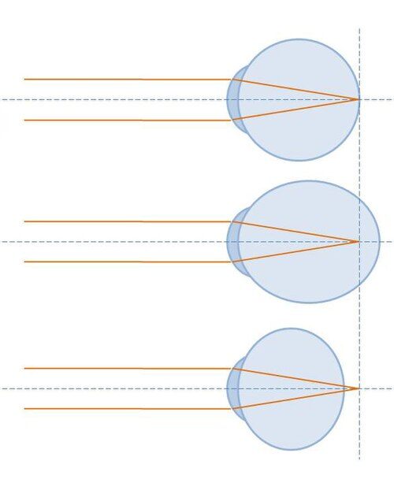
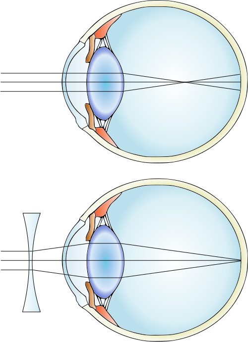

# ERROS DE REFRAÇÃO (AMETROPIAS)

Para entender os erros de refração, você precisa primeiro visualizar o olho como um sistema óptico de precisão. Imagine uma câmera fotográfica onde a lente precisa focar a luz exatamente sobre o sensor. No olho humano, esse "sensor" é a retina, especificamente a mácula. Quando a luz converge exatamente sobre a retina em um olho em repouso, chamamos isso de emetropia. Qualquer desvio desse foco perfeito, seja por problemas no comprimento do olho ou na curvatura das suas lentes naturais, resulta em uma ametropia.

O que as bancas de residência querem saber não é apenas a definição, mas como essas alterações se manifestam clinicamente e como manejamos cada uma. O erro de refração é a causa mais comum de deficiência visual no mundo e a segunda causa de cegueira evitável. Portanto, domine os conceitos de óptica fisiológica para não cair em pegadinhas sobre acomodação e convergência.

## Bases da Óptica Ocular

O sistema refrativo do olho é composto principalmente pela córnea e pelo cristalino. A córnea é o elemento de maior poder dióptrico, contribuindo com cerca de 42 a 44 dioptrias (D). O cristalino contribui com aproximadamente 18 a 20 D, mas ele tem um diferencial crucial: a capacidade de mudar sua forma para ajustar o foco, processo que chamamos de acomodação.

O poder total do olho emetrope gira em torno de 60 D. Se o olho é muito longo ou se o poder dessas lentes é excessivo, a imagem cai antes da retina. Se o olho é curto ou o poder é insuficiente, a imagem se formaria, teoricamente, atrás da retina. É aqui que começamos a diferenciar as patologias.

### O Papel da Acomodação

Este é o ponto onde muitos alunos erram em questões de pediatria e hipermetropia. A acomodação é mediada pelo músculo ciliar. Quando ele se contrai, as zônulas de Zinn relaxam, permitindo que o cristalino se torne mais globoso, aumentando seu poder dióptrico.

Por que isso importa? Porque um jovem hipermetrope consegue "esconder" seu grau usando a acomodação. Por isso, em provas e na prática clínica, o exame de refração em crianças e jovens deve ser feito SEMPRE sob cicloplegia (paralisia do músculo ciliar). Sem o colírio ciclopégico, você estará medindo a refração manifesta, e não a refração total (ciclopégica), o que levará a uma prescrição errada.

*Figura 1 - Erros de refração comparados: emetropia (foco na retina), miopia (foco antes da retina) e hipermetropia (foco atrás da retina). Fonte: Philos2000, CC BY-SA 4.0 | Wikimedia Commons*

## Miopia

A miopia é a ametropia onde o foco da luz ocorre anteriormente à retina. O paciente míope enxerga mal de longe, mas geralmente mantém uma boa visão de perto, dependendo da magnitude do grau.

Existem dois mecanismos principais para a miopia. A miopia axial, que é a mais comum, ocorre quando o comprimento axial do olho é maior que o normal (geralmente acima de 24 mm). Já a miopia de curvatura ocorre quando a córnea ou o cristalino têm uma curvatura excessiva, aumentando o poder refrativo além do necessário para aquele comprimento de olho.

### Classificação e Progressão

A miopia pode ser dividida em simples e patológica (ou degenerativa). A miopia simples costuma surgir na infância ou adolescência, estabilizando-se no início da idade adulta, geralmente não ultrapassando 6,00 D.

A miopia patológica é uma entidade diferente. Aqui, o olho cresce excessivamente ao longo da vida, ultrapassando 6,00 D e apresentando alterações degenerativas no segmento posterior. Como o Dr. Will sempre enfatiza em suas discussões de retina, o olho do alto míope é um olho "esticado", o que torna a retina e a coroide mais finas e vulneráveis.

### Complicações da Alta Miopia

Este é um tema quente em provas. O aluno precisa associar a alta miopia (acima de 6,00 D ou comprimento axial > 26 mm) a riscos específicos:

- Descolamento de retina: devido à tração vítreo-retiniana e fragilidade periférica (degeneração lattice).

- Glaucoma de ângulo aberto: a anatomia do disco óptico no míope dificulta o diagnóstico precoce.

- Catarata precoce: especialmente a subcapsular posterior e a nuclear.

- Estafiloma posterior: uma protrusão da esclera posterior devido ao seu enfraquecimento.

- Maculopatia miópica: incluindo a mancha de Fuchs (neovascularização sub-retiniana).

### Tratamento da Miopia

A correção é feita com lentes divergentes (negativas), que "empurram" o foco para trás, posicionando-o sobre a retina.

Atualmente, a diretriz do Conselho Brasileiro de Oftalmologia (CBO) destaca estratégias para o controle da progressão da miopia em crianças, visto que vivemos uma epidemia global do tema. O uso de colírio de atropina em baixas concentrações (0,01% a 0,05%) e o estímulo a atividades ao ar livre (exposição à luz solar) são medidas com evidência científica para retardar o crescimento axial do olho.

*Figura 2 - Miopia: o olho é muito longo e o foco cai antes da retina. A correção é feita com lente divergente (côncava) que desloca o foco para a retina. Fonte: Gumenyuk I.S., CC BY-SA 4.0 | Wikimedia Commons*

## Hipermetropia

Na hipermetropia, o ponto focal se forma atrás da retina. Isso acontece porque o olho é axialmente curto ou porque o sistema de lentes é muito fraco (hipermetropia de curvatura ou de índice).

Diferente do míope, o hipermetrope jovem pode não apresentar queixas de visão embaçada de longe, pois ele usa a acomodação para trazer o foco para a retina. No entanto, esse esforço constante gera sintomas de astenopia: cefaleia, ardor ocular e fadiga visual, especialmente após leitura ou uso de telas.

### A Armadilha da Acomodação

Aqui reside o maior erro dos estudantes. Você deve diferenciar:

- Hipermetropia Total: o grau real revelado após o uso de colírio ciclopégico.

- Hipermetropia Latente: a parcela do grau que o músculo ciliar consegue compensar sozinho.

- Hipermetropia Manifesta: o grau que o paciente aceita no exame sem colírio.

Se um paciente tem +5,00 D de hipermetropia total, mas consegue compensar +3,00 D com o músculo ciliar, a sua hipermetropia manifesta será de +2,00 D. Se você prescrever apenas o que ele "pede" no consultório sem dilatar, ele continuará tendo sintomas de cansaço visual.

*Figura 2 - Miopia: o olho é muito longo e o foco cai antes da retina. A correção é feita com lente divergente (côncava) que desloca o foco para a retina. Fonte: Gumenyuk I.S., CC BY-SA 4.0 | Wikimedia Commons*

## Hipermetropia e Estrabismo

Em pediatria, a hipermetropia está intimamente ligada ao Estrabismo Acomodativo (Esotropia Acomodativa). Quando a criança acomoda para enxergar, ocorre um reflexo sincinético que inclui a convergência dos olhos. Se a hipermetropia for alta, o excesso de convergência faz com que um dos olhos "vire para dentro".

A conduta aqui é clássica em provas: prescrição do grau total de hipermetropia sob cicloplegia. Muitas vezes, o óculos sozinho corrige o desvio ocular, sem necessidade de cirurgia.

### Tratamento da Hipermetropia

Utilizamos lentes convergentes (positivas), que trazem o foco para frente. Em adultos, a prescrição depende dos sintomas. Em crianças, seguimos tabelas de diretrizes para decidir se corrigimos ou apenas acompanhamos, dependendo da idade e da presença de estrabismo ou risco de ambliopia.

## Astigmatismo

O astigmatismo ocorre quando a córnea (mais comum) ou o cristalino não possuem uma curvatura uniforme. Em vez de serem esféricos como uma bola de basquete, eles têm um formato mais parecido com uma bola de rúgbi. Isso cria dois meridianos principais com poderes refrativos diferentes.

O resultado é que a luz não converge em um único ponto, mas em duas linhas focais. O paciente com astigmatismo queixa-se de visão borrada tanto para longe quanto para perto, muitas vezes confundindo letras parecidas (como E, F e H).

### Classificação do Astigmatismo

As bancas adoram a classificação quanto à orientação dos meridianos:

- Astigmatismo "A Favor da Regra" (With-the-rule): O meridiano mais curvo é o vertical (entre 60 e 120 graus). É o mais comum em jovens.

- Astigmatismo "Contra a Regra" (Against-the-rule): O meridiano mais curvo é o horizontal (entre 0-30 ou 150-180 graus). Mais comum em idosos.

- Astigmatismo Oblíquo: Os meridianos principais estão entre 30-60 ou 120-150 graus.

Além disso, classificamos como:

- Regular: Os dois meridianos principais são perpendiculares entre si. Corrigível com óculos.

- Irregular: Os meridianos não são perpendiculares ou a curvatura muda ao longo do mesmo meridiano. Comum no ceratocone e em cicatrizes de córnea. Óculos geralmente não resolvem bem, sendo necessário o uso de lentes de contato rígidas.

### Tratamento do Astigmatismo

A correção é feita com lentes cilíndricas ou esferocilíndricas. Essas lentes possuem poder em apenas um eixo, corrigindo a desigualdade de curvatura.

## Presbiopia

A presbiopia, popularmente conhecida como "vista cansada", não é um erro de refração no sentido estrito de formato do olho, mas sim uma perda fisiológica da amplitude de acomodação.

Com o envelhecimento, as proteínas do cristalino sofrem desnaturação, tornando-o mais rígido. Além disso, o músculo ciliar perde eficiência. O resultado é a incapacidade de focar objetos próximos.

### Cronologia e Sintomas

Geralmente inicia-se por volta dos 40 a 45 anos. O paciente começa a afastar os objetos para conseguir ler (o famoso "braço curto"). É importante notar que o míope pode ter uma "vantagem" na presbiopia: se ele tirar os óculos de longe, o seu foco natural já é para perto, o que atrasa a necessidade de óculos de leitura. Já o hipermetrope sofre mais cedo, pois ele já gastava sua reserva de acomodação para enxergar de longe.

### Tratamento da Presbiopia

A correção é feita com adição de lentes positivas para perto. Pode ser feita via:

- Óculos de leitura (monofocais apenas para perto).

- Lentes bifocais (com uma linha divisória visível).

- Lentes multifocais (progressivas, sem linha, corrigindo longe, intermediário e perto).

- Monovisão: Uma técnica onde corrigimos um olho para longe e o outro para perto (com lentes de contato ou cirurgia).

## Tabelas Comparativas para Revisão Rápida

Abaixo, organizei as principais diferenças para você não confundir na hora da prova.

### Tabela 1: Comparativo das Ametropias Básicas

| Característica | Miopia | Hipermetropia | Astigmatismo |
| --- | --- | --- | --- |
| **Ponto de Foco** | Antes da retina | Atrás da retina | Duas linhas focais |
| **Comprimento Axial** | Geralmente longo (>24mm) | Geralmente curto (<22mm) | Variável |
| **Principal Queixa** | Visão ruim de longe | Astenopia / Visão ruim perto | Visão borrada (longe e perto) |
| **Lente Corretora** | Divergente (Negativa) | Convergente (Positiva) | Cilíndrica |
| **Complicação Típica** | Descolamento de Retina | Glaucoma de Ângulo Estreito | Baixa acuidade visual severa se irregular |

### Tabela 2: Tipos de Astigmatismo Regular

| Tipo | Descrição | Correção Sugerida |
| --- | --- | --- |
| **Simples** | Uma linha na retina, outra fora | Cilindro puro |
| **Composto** | Ambas as linhas antes ou depois da retina | Esferocilíndrica |
| **Misto** | Uma linha antes e outra depois da retina | Esferocilíndrica (sinais opostos) |

### Tabela 3: Indicações e Contraindicações da Cirurgia Refrativa

| Critério | LASIK / PRK |
| --- | --- |
| **Idade Mínima** | Geralmente 18 a 21 anos |
| **Estabilidade** | Grau estável por pelo menos 1 ano |
| **Contraindicação Absoluta** | Ceratocone, Gestação, Doenças autoimunes ativas |
| **Contraindicação Relativa** | Olho seco severo, Córnea fina (para LASIK), Diabetes descompensado |

## Diagnóstico e Exame Físico

O diagnóstico das ametropias baseia-se na medida da Acuidade Visual (AV) e na Refração.

### Medida da Acuidade Visual

Utilizamos a tabela de Snellen. A notação 20/20 indica que o paciente enxerga a 20 pés o que um olho normal deveria enxergar a 20 pés. Se o paciente tem AV 20/40, ele precisa estar a 20 pés para ver o que um olho normal vê a 40 pés (ou seja, a visão dele é pior).

### O Exame de Refração

O padrão-ouro envolve três etapas:

- **Autorrefração:** Medida objetiva feita por aparelho (dá um ponto de partida).

- **Retinoscopia (Esquiascopia):** O examinador projeta luz na pupila e observa o movimento do reflexo. É fundamental em crianças e pacientes não colaborativos.

- **Refração Subjetiva:** O famoso "qual fica melhor, o 1 ou o 2?". Aqui refinamos o grau baseado na resposta do paciente.

Lembre-se da dica do MedEvo: Em provas de residência, se o caso clínico for uma criança com dificuldade escolar ou estrabismo, a resposta sobre o próximo passo diagnóstico quase sempre envolverá "Refração sob cicloplegia". O uso de tropicamida ou ciclopentolato é essencial para paralisar a acomodação e revelar o grau real.

## Anisometropia e Ambliopia

Este é um conceito vital para pediatria e oftalmologia. Anisometropia é a diferença significativa de grau entre os dois olhos (geralmente > 2,00 D).

Por que isso é perigoso? Porque o cérebro recebe uma imagem nítida de um olho e uma imagem borrada do outro. Para evitar a confusão visual, o cérebro "desliga" a imagem borrada. Se isso ocorrer durante o período crítico de desenvolvimento visual (até os 7-8 anos de idade), o olho negligenciado nunca desenvolverá sua capacidade plena de enxergar, mesmo que use óculos depois. Isso é a Ambliopia (olho preguiçoso).

O tratamento da ambliopia consiste em corrigir o erro de refração e realizar a oclusão (tampão) do "olho bom" para forçar o cérebro a usar o "olho ruim".

## Cirurgia Refrativa

A cirurgia refrativa visa moldar a curvatura da córnea para corrigir o erro de refração. As duas técnicas principais são o LASIK e o PRK, ambas utilizando o Excimer Laser.

### PRK (Ceratectomia Fotorrefrativa)

Nesta técnica, o cirurgião remove o epitélio da córnea e aplica o laser diretamente sobre o estroma superficial.

- Vantagem: Mais segura para córneas mais finas; não há risco de complicações com o "flap".

- Desvantagem: Pós-operatório mais doloroso e recuperação visual mais lenta (o epitélio precisa crescer de novo).

### LASIK (Laser-assisted in situ Keratomileusis)

Aqui, cria-se uma lamela (flap) na córnea, que é levantada para a aplicação do laser no estroma profundo. Depois, o flap é reposicionado.

- Vantagem: Recuperação visual quase imediata e dor mínima.

- Desvantagem: Requer córneas com espessura mínima segura (geralmente sobrando 250-300 micras de leito estromal após o corte e o laser) e risco de deslocamento do flap em caso de trauma.

### Critérios de Segurança

A diretriz brasileira é rigorosa: não se opera paciente com ceratocone ou suspeita de ectasia corneana. O mapeamento da córnea (topografia e tomografia) é obrigatório no pré-operatório para descartar essas condições. Se a questão de prova mencionar uma córnea com curvatura muito elevada (K > 47.00 D) ou afinamento progressivo, a cirurgia refrativa a laser está contraindicada.

## Situações Especiais e Diagnósticos Diferenciais

Nem tudo que embaça a visão é erro de refração. O professor médico experiente sabe que o aluno precisa diferenciar a ametropia de outras causas de baixa visual.

### Diabetes Mellitus

O excesso de glicose no humor aquoso pode levar à entrada de água no cristalino por osmose, alterando seu índice de refração. Isso causa flutuações agudas de grau.

- Erro comum: Prescrever óculos para um paciente com glicemia de 300 mg/dL.

- Conduta correta: Estabilizar a glicemia por pelo menos 4 a 6 semanas antes de realizar o exame de refração.

### Catarata

A catarata nuclear aumenta o índice de refração do cristalino, causando uma "miopização". É aquele idoso que volta a ler sem óculos (a chamada "segunda visão"), mas sua visão de longe piora drasticamente. Isso não é melhora da visão, é progressão da catarata.

### Ceratocone

O ceratocone é uma ectasia progressiva onde a córnea assume formato de cone. Causa um astigmatismo irregular elevado. Suspeite sempre que o paciente tiver mudanças frequentes de grau, astigmatismo alto que não corrige bem para 20/20 com óculos, ou histórico de coçar muito os olhos (atopia).

## Tratamento Farmacológico e Medidas Preventivas

Embora o tratamento principal seja óptico ou cirúrgico, a farmacologia ganha espaço no controle da miopia.

- Atropina 0,01%: Segundo estudos recentes (como o ATOM2 e LAMP), o uso noturno de uma gota de atropina superdiluída reduz a taxa de crescimento do comprimento axial em crianças míopes em progressão.

- Higiene Visual: Recomenda-se a regra "20-20-20" para evitar astenopia (a cada 20 minutos, olhar para algo a 20 pés/6 metros por 20 segundos).

- Tempo ao ar livre: Pelo menos 80 a 120 minutos por dia de exposição à luz externa é um fator protetor robusto contra o surgimento da miopia em crianças.

## Pontos-Chave para Prova

- Ametropia é o foco fora da retina; Emetropia é o foco na retina com o olho em repouso.

- Miopia: Olho longo ou córnea curva demais. Foco ANTES da retina. Corrigida com lentes NEGATIVAS (divergentes).

- Hipermetropia: Olho curto ou sistema fraco. Foco ATRÁS da retina. Corrigida com lentes POSITIVAS (convergentes).

- Astigmatismo: Diferença de curvatura entre meridianos. Gera duas linhas focais. Corrigido com lentes CILÍNDRICAS.

- Presbiopia: Perda da acomodação pelo envelhecimento do cristalino (início aos 40-45 anos).

- Cicloplegia: Obrigatória em crianças e jovens para paralisar o músculo ciliar e revelar o grau real (especialmente na hipermetropia).

- Esotropia Acomodativa: Estrabismo causado por excesso de hipermetropia. O tratamento é o óculos com o grau total.

- Ambliopia: Baixa visual por falta de estímulo no período crítico (até 7-8 anos). Trata-se com correção óptica + oclusão do olho bom.

- Alta Miopia (> 6,00 D): Risco aumentado de descolamento de retina, glaucoma e degeneração macular.

- Cirurgia Refrativa: LASIK (com flap) e PRK (sem flap). Contraindicada em ceratocone, gestação e instabilidade de grau.

- Anisometropia: Diferença de grau entre os olhos (> 2,00 D), principal causa de ambliopia refracional.

- Segunda Visão do Idoso: Melhora aparente da visão de perto por miopização causada por catarata nuclear.

- Regra de Ouro do Diabetes: Nunca prescrever óculos com glicemia descompensada.

- Lentes de Contato Rígidas: Primeira escolha para astigmatismos irregulares (ceratocone) que não melhoram com óculos.

- Atropina 0,01%: Usada para retardar a progressão da miopia em crianças.

- Contraindicação ABSOLUTA para cirurgia refrativa: Ceratocone clínico ou subclínico (ectasia corneana). 💡

Ao revisar este material, lembre-se que a óptica é lógica. Se você entender onde a luz está caindo e o que a lente (ou o músculo ciliar) faz para mover esse foco, você não precisará decorar fórmulas, apenas aplicar o raciocínio clínico que discutimos aqui. Este é o diferencial que o MedEvo busca trazer para sua preparação.

 Cópia offline para consulta pessoal.
 Fonte original:
 [https://www.medevo.com.br/material-apoio/ler/18eafd68-81f4-4e0c-a668-7e5ee5151d87](https://www.medevo.com.br/material-apoio/ler/18eafd68-81f4-4e0c-a668-7e5ee5151d87)
