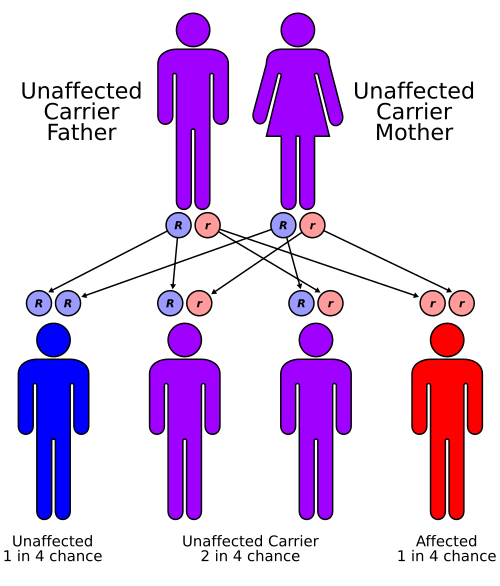

# ERROS INATOS DO METABOLISMO

Para entender os Erros Inatos do Metabolismo (EIM), você precisa parar de tentar decorar nomes de enzimas complexas e começar a entender a lógica do fluxo metabólico. Imagine uma linha de produção em uma fábrica: se uma máquina quebra, o produto final não é fabricado (deficiência) e a matéria-prima se acumula antes da quebra (toxicidade). É exatamente isso que acontece no corpo da criança.

Os EIM são doenças genéticas, geralmente autossômicas recessivas, que resultam do bloqueio de uma via metabólica. O que as bancas de residência cobram não é a bioquímica pura, mas sim a sua capacidade de suspeitar dessas doenças em um cenário clínico que, muitas vezes, mimetiza uma sepse neonatal ou um quadro de abdome agudo.

*Figura 1 - Teste do pezinho (triagem neonatal): coleta de sangue do calcanhar para rastreamento de fenilcetonúria e outros erros inatos do metabolismo. Fonte: US Air Force/Eric T. Sheler, Domínio Público | Wikimedia Commons*

## A Lógica da Suspeita Clínica

Por que é tão difícil diagnosticar um EIM? Porque o recém-nascido tem um repertório limitado de respostas. Ele vai apresentar vômitos, letargia, recusa alimentar e convulsões. Se você olhar para esse quadro, sua primeira hipótese será sepse. E está correto! Mas, se o hemograma está normal, a PCR é baixa e o bebê não melhora com antibióticos de amplo espectro, você DEVE abrir a gaveta dos EIM na sua mente.

Um marcador fundamental aqui é o intervalo livre de sintomas. Na maioria dos EIM de "intoxicação", o bebê nasce bem, pois a placenta limpava as toxinas para ele. Os sintomas aparecem após o início da dieta (leite materno ou fórmula). Se o bebê ficou mal nas primeiras 12 a 24 horas de vida, pense em algo congênito ou infeccioso. Se ficou mal após o segundo ou terceiro dia, o metabolismo é o principal suspeito.

*Figura 2 - Padrão de herança autossômica recessiva: pais portadores (Aa) têm 25% de chance de filho afetado (aa). A maioria dos EIM segue este padrão. Fonte: Cburnett, CC BY-SA 3.0 | Wikimedia Commons*

## Classificação Prática para Provas

Para facilitar sua vida, dividimos os EIM em três grupos fisiopatológicos. Essa divisão ajuda a prever o exame laboratorial alterado:

- **Grupo de Intoxicação:** Acúmulo de substâncias tóxicas. Ex: Fenilcetonúria, Galactosemia, Defeitos do Ciclo da Ureia. O quadro é agudo ou crônico progressivo.

- **Grupo de Deficiência Energética:** Falta de produção de energia. Ex: Glicogenoses, Defeitos da Beta-oxidação de ácidos graxos. Aqui, a hipoglicemia é a rainha.

- **Grupo de Moléculas Complexas:** Problemas em organelas (lisossomos, peroxissomos). Ex: Mucopolissacaridoses, Doença de Gaucher. O quadro é de acúmulo progressivo, com organomegalia e fácies infiltrada.

## O Teste do Pezinho (Triagem Neonatal)

No Brasil, o Programa Nacional de Triagem Neonatal (PNTN) é a base das questões de prova. Você precisa saber o que ele detecta e, principalmente, o que ele NÃO detecta. Como Dr. Will costuma enfatizar em suas discussões de caso, o teste do pezinho é uma triagem, não um diagnóstico definitivo.

Atualmente, o teste básico no SUS (que está em processo de ampliação pela Lei 14.154/2021) foca em:

- Fenilcetonúria (PKU)

- Hipotireoidismo Congênito

- Doenças Falciformes e outras Hemoglobinopatias

- Fibrose Cística

- Hiperplasia Adrenal Congênita

- Deficiência de Biotinidase

Cuidado: A Fibrose Cística é detectada pelo IRT (Tripsina Imunorreativa). Se o IRT estiver aumentado, o teste deve ser repetido em até 30 dias. Se continuar alto, o diagnóstico de confirmação é o Teste do Suor (dosagem de cloretos). Lembre-se: a Fibrose Cística NÃO causa atraso neuropsicomotor primário, ao contrário da Fenilcetonúria e da Deficiência de Biotinidase.

## Fenilcetonúria (PKU)

A PKU é o erro inato do metabolismo de aminoácidos mais comum. O problema está na deficiência da enzima Fenilalanina Hidroxilase, que deveria converter Fenilalanina em Tirosina.

O que cai na prova:

- **Diagnóstico:** Fenilalanina > 4 mg/dL no teste do pezinho. Conduta: Encaminhar imediatamente para serviço de referência e iniciar dieta hipoproteica.

- **Clínica:** Se não tratada, causa deficiência intelectual grave e irreversível, microcefalia, odor de "urina de rato" ou "mofo", e hipopigmentação (cabelos e olhos claros, pois falta tirosina para fazer melanina).

- **Tratamento:** Dieta restrita em fenilalanina. O leite materno pode ser mantido em quantidades controladas, alternado com fórmulas isentas de fenilalanina, sob monitorização rigorosa dos níveis séricos.

## Galactosemia: A Emergência Metabólica

Esta é, talvez, a doença mais "perigosa" para o recém-nascido e a favorita das bancas devido a uma contraindicação absoluta. A deficiência da enzima Galactose-1-fosfato Uridil Transferase (GALT) impede a metabolização da galactose (presente na lactose do leite).

Por que o bebê fica tão mal? O acúmulo de galactose-1-fosfato é tóxico para o fígado, rins e cérebro.

- **Quadro Clínico:** Vômitos, icterícia (bilirrubina direta elevada), hepatomegalia, catarata (pelo acúmulo de galactitol no cristalino) e, o "pulo do gato" das provas: Sepse por Escherichia coli. A galactose inibe a atividade bactericida dos leucócitos.

- **Pérola Clínica:** Se a questão trouxer um RN com insuficiência hepática, catarata e sepse por E. coli após iniciar amamentação, não pense duas vezes: Galactosemia.

- **Conduta:** Interrupção IMEDIATA do aleitamento materno. A Galactosemia é uma das pouquíssimas contraindicações absolutas à amamentação. Substitui-se por fórmulas à base de soja ou sem lactose.

## Defeitos do Ciclo da Ureia e Amônia

O ciclo da ureia serve para transformar a amônia (tóxica) em ureia (excretável). Se o ciclo para, a amônia sobe.

- **Laboratório:** Hiperamonemia grave (> 1.000 µmol/L em alguns casos).

- **Diferencial Crítico:** Ao contrário das acidemias orgânicas, nos defeitos do ciclo da ureia, o pH costuma estar normal ou até com alcalose respiratória (pela taquipneia central que a amônia causa). Não há acidose metabólica primária aqui.

## Glicogenoses: O Foco na Hipoglicemia

A Doença de Von Gierke (Glicogenose Tipo I) é a mais cobrada. O paciente não consegue liberar glicose do fígado para o sangue (deficiência de Glicose-6-fosfatase).

- **Tríade de Prova:** Hipoglicemia grave (jejum curto) + Hepatomegalia importante + Alterações metabólicas (Hiperlipidemia, Hiperuricemia e Acidose Láctica).

- **Aparência:** Criança com "fácies de boneca" (bochechas gordas), baixa estatura e abdome protuberante pelo fígado gigante.

## Doença de Wilson: O Erro do Cobre

Não é uma doença do recém-nascido, mas sim do adolescente ou adulto jovem. É um defeito no transporte biliar de cobre, levando ao seu acúmulo no fígado, cérebro e córnea.

- **Suspeita:** Adolescente com hepatopatia (transaminases altas, esteatose) associada a sintomas neuropsiquiátricos (mudança de comportamento, tremores, distonia).

- **Diagnóstico:** Ceruloplasmina plasmática baixa e Cobre urinário elevado. O anel de Kayser-Fleischer na córnea é patognomônico, mas nem sempre está presente.

## Fibrose Cística (Mucoviscidose)

Embora seja uma doença genética do transporte de cloro (CFTR) e não um erro enzimático clássico, ela é agrupada aqui nos editais. É a doença genética letal mais comum na raça branca.

- **Fisiopatologia:** Secreções exócrinas ficam espessas e desidratadas, obstruindo ductos.

- **Manifestações Neonatais:** Íleo meconial (obstrução intestinal pelo mecônio espesso) é o sinal mais precoce.

- **Manifestações Posteriores:** Tosse crônica, sibilância recorrente, pneumonias de repetição, insuficiência pancreática exócrina (esteatorreia, desnutrição, baixo ganho ponderal) e desidratação hiponatrêmica (perda excessiva de sal no suor).

- **Diagnóstico:** Triagem pelo IRT no teste do pezinho e confirmação pelo Teste do Suor (Cloro > 60 mEq/L em duas amostras).

| Doença | Principal Marcador Laboratorial | Sinal Clínico "Pulo do Gato" |
| --- | --- | --- |
| Fenilcetonúria | Fenilalanina > 4 mg/dL | Odor de mofo / Urina de rato |
| Galactosemia | Substâncias redutoras na urina | Sepse por E. coli / Catarata |
| Von Gierke | Hipoglicemia + Lactato alto | Fácies de boneca + Hepatomegalia |
| Ciclo da Ureia | Amônia muito elevada | pH normal ou Alcalose |
| Leucinose (MSUD) | Aminoácidos de cadeia ramificada | Odor de xarope de bordo (Maple Syrup) |

## Distúrbios de Micronutrientes e Vitaminas

As bancas adoram misturar EIM com deficiências vitamínicas, pois os quadros clínicos se sobrepõem.

### Vitamina D e Raquitismo

O raquitismo carencial é causado pela falta de vitamina D (exposição solar insuficiente ou baixa ingestão).

- **Clínica:** Rosário raquítico, fronte olímpica, fechamento tardio de fontanelas, pernas em "X" (valgo) ou em "alicate" (varo).

- **Laboratório:** Cálcio baixo ou normal, Fósforo baixo e Fosfatase Alcalina muito elevada.

- **Raquitismo Resistente (Hipofosfatêmico):** É um erro inato do transporte de fosfato no rim. O cálcio é normal, mas o fósforo é muito baixo e não responde à vitamina D comum.

### Vitamina B12 (Cobalamina)

Muito cobrada em contextos de dietas restritivas.

- **Cenário:** Filho de mãe vegetariana/vegana estrita em aleitamento materno exclusivo sem suplementação.

- **Clínica:** Regressão do desenvolvimento neuropsicomotor, hipotonia e anemia megaloblástica (VCM muito alto).

### Vitamina C (Escorbuto)

A deficiência de ácido ascórbico leva a defeitos na síntese de colágeno.

- **Clínica:** Sangramento gengival, petéquias perifoliculares e dor intensa nos membros inferiores devido à hemorragia subperiostal (a criança chora ao ser manipulada, posição de "rã").

### Vitamina A

- **Clínica:** Xerose cutânea, xeroftalmia (olho seco), manchas de Bitot na conjuntiva e cegueira noturna. É uma causa importante de morbimortalidade por infecções respiratórias e diarreia.

## Tumores Abdominais Pediátricos: O Diferencial

Muitas vezes, a hepatomegalia ou massa abdominal de um EIM entra no diferencial de tumores. No MedEvo, sempre reforçamos a diferença entre Wilms e Neuroblastoma:

- **Tumor de Wilms (Nefroblastoma):** Massa renal, lisa, que raramente cruza a linha média. A criança costuma estar em bom estado geral, podendo apresentar hematúria e hipertensão.

- **Neuroblastoma:** Massa de origem na suprarrenal, irregular, que cruza a linha média. A criança está sistemicamente doente (febre, perda de peso, dor óssea por metástases). Um sinal clássico são as "equimoses periorbitais" (olhos de guaxinim).

| Característica | Tumor de Wilms | Neuroblastoma |
| --- | --- | --- |
| Origem | Renal | Suprarrenal (Cadeia simpática) |
| Linha Média | Raramente cruza | Frequentemente cruza |
| Estado Geral | Bom | Comprometido (Sistêmico) |
| Calcificações | Raras | Comuns na TC |
| Idade | 2 a 5 anos | Geralmente < 2 anos |

## Tratamento de Emergência nos EIM

Se você suspeita de uma crise metabólica aguda no pronto-socorro, não espere o resultado do Perfil Tandem (espectrometria de massas) para agir. O tratamento segue princípios gerais:

- **Suspender a oferta proteica/láctea:** Pare a "máquina" que está gerando a toxina.

- **Anabolismo:** Fornecer energia para evitar que o corpo quebre suas próprias reservas (catabolismo). Isso é feito com infusão de Glicose de alta concentração (VIG elevada) e, às vezes, lipídios.

- **Remover toxinas:** Em casos graves de hiperamonemia ou acidose refratária, pode ser necessária diálise ou hemodiafiltração.

- **Cofatores:** Na dúvida, iniciamos o "coquetel metabólico" com vitaminas que agem como cofatores (Biotina, Vitamina B12, Riboflavina, Carnitina).

## Hiperplasia Adrenal Congênita (HAC)

Um erro inato da esteroidogênese adrenal, mais comumente a deficiência da 21-hidroxilase.

- **Fisiopatologia:** Não produz cortisol nem aldosterona. O corpo desvia o substrato para produzir androgênios.

- **Clínica na Menina:** Virilização da genitália externa (pseudo-hermafroditismo feminino), mas com útero e ovários normais (46,XX).

- **Clínica no Menino:** Genitália normal ao nascimento, mas desenvolve puberdade precoce isossexual depois.

- **Crise Adrenal (Forma Perdedora de Sal):** Ocorre por volta da 2ª semana de vida. O bebê apresenta desidratação grave, hiponatremia, hipercalemia e acidose metabólica. É uma emergência médica tratada com reposição de volume e hidrocortisona.

## Diagnóstico Diferencial de Hipoglicemia Neonatal

A hipoglicemia é o pão de cada dia da neonatologia, mas quando ela é persistente ou grave, o EIM entra no jogo.

- **Hiperinsulinismo:** Glicose baixa + Insulina alta + Ácidos graxos baixos + Corpos cetônicos baixos (a insulina bloqueia tudo).

- **Defeitos de Oxidação de Ácidos Graxos:** Hipoglicemia hipocetótica (o corpo não consegue quebrar gordura para fazer corpos cetônicos).

- **Glicogenoses:** Hipoglicemia com acidose láctica e hepatomegalia.

## Pontos-Chave para Prova 💡

- **Galactosemia:** Contraindicação ABSOLUTA ao aleitamento materno. Risco de sepse por E. coli.

- **Fenilcetonúria:** Valor de corte no teste do pezinho é 4 mg/dL. Tratamento é dieta hipoproteica.

- **Fibrose Cística:** Teste do pezinho (IRT) alterado exige repetição. Confirmação é pelo Teste do Suor (Cloro > 60 mEq/L).

- **Doença de Von Gierke:** Hipoglicemia + Hepatomegalia + Hiperuricemia + Acidose Láctica.

- **Doença de Wilson:** Adolescente com sintomas psiquiátricos e hepáticos. Ceruloplasmina baixa.

- **Defeitos do Ciclo da Ureia:** Hiperamonemia SEM acidose metabólica (frequentemente com alcalose).

- **Leucinose (MSUD):** Odor de xarope de bordo na urina e grave comprometimento neurológico precoce.

- **HAC (21-hidroxilase):** Menina com genitália ambígua e crise perdedora de sal (Hiponatremia + Hipercalemia).

- **Vitamina B12:** Deficiência em lactentes filhos de mães veganas causa anemia megaloblástica e regressão do DNPM.

- **Vitamina D:** Suplementação universal de 400 UI/dia no primeiro ano de vida (SBP).

- **Escorbuto (Vit C):** Hemorragia subperiostal, dor à manipulação dos membros e sangramento gengival.

- **Neuroblastoma:** Massa abdominal que cruza a linha média e pode apresentar calcificações.

- **Tumor de Wilms:** Massa abdominal lisa, não cruza a linha média, associada a hematúria.

- **Leite de Cabra:** Risco de anemia megaloblástica por deficiência de Ácido Fólico.

- **Botulismo Infantil:** Constipação, hipotonia ("bebê frouxo") e ingestão de mel.

- **AME Tipo 1:** Hipotonia grave com fasciculação de língua e reflexos ausentes.

- **Kwashiorkor:** Desnutrição com edema, hepatomegalia esteatótica e alterações de pele/cabelo.

- **Tratamento de Emergência EIM:** Suspender proteínas, iniciar VIG alta e tratar catabolismo.

 Cópia offline para consulta pessoal.
 Fonte original:
 [https://www.medevo.com.br/material-apoio/ler/1020963c-3cd9-4dec-b9c4-a46d271060f9](https://www.medevo.com.br/material-apoio/ler/1020963c-3cd9-4dec-b9c4-a46d271060f9)
