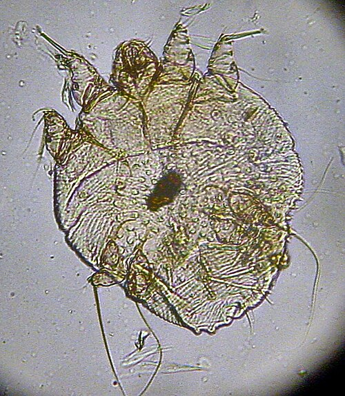
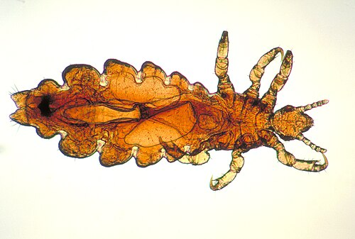

# ESCABIOSE E PEDICULOSE

## Escabiose: A Fisiopatologia do "Coça-Coça" Noturno

Para entender a escabiose, ou sarna humana, você precisa visualizar o agente: o *Sarcoptes scabiei* var. *hominis*. Ele é um ácaro parasita obrigatório. Isso significa que ele não sobrevive muito tempo longe da pele humana (geralmante apenas 24 a 36 horas). Por que isso importa para a sua prova? Porque a transmissão é, predominantemente, por contato direto pele a pele. Esqueça aquela história de que "pegou no ônibus" apenas encostando no banco; a transmissão por fômites (roupas, lençóis) existe, mas é muito menos comum do que o contato prolongado.

*Figura 1 - Sarcoptes scabiei var. hominis (ácaro da sarna) visto em microscopia. A fêmea escava túneis na camada córnea da epiderme para depositar ovos. Fonte: Kalumet, CC BY-SA 3.0 | Wikimedia Commons*

A fêmea fertilizada escava túneis na camada córnea da epiderme, onde deposita seus ovos e fezes (escíbalos). Aqui está o segredo do quadro clínico: o prurido intenso não é causado pela "mordida" do bicho, mas sim por uma reação de hipersensibilidade do tipo IV (tardia) às proteínas do ácaro, seus ovos e fezes.

É por isso que, na primeira infestação, o paciente demora de 3 a 6 semanas para começar a coçar. O corpo precisa desse tempo para se sensibilizar. Já em uma reinfestação, o prurido surge em 24 horas. Guarde isso: o prurido é classicamente noturno. Por quê? Porque o ácaro é mais ativo no calor do leito e porque a distração do dia mascara a sensação, que explode quando o paciente relaxa para dormir.

### O Quadro Clínico e a "Assinatura" da Escabiose

O diagnóstico da escabiose é eminentemente clínico. Você vai procurar por pápulas eritematosas, vesículas e, o "padrão ouro" visual, os túneis escabiosos. O túnel é uma linha serpiginosa, levemente elevada, de poucos milímetros. Na ponta do túnel, às vezes, vemos uma pequena vesícula (a "eminência acarina"), onde a fêmea reside.

A distribuição das lesões é o que as bancas mais cobram. No adulto e na criança maior, a escabiose respeita a "linha de Hebra": axilas, mamas, região periumbilical, punhos (face flexora), espaços interdigitais e genitália masculina.

Cuidado aqui: a escabiose no lactente é diferente! Em bebês, a pele é mais fina e a infestação é mais disseminada. Diferente do adulto, o lactente apresenta acometimento de couro cabeludo, face, pescoço, palmas e plantas. Se a questão descreve um bebê com pápulas e vesículas nas palmas e plantas e a mãe com coceira nas axilas, não tenha dúvida: é escabiose.

### Diagnóstico Diferencial: Não Confunda!

Um erro comum em provas é confundir escabiose com o Prurigo Estrófulo (picada de inseto). No Estrófulo, as lesões são pápulas serosas (com uma vesícula central, o "punctum") que aparecem em áreas expostas e costumam ter uma distribuição linear ou agrupada (o famoso "café, almoço e jantar" do inseto). O Estrófulo piora no verão, enquanto a escabiose não tem essa sazonalidade tão marcada, embora o calor aumente o prurido.

Outro diferencial importante é a Dermatite Atópica. No entanto, a atopia costuma poupar as axilas e a região genital, que são áreas "nobres" da escabiose. Além disso, a história familiar de "todo mundo coçando em casa" é o divisor de águas a favor da sarna.

| Característica | Escabiose | Prurigo Estrófulo | Dermatite Atópica |
| --- | --- | --- | --- |
| **Agente** | Ácaro (*S. scabiei*) | Hipersensibilidade a picada | Genético/Barreira cutânea |
| **Prurido** | Predominantemente noturno | Diurno e noturno | Contínuo, piora com suor |
| **Localização** | Dobras, genitália, espaços interdigitais | Áreas expostas (pernas, braços) | Dobras (fossa cubital, poplítea) |
| **História Familiar** | Frequentemente positiva (contágio) | Negativa para contágio | Positiva para atopia (asma, rinite) |
| **Lactentes** | Palmas, plantas e face | Perna e tronco | Face e superfícies extensoras |

### Tratamento da Escabiose: A Regra de Ouro

O tratamento de escolha, segundo a Sociedade Brasileira de Pediatria (SBP) e a Sociedade Brasileira de Dermatologia (SBD), é a Permetrina 5% em creme.

Como orientar o paciente (e responder na prova):

- O creme deve ser aplicado do pescoço para baixo (no lactente, incluir cabeça e face, poupando olhos e boca).

- Deve ser aplicado à noite e retirado no banho após 8 a 12 horas.

- **Fundamental:** Repetir a aplicação após 7 a 14 dias. Por que repetir? Porque a permetrina mata o ácaro, mas não é totalmente ovicida. Precisamos esperar os ovos eclodirem para matar os novos ácaros antes que eles se tornem adultos e botem mais ovos.

E os contatos? Aqui é onde muitos alunos erram. Todos os contatos domiciliares e sexuais devem ser tratados simultaneamente, mesmo que estejam assintomáticos. Lembre-se do período de incubação de até 6 semanas; o pai pode estar com o ácaro mas ainda não começou a coçar.

Para casos específicos:

- **Lactentes < 2 meses:** A permetrina não é recomendada pela falta de estudos de segurança nessa faixa etária. A escolha é o Enxofre Precipitado (5% a 10%) em vaselina, aplicado por 3 noites consecutivas.

- **Ivermectina Oral:** Reservada para crianças com mais de 15 kg (ou > 5 anos, dependendo da fonte, mas a regra dos 15 kg é a mais comum em provas). A dose é 200 mcg/kg em dose única, repetindo em 7 a 14 dias. É excelente para surtos em comunidades ou casos de sarna crostosa (norueguesa).

Como o Dr. Will sempre reforça nas discussões do MedEvo, o "prurido pós-escabiótico" é uma pegadinha clássica. O paciente termina o tratamento e volta dizendo que ainda coça. Se não houver lesões novas (túneis), isso não é falha terapêutica! É apenas a reação de hipersensibilidade persistindo aos restos de ácaros mortos. Tratamos com anti-histamínicos e, às vezes, corticoides tópicos.

*Figura 2 - Pediculus humanus var. capitis (piolho da cabeça). Inseto hematófago que causa prurido intenso no couro cabeludo. Fonte: CDC/Dr. Dennis D. Juranek, Domínio Público | Wikimedia Commons*

## Pediculose: O Piolho Além do Couro Cabeludo

A pediculose capitis é causada pelo *Pediculus humanus capitis*. Diferente do ácaro da sarna, o piolho vive fora da pele, agarrado aos fios de cabelo. Ele se alimenta de sangue (é hematófago) e injeta saliva irritante, o que causa o prurido.

A transmissão ocorre pelo contato direto cabeça com cabeça ou por fômites (pentes, bonés, escovas). O sintoma principal é o prurido no couro cabeludo, especialmente nas regiões occipital e retroauricular.

### O Exame Físico e as Complicações

Ao examinar, você busca pelo piolho vivo (difícil de ver, pois ele foge da luz) ou pelas lêndeas (ovos). Dica de ouro: a lêndea é firmemente aderida ao fio. Se você soprar e sair, é caspa. Se tiver que puxar com a unha e ela oferecer resistência, é lêndea.

Uma complicação frequente em provas é a piodermite secundária. A criança coça tanto que rompe a barreira cutânea e infecta com *Staphylococcus aureus* ou *Streptococcus pyogenes*. O quadro será de impetigo: crostas melicéricas e exsudato purulento sobre as lesões de pediculose. Nesses casos, além de tratar o piolho, você precisará de antibióticos (como a Cefalexina). Outro achado comum é a linfonodomegalia cervical e occipital reacional.

### Manejo da Pediculose

O tratamento de primeira linha é a Permetrina 1% (atenção: na escabiose é 5%, na pediculose é 1%).

- Lavar o cabelo, secar levemente e aplicar a loção.

- Deixar agir por 10 minutos e enxaguar.

- Repetir em 7 a 10 dias.

O uso do pente fino é essencial para a remoção mecânica das lêndeas. Uma dica prática que cai em prova: o uso de solução de água com vinagre (proporção 1:1) ajuda a "amolecer" a cola que prende a lêndea ao fio, facilitando a remoção com o pente fino.

A Ivermectina oral também pode ser usada (mesmos critérios de peso/idade da escabiose) em casos resistentes ou infestações maciças.

| Condição | Agente | Tratamento 1ª Escolha | Particularidade |
| --- | --- | --- | --- |
| **Escabiose** | *Sarcoptes scabiei* | Permetrina 5% (8-12h) | Tratar todos os contatos |
| **Pediculose** | *Pediculus capitis* | Permetrina 1% (10 min) | Remoção mecânica (pente fino) |
| **Lactente < 2 meses** | *Sarcoptes scabiei* | Enxofre 5-10% | Segurança farmacológica |
| **Sarna Crostosa** | *Sarcoptes scabiei* | Permetrina + Ivermectina | Altamente contagiosa / Imunossuprimidos |

## Diagnóstico Diferencial Ampliado em Dermatopediatria

As bancas adoram colocar a escabiose no meio de outras doenças exantemáticas ou pruriginosas. Vamos conectar os pontos para você não errar.

### Molusco Contagioso

Causado por um Poxvírus. São pápulas cor da pele, semiesféricas, com uma característica fundamental: umbilicação central. São assintomáticas. Se a questão fala em "pápulas umbilicadas em criança", marque Molusco Contagioso. O tratamento pode ser curetagem, criocirurgia ou apenas observação (muitos regridem sozinhos).

### Varicela (Catapora)

Aqui o prurido também é intenso, mas o quadro é agudo e febril. A palavra-chave é polimorfismo regional: você encontra máculas, pápulas, vesículas ("gota de orvalho sobre pétala de rosa") e crostas, tudo ao mesmo tempo na mesma região do corpo. Na escabiose, não há febre (a menos que haja infecção secundária) e as lesões não evoluem tão rápido para crostas em todo o corpo.

### Tinea Capitis

Se a criança tem uma área de alopecia (queda de cabelo), com descamação e "pontos pretos" (cabelos quebrados rente ao couro cabeludo), pense em Tinea Capitis (fungo). O tratamento aqui é obrigatoriamente sistêmico (Griseofulvina é a primeira escolha na pediatria), pois os antifúngicos tópicos não penetram no folículo piloso. Não confunda com pediculose, onde o cabelo não cai!

### Enterobíase (Oxiuríase)

Você deve estar se perguntando: o que um verme intestinal faz aqui? É por causa do sintoma: prurido anal noturno. O *Enterobius vermicularis* fêmea migra para a região perianal à noite para botar ovos. Isso causa um prurido intenso que pode ser confundido com escabiose genital ou perianal.
Dica de prova: se a questão fala em prurido anal noturno + vulvovaginite em menina, pense em oxiuríase. O diagnóstico é pelo método de Graham (fita adesiva). O tratamento é com Albendazol ou Pamoato de Pirvínio, repetindo em 2 semanas.

## Situações Especiais e Pegadinhas de Prova

### Sarna Crostosa (Norueguesa)

É uma forma extrema de escabiose que ocorre em pacientes imunossuprimidos (HIV, transplantados) ou com deficiências neurológicas/cognitivas que impedem o ato de coçar. Em vez de 10 a 15 ácaros no corpo (o normal da escabiose clássica), o paciente tem milhões. A pele fica coberta por crostas espessas e ceratósicas. É altamente contagiosa. O tratamento aqui deve ser agressivo: associação de Permetrina tópica (diária por 7 dias) + Ivermectina oral (várias doses).

### O Sinal da Asa-Delta

Na dermatoscopia da escabiose, podemos ver uma estrutura triangular escura que corresponde à parte anterior do ácaro. As bancas chamam isso de "sinal da asa-delta" ou "sinal do triângulo". É um achado patognomônico que ajuda a confirmar o diagnóstico clínico duvidoso.

### A Questão da Higiene Ambiental

Muitas questões trazem alternativas absurdas sobre "queimar as roupas" ou "dedetizar a casa". Não é necessário. O ácaro morre fora do corpo em pouco tempo. A recomendação correta é: lavar roupas de uso pessoal, de cama e banho (das últimas 48-72 horas) em água quente (60°C) e secar em secadora ou passar a ferro. O que não puder ser lavado pode ser selado em um saco plástico por 7 dias (o ácaro morrerá de fome).

### Por que a Ivermectina não é para todos?

A ivermectina age nos canais de cloreto controlados pelo glutamato, que são específicos de invertebrados. No entanto, em doses altas ou em crianças muito pequenas com barreira hematoencefálica imatura, ela pode interagir com os receptores GABA no sistema nervoso central humano, causando neurotoxicidade. Por isso, a cautela e o limite de peso/idade.

## Resumo de Condutas por Faixa Etária (Escabiose)

- **Recém-nascido e Lactente < 2 meses:** Enxofre precipitado 5-10% em vaselina por 3 noites. Tratar a mãe com Permetrina 5%.

- **Lactente > 2 meses e Crianças < 15 kg:** Permetrina 5% creme. Aplicar no corpo todo (incluindo cabeça), retirar após 8-12h. Repetir em 7 dias.

- **Crianças > 15 kg e Adultos:** Permetrina 5% creme (primeira escolha) OU Ivermectina oral 200 mcg/kg. Repetir ambos em 7-14 dias.

- **Gestantes e Lactantes:** Permetrina 5% é considerada segura (Categoria B). O enxofre também é uma opção segura.

## Pontos-Chave para Prova

- **Diagnóstico Clínico:** Prurido noturno + história familiar + lesões em dobras/genitália. No lactente, inclui palmas, plantas e face.

- **Padrão Ouro de Exame:** Visualização direta do ácaro, ovos ou fezes em raspado de pele (microscopia direta).

- **Tratamento de Escolha (Escabiose):** Permetrina 5% creme, aplicada do pescoço para baixo (ou corpo todo no lactente), repetindo em 7 a 14 dias.

- **Tratamento de Escolha (Pediculose):** Permetrina 1% loção por 10 minutos, repetindo em 7 a 10 dias + remoção mecânica.

- **Ivermectina Oral:** Apenas para > 15 kg ou > 5 anos. Dose de 200 mcg/kg.

- **Lactentes < 2 meses:** O tratamento mais seguro para escabiose é o Enxofre Precipitado 5-10%.

- **Contatos:** Todos os contatos domiciliares devem ser tratados, mesmo que assintomáticos.

- **Prurido Pós-Tratamento:** Pode durar semanas devido à hipersensibilidade; não indica necessariamente falha ou reinfestação.

- **Sinal da Asa-Delta:** Achado dermatoscópico do ácaro *Sarcoptes scabiei*.

- **Complicação Comum:** Piodermite secundária (impetiginização) por coçadura, exigindo antibióticos sistêmicos se disseminada.

- **Diferencial de Prurido Anal:** Pensar em Oxiuríase (*Enterobius vermicularis*), especialmente se houver vulvovaginite associada.

- **O que NÃO fazer:** Não usar lindano (neurotóxico, banido em muitos lugares) e não tratar apenas o paciente índice na escabiose.

- **Higiene:** Lavar roupas em água quente e passar a ferro é suficiente para o controle ambiental.

- **Lêndeas:** Se estão a mais de 1 cm do couro cabeludo, geralmente indicam infestação antiga/inativa (o cabelo cresce e leva a lêndea vazia).

- **Sarna Crostosa:** Altamente infectante, crostas espessas, comum em imunossuprimidos, exige tratamento tópico e oral associados. 🚀

 Cópia offline para consulta pessoal.
 Fonte original:
 [https://www.medevo.com.br/material-apoio/ler/f298693b-4891-4ac5-a9ec-7c1aa670dca7](https://www.medevo.com.br/material-apoio/ler/f298693b-4891-4ac5-a9ec-7c1aa670dca7)
