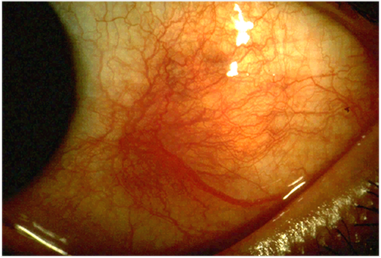
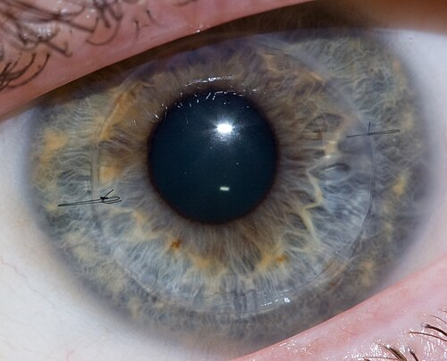

# ESCLERA E CIRURGIA DE CÓRNEA

Para entender as doenças da esclera e as intervenções na córnea, você precisa primeiro visualizar a estrutura do olho não como peças isoladas, mas como uma continuidade de tecido conjuntivo. A esclera é o "esqueleto" do globo ocular, e a córnea é a sua "janela" transparente.

Muitos alunos erram questões de esclera porque tentam decorar nomes de doenças sistêmicas associadas. O segredo aqui é entender a inflamação. Se você entender como o vaso sanguíneo se comporta na superfície ocular, você mata 80% das questões de diagnóstico diferencial.

## Anatomia e Fisiologia Aplicada: O Porquê da Transparência

A esclera e a córnea são compostas majoritariamente por colágeno tipo I. Então, por que uma é branca e a outra é transparente? A resposta está na organização. Na córnea, as lamelas de colágeno são perfeitamente paralelas e o estado de desidratação é mantido pela bomba endotelial. Na esclera, as fibras são desordenadas, de diâmetros variados e hidratadas.

A esclera é dividida em três camadas que você deve conhecer para o exame na lâmpada de fenda:

- Episclera: A camada mais superficial, ricamente vascularizada.

- Estroma escleral: Praticamente avascular, composto por colágeno denso.

- Lâmina fusca: A camada mais interna, em contato com a coróide.

Cuidado: a esclera é quase avascular. Ela depende do plexo epiescleral superficial e profundo para sua nutrição. É por isso que, quando a esclera inflama (esclerite), o processo é tão grave e pode levar à necrose, pois o suprimento sanguíneo já é precário por natureza.

## Epiesclerite: A Inflamação "Benigna"

A epiesclerite é uma condição autolimitada e, na maioria das vezes, idiopática. O paciente típico é jovem e apresenta um olho vermelho súbito, mas com pouco ou nenhum desconforto.

### Classificação e Quadro Clínico

Existem dois tipos principais que as bancas adoram comparar:

- Epiesclerite Simples: É a mais comum (80%). O vermelhidão é difuso ou setorial.

- Epiesclerite Nodular: Existe um nódulo móvel sobre a esclera.

Aqui está o primeiro grande "pulo do gato" do Dr. Will: na epiesclerite nodular, o nódulo se move sobre a esclera quando você o pressiona com um cotonete. Na esclerite nodular, o nódulo é fixo, pois a inflamação é profunda.

### O Teste da Fenilefrina 10%

Este é o teste mais cobrado em provas para diferenciar epiesclerite de esclerite.

- Como funciona: Você instila uma gota de fenilefrina 10% (um potente vasoconstritor).

- Resultado na Epiesclerite: Os vasos superficiais (epiesclerais) sofrem vasoconstrição e o olho "clareia" em 10 a 15 minutos.

- Resultado na Esclerite: Os vasos profundos não contraem significativamente, e o olho permanece vermelho ou com um tom violáceo.

Por que isso acontece? Porque a fenilefrina atinge mais facilmente o plexo superficial. Se a inflamação for profunda (escleral), o calibre dos vasos não muda o suficiente para mudar a cor do olho ao exame clínico.

*Figura 1 - Fotografia clínica de esclerite anterior, demonstrando hiperemia escleral difusa com padrão inflamatório profundo. Fonte: Kribz, CC BY-SA 3.0 | Wikimedia Commons*

## Esclerite: Onde o Perigo Mora

Diferente da epiesclerite, a esclerite é uma doença grave, potencialmente cegante e frequentemente associada a doenças sistêmicas fatais. Cerca de 50% dos pacientes com esclerite têm uma doença sistêmica subjacente.

### Classificação de Watson e Hayreh

Esta classificação é a bíblia do tema. Memorize esta estrutura:

-

Esclerite Anterior (95% dos casos):

- Difusa: A forma mais comum e menos grave.

- Nodular: Nódulo fixo e doloroso.

- Necrotizante com inflamação: A forma mais grave e dolorosa.

- Necrotizante sem inflamação (Escleromalácia Perforans): Típica de mulheres idosas com Artrite Reumatoide de longa data.

-

Esclerite Posterior (5% dos casos):

- Frequentemente subdiagnosticada porque o olho pode não estar vermelho.

### O Sinal do "T" e a Esclerite Posterior

Imagine um paciente com dor ocular intensa, mas o olho está branco. O que você faz? Pensa em esclerite posterior. No ultrassom (Ecografia B), você verá o sinal do "T".
Isso ocorre devido ao acúmulo de fluido no espaço de Tenon, que contorna o nervo óptico, formando a haste do "T", enquanto a esclera espessada forma o topo.

### Associações Sistêmicas

Se cair esclerite na prova, a alternativa correta sobre a causa sistêmica provavelmente será uma destas:

- Artrite Reumatoide (A associação mais comum).

- Granulomatose com Poliangiite (antiga Wegener) - Pense nisso se houver necrose importante.

- Policondrite Recidivante (inflamação nas orelhas e nariz).

- Lúpus Eritematoso Sistêmico.

| Característica | Epiesclerite | Esclerite |
| --- | --- | --- |
| Dor | Leve/Desconforto | Intensa, irradia para face, piora à noite |
| Cor | Vermelho vivo | Violáceo/Azulado (luz natural) |
| Teste Fenilefrina | Vasos clareiam | Vasos NÃO clareiam |
| Associação Sistêmica | Rara | Muito frequente (50%) |
| Risco de Perda Visual | Quase nulo | Alto |

## Manejo Terapêutico das Esclerites

O tratamento da esclerite não é apenas ocular, é sistêmico. Não adianta dar colírio para uma esclerite necrotizante; você estará apenas assistindo o olho perfurar.

-

Esclerite Não-Necrotizante:

- Primeira linha: AINEs sistêmicos (ex: Indometacina 50mg 3x/dia ou Naproxeno 500mg 2x/dia).

- Se não responder: Corticosteroides sistêmicos (Prednisona 1mg/kg/dia).

-

Esclerite Necrotizante:

- Aqui o AINE é proibido como monoterapia. Você deve iniciar Corticosteroides em doses altas e, frequentemente, Imunossupressores (Ciclofosfamida é a droga de escolha na Granulomatose com Poliangiite).

Erro comum de prova: Achar que colírio de corticoide resolve esclerite. O corticoide tópico pode até ajudar no conforto, mas não altera o curso da doença escleral. A esclerite é uma manifestação de vasculite sistêmica.

## Cirurgia de Córnea: Transplantes

O transplante de córnea (ceratoplastia) evoluiu de "trocar a tampa inteira" para "trocar apenas a camada doente". Isso mudou drasticamente o prognóstico dos pacientes.

*Figura 2 - Olho humano após ceratoplastia penetrante, mostrando suturas corneanas durante cicatrização. Fonte: Megor1, CC BY 3.0 | Wikimedia Commons*

## Ceratoplastia Penetrante (PK)

É o transplante de espessura total.

- Indicações: Cicatrizes que atingem todas as camadas, ceratocone avançado com hidropisia prévia, falência endotelial com estroma muito comprometido.

- Desvantagem: Recuperação lenta (até 1 ano), alto astigmatismo, maior risco de rejeição e de deiscência de sutura por trauma.

## Ceratoplastia Lamelar Anterior Profunda (DALK)

Aqui, removemos o epitélio e o estroma, mas preservamos o endotélio e a membrana de Descemet do paciente.

- Por que fazer DALK em vez de Penetrante? Porque o endotélio é a camada que mais causa rejeição imunológica. Se você mantém o endotélio do paciente, o risco de rejeição endotelial é ZERO.

- Indicação clássica: Ceratocone sem cicatriz na Descemet.

*Figura 2 - Olho humano após ceratoplastia penetrante, mostrando suturas corneanas durante cicatrização. Fonte: Megor1, CC BY 3.0 | Wikimedia Commons*

## Ceratoplastia Lamelar Posterior (Endotelial)

Indicada quando o problema é apenas o endotélio (ex: Distrofia de Fuchs ou Ceratopatia Bolhosa do Pseudofácico).

- DSAEK: Transplante de endotélio, Descemet e uma fina camada de estroma posterior.

- DMEK: Transplante apenas de endotélio e membrana de Descemet.

Dica MedEvo: O DMEK proporciona a melhor acuidade visual e a menor taxa de rejeição de todos os transplantes, mas é tecnicamente muito mais difícil. O enxerto é uma membrana finíssima que se enrola como um "pergaminho" dentro do olho.

| Tipo de Transplante | Camadas Substituídas | Principal Vantagem |
| --- | --- | --- |
| Penetrante (PK) | Todas | Técnica mais simples, trata qualquer camada |
| DALK | Epitélio + Estroma | Sem risco de rejeição endotelial |
| DSAEK | Endotélio + Descemet + Estroma Post. | Recuperação rápida, menos astigmatismo |
| DMEK | Endotélio + Descemet | Melhor visão, menor taxa de rejeição |

## Complicações do Transplante de Córnea

Este é um tema quente em provas de residência. Você precisa diferenciar Rejeição de Falência.

### Rejeição Imunológica

É uma resposta do hospedeiro contra o enxerto. Pode ocorrer em qualquer camada:

- Epitelial: Linha de rejeição epitelial (pouco grave).

- Estromal: Linhas de Krachmer (infiltrados subepiteliais).

- Endotelial: A mais grave. Presença da Linha de Khodadoust (precipitados ceráticos organizados em linha).

Tratamento da Rejeição: Corticoide tópico de hora em hora (Prednisolona 1%). Se for grave ou em olho único, pode-se usar pulsoterapia com Metilprednisolona.

### Falência do Enxerto

A falência é o edema irreversível da córnea transplantada. Pode ser:

- Primária: O enxerto já nasce morto (erro na preservação ou técnica cirúrgica). O olho nunca clareia após a cirurgia.

- Tardia: Perda crônica de células endoteliais ao longo dos anos.

## Cirurgia Refrativa: O Sonho da Independência dos Óculos

A cirurgia refrativa a laser baseia-se na remodelação do estroma corneano (fotoablação) pelo Excimer Laser.

### PRK (Ceratectomia Fotorrefrativa)

O cirurgião remove o epitélio (mecanicamente ou com álcool) e aplica o laser diretamente no estroma superficial.

- Vantagens: Mais seguro para córneas finas, não tem risco de complicações de "flap".

- Desvantagens: Dor no pós-operatório (3-4 dias), recuperação visual lenta, risco de "haze" (opacidade cicatricial).

### LASIK (Laser-assisted in situ Keratomileusis)

Cria-se um "flap" (uma lamela de córnea) com um microcerátomo ou laser de femtosegundo. O laser é aplicado no estroma médio e o flap é reposicionado.

- Vantagens: Recuperação visual quase imediata (24h), sem dor.

- Desvantagens: Risco de complicações no flap, maior risco de ectasia (enfraquecimento da córnea).

### Critérios de Segurança e Contraindicações

Para operar um paciente, você deve garantir que a córnea dele aguenta a retirada de tecido.

- Estabilidade refrativa: Pelo menos 1 ano sem mudança significativa (> 0.50 D).

- Idade: Geralmente acima de 21 anos.

- Paquimetria: Deve sobrar um Leito Estromal Residual (LSR) de pelo menos 250 micra (alguns serviços usam 300 micra por segurança).

- Topografia/Tomografia: Excluir Ceratocone ou padrões de "suspeita de ceratocone".

Contraindicações Absolutas:

- Ceratocone ou ectasias corneanas.

- Doenças autoimunes em atividade (risco de "melting" ou derretimento corneano).

- Herpes ocular em atividade.

- Expectativas irreais do paciente.

## Complicações da Cirurgia Refrativa

As bancas amam cobrar as complicações específicas do LASIK.

-

DLK (Diffuse Lamellar Keratitis) ou "Sands of Sahara":

- É uma inflamação estéril que ocorre na interface entre o flap e o estroma.

- Parece "areia" ao exame na lâmpada de fenda.

- Tratamento: Corticoide tópico intensivo. Se grave, deve-se levantar o flap e lavar a interface.

-

Ectasia Pós-Refrativa:

- A complicação mais temida. A córnea torna-se instável e começa a "abaular", como um ceratocone iatrogênico.

- Fator de risco: Operar córneas muito finas ou com topografia alterada.

-

Crescimento Epitelial na Interface:

- Células do epitélio "entram" para baixo do flap. Se progredir para o eixo visual, o flap deve ser levantado e as células removidas.

| Complicação | Característica | Conduta |
| --- | --- | --- |
| DLK | Infiltrado fino, estéril, "areia" | Corticoide tópico / Lavagem |
| Ectasia | Baixa visual progressiva, astigmatismo irregular | Crosslinking / Anel / Transplante |
| Haze (PRK) | Opacidade estromal superficial | Corticoide tópico / Mitomicina C |
| Olho Seco | Muito comum no pós-imediato | Lubrificantes |

## Casos Clínicos para Fixação

### Caso 1: A Dor que Acorda o Paciente

Paciente, 55 anos, feminina, com diagnóstico de Artrite Reumatoide. Queixa-se de dor ocular intensa em olho direito, que irradia para a têmpora e a impede de dormir. Ao exame: hiperemia violácea profunda, que não clareia com fenilefrina. Há uma área de afinamento escleral onde se observa a coróide (aspecto azulado).

- Diagnóstico: Esclerite Necrotizante com Inflamação.

- Conduta: Internação para pulsoterapia com corticoide e investigação de atividade da doença sistêmica. Nunca use apenas colírio aqui.

### Caso 2: O Pós-Operatório de LASIK

Paciente no 2º dia de pós-operatório de LASIK apresenta visão levemente turva e sensação de corpo estranho. À lâmpada de fenda, observam-se infiltrados granulares finos e brancos na interface do flap, poupando a periferia. Olho calmo, sem secreção.

- Diagnóstico: DLK (Diffuse Lamellar Keratitis).

- Diferencial: Ceratite infecciosa (esta teria dor intensa, secreção e infiltrado focal, não difuso na interface).

- Conduta: Aumentar a frequência do corticoide tópico (ex: Acetato de Prednisolona 1% de 1/1h).

## Pontos-Chave para Prova

- Epiesclerite clareia com fenilefrina 10%; Esclerite NÃO clareia.

- A esclerite mais comum é a Anterior Difusa.

- A esclerite mais grave é a Anterior Necrotizante com Inflamação.

- Escleromalácia Perforans é a esclerite necrotizante SEM inflamação, associada à Artrite Reumatoide.

- O sinal do "T" na ecografia é patognomônico de Esclerite Posterior.

- A principal causa de esclerite infecciosa é o Herpes Zoster Oftálmico.

- No transplante de córnea, a rejeição endotelial é marcada pela Linha de Khodadoust.

- O transplante DALK elimina o risco de rejeição endotelial porque preserva o endotélio do receptor.

- O transplante DMEK substitui apenas a membrana de Descemet e o endotélio.

- Contraindicação absoluta para cirurgia refrativa: Ceratocone.

- O Leito Estromal Residual mínimo no LASIK deve ser de 250 micra para evitar ectasia.

- DLK (Sands of Sahara) é uma complicação inflamatória estéril do LASIK tratada com corticoides.

- A Mitomicina C é usada no PRK para prevenir o "haze" (opacidade cicatricial) em altas ametropias.

- A principal causa de falência tardia do transplante é a perda fisiológica e acelerada de células endoteliais.

- Em casos de esclerite necrotizante por Granulomatose com Poliangiite, a Ciclofosfamida é a droga de escolha.

- O astigmatismo é muito maior na ceratoplastia penetrante do que nas técnicas lamelares. 💡

 Cópia offline para consulta pessoal.
 Fonte original:
 [https://www.medevo.com.br/material-apoio/ler/85fc9b12-7dbf-4d5a-bb88-42ffdf05388d](https://www.medevo.com.br/material-apoio/ler/85fc9b12-7dbf-4d5a-bb88-42ffdf05388d)
