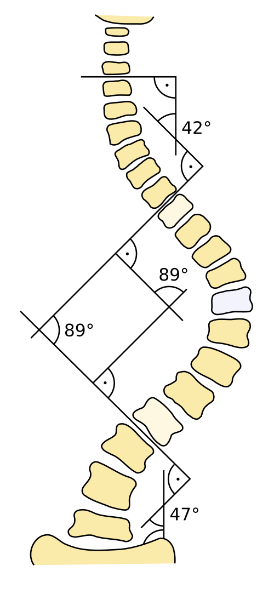
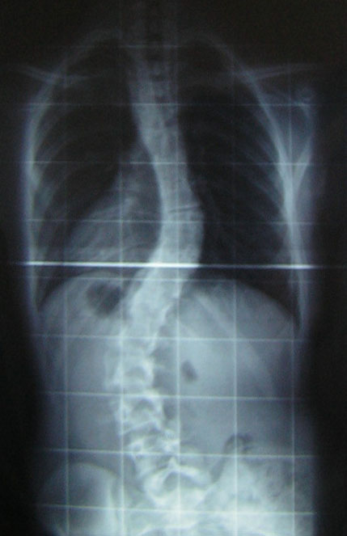

# ESCOLIOSE

Para começar nossa conversa, esqueça aquela ideia de que a escoliose é apenas uma "coluna tortinha" para o lado. Se você definir escoliose assim na prova, ou pior, na frente de um preceptor de ortopedia, você vai ser corrigido na hora. A escoliose é uma deformidade tridimensional. Imagine uma escada em caracol que foi levemente achatada. Temos um desvio no plano frontal (o que vemos de frente), uma alteração no plano sagital (perfil) e, o mais importante para o diagnóstico clínico, uma rotação vertebral no plano axial.

Por que essa rotação é tão importante? Porque é ela que gera a famosa gibosidade que você procura no exame físico. Sem rotação, não temos escoliose verdadeira, temos apenas uma atitude escoliótica, que pode ser causada por uma perna mais curta ou uma postura viciosa. Guarde este número: para ser escoliose, o Ângulo de Cobb precisa ser maior que 10 graus. Menos que isso é apenas uma assimetria fisiológica da coluna.

*Figura 1 - Diagrama ilustrando a medição do ângulo de Cobb em radiografia de escoliose, método padrão para quantificação da deformidade. Fonte: Skoliose-Info-Forum.de, CC BY-SA 3.0 | Wikimedia Commons*

## Classificação e Etiologia: Onde as Bancas Atacam

A maioria dos casos que você verá na vida real e nas provas (cerca de 80%) é a Escoliose Idiopática do Adolescente (EIA). O nome já diz tudo: não sabemos a causa exata (idiopática) e surge no estirão do crescimento. Mas cuidado, o diagnóstico de "idiopática" é de exclusão. Você precisa garantir que não há uma malformação vertebral ou uma doença neuromuscular por trás.

### Escoliose Idiopática por Faixa Etária

A EIA é dividida conforme a idade de aparecimento, e isso muda drasticamente o prognóstico:

- **Infantil:** 0 a 3 anos. É rara e, curiosamente, a maioria regride espontaneamente. Muitas vezes associada a deformidades craniofaciais.

- **Juvenil:** 3 a 10 anos. Aqui o sinal de alerta acende. Tem um alto risco de progressão porque a criança ainda tem muito chão de crescimento pela frente.

- **Adolescente:** Acima de 10 anos até a maturidade esquelética. É o "filé mignon" das provas de residência.

Aqui entra um conceito que o Dr. Will sempre reforça nas discussões do MedEvo: a relação entre crescimento e progressão. A escoliose "ama" o crescimento. Se a coluna cresce rápido, a curva entorta rápido. Por isso, uma menina de 11 anos que ainda não menstruou é muito mais preocupante do que uma jovem de 16 anos com a mesma curvatura.

### Escoliose Não Idiopática (Sinais de Alerta)

Quando você deve suspeitar que a escoliose NÃO é idiopática? As bancas adoram colocar casos clínicos com "red flags". Se o paciente apresentar dor noturna importante, rigidez na coluna, sinais neurológicos (fraqueza, alteração de reflexos) ou se a curva for para a esquerda (levoescoliose) na região torácica, pare tudo. A escoliose idiopática clássica é indolor e geralmente torácica direita. Uma curva torácica esquerda tem uma associação altíssima com siringomielia ou tumores intramedulares. Nesses casos, a conduta muda: você DEVE solicitar uma Ressonância Magnética.

## O Exame Físico: A Arte do Teste de Adams

O diagnóstico de escoliose começa com os olhos, não com o raio-x. No exame físico, você deve observar o paciente de costas, com os pés paralelos. Procure por:

- Assimetria de ombros (um mais alto que o outro).

- Desvio da linha plúmbea (o tronco está "pendendo" para um lado).

- Assimetria das escápulas.

- Desnível do triângulo de talhe (o espaço entre o braço e o tronco).

Mas o "pulo do gato" é o Teste de Adams. Você pede para o paciente inclinar o tronco para frente, como se fosse mergulhar, mantendo os joelhos esticados. Se houver escoliose verdadeira, você verá a gibosidade costal. Por que ela aparece? Lembra da rotação vertebral? Quando a vértebra roda, ela empurra as costelas para trás no lado da convexidade da curva.

**Dica de Prova:** Se a questão descreve um "Teste de Adams positivo + assimetria de ombros", o próximo passo é sempre a confirmação radiográfica com uma radiografia panorâmica da coluna (ortostática). Não aceite radiografias feitas deitado, pois a gravidade é essencial para avaliar a magnitude real da curva.

*Figura 2 - Radiografia posteroanterior demonstrando escoliose idiopática do adolescente com curva torácica de 30° e curva lombar de 53° (ângulo de Cobb). Fonte: Silverjonny, Domínio Público | Wikimedia Commons*

## Diagnóstico por Imagem: Cobb e Risser

Agora que você suspeitou clinicamente, precisamos quantificar. A radiografia panorâmica (frente e perfil) é o padrão-ouro. Nela, vamos calcular o Ângulo de Cobb e avaliar o Sinal de Risser.

### O Ângulo de Cobb

Para medir o Cobb, identificamos as "vértebras limites" (as mais inclinadas no topo e na base da curva). Traçamos linhas paralelas às superfícies superiores e inferiores dessas vértebras e medimos o ângulo de intersecção.

- **Cobb < 10°:** Variação da normalidade.

- **Cobb 10° - 20°:** Observação (geralmente).

- **Cobb 20° - 40°:** Tratamento conservador (colete).

- **Cobb > 40° - 50°:** Tratamento cirúrgico.

### O Potencial de Crescimento: Sinal de Risser

Este é o conceito que mais confunde os alunos. O Sinal de Risser avalia a ossificação da apófise ilíaca (o "osso do quadril"). Ele vai de 0 a 5:

- **Risser 0:** Sem ossificação (muito potencial de crescimento, alto risco de a curva piorar).

- **Risser 1 a 4:** A ossificação progride de lateral para medial.

- **Risser 5:** Ossificação completa e fusão (crescimento encerrado).

Por que isso importa? Porque o colete só funciona em quem ainda está crescendo. Se você colocar um colete em um paciente Risser 5, você está apenas causando desconforto sem nenhum benefício biomecânico, pois a coluna já "solidificou" naquela posição.

| Sinal de Risser | Significado Clínico | Risco de Progressão |
| --- | --- | --- |
| 0 | Início da adolescência / Pré-puberal | Altíssimo |
| 1 - 2 | Crescimento rápido (estirão) | Alto |
| 3 | Desaceleração do crescimento | Moderado |
| 4 | Quase maturo (menarca já ocorreu) | Baixo |
| 5 | Maturidade esquelética completa | Mínimo |

## Tratamento: A Regra de Ouro das Condutas

O tratamento da escoliose idiopática do adolescente é guiado por dois pilares: o valor do Ângulo de Cobb e o potencial de crescimento (Risser e idade). O objetivo não é "desentortar" a coluna com o colete, mas sim EVITAR que ela piore até que o crescimento acabe.

### 1. Observação

Indicada para curvas menores que 20 graus. O acompanhamento é feito com radiografias seriadas a cada 4 ou 6 meses. Se a curva progredir mais de 5 graus em um curto período, a conduta pode mudar para colete.

### 2. Colete (Tratamento Conservador)

Aqui está a maior "pérola" das provas. O colete (como o colete de Boston ou Milwaukee) é indicado quando:

- Ângulo de Cobb entre 25° e 40°.

- Paciente com imaturidade esquelética (Risser 0, 1 ou 2).

- Meninas pré-menarca (ou até 1 ano após a menarca).

**Erro clássico:** Achar que o colete deve ser usado apenas algumas horas por dia. Para ter eficácia, o uso deve ser de, no mínimo, 18 a 23 horas por dia. O colete de Milwaukee (aquele com o anel cervical) é usado para curvas torácicas altas, enquanto o de Boston (TLSO) é usado para curvas torácicas baixas e lombares.

### 3. Cirurgia (Artrodese)

Indicada geralmente para curvas que ultrapassam 45 ou 50 graus. Por que operamos? Porque curvas acima desse valor tendem a continuar progredindo mesmo na vida adulta (cerca de 1 grau por ano), podendo levar a complicações respiratórias e dor crônica no futuro.

## Diagnóstico Diferencial e Condições Associadas

A prova de pediatria raramente joga o tema "escoliose" isolado. Ela gosta de misturar com outras patologias ortopédicas da infância. Vamos conectar os pontos.

### Doença de Legg-Calvé-Perthes

Imagine um escolar (5 a 10 anos) que chega mancando (claudicação intermitente) e com dor no quadril ou no joelho (dor referida). Ao exame, ele tem limitação da abdução e rotação interna do quadril. Isso não é escoliose, é necrose avascular da cabeça do fêmur, ou Doença de Legg-Calvé-Perthes.

Por que isso cai junto? Porque a claudicação pode gerar uma "escoliose antálgica" ou compensatória. O examinador quer saber se você sabe diferenciar uma deformidade estrutural da coluna de uma compensação por um problema no quadril.

### Osteocondrose de Scheuermann

Muitas vezes confundida com a escoliose, a Doença de Scheuermann é uma hipercifose (o "corcunda") rígida. Enquanto a escoliose é um desvio lateral, aqui o desvio é para frente. O critério radiográfico é o encunhamento de 5 graus ou mais em pelo menos 3 vértebras consecutivas. O tratamento também envolve colete (Milwaukee) se houver crescimento residual.

### Trauma Raquimedular Pediátrico

Em casos de trauma, a criança tem uma particularidade: a frouxidão ligamentar. Isso permite que a coluna sofra uma lesão medular sem que haja fratura óssea visível no raio-x. É o conceito de SCIWORA (Spinal Cord Injury Without Radiographic Abnormality).

**Pérola de Prova:** Em crianças maiores de 3 anos vítimas de trauma, a presença de uma "dor distrativa" (ex: uma fratura exposta de fêmur muito dolorosa) é indicação de radiografia de coluna cervical e toracolombar, mesmo que a criança não se queixe de dor nas costas. A dor intensa em outro local "distrai" o paciente e o médico de uma possível lesão na coluna.

## Complicações e Prognóstico

O que acontece se não tratarmos? A escoliose não é apenas estética. Curvas torácicas muito acentuadas (acima de 80-100 graus) reduzem drasticamente o volume da caixa torácica, levando a uma doença pulmonar restritiva, cor pulmonale e redução da expectativa de vida.

No entanto, para a maioria dos adolescentes com EIA tratada adequadamente, o prognóstico é excelente. Eles podem praticar esportes e ter uma vida normal. O segredo é o diagnóstico precoce no rastreio escolar através do Teste de Adams.

## Resumo de Condutas por Ângulo de Cobb

Para facilitar sua memorização, montei esta tabela que resume a estratégia terapêutica padrão para a Escoliose Idiopática do Adolescente:

| Ângulo de Cobb | Conduta Padrão | Observação Importante |
| --- | --- | --- |
| < 10° | Não é escoliose | Apenas acompanhamento clínico se necessário |
| 10° - 20° | Observação | Reavaliar a cada 6 meses com RX se Risser baixo |
| 20° - 25° | Observação ou Colete | Colete se houver progressão documentada (>5°) |
| 25° - 40° | Colete (TLSO ou Milwaukee) | Uso por 23h/dia; apenas se Risser 0-3 |
| > 45° - 50° | Cirurgia (Artrodese) | Independe do Risser; risco de progressão na vida adulta |

## Aprofundando no Tratamento com Colete

Muitos alunos erram questões sobre colete por não entenderem a biomecânica. O colete não "empurra" a coluna para o lugar. Ele aplica pontos de pressão que guiam o crescimento da coluna para uma posição mais reta. É por isso que, se o paciente não está mais crescendo (Risser 4 ou 5), o colete perde sua função.

Existem dois tipos principais que você deve conhecer:

- **TLSO (Boston):** É o colete "baixo", que vai até abaixo das axilas. É excelente para curvas cujo ápice está abaixo da vértebra T7. É mais discreto e melhor aceito pelos adolescentes.

- **CTLSO (Milwaukee):** É o colete "alto", com um anel cervical. É a escolha obrigatória para curvas torácicas altas (ápice acima de T7), pois precisamos de um ponto de apoio mais alto para controlar a inclinação.

**Pegadinha de prova:** A alternativa dirá que o colete está indicado para uma menina de 15 anos, Risser 5, com Cobb de 30 graus. Está errado! Com Risser 5, a conduta é apenas observação, pois o risco de progressão é mínimo e o colete não terá efeito.

## O Papel da Radiografia Panorâmica

Não peça "RX de coluna torácica" e "RX de coluna lombar" separadamente para avaliar escoliose. O exame correto é a Radiografia Panorâmica da Coluna para Escoliose. Ela é feita em um filme longo que permite ver desde a base do crânio até as cristas ilíacas.

Isso é fundamental por dois motivos:

- Permite medir o Ângulo de Cobb de forma integrada.

- Permite visualizar as cristas ilíacas para graduar o Sinal de Risser no mesmo exame.

Além disso, o exame deve ser feito em ortostase (em pé). Se o paciente estiver deitado, a curva pode parecer menor do que realmente é, mascarando a gravidade do caso e levando a um erro de conduta.

*Figura 2 - Radiografia posteroanterior demonstrando escoliose idiopática do adolescente com curva torácica de 30° e curva lombar de 53° (ângulo de Cobb). Fonte: Silverjonny, Domínio Público | Wikimedia Commons*

## Diagnóstico Diferencial de Dor no Quadril e Claudicação

Como mencionado nas pérolas clínicas, a claudicação pediátrica é um tema irmão da escoliose nas provas. Se o caso clínico trouxer um paciente com assimetria de marcha, você deve pensar em:

- **Sinovite Transitória do Quadril:** Geralmente após quadro viral, dor aguda, melhora rápido com AINEs.

- **Doença de Legg-Calvé-Perthes:** Necrose da cabeça femoral, escolar, dor crônica e insidiosa, limitação de movimentos.

- **Epifisiólise do Fêmur Proximal:** Adolescente obeso, dor no quadril ou joelho, "escorregamento" da cabeça do fêmur.

Lembre-se: uma criança que manca pode inclinar o tronco para compensar a dor ou o encurtamento do membro, simulando uma escoliose. O Teste de Adams ajudará a diferenciar: se a gibosidade sumir ou não existir, a causa é extra-vertebral.

## Pontos-Chave para Prova 🎓

- **Definição de Escoliose:** Deformidade tridimensional com Ângulo de Cobb > 10 graus E rotação vertebral.

- **Teste de Adams:** Principal ferramenta de rastreio clínico; identifica a gibosidade costal causada pela rotação das vértebras.

- **Escoliose Idiopática do Adolescente (EIA):** É a forma mais comum (80% dos casos), diagnóstico de exclusão, mais frequente em meninas.

- **Curvas Atípicas:** Curva torácica à esquerda, dor intensa ou sinais neurológicos sugerem lesão medular oculta (solicitar Ressonância).

- **Ângulo de Cobb:** Medido entre as vértebras mais inclinadas da curva; define a gravidade e a conduta.

- **Sinal de Risser:** Avalia a maturidade esquelética através da apófise ilíaca (0 a 5). Risser 0-2 indica alto potencial de crescimento e risco de progressão.

- **Indicação de Colete:** Cobb entre 25° e 40° em pacientes com Risser 0, 1 ou 2.

- **Uso do Colete:** Deve ser usado de 18 a 23 horas por dia para ser eficaz.

- **Indicação Cirúrgica:** Geralmente para curvas com Cobb > 45-50 graus, devido ao risco de progressão na vida adulta e prejuízo cardiorrespiratório.

- **Radiografia Panorâmica:** Deve ser feita sempre em ortostase (em pé) para avaliação correta da gravidade.

- **Doença de Legg-Calvé-Perthes:** Importante diagnóstico diferencial de claudicação em escolares; necrose avascular da cabeça do fêmur.

- **Trauma Pediátrico:** Crianças com dor distrativa (outra fratura grave) devem ter a coluna radiografada mesmo sem queixas locais.

- **Sinal de Alerta (Red Flag):** Escoliose em meninos muito jovens ou com progressão muito rápida exige investigação de causas secundárias.

- **Menarca:** Ocorre geralmente no Risser 3-4; após a menarca, o ritmo de crescimento diminui, reduzindo o risco de progressão da curva.

- **O que NÃO fazer:** Não indicar colete para pacientes com maturidade esquelética completa (Risser 5) ou curvas menores que 20 graus sem progressão.

- **Pegadinha de Imagem:** A alternativa pode dizer que o RX deitado é melhor para "conforto do paciente", mas o correto é sempre em pé para avaliar o efeito da carga.

- **Cobb de 15 graus:** Conduta é apenas observação e reavaliação periódica, nunca colete ou cirurgia de imediato.

 Cópia offline para consulta pessoal.
 Fonte original:
 [https://www.medevo.com.br/material-apoio/ler/8c0c10d2-4c94-4847-9520-99d1c79c81db](https://www.medevo.com.br/material-apoio/ler/8c0c10d2-4c94-4847-9520-99d1c79c81db)
