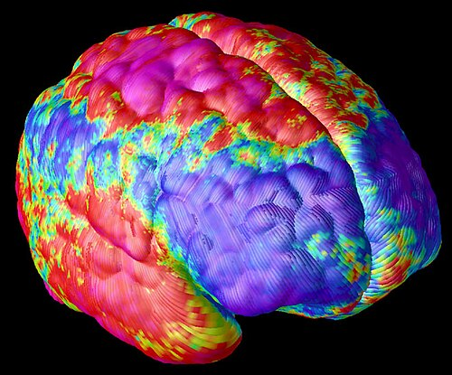
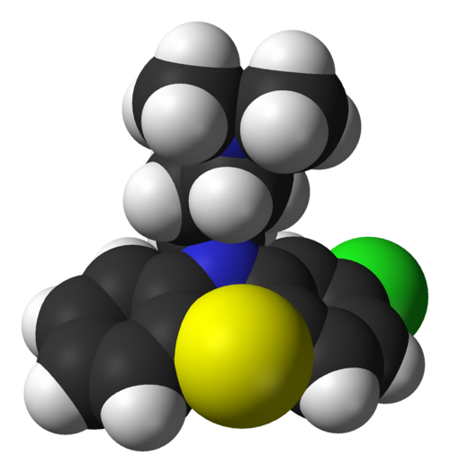

# ESQUIZOFRENIA E TRANSTORNOS PSICÓTICOS

Para entender a esquizofrenia, você precisa primeiro limpar sua mente das definições poéticas de "loucura" e focar na psicopatologia pura. Em provas de residência, o examinador quer saber se você sabe diferenciar um delírio de uma alucinação, se sabe manejar os efeitos colaterais dos antipsicóticos e se conhece os critérios temporais do DSM-5.

## O Coração da Psicose: Delírios e Alucinações

Antes de falarmos da doença "Esquizofrenia", precisamos entender os sintomas que a compõem. A psicose é um estado de ruptura com a realidade.

### Delírio: A Alteração do Conteúdo do Pensamento

O delírio não é apenas uma "mentira" ou um "erro". É uma crença falsa, irrefutável pela lógica ou por evidências contrárias, e que não é compartilhada pelo grupo cultural do paciente.

**Dica de Prova:** As bancas adoram confundir delírio com ideia prevalente. A diferença? O delírio é inabalável. Se você provar para o paciente que a CIA não está no jardim, ele dirá que eles se disfarçaram de árvores.

Os tipos mais comuns em prova:

- **Persecutório:** O mais frequente. "Estão me perseguindo".

- **De Grandeza:** Comum na Mania (Transtorno Bipolar), mas ocorre na esquizofrenia.

- **De Referência:** Achar que a TV ou o rádio estão enviando mensagens específicas para ele.

- **Não bizarro vs. Bizarro:** O Transtorno Delirante costuma ter delírios não bizarros (ex: ser traído), enquanto na esquizofrenia eles podem ser bizarros (ex: alienígenas trocaram meu cérebro por uma bateria).

### Alucinação: A Alteração da Percepção

Alucinação é a percepção real de um objeto inexistente. O paciente ouve, vê ou sente algo sem estímulo externo.

- **Auditivas:** As mais comuns na esquizofrenia. Frequentemente são vozes que comentam o comportamento do paciente ou dão ordens.

- **Visuais:** Se aparecerem isoladas, pense primeiro em causa orgânica (delirium, intoxicação, abstinência) ou epilepsia, não em esquizofrenia.

- **Hipnagógicas e Hipnopômpicas:** Cuidado aqui! Isso cai muito.

- **Hipnagógica:** Ao adormecer (lembre de "G" de "Gosto de dormir").

- **Hipnopômpica:** Ao acordar (lembre de "P" de "Pular da cama").

- **Importante:** Elas podem ocorrer em pessoas saudáveis e não fecham diagnóstico de psicose por si sós.

*Figura 1 - Imagem cerebral de paciente com esquizofrenia (NIMH): áreas mais claras indicam maior deficiência de tecido neuronal no córtex cerebral. Fonte: NIMH, Domínio Público | Wikimedia Commons*

## Fisiopatologia: A Hipótese Dopaminérgica

Por que o paciente alucina? Por que ele fica "travado" com o remédio? Tudo gira em torno da dopamina. Imagine quatro vias principais no cérebro:

- **Via Mesolímbica:** Muita dopamina aqui = **Sintomas Positivos** (delírios e alucinações). É onde os antipsicóticos agem para tratar a crise.

- **Via Mesocortical:** Pouca dopamina aqui = **Sintomas Negativos** (apatia, avolição, embotamento afetivo) e cognitivos.

- **Via Nigroestriatal:** Controla o movimento. Se o remédio bloqueia a dopamina aqui, temos os **Efeitos Extrapiramidais** (Parkinsonismo, distonia).

- **Via Tuberoinfundibular:** Controla a prolactina. Bloqueou aqui? A prolactina sobe (galactorreia, ginecomastia).

**O "Pulo do Gato" para a Prova:** Os antipsicóticos típicos (Haloperidol) bloqueiam D2 de forma muito potente e não seletiva. Por isso, melhoram o delírio (via mesolímbica), mas causam muito efeito colateral motor (via nigroestriatal).

## Esquizofrenia: Critérios Diagnósticos (DSM-5)

Para o Dr. Will e para qualquer examinador, o diagnóstico de esquizofrenia é clínico e exige tempo. Não se diagnostica esquizofrenia em uma semana.

### O Critério A (Os Sintomas)

O paciente deve apresentar pelo menos **dois** dos seguintes por pelo menos 1 mês (pelo menos um deles deve ser 1, 2 ou 3):

- Delírios.

- Alucinações.

- Discurso desorganizado (ex: descarrilamento, incoerência).

- Comportamento grosseiramente desorganizado ou catatônico.

- Sintomas negativos (embotamento afetivo, avolição).

### O Critério do Tempo (A Regra dos 6 Meses)

Esta é a maior pegadinha de prova.

- Sintomas por **menos de 1 mês**: Transtorno Psicótico Breve.

- Sintomas entre **1 e 6 meses**: Transtorno Esquizofreniforme.

- Sintomas por **mais de 6 meses** (incluindo fases prodrômicas ou residuais): **Esquizofrenia**.

**Exemplo Clínico:** Jovem de 19 anos, começou há 2 meses com isolamento social e há 3 semanas ouve vozes e diz que o vizinho é um espião. Diagnóstico? Transtorno Esquizofreniforme. Se ele continuar assim por mais 4 meses, mudamos o rótulo para Esquizofrenia.

### Sintomas Positivos vs. Negativos

- **Positivos (Adição):** O que o paciente "ganhou" que não deveria ter. Delírios, alucinações, agitação. Respondem bem aos antipsicóticos.

- **Negativos (Subtração):** O que o paciente "perdeu". Afeto embotado (não expressa emoção), alogia (fala pouco), anedonia (perda de prazer), avolição (falta de vontade), isolamento social. São os sintomas mais difíceis de tratar e os que mais geram incapacidade a longo prazo.

## Classificações e Variantes

Embora o DSM-5 tenha removido os subtipos (paranoide, hebefrênica, etc.) da classificação principal, as bancas ainda amam a **Esquizofrenia Hebefrênica (ou Desorganizada)**.

- **Características:** Início precoce, prognóstico ruim, pensamento muito desorganizado, afeto inapropriado (rir em velório) e sintomas negativos proeminentes.

### Transtorno Delirante

Aqui o paciente tem um delírio isolado, geralmente não bizarro (ex: ciúmes, perseguição, ser amado por alguém famoso), que dura pelo menos 1 mês. Diferente da esquizofrenia, o funcionamento social é preservado. Ele trabalha, cuida da casa, mas acredita piamente que a esposa o trai, apesar de todas as provas em contrário.

### Folie à deux (Transtorno Psicótico Compartilhado)

Um indivíduo (o primário, realmente psicótico) "contagia" um segundo indivíduo (geralmente alguém próximo e submisso) com seu delírio. O tratamento envolve separar os dois; muitas vezes o secundário melhora sem medicação.

## Tratamento Farmacológico: A Arte de Equilibrar Receptores

O tratamento de primeira linha para qualquer quadro psicótico são os **antipsicóticos (neurolépticos)**. No MedEvo, sempre reforçamos: a escolha do fármaco depende do perfil de efeitos colaterais que o paciente pode tolerar.

### 1. Antipsicóticos de Primeira Geração (Típicos)

Mecanismo: Bloqueio potente de receptores D2.

- **Alta Potência:** Haloperidol, Flufenazina. Ótimos para sintomas positivos, mas causam muitos efeitos extrapiramidais (EPS).

- **Baixa Potência:** Clorpromazina. Causa menos EPS, mas causa muita sedação, hipotensão ortostática (bloqueio alfa-1) e efeitos colaterais anticolinérgicos (boca seca, constipação).

### 2. Antipsicóticos de Segunda Geração (Atípicos)

Mecanismo: Bloqueio D2 + Bloqueio 5HT2A (Serotonina).

- **Vantagem:** Menor risco de EPS e discinesia tardia. Podem ajudar um pouco mais nos sintomas negativos.

- **Desvantagem:** O temido **Perfil Metabólico**.

- **Exemplos:** Risperidona, Olanzapina, Quetiapina, Aripiprazol, Clozapina.

| Medicamento | Característica Principal | Principal Efeito Adverso |
| --- | --- | --- |
| **Haloperidol** | Padrão-ouro para agitação aguda | Efeitos Extrapiramidais (EPS) |
| **Olanzapina** | Muito eficaz | Ganho de peso acentuado / Síndrome Metabólica |
| **Quetiapina** | Boa para idosos e Parkinson | Sedação e hipotensão |
| **Risperidona** | Atípico que mais aumenta Prolactina | Galactorreia / Amenorreia |
| **Aripiprazol** | Agonista parcial D2 | Acatisia |
| **Clozapine** | Para casos refratários | Agranulocitose / Convulsões |

### O Caso Especial da Clozapina

A Clozapina é o antipsicótico mais eficaz que temos, mas é a nossa "última linha".

- **Indicação:** Esquizofrenia refratária (falha em 2 antipsicóticos em doses adequadas por tempo adequado, sendo um deles atípico).

- **Obrigatório:** Monitorização semanal/mensal de hemograma devido ao risco de **agranulocitose** (neutropenia grave). Se o leucograma cair demais, o remédio deve ser suspenso imediatamente e nunca mais reiniciado.

*Figura 2 - Modelo tridimensional da molécula de clorpromazina, o primeiro antipsicótico típico desenvolvido, base para o entendimento do bloqueio dopaminérgico D2. Fonte: Ben Mills, Domínio Público | Wikimedia Commons*

## Antipsicóticos de Depósito (Injetáveis de Longa Ação - LAI)

Se a questão de prova mencionar "má adesão ao tratamento" ou "múltiplas recaídas por abandono de medicação", a resposta é: **Antipsicótico de Depósito**.

- Exemplos: Decanoato de Haloperidol, Palmitato de Risperidona.

- Administrados a cada 2 ou 4 semanas.

## Efeitos Adversos: O que realmente cai na prova

As complicações do tratamento são mais cobradas do que a própria doença. Você precisa saber diferenciar as reações motoras pelo tempo de aparecimento.

### 1. Distonia Aguda (Horas a Dias)

Contração muscular súbita e bizarra. Torcicolo, crise oculógira (olhos virados para cima), opistótono.

- **Fator de Risco:** Jovens do sexo masculino usando típicos de alta potência (Haldol).

- **Tratamento:** Anticolinérgicos parenterais (Biperideno ou Prometazina IM/EV). É dramático: o paciente melhora em minutos.

### 2. Acatisia (Dias a Semanas)

Uma inquietude motora subjetiva. O paciente diz: "Doutor, não consigo parar minhas pernas, tenho que andar". Muitas vezes confundida com agitação psicótica (o médico aumenta o Haldol e piora a acatisia – erro clássico!).

- **Tratamento:** Reduzir a dose do antipsicótico ou usar **Betabloqueadores (Propranolol)**. Benzodiazepínicos também ajudam.

### 3. Parkinsonismo Secundário (Semanas a Meses)

Tremor de repouso, bradicinesia, rigidez em roda dentada e marcha em pequenos passos.

- **Causa:** Bloqueio D2 na via nigroestriatal.

- **Tratamento:** Reduzir dose, trocar por atípico ou adicionar Biperideno oral.

### 4. Discinesia Tardia (Anos)

Movimentos involuntários orofaciais (caretas, movimentos de língua "em chicote") ou de extremidades.

- **Gravidade:** Pode ser irreversível.

- **Conduta:** Trocar para Clozapina (é o que tem menor risco e pode até melhorar a discinesia). **Cuidado:** Não suspenda o antipsicótico abruptamente, pois pode haver "discinesia de retirada".

### 5. Síndrome Neuroléptica Maligna (SNM) - Emergência Médica!

Pode ocorrer a qualquer momento, mas geralmente após aumento de dose.

- **Tétrade Clínica:**

- Hipertermia (Febre alta).

- Rigidez muscular severa ("em cano de chumbo").

- Instabilidade autonômica (taquicardia, oscilação pressórica, sudorese).

- Alteração do nível de consciência (confusão, estupor).

- **Laboratório:** CPK muito elevada (rabdomiólise), leucocitose, insuficiência renal.

- **Tratamento:**

- Suspender o antipsicótico IMEDIATAMENTE.

- Suporte em UTI (resfriamento, hidratação).

- Farmacológico: **Dantrolene** (relaxante muscular) ou **Bromocriptina** (agonista dopaminérgico).

## Catatonia: Além da Esquizofrenia

A catatonia não é uma doença, é uma síndrome que pode ocorrer na esquizofrenia, no transtorno bipolar ou em doenças orgânicas.

- **Sintomas:** Estupor, mutismo, negativismo, posturas bizarras (flexibilidade cerácea), ecolalia (repetir o que o outro fala) ou ecopraxia (repetir gestos).

- **Tratamento de 1ª linha:** **Benzodiazepínicos (Lorazepam)**. Frequentemente o paciente "desperta" após a dose.

- **Tratamento de 2ª linha (ou se grave):** Eletroconvulsoterapia (ECT).

## Diagnóstico Diferencial: Não coma bola!

Antes de carimbar "Esquizofrenia" no prontuário de um paciente que chega psicótico no pronto-socorro, você DEVE excluir causas orgânicas.

- **Substâncias:** Cocaína, anfetaminas e maconha podem causar surtos psicóticos indistinguíveis da esquizofrenia. Sempre peça triagem toxicológica.

- **Condições Médicas:** Lúpus (psicose lúpica), tumores de lobo temporal, epilepsia, neurossífilis, deficiência de B12.

- **Delirium:** Se o paciente está confuso, desorientado e com flutuação do nível de consciência, é Delirium até que se prove o contrário. Psicose funcional (esquizofrenia) geralmente mantém a orientação têmporo-espacial preservada.

- **Transtorno Afetivo Bipolar (TAB):** Um episódio de Mania pode ter sintomas psicóticos. Como diferenciar? No TAB, o sintoma psicótico só aparece *durante* a alteração do humor. Na esquizofrenia, a psicose ocorre na ausência de sintomas de humor proeminentes.

| Diagnóstico | Duração dos Sintomas | Característica Chave |
| --- | --- | --- |
| **T. Psicótico Breve** | 1 dia a 1 mês | Retorno completo ao funcionamento prévio |
| **T. Esquizofreniforme** | 1 mês a 6 meses | "Esquizofrenia em estágio probatório" |
| **Esquizofrenia** | > 6 meses | Declínio funcional acentuado |
| **T. Esquizoafetivo** | Crônico | Sintomas de esquizofrenia + Episódio de humor (Depressão/Mania) |
| **T. Delirante** | > 1 mês | Delírio isolado, funcionamento preservado |

## Saúde Mental e a Rede de Atenção Psicossocial (RAPS)

No Brasil, o modelo de cuidado mudou com a Reforma Psiquiátrica. O foco saiu do hospital psiquiátrico (manicômio) e foi para a comunidade.

- **UBS (Atenção Básica):** Porta de entrada. Maneja casos leves e faz a manutenção de casos estáveis.

- **CAPS (Centro de Atenção Psicossocial):** O coração da RAPS.

- **CAPS I e II:** Atendimento geral.

- **CAPS III:** Possui leitos de acolhimento noturno (curta permanência).

- **CAPS AD:** Álcool e Drogas.

- **CAPS i:** Infância e adolescência.

- **Residências Terapêuticas:** Moradias para pacientes egressos de longas internações que perderam o vínculo familiar.

**Dica de Prova:** A internação psiquiátrica ainda existe, mas deve ser curta, visando a estabilização da crise, e sempre em hospitais gerais ou unidades de referência, nunca como solução permanente.

## Pontos-Chave para Prova 🧠

- **Critério Temporal:** Esquizofrenia exige 6 meses de perturbação (incluindo pródromos), com pelo menos 1 mês de sintomas ativos.

- **Sintomas Negativos:** São os que mais causam prejuízo funcional (avolição, anedonia, embotamento).

- **Primeira Escolha:** Antipsicóticos atípicos (exceto Clozapina) devido ao melhor perfil de efeitos colaterais motores.

- **Clozapina:** Reservada para refratariedade (falha de 2 esquemas prévios). Risco de agranulocitose (exige hemograma).

- **Distonia Aguda:** Início súbito (horas), tratamento com Biperideno ou Prometazina IM.

- **Acatisia:** Inquietude subjetiva, tratamento com Propranolol.

- **Discinesia Tardia:** Uso crônico, movimentos orofaciais, pode ser irreversível. Trocar para Clozapina.

- **Síndrome Neuroléptica Maligna:** Febre, rigidez, CPK alta. Conduta: Suspender droga + Suporte + Dantrolene/Bromocriptina.

- **Catatonia:** Primeira linha é Lorazepam (Benzodiazepínico).

- **Alucinação Auditiva:** É a mais comum na esquizofrenia. Se for visual isolada, pense em causa orgânica.

- **Transtorno Delirante:** Delírio não bizarro, funcionamento social preservado, duração > 1 mês.

- **Ganho de Peso:** Olanzapina e Clozapina são os piores. Ziprasidona e Aripiprazol são os mais "neutros".

- **Prolactina:** Risperidona e Haloperidol são os que mais aumentam.

- **Fator de Risco:** Parentes de 1º grau têm risco aumentado (cerca de 10%). Se ambos os pais tiverem, o risco sobe para 40%.

- **O que NÃO fazer:** Nunca use Biperideno de forma profilática para todos os pacientes que iniciam antipsicóticos; use apenas se houver sintomas extrapiramidais.

- **Pegadinha:** Alucinações hipnagógicas/hipnopômpicas isoladas NÃO confirmam esquizofrenia.

- **Internação:** Segundo a Lei 10.216, pode ser voluntária, involuntária (comunicar ao MP em 72h) ou compulsória (determinada pelo juiz).

 Cópia offline para consulta pessoal.
 Fonte original:
 [https://www.medevo.com.br/material-apoio/ler/3139ad7c-2fd8-48c3-a23f-97930bed28a3](https://www.medevo.com.br/material-apoio/ler/3139ad7c-2fd8-48c3-a23f-97930bed28a3)
