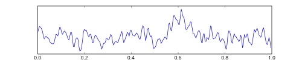

# ESTADO DE MAL EPILÉPTICO: ALGORITMO E MANEJO DA VIA AÉREA

O Estado de Mal Epiléptico (EME), ou *Status Epilepticus*, é a maior emergência da neurologia. Se você estiver no plantão e chegar um paciente em crise, o tempo é o seu maior inimigo. Cada segundo de atividade convulsiva contínua representa neurônios sendo perdidos por excitotoxicidade.

Antigamente, esperávamos 30 minutos para definir o EME. Hoje, essa visão mudou. Para fins práticos e de prova, utilizamos dois marcos temporais cruciais, conhecidos como T1 e T2. O T1 (5 minutos) é o momento em que a crise dificilmente parará sozinha e você deve iniciar o tratamento farmacológico. O T2 (30 minutos) é quando o dano neuronal permanente começa a ocorrer.

Portanto, a definição moderna é: uma crise tônico-clônica que dura mais de 5 minutos OU duas ou mais crises sem recuperação da consciência entre elas. Guarde isso: a falta de retorno ao nível de consciência basal é o que diferencia crises repetidas de um verdadeiro Estado de Mal Epiléptico.

*Figura 1 - Exemplo de traçado bruto de eletroencefalograma (EEG), exame fundamental para diagnóstico e monitorização do estado de mal epiléptico. Fonte: CC BY-SA 3.0 | Wikimedia Commons*

## Fisiopatologia: Por que a crise não para?

Para entender o tratamento, você precisa entender o que deu errado no cérebro. Normalmente, existe um equilíbrio entre o neurotransmissor excitatório (Glutamato) e o inibitório (GABA). No EME, ocorre uma falha nos mecanismos de término da crise.

Com o passar dos minutos, algo sinistro acontece na fenda sináptica: os receptores GABA-A (onde os benzodiazepínicos agem) sofrem internalização. Eles "se escondem" dentro do neurônio. Ao mesmo tempo, os receptores NMDA (excitatórios) são expressos em maior quantidade na membrana.

É por isso que, quanto mais tempo passa, menos o Diazepam funciona. Essa é a explicação fisiopatológica para a resistência aos fármacos e a urgência em seguir o algoritmo. Como dizemos no MedEvo, no EME, "tempo é cérebro".

## Epidemiologia e Fatores Precipitantes

O EME tem uma incidência bimodal, atingindo mais crianças e idosos. Em pacientes que já têm diagnóstico de epilepsia, a causa número um de descompensação, disparado em provas, é o tratamento irregular ou a suspensão abrupta da medicação.

No entanto, em pacientes sem histórico prévio, precisamos investigar causas agudas. As mais comuns incluem:

- Distúrbios metabólicos (Hipoglicemia, Hiponatremia, Hipocalcemia).

- Lesões estruturais agudas (AVC isquêmico ou hemorrágico, TCE).

- Infecções do SNC (Meningites, Encefalites).

- Intoxicações ou abstinência (Álcool, cocaína).

Cuidado com a pegadinha: a hipoglicemia pode mimetizar ou causar o EME. Por isso, o HGT (glicemia capilar) é obrigatório nos primeiros 2 minutos de atendimento.

## Quadro Clínico e Diagnóstico Diferencial

O EME pode ser convulsivo (com movimentos tônico-clônicos evidentes) ou não convulsivo. O estado de mal não convulsivo é traiçoeiro: o paciente está apenas comatoso ou confuso, e o diagnóstico só é feito via EEG.

No exame físico, procure por sinais de lateralização (que sugerem lesão estrutural) e sinais de trauma (como mordedura de língua ou fraturas decorrentes da queda).

### Tabela 1: Diagnóstico Diferencial do EME

| Condição | Características Diferenciais |
| --- | --- |
| Síncope Convulsiva | Breve duração, retorno rápido da consciência, sem período pós-ictal longo. |
| Crises Não Epilépticas Psicogênicas | Movimentos assíncronos, olhos fechados com resistência à abertura, sem acidose lática. |
| Rigidez de Decerebração | Postura fixa em resposta a estímulo doloroso, sem rítmica clônica. |
| Mioclonias Pós-Anóxicas | Ocorrem após parada cardiorrespiratória, prognóstico reservado. |

## O Algoritmo de Tratamento: Passo a Passo

O manejo do EME é dividido em fases baseadas no tempo. Se você decorar o tempo, você acerta a questão.

### Fase de Estabilização (0 a 5 minutos)

Aqui o foco é o ABC (Airway, Breathing, Circulation).

- Proteja a via aérea (aspiração, cânula de Guedel se necessário).

- Ofereça O2 suplementar.

- Obtenha acesso venoso periférico (dois acessos calibrosos).

- Colha exames: Glicemia, eletrólitos (Sódio, Cálcio, Magnésio), função renal, hemograma e dosagem de anticonvulsivantes (se o paciente já for epiléptico).

Dica do Dr. Will: Se a glicemia estiver baixa (< 60 mg/dL), administre 50 ml de Glicose 50% IV. Em etilistas ou desnutridos, dê Tiamina 100 mg IV antes da glicose para evitar a Encefalopatia de Wernicke.

*Figura 2 - Seringa de diazepam retal, uma das formas de administração de benzodiazepínico na primeira linha do tratamento do estado de mal epiléptico em ambiente pré-hospitalar. Fonte: Tatterfly, Domínio Público | Wikimedia Commons*

## Primeira Linha: Benzodiazepínicos (5 a 20 minutos)

O objetivo aqui é parar a crise imediatamente. A droga de escolha depende da via disponível.

- **Diazepam:** 10 mg IV. Pode ser repetido uma vez. É lipofílico, age rápido mas redistribui rápido (o efeito dura pouco no cérebro).

- **Lorazepam:** 4 mg IV (Muitas vezes citado como padrão-ouro em diretrizes internacionais por durar mais no SNC, mas menos disponível no Brasil).

- **Midazolam:** 10 mg IM. **Atenção aqui:** Se você não tem acesso venoso, a escolha é Midazolam IM. As bancas adoram essa situação de "acesso difícil".

### Segunda Linha: Drogas Antiepilépticas (20 a 40 minutos)

Se o benzodiazepínico falhou, ou se você quer prevenir a recorrência (o que é o padrão após abortar a crise), entramos com a segunda linha.

A **Fenitoína** é a rainha das provas. A dose de ataque é de 15 a 20 mg/kg.

- **Velocidade de infusão:** Máximo de 50 mg/min.

- **Por que não mais rápido?** Porque o diluente da fenitoína (propilenoglicol) é cardiotóxico. Pode causar hipotensão e arritmias (alargamento de QT).

- **Monitorização:** É obrigatório monitorar ECG e Pressão Arterial durante a infusão.

Outras opções de segunda linha incluem o Valproato de Sódio (20-40 mg/kg) e o Levetiracetam (20-60 mg/kg). O Valproato é excelente para crises mioclônicas ou quando não se quer sedar o paciente, mas deve ser evitado em gestantes e hepatopatas.

### Terceira Linha: Estado de Mal Refratário (40 a 60 minutos)

Se a crise persiste após um benzodiazepínico e uma droga de segunda linha em dose adequada, chamamos de EME Refratário.

Neste ponto, o paciente DEVE ser intubado e transferido para a UTI. As drogas utilizadas são anestésicos em infusão contínua:

- **Midazolam:** Ataque 0,2 mg/kg seguido de infusão.

- **Propofol:** 2-5 mg/kg ataque seguido de infusão. Cuidado com a Síndrome da Infusão do Propofol em altas doses.

- **Fenobarbital:** 20 mg/kg a 5-10 mg/min. É uma droga potente, mas causa muita depressão respiratória e hipotensão.

### Tabela 2: Resumo das Drogas de Primeira e Segunda Linha

| Droga | Dose de Ataque | Via | Observação Importante |
| --- | --- | --- | --- |
| Diazepam | 10 mg | IV | Pode repetir 1x; risco de depressão respiratória. |
| Midazolam | 10 mg | IM | Escolha se NÃO houver acesso venoso. |
| Fenitoína | 15-20 mg/kg | IV | Infusão máx 50 mg/min; monitorar ECG. |
| Valproato | 40 mg/kg | IV | Bom para crises focais/mioclônicas; evita sedação. |
| Levetiracetam | 60 mg/kg | IV | Poucas interações medicamentosas; seguro no idoso. |

## Manejo da Via Aérea no EME

Este é um ponto onde muitos alunos erram. Nem todo paciente em crise precisa ser intubado de imediato. No início (fase de estabilização), focamos em manter a via aérea pérvia e oxigenada.

**Quando intubar?**

- Insuficiência respiratória (hipóxia ou hipercapnia grave).

- Perda de reflexos protetores de via aérea com risco iminente de aspiração.

- Necessidade de iniciar anestésicos venosos (EME refratário).

- Hipertensão intracraniana suspeita.

**A Sequência Rápida de Intubação (SRI) no EME:**
O uso de bloqueadores neuromusculares (como a Succinilcolina ou o Rocurônio) é permitido e muitas vezes necessário para facilitar a laringoscopia. No entanto, há um perigo oculto: o bloqueador para o movimento muscular, mas NÃO para a atividade elétrica cerebral.

Se você paralisar o paciente e não administrar um anticonvulsivante/anestésico potente, ele continuará em estado de mal epiléptico "eletroclínico" (o cérebro fritando, mas o corpo parado). Por isso, após a intubação no EME, a monitorização com EEG contínuo é mandatória.

## Alterações Sistêmicas e Complicações

O EME prolongado causa uma tempestade metabólica. Nas provas, você verá questões sobre as alterações laboratoriais após uma crise tônico-clônica generalizada.

- **Acidose Lática:** Muito comum devido à atividade muscular intensa. Geralmente se resolve espontaneamente em 30-60 minutos após o término da crise. Não precisa repor bicarbonato!

- **Hipertermia:** O esforço muscular gera calor. Se persistente, pode agravar a lesão cerebral.

- **Rabdomiólise:** A contração vigorosa pode lesar o músculo, liberando mioglobina e causando insuficiência renal aguda.

- **Leucocitose:** Pode ocorrer uma leucocitose neutrofílica marginal (sem infecção), mas sempre investigue meningite se houver febre.

- **Hiperglicemia inicial:** Devido ao estresse catecolaminérgico, seguida às vezes de hipoglicemia tardia.

## Situações Especiais

### Pediatria e Vitamina B6

Em recém-nascidos ou lactentes com crises refratárias aos anticonvulsivantes comuns, você deve pensar em **Convulsão Dependente de Piridoxina (Vitamina B6)**. O tratamento é a administração de 100 mg de piridoxina IV. Se a crise parar, o diagnóstico está feito.

### Idosos

No idoso, a Fenitoína deve ser usada com cautela redobrada devido ao risco cardiovascular e à menor reserva funcional. O Levetiracetam tem ganhado espaço por ser mais seguro e ter menos interações com outras medicações que o idoso já utiliza.

### Gestantes

O manejo agudo do EME na gestante é igual ao de qualquer adulto. A prioridade é parar a crise para evitar a hipóxia fetal. O sulfato de magnésio é a droga de escolha para **Eclâmpsia**, mas se a paciente tem epilepsia conhecida e está em EME, seguimos o protocolo de benzodiazepínicos e fenitoína (apesar da teratogenicidade da fenitoína, no agudo, a vida da mãe e a oxigenação fetal prevalecem).

## Diagnóstico por Imagem e EEG

O EEG é fundamental, mas não deve atrasar o tratamento inicial. Ele é indispensável para:

- Confirmar EME não convulsivo.

- Monitorar a resposta ao tratamento no EME refratário (objetivo: surto-supressão ou ausência de crises eletrográficas).

A neuroimagem (Tomografia de Crânio) deve ser feita assim que o paciente estiver estabilizado para excluir causas estruturais agudas, como hemorragias.

### Tabela 3: Metas Terapêuticas no EME Refratário

| Parâmetro | Meta |
| --- | --- |
| Atividade no EEG | Ausência de crises eletrográficas ou padrão de surto-supressão. |
| Pressão Arterial | Manter PAM > 65 mmHg (pode precisar de vasopressores devido aos anestésicos). |
| Temperatura | Normotermia (< 37,5°C). |
| Glicemia | 140 - 180 mg/dL. |

## Erros Comuns e Pegadinhas de Prova

Um erro clássico é administrar Diazepam IM. O Diazepam tem absorção errática e lenta por essa via. Se não tem veia, use Midazolam IM. Outro erro é fazer a Fenitoína em soro glicosado. A Fenitoína precipita em contato com a glicose! Ela deve ser diluída apenas em Soro Fisiológico 0,9%.

Muitas questões trazem o Fentanil como opção de tratamento. Cuidado: o Fentanil é um opioide, não tem propriedades anticonvulsivantes e pode até reduzir o limiar convulsivo em algumas situações. Ele serve para analgesia na intubação, mas não para tratar o EME.

Lembre-se também da definição de **Estado de Mal Epiléptico Super-Refratário**: é aquele que continua ou recorre 24 horas ou mais após o início dos anestésicos venosos, incluindo casos onde a crise volta ao tentar reduzir a sedação.

## Conclusão do Manejo

O sucesso no tratamento do EME depende da agressividade inicial. Não "economize" na dose do benzodiazepínico e não demore para passar para a segunda linha. Se o paciente não acordou 20 minutos após o término das crises motoras, ele pode estar em Estado de Mal Não Convulsivo. Peça o EEG.

A monitorização cardiovascular é a sua segurança enquanto você "ataca" o cérebro com drogas potentes. Hipotensão é o efeito colateral mais comum de quase todas as drogas do algoritmo (exceto o Levetiracetam).

## Pontos-Chave para Prova

- **Definição Operacional (T1):** Crise única > 5 min ou crises repetidas sem retorno ao basal.

- **Definição de Dano Neuronal (T2):** > 30 min de atividade convulsiva.

- **Causa mais comum em epilépticos:** Abandono ou irregularidade do tratamento medicamentoso.

- **Primeira conduta (0-5 min):** ABC + Glicemia capilar (HGT).

- **Primeira linha (Acesso IV):** Diazepam 10 mg IV ou Lorazepam 4 mg IV.

- **Primeira linha (SEM acesso IV):** Midazolam 10 mg IM (pode ser bucal ou retal em crianças).

- **Segunda linha (Padrão):** Fenitoína 15-20 mg/kg IV.

- **Velocidade da Fenitoína:** Máximo 50 mg/min (risco de arritmia e hipotensão).

- **Diluição da Fenitoína:** Apenas em Soro Fisiológico (precipita em Glicose).

- **EME Refratário:** Falha após 1ª linha (BZD) + 2ª linha (Fenitoína/Valproato) em doses adequadas.

- **Conduta no EME Refratário:** Intubação orotraqueal + UTI + Anestésicos (Midazolam ou Propofol).

- **Alteração metabólica típica:** Acidose lática (não repor bicarbonato, resolve com o fim da crise).

- **Criança com EME refratário:** Considerar deficiência de Piridoxina (Vitamina B6).

- **O que NÃO fazer:** Diazepam IM (absorção ruim) ou usar Fentanil como anticonvulsivante.

- **Monitorização obrigatória na Fenitoína:** ECG e Pressão Arterial.

- **Estado de Mal Não Convulsivo:** Suspeitar se o paciente não recobrar a consciência após o fim das convulsões motoras. 🧠

 Cópia offline para consulta pessoal.
 Fonte original:
 [https://www.medevo.com.br/material-apoio/ler/8571a9c2-a320-43d4-93c8-feedd4174c2b](https://www.medevo.com.br/material-apoio/ler/8571a9c2-a320-43d4-93c8-feedd4174c2b)
