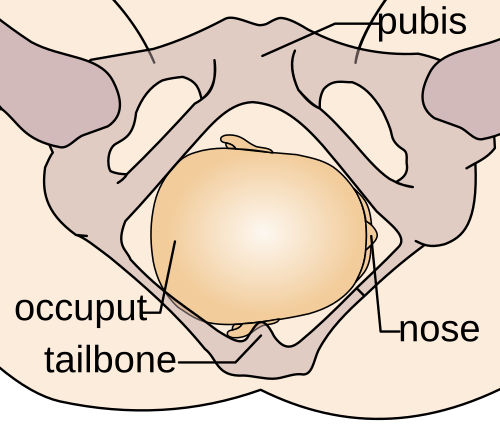
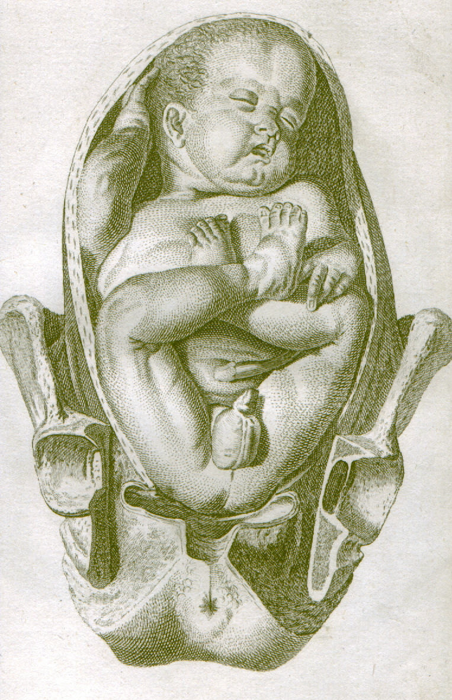

# ESTÁTICA FETAL

A estática fetal é o estudo das relações espaciais entre o feto, o útero e a pelve materna. O objetivo deste material é organizar os termos usados para descrever **como o feto está posicionado** antes e durante o trabalho de parto.

Este material não é o local principal para discutir mecanismo de parto, distocias, conduta da apresentação pélvica ou indicação de cesariana. Esses assuntos dependem de outros elementos obstétricos e devem ficar em materiais próprios. Aqui, o foco é reconhecer e nomear corretamente: **atitude, situação, apresentação, posição, variedade de posição e altura da apresentação**.

Mapa mental da estática fetal

1. Atitude → relação das partes fetais entre si
2. Situação → eixo fetal em relação ao eixo materno
3. Apresentação → polo fetal que ocupa o estreito superior
4. Posição → dorso fetal em relação ao lado materno
5. Variedade → ponto de referência fetal em relação à pelve materna
6. Altura → quanto a apresentação desceu na pelve

## Atitude Fetal

A atitude fetal descreve a relação das partes fetais entre si. A atitude fisiológica é de **flexão generalizada**: cabeça fletida sobre o tórax, membros superiores junto ao tronco e membros inferiores fletidos. Essa postura torna o feto mais compacto e favorece a passagem pelo canal de parto.

A alteração mais importante da atitude ocorre na cabeça. Conforme a cabeça perde a flexão, muda o diâmetro que se apresenta à pelve e podem surgir apresentações defletidas.

| Grau de flexão da cabeça | Apresentação cefálica | Ponto de referência | Diâmetro dominante |
| --- | --- | --- | --- |
| Flexão adequada | vértice/occipital | occipício | suboccipitobregmático, menor |
| Deflexão parcial leve | bregmática/sincipital | bregma | maior que o vértice |
| Deflexão parcial maior | fronte | glabela/fronte | mentovertical, maior |
| Deflexão completa | face | mento | submentobregmático |

Ponto central: quanto mais defletida a cabeça, menos favorável tende a ser a progressão, porque diâmetros maiores se apresentam ao canal de parto.

## Situação Fetal

Situação é a relação entre o maior eixo do feto e o maior eixo do útero materno.

- **Longitudinal:** eixo fetal paralelo ao eixo uterino. É a situação mais comum a termo e permite apresentação cefálica ou pélvica.

- **Transversa:** eixo fetal perpendicular ao eixo uterino. O ombro/córmico tende a ocupar a pelve.

- **Oblíqua:** eixo fetal em diagonal; geralmente é instável e pode evoluir para longitudinal ou transversa.

A situação fetal não deve ser confundida com apresentação. A situação responde “em que direção está o eixo fetal?”. A apresentação responde “qual parte do feto está no estreito superior?”.

## Apresentação Fetal

A apresentação fetal é a parte do feto que ocupa o estreito superior da pelve e tende a aparecer primeiro no canal de parto.

*Figura 1 - Apresentação cefálica: o polo cefálico ocupa o estreito superior. Fonte: Wikimedia Commons.*

As apresentações principais são:

- **Cefálica:** a cabeça está no estreito superior. É a mais comum e inclui vértice, bregma, fronte e face.

- **Pélvica:** as nádegas ou pés ocupam o estreito superior.

- **Córmica/acromial:** o ombro se apresenta, geralmente em situação transversa.

*Figura 2 - Apresentação pélvica: o polo pélvico ocupa o estreito superior. Fonte: Wikimedia Commons.*

### Apresentações cefálicas

Nas apresentações cefálicas, o ponto de referência muda conforme a atitude da cabeça. Esse é o detalhe que costuma gerar erro.

- **Vértice/occipital:** cabeça fletida; ponto de referência é o occipício.

- **Bregma/sincipital:** deflexão discreta; ponto de referência é o bregma.

- **Fronte:** deflexão intermediária; ponto de referência é a fronte/glabela.

- **Face:** deflexão completa; ponto de referência é o mento.

Flexão da cabeça → apresentação cefálica

Flexão completa → vértice/occipital → referência: occipício
Deflexão discreta → bregma/sincipital → referência: bregma
Deflexão intermediária → fronte → referência: fronte/glabela
Deflexão completa → face → referência: mento

## Posição Fetal

Posição é a relação do **dorso fetal** com o lado materno. Na prática, descreve se o dorso está voltado para a esquerda ou para a direita da mãe.

- **Primeira posição:** dorso fetal à esquerda materna.

- **Segunda posição:** dorso fetal à direita materna.

Esse conceito ajuda a interpretar ausculta fetal, palpação abdominal e achados das manobras de Leopold.

## Variedade de Posição

Variedade de posição é a relação entre o ponto de referência fetal e os pontos da pelve materna. Ela é mais específica que a posição.

Na apresentação cefálica fletida, o ponto de referência é o occipício. Assim, as variedades podem ser descritas como:

- **OEA:** occípito-esquerda-anterior.

- **OET:** occípito-esquerda-transversa.

- **OEP:** occípito-esquerda-posterior.

- **ODA:** occípito-direita-anterior.

- **ODT:** occípito-direita-transversa.

- **ODP:** occípito-direita-posterior.

Nas apresentações defletidas, o ponto de referência muda: mento na face, fronte/glabela na fronte e bregma na bregmática. Portanto, não se deve chamar toda apresentação cefálica de “occipital”; isso só vale para a cefálica fletida.

## Como Identificar no Toque Vaginal

O toque vaginal ajuda a reconhecer a apresentação pelo ponto anatômico palpável.

| Estrutura palpada | Interpretação provável | Ponto de referência |
| --- | --- | --- |
| Fontanela posterior triangular | vértice/occipital | occipício |
| Fontanela anterior ampla/losangular | bregmática ou deflexão parcial | bregma |
| Glabela, rebordos orbitários, raiz nasal | apresentação de fronte | fronte/glabela |
| Boca, nariz, mento | apresentação de face | mento |
| Sacro, nádegas, pés | apresentação pélvica | sacro |
| Acrômio/gradeado costal | apresentação córmica | acrômio |

O diagnóstico pelo toque deve ser integrado à palpação abdominal, ausculta fetal e evolução do trabalho de parto.

## Manobras de Leopold no Contexto da Estática

As manobras de Leopold são exame clínico abdominal para estimar situação, apresentação, posição e grau de descida. Elas não substituem o toque vaginal quando é necessário definir variedade de posição, mas ajudam a construir o raciocínio.

- **Primeira manobra:** identifica qual polo fetal ocupa o fundo uterino. Polo cefálico é duro, arredondado e mais móvel; polo pélvico é mais irregular e menos móvel.

- **Segunda manobra:** identifica o dorso fetal e pequenas partes, ajudando a determinar posição.

- **Terceira manobra:** avalia o polo fetal que ocupa a região suprapúbica, ajudando a reconhecer apresentação.

- **Quarta manobra:** avalia se a apresentação está insinuada e o grau de penetração na pelve.

## Altura da Apresentação: DeLee e Hodge

Altura da apresentação descreve o quanto o polo apresentante desceu na pelve.

### Planos de DeLee

A referência é o plano das espinhas isquiáticas, considerado **estação 0**.

- Acima das espinhas: estações negativas (-5 a -1).

- No nível das espinhas: estação 0.

- Abaixo das espinhas: estações positivas (+1 a +5).

Em obstetrícia prática, dizer que a apresentação está em 0 de DeLee significa que o maior diâmetro da apresentação atingiu o plano das espinhas isquiáticas.

### Planos de Hodge

Os planos de Hodge são planos anatômicos clássicos usados para descrever descida fetal.

- **I plano:** borda superior da sínfise púbica ao promontório sacral.

- **II plano:** borda inferior da sínfise púbica à segunda vértebra sacral.

- **III plano:** passa pelas espinhas isquiáticas.

- **IV plano:** passa pela ponta do cóccix.

O terceiro plano de Hodge corresponde aproximadamente ao plano 0 de DeLee, porque ambos usam a região das espinhas isquiáticas como marco clínico central.

## Insinuação

Insinuação é a passagem do maior diâmetro transverso da apresentação pelo estreito superior da pelve. Na apresentação cefálica, costuma-se considerar a passagem do diâmetro biparietal.

Clinicamente, a insinuação se relaciona à descida da apresentação e pode ser estimada pelo toque vaginal, por DeLee e pela palpação abdominal. Em primigestas, pode ocorrer antes do início do trabalho de parto; em multíparas, pode ocorrer apenas durante o trabalho de parto.

## Assinclitismo

Assinclitismo é a inclinação lateral da cabeça fetal em relação à pelve materna, fazendo com que uma sutura parietal fique mais próxima do promontório sacral ou da sínfise púbica.

- **Assinclitismo anterior:** a sutura sagital se aproxima do sacro, e o parietal anterior apresenta-se mais.

- **Assinclitismo posterior:** a sutura sagital se aproxima da sínfise púbica, e o parietal posterior apresenta-se mais.

Assinclitismos discretos podem ser fisiológicos durante a adaptação da cabeça à pelve. Assinclitismo persistente/importante pode dificultar a progressão.

## O Que Não é o Foco Deste Material

Alguns assuntos aparecem perto da estática fetal, mas pertencem a materiais próprios:

- **Mecanismo de parto:** sequência de movimentos cardinais, como insinuação, descida, flexão, rotação interna, desprendimento e rotação externa.

- **Conduta em apresentação pélvica:** depende de idade gestacional, peso fetal estimado, experiência da equipe, via de parto prévia e condições materno-fetais.

- **Distocias:** exigem avaliação dinâmica de contrações, pelve, progressão e bem-estar fetal.

A estática fetal fornece a linguagem anatômica para descrever o cenário; a conduta depende de outros módulos de obstetrícia.

## Resumo Integrado

| Termo | Pergunta que responde | Exemplo |
| --- | --- | --- |
| Atitude | Como as partes fetais se relacionam entre si? | cabeça fletida ou defletida |
| Situação | Qual a relação entre eixo fetal e eixo uterino? | longitudinal, transversa, oblíqua |
| Apresentação | Qual polo ocupa o estreito superior? | cefálica, pélvica, córmica |
| Posição | Para qual lado materno está o dorso? | primeira/esquerda, segunda/direita |
| Variedade | Onde está o ponto de referência fetal na pelve? | OEA, ODP, mento-anterior |
| Altura | Quanto a apresentação desceu? | DeLee -2, 0, +2 |

## Pontos-Chave

- Estática fetal é linguagem anatômica: descreve a relação feto-útero-pelve.

- Atitude não é apresentação: atitude é flexão/deflexão; apresentação é o polo que ocupa o estreito superior.

- Situação não é posição: situação compara eixos; posição localiza o dorso fetal.

- Na apresentação cefálica fletida, o ponto de referência é o occipício.

- Na face, o ponto de referência é o mento; na fronte, a fronte/glabela; na pélvica, o sacro.

- DeLee usa as espinhas isquiáticas como estação 0.

- O III plano de Hodge corresponde aproximadamente ao nível das espinhas isquiáticas.

- O material não deve ser usado para substituir estudo de mecanismo de parto ou condutas em apresentações anômalas.

 Cópia offline para consulta pessoal.
 Fonte original:
 [https://www.medevo.com.br/material-apoio/ler/2d4e2c25-bbd9-49d0-8cc1-86900fb78d07](https://www.medevo.com.br/material-apoio/ler/2d4e2c25-bbd9-49d0-8cc1-86900fb78d07)
