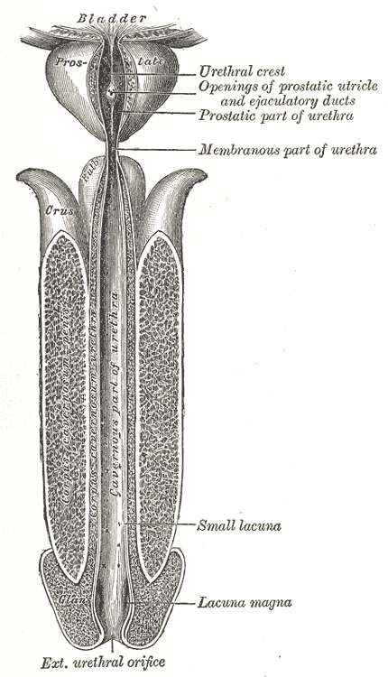
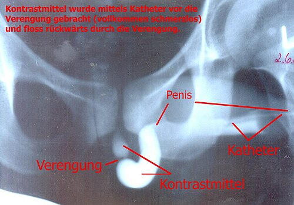

# ESTENOSE DE URETRA E FÍSTULAS URINÁRIAS

Para entender as patologias da uretra e as comunicações anormais do trato urinário, precisamos primeiro revisitar a anatomia. Se você não domina as fáscias e os compartimentos pélvicos, vai errar questões de trauma e de extravasamento urinário.

A uretra masculina é dividida em uretra anterior (peniana e bulbar) e uretra posterior (membranosa e prostática). Essa divisão não é apenas acadêmica; ela define a etiologia da estenose e a conduta no trauma. A uretra posterior está acima do diafragma urogenital, enquanto a anterior está abaixo.

*Figura 1 - Uretra masculina aberta em sua superfície anterior, demonstrando as porções prostática, membranosa, bulbar e peniana (Gray's Anatomy). Fonte: Henry Vandyke Carter, Domínio Público | Wikimedia Commons*

## Anatomia Fascial e Extravasamento Urinário

Muitos alunos confundem as camadas do pênis e do períneo. Vamos simplificar: o pênis tem a pele, abaixo dela a fáscia de Dartos (superficial) e, mais profundamente, envolvendo os corpos cavernosos e o corpo esponjoso, a fáscia de Buck (profunda).

Por que isso cai em prova? Porque o limite do extravasamento de urina depende de qual fáscia foi rompida.

- Se houver ruptura da uretra peniana com a **fáscia de Buck íntegra**, a urina fica contida no corpo do pênis.

- Se a **fáscia de Buck for rompida**, a urina ganha o espaço entre a fáscia de Buck e a fáscia de Dartos. Como a fáscia de Dartos é contínua com a fáscia de Scarpa (parede abdominal anterior) e com a fáscia de Colles (períneo), a urina se espalha para o escroto, períneo e abdome.

**Dica de Prova:** O extravasamento em "asa de borboleta" no períneo ocorre quando a fáscia de Buck é ultrapassada, mas a urina NÃO vai para as nádegas ou coxas, pois a fáscia de Colles se insere firmemente nos ramos isquiopúbicos e na fáscia lata.

## Estenose de Uretra: A Cicatriz que Obstrui

A estenose de uretra é, essencialmente, a substituição do epitélio uretral e do corpo esponjoso vascularizado por tecido fibrótico colágeno, processo chamado de **espongiofibrose**.

### Etiologia e Fisiopatologia

Por que a uretra estenosa? No mundo ocidental, a principal causa é a **iatrogenia** (cateterismo traumático, RTU de próstata, cirurgias endoscópicas). No entanto, o trauma (queda a cavaleiro) e as infecções (uretrites gonocócicas mal tratadas) continuam sendo causas frequentes em provas de residência.

O Líquen Escleroso (ou Balanite Xerótica Obliterante) é uma causa inflamatória importante que você deve guardar. Ele começa na glande e no prepúcio e pode "subir" pela uretra, causando estenoses extensas e complexas.

### Quadro Clínico e Diagnóstico

O paciente típico queixa-se de jato urinário fraco, esforço miccional, gotejamento terminal e, às vezes, infecções urinárias de repetição.

No exame físico, procure por áreas de endurecimento na uretra palpável e sinais de Líquen Escleroso no meato. Mas atenção: o diagnóstico definitivo e o planejamento cirúrgico dependem de exames de imagem.

- **Uretrocistografia Retrógrada e Miccional (UCRM):** É o padrão-ouro. A fase retrógada avalia bem a uretra anterior, enquanto a fase miccional mostra a uretra posterior e o colo vesical.

- **Uretroscopia:** Útil para ver a face distal da estenose e o aspecto da mucosa.

- **Urofluxometria:** Mostra um padrão de curva "achatada" ou em "platô", típica de obstrução infravesical fixa.

### Tratamento da Estenose

Aqui o examinador quer saber se você sabe indicar a técnica correta baseada na extensão da lesão.

- **Dilatação Uretral:** Procedimento paliativo. Não cura a espongiofibrose, apenas a estira temporariamente. Tem altas taxas de recorrência.

- **Uretrotomia Interna (OIU):** Corte endoscópico da estenose. **Indicação clássica:** Estenoses curtas (< 1,5 cm a 2 cm), únicas, na uretra bulbar, com mínima espongiofibrose. Se você tentar fazer isso em uma estenose de 4 cm, o Dr. Will diria que você está fadado ao insucesso, pois a taxa de recidiva beira os 100%.

- **Uretroplastia Termino-terminal:** Retira-se o segmento estenosado e faz-se a anastomose dos cotos saudáveis. Ideal para estenoses bulbares curtas (< 2 cm).

- **Uretroplastia com Enxerto (Mucosa Bucal):** Quando a estenose é longa (> 2 cm), não podemos simplesmente "puxar" os cotos, ou causaremos curvatura peniana e dor. Usamos a mucosa oral (geralmente da bochecha) para ampliar a luz uretral.

## Fístulas Urinárias: O Pesadelo Pós-Operatório

As fístulas urinárias são comunicações anormais entre o trato urinário e outros órgãos (vagina, reto, pele). Na prova de residência, 90% das questões focam na **Fístula Vesicovaginal (FVV)** e na **Fístula Ureterovaginal**.

### Fístula Vesicovaginal (FVV)

A causa mais comum no Brasil é a iatrogenia durante cirurgias ginecológicas pélvicas, especialmente a **histerectomia total abdominal**.

**O cenário clínico clássico:** Paciente submetida a uma histerectomia difícil (sangramento, aderências) que, após 7 a 14 dias da cirurgia, começa com perda urinária contínua pela vagina, mas mantém a micção espontânea (ou não, dependendo do tamanho da fístula).

*Figura 2 - Uretrografia retrógrada demonstrando estenose de uretra masculina, com estreitamento significativo do lúmen uretral. Fonte: STofffuchs, CC BY 3.0 | Wikimedia Commons*

## Diagnóstico Diferencial: Vesical vs. Ureteral

Este é o ponto onde a maioria dos alunos erra. Como saber se o furo está na bexiga ou no ureter?

| Teste / Característica | Fístula Vesicovaginal | Fístula Ureterovaginal |
| --- | --- | --- |
| **Teste do Azul de Metileno** | Positivo (o azul instilado na bexiga sai no absorvente vaginal) | Negativo (o azul fica na bexiga; a urina na vagina continua clara) |
| **Teste do Índigo Carmim (IV)** | Positivo (corante sai pela vagina) | Positivo (corante sai pela vagina) |
| **Urografia Excretora / TC** | Bexiga pode estar normal; extravasamento tardio | Hidronefrose e extravasamento de contraste no ureter distal |
| **Creatinina no líquido vaginal** | Elevada (confirma que o líquido é urina) | Elevada (confirma que o líquido é urina) |

**Exemplo Clínico:** Paciente pós-histerectomia com perda urinária vaginal. Você coloca azul de metileno na bexiga via sonda e o absorvente vaginal continua limpo. Qual o diagnóstico? **Fístula Ureterovaginal**. Por que? Porque o azul não chega ao ureter. Se você der Índigo Carmim endovenoso e o absorvente ficar azul, você confirma que a urina vem do rim, passando pelo ureter e saindo pela fístula.

### Tratamento das Fístulas

- **Pequenas e precoces:** Podem fechar com drenagem vesical prolongada (Sonda de Foley por 2-4 semanas).

- **Grandes ou tardias:** Cirurgia (fistuloplastia). O princípio é a interposição de tecidos saudáveis (como o retalho de Martius - gordura do grande lábio) entre a bexiga e a vagina.

## Uretrites e Úlceras Genitais (Abordagem Sindrômica)

As Infecções Sexualmente Transmissíveis (ISTs) são causas diretas de estenose de uretra a longo prazo. O Ministério da Saúde preconiza a **abordagem sindrômica**.

### Síndrome de Corrimento Uretral

Se o paciente chega com secreção purulenta e disúria:

- **Gonorreia (*Neisseria gonorrhoeae*):** Diplococos Gram-negativos intracelulares. Secreção profusa e purulenta.

- **Clamídia (*Chlamydia trachomatis*):** Secreção mais escassa, mucoide.

**Tratamento Empírico (Padrão MedEvo):** Você deve tratar as duas juntas, pois a coinfecção é altíssima.

- **Ceftriaxona 500 mg IM (dose única)** + **Azitromicina 1g VO (dose única)**.
*Nota: A diretriz atual aumentou a dose da Ceftriaxona devido à resistência.*

### Síndrome de Úlcera Genital

Aqui a banca vai descrever a lesão e você deve identificar o agente.

| Doença | Agente | Características da Úlcera | Linfonodo (Bubão) |
| --- | --- | --- | --- |
| **Sífilis Primária** | *Treponema pallidum* | Única, indolor, base limpa e endurecida (Cancro Duro) | Indolor, não fistuliza |
| **Cancro Mole** | *Haemophilus ducreyi* | Múltiplas (auto-inoculação), **muito dolorosas**, fundo sujo | Doloroso, fistuliza por orifício único |
| **Herpes Genital** | HSV-1 ou HSV-2 | Vesículas que rompem e formam úlceras rasas e dolorosas | Doloroso |
| **Donovanose** | *Klebsiella granulomatis* | Úlcera crônica, granulomatosa, bordas evertidas, "carne viva" | Raro (pseudobubão) |
| **Linfogranuloma** | *Chlamydia trachomatis* (L1-L3) | Pequena pápula fugaz (muitas vezes nem vista) | Bubão doloroso que fistuliza por múltiplos orifícios |

**Pérola de Prova:** Úlcera dolorosa + fundo sujo + múltiplas lesões = **Cancro Mole**. Tratamento: Azitromicina 1g VO dose única.

## Incontinência Urinária e Slings

A Incontinência Urinária de Esforço (IUE) ocorre por hipermobilidade do colo vesical ou por Deficiência Esfincteriana Intrínseca (DEI).

- **Hipermobilidade:** A uretra "desce" porque os músculos elevadores do ânus e a fáscia endopélvica estão frouxos.

- **DEI:** O esfíncter em si não fecha. Definida por uma Pressão de Perda sob Esforço (PPE) < 60 cmH2O no estudo urodinâmico.

### Tratamento Cirúrgico: O Sling

O **Sling Suburetral** (fita sintética de polipropileno) é o padrão-ouro. Ele cria um suporte para a uretra média, impedindo sua descida ao esforço.

- **TVT (Tension-free Vaginal Tape):** Via retropúbica. Mais risco de lesão vesical (exige cistoscopia intraoperatória).

- **TOT (Transobturador):** Via forame obturador. Menos risco de lesão vesical, mas pode causar dor na face interna da coxa.

**Cuidado:** A cirurgia de Burch (colpopexia retropúbica) era o padrão antigo, mas hoje o Sling tem taxas de cura comparáveis ou superiores com menor morbidade.

## Fimose e Parafimose

A **Fimose** é a incapacidade de retrair o prepúcio.

- **Fisiológica:** Presente ao nascimento, resolve-se em 90% dos meninos até os 3-5 anos. Não force a retração! Isso causa microfissuras e fimose cicatricial (patológica).

- **Patológica:** Presença de anel fibrótico. Causada por balanopostites de repetição ou Líquen Escleroso.

- **Indicações de Cirurgia (Postectomia):** Fimose patológica, infecções urinárias de repetição, balanopostites recorrentes ou obstrução urinária (prepúcio "balona" na micção).

A **Parafimose** é uma **emergência urológica**. Ocorre quando o prepúcio estreito é retraído e não retorna, garroteando a glande. O edema aumenta progressivamente, podendo levar à isquemia.
**Conduta:** Redução manual imediata. Se falhar, manobra de emergência (incisão dorsal do anel constritor).

## Sondas e Cateterismo

Muitas questões testam se você conhece o material que usa no dia a dia.

- **Sonda de Foley:** Possui balão. Serve para drenagem contínua (demora).

- **Sonda de Nelaton:** Não possui balão. Serve para alívio imediato (esvaziamento único) ou cateterismo intermitente limpo.

- **Cistostomia:** Indicada quando não conseguimos passar a sonda pela uretra (estenose total, trauma de uretra com "beijo de próstata", prostatite aguda grave). Geralmente é um procedimento temporário na emergência.

## Anomalias Congênitas e Síndromes Raras

### Síndrome de Zinner

Uma tríade clássica que as bancas adoram por ser puramente anatômica:

- Agenesia renal unilateral.

- Cisto de vesícula seminal ipsilateral.

- Obstrução do ducto ejaculatório.
*Por que isso acontece?* Porque o broto ureteral e o ducto mesonéfrico (Wolff) têm a mesma origem embriológica. Se um falha, o outro também falha.

### Megaureter

Definido como ureter com diâmetro > 7 mm.

- **Megaureter Primário Obstrutivo:** Falha na peristalse da junção ureterovesical. A maioria dos casos diagnosticados no pré-natal regride espontaneamente. A cirurgia (reimplante ureteral) só é feita se houver perda de função renal ou infecções febris.

## Lesões Ureterais Iatrogênicas

Durante uma cirurgia pélvica, o local mais comum de lesão do ureter é próximo aos vasos uterinos (o ureter passa "por baixo" da artéria uterina - "a água passa debaixo da ponte").

**Conduta na lesão ureteral distal:**
Se a lesão for próxima à bexiga (< 5-7 cm), a melhor conduta é o **Reimplante Ureteral (Ureterocistoneostomia)**. Tentar costurar o ureter no ureter (uretero-ureterostomia) em áreas muito baixas tem alto risco de estenose e fístula por falta de vascularização.

## Pontos-Chave para Prova

- **Estenose de Uretra Bulbar < 2cm:** Uretrotomia Interna ou Anastomose Término-terminal.

- **Estenose de Uretra > 2cm ou Peniana:** Uretroplastia com enxerto de mucosa bucal.

- **Padrão-ouro para diagnóstico de estenose:** Uretrocistografia Retrógrada e Miccional.

- **Fístula Vesicovaginal:** Causa mais comum é histerectomia. Teste do azul de metileno é positivo.

- **Fístula Ureterovaginal:** Teste do azul de metileno é negativo (urina na vagina fica clara).

- **Uretrite Gonocócica:** Ceftriaxona 500mg IM + Azitromicina 1g VO (tratar sempre Clamídia junto).

- **Cancro Mole (*H. ducreyi*):** Úlcera dolorosa, fundo sujo, Azitromicina 1g VO.

- **Sífilis Primária:** Úlcera única, indolor, base limpa, Penicilina Benzatina 2,4 milhões UI.

- **Parafimose:** Emergência! Redução manual imediata para evitar necrose da glande.

- **Sling Suburetral:** Tratamento padrão-ouro para Incontinência Urinária de Esforço.

- **Extravasamento em Asa de Borboleta:** Ruptura de uretra bulbar com lesão da fáscia de Buck.

- **Síndrome de Zinner:** Agenesia renal + Cisto de vesícula seminal + Obstrução de ducto ejaculatório.

- **Lesão de Ureter Distal:** Conduta de escolha é o Reimplante Ureteral (Ureterocistoneostomia).

- **Fimose Fisiológica:** Conduta expectante até os 3-5 anos; não forçar retração.

- **Líquen Escleroso:** Causa importante de fimose patológica e estenose de uretra extensa; indicação de postectomia. 🏆

 Cópia offline para consulta pessoal.
 Fonte original:
 [https://www.medevo.com.br/material-apoio/ler/60c667e7-76d0-480e-87da-d7d9c3f3b84d](https://www.medevo.com.br/material-apoio/ler/60c667e7-76d0-480e-87da-d7d9c3f3b84d)
