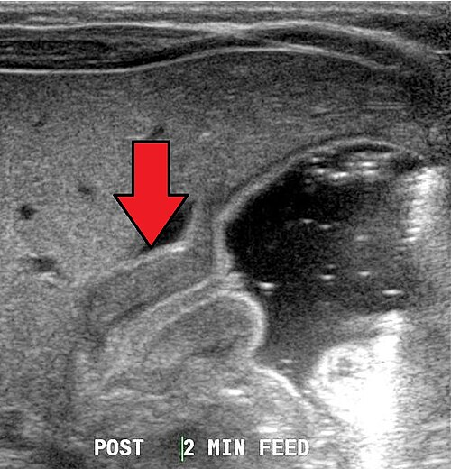
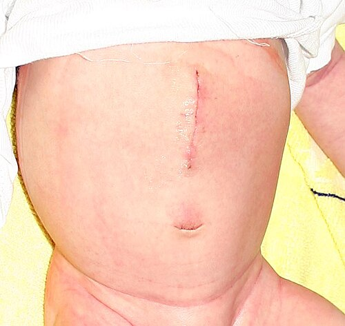

# ESTENOSE HIPERTRÓFICA DE PILORO

A Estenose Hipertrófica de Piloro (EHP) é aquele tema que todo estudante de medicina acha que sabe porque decorou a tríade clássica, mas é exatamente onde as bancas de residência adoram "pegar" o candidato desatento. Não basta saber que o bebê vomita; você precisa entender por que o rim dele começa a excretar ácido em um cenário de alcalose.

Vamos construir esse raciocínio juntos. Imagine que você está no pronto-socorro infantil e chega um lactente de 1 mês. A mãe está desesperada porque ele "vomita tudo o que come". Se você pensar apenas em refluxo, pode estar perdendo a chance de tratar uma das patologias cirúrgicas mais emblemáticas da pediatria.

## Definição e a Natureza da Doença

A primeira coisa que você precisa anotar mentalmente: a EHP **não é uma malformação congênita** no sentido estrito. O bebê não nasce com o piloro fechado. Ele nasce com um piloro funcional que, por motivos ainda não totalmente esclarecidos, sofre uma hipertrofia e hiperplasia da musculatura lisa (principalmente a camada circular).

Essa massa muscular cresce tanto que o canal pilórico se estreita e se alonga, criando uma obstrução mecânica à saída do estômago. Como o Dr. Will sempre enfatiza em nossas discussões clínicas na MedEvo, entender que a doença é **adquirida e progressiva** explica por que os sintomas não aparecem no primeiro dia de vida, mas sim entre a 3ª e a 6ª semana.

## Epidemiologia: Quem é o Paciente da Prova?

As bancas adoram o "perfil clássico". Se a questão descreve um lactente, preste atenção nestes fatores de risco:

- **Sexo:** Muito mais comum em meninos (proporção de 4:1 ou 5:1).

- **Primogênitos:** Existe uma incidência maior em filhos mais velhos.

- **Uso de Macrolídeos:** Esta é uma "pérola" de prova recorrente. O uso de eritromicina ou azitromicina (seja pela mãe no final da gestação/amamentação ou pelo próprio lactente para profilaxia de coqueluche) está fortemente associado ao desenvolvimento de EHP.

- **História Familiar:** Se o pai teve EHP, o risco para o filho é aumentado.

## Fisiopatologia: O "Porquê" dos Sintomas

Para entender a EHP, você deve visualizar o estômago como uma bomba tentando vencer um muro. O piloro hipertrofiado é o muro.

- O estômago tenta empurrar o leite.

- A resistência é alta, então o estômago faz ondas peristálticas vigorosas (que podem ser vistas no exame físico).

- O leite não passa e volta com força total. Daí o termo **vômito em jato**.

- Como a obstrução é **acima** da ampulla de Vater (onde desemboca a bile), o vômito é obrigatoriamente **não-bilioso**.

### O Distúrbio Hidroeletrolítico (O Coração da Prova)

Se você entender isso, você acerta 50% das questões sobre o tema. Quando o bebê vomita o conteúdo gástrico, ele perde:

- Água (Desidratação).

- Íons Hidrogênio (H+).

- Cloro (Cl-).

A perda de H+ gera uma **Alcalose Metabólica**. A perda de Cloro gera uma **Hipocloremia**.

Agora, preste atenção no rim desse bebê. O corpo percebe a desidratação e ativa o sistema renina-angiotensina-aldosterona para reabsorver sódio e água. No túbulo distal, para reabsorver Sódio (Na+), o rim precisa excretar algo positivo em troca: ou Potássio (K+) ou Hidrogênio (H+).

Inicialmente, o rim tenta poupar H+ e excreta K+. Isso leva à **Hipocalemia**.
Com o tempo, o estoque de Potássio acaba. O rim, desesperado para manter o volume circulante reabsorvendo Sódio, começa a excretar Hidrogênio, mesmo o sangue já estando alcalino.

O resultado é a famosa **Acidúria Paradoxal**. É paradoxal porque o sangue está básico (alcalose), mas a urina sai ácida. Se a questão de prova mencionar acidúria paradoxal, ela está te gritando que o caso é grave e de longa data.

## Quadro Clínico: O que você vai ver no consultório

O cenário típico é um lactente entre 2 e 8 semanas de vida (pico aos 21-30 dias) com:

- **Vômitos em jato:** Pós-prandiais imediatos, não-biliosos. O bebê vomita e, logo em seguida, quer mamar de novo. Ele é o "faminto chorão". Diferente do bebê com sepse ou outras doenças, ele não está letárgico inicialmente; ele está com fome.

- **Ondas de Kussmaul (Gástricas):** Ondas peristálticas visíveis no andar superior do abdome, movendo-se da esquerda para a direita, tentando vencer a obstrução.

- **Oliva Pilórica:** É o sinal patognomônico. Uma massa firme, móvel, de cerca de 1 a 2 cm, palpável no quadrante superior direito ou epigástrio.

**Dica de Professor:** Palpar a oliva não é fácil. O melhor momento é logo após o vômito, quando o estômago está vazio e a musculatura abdominal relaxada. Se a prova diz "massa em azeitona palpável", o diagnóstico está dado.

*Figura 1 - Ultrassonografia abdominal demonstrando estenose hipertrófica de piloro em lactente de 6 semanas, com espessamento da camada muscular pilórica. Fonte: Dr. Laughlin Dawes, CC BY-SA 4.0 | Wikimedia Commons*

## Diagnóstico: A Imagem que Confirma

Embora o diagnóstico possa ser clínico em mãos experientes, a **Ultrassonografia (USG) de abdome** é o padrão-ouro atual devido à sua alta sensibilidade e especificidade, sem radiação.

Você precisa memorizar os critérios diagnósticos da USG, pois as bancas colocam os números para você interpretar:

| Parâmetro | Valor de Referência (EHP) |
| --- | --- |
| Espessura do músculo pilórico | ≥ 3 mm (ou > 4 mm em alguns serviços) |
| Comprimento do canal pilórico | ≥ 14 mm |
| Diâmetro total do piloro | > 10 - 12 mm |

Se a USG for inconclusiva (o que é raro), pode-se realizar um **REED (Radiografia de Esôfago, Estômago e Duodeno)** com contraste. Os sinais clássicos no REED são:

- **Sinal do Cordão (String Sign):** O contraste passando por um canal pilórico muito fino.

- **Sinal do Trilho de Trem:** Duas linhas finas de contraste.

- **Sinal do Bico:** O contraste parando na entrada do piloro.

**Cuidado:** Nunca peça REED como primeiro exame. O contraste aumenta o risco de aspiração em um bebê que já está vomitando em jato.

## Diagnóstico Diferencial: Não confunda!

Muitos alunos erram questões por não considerarem os diferenciais. O Dr. Will sempre lembra: "Nem tudo que vomita em jato é piloro".

- **Refluxo Gastroesofágico (RGE):** O vômito costuma ser mais "regurgitação", não é em jato, e geralmente começa mais cedo ou mais tarde, sem a alcalose metabólica grave.

- **Estenose/Atresia Duodenal:** O vômito é **BILIOSO** (pois a obstrução é distal à ampulla de Vater). No RX, vemos o sinal da "dupla bolha".

- **Hiperplasia Adrenal Congênita (HAC):** Esta é a pegadinha favorita. A HAC (forma perdedora de sal) causa vômitos e desidratação. Porém, na HAC você terá **Acidose Metabólica** e **Hipercalemia** (o oposto da EHP). Se o potássio estiver alto, pense em adrenal; se estiver baixo, pense em piloro.

- **Má-rotação Intestinal com Vôlvulo:** Urgência cirúrgica absoluta. Vômitos biliosos e dor abdominal súbita.

*Figura 2 - Cicatriz de piloromiotomia de Fredet-Ramstedt 30 horas após a cirurgia em lactente de 1 mês, o tratamento definitivo da estenose hipertrófica de piloro. Fonte: Sven Teschke, CC BY-SA 2.0 de | Wikimedia Commons*

## Tratamento: A Verdadeira Urgência

Aqui está o erro que reprova em prova de residência: achar que a EHP é uma urgência cirúrgica imediata. **NÃO É.**

A EHP é uma **urgência médica (clínica)**. Operar um bebê com alcalose metabólica e distúrbios eletrolíticos graves é um convite à apneia pós-operatória e complicações anestésicas. O pH alcalino atravessa a barreira hematoencefálica e deprime o centro respiratório.

### Passo 1: Estabilização Clínica

- **Jejum e Sonda Nasogástrica (SNG):** Para descompressão gástrica.

- **Reposição Volêmica:** Soro Fisiológico 0,9% para expansão se houver choque/desidratação grave.

- **Correção da Alcalose e Eletrólitos:** Após a expansão inicial, usa-se Soro Glicosado com NaCl e KCl. O objetivo é normalizar o Cloro (> 100 mEq/L) e o Bicarbonato (< 28-30 mEq/L) e garantir diurese adequada.

### Passo 2: Tratamento Cirúrgico

Uma vez estabilizado (geralmente após 24-48h de hidratação), o tratamento é a **Piloromiotomia de Fredet-Ramstedt**.

- **A técnica:** Consiste na incisão longitudinal da musculatura do piloro (seromiotomia), preservando a mucosa íntegra. Você "abre" o músculo para que a mucosa se hernie e o canal se abra.

- **Classificação da Cirurgia:** É considerada uma **cirurgia limpa**, pois não há abertura de víscera oca (se a técnica for correta e a mucosa não for perfurada). Isso cai muito em questões de infectologia e cirurgia geral.

### Passo 3: Pós-operatório

A dieta costuma ser reiniciada precocemente (6-12 horas após a cirurgia). É normal o bebê ainda ter alguns episódios de vômito/regurgitação nas primeiras 24-48 horas devido à gastrite e edema local, mas isso se resolve rapidamente.

## Tabela Comparativa: EHP vs. Hiperplasia Adrenal Congênita (HAC)

Esta tabela salva vidas em provas de pediatria:

| Característica | Estenose Hipertrófica de Piloro | Hiperplasia Adrenal Congênita |
| --- | --- | --- |
| **Tipo de Vômito** | Não-bilioso, em jato | Não-bilioso, frequente |
| **Estado Ácido-Básico** | Alcalose Metabólica | Acidose Metabólica |
| **Potássio (K+)** | Hipocalemia (Baixo) | Hipercalemia (Alto) |
| **Sódio (Na+)** | Hiponatremia (por diluição/perda) | Hiponatremia (grave, perda renal) |
| **Cloro (Cl-)** | Hipocloremia (Muito baixo) | Normal ou baixo |
| **Exame Físico** | Oliva pilórica palpável | Genitália ambígua (em meninas) |

## Situações Especiais e Complicações

### Perfuração da Mucosa

Durante a cirurgia, o cirurgião pode acidentalmente perfurar a mucosa duodenal ou gástrica. Se isso for reconhecido na hora, basta suturar a mucosa e cobrir com omento. A cirurgia, que era "limpa", passa a ser **limpa-contaminada**. Se não for reconhecida, o bebê evoluirá com peritonite no pós-operatório.

### Vômitos Persistentes

Se o bebê continuar vomitando em jato após 48-72 horas de cirurgia, devemos suspeitar de **miotomia incompleta**. O diagnóstico é difícil por USG (pois o edema pós-op confunde), sendo o REED mais útil aqui para ver se o contraste ainda está retido.

*Figura 1 - Ultrassonografia abdominal demonstrando estenose hipertrófica de piloro em lactente de 6 semanas, com espessamento da camada muscular pilórica. Fonte: Dr. Laughlin Dawes, CC BY-SA 4.0 | Wikimedia Commons*

## Diagnóstico Diferencial de Vômitos no Lactente

| Patologia | Idade Típica | Característica do Vômito | Achado Chave |
| --- | --- | --- | --- |
| **EHP** | 3-6 semanas | Não-bilioso, jato | Alcalose hipoclorêmica |
| **Atresia Duodenal** | 1º dia de vida | Bilioso (maioria) | Sinal da dupla bolha |
| **Refluxo (DRGE)** | Variável | Regurgitação | Ganho de peso limítrofe |
| **Vôlvulo** | Qualquer idade | Bilioso, súbito | Abdome agudo obstrutivo |

## Pontos-Chave para Prova 💡

- **Definição:** Hipertrofia da musculatura circular do piloro; doença adquirida, não congênita.

- **Epidemiologia:** Meninos, primogênitos, 3-6 semanas de vida, associado a macrolídeos.

- **Clínica Clássica:** Vômitos não-biliosos em jato + lactente faminto + ondas peristálticas visíveis.

- **Sinal Patognomônico:** Oliva pilórica (massa em azeitona) palpável no epigástrio/hipocôndrio direito.

- **Distúrbio Eletrolítico:** Alcalose metabólica hipoclorêmica e hipocalêmica.

- **Acidúria Paradoxal:** Achado de gravidade; o rim excreta H+ para tentar reabsorver Na+ e manter volume.

- **Padrão-Ouro Diagnóstico:** Ultrassonografia (Espessura do músculo ≥ 3mm; Comprimento do canal ≥ 14mm).

- **Diagnóstico Diferencial Crítico:** Hiperplasia Adrenal Congênita (HAC tem acidose e potássio alto; EHP tem alcalose e potássio baixo).

- **Prioridade de Tratamento:** Estabilização hidroeletrolítica ANTES da cirurgia. A cirurgia nunca é a primeira conduta se houver distúrbio metabólico.

- **Técnica Cirúrgica:** Piloromiotomia extramucosa de Fredet-Ramstedt.

- **Classificação Cirúrgica:** Cirurgia limpa (não abre a mucosa).

- **Manejo Pré-operatório:** Jejum, SNG e hidratação venosa com reposição de Cloro e Potássio.

- **O que NÃO fazer:** Não levar o paciente para a mesa de cirurgia com Bicarbonato > 30 ou Cloro < 90. O risco de apneia central é altíssimo.

- **Pegadinha de Prova:** A alternativa dirá que o tratamento é "Piloroplastia". Errado! O correto é "Piloromiotomia". Na miotomia você apenas corta o músculo; na plastia você reconstrói o canal, o que não é necessário aqui.

- **Lembrete MedEvo:** Se a questão mostrar um bebê com vômitos biliosos, risque Estenose de Piloro das suas opções imediatamente. Piloro é sempre não-bilioso.

Ao revisar este material, foque na compreensão da fisiopatologia renal. Se você entender por que o cloro cai e o bicarbonato sobe, você nunca mais precisará decorar as condutas, elas se tornarão óbvias. A Estenose Hipertrófica de Piloro é a prova de que, na cirurgia pediátrica, o preparo clínico é tão ou mais importante que o ato operatório em si.

 Cópia offline para consulta pessoal.
 Fonte original:
 [https://www.medevo.com.br/material-apoio/ler/9044bc7c-b5e2-4ae1-858c-1eac97cb0e4b](https://www.medevo.com.br/material-apoio/ler/9044bc7c-b5e2-4ae1-858c-1eac97cb0e4b)
