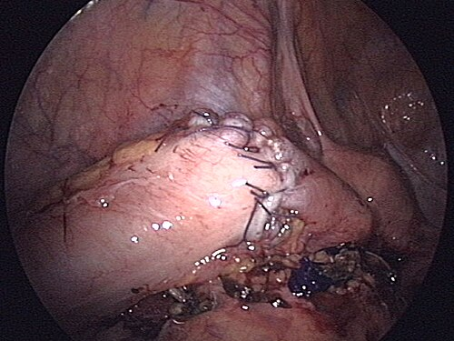
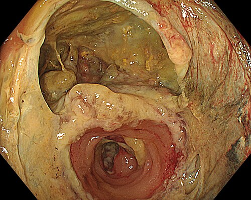

# ESTENOSES E COMPLICAÇÕES ANASTOMÓTICAS

Para entender as complicações anastomóticas, você precisa primeiro tirar da cabeça a ideia de que uma anastomose é apenas "dar pontos" em dois pedaços de tripa. Se fosse assim, qualquer alfaiate seria cirurgião. Uma anastomose é um evento biológico complexo. Quando ela falha, não é apenas o fio que arrebentou; é a biologia que não suportou o insulto.

Nas provas de residência e no dia a dia do MedEvo, o que mais se cobra não é a técnica do ponto em si, mas o julgamento clínico: por que essa anastomose abriu? O que eu faço agora? Posso tratar sem operar de novo? Vamos dissecar esses conceitos.

*Figura 1 - Anastomose intestinal manual durante cirurgia laparoscópica de ressecção do sigmoide, demonstrando a técnica de sutura com afrontamento das bordas. Fonte: Anpol42, CC BY-SA 4.0 | Wikimedia Commons*

## O Alicerce: Anatomia Vascular e a "Trindade da Anastomose"

Para que qualquer união intestinal cicatrize, precisamos respeitar três pilares. Se você esquecer um deles, a chance de deiscência (abertura da sutura) beira os 100%.

- **Ausência de Tensão:** O intestino deve chegar ao outro lado "folgado". Se houver tração, os vasos sanguíneos se estiram, o lúmen fecha e a isquemia acontece.

- **Suprimento Sanguíneo Adequado:** Sem sangue, não há oxigênio para os fibroblastos produzirem colágeno.

- **Técnica Refinada:** Bordas bem afrontadas, sem excesso de cautério e sem eversão da mucosa.

### A Vascularização que a Banca Adora

Você precisa dominar a irrigação do cólon como domina o caminho de casa. As bancas amam trocar os ramos das artérias mesentéricas.

- **Artéria Mesentérica Superior (AMS):** Irriga desde o duodeno distal até os 2/3 proximais do cólon transverso. Seus ramos principais para o cólon são a Ileocólica, a Cólica Direita (que irriga o ascendente) e a Cólica Média.

- **Artéria Mesentérica Inferior (AMI):** Irriga o 1/3 distal do transverso, o cólon esquerdo (descendente), o sigmoide e a parte superior do reto. Seus ramos são a Cólica Esquerda, as Sigmoidianas e a Retal Superior.

**O Ponto de Griffith:** É a zona de "baixa pressão" no ângulo esplênico, onde a arcada marginal (de Riolan) pode ser tênue. É um local clássico de isquemia.
**O Ponto de Sudeck:** Localizado na transição retossigmoidea. Cuidado aqui: a vascularização depende da comunicação entre a última sigmoideana e a retal superior.

No reto, a história muda. Ele tem suprimento triplo:

- **Retal Superior:** Ramo terminal da AMI.

- **Retal Média:** Ramo da Ilíaca Interna (Hipogástrica).

- **Retal Inferior:** Ramo da Pudenda Interna.

**Dica de Ouro:** Não existem "artérias retais laterais". Se aparecer isso na alternativa, pode riscar. Outro ponto: a Artéria Sacral Média nasce direto da aorta, na sua bifurcação. Em cirurgias de reto, sua lesão causa um sangramento em "chafariz" difícil de controlar.

## Fisiopatologia da Cicatrização: O Perigo do 5º ao 7º Dia

Por que a maioria das fístulas anastomóticas manifesta-se entre o 5º e o 7º dia pós-operatório (PO)? A resposta está na bioquímica.

Logo após a sutura, ocorre uma fase inflamatória intensa. O organismo libera colagenases para limpar o tecido desvitalizado. Entre o 5º e 7º dia, a degradação do colágeno antigo está no auge, mas a síntese do colágeno novo (tipo I e III) ainda não é forte o suficiente para garantir a integridade mecânica. É o "vale da fraqueza". Se o paciente tiver hipoalbuminemia ou estiver infectado, esse desequilíbrio é ainda pior.

**Erro Comum:** Achar que se o paciente está bem no 3º PO, ele está livre de fístula. Pelo contrário, o Dr. Will sempre alerta: a vigilância deve ser redobrada justamente quando o paciente começa a querer comer e ir para casa.

*Figura 2 - Imagem endoscópica demonstrando deiscência anastomótica (leak), a complicação mais temida das anastomoses intestinais. Fonte: Federica Viazzi, CC BY-SA 4.0 | Wikimedia Commons*

## Deiscência e Fístula Anastomótica

A deiscência é a separação das bordas da anastomose. A fístula é a consequência: a comunicação do lúmen intestinal com outra cavidade ou com a pele.

### Fatores de Risco

- **Locais:** Tensão, isquemia, infecção local (abscesso), hematoma. Anastomoses distais (abaixo de 6 cm da margem anal) têm risco muito maior que as colocolônicas.

- **Sistêmicos:** Tabagismo (vasoconstrição), uso de corticoides (inibem fibroblastos), desnutrição (albumina < 3,0 g/dL), anemia grave e diabetes descompensado.

### Quadro Clínico: O "Feeling" do Cirurgião

O sinal mais precoce e sensível de uma complicação anastomótica não é a febre, nem a dor abdominal. É a **taquicardia inexplicada**.

Se o seu paciente estava evoluindo bem e, de repente, mantém uma frequência cardíaca de 110-120 bpm, sem outra causa óbvia (como dor ou desidratação), suspeite de deiscência. Outros sinais incluem:

- Febre persistente ou nova.

- Distensão abdominal e parada de eliminação de gases/fezes (íleo paralítico prolongado).

- Saída de secreção entérica ou "escura/fétida" pelo dreno (se houver).

- Tenesmo e dor pélvica (comum em fístulas de reto baixo).

### Diagnóstico

Se o paciente está instável (choque, peritonite difusa), não perca tempo com exames: a conduta é **Laparotomia Exploradora**.

Se o paciente está estável, o padrão-ouro é a **Tomografia de Abdome e Pelve com contraste triplo** (oral, venoso e retal). O contraste retal é fundamental para ver o extravasamento na anastomose colorretal.

- **Achados na TC:** Gás extraluminal, coleções perianastomóticas, extravasamento de contraste.

| Classificação de Débito da Fístula | Volume (24h) | Conduta Inicial |
| --- | --- | --- |
| Baixo Débito | < 500 mL | Geralmente Conservador |
| Alto Débito | > 500 mL | Suporte agressivo / Risco cirúrgico maior |

### Manejo: Operar ou não operar?

Aqui é onde a banca tenta te pegar. Nem toda fístula precisa de reoperação imediata.

- **Paciente com Peritonite ou Instabilidade:** Reoperação urgente. O objetivo é controle da fonte. Geralmente, desfaz-se a anastomose e faz-se um estoma (ex: Cirurgia de Hartmann).

- **Paciente Estável, sem Peritonite, com Fístula Caudal/Drenada:** Manejo conservador. Jejum, Nutrição Parenteral Total (NPT) ou Enteral distal à fístula, antibioticoterapia de amplo espectro e observação.

- **Abscesso Localizado (> 4 cm):** Drenagem percutânea guiada por imagem + Antibióticos. É a melhor forma de evitar uma reoperação difícil em um abdome inflamado.

**Atenção:** Se a fístula for "labiada" (a mucosa do intestino está em contato direto com a pele), ela NÃO vai fechar sozinha. A conduta é cirúrgica.

## Estenoses Anastomóticas

A estenose é o estreitamento do lúmen na linha de sutura que impede a passagem normal das fezes.

### Por que acontece?

A causa principal é a isquemia subclínica. Houve sangue suficiente para não abrir (fístula), mas não o suficiente para cicatrizar de forma saudável, gerando fibrose excessiva. Outras causas incluem:

- Deiscência prévia que cicatrizou por segunda intenção.

- Uso de grampeadores de diâmetro muito pequeno (ex: 25mm em reto).

- Radioterapia prévia (neoadjuvância).

- Recidiva tumoral (sempre deve ser descartada!).

### Quadro Clínico e Diagnóstico

O paciente queixa-se de constipação progressiva, fezes em "fita", esforço evacuatório e distensão.
O diagnóstico é feito por **Toque Retal** (se a anastomose for baixa), **Colonoscopia** ou **Enema Opaco**. Na colonoscopia, a estenose é definida quando não conseguimos progredir o aparelho (cerca de 10-12 mm de diâmetro).

### Tratamento

- **Dilatação Endoscópica:** É a primeira escolha. Pode ser feita com balões pneumáticos ou velas de Hegar. Geralmente são necessárias várias sessões.

- **Stents Colônicos:** Usados principalmente como ponte para cirurgia em obstruções neoplásicas ou em casos paliativos.

- **Cirurgia:** Reservada para falha do tratamento endoscópico. Pode envolver a ressecção da área estenosada e nova anastomose (altíssimo risco) ou estomas definitivos.

## Complicações Específicas em Coloproctologia

### Cirurgia de Duhamel-Haddad

Muito cobrada em provas sobre megacólon chagásico. Consiste na ressecção do sigmoide, fechamento do coto retal (Hartmann) e abaixamento do cólon sadio por trás do reto, via espaço retro-retal.

- **Complicação clássica:** Formação de um septo entre o reto e o cólon abaixado, que pode levar ao acúmulo de fezes (fecaloma no coto retal). O tratamento é o esmagamento desse septo com grampeador.

### Doença Diverticular e a Classificação de Hinchey

Você precisa saber isso de cor para decidir a conduta nas complicações.

| Hinchey | Descrição | Conduta |
| --- | --- | --- |
| I | Abscesso pericólico pequeno | ATB + Dieta |
| II | Abscesso pélvico ou à distância | ATB + Drenagem Percutânea (se > 4cm) |
| III | Peritonite Purulenta | Cirurgia (Laparoscopia ou Hartmann) |
| IV | Peritonite Fecal | Cirurgia de Hartmann (Urgência) |

**Pérola de Prova:** Na diverticulite aguda Hinchey IV com instabilidade, a anastomose primária é contraindicada. O padrão é a Cirurgia de Hartmann (ressecção do sigmoide + colostomia terminal + fechamento do coto retal).

### Retocolite Ulcerativa (RCU) e Megacólon Tóxico

O megacólon tóxico é uma complicação temida da RCU. Se o paciente não melhora com tratamento clínico otimizado (corticoides/infliximabe) em 48-72 horas, ou se houver sinais de perfuração, a conduta é **Colectomia Total com Ileostomia terminal**. O reto é deixado para ser tratado em um segundo tempo.

## Prevenção de Complicações: O que as diretrizes dizem?

Segundo as recomendações da Sociedade Brasileira de Coloproctologia (SBCP) e os protocolos ERAS (Enhanced Recovery After Surgery):

- **Preparo de Cólon:** O preparo mecânico isolado está em desuso. A recomendação atual é **Preparo Mecânico + Antibióticos Orais** (como Neomicina e Metronidazol) na véspera da cirurgia, associado à antibioticoprofilaxia venosa na indução.

- **Antibioticoprofilaxia:** Cefazolina + Metronidazol é o esquema clássico. Deve ser administrado 30-60 min antes da incisão e repetido se a cirurgia durar mais de 3-4 horas ou houver perda volêmica importante.

- **Estomas de Proteção:** Em anastomoses colorretais muito baixas (reto inferior), a realização de uma ileostomia em alça "protetora" não evita a fístula, mas **mitiga as consequências sistêmicas** dela, transformando uma peritonite fecal em uma fístula controlada.

### O Papel da Nutrição

A hipoalbuminemia (< 3,0 g/dL) é um dos preditores mais fortes de deiscência. Se o paciente tem perda ponderal > 10% em 6 meses ou albumina baixa, as diretrizes recomendam suporte nutricional pré-operatório por 7 a 14 dias, mesmo que isso atrase a cirurgia do câncer.

## Diagnóstico Diferencial de Complicações Pós-Operatórias

Nem tudo que dói no 5º PO é fístula.

- **Infecção de Sítio Cirúrgico (ISC):** Geralmente entre o 5º e 10º dia. Eritema, calor e secreção purulenta na ferida.

- **Atelectasia Pulmonar:** Causa mais comum de febre nas primeiras 24-48h.

- **Trombose Venosa Profunda (TVP):** Suspeitar se houver edema assimétrico de membros inferiores. Lembre-se: cirurgia colorretal é de alto risco para TVP; a profilaxia farmacológica é mandatória.

- **Fasceíte Necrosante (Síndrome de Fournier):** Complicação gravíssima de cirurgias anorretais. Dor desproporcional ao exame físico, crepitação e toxemia. Exige debridamento cirúrgico imediato.

## Situações Especiais e Pegadinhas

### O Paciente com Addison ou Uso Crônico de Corticoide

Pacientes que usam corticoide cronicamente podem ter supressão do eixo adrenal. No estresse cirúrgico, eles não conseguem aumentar o cortisol. Se o paciente apresentar hipotensão refratária a volume e drogas vasoativas no pós-operatório, pense em **Insuficiência Adrenal Aguda**. O tratamento é hidrocortisona venosa.

### Fístula Colovesical

A causa número 1 é a Diverticulite Aguda. O paciente chega com pneumatúria (sai ar no xixi) e fecalúria. O diagnóstico inicial pode ser feito por TC, mas a cistoscopia e o enema opaco ajudam na programação cirúrgica.

### Drenagem Percutânea

Esta é a "queridinha" das provas modernas. Se o enunciado descreve um paciente estável com um abscesso pélvico de 5 cm após uma sigmoidectomia, a resposta NÃO é operar. É drenagem percutânea guiada por TC ou USG. Isso salva o paciente de uma reoperação hostil.

| Complicação | Tempo Médio de Aparecimento | Conduta Principal |
| --- | --- | --- |
| Atelectasia | 24-48 horas | Fisioterapia Respiratória |
| Deiscência Anastomótica | 5-7 dias | TC + Avaliar estabilidade |
| Infecção de Ferida | 5-10 dias | Abertura de pontos + Limpeza |
| Estenose Anastomótica | Meses | Dilatação Endoscópica |

## Pontos-Chave para Prova

- **Vascularização do Reto:** Superior (AMI), Média (Ilíaca Interna), Inferior (Pudenda Interna). Memorize isso.

- **Taquicardia:** É o sinal mais precoce de fístula anastomótica. Não espere a febre ou a peritonite.

- **Colagenólise:** O pico ocorre entre o 5º e 7º dia PO. É a janela de maior risco para deiscências.

- **Fístula de Baixo Débito (< 500 mL/dia):** Manejo inicial é conservador (jejum, NPT, ATB) se o paciente estiver estável.

- **Fístula Labiada:** Não fecha sozinha. Indicação de cirurgia.

- **Abscesso > 4 cm:** Drenagem percutânea é a primeira escolha se o paciente estiver estável.

- **Hinchey III e IV:** Indicações clássicas de cirurgia de urgência. Hinchey IV (fecal) quase sempre termina em Hartmann.

- **Ponto de Griffith:** Ângulo esplênico. Zona de risco isquêmico.

- **Preparo de Cólon:** Atualmente, a recomendação é Preparo Mecânico + Antibiótico Oral + Antibiótico Venoso.

- **Albumina < 3,0 g/dL:** Fator de risco isolado fortíssimo para falha da anastomose.

- **Colonoscopia pós-diverticulite:** Deve ser feita 6 semanas após a resolução do quadro agudo para excluir neoplasia oculta.

- **Contraindicação Absoluta de Anastomose Primária:** Instabilidade hemodinâmica grave, peritonite fecal franca com má perfusão tecidual ou desnutrição extrema.

- **Stent Colônico:** Usado como "ponte para cirurgia" em obstruções neoplásicas à esquerda, permitindo transformar uma cirurgia de urgência em eletiva.

- **Fáscia de Waldeyer:** Conecta o reto ao sacro (S4). Importante na dissecção do mesorreto (TME).

- **O que NÃO fazer:** Não ignore uma taquicardia no 5º PO atribuindo-a apenas a "dor" ou "ansiedade" sem excluir fístula. 🩺

Ao revisar este material, foque no "porquê" das condutas. A cirurgia colorretal é uma dança entre a técnica do cirurgião e a biologia do paciente. Se a biologia falha (isquemia, desnutrição, infecção), a técnica mais perfeita do mundo não segurará a anastomose. No MedEvo, acreditamos que o bom cirurgião é aquele que sabe operar, mas o excelente é aquele que sabe quando não operar e como manejar as complicações com elegância.

 Cópia offline para consulta pessoal.
 Fonte original:
 [https://www.medevo.com.br/material-apoio/ler/1d14ecf5-6cf4-4bda-b366-9ad05e301047](https://www.medevo.com.br/material-apoio/ler/1d14ecf5-6cf4-4bda-b366-9ad05e301047)
