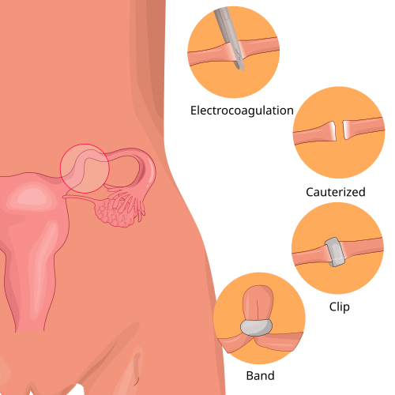
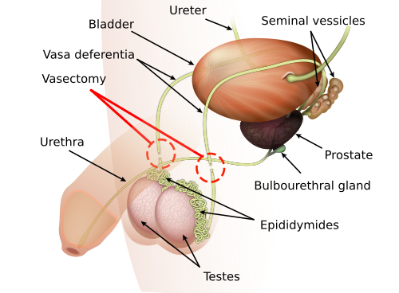

# ESTERILIZAÇÃO E LAQUEADURA

Para entender o planejamento familiar no Brasil, você precisa vestir a pele de um médico que atua na ponta, seja na Unidade Básica de Saúde ou no Centro Cirúrgico. As bancas de residência não querem apenas que você saiba a técnica cirúrgica, elas querem saber se você conhece as regras do jogo. E as regras mudaram drasticamente com a Lei 14.443 de 2022.

Nesta aula, vamos dissecar desde a legislação atualizada até os detalhes da anticoncepção de emergência, que frequentemente aparece misturada a este tema. Prepare-se: o que você aprendeu há dois ou três anos pode estar obsoleto.

## O Marco Legal: Lei 9.263/1996 e as Alterações da Lei 14.443/2022

Este é o ponto onde a maioria dos alunos perde pontos preciosos. A Lei do Planejamento Familiar (Lei 9.263/96) foi profundamente alterada pela Lei 14.443/2022, que entrou em vigor em março de 2023. Se a sua questão de prova for de 2024 ou 2025, ela já cobra a regra nova.

### Critérios para Esterilização Voluntária

Atualmente, para que um homem ou uma mulher realize a esterilização voluntária (laqueadura ou vasectomia), os critérios são:

- **Capacidade Civil Plena:** O indivíduo deve ser maior de idade e capaz de exprimir sua vontade.

- **Idade Mínima:** 21 anos. (Antes eram 25 anos).

- **Número de Filhos:** Se a pessoa tiver pelo menos 2 filhos vivos, a idade mínima de 21 anos não é necessária. Ou seja, uma mulher de 19 anos com 2 filhos vivos pode fazer a laqueadura legalmente.

- **Prazo de Reflexão:** Deve haver um intervalo mínimo de 60 dias entre a manifestação da vontade e o ato cirúrgico. Esse tempo serve para aconselhamento, oferta de outros métodos e para evitar decisões impulsivas.

**A Grande Mudança: O Consentimento Conjugal**
Cuidado aqui! Este é o maior "pega" das provas recentes. Pela nova lei, **NÃO é mais necessário o consentimento do cônjuge** para a realização da esterilização. A autonomia sobre o próprio corpo é individual. Se a questão trouxer um caso clínico de uma mulher casada cujo marido se recusa a assinar, a conduta correta é prosseguir com o desejo da paciente, desde que os outros critérios legais sejam preenchidos.

### Esterilização durante o Parto (Laqueadura Intraparto)

Antigamente, a regra era: proibido fazer laqueadura durante o parto, exceto em casos de sucessivas cesáreas anteriores ou risco de vida. Esqueça isso para a prova atual.

Segundo a Lei 14.443/2022, a laqueadura pode ser feita no momento do parto, desde que:

- A paciente tenha manifestado esse desejo com, no mínimo, 60 dias de antecedência ao parto.

- Sejam observadas as condições médicas ideais.

Por que essa mudança? Para garantir o direito reprodutivo e evitar que a mulher precise se submeter a um segundo procedimento cirúrgico e uma nova anestesia apenas para a esterilização. No MedEvo, sempre reforçamos: o foco da nova lei é a desburocratização.

### Tabela 1: Comparativo da Legislação de Esterilização

| Critério | Regra Antiga (Pré-2022) | Regra Atual (Lei 14.443/2022) |
| --- | --- | --- |
| Idade Mínima | 25 anos | 21 anos |
| Filhos Vivos | 2 filhos (independente da idade) | 2 filhos (independente da idade) |
| Consentimento do Cônjuge | Obrigatório se casado(a) | **DISPENSADO** |
| Laqueadura no Parto | Proibida (salvo exceções restritas) | **PERMITIDA** (com 60 dias de aviso) |
| Prazo de Reflexão | 60 dias | 60 dias |

## Esterilização em Casos de Risco à Vida ou Saúde

Existe uma exceção importante aos critérios de idade e número de filhos. A esterilização pode ser indicada quando a gravidez futura representar um risco grave à saúde da mulher ou do futuro conceito.

Nesses casos, a lei exige um relatório escrito e assinado por **dois médicos**. Não precisa ser necessariamente um ginecologista, mas o rigor de dois profissionais visa proteger tanto o paciente quanto a equipe médica de decisões unilaterais em casos de alta complexidade clínica.

## Aspectos Éticos e Bioéticos: A Autonomia em Foco

Como professor, vejo muitos alunos confundirem o papel do médico aqui. O médico não "autoriza" a laqueadura; ele avalia se os critérios legais estão preenchidos e garante que a paciente recebeu todas as informações.

A autonomia da paciente é o pilar. No entanto, a lei proíbe a esterilização em pessoas absolutamente incapazes, exceto mediante autorização judicial, com processo específico para este fim. Isso evita abusos históricos contra pessoas com deficiência intelectual.

## Métodos de Esterilização Feminina: A Laqueadura Tubária

A laqueadura tubária é o método contraceptivo mais utilizado no Brasil, embora o uso de LARCs (Long-Acting Reversible Contraceptives), como o DIU e o implante, esteja crescendo.

*Figura 1 - Diagrama ilustrando a laqueadura tubária, procedimento de esterilização feminina com secção e ligadura das tubas uterinas. Fonte: Hariadhi, CC BY-SA 4.0 | Wikimedia Commons*

## Técnicas Cirúrgicas

As bancas ocasionalmente cobram os nomes das técnicas. As principais são:

- **Pomeroy:** É a mais comum. Consiste em pinçar a tuba formando uma alça, amarrar a base com fio absorvível e cortar o topo da alça. Por que fio absorvível? Porque quando o fio cai, as pontas da tuba se afastam, dificultando a recanalização espontânea.

- **Uchida:** Envolve a dissecção do mesossalpinge e a sepultamento de um dos cotos tubários. É mais complexa, mas tem taxas de falha baixíssimas.

- **Irving:** O coto tubário é implantado no miométrio. Muito eficaz, mas tecnicamente mais difícil.

- **Salpingectomia Total:** Atualmente, muitos serviços preferem retirar toda a tuba (salpingectomia) em vez de apenas ligar. Por quê? Porque estudos mostram que o câncer de ovário epitelial mais comum (seroso de alto grau) na verdade começa nas fímbrias da tuba uterina. Ao retirar a tuba, reduzimos o risco de câncer de ovário no futuro.

### Eficácia e o Índice de Pearl

Nenhum método é 100% eficaz, exceto a abstinência. A laqueadura tem um Índice de Pearl de aproximadamente 0,5 (0,5 gravidezes a cada 100 mulheres em um ano).

**Dica de Prova:** O implante de etonogestrel (subdérmico) tem uma eficácia superior à própria laqueadura tubária. Se a questão perguntar qual método é mais eficaz, e o implante estiver entre as opções, ele ganha da laqueadura.

### Complicações e a "Síndrome Pós-Laqueadura"

Muitas pacientes chegam ao consultório queixando-se de que, após a laqueadura, a menstruação ficou irregular, o fluxo aumentou ou a libido diminuiu.

Na prova, você deve marcar que: **não há evidência científica robusta que comprove a existência da síndrome pós-laqueadura**. As alterações menstruais geralmente ocorrem porque a mulher parou de usar um método hormonal (como a pílula) que controlava o ciclo, ou simplesmente pelo envelhecimento natural do eixo hipotálamo-hipófise-ovário. A libido não deve ser afetada, pois a cirurgia não mexe na produção hormonal ovariana.

*Figura 2 - Diagrama anatômico da vasectomia, mostrando a secção e ligadura dos ductos deferentes que impedem a passagem dos espermatozoides. Fonte: K. D. Schroeder, CC BY-SA 3.0 | Wikimedia Commons*

## Esterilização Masculina: Vasectomia

A vasectomia é um procedimento muito mais simples, seguro e barato que a laqueadura. É feita com anestesia local, sem necessidade de abrir a cavidade abdominal.

### O Ponto Crítico: A Eficácia não é Imediata

Este é o erro clássico de prova e de vida real. Diferente da laqueadura, que tem efeito imediato, a vasectomia exige um período de espera. Existem espermatozoides armazenados nas vesículas seminais e nos ductos deferentes acima do local do corte.

**Conduta Pós-Vasectomia:**

- O homem deve utilizar outro método contraceptivo (geralmente preservativo) por, no mínimo, **3 meses ou após 20 ejaculações**.

- A confirmação da esterilidade só é dada após um **Espermograma** que demonstre azoospermia (zero espermatozoides) ou apenas espermatozoides imóveis raros.

### Tabela 2: Laqueadura vs. Vasectomia

| Característica | Laqueadura Tubária | Vasectomia |
| --- | --- | --- |
| Complexidade | Alta (Intra-abdominal) | Baixa (Ambulatorial) |
| Anestesia | Geral ou Bloqueio (Raqui/Peridural) | Local |
| Eficácia | Imediata | **NÃO imediata** (3 meses/20 ejacs) |
| Complicações | Infecção, lesão de órgãos, riscos anestésicos | Hematoma, granuloma espermático |
| Custo | Mais elevado | Mais baixo |

## Anticoncepção de Emergência (AE)

Embora o tema principal seja esterilização, as bancas adoram correlacionar o planejamento familiar com a "pílula do dia seguinte". Como o Dr. Will sempre diz nas aulas do MedEvo, você precisa saber o mecanismo de ação para não cair em pegadinha ideológica de prova.

### Mecanismo de Ação

A anticoncepção de emergência **NÃO é abortiva**. Ela atua basicamente de duas formas:

- **Inibição ou atraso da ovulação:** Ela impede que o pico de LH aconteça. Se a mulher já ovulou, a eficácia cai drasticamente.

- **Alteração do muco cervical:** Dificulta a subida dos espermatozoides.

Ela não impede a nidação (implantação do embrião já formado) e não interfere em uma gravidez já estabelecida.

### Métodos e Doses

-

**Levonorgestrel (Preferencial):**

- Dose: 1,5 mg em dose única (ou duas doses de 0,75 mg com intervalo de 12h, mas a dose única é preferível pela adesão).

- Janela de uso: Até 72 horas (3 dias) para eficácia máxima, podendo ser usada com eficácia reduzida até 120 horas (5 dias).

- Vantagem: Menos efeitos colaterais (náuseas e vômitos) que o método Yuzpe.

-

**Método de Yuzpe:**

- Uso de pílulas anticoncepcionais comuns em altas doses (Etinilestradiol + Levonorgestrel).

- Praticamente em desuso devido à alta taxa de efeitos colaterais.

-

**DIU de Cobre:**

- É o método de anticoncepção de emergência **mais eficaz que existe**.

- Pode ser inserido até 5 dias após o coito desprotegido.

- Vantagem: Já serve como método contraceptivo de longo prazo.

### Manejo de Intercorrências na AE

Se a paciente tomar o Levonorgestrel e **vomitar em menos de 2 a 3 horas**, a dose deve ser repetida. Se o vômito ocorrer após esse período, a absorção já foi suficiente e não precisa repetir.

## Reprodução Assistida e Bioética

O Conselho Federal de Medicina (CFM) atualiza periodicamente as normas para reprodução assistida (Resolução 2.320/2022). Isso cai muito em provas de ética médica e ginecologia.

### Doação de Gametas

- A doação deve ser anônima (doador não sabe para quem vai, receptor não sabe de quem é).

- Não pode ter caráter lucrativo ou comercial.

- Idade limite para doar: 37 anos para mulheres e 45 anos para homens (existem exceções, mas essa é a regra geral).

### Gestação de Substituição ("Barriga de Aluguel")

No Brasil, o termo correto é **Cessão Temporária de Útero**.

- Proibido qualquer caráter comercial (não se pode pagar pelo aluguel do útero).

- A cedente deve ter ao menos um filho vivo.

- A cedente deve pertencer à família de um dos parceiros num parentesco de até **quarto grau** (mãe, irmã, avó, tia ou prima). Se não for parente, precisa de autorização do CRM.

### Casais Homoafetivos e Pessoas Solteiras

É permitido o uso das técnicas de reprodução assistida para casais homoafetivos e pessoas solteiras, respeitando-se as regras de doação de gametas e cessão de útero. No caso de casal masculino, será necessária a doação de oócitos e a cessão temporária de útero.

## Situações Especiais e Violência Sexual

Em casos de violência sexual, a anticoncepção de emergência é uma prioridade absoluta no atendimento inicial.

**Protocolo de Violência Sexual:**

- **Profilaxia de Gravidez:** Levonorgestrel 1,5 mg imediatamente.

- **Profilaxia de ISTs não virais:** Azitromicina (Clamídia), Ceftriaxona (Gonorreia), Penicilina Benzatina (Sífilis).

- **Profilaxia de HIV:** PEP (Profilaxia Pós-Exposição) por 28 dias, idealmente iniciada nas primeiras 2 horas, no máximo até 72 horas.

- **Profilaxia de Hepatite B:** Vacina e Imunoglobulina (se não vacinada).

Lembre-se: o aborto é legal no Brasil em caso de estupro, risco de vida materno e anencefalia fetal. Para o aborto por estupro, **não é necessário boletim de ocorrência ou autorização judicial**, basta o relato da paciente e a assinatura de termos de responsabilidade no serviço de saúde.

## Diagnóstico Diferencial e Manejo de Falhas

Se uma paciente com laqueadura tubária chega com atraso menstrual e dor abdominal, o seu primeiro pensamento deve ser: **Prenhez Ectópica**.

Embora a laqueadura diminua o risco absoluto de gravidez, se a gravidez ocorrer, o risco relativo de ela ser ectópica é muito maior. Isso acontece porque a cicatrização da tuba pode criar trajetos tortuosos ou fístulas que permitem a passagem do espermatozoide, mas impedem a descida do blastocisto, que é muito maior.

### Tabela 3: Anticoncepção de Emergência - Comparativo

| Método | Eficácia | Tempo Limite | Principal Mecanismo |
| --- | --- | --- | --- |
| Levonorgestrel | Alta | 72h (até 120h) | Inibe/Atrasa Ovulação |
| DIU de Cobre | **Altíssima** | 120h (5 dias) | Citotóxico / Impede fecundação |
| Método Yuzpe | Moderada | 72h | Inibe/Atrasa Ovulação |
| Ulipristal* | Altíssima | 120h | Modulador do receptor de progesterona |

**O Ulipristal ainda é de difícil acesso em muitos serviços públicos no Brasil, mas aparece em provas citando literatura internacional.*

## O Papel do Aconselhamento

Antes de qualquer método definitivo, o médico deve oferecer e explicar todos os métodos reversíveis de longa duração (LARCs). Muitas vezes, a paciente deseja a laqueadura por medo de esquecer a pílula. Ao apresentar o DIU de cobre, o DIU de Mirena ou o Implante, que duram de 3 a 10 anos e têm eficácia igual ou superior à laqueadura, a paciente pode mudar de ideia. Isso faz parte do planejamento familiar ético.

No MedEvo, enfatizamos que o "sucesso" no planejamento familiar não é fazer o procedimento que o médico acha melhor, mas sim garantir que a paciente tome uma decisão informada e segura.

## Pontos-Chave para Prova

- **Lei 14.443/2022:** Idade mínima de 21 anos OU 2 filhos vivos.

- **Consentimento Conjugal:** NÃO é mais necessário para nenhum dos cônjuges.

- **Laqueadura no Parto:** Permitida, desde que solicitada 60 dias antes do procedimento.

- **Prazo de Reflexão:** 60 dias entre a decisão documentada e a cirurgia.

- **Vasectomia:** Não tem efeito imediato. Exige espermograma após 3 meses ou 20 ejaculações.

- **Eficácia:** O implante subdérmico de etonogestrel é o método mais eficaz disponível (Índice de Pearl 0,05).

- **Anticoncepção de Emergência (AE):** O mecanismo principal é o atraso ou inibição da ovulação. Não é abortiva.

- **Levonorgestrel na AE:** Dose única de 1,5 mg é o padrão-ouro farmacológico.

- **DIU de Cobre na AE:** É o método de emergência mais eficaz e pode ser inserido até o 5º dia pós-coito.

- **Vômitos na AE:** Se ocorrerem em menos de 2-3 horas após a ingestão do comprimido, deve-se repetir a dose.

- **Síndrome Pós-Laqueadura:** Não possui comprovação científica; as queixas costumam ser por suspensão de anticoncepcionais hormonais prévios.

- **Risco de Vida:** Se houver risco à saúde da mulher, a esterilização pode ser feita sem os critérios de idade/filhos, exigindo assinatura de 2 médicos.

- **Capacidade Civil:** Pessoas absolutamente incapazes só podem ser esterilizadas com autorização judicial.

- **Câncer de Ovário:** A salpingectomia bilateral profilática durante a laqueadura reduz o risco de câncer seroso de alto grau.

- **Gravidez após Laqueadura:** Sempre suspeitar de gestação ectópica até que se prove o contrário.

- **Reprodução Assistida:** Cessão de útero permitida para parentes de até 4º grau, sem fins lucrativos. 🏆

 Cópia offline para consulta pessoal.
 Fonte original:
 [https://www.medevo.com.br/material-apoio/ler/1d9d9071-4297-4d1f-bb49-be8a1fe90d7b](https://www.medevo.com.br/material-apoio/ler/1d9d9071-4297-4d1f-bb49-be8a1fe90d7b)
