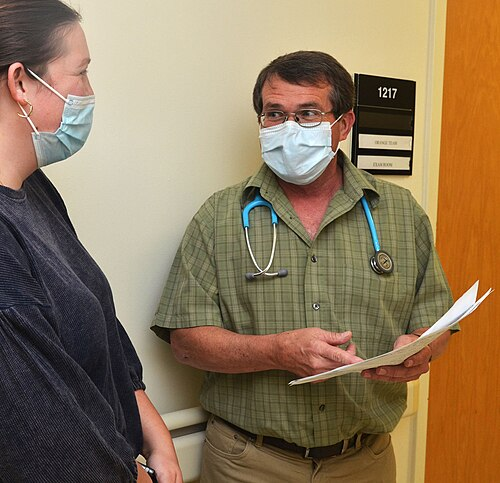
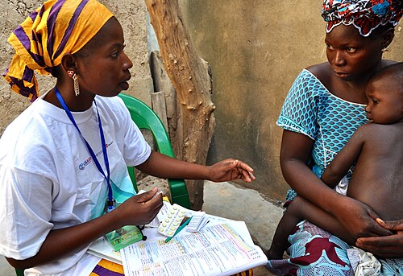

# ESTRATÉGIA SAÚDE DA FAMÍLIA

A Estratégia Saúde da Família, ou ESF, não é apenas um "setor" do SUS. Para a sua prova e para a sua vida prática, entenda que a ESF é a forma como o Brasil escolheu organizar o sistema de saúde. Ela é o "maestro" da rede. Se você entender que a ESF busca reorientar o modelo assistencial, saindo daquele foco hospitalocêntrico e focado na doença para um foco na pessoa e no território, você já acertou metade das questões de Medicina Preventiva.

Muitos alunos confundem a ESF com um simples programa de governo. Cuidado: a Política Nacional de Atenção Básica (PNAB) deixa claro que ela é uma estratégia prioritária para expansão e consolidação da Atenção Primária à Saúde (APS). Ela não é um "puxadinho" do hospital, ela é a porta de entrada preferencial.

*Figura 1 - Médico e enfermeira em clínica de Medicina de Família, modelo de atenção primária centrado na longitudinalidade e integralidade do cuidado. Fonte: Navy Medicine, Domínio Público | Wikimedia Commons*

## Os Atributos da Atenção Primária à Saúde

Este é o tópico que mais cai. Se você souber os atributos de Barbara Starfield, você resolve 30% das questões de Preventiva. A banca vai tentar te confundir trocando as definições, então preste atenção no "porquê" de cada um.

### Atributos Essenciais

Os atributos essenciais são o alicerce. Sem eles, não existe APS de verdade.

-

**Acesso de Primeiro Contato:** A Unidade Básica de Saúde (UBS) deve ser a porta de entrada. Isso significa acessibilidade (geográfica, financeira e temporal) e utilização do serviço para cada novo problema. Se o paciente tem uma dor lombar e vai direto ao pronto-socorro, houve uma falha no acesso de primeiro contato.

-

**Longitudinalidade:** É o acompanhamento ao longo do tempo, independentemente da presença ou ausência de doença. Aqui o foco é o vínculo. O médico conhece o paciente, sua história e seus medos. Isso reduz custos e iatrogenias. Em provas, se a questão fala de "vínculo" ou "acompanhamento ao longo dos anos", a resposta é longitudinalidade.

-

**Integralidade:** Significa que a equipe deve oferecer todos os serviços que o paciente precisa, seja promoção, prevenção, cura ou reabilitação. Também significa olhar o paciente como um todo, não apenas como um "joelho que dói". Se a UBS não tem o serviço (ex: uma cirurgia), ela deve garantir que o paciente o receba em outro lugar da rede.

-

**Coordenação do Cuidado:** É o papel de "maestro". Mesmo que o paciente seja atendido pelo cardiologista no hospital, a equipe da ESF deve saber o que foi feito, integrar essa informação no prontuário e continuar o cuidado. A falha na comunicação entre os níveis de atenção é uma violação da coordenação.

### Atributos Derivados

Estes qualificam a atenção, tornando-a mais humana e eficaz.

-

**Orientação Familiar:** O indivíduo não é uma ilha. Ele vive em uma família. A equipe deve considerar o contexto familiar e as ferramentas de abordagem familiar (que veremos adiante) para entender o processo saúde-doença.

-

**Orientação Comunitária:** A equipe deve conhecer a epidemiologia do seu território. Se há muitos casos de dengue no bairro, a equipe precisa agir na comunidade, não apenas tratar o paciente individualmente no consultório.

-

**Competência Cultural:** É a capacidade de se adaptar à cultura, linguagem e costumes da população local. Não adianta prescrever uma dieta caríssima para uma população em situação de vulnerabilidade social.

| Atributo | Conceito Chave para Prova |
| --- | --- |
| Acesso | Porta de entrada, disponibilidade, acolhimento. |
| Longitudinalidade | Vínculo, tempo, conhecer a história do paciente. |
| Integralidade | Cuidado biopsicossocial, oferta de serviços diversos. |
| Coordenação | Sincronia entre níveis de atenção, prontuário único. |

## A Política Nacional de Atenção Básica (PNAB 2017)

A Portaria 2.436/2017 é o marco legal vigente. Você precisa saber as regras do jogo que ela estabelece. Um erro comum é estudar por diretrizes antigas (como a de 2011). Na MedEvo, sempre focamos na atualização, pois as bancas adoram cobrar as mudanças da PNAB 2017.

*Figura 2 - Agente comunitário de saúde realizando atendimento domiciliar, elemento central da Estratégia Saúde da Família como elo entre a comunidade e a equipe de saúde. Fonte: President's Malaria Initiative, Domínio Público | Wikimedia Commons*

## Composição da Equipe de Saúde da Família (eSF)

A composição mínima obrigatória é:

- Médico (preferencialmente de Família e Comunidade).

- Enfermeiro.

- Auxiliar ou Técnico de Enfermagem.

- Agente Comunitário de Saúde (ACS).

A equipe de Saúde Bucal (Cirurgião-dentista e Auxiliar/Técnico) pode ser integrada, mas a PNAB 2017 permitiu a existência de equipes sem dentista, embora a ESF continue sendo o modelo prioritário.

### Carga Horária e População Adscrita

A carga horária para todos os profissionais da eSF é de 40 horas semanais. Cuidado com a pegadinha: a PNAB 2017 permitiu a "Equipe de Atenção Básica" (eAB) com carga horária diferenciada, mas para ser chamada de "Estratégia Saúde da Família", a regra das 40h e a presença do ACS são fundamentais.

Quanto à população, a recomendação é de 2.000 a 3.500 pessoas por equipe. Por que esse número? Porque se houver gente demais, perde-se a longitudinalidade e o acesso. Se houver gente de menos, o sistema torna-se economicamente inviável. Em áreas de grande vulnerabilidade, esse número deve ser menor.

### O Papel do Agente Comunitário de Saúde (ACS)

O ACS é o elo entre a comunidade e a UBS. Ele deve morar na área onde atua. Suas funções são focadas na promoção da saúde, prevenção de doenças e mapeamento de riscos.

Atenção: o ACS NÃO faz procedimentos técnicos de enfermagem ou medicina (como curativos complexos ou prescrições). Se a questão de prova disser que o ACS está aferindo pressão de forma isolada para diagnóstico ou prescrevendo medicação, está errado. Ele identifica o risco e traz para a equipe.

## Ferramentas de Abordagem Familiar

Na ESF, a família é a unidade de cuidado. Para entender essa família, usamos ferramentas diagnósticas que caem em TODA prova de residência.

### Genograma

É a representação gráfica da família em pelo menos três gerações. Ele não mostra apenas quem é parente de quem, mas sim a dinâmica das relações (quem briga com quem, quem é muito próximo, quem já morreu e de quê).

Dica de prova: o genograma foca na estrutura interna e na história biológica/relacional. Se a questão mostrar um desenho com quadrados (homens) e círculos (mulheres) e perguntar o nome, é Genograma.

### Ecomapa

Diferente do genograma, o ecomapa olha para fora. Ele mostra a relação da família com o meio ambiente, igreja, trabalho, escola, UBS e vizinhos. É excelente para identificar redes de apoio social. Se o paciente está isolado e não tem apoio, o ecomapa mostrará poucas linhas de conexão.

### Outras Ferramentas (APGAR e PRACTICE)

- **APGAR Familiar:** Avalia a satisfação dos membros com o funcionamento da família. É um acrônimo para Adaptação, Participação, Crescimento, Afeto e Resolução. Se o escore for baixo, indica disfunção familiar.

- **PRACTICE:** Usado para organizar o atendimento de famílias em situações complexas (Problema, Relações, Acordo, Cuidado, etc.).

| Ferramenta | O que avalia? | Foco Principal |
| --- | --- | --- |
| Genograma | Estrutura e relações internas (3 gerações). | Genética e dinâmica relacional. |
| Ecomapa | Relação da família com o mundo externo. | Suporte social e intersetorialidade. |
| APGAR | Satisfação individual com a família. | Funcionalidade familiar subjetiva. |
| FIRO | Intimidade, controle e inclusão. | Poder e proximidade na família. |

## Método Clínico Centrado na Pessoa (MCCP)

Este é o "jeito de ser" do Médico de Família. O modelo biomédico tradicional foca na doença (disease). O MCCP foca na experiência do adoecimento (illness). Como o Dr. Will sempre reforça, não tratamos uma pneumonia, tratamos uma pessoa que está com pneumonia e que tem medo de perder o emprego por causa disso.

O MCCP é dividido em quatro componentes principais:

- **Explorando a saúde, a doença e a experiência de adoecer:** Aqui usamos o mnemônico SIFE (Sentimentos, Ideias, Funcionalidade e Expectativas). O que o paciente acha que tem? O que ele teme?

- **Entendendo a pessoa como um todo:** Contexto individual, familiar e social.

- **Elaborando um plano conjunto de manejo:** O médico não impõe, ele negocia. Se o paciente não concorda com o tratamento, ele não vai aderir. A decisão é compartilhada.

- **Intensificando a relação médico-pessoa:** Investir no vínculo e na confiança.

## Níveis de Prevenção

Este conceito é clássico e as bancas adoram as definições de Leavell & Clark, mas com foco especial na Prevenção Quaternária.

- **Prevenção Primária:** Age antes da doença existir. Foco: remover causas e fatores de risco. Exemplos: Vacinação, uso de preservativo, orientar atividade física.

- **Prevenção Secundária:** A doença já existe, mas é subclínica (assintomática). Foco: diagnóstico precoce e rastreamento. Exemplos: Papanicolau, mamografia de rastreamento, teste do pezinho.

- **Prevenção Terciária:** A doença já causou danos. Foco: reabilitação e redução de incapacidades. Exemplo: Fisioterapia pós-AVC, uso de betabloqueador pós-IAM para evitar novo evento.

- **Prevenção Quaternária (P4):** Este é o conceito do momento. P4 é a detecção de indivíduos em risco de intervenções médicas excessivas (sobremedicalização) para protegê-los de novas intervenções desnecessárias e sugerir alternativas eticamente aceitáveis.

Por que fazemos P4? Porque "primeiro, não causar dano" (primum non nocere). Exemplo: Não pedir um PSA para um paciente de 90 anos com múltiplas comorbidades, ou não prescrever antibiótico para uma gripe viral apenas para "satisfazer" o paciente.

## Organização do Processo de Trabalho

Para a ESF funcionar, ela precisa de organização. Não é apenas abrir a porta e atender quem chega.

### Territorialização e Adscrição

Territorialização não é apenas desenhar um mapa. É entender a dinâmica daquele território: onde tem esgoto a céu aberto, onde tem tráfico de drogas, onde as pessoas se reúnem. A adscrição é o ato de vincular as pessoas a uma equipe específica. Isso garante que o paciente tenha "nome e sobrenome" para a equipe, favorecendo a longitudinalidade.

### Acolhimento e Gestão da Clínica

O acolhimento não é uma triagem! Triagem exclui (você não é daqui, vá embora). O acolhimento inclui e classifica o risco. Todo mundo que chega na UBS deve ser acolhido, escutado e ter sua demanda classificada.

A gestão da clínica na APS envolve o uso de protocolos baseados em evidências, mas com flexibilidade para a singularidade de cada caso. O registro deve ser feito preferencialmente no formato SOAP:

- **S (Subjetivo):** O que o paciente diz (queixa principal, SIFE).

- **O (Objetivo):** O que o médico vê (exame físico, exames complementares).

- **A (Avaliação):** O raciocínio clínico, diagnósticos ou problemas identificados.

- **P (Plano):** O que será feito (terapêutica, exames, orientações, retorno).

### Apoio Matricial e eMulti

Antigamente tínhamos o NASF (Núcleo de Apoio à Saúde da Família). Hoje, a terminologia atualizada foca nas equipes eMulti (Equipes Multiprofissionais na Atenção Primária).

O conceito fundamental aqui é o **Apoio Matricial**. O eMulti não é um local para onde você simplesmente "manda" o paciente e esquece. É uma retaguarda especializada que atua junto com a eSF. Eles fazem discussões de casos, atendimentos conjuntos e ajudam a aumentar a resolutividade da equipe de referência. Se o médico da ESF e o psicólogo do eMulti atendem juntos um paciente com depressão grave, o médico aprende mais sobre saúde mental e o psicólogo entende o contexto clínico. Isso é educação permanente.

## Promoção da Saúde vs. Prevenção de Doenças

Muitos alunos acham que é a mesma coisa. Não é.

- **Prevenção:** Foco na doença. Queremos evitar que uma doença específica apareça ou progrida. É baseada no modelo biomédico.

- **Promoção:** Foco na saúde e na autonomia. Queremos aumentar o bem-estar e atuar nos Determinantes Sociais da Saúde (moradia, lazer, educação, saneamento). O Programa Saúde na Escola (PSE) é um exemplo clássico de estratégia intersetorial de promoção da saúde.

## Financiamento da APS (ATUALIZAÇÃO 2024)

> **ATENÇÃO:** A Portaria GM/MS nº 3.493/2024 instituiu o **Novo Modelo de Cofinanciamento Federal da APS**, substituindo o Previne Brasil (2019).

### Os 6 Componentes do Novo Modelo (memorize: "FVQIPS")

| Componente | Descrição |
| --- | --- |
| **1. Fixo** | Valor garantido por equipe (NOVIDADE!) - eSF recebe mais que eAP |
| **2. Vínculo e Acompanhamento Territorial** | Baseado em cadastro, vínculo e acompanhamento (substitui capitação ponderada) |
| **3. Qualidade** | Indicadores pactuados tripartite (reformula pagamento por desempenho) |
| **4. Implantação e Manutenção** | Programas e serviços (eMulti, PSE, ACS, etc.) |
| **5. Per Capita de Base Populacional** | Calculado pela estimativa IBGE |
| **6. Saúde Bucal** | Específico para eSB, CEO, LRPD |

### Classificação por Desempenho (Vínculo e Qualidade)

| Classificação | Valor eSF |
| --- | --- |
| **Ótimo** | R8.000 |
| **Bom** | R 6.000 |
| **Suficiente** | R4.000 |
| **Regular** | R 2.000 |

### Indicadores de Qualidade (para eSF/eAP)

- Mais Acesso à APS | Cuidado DM e HAS | Desenvolvimento Infantil

- Gestação e Puerpério | Pessoa Idosa | Prevenção do Câncer na Mulher

### Comparação Rápida: Previne Brasil vs Novo 2024

| Previne Brasil (2019) | Novo Modelo (2024) |
| --- | --- |
| Capitação Ponderada | Vínculo Territorial + Per Capita (separados) |
| Pagamento por Desempenho | Componente de Qualidade |
| Sem valor fixo | **Componente Fixo garantido** |

**Pegadinha de prova:** O componente FIXO é a grande novidade - garante repasse mensal independente de desempenho, valorizando a ESF sobre eAP.

O modelo anterior (Previne Brasil, 2019) focava em três pilares:

- **Capitação Ponderada:** O município recebe dinheiro de acordo com o número de pessoas cadastradas (adscrição). Pessoas vulneráveis (Bolsa Família, idosos, crianças) "valem" mais no cálculo.

- **Pagamento por Desempenho:** O município recebe bônus se atingir metas de indicadores de saúde (ex: proporção de gestantes com pré-natal adequado, cobertura vacinal de pólio, controle de hipertensos e diabéticos).

- **Incentivo para Ações Estratégicas:** Dinheiro para programas específicos, como o Saúde na Hora (UBS que funciona até mais tarde), equipes de Consultório na Rua e residência médica.

## Desafios e Erros Comuns em Provas

Um cenário comum em questões é o paciente que chega com uma urgência na UBS. A alternativa errada vai dizer: "Encaminhe imediatamente para a UPA, pois a UBS só faz prevenção".

O correto: A APS deve atender urgências de baixa complexidade e estabilizar urgências graves antes da remoção. A UBS é porta de entrada para a rede, inclusive para demandas agudas. Negar atendimento a uma demanda aguda é violar o princípio do Acesso.

Outro erro: Achar que a ESF é responsável apenas por grupos de risco (hipertensos e diabéticos). A ESF é para todos, independentemente da patologia. O foco é a população do território.

## Pontos-Chave para Prova

- **Atributos Essenciais:** Acesso, Longitudinalidade, Integralidade e Coordenação do Cuidado. Memorize estes quatro nomes.

- **PNAB 2017:** É a diretriz atual. Permite eAB, mas prioriza a ESF. População recomendada: 2.000 a 3.500 pessoas por equipe.

- **Equipe Mínima ESF:** Médico, Enfermeiro, Técnico de Enfermagem e ACS. Todos 40h semanais.

- **Genograma:** Representa pelo menos 3 gerações. Foco na estrutura e dinâmica interna.

- **Ecomapa:** Representa a relação da família com o meio externo (trabalho, igreja, saúde).

- **Prevenção Quaternária:** Evitar o excesso de intervenção médica e a iatrogenia. "Primum non nocere".

- **Apoio Matricial:** Não é referência e contrarreferência vertical. É compartilhamento de saberes e corresponsabilização entre eSF e eMulti.

- **MCCP:** SIFE (Sentimentos, Ideias, Funcionalidade e Expectativas). O plano terapêutico deve ser negociado e compartilhado.

- **ACS:** Deve morar na comunidade. Não faz procedimentos técnicos de enfermagem. É o elo da educação popular.

- **Acolhimento:** É uma postura ética de escuta e classificação de risco, não uma triagem administrativa.

- **Coordenação do Cuidado:** A UBS é o centro de comunicação da Rede de Atenção à Saúde (RAS).

- **Integralidade:** Olhar o indivíduo em todas as suas dimensões e garantir acesso a todos os níveis de complexidade se necessário.

- **Pérola de Prova:** A ESF é de baixa densidade tecnológica (equipamentos caros), mas de **ALTA complexidade** (conhecimento clínico, social e relacional). 🩺

 Cópia offline para consulta pessoal.
 Fonte original:
 [https://www.medevo.com.br/material-apoio/ler/779e16f5-a53f-4786-9bb7-91f683cff5e0](https://www.medevo.com.br/material-apoio/ler/779e16f5-a53f-4786-9bb7-91f683cff5e0)
